<html><head><meta content="text/html; charset=UTF-8" http-equiv="content-type"></head><body class="c97"><h2 class="c55" id="h.gjdgxs">&#1057;&#1054;&#1044;&#1045;&#1056;&#1046;&#1040;&#1053;&#1048;&#1045;</h2>
<a class="c2" href="#h.gjdgxs">&#1057;&#1054;&#1044;&#1045;&#1056;&#1046;&#1040;&#1053;&#1048;&#1045;</a><a class="c2" href="#h.gjdgxs">&nbsp;&nbsp;&nbsp;&nbsp;&nbsp;&nbsp;&nbsp;&nbsp;4</a>

<a class="c2" href="#h.30j0zll">&#1042;&#1042;&#1045;&#1044;&#1045;&#1053;&#1048;&#1045;&nbsp;&nbsp;&nbsp;&nbsp;&nbsp;&nbsp;&nbsp;&nbsp;&nbsp;&nbsp;&nbsp;&nbsp;&nbsp;&nbsp;&nbsp;&nbsp;6</a>

<a class="c2" href="#h.1fob9te">1.</a><a class="c2" href="#h.1fob9te">&nbsp;</a><a class="c2" href="#h.1fob9te">&#1040;&#1053;&#1040;&#1051;&#1048;&#1047; &#1055;&#1056;&#1054;&#1058;&#1054;&#1058;&#1048;&#1055;&#1054;&#1042;, &#1051;&#1048;&#1058;&#1045;&#1056;&#1040;&#1058;&#1059;&#1056;&#1053;&#1067;&#1061; &#1048;&#1057;&#1058;&#1054;&#1063;&#1053;&#1048;&#1050;&#1054;&#1042; &#1048; &#1060;&#1054;&#1056;&#1052;&#1048;&#1056;&#1054;&#1042;&#1040;&#1053;&#1048;&#1045; &#1058;&#1056;&#1045;&#1041;&#1054;&#1042;&#1040;&#1053;&#1048;&#1049; &#1050; &#1055;&#1056;&#1054;&#1045;&#1050;&#1058;&#1048;&#1056;&#1059;&#1045;&#1052;&#1054;&#1052;&#1059; &#1055;&#1056;&#1054;&#1043;&#1056;&#1040;&#1052;&#1052;&#1053;&#1054;&#1052;&#1059; &#1057;&#1056;&#1045;&#1044;&#1057;&#1058;&#1042;&#1059;&nbsp;&nbsp;&nbsp;&nbsp;&nbsp;&nbsp;&nbsp;&nbsp;7</a>

<a class="c2" href="#h.3znysh7">1.1.</a><a class="c2" href="#h.3znysh7">&nbsp;&nbsp;&nbsp;&nbsp;&nbsp;&nbsp;&nbsp;&nbsp;</a><a class="c2" href="#h.3znysh7">&#1054;&#1087;&#1080;&#1089;&#1072;&#1085;&#1080;&#1077; &#1089;&#1080;&#1085;&#1090;&#1072;&#1082;&#1089;&#1080;&#1089;&#1072; &#1103;&#1079;&#1099;&#1082;&#1072; &#1089; &#1087;&#1086;&#1084;&#1086;&#1097;&#1100;&#1102; &#1089;&#1080;&#1085;&#1090;&#1072;&#1082;&#1089;&#1080;&#1095;&#1077;&#1089;&#1082;&#1080;&#1093; &#1076;&#1080;&#1072;&#1075;&#1088;&#1072;&#1084;&#1084;&nbsp;&nbsp;&nbsp;&nbsp;&nbsp;&nbsp;&nbsp;&nbsp;7</a>

<a class="c2" href="#h.2et92p0">1.2.</a><a class="c2" href="#h.2et92p0">&nbsp;&nbsp;&nbsp;&nbsp;&nbsp;&nbsp;&nbsp;&nbsp;</a><a class="c2" href="#h.2et92p0">&#1040;&#1085;&#1072;&#1083;&#1080;&#1079; &#1089;&#1091;&#1097;&#1077;&#1089;&#1090;&#1074;&#1091;&#1102;&#1097;&#1080;&#1093; &#1072;&#1085;&#1072;&#1083;&#1086;&#1075;&#1086;&#1074;&nbsp;&nbsp;&nbsp;&nbsp;&nbsp;&nbsp;&nbsp;&nbsp;9</a>

<a class="c2" href="#h.tyjcwt">1.3.</a><a class="c2" href="#h.tyjcwt">&nbsp;&nbsp;&nbsp;&nbsp;&nbsp;&nbsp;&nbsp;&nbsp;</a><a class="c2" href="#h.tyjcwt">&#1055;&#1086;&#1089;&#1090;&#1072;&#1085;&#1086;&#1074;&#1082;&#1072; &#1079;&#1072;&#1076;&#1072;&#1095;&#1080;&nbsp;&nbsp;&nbsp;&nbsp;&nbsp;&nbsp;&nbsp;&nbsp;12</a>

<a class="c2" href="#h.3dy6vkm">2.</a><a class="c2" href="#h.3dy6vkm">&nbsp;</a><a class="c2" href="#h.3dy6vkm">&#1052;&#1054;&#1044;&#1045;&#1051;&#1048;&#1056;&#1054;&#1042;&#1040;&#1053;&#1048;&#1045; &#1055;&#1056;&#1045;&#1044;&#1052;&#1045;&#1058;&#1053;&#1054;&#1049; &#1054;&#1041;&#1051;&#1040;&#1057;&#1058;&#1048; &#1048; &#1056;&#1040;&#1047;&#1056;&#1040;&#1041;&#1054;&#1058;&#1050;&#1040; &#1060;&#1059;&#1053;&#1050;&#1062;&#1048;&#1054;&#1053;&#1040;&#1051;&#1068;&#1053;&#1067;&#1061; &#1058;&#1056;&#1045;&#1041;&#1054;&#1042;&#1040;&#1053;&#1048;&#1049;&nbsp;&nbsp;&nbsp;&nbsp;&nbsp;&nbsp;&nbsp;&nbsp;13</a>

<a class="c2" href="#h.1t3h5sf">2.1.</a><a class="c2" href="#h.1t3h5sf">&nbsp;&nbsp;&nbsp;&nbsp;&nbsp;&nbsp;&nbsp;&nbsp;</a><a class="c2" href="#h.1t3h5sf">&#1055;&#1088;&#1077;&#1076;&#1089;&#1090;&#1072;&#1074;&#1083;&#1077;&#1085;&#1080;&#1077; &#1074;&#1077;&#1082;&#1090;&#1086;&#1088;&#1085;&#1086;&#1075;&#1086; &#1080;&#1079;&#1086;&#1073;&#1088;&#1072;&#1078;&#1077;&#1085;&#1080;&#1103; &#1074; &#1092;&#1086;&#1088;&#1084;&#1072;&#1090;&#1077; SVG&nbsp;&nbsp;&nbsp;&nbsp;&nbsp;&nbsp;&nbsp;&nbsp;13</a>

<a class="c2" href="#h.4d34og8">2.2.</a><a class="c2" href="#h.4d34og8">&nbsp;&nbsp;&nbsp;&nbsp;&nbsp;&nbsp;&nbsp;&nbsp;</a><a class="c2" href="#h.4d34og8">&#1054;&#1087;&#1080;&#1089;&#1072;&#1085;&#1080;&#1077; &#1092;&#1091;&#1085;&#1082;&#1094;&#1080;&#1086;&#1085;&#1072;&#1083;&#1100;&#1085;&#1086;&#1089;&#1090;&#1080; &#1055;&#1057;&nbsp;&nbsp;&nbsp;&nbsp;&nbsp;&nbsp;&nbsp;&nbsp;15</a>

<a class="c2" href="#h.2s8eyo1">2.3.</a><a class="c2" href="#h.2s8eyo1">&nbsp;&nbsp;&nbsp;&nbsp;&nbsp;&nbsp;&nbsp;&nbsp;</a><a class="c2" href="#h.2s8eyo1">&#1057;&#1087;&#1077;&#1094;&#1080;&#1092;&#1080;&#1082;&#1072;&#1094;&#1080;&#1103; &#1092;&#1091;&#1085;&#1082;&#1094;&#1080;&#1086;&#1085;&#1072;&#1083;&#1100;&#1085;&#1099;&#1093; &#1090;&#1088;&#1077;&#1073;&#1086;&#1074;&#1072;&#1085;&#1080;&#1081;.&nbsp;&nbsp;&nbsp;&nbsp;&nbsp;&nbsp;&nbsp;&nbsp;16</a>

<a class="c2" href="#h.17dp8vu">3.</a><a class="c2" href="#h.17dp8vu">&nbsp;</a><a class="c2" href="#h.17dp8vu">&#1055;&#1056;&#1054;&#1045;&#1050;&#1058;&#1048;&#1056;&#1054;&#1042;&#1040;&#1053;&#1048;&#1045; &#1055;&#1056;&#1054;&#1043;&#1056;&#1040;&#1052;&#1052;&#1053;&#1054;&#1043;&#1054; &#1057;&#1056;&#1045;&#1044;&#1057;&#1058;&#1042;&#1040;&nbsp;&nbsp;&nbsp;&nbsp;&nbsp;&nbsp;&nbsp;&nbsp;19</a>

<a class="c2" href="#h.3rdcrjn">3.1.</a><a class="c2" href="#h.3rdcrjn">&nbsp;&nbsp;&nbsp;&nbsp;&nbsp;&nbsp;&nbsp;&nbsp;</a><a class="c2" href="#h.3rdcrjn">&#1055;&#1088;&#1086;&#1077;&#1082;&#1090;&#1080;&#1088;&#1086;&#1074;&#1072;&#1085;&#1080;&#1077; &#1076;&#1080;&#1085;&#1072;&#1084;&#1080;&#1095;&#1077;&#1089;&#1082;&#1080;&#1093; &#1089;&#1090;&#1088;&#1091;&#1082;&#1090;&#1091;&#1088; &#1076;&#1072;&#1085;&#1085;&#1099;&#1093;&nbsp;&nbsp;&nbsp;&nbsp;&nbsp;&nbsp;&nbsp;&nbsp;19</a>

<a class="c2" href="#h.26in1rg">3.2.</a><a class="c2" href="#h.26in1rg">&nbsp;&nbsp;&nbsp;&nbsp;&nbsp;&nbsp;&nbsp;&nbsp;</a><a class="c2" href="#h.26in1rg">&#1056;&#1072;&#1079;&#1088;&#1072;&#1073;&#1086;&#1090;&#1082;&#1072; &#1072;&#1083;&#1075;&#1086;&#1088;&#1080;&#1090;&#1084;&#1072; &#1088;&#1077;&#1072;&#1082;&#1094;&#1080;&#1080; &#1085;&#1072; &#1082;&#1083;&#1080;&#1082; &#1087;&#1086;&#1083;&#1100;&#1079;&#1086;&#1074;&#1072;&#1090;&#1077;&#1083;&#1103; &#1087;&#1086; &#1087;&#1086;&#1083;&#1086;&#1090;&#1085;&#1091;&nbsp;&nbsp;&nbsp;&nbsp;&nbsp;&nbsp;&nbsp;&nbsp;21</a>

<a class="c2" href="#h.lnxbz9">3.3.</a><a class="c2" href="#h.lnxbz9">&nbsp;&nbsp;&nbsp;&nbsp;&nbsp;&nbsp;&nbsp;&nbsp;</a><a class="c2" href="#h.lnxbz9">&#1056;&#1072;&#1079;&#1088;&#1072;&#1073;&#1086;&#1090;&#1082;&#1072; &#1072;&#1083;&#1075;&#1086;&#1088;&#1080;&#1090;&#1084;&#1072; &#1087;&#1077;&#1088;&#1077;&#1084;&#1077;&#1097;&#1077;&#1085;&#1080;&#1077; &#1090;&#1086;&#1095;&#1082;&#1080; &#1074;&#1085;&#1091;&#1090;&#1088;&#1080; &#1083;&#1080;&#1085;&#1080;&#1080;&nbsp;&nbsp;&nbsp;&nbsp;&nbsp;&nbsp;&nbsp;&nbsp;22</a>

<a class="c2" href="#h.35nkun2">3.4.</a><a class="c2" href="#h.35nkun2">&nbsp;&nbsp;&nbsp;&nbsp;&nbsp;&nbsp;&nbsp;&nbsp;</a><a class="c2" href="#h.35nkun2">&#1056;&#1072;&#1079;&#1088;&#1072;&#1073;&#1086;&#1090;&#1082;&#1072; &#1072;&#1083;&#1075;&#1086;&#1088;&#1080;&#1090;&#1084;&#1072; &laquo;&#1087;&#1088;&#1080;&#1084;&#1072;&#1075;&#1085;&#1080;&#1095;&#1080;&#1074;&#1072;&#1085;&#1080;&#1103; &#1092;&#1080;&#1075;&#1091;&#1088;&raquo;&nbsp;&nbsp;&nbsp;&nbsp;&nbsp;&nbsp;&nbsp;&nbsp;24</a>

<a class="c2" href="#h.1ksv4uv">3.4.1.</a><a class="c2" href="#h.1ksv4uv">&nbsp;&nbsp;&nbsp;&nbsp;&nbsp;&nbsp;&nbsp;&nbsp;</a><a class="c2" href="#h.1ksv4uv">&#1056;&#1072;&#1079;&#1088;&#1072;&#1073;&#1086;&#1090;&#1082;&#1072; &#1072;&#1083;&#1075;&#1086;&#1088;&#1080;&#1090;&#1084;&#1072; &#1087;&#1086;&#1080;&#1089;&#1082;&#1072; &#1083;&#1080;&#1085;&#1080;&#1080; &#1074;&#1073;&#1083;&#1080;&#1079;&#1080; &#1090;&#1086;&#1095;&#1082;&#1080;&nbsp;&nbsp;&nbsp;&nbsp;&nbsp;&nbsp;&nbsp;&nbsp;25</a>

<a class="c2" href="#h.44sinio">3.4.2.</a><a class="c2" href="#h.44sinio">&nbsp;&nbsp;&nbsp;&nbsp;&nbsp;&nbsp;&nbsp;&nbsp;</a><a class="c2" href="#h.44sinio">&#1056;&#1072;&#1079;&#1088;&#1072;&#1073;&#1086;&#1090;&#1082;&#1072; &#1072;&#1083;&#1075;&#1086;&#1088;&#1080;&#1090;&#1084;&#1072; &laquo;&#1087;&#1088;&#1080;&#1084;&#1072;&#1075;&#1085;&#1080;&#1095;&#1080;&#1074;&#1072;&#1085;&#1080;&#1103;&raquo; &#1083;&#1080;&#1085;&#1080;&#1080; &#1082; &#1090;&#1077;&#1082;&#1089;&#1090;&#1086;&#1074;&#1086;&#1081; &#1092;&#1080;&#1075;&#1091;&#1088;&#1077;&nbsp;&nbsp;&nbsp;&nbsp;&nbsp;&nbsp;&nbsp;&nbsp;26</a>

<a class="c2" href="#h.2jxsxqh">3.4.3.</a><a class="c2" href="#h.2jxsxqh">&nbsp;&nbsp;&nbsp;&nbsp;&nbsp;&nbsp;&nbsp;&nbsp;</a><a class="c2" href="#h.2jxsxqh">&#1056;&#1072;&#1079;&#1088;&#1072;&#1073;&#1086;&#1090;&#1082;&#1072; &#1072;&#1083;&#1075;&#1086;&#1088;&#1080;&#1090;&#1084;&#1072; &laquo;&#1087;&#1088;&#1080;&#1084;&#1072;&#1075;&#1085;&#1080;&#1095;&#1080;&#1074;&#1072;&#1085;&#1080;&#1103;&raquo; &#1090;&#1086;&#1095;&#1082;&#1080; &#1082; &#1083;&#1080;&#1085;&#1080;&#1080;&nbsp;&nbsp;&nbsp;&nbsp;&nbsp;&nbsp;&nbsp;&nbsp;28</a>

<a class="c2" href="#h.z337ya">3.4.4.</a><a class="c2" href="#h.z337ya">&nbsp;&nbsp;&nbsp;&nbsp;&nbsp;&nbsp;&nbsp;&nbsp;</a><a class="c2" href="#h.z337ya">&#1054;&#1073;&#1086;&#1073;&#1097;&#1077;&#1085;&#1080;&#1077; &#1072;&#1083;&#1075;&#1086;&#1088;&#1080;&#1090;&#1084;&#1086;&#1074; &laquo;&#1087;&#1088;&#1080;&#1084;&#1072;&#1075;&#1085;&#1080;&#1095;&#1080;&#1074;&#1072;&#1085;&#1080;&#1103;&raquo;&nbsp;&nbsp;&nbsp;&nbsp;&nbsp;&nbsp;&nbsp;&nbsp;29</a>

<a class="c2" href="#h.3j2qqm3">3.5.</a><a class="c2" href="#h.3j2qqm3">&nbsp;&nbsp;&nbsp;&nbsp;&nbsp;&nbsp;&nbsp;&nbsp;</a><a class="c2" href="#h.3j2qqm3">&#1056;&#1072;&#1079;&#1088;&#1072;&#1073;&#1086;&#1090;&#1082;&#1072; &#1072;&#1083;&#1075;&#1086;&#1088;&#1080;&#1090;&#1084;&#1072; &#1086;&#1090;&#1088;&#1080;&#1089;&#1086;&#1074;&#1082;&#1080; &#1083;&#1080;&#1085;&#1080;&#1081;&nbsp;&nbsp;&nbsp;&nbsp;&nbsp;&nbsp;&nbsp;&nbsp;30</a>

<a class="c2" href="#h.1y810tw">3.6.</a><a class="c2" href="#h.1y810tw">&nbsp;&nbsp;&nbsp;&nbsp;&nbsp;&nbsp;&nbsp;&nbsp;</a><a class="c2" href="#h.1y810tw">&#1056;&#1072;&#1079;&#1088;&#1072;&#1073;&#1086;&#1090;&#1082;&#1072; &#1072;&#1083;&#1075;&#1086;&#1088;&#1080;&#1090;&#1084; &#1086;&#1090;&#1088;&#1080;&#1089;&#1086;&#1074;&#1082;&#1080; &#1092;&#1080;&#1075;&#1091;&#1088;&nbsp;&nbsp;&nbsp;&nbsp;&nbsp;&nbsp;&nbsp;&nbsp;31</a>

<a class="c2" href="#h.4i7ojhp">4.</a><a class="c2" href="#h.4i7ojhp">&nbsp;</a><a class="c2" href="#h.4i7ojhp">&#1057;&#1054;&#1047;&#1044;&#1040;&#1053;&#1048;&#1045; (&#1050;&#1054;&#1053;&#1057;&#1058;&#1056;&#1059;&#1048;&#1056;&#1054;&#1042;&#1040;&#1053;&#1048;&#1045;) &#1055;&#1056;&#1054;&#1043;&#1056;&#1040;&#1052;&#1052;&#1053;&#1054;&#1043;&#1054; &#1057;&#1056;&#1045;&#1044;&#1057;&#1058;&#1042;&#1040;&nbsp;&nbsp;&nbsp;&nbsp;&nbsp;&nbsp;&nbsp;&nbsp;32</a>

<a class="c2" href="#h.2xcytpi">4.1.</a><a class="c2" href="#h.2xcytpi">&nbsp;&nbsp;&nbsp;&nbsp;&nbsp;&nbsp;&nbsp;&nbsp;</a><a class="c2" href="#h.2xcytpi">&#1042;&#1079;&#1072;&#1080;&#1084;&#1086;&#1076;&#1077;&#1081;&#1089;&#1090;&#1074;&#1080;&#1077; &#1084;&#1077;&#1078;&#1076;&#1091; &#1092;&#1086;&#1088;&#1084;&#1072;&#1084;&#1080;&nbsp;&nbsp;&nbsp;&nbsp;&nbsp;&nbsp;&nbsp;&nbsp;32</a>

<a class="c2" href="#h.1ci93xb">4.2.</a><a class="c2" href="#h.1ci93xb">&nbsp;&nbsp;&nbsp;&nbsp;&nbsp;&nbsp;&nbsp;&nbsp;</a><a class="c2" href="#h.1ci93xb">&#1057;&#1090;&#1088;&#1091;&#1082;&#1090;&#1091;&#1088;&#1072; &#1084;&#1086;&#1076;&#1091;&#1083;&#1077;&#1081; &#1087;&#1088;&#1086;&#1075;&#1088;&#1072;&#1084;&#1084;&#1099;&nbsp;&nbsp;&nbsp;&nbsp;&nbsp;&nbsp;&nbsp;&nbsp;34</a>

<a class="c2" href="#h.3whwml4">4.3.</a><a class="c2" href="#h.3whwml4">&nbsp;&nbsp;&nbsp;&nbsp;&nbsp;&nbsp;&nbsp;&nbsp;</a><a class="c2" href="#h.3whwml4">&#1054;&#1087;&#1080;&#1089;&#1072;&#1085;&#1080;&#1077; &#1084;&#1086;&#1076;&#1091;&#1083;&#1103; Main&nbsp;&nbsp;&nbsp;&nbsp;&nbsp;&nbsp;&nbsp;&nbsp;35</a>

<a class="c2" href="#h.2bn6wsx">4.4.</a><a class="c2" href="#h.2bn6wsx">&nbsp;&nbsp;&nbsp;&nbsp;&nbsp;&nbsp;&nbsp;&nbsp;</a><a class="c2" href="#h.2bn6wsx">&#1054;&#1087;&#1080;&#1089;&#1072;&#1085;&#1080;&#1077; &#1084;&#1086;&#1076;&#1091;&#1083;&#1103; FCanvasSizeSettings&nbsp;&nbsp;&nbsp;&nbsp;&nbsp;&nbsp;&nbsp;&nbsp;37</a>

<a class="c2" href="#h.qsh70q">4.5.</a><a class="c2" href="#h.qsh70q">&nbsp;&nbsp;&nbsp;&nbsp;&nbsp;&nbsp;&nbsp;&nbsp;</a><a class="c2" href="#h.qsh70q">&#1054;&#1087;&#1080;&#1089;&#1072;&#1085;&#1080;&#1077; &#1084;&#1086;&#1076;&#1091;&#1083;&#1103; FHTMLView&nbsp;&nbsp;&nbsp;&nbsp;&nbsp;&nbsp;&nbsp;&nbsp;38</a>

<a class="c2" href="#h.3as4poj">4.6.</a><a class="c2" href="#h.3as4poj">&nbsp;&nbsp;&nbsp;&nbsp;&nbsp;&nbsp;&nbsp;&nbsp;</a><a class="c2" href="#h.3as4poj">&#1054;&#1087;&#1080;&#1089;&#1072;&#1085;&#1080;&#1077; &#1084;&#1086;&#1076;&#1091;&#1083;&#1077;&#1081; &laquo;&#1052;&#1086;&#1076;&#1077;&#1083;&#1080;&raquo;&nbsp;&nbsp;&nbsp;&nbsp;&nbsp;&nbsp;&nbsp;&nbsp;38</a>

<a class="c2" href="#h.1pxezwc">4.6.1.</a><a class="c2" href="#h.1pxezwc">&nbsp;&nbsp;&nbsp;&nbsp;&nbsp;&nbsp;&nbsp;&nbsp;</a><a class="c2" href="#h.1pxezwc">&#1054;&#1087;&#1080;&#1089;&#1072;&#1085;&#1080;&#1077; &#1084;&#1086;&#1076;&#1091;&#1083;&#1103; Model&nbsp;&nbsp;&nbsp;&nbsp;&nbsp;&nbsp;&nbsp;&nbsp;38</a>

<a class="c2" href="#h.49x2ik5">4.6.2.</a><a class="c2" href="#h.49x2ik5">&nbsp;&nbsp;&nbsp;&nbsp;&nbsp;&nbsp;&nbsp;&nbsp;</a><a class="c2" href="#h.49x2ik5">&#1054;&#1087;&#1080;&#1089;&#1072;&#1085;&#1080;&#1077; &#1084;&#1086;&#1076;&#1091;&#1083;&#1103; Model.Lines&nbsp;&nbsp;&nbsp;&nbsp;&nbsp;&nbsp;&nbsp;&nbsp;40</a>

<a class="c2" href="#h.2p2csry">4.6.3.</a><a class="c2" href="#h.2p2csry">&nbsp;&nbsp;&nbsp;&nbsp;&nbsp;&nbsp;&nbsp;&nbsp;</a><a class="c2" href="#h.2p2csry">&#1054;&#1087;&#1080;&#1089;&#1072;&#1085;&#1080;&#1077; &#1084;&#1086;&#1076;&#1091;&#1083;&#1103; Model.UndoStack&nbsp;&nbsp;&nbsp;&nbsp;&nbsp;&nbsp;&nbsp;&nbsp;42</a>

<a class="c2" href="#h.147n2zr">4.7.</a><a class="c2" href="#h.147n2zr">&nbsp;&nbsp;&nbsp;&nbsp;&nbsp;&nbsp;&nbsp;&nbsp;</a><a class="c2" href="#h.147n2zr">&#1054;&#1087;&#1080;&#1089;&#1072;&#1085;&#1080;&#1077; &#1084;&#1086;&#1076;&#1091;&#1083;&#1077;&#1081; &laquo;&#1055;&#1088;&#1077;&#1076;&#1089;&#1090;&#1072;&#1074;&#1083;&#1077;&#1085;&#1080;&#1103;&raquo;&nbsp;&nbsp;&nbsp;&nbsp;&nbsp;&nbsp;&nbsp;&nbsp;44</a>

<a class="c2" href="#h.3o7alnk">4.7.1.</a><a class="c2" href="#h.3o7alnk">&nbsp;&nbsp;&nbsp;&nbsp;&nbsp;&nbsp;&nbsp;&nbsp;</a><a class="c2" href="#h.3o7alnk">&#1054;&#1087;&#1080;&#1089;&#1072;&#1085;&#1080;&#1077; &#1084;&#1086;&#1076;&#1091;&#1083;&#1103; View.Canvas&nbsp;&nbsp;&nbsp;&nbsp;&nbsp;&nbsp;&nbsp;&nbsp;44</a>

<a class="c2" href="#h.23ckvvd">4.7.2.</a><a class="c2" href="#h.23ckvvd">&nbsp;&nbsp;&nbsp;&nbsp;&nbsp;&nbsp;&nbsp;&nbsp;</a><a class="c2" href="#h.23ckvvd">&#1054;&#1087;&#1080;&#1089;&#1072;&#1085;&#1080;&#1077; &#1084;&#1086;&#1076;&#1091;&#1083;&#1103; View.SVG&nbsp;&nbsp;&nbsp;&nbsp;&nbsp;&nbsp;&nbsp;&nbsp;45</a>

<a class="c2" href="#h.ihv636">5.</a><a class="c2" href="#h.ihv636">&nbsp;</a><a class="c2" href="#h.ihv636">&#1058;&#1045;&#1057;&#1058;&#1048;&#1056;&#1054;&#1042;&#1040;&#1053;&#1048;&#1045;, &#1055;&#1056;&#1054;&#1042;&#1045;&#1056;&#1050;&#1040; &#1056;&#1040;&#1041;&#1054;&#1058;&#1054;&#1057;&#1055;&#1054;&#1057;&#1054;&#1041;&#1053;&#1054;&#1057;&#1058;&#1048; &#1048; &#1040;&#1053;&#1040;&#1051;&#1048;&#1047; &#1055;&#1054;&#1051;&#1059;&#1063;&#1045;&#1053;&#1053;&#1067;&#1061; &#1056;&#1045;&#1047;&#1059;&#1051;&#1068;&#1058;&#1040;&#1058;&#1054;&#1042;&nbsp;&nbsp;&nbsp;&nbsp;&nbsp;&nbsp;&nbsp;&nbsp;47</a>

<a class="c2" href="#h.32hioqz">5.1.</a><a class="c2" href="#h.32hioqz">&nbsp;&nbsp;&nbsp;&nbsp;&nbsp;&nbsp;&nbsp;&nbsp;</a><a class="c2" href="#h.32hioqz">&#1058;&#1077;&#1089;&#1090;&#1080;&#1088;&#1086;&#1074;&#1072;&#1085;&#1080;&#1077; &#1092;&#1091;&#1085;&#1082;&#1094;&#1080;&#1086;&#1085;&#1072;&#1083;&#1072; &#1076;&#1086;&#1073;&#1072;&#1074;&#1083;&#1077;&#1085;&#1080;&#1103; &#1092;&#1080;&#1075;&#1091;&#1088;.&nbsp;&nbsp;&nbsp;&nbsp;&nbsp;&nbsp;&nbsp;&nbsp;47</a>

<a class="c2" href="#h.1hmsyys">5.2.</a><a class="c2" href="#h.1hmsyys">&nbsp;&nbsp;&nbsp;&nbsp;&nbsp;&nbsp;&nbsp;&nbsp;</a><a class="c2" href="#h.1hmsyys">&#1058;&#1077;&#1089;&#1090;&#1080;&#1088;&#1086;&#1074;&#1072;&#1085;&#1080;&#1077; &#1086;&#1090;&#1086;&#1073;&#1088;&#1072;&#1078;&#1077;&#1085;&#1080;&#1103; &#1083;&#1080;&#1085;&#1080;&#1081; &#1087;&#1088;&#1080; &#1088;&#1072;&#1079;&#1085;&#1086;&#1084; &#1074;&#1079;&#1072;&#1080;&#1084;&#1085;&#1086;&#1084; &#1088;&#1072;&#1089;&#1087;&#1086;&#1083;&#1086;&#1078;&#1077;&#1085;&#1080;&#1080; &#1092;&#1080;&#1075;&#1091;&#1088;.&nbsp;&nbsp;&nbsp;&nbsp;&nbsp;&nbsp;&nbsp;&nbsp;50</a>

<a class="c2" href="#h.41mghml">5.3.</a><a class="c2" href="#h.41mghml">&nbsp;&nbsp;&nbsp;&nbsp;&nbsp;&nbsp;&nbsp;&nbsp;</a><a class="c2" href="#h.41mghml">&#1058;&#1077;&#1089;&#1090;&#1080;&#1088;&#1086;&#1074;&#1072;&#1085;&#1080;&#1077; &#1092;&#1091;&#1085;&#1082;&#1094;&#1080;&#1086;&#1085;&#1072;&#1083;&#1072; &#1088;&#1077;&#1076;&#1072;&#1082;&#1090;&#1080;&#1088;&#1086;&#1074;&#1072;&#1085;&#1080;&#1103; &#1090;&#1077;&#1082;&#1089;&#1090;&#1086;&#1074;&#1099;&#1093; &#1092;&#1080;&#1075;&#1091;&#1088;.&nbsp;&nbsp;&nbsp;&nbsp;&nbsp;&nbsp;&nbsp;&nbsp;60</a>

<a class="c2" href="#h.2grqrue">5.4.</a><a class="c2" href="#h.2grqrue">&nbsp;&nbsp;&nbsp;&nbsp;&nbsp;&nbsp;&nbsp;&nbsp;</a><a class="c2" href="#h.2grqrue">&#1058;&#1077;&#1089;&#1090;&#1080;&#1088;&#1086;&#1074;&#1072;&#1085;&#1080;&#1077; &#1092;&#1091;&#1085;&#1082;&#1094;&#1080;&#1086;&#1085;&#1072;&#1083;&#1072; &#1088;&#1077;&#1076;&#1072;&#1082;&#1090;&#1080;&#1088;&#1086;&#1074;&#1072;&#1085;&#1080;&#1103; &#1083;&#1080;&#1085;&#1080;&#1081;&nbsp;&nbsp;&nbsp;&nbsp;&nbsp;&nbsp;&nbsp;&nbsp;62</a>

<a class="c2" href="#h.vx1227">5.5.</a><a class="c2" href="#h.vx1227">&nbsp;&nbsp;&nbsp;&nbsp;&nbsp;&nbsp;&nbsp;&nbsp;</a><a class="c2" href="#h.vx1227">&#1058;&#1077;&#1089;&#1090;&#1080;&#1088;&#1086;&#1074;&#1072;&#1085;&#1080;&#1077; &#1092;&#1091;&#1085;&#1082;&#1094;&#1080;&#1086;&#1085;&#1072;&#1083;&#1072; &#1080;&#1079;&#1084;&#1077;&#1085;&#1077;&#1085;&#1080;&#1103; &#1088;&#1072;&#1079;&#1084;&#1077;&#1088;&#1072; &#1087;&#1086;&#1083;&#1086;&#1090;&#1085;&#1072;&nbsp;&nbsp;&nbsp;&nbsp;&nbsp;&nbsp;&nbsp;&nbsp;63</a>

<a class="c2" href="#h.3fwokq0">5.6.</a><a class="c2" href="#h.3fwokq0">&nbsp;&nbsp;&nbsp;&nbsp;&nbsp;&nbsp;&nbsp;&nbsp;</a><a class="c2" href="#h.3fwokq0">&#1058;&#1077;&#1089;&#1090;&#1080;&#1088;&#1086;&#1074;&#1072;&#1085;&#1080;&#1077; &#1092;&#1091;&#1085;&#1082;&#1094;&#1080;&#1086;&#1085;&#1072;&#1083;&#1072; &#1086;&#1090;&#1084;&#1077;&#1085;&#1099; &#1080;&#1079;&#1084;&#1077;&#1085;&#1077;&#1085;&#1080;&#1081;&nbsp;&nbsp;&nbsp;&nbsp;&nbsp;&nbsp;&nbsp;&nbsp;64</a>

<a class="c2" href="#h.1v1yuxt">5.7.</a><a class="c2" href="#h.1v1yuxt">&nbsp;&nbsp;&nbsp;&nbsp;&nbsp;&nbsp;&nbsp;&nbsp;</a><a class="c2" href="#h.1v1yuxt">&#1058;&#1077;&#1089;&#1090;&#1080;&#1088;&#1086;&#1074;&#1072;&#1085;&#1080;&#1077; &#1092;&#1091;&#1085;&#1082;&#1094;&#1080;&#1086;&#1085;&#1072;&#1083;&#1072; &laquo;&#1087;&#1088;&#1080;&#1084;&#1072;&#1075;&#1085;&#1080;&#1095;&#1080;&#1074;&#1072;&#1085;&#1080;&#1103;&raquo;&nbsp;&nbsp;&nbsp;&nbsp;&nbsp;&nbsp;&nbsp;&nbsp;65</a>

<a class="c2" href="#h.4f1mdlm">5.8.</a><a class="c2" href="#h.4f1mdlm">&nbsp;&nbsp;&nbsp;&nbsp;&nbsp;&nbsp;&nbsp;&nbsp;</a><a class="c2" href="#h.4f1mdlm">&#1058;&#1077;&#1089;&#1090;&#1080;&#1088;&#1086;&#1074;&#1072;&#1085;&#1080;&#1077; &#1087;&#1088;&#1086;&#1095;&#1077;&#1075;&#1086; &#1092;&#1091;&#1085;&#1082;&#1094;&#1080;&#1086;&#1085;&#1072;&#1083;&#1072; &#1087;&#1088;&#1086;&#1075;&#1088;&#1072;&#1084;&#1084;&#1085;&#1086;&#1075;&#1086; &#1089;&#1088;&#1077;&#1076;&#1089;&#1090;&#1074;&#1072;&nbsp;&nbsp;&nbsp;&nbsp;&nbsp;&nbsp;&nbsp;&nbsp;66</a>

<a class="c2" href="#h.2u6wntf">5.9.</a><a class="c2" href="#h.2u6wntf">&nbsp;&nbsp;&nbsp;&nbsp;&nbsp;&nbsp;&nbsp;&nbsp;</a><a class="c2" href="#h.2u6wntf">&#1042;&#1099;&#1074;&#1086;&#1076; &#1080;&#1079; &#1087;&#1088;&#1086;&#1093;&#1086;&#1078;&#1076;&#1077;&#1085;&#1080;&#1103; &#1090;&#1077;&#1089;&#1090;&#1080;&#1088;&#1086;&#1074;&#1072;&#1085;&#1080;&#1103;&nbsp;&nbsp;&nbsp;&nbsp;&nbsp;&nbsp;&nbsp;&nbsp;68</a>

<a class="c2" href="#h.19c6y18">6. &#1056;&#1059;&#1050;&#1054;&#1042;&#1054;&#1044;&#1057;&#1058;&#1042;&#1054; &#1055;&#1054; &#1059;&#1057;&#1058;&#1040;&#1053;&#1054;&#1042;&#1050;&#1045; &#1048; &#1048;&#1057;&#1055;&#1054;&#1051;&#1068;&#1047;&#1054;&#1042;&#1040;&#1053;&#1048;&#1070;&nbsp;&nbsp;&nbsp;&nbsp;&nbsp;&nbsp;&nbsp;&nbsp;69</a>

<a class="c2" href="#h.3tbugp1">&#1047;&#1040;&#1050;&#1051;&#1070;&#1063;&#1045;&#1053;&#1048;&#1045;&nbsp;&nbsp;&nbsp;&nbsp;&nbsp;&nbsp;&nbsp;&nbsp;&nbsp;&nbsp;&nbsp;&nbsp;&nbsp;&nbsp;&nbsp;&nbsp;73</a>

<a class="c2" href="#h.28h4qwu">&#1057;&#1055;&#1048;&#1057;&#1054;&#1050; &#1051;&#1048;&#1058;&#1045;&#1056;&#1040;&#1058;&#1059;&#1056;&#1067;&nbsp;&nbsp;&nbsp;&nbsp;&nbsp;&nbsp;&nbsp;&nbsp;74</a>

<a class="c2" href="#h.nmf14n">&#1055;&#1056;&#1048;&#1051;&#1054;&#1046;&#1045;&#1053;&#1048;&#1045; 1&nbsp;&nbsp;&nbsp;&nbsp;&nbsp;&nbsp;&nbsp;&nbsp;&nbsp;&nbsp;&nbsp;&nbsp;&nbsp;&nbsp;&nbsp;&nbsp;75</a>

<a class="c2" href="#h.37m2jsg">&#1055;&#1056;&#1048;&#1051;&#1054;&#1046;&#1045;&#1053;&#1048;&#1045; 2&nbsp;&nbsp;&nbsp;&nbsp;&nbsp;&nbsp;&nbsp;&nbsp;&nbsp;&nbsp;&nbsp;&nbsp;&nbsp;&nbsp;&nbsp;&nbsp;76</a>

<h1 class="c31" id="h.30j0zll">&#1042;&#1042;&#1045;&#1044;&#1045;&#1053;&#1048;&#1045;</h1>

&#1044;&#1083;&#1103; &#1090;&#1086;&#1075;&#1086;, &#1095;&#1090;&#1086;&#1073;&#1099; &#1087;&#1086;&#1079;&#1085;&#1072;&#1082;&#1086;&#1084;&#1080;&#1090;&#1100;&#1089;&#1103; &#1080; &#1089; &#1085;&#1086;&#1074;&#1099;&#1084; &#1103;&#1079;&#1099;&#1082;&#1086;&#1084; &#1087;&#1088;&#1086;&#1075;&#1088;&#1072;&#1084;&#1084;&#1080;&#1088;&#1086;&#1074;&#1072;&#1085;&#1080;&#1103; &#1080; &#1085;&#1072;&#1087;&#1080;&#1089;&#1072;&#1090;&#1100; &#1085;&#1077;&#1089;&#1083;&#1086;&#1078;&#1085;&#1091;&#1102; &#1087;&#1088;&#1086;&#1075;&#1088;&#1072;&#1084;&#1084;&#1091;, &#1087;&#1088;&#1086;&#1075;&#1088;&#1072;&#1084;&#1084;&#1080;&#1089;&#1090;&#1091; &#1085;&#1077;&#1086;&#1073;&#1093;&#1086;&#1076;&#1080;&#1084;&#1086; &#1086;&#1079;&#1085;&#1072;&#1082;&#1086;&#1084;&#1080;&#1090;&#1100;&#1089;&#1103; &#1089; &#1075;&#1088;&#1072;&#1084;&#1084;&#1072;&#1090;&#1080;&#1095;&#1077;&#1089;&#1082;&#1080;&#1084; &#1086;&#1087;&#1080;&#1089;&#1072;&#1085;&#1080;&#1077;&#1084; &#1103;&#1079;&#1099;&#1082;&#1072;. &nbsp;&#1043;&#1088;&#1072;&#1084;&#1084;&#1072;&#1090;&#1080;&#1095;&#1077;&#1089;&#1082;&#1086;&#1077; &#1086;&#1087;&#1080;&#1089;&#1072;&#1085;&#1080;&#1077; &#1083;&#1102;&#1073;&#1086;&#1075;&#1086; &#1103;&#1079;&#1099;&#1082;&#1072; &#1087;&#1088;&#1086;&#1075;&#1088;&#1072;&#1084;&#1084;&#1080;&#1088;&#1086;&#1074;&#1072;&#1085;&#1080;&#1103; &#1074;&#1082;&#1083;&#1102;&#1095;&#1072;&#1077;&#1090; &#1074; &#1089;&#1077;&#1073;&#1103; &#1072;&#1083;&#1092;&#1072;&#1074;&#1080;&#1090;, &#1089;&#1080;&#1085;&#1090;&#1072;&#1082;&#1089;&#1080;&#1089; &#1080; &#1089;&#1077;&#1084;&#1072;&#1085;&#1090;&#1080;&#1082;&#1091;. &nbsp;

&#1044;&#1083;&#1103; &#1086;&#1087;&#1080;&#1089;&#1072;&#1085;&#1080;&#1103; &#1087;&#1088;&#1072;&#1074;&#1080;&#1083; &#1089;&#1080;&#1085;&#1090;&#1072;&#1082;&#1089;&#1080;&#1089;&#1072; &#1103;&#1079;&#1099;&#1082;&#1072; &#1087;&#1088;&#1086;&#1075;&#1088;&#1072;&#1084;&#1084;&#1080;&#1088;&#1086;&#1074;&#1072;&#1085;&#1080;&#1103; &#1087;&#1088;&#1080;&#1084;&#1077;&#1085;&#1103;&#1102;&#1090;&#1089;&#1103; &#1092;&#1086;&#1088;&#1084;&#1072;&#1083;&#1080;&#1079;&#1086;&#1074;&#1072;&#1085;&#1085;&#1099;&#1077; &#1089;&#1080;&#1089;&#1090;&#1077;&#1084;&#1099; &#1086;&#1073;&#1086;&#1079;&#1085;&#1072;&#1095;&#1077;&#1085;&#1080;&#1081; &ndash; &#1084;&#1077;&#1090;&#1072;&#1103;&#1079;&#1099;&#1082;&#1080;. &#1057;&#1091;&#1097;&#1077;&#1089;&#1090;&#1074;&#1091;&#1077;&#1090; &#1076;&#1074;&#1072; &#1086;&#1089;&#1085;&#1086;&#1074;&#1085;&#1099;&#1093; &#1084;&#1077;&#1090;&#1072;&#1103;&#1079;&#1099;&#1082;&#1072;: 
<ul class="c23 lst-kix_list_1-0 start"><li class="c4 c78">&#1056;&#1072;&#1089;&#1096;&#1080;&#1088;&#1077;&#1085;&#1085;&#1072;&#1103; &#1092;&#1086;&#1088;&#1084;&#1072; &#1041;&#1101;&#1082;&#1091;&#1089;&#1072;-&#1053;&#1072;&#1091;&#1088;&#1072; (&#1056;&#1041;&#1053;&#1060;);</li><li class="c25 c78">&#1057;&#1080;&#1085;&#1090;&#1072;&#1082;&#1089;&#1080;&#1095;&#1077;&#1089;&#1082;&#1080;&#1077; &#1076;&#1080;&#1072;&#1075;&#1088;&#1072;&#1084;&#1084;&#1099;.</li></ul>
&#1071;&#1079;&#1099;&#1082; &#1056;&#1041;&#1053;&#1060; &#1073;&#1086;&#1083;&#1077;&#1077; &#1089;&#1090;&#1088;&#1086;&#1075; &#1080; &#1090;&#1086;&#1095;&#1077;&#1085;, &#1073;&#1086;&#1083;&#1077;&#1077; &#1091;&#1076;&#1086;&#1073;&#1077;&#1085; &#1076;&#1083;&#1103; &#1087;&#1088;&#1077;&#1076;&#1089;&#1090;&#1072;&#1074;&#1083;&#1077;&#1085;&#1080;&#1103; &#1089;&#1080;&#1085;&#1090;&#1072;&#1082;&#1089;&#1080;&#1089;&#1072; &#1074; &#1087;&#1072;&#1084;&#1103;&#1090;&#1080; &#1084;&#1072;&#1096;&#1080;&#1085;&#1099;, &#1073;&#1086;&#1083;&#1077;&#1077; &#1082;&#1086;&#1084;&#1087;&#1072;&#1082;&#1090;&#1077;&#1085;. &#1057;&#1080;&#1085;&#1090;&#1072;&#1082;&#1089;&#1080;&#1095;&#1077;&#1089;&#1082;&#1080;&#1077; &#1076;&#1080;&#1072;&#1075;&#1088;&#1072;&#1084;&#1084;&#1099; &#1078;&#1077; &#1073;&#1086;&#1083;&#1077;&#1077; &#1075;&#1088;&#1086;&#1084;&#1086;&#1079;&#1076;&#1082;&#1080;, &#1086;&#1076;&#1085;&#1072;&#1082;&#1086; &#1085;&#1072;&#1084;&#1085;&#1086;&#1075;&#1086; &#1085;&#1072;&#1075;&#1083;&#1103;&#1076;&#1085;&#1077;&#1077; &#1080; &#1087;&#1088;&#1086;&#1097;&#1077; &#1076;&#1083;&#1103; &#1087;&#1086;&#1085;&#1080;&#1084;&#1072;&#1085;&#1080;&#1103;.

&nbsp;&nbsp;&nbsp;&nbsp;&nbsp;&nbsp;&nbsp;&nbsp;&#1044;&#1072;&#1085;&#1085;&#1072;&#1103; &#1082;&#1091;&#1088;&#1089;&#1086;&#1074;&#1072;&#1103; &#1088;&#1072;&#1073;&#1086;&#1090;&#1072; &#1087;&#1086;&#1089;&#1074;&#1103;&#1097;&#1077;&#1085;&#1072; &#1088;&#1072;&#1079;&#1088;&#1072;&#1073;&#1086;&#1090;&#1082;&#1077; &#1087;&#1088;&#1086;&#1075;&#1088;&#1072;&#1084;&#1084;&#1085;&#1086;&#1075;&#1086; &#1089;&#1088;&#1077;&#1076;&#1089;&#1090;&#1074;&#1072; &#1076;&#1083;&#1103; &#1087;&#1086;&#1089;&#1090;&#1088;&#1086;&#1077;&#1085;&#1080;&#1103; &#1089;&#1080;&#1085;&#1090;&#1072;&#1082;&#1089;&#1080;&#1095;&#1077;&#1089;&#1082;&#1080;&#1093; &#1076;&#1080;&#1072;&#1075;&#1088;&#1072;&#1084;&#1084; &#1089; &#1080;&#1089;&#1087;&#1086;&#1083;&#1100;&#1079;&#1086;&#1074;&#1072;&#1085;&#1080;&#1077;&#1084; &#1074;&#1077;&#1082;&#1090;&#1086;&#1088;&#1085;&#1086;&#1081; &#1075;&#1088;&#1072;&#1092;&#1080;&#1082;&#1080;. 

&#1042; &#1093;&#1086;&#1076;&#1077; &#1074;&#1099;&#1087;&#1086;&#1083;&#1085;&#1077;&#1085;&#1080;&#1103; &#1076;&#1072;&#1085;&#1085;&#1086;&#1075;&#1086; &#1087;&#1088;&#1086;&#1077;&#1082;&#1090;&#1072; &#1103; &#1087;&#1086;&#1089;&#1090;&#1072;&#1088;&#1072;&#1102;&#1089;&#1100; &#1087;&#1086;&#1085;&#1103;&#1090;&#1100;:
<ol class="c23 lst-kix_list_2-0 start" start="1"><li class="c4 c101">&#1050;&#1072;&#1082; &#1088;&#1077;&#1072;&#1083;&#1080;&#1079;&#1086;&#1074;&#1072;&#1090;&#1100; &#1088;&#1072;&#1073;&#1086;&#1090;&#1091; &#1089; &#1075;&#1088;&#1072;&#1092;&#1080;&#1082;&#1086;&#1081; &#1074; &#1103;&#1079;&#1099;&#1082;&#1077; &#1087;&#1088;&#1086;&#1075;&#1088;&#1072;&#1084;&#1084;&#1080;&#1088;&#1086;&#1074;&#1072;&#1085;&#1080;&#1103; Delphi;</li><li class="c4 c101">&#1050;&#1072;&#1082; &#1089;&#1087;&#1088;&#1086;&#1077;&#1082;&#1090;&#1080;&#1088;&#1086;&#1074;&#1072;&#1090;&#1100; &#1085;&#1072;&#1080;&#1073;&#1086;&#1083;&#1077;&#1077; &#1091;&#1076;&#1086;&#1073;&#1085;&#1099;&#1081; &#1087;&#1086;&#1083;&#1100;&#1079;&#1086;&#1074;&#1072;&#1090;&#1077;&#1083;&#1100;&#1089;&#1082;&#1080;&#1081; &#1080;&#1085;&#1090;&#1077;&#1088;&#1092;&#1077;&#1081;&#1089; &#1075;&#1088;&#1072;&#1092;&#1080;&#1095;&#1077;&#1089;&#1082;&#1086;&#1075;&#1086; &#1088;&#1077;&#1076;&#1072;&#1082;&#1090;&#1086;&#1088;&#1072;;</li><li class="c25 c101">&#1050;&#1072;&#1082; &#1091;&#1089;&#1090;&#1088;&#1086;&#1077;&#1085; &#1092;&#1086;&#1088;&#1084;&#1072;&#1090; SVG;</li></ol>
&#1042; &#1101;&#1090;&#1086;&#1081; &#1087;&#1086;&#1103;&#1089;&#1085;&#1080;&#1090;&#1077;&#1083;&#1100;&#1085;&#1086;&#1081; &#1079;&#1072;&#1087;&#1080;&#1089;&#1082;&#1077; &#1086;&#1090;&#1086;&#1073;&#1088;&#1072;&#1078;&#1077;&#1085;&#1099; &#1089;&#1083;&#1077;&#1076;&#1091;&#1102;&#1097;&#1080;&#1077; &#1101;&#1090;&#1072;&#1087;&#1099; &#1085;&#1072;&#1087;&#1080;&#1089;&#1072;&#1085;&#1080;&#1103; &#1082;&#1091;&#1088;&#1089;&#1086;&#1074;&#1086;&#1081; &#1088;&#1072;&#1073;&#1086;&#1090;&#1099;:
<ol class="c23 lst-kix_list_3-0 start" start="1"><li class="c4 c87">&#1040;&#1085;&#1072;&#1083;&#1080;&#1079; &#1087;&#1088;&#1086;&#1090;&#1086;&#1090;&#1080;&#1087;&#1086;&#1074;, &#1083;&#1080;&#1090;&#1077;&#1088;&#1072;&#1090;&#1091;&#1088;&#1085;&#1099;&#1093; &#1080;&#1089;&#1090;&#1086;&#1095;&#1085;&#1080;&#1082;&#1086;&#1074; &#1080; &#1092;&#1086;&#1088;&#1084;&#1080;&#1088;&#1086;&#1074;&#1072;&#1085;&#1080;&#1077; &#1090;&#1088;&#1077;&#1073;&#1086;&#1074;&#1072;&#1085;&#1080;&#1081; &#1082; &#1087;&#1088;&#1086;&#1077;&#1082;&#1090;&#1080;&#1088;&#1091;&#1077;&#1084;&#1086;&#1084;&#1091; &#1087;&#1088;&#1086;&#1075;&#1088;&#1072;&#1084;&#1084;&#1085;&#1086;&#1084;&#1091; &#1089;&#1088;&#1077;&#1076;&#1089;&#1090;&#1074;&#1091;;</li><li class="c4 c87">&#1040;&#1085;&#1072;&#1083;&#1080;&#1079; &#1090;&#1088;&#1077;&#1073;&#1086;&#1074;&#1072;&#1085;&#1080;&#1081; &#1082; &#1087;&#1088;&#1086;&#1075;&#1088;&#1072;&#1084;&#1084;&#1085;&#1086;&#1084;&#1091; &#1089;&#1088;&#1077;&#1076;&#1089;&#1090;&#1074;&#1091; &#1080; &#1088;&#1072;&#1079;&#1088;&#1072;&#1073;&#1086;&#1090;&#1082;&#1072; &#1092;&#1091;&#1085;&#1082;&#1094;&#1080;&#1086;&#1085;&#1072;&#1083;&#1100;&#1085;&#1099;&#1093; &#1090;&#1088;&#1077;&#1073;&#1086;&#1074;&#1072;&#1085;&#1080;&#1081;;</li><li class="c4 c87">&#1055;&#1088;&#1086;&#1077;&#1082;&#1090;&#1080;&#1088;&#1086;&#1074;&#1072;&#1085;&#1080;&#1077; &#1087;&#1088;&#1086;&#1075;&#1088;&#1072;&#1084;&#1084;&#1085;&#1086;&#1075;&#1086; &#1089;&#1088;&#1077;&#1076;&#1089;&#1090;&#1074;&#1072;;</li><li class="c4 c87">&#1057;&#1086;&#1079;&#1076;&#1072;&#1085;&#1080;&#1077; (&#1082;&#1086;&#1085;&#1089;&#1090;&#1088;&#1091;&#1080;&#1088;&#1086;&#1074;&#1072;&#1085;&#1080;&#1077;) &#1087;&#1088;&#1086;&#1075;&#1088;&#1072;&#1084;&#1084;&#1085;&#1086;&#1075;&#1086; &#1089;&#1088;&#1077;&#1076;&#1089;&#1090;&#1074;&#1072;;</li><li class="c4 c87">&#1058;&#1077;&#1089;&#1090;&#1080;&#1088;&#1086;&#1074;&#1072;&#1085;&#1080;&#1077;, &#1087;&#1088;&#1086;&#1074;&#1077;&#1088;&#1082;&#1072; &#1088;&#1072;&#1073;&#1086;&#1090;&#1086;&#1089;&#1087;&#1086;&#1089;&#1086;&#1073;&#1085;&#1086;&#1089;&#1090;&#1080; &#1080; &#1072;&#1085;&#1072;&#1083;&#1080;&#1079; &#1087;&#1086;&#1083;&#1091;&#1095;&#1077;&#1085;&#1085;&#1099;&#1093; &#1088;&#1077;&#1079;&#1091;&#1083;&#1100;&#1090;&#1072;&#1090;&#1086;&#1074;;</li><li class="c25 c87">&#1056;&#1091;&#1082;&#1086;&#1074;&#1086;&#1076;&#1089;&#1090;&#1074;&#1086; &#1087;&#1086; &#1091;&#1089;&#1090;&#1072;&#1085;&#1086;&#1074;&#1082;&#1077; &#1080; &#1080;&#1089;&#1087;&#1086;&#1083;&#1100;&#1079;&#1086;&#1074;&#1072;&#1085;&#1080;&#1102;.</li></ol><ol class="c23 lst-kix_list_4-0 start" start="1"><li class="c31 c41"><h1 id="h.1fob9te" style="display:inline">&#1040;&#1053;&#1040;&#1051;&#1048;&#1047; &#1055;&#1056;&#1054;&#1058;&#1054;&#1058;&#1048;&#1055;&#1054;&#1042;, &#1051;&#1048;&#1058;&#1045;&#1056;&#1040;&#1058;&#1059;&#1056;&#1053;&#1067;&#1061; &#1048;&#1057;&#1058;&#1054;&#1063;&#1053;&#1048;&#1050;&#1054;&#1042; &#1048; &#1060;&#1054;&#1056;&#1052;&#1048;&#1056;&#1054;&#1042;&#1040;&#1053;&#1048;&#1045; &#1058;&#1056;&#1045;&#1041;&#1054;&#1042;&#1040;&#1053;&#1048;&#1049; &#1050; &#1055;&#1056;&#1054;&#1045;&#1050;&#1058;&#1048;&#1056;&#1059;&#1045;&#1052;&#1054;&#1052;&#1059; &#1055;&#1056;&#1054;&#1043;&#1056;&#1040;&#1052;&#1052;&#1053;&#1054;&#1052;&#1059; &#1057;&#1056;&#1045;&#1044;&#1057;&#1058;&#1042;&#1059;</h1></li></ol><ol class="c23 lst-kix_list_4-1 start" start="1"><li class="c18"><h2 id="h.3znysh7" style="display:inline">&#1054;&#1087;&#1080;&#1089;&#1072;&#1085;&#1080;&#1077; &#1089;&#1080;&#1085;&#1090;&#1072;&#1082;&#1089;&#1080;&#1089;&#1072; &#1103;&#1079;&#1099;&#1082;&#1072; &#1089; &#1087;&#1086;&#1084;&#1086;&#1097;&#1100;&#1102; &#1089;&#1080;&#1085;&#1090;&#1072;&#1082;&#1089;&#1080;&#1095;&#1077;&#1089;&#1082;&#1080;&#1093; &#1076;&#1080;&#1072;&#1075;&#1088;&#1072;&#1084;&#1084;</h2></li></ol>

&#1057;&#1080;&#1085;&#1090;&#1072;&#1082;&#1089;&#1080;&#1095;&#1077;&#1089;&#1082;&#1072;&#1103; &#1076;&#1080;&#1072;&#1075;&#1088;&#1072;&#1084;&#1084;&#1072; &#1087;&#1086;&#1079;&#1074;&#1086;&#1083;&#1103;&#1077;&#1090; &#1075;&#1088;&#1072;&#1092;&#1080;&#1095;&#1077;&#1089;&#1082;&#1080; &#1080;&#1079;&#1086;&#1073;&#1088;&#1072;&#1079;&#1080;&#1090;&#1100; &#1089;&#1090;&#1088;&#1091;&#1082;&#1090;&#1091;&#1088;&#1091; &#1089;&#1080;&#1085;&#1090;&#1072;&#1082;&#1089;&#1080;&#1095;&#1077;&#1089;&#1082;&#1086;&#1081; &#1077;&#1076;&#1080;&#1085;&#1080;&#1094;&#1099;.

&nbsp;&nbsp;&nbsp;&nbsp;&nbsp;&nbsp;&nbsp;&nbsp;&#1042; &#1084;&#1077;&#1090;&#1072;&#1103;&#1079;&#1099;&#1082;&#1072;&#1093;, &#1086;&#1087;&#1080;&#1089;&#1099;&#1074;&#1072;&#1102;&#1097;&#1080;&#1093; &#1089;&#1080;&#1085;&#1090;&#1072;&#1082;&#1089;&#1080;&#1089; &#1103;&#1079;&#1099;&#1082;&#1072; &#1087;&#1088;&#1086;&#1075;&#1088;&#1072;&#1084;&#1084;&#1080;&#1088;&#1086;&#1074;&#1072;&#1085;&#1080;&#1103;, &#1080;&#1089;&#1087;&#1086;&#1083;&#1100;&#1079;&#1091;&#1102;&#1090;&#1089;&#1103; &#1089;&#1083;&#1077;&#1076;&#1091;&#1102;&#1097;&#1080;&#1077; &#1086;&#1089;&#1085;&#1086;&#1074;&#1085;&#1099;&#1077; &#1087;&#1086;&#1085;&#1103;&#1090;&#1080;&#1103;:[1]
<ul class="c23 lst-kix_list_5-0 start"><li class="c4 c41">&#1052;&#1077;&#1090;&#1072;&#1087;&#1077;&#1088;&#1077;&#1084;&#1077;&#1085;&#1085;&#1072;&#1103; &ndash; &#1086;&#1073;&#1086;&#1079;&#1085;&#1072;&#1095;&#1072;&#1077;&#1090; &#1086;&#1087;&#1088;&#1077;&#1076;&#1077;&#1083;&#1077;&#1085;&#1085;&#1091;&#1102; &#1089;&#1080;&#1085;&#1090;&#1072;&#1082;&#1089;&#1080;&#1089;&#1086;&#1084; &#1082;&#1086;&#1085;&#1089;&#1090;&#1088;&#1091;&#1082;&#1094;&#1080;&#1102; &#1103;&#1079;&#1099;&#1082;&#1072;. &#1044;&#1083;&#1103; &#1079;&#1072;&#1087;&#1080;&#1089;&#1080; &#1084;&#1077;&#1090;&#1072;&#1087;&#1077;&#1088;&#1077;&#1084;&#1077;&#1085;&#1085;&#1099;&#1093; &#1074; &#1086;&#1089;&#1085;&#1086;&#1074;&#1085;&#1086;&#1084; &#1080;&#1089;&#1087;&#1086;&#1083;&#1100;&#1079;&#1091;&#1102;&#1090;&#1089;&#1103; &#1087;&#1086;&#1089;&#1083;&#1077;&#1076;&#1086;&#1074;&#1072;&#1090;&#1077;&#1083;&#1100;&#1085;&#1086;&#1089;&#1090;&#1080; &#1089;&#1083;&#1086;&#1074; &#1085;&#1072; &#1077;&#1089;&#1090;&#1077;&#1089;&#1090;&#1074;&#1077;&#1085;&#1085;&#1086;&#1084; &#1103;&#1079;&#1099;&#1082;&#1077; (&#1088;&#1091;&#1089;&#1089;&#1082;&#1080;&#1081;, &#1072;&#1085;&#1075;&#1083;&#1080;&#1081;&#1089;&#1082;&#1080;&#1081; &#1080;&#1083;&#1080; &#1076;&#1088;.) &#1080; &#1089;&#1083;&#1091;&#1078;&#1077;&#1073;&#1085;&#1099;&#1093; &#1089;&#1083;&#1086;&#1074;. &#1044;&#1083;&#1103; &#1088;&#1072;&#1079;&#1076;&#1077;&#1083;&#1077;&#1085;&#1080;&#1103; &#1089;&#1083;&#1086;&#1074; &#1080;&#1089;&#1087;&#1086;&#1083;&#1100;&#1079;&#1091;&#1077;&#1090;&#1089;&#1103; &#1089;&#1080;&#1084;&#1074;&#1086;&#1083; &#1085;&#1080;&#1078;&#1085;&#1077;&#1075;&#1086; &#1087;&#1086;&#1076;&#1095;&#1077;&#1088;&#1082;&#1080;&#1074;&#1072;&#1085;&#1080;&#1103; (_). &#1042; &#1089;&#1080;&#1085;&#1090;&#1072;&#1082;&#1089;&#1080;&#1095;&#1077;&#1089;&#1082;&#1080;&#1093; &#1076;&#1080;&#1072;&#1075;&#1088;&#1072;&#1084;&#1084;&#1072;&#1093; &#1084;&#1077;&#1090;&#1072;&#1087;&#1077;&#1088;&#1077;&#1084;&#1077;&#1085;&#1085;&#1099;&#1077; &#1079;&#1072;&#1082;&#1083;&#1102;&#1095;&#1072;&#1102;&#1090;&#1089;&#1103; &#1074; &#1091;&#1075;&#1083;&#1086;&#1074;&#1099;&#1077; &#1089;&#1082;&#1086;&#1073;&#1082;&#1080; (&lt;&gt;). &#1052;&#1077;&#1090;&#1072;&#1087;&#1077;&#1088;&#1077;&#1084;&#1077;&#1085;&#1085;&#1072;&#1103; &#1085;&#1072; &#1088;&#1072;&#1079;&#1084;&#1077;&#1095;&#1077;&#1085;&#1085;&#1086;&#1084; &#1088;&#1077;&#1073;&#1088;&#1077; &#1075;&#1088;&#1072;&#1092;&#1072; &#1086;&#1079;&#1085;&#1072;&#1095;&#1072;&#1077;&#1090;, &#1095;&#1090;&#1086; &#1101;&#1090;&#1086;&#1090; &#1092;&#1088;&#1072;&#1075;&#1084;&#1077;&#1085;&#1090; &#1076;&#1080;&#1072;&#1075;&#1088;&#1072;&#1084;&#1084;&#1099; &#1076;&#1086;&#1083;&#1078;&#1077;&#1085; &#1073;&#1099;&#1090;&#1100; &#1076;&#1077;&#1090;&#1072;&#1083;&#1080;&#1079;&#1080;&#1088;&#1086;&#1074;&#1072;&#1085; &#1087;&#1086;&#1076;&#1089;&#1090;&#1072;&#1085;&#1086;&#1074;&#1082;&#1086;&#1081; &#1089;&#1080;&#1085;&#1090;&#1072;&#1082;&#1089;&#1080;&#1095;&#1077;&#1089;&#1082;&#1086;&#1081; &#1076;&#1080;&#1072;&#1075;&#1088;&#1072;&#1084;&#1084;&#1099; &#1089; &#1080;&#1084;&#1077;&#1085;&#1077;&#1084;, &#1089;&#1086;&#1086;&#1090;&#1074;&#1077;&#1090;&#1089;&#1090;&#1074;&#1091;&#1102;&#1097;&#1080;&#1084; &#1076;&#1072;&#1085;&#1085;&#1086;&#1081; &#1084;&#1077;&#1090;&#1072;&#1087;&#1077;&#1088;&#1077;&#1084;&#1077;&#1085;&#1085;&#1086;&#1081;. </li></ul>
&#1055;&#1088;&#1080;&#1084;&#1077;&#1088;&#1099; &#1079;&#1072;&#1087;&#1080;&#1089;&#1080; &#1084;&#1077;&#1090;&#1072;&#1087;&#1077;&#1088;&#1077;&#1084;&#1077;&#1085;&#1085;&#1099;&#1093;:

&lt;&#1054;&#1087;&#1077;&#1088;&#1072;&#1090;&#1086;&#1088;_For&gt;

&lt;&#1058;&#1080;&#1087;_Set&gt;

&lt;&#1041;&#1072;&#1079;&#1086;&#1074;&#1099;&#1081;_&#1089;&#1082;&#1072;&#1083;&#1103;&#1088;&#1085;&#1099;&#1081;_&#1090;&#1080;&#1087;&gt;
<ul class="c23 lst-kix_list_5-0"><li class="c4 c41">&#1052;&#1077;&#1090;&#1072;&#1082;&#1086;&#1085;&#1089;&#1090;&#1072;&#1085;&#1090;&#1099; &ndash; &#1086;&#1073;&#1086;&#1079;&#1085;&#1072;&#1095;&#1072;&#1077;&#1090; &#1083;&#1077;&#1082;&#1089;&#1077;&#1084;&#1091; &#1103;&#1079;&#1099;&#1082;&#1072; &#1087;&#1088;&#1086;&#1075;&#1088;&#1072;&#1084;&#1084;&#1080;&#1088;&#1086;&#1074;&#1072;&#1085;&#1080;&#1103;. &#1042; &#1087;&#1088;&#1086;&#1075;&#1088;&#1072;&#1084;&#1084;&#1077; &#1084;&#1077;&#1090;&#1072;&#1082;&#1086;&#1085;&#1089;&#1090;&#1072;&#1085;&#1090;&#1077; &#1089;&#1086;&#1086;&#1090;&#1074;&#1077;&#1090;&#1089;&#1090;&#1074;&#1091;&#1077;&#1090; &#1086;&#1085;&#1072; &#1089;&#1072;&#1084;&#1072;. &#1042; &#1089;&#1080;&#1085;&#1090;&#1072;&#1082;&#1089;&#1080;&#1095;&#1077;&#1089;&#1082;&#1080;&#1093; &#1076;&#1080;&#1072;&#1075;&#1088;&#1072;&#1084;&#1084;&#1072;&#1093; &#1084;&#1077;&#1090;&#1072;&#1082;&#1086;&#1085;&#1089;&#1090;&#1072;&#1085;&#1090;&#1099; &#1079;&#1072;&#1087;&#1080;&#1089;&#1099;&#1074;&#1072;&#1102;&#1090;&#1089;&#1103; &laquo;&#1082;&#1072;&#1082; &#1077;&#1089;&#1090;&#1100;&raquo;.</li></ul>
&#1055;&#1088;&#1080;&#1084;&#1077;&#1088;&#1099; &#1084;&#1077;&#1090;&#1072;&#1082;&#1086;&#1085;&#1089;&#1090;&#1072;&#1085;&#1090;:

For

Begin

Set
<ul class="c23 lst-kix_list_5-0"><li class="c4 c41">&#1052;&#1077;&#1090;&#1072;&#1089;&#1080;&#1084;&#1074;&#1086;&#1083;&nbsp;&ndash; &#1089;&#1087;&#1077;&#1094;&#1080;&#1072;&#1083;&#1100;&#1085;&#1099;&#1081; &#1089;&#1080;&#1084;&#1074;&#1086;&#1083;, &#1080;&#1089;&#1087;&#1086;&#1083;&#1100;&#1079;&#1091;&#1077;&#1084;&#1099;&#1081; &#1076;&#1083;&#1103; &#1086;&#1087;&#1080;&#1089;&#1072;&#1085;&#1080;&#1103; &#1089;&#1080;&#1085;&#1090;&#1072;&#1082;&#1089;&#1080;&#1089;&#1072; &#1103;&#1079;&#1099;&#1082;&#1072;. &#1042; &#1089;&#1080;&#1085;&#1090;&#1072;&#1082;&#1089;&#1080;&#1095;&#1077;&#1089;&#1082;&#1080;&#1093; &#1076;&#1080;&#1072;&#1075;&#1088;&#1072;&#1084;&#1084;&#1072;&#1093; &#1087;&#1088;&#1080;&#1089;&#1091;&#1090;&#1089;&#1090;&#1074;&#1091;&#1077;&#1090; &#1076;&#1074;&#1072; &#1077;&#1076;&#1080;&#1085;&#1089;&#1090;&#1074;&#1077;&#1085;&#1085;&#1099;&#1093; &#1084;&#1077;&#1090;&#1072;&#1089;&#1080;&#1084;&#1074;&#1086;&#1083;&#1072;:</li></ul><ul class="c23 lst-kix_list_5-1 start"><li class="c4 c78">&#1052;&#1077;&#1090;&#1072;&#1089;&#1080;&#1084;&#1074;&#1086;&#1083; &ldquo;::=&rdquo; - &#1080;&#1089;&#1087;&#1086;&#1083;&#1100;&#1079;&#1091;&#1077;&#1090;&#1089;&#1103; &#1076;&#1083;&#1103; &#1086;&#1090;&#1076;&#1077;&#1083;&#1077;&#1085;&#1080;&#1103; &#1080;&#1084;&#1077;&#1085;&#1080; &#1089;&#1080;&#1085;&#1090;&#1072;&#1082;&#1089;&#1080;&#1095;&#1077;&#1089;&#1082;&#1086;&#1081; &#1076;&#1080;&#1072;&#1075;&#1088;&#1072;&#1084;&#1084;&#1099;. </li><li class="c25 c78">&#1052;&#1077;&#1090;&#1072;&#1089;&#1080;&#1084;&#1074;&#1086;&#1083; &ldquo;&lt;&gt;&rdquo; &ndash; &#1080;&#1089;&#1087;&#1086;&#1083;&#1100;&#1079;&#1091;&#1077;&#1090;&#1089;&#1103; &#1076;&#1083;&#1103; &#1086;&#1073;&#1086;&#1079;&#1085;&#1072;&#1095;&#1077;&#1085;&#1080;&#1103; &#1084;&#1077;&#1090;&#1072;&#1087;&#1077;&#1088;&#1077;&#1084;&#1077;&#1085;&#1085;&#1099;&#1093;</li></ul>
&#1057;&#1080;&#1085;&#1090;&#1072;&#1082;&#1089;&#1080;&#1095;&#1077;&#1089;&#1082;&#1072;&#1103; &#1076;&#1080;&#1072;&#1075;&#1088;&#1072;&#1084;&#1084;&#1072; &#1087;&#1088;&#1077;&#1076;&#1089;&#1090;&#1072;&#1074;&#1083;&#1103;&#1077;&#1090; &#1089;&#1086;&#1073;&#1086;&#1081; &#1086;&#1088;&#1080;&#1077;&#1085;&#1090;&#1080;&#1088;&#1086;&#1074;&#1072;&#1085;&#1085;&#1099;&#1081; &#1075;&#1088;&#1072;&#1092; &#1089; &#1088;&#1072;&#1079;&#1084;&#1077;&#1095;&#1077;&#1085;&#1085;&#1099;&#1084;&#1080; &#1088;&#1077;&#1073;&#1088;&#1072;&#1084;&#1080;. &#1044;&#1083;&#1103; &#1088;&#1072;&#1079;&#1084;&#1077;&#1090;&#1082;&#1080; &#1088;&#1077;&#1073;&#1077;&#1088; &#1080;&#1089;&#1087;&#1086;&#1083;&#1100;&#1079;&#1091;&#1102;&#1090;&#1089;&#1103; &#1084;&#1077;&#1090;&#1072;&#1082;&#1086;&#1085;&#1089;&#1090;&#1072;&#1085;&#1090;&#1099; &#1080; &#1084;&#1077;&#1090;&#1072;&#1087;&#1077;&#1088;&#1077;&#1084;&#1077;&#1085;&#1085;&#1099;&#1077;. 

&#1055;&#1088;&#1077;&#1076;&#1089;&#1090;&#1072;&#1074;&#1083;&#1077;&#1085;&#1080;&#1077; &#1074; &#1074;&#1080;&#1076;&#1077; &#1086;&#1088;&#1080;&#1077;&#1085;&#1090;&#1080;&#1088;&#1086;&#1074;&#1072;&#1085;&#1085;&#1099;&#1093; &#1075;&#1088;&#1072;&#1092;&#1086;&#1074; &#1086;&#1089;&#1085;&#1086;&#1074;&#1085;&#1099;&#1093; &#1082;&#1086;&#1085;&#1089;&#1090;&#1088;&#1091;&#1082;&#1094;&#1080;&#1081;:
<ol class="c23 lst-kix_list_6-0 start" start="1"><li class="c4 c41">&#1042;&#1099;&#1073;&#1086;&#1088; (&#1040;&#1083;&#1100;&#1090;&#1077;&#1088;&#1085;&#1072;&#1090;&#1080;&#1074;&#1072;).</li></ol>
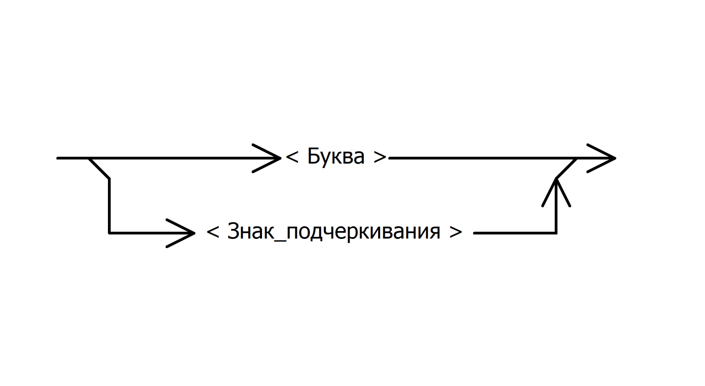

&#1056;&#1080;&#1089;&#1091;&#1085;&#1086;&#1082; 1.1 &ndash; &#1087;&#1088;&#1080;&#1084;&#1077;&#1088; &#1082;&#1086;&#1085;&#1089;&#1090;&#1088;&#1091;&#1082;&#1094;&#1080;&#1080; &#1074;&#1099;&#1073;&#1086;&#1088;&#1072;

<ol class="c23 lst-kix_list_6-0" start="2"><li class="c4 c41">&#1053;&#1077;&#1086;&#1073;&#1103;&#1079;&#1072;&#1090;&#1077;&#1083;&#1100;&#1085;&#1072;&#1103; &#1095;&#1072;&#1089;&#1090;&#1100; &#1082;&#1086;&#1085;&#1089;&#1090;&#1088;&#1091;&#1082;&#1094;&#1080;&#1080; (&#1055;&#1086;&#1074;&#1090;&#1086;&#1088;&#1103;&#1077;&#1090;&#1089;&#1103; &#1083;&#1080;&#1073;&#1086; 1, &#1083;&#1080;&#1073;&#1086; 0 &#1088;&#1072;&#1079;).</li></ol>
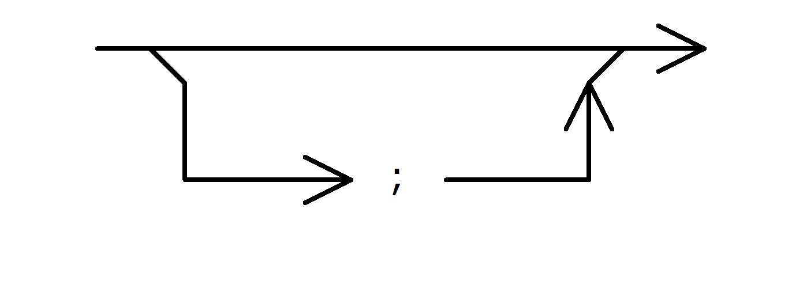

&#1056;&#1080;&#1089;&#1091;&#1085;&#1086;&#1082; 1.2 &ndash; &#1087;&#1088;&#1080;&#1084;&#1077;&#1088; &#1085;&#1077;&#1086;&#1073;&#1103;&#1079;&#1072;&#1090;&#1077;&#1083;&#1100;&#1085;&#1086;&#1081; &#1095;&#1072;&#1089;&#1090;&#1080; &#1082;&#1086;&#1085;&#1089;&#1090;&#1088;&#1091;&#1082;&#1094;&#1080;&#1080;

<ol class="c23 lst-kix_list_6-0" start="3"><li class="c21">&#1055;&#1086;&#1074;&#1090;&#1086;&#1088;&#1077;&#1085;&#1080;&#1077; &#1082;&#1086;&#1085;&#1089;&#1090;&#1088;&#1091;&#1082;&#1094;&#1080;&#1080; </li></ol>
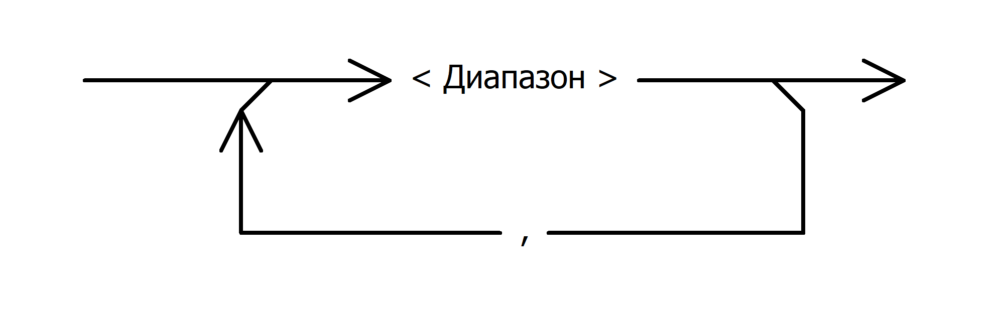

&#1056;&#1080;&#1089;&#1091;&#1085;&#1086;&#1082; 1.3 &ndash; &#1087;&#1088;&#1080;&#1084;&#1077;&#1088; &#1087;&#1086;&#1074;&#1090;&#1086;&#1088;&#1077;&#1085;&#1080;&#1103; &#1082;&#1086;&#1085;&#1089;&#1090;&#1088;&#1091;&#1082;&#1094;&#1080;&#1080;

<ol class="c23 lst-kix_list_4-1" start="2"><li class="c18"><h2 id="h.2et92p0" style="display:inline">&#1040;&#1085;&#1072;&#1083;&#1080;&#1079; &#1089;&#1091;&#1097;&#1077;&#1089;&#1090;&#1074;&#1091;&#1102;&#1097;&#1080;&#1093; &#1072;&#1085;&#1072;&#1083;&#1086;&#1075;&#1086;&#1074; </h2></li></ol>
&#1055;&#1086;&#1089;&#1083;&#1077; &#1090;&#1097;&#1072;&#1090;&#1077;&#1083;&#1100;&#1085;&#1099;&#1093; &#1087;&#1086;&#1080;&#1089;&#1082;&#1086;&#1074; &#1084;&#1085;&#1086;&#1102; &#1085;&#1077; &#1073;&#1099;&#1083;&#1086; &#1085;&#1072;&#1081;&#1076;&#1077;&#1085;&#1086; &#1087;&#1088;&#1086;&#1075;&#1088;&#1072;&#1084;&#1084;&#1085;&#1086;&#1075;&#1086; &#1089;&#1088;&#1077;&#1076;&#1089;&#1090;&#1074;&#1072; &#1076;&#1083;&#1103; &#1089;&#1086;&#1079;&#1076;&#1072;&#1085;&#1080;&#1103; &#1089;&#1080;&#1085;&#1090;&#1072;&#1082;&#1089;&#1080;&#1095;&#1077;&#1089;&#1082;&#1080;&#1093; &#1076;&#1080;&#1072;&#1075;&#1088;&#1072;&#1084;&#1084;, &#1090;&#1077;&#1084; &#1073;&#1086;&#1083;&#1077;&#1077;, &#1095;&#1090;&#1086;&#1073;&#1099; &#1086;&#1085;&#1086; &#1088;&#1072;&#1073;&#1086;&#1090;&#1072;&#1083;&#1086; &#1089; &#1074;&#1077;&#1082;&#1090;&#1086;&#1088;&#1085;&#1086;&#1081; &#1075;&#1088;&#1072;&#1092;&#1080;&#1082;&#1086;&#1081;. &#1055;&#1086;&#1101;&#1090;&#1086;&#1084;&#1091; &#1074; &#1082;&#1072;&#1095;&#1077;&#1089;&#1090;&#1074;&#1077; &#1072;&#1085;&#1072;&#1083;&#1086;&#1075;&#1086;&#1074; &#1103; &#1088;&#1072;&#1089;&#1089;&#1084;&#1086;&#1090;&#1088;&#1102; &#1075;&#1088;&#1072;&#1092;&#1080;&#1095;&#1077;&#1089;&#1082;&#1080;&#1077; &#1088;&#1077;&#1076;&#1072;&#1082;&#1090;&#1086;&#1088;&#1099; &#1089; &#1074;&#1086;&#1079;&#1084;&#1086;&#1078;&#1085;&#1086;&#1089;&#1090;&#1100;&#1102; &#1088;&#1072;&#1073;&#1086;&#1090;&#1099; &#1089; &#1074;&#1077;&#1082;&#1090;&#1086;&#1088;&#1085;&#1086;&#1081; &#1075;&#1088;&#1072;&#1092;&#1080;&#1082;&#1086;&#1081;. 

&nbsp;&nbsp;&nbsp;&nbsp;&nbsp;&nbsp;&nbsp;&nbsp;Adobe Illustrator&nbsp;&ndash; &#1086;&#1076;&#1080;&#1085; &#1080;&#1079; &#1085;&#1072;&#1080;&#1073;&#1086;&#1083;&#1077;&#1077; &#1088;&#1072;&#1089;&#1087;&#1088;&#1086;&#1089;&#1090;&#1088;&#1072;&#1085;&#1077;&#1085;&#1085;&#1099;&#1093; &#1074;&#1077;&#1082;&#1090;&#1086;&#1088;&#1085;&#1099;&#1093; &#1075;&#1088;&#1072;&#1092;&#1080;&#1095;&#1077;&#1089;&#1082;&#1080;&#1093; &#1088;&#1077;&#1076;&#1072;&#1082;&#1090;&#1086;&#1088;&#1086;&#1074;. &#1056;&#1072;&#1079;&#1088;&#1072;&#1073;&#1072;&#1090;&#1099;&#1074;&#1072;&#1077;&#1090;&#1089;&#1103; &#1080; &#1088;&#1072;&#1089;&#1087;&#1088;&#1086;&#1089;&#1090;&#1088;&#1072;&#1085;&#1103;&#1077;&#1090;&#1089;&#1103; &#1082;&#1086;&#1084;&#1087;&#1072;&#1085;&#1080;&#1077;&#1081; Adobe Systems.

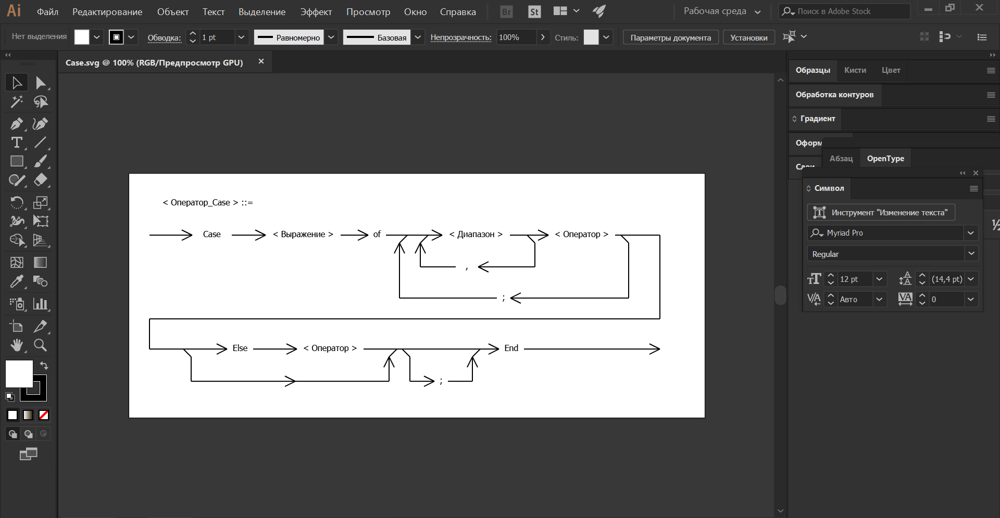

&#1056;&#1080;&#1089;&#1091;&#1085;&#1086;&#1082; 1.4 &ndash; &#1057;&#1082;&#1088;&#1080;&#1085;&#1096;&#1086;&#1090; Adobe Illustrator

&#1055;&#1083;&#1102;&#1089;&#1099;:
<ul class="c23 lst-kix_list_5-0"><li class="c4 c41">&#1059;&#1076;&#1086;&#1073;&#1085;&#1099;&#1081; &#1087;&#1086;&#1083;&#1100;&#1079;&#1086;&#1074;&#1072;&#1090;&#1077;&#1083;&#1100;&#1089;&#1082;&#1080;&#1081; &#1080;&#1085;&#1090;&#1077;&#1088;&#1092;&#1077;&#1081;&#1089;</li><li class="c4 c41">&#1057;&#1090;&#1072;&#1073;&#1080;&#1083;&#1100;&#1085;&#1072;&#1103; &#1088;&#1072;&#1073;&#1086;&#1090;&#1072; &#1087;&#1088;&#1086;&#1075;&#1088;&#1072;&#1084;&#1084;&#1099;</li><li class="c21">&#1059;&#1076;&#1086;&#1073;&#1085;&#1099;&#1081; &#1087;&#1088;&#1086;&#1094;&#1077;&#1089;&#1089; &#1101;&#1082;&#1089;&#1087;&#1086;&#1088;&#1090;&#1072;</li></ul>
&#1052;&#1080;&#1085;&#1091;&#1089;&#1099;:
<ul class="c23 lst-kix_list_7-0 start"><li class="c4 c41">&#1042;&#1099;&#1089;&#1086;&#1082;&#1072;&#1103; &#1089;&#1090;&#1086;&#1080;&#1084;&#1086;&#1089;&#1090;&#1100;</li><li class="c21">&#1055;&#1088;&#1086;&#1075;&#1088;&#1072;&#1084;&#1084;&#1072; &#1079;&#1072;&#1090;&#1086;&#1095;&#1077;&#1085;&#1072; &#1087;&#1086;&#1076; &#1088;&#1077;&#1076;&#1072;&#1082;&#1090;&#1080;&#1088;&#1086;&#1074;&#1072;&#1085;&#1080;&#1077; &#1087;&#1088;&#1086;&#1080;&#1079;&#1074;&#1086;&#1083;&#1100;&#1085;&#1086;&#1075;&#1086; &#1074;&#1077;&#1082;&#1090;&#1086;&#1088;&#1085;&#1086;&#1075;&#1086; &#1080;&#1079;&#1086;&#1073;&#1088;&#1072;&#1078;&#1077;&#1085;&#1080;&#1077;, &#1080;&#1079;-&#1079;&#1072; &#1095;&#1077;&#1075;&#1086; &#1077;&#1089;&#1090;&#1100; &#1084;&#1085;&#1086;&#1075;&#1086; &#1085;&#1077;&#1085;&#1091;&#1078;&#1085;&#1099;&#1093; &#1076;&#1083;&#1103; &#1087;&#1086;&#1089;&#1090;&#1088;&#1086;&#1077;&#1085;&#1080;&#1103; &#1089;&#1080;&#1085;&#1090;&#1072;&#1082;&#1089;&#1080;&#1095;&#1077;&#1089;&#1082;&#1080;&#1093; &#1076;&#1080;&#1072;&#1075;&#1088;&#1072;&#1084;&#1084; &#1092;&#1091;&#1085;&#1082;&#1094;&#1080;&#1081;, &#1072; &#1090;&#1072;&#1082;&#1078;&#1077; &#1082;&#1072;&#1078;&#1076;&#1091;&#1102; &#1089;&#1090;&#1088;&#1077;&#1083;&#1086;&#1095;&#1082;&#1091;, &#1083;&#1080;&#1085;&#1080;&#1102;, &#1074;&#1099;&#1088;&#1072;&#1074;&#1085;&#1080;&#1074;&#1072;&#1085;&#1080;&#1077; &#1092;&#1080;&#1075;&#1091;&#1088; &#1087;&#1088;&#1080;&#1093;&#1086;&#1076;&#1080;&#1090;&#1089;&#1103; &#1087;&#1088;&#1086;&#1080;&#1079;&#1074;&#1086;&#1076;&#1080;&#1090;&#1100; &#1089;&#1072;&#1084;&#1086;&#1089;&#1090;&#1086;&#1103;&#1090;&#1077;&#1083;&#1100;&#1085;&#1086;.</li></ul>

CorelDRAW&nbsp;&mdash; &#1075;&#1088;&#1072;&#1092;&#1080;&#1095;&#1077;&#1089;&#1082;&#1080;&#1081; &#1088;&#1077;&#1076;&#1072;&#1082;&#1090;&#1086;&#1088;, &#1088;&#1072;&#1079;&#1088;&#1072;&#1073;&#1086;&#1090;&#1072;&#1085;&#1085;&#1099;&#1081; &#1082;&#1072;&#1085;&#1072;&#1076;&#1089;&#1082;&#1086;&#1081; &#1082;&#1086;&#1088;&#1087;&#1086;&#1088;&#1072;&#1094;&#1080;&#1077;&#1081; Corel.

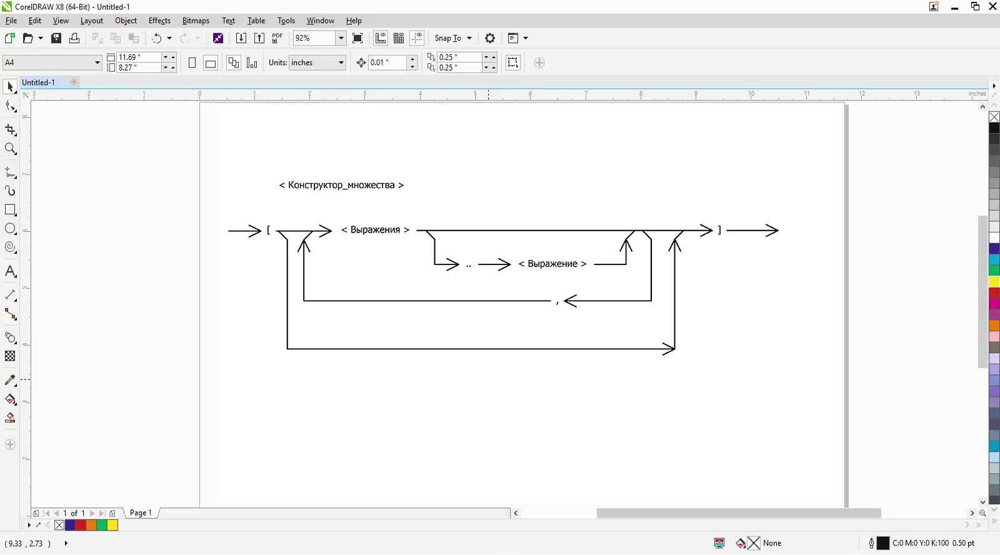

&#1056;&#1080;&#1089;&#1091;&#1085;&#1086;&#1082; 1.4 &ndash; &#1057;&#1082;&#1088;&#1080;&#1085;&#1096;&#1086;&#1090; CorelDraw

&#1060;&#1091;&#1085;&#1082;&#1094;&#1080;&#1086;&#1085;&#1072;&#1083; CorelDraw &#1086;&#1095;&#1077;&#1085;&#1100; &#1089;&#1093;&#1086;&#1078; &#1089; Adobe Illustrator.

&#1055;&#1083;&#1102;&#1089;&#1099;:
<ul class="c23 lst-kix_list_9-0 start"><li class="c4 c41">&#1057;&#1090;&#1072;&#1073;&#1080;&#1083;&#1100;&#1085;&#1072;&#1103; &#1088;&#1072;&#1073;&#1086;&#1090;&#1072;</li><li class="c21">&#1059;&#1076;&#1086;&#1073;&#1085;&#1099;&#1081; &#1087;&#1086;&#1083;&#1100;&#1079;&#1086;&#1074;&#1072;&#1090;&#1077;&#1083;&#1100;&#1089;&#1082;&#1080;&#1081; &#1080;&#1085;&#1090;&#1077;&#1088;&#1092;&#1077;&#1081;&#1089;</li></ul>
&#1052;&#1080;&#1085;&#1091;&#1089;&#1099;:
<ul class="c23 lst-kix_list_10-0 start"><li class="c4 c41">&#1042;&#1099;&#1089;&#1086;&#1082;&#1072;&#1103; &#1089;&#1090;&#1086;&#1080;&#1084;&#1086;&#1089;&#1090;&#1100;</li><li class="c21">&#1055;&#1088;&#1086;&#1075;&#1088;&#1072;&#1084;&#1084;&#1072; &#1085;&#1077; &#1079;&#1072;&#1090;&#1086;&#1095;&#1077;&#1085;&#1072; &#1087;&#1086;&#1076; &#1088;&#1080;&#1089;&#1086;&#1074;&#1072;&#1085;&#1080;&#1077; &#1089;&#1080;&#1085;&#1090;&#1072;&#1082;&#1089;&#1080;&#1095;&#1077;&#1089;&#1082;&#1080;&#1093; &#1076;&#1080;&#1072;&#1075;&#1088;&#1072;&#1084;&#1084;</li></ul>

Inkscape &ndash;&nbsp;&#1089;&#1074;&#1086;&#1073;&#1086;&#1076;&#1085;&#1086; &#1088;&#1072;&#1089;&#1087;&#1088;&#1086;&#1089;&#1090;&#1088;&#1072;&#1085;&#1103;&#1077;&#1084;&#1099;&#1081; &#1072;&#1085;&#1072;&#1083;&#1086;&#1075; Adobe Illustrator &#1080; Corel Draw. &#1056;&#1072;&#1073;&#1086;&#1090;&#1072;&#1077;&#1090; &#1089; &#1074;&#1077;&#1082;&#1090;&#1086;&#1088;&#1085;&#1099;&#1084;&#1080; &#1080;&#1079;&#1086;&#1073;&#1088;&#1072;&#1078;&#1077;&#1085;&#1080;&#1103;&#1084;&#1080; &#1074; &#1092;&#1086;&#1088;&#1084;&#1072;&#1090;&#1077; .svg.

&#1055;&#1088;&#1086;&#1075;&#1088;&#1072;&#1084;&#1084;&#1072; &#1088;&#1072;&#1089;&#1087;&#1088;&#1086;&#1089;&#1090;&#1088;&#1072;&#1085;&#1103;&#1077;&#1090;&#1089;&#1103; &#1085;&#1072; &#1091;&#1089;&#1083;&#1086;&#1074;&#1080;&#1103;&#1093; GNU (General Public License).

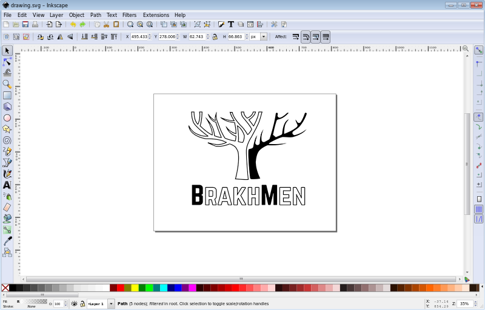

&#1056;&#1080;&#1089;&#1091;&#1085;&#1086;&#1082; 1.5 &ndash; &#1089;&#1082;&#1088;&#1080;&#1085;&#1096;&#1086;&#1090; inkscape

&#1055;&#1083;&#1102;&#1089;&#1099;:
<ul class="c23 lst-kix_list_8-0 start"><li class="c21">&#1041;&#1077;&#1089;&#1087;&#1083;&#1072;&#1090;&#1085;&#1099;&#1081; </li></ul>
&#1052;&#1080;&#1085;&#1091;&#1089;&#1099;:
<ul class="c23 lst-kix_list_8-0"><li class="c4 c41">&#1055;&#1088;&#1086;&#1075;&#1088;&#1072;&#1084;&#1084;&#1072; &#1085;&#1077; &#1079;&#1072;&#1090;&#1086;&#1095;&#1077;&#1085;&#1072; &#1087;&#1086;&#1076; &#1088;&#1080;&#1089;&#1086;&#1074;&#1072;&#1085;&#1080;&#1077; &#1089;&#1080;&#1085;&#1090;&#1072;&#1082;&#1089;&#1080;&#1095;&#1077;&#1089;&#1082;&#1080;&#1093; &#1076;&#1080;&#1072;&#1075;&#1088;&#1072;&#1084;&#1084;</li><li class="c4 c41">&#1059;&#1089;&#1090;&#1072;&#1088;&#1077;&#1074;&#1096;&#1080;&#1081; &#1087;&#1086;&#1083;&#1100;&#1079;&#1086;&#1074;&#1072;&#1090;&#1077;&#1083;&#1100;&#1089;&#1082;&#1080;&#1081; &#1080;&#1085;&#1090;&#1077;&#1088;&#1092;&#1077;&#1081;&#1089;</li><li class="c4 c41">&#1055;&#1086;&#1074;&#1099;&#1096;&#1077;&#1085;&#1085;&#1099;&#1077; &#1090;&#1088;&#1077;&#1073;&#1086;&#1074;&#1072;&#1085;&#1080;&#1103; &#1082; &#1089;&#1080;&#1089;&#1090;&#1077;&#1084;&#1085;&#1099;&#1084; &#1088;&#1077;&#1089;&#1091;&#1088;&#1089;&#1072;&#1084;</li><li class="c4 c41">&laquo;&#1057;&#1099;&#1088;&#1086;&#1089;&#1090;&#1100;&raquo; &#1088;&#1103;&#1076;&#1072; &#1092;&#1080;&#1083;&#1100;&#1090;&#1088;&#1086;&#1074; &#1080;&#1084;&#1087;&#1086;&#1088;&#1090;&#1072;</li><li class="c4 c41">&#1053;&#1077;&#1074;&#1086;&#1079;&#1084;&#1086;&#1078;&#1085;&#1086;&#1089;&#1090;&#1100; &#1080;&#1089;&#1087;&#1086;&#1083;&#1100;&#1079;&#1086;&#1074;&#1072;&#1085;&#1080;&#1103; &#1087;&#1088;&#1080;&#1074;&#1099;&#1095;&#1085;&#1099;&#1093; &#1075;&#1086;&#1088;&#1103;&#1095;&#1080;&#1093; &#1082;&#1083;&#1072;&#1074;&#1080;&#1096; (&#1085;&#1072;&#1087;&#1088;&#1080;&#1084;&#1077;&#1088;, Ctrl+C) &#1077;&#1089;&#1083;&#1080; &#1090;&#1077;&#1082;&#1091;&#1097;&#1072;&#1103; &#1088;&#1072;&#1089;&#1082;&#1083;&#1072;&#1076;&#1082;&#1072; &#1085;&#1077; &#1072;&#1085;&#1075;&#1083;&#1080;&#1081;&#1089;&#1082;&#1072;&#1103;</li></ul>

<ol class="c23 lst-kix_list_4-1" start="3"><li class="c18"><h2 id="h.tyjcwt" style="display:inline">&#1055;&#1086;&#1089;&#1090;&#1072;&#1085;&#1086;&#1074;&#1082;&#1072; &#1079;&#1072;&#1076;&#1072;&#1095;&#1080;</h2></li></ol>
&#1058;&#1072;&#1082; &#1082;&#1072;&#1082; &#1087;&#1088;&#1086;&#1077;&#1082;&#1090;&#1080;&#1088;&#1091;&#1077;&#1084;&#1086;&#1077; &#1087;&#1088;&#1086;&#1075;&#1088;&#1072;&#1084;&#1084;&#1085;&#1086;&#1077; &#1089;&#1088;&#1077;&#1076;&#1089;&#1090;&#1074;&#1086; &#1076;&#1086;&#1083;&#1078;&#1085;&#1086; &#1073;&#1099;&#1090;&#1100; &#1079;&#1072;&#1090;&#1086;&#1095;&#1077;&#1085;&#1086; &#1087;&#1086;&#1076; &#1089;&#1086;&#1079;&#1076;&#1072;&#1085;&#1080;&#1077; &#1089;&#1080;&#1085;&#1090;&#1072;&#1082;&#1089;&#1080;&#1095;&#1077;&#1089;&#1082;&#1080;&#1093; &#1076;&#1080;&#1072;&#1075;&#1088;&#1072;&#1084;&#1084;, &#1085;&#1077;&#1086;&#1073;&#1093;&#1086;&#1076;&#1080;&#1084;&#1086; &#1089;&#1086;&#1079;&#1076;&#1072;&#1090;&#1100; &#1084;&#1072;&#1082;&#1089;&#1080;&#1084;&#1072;&#1083;&#1100;&#1085;&#1086; &#1091;&#1076;&#1086;&#1073;&#1085;&#1099;&#1081; &#1076;&#1080;&#1079;&#1072;&#1081;&#1085; &#1074;&#1079;&#1072;&#1080;&#1084;&#1086;&#1076;&#1077;&#1081;&#1089;&#1090;&#1074;&#1080;&#1103; &#1089; &#1087;&#1086;&#1083;&#1100;&#1079;&#1086;&#1074;&#1072;&#1090;&#1077;&#1083;&#1077;&#1084; (UX). &#1055;&#1088;&#1086;&#1075;&#1088;&#1072;&#1084;&#1084;&#1072; &#1076;&#1086;&#1083;&#1078;&#1085;&#1072; &#1091;&#1084;&#1077;&#1090;&#1100; &#1089;&#1072;&#1084;&#1072; &#1088;&#1080;&#1089;&#1086;&#1074;&#1072;&#1090;&#1100; &#1084;&#1077;&#1083;&#1082;&#1080;&#1077; &#1101;&#1083;&#1077;&#1084;&#1077;&#1085;&#1090;&#1099; &#1089;&#1080;&#1085;&#1090;&#1072;&#1082;&#1089;&#1080;&#1095;&#1077;&#1089;&#1082;&#1086;&#1081; &#1076;&#1080;&#1072;&#1075;&#1088;&#1072;&#1084;&#1084;&#1099;, &#1090;&#1072;&#1082;&#1080;&#1077; &#1082;&#1072;&#1082; &#1089;&#1090;&#1088;&#1077;&#1083;&#1082;&#1080;, &#1076;&#1080;&#1072;&#1075;&#1086;&#1085;&#1072;&#1083;&#1100;&#1085;&#1099;&#1077; &#1089;&#1082;&#1086;&#1089;&#1099; &#1080; &#1090;.&#1076;., &#1086;&#1089;&#1085;&#1086;&#1074;&#1099;&#1074;&#1072;&#1103;&#1089;&#1100; &#1085;&#1072; &#1091;&#1078;&#1077; &#1085;&#1072;&#1088;&#1080;&#1089;&#1086;&#1074;&#1072;&#1085;&#1085;&#1086;&#1084; &#1087;&#1086;&#1083;&#1100;&#1079;&#1086;&#1074;&#1072;&#1090;&#1077;&#1083;&#1077;&#1084; &#1080;&#1079;&#1086;&#1073;&#1088;&#1072;&#1078;&#1077;&#1085;&#1080;&#1080;. 

&#1063;&#1090;&#1086;&#1073;&#1099; &#1087;&#1088;&#1086;&#1075;&#1088;&#1072;&#1084;&#1084;&#1091; &#1084;&#1086;&#1078;&#1085;&#1086; &#1073;&#1099;&#1083;&#1086; &#1089;&#1095;&#1080;&#1090;&#1072;&#1090;&#1100; &#1074;&#1077;&#1082;&#1090;&#1086;&#1088;&#1085;&#1099;&#1084; &#1088;&#1077;&#1076;&#1072;&#1082;&#1090;&#1086;&#1088;&#1086;&#1084;, &#1076;&#1086;&#1083;&#1078;&#1085;&#1099; &#1073;&#1099;&#1090;&#1100; &#1088;&#1077;&#1072;&#1083;&#1080;&#1079;&#1086;&#1074;&#1072;&#1085;&#1099; &#1089;&#1083;&#1077;&#1076;&#1091;&#1102;&#1097;&#1080;&#1077; &#1092;&#1091;&#1085;&#1082;&#1094;&#1080;&#1080;: 
<ul class="c23 lst-kix_list_8-0"><li class="c4 c41">&#1056;&#1080;&#1089;&#1086;&#1074;&#1072;&#1085;&#1080;&#1077; &#1089; &#1087;&#1086;&#1084;&#1086;&#1097;&#1100;&#1102; &#1091;&#1089;&#1090;&#1072;&#1085;&#1086;&#1074;&#1083;&#1077;&#1085;&#1085;&#1099;&#1093; &#1087;&#1088;&#1080;&#1084;&#1080;&#1090;&#1080;&#1074;&#1085;&#1099;&#1093; &#1092;&#1080;&#1075;&#1091;&#1088;;</li><li class="c4 c41">&#1048;&#1079;&#1084;&#1077;&#1085;&#1077;&#1085;&#1080;&#1077; &#1088;&#1072;&#1079;&#1084;&#1077;&#1088;&#1086;&#1074;, &#1087;&#1086;&#1083;&#1086;&#1078;&#1077;&#1085;&#1080;&#1103; &#1085;&#1072;&#1088;&#1080;&#1089;&#1086;&#1074;&#1072;&#1085;&#1085;&#1099;&#1093; &#1092;&#1080;&#1075;&#1091;&#1088; (&#1088;&#1077;&#1076;&#1072;&#1082;&#1090;&#1080;&#1088;&#1086;&#1074;&#1072;&#1085;&#1080;&#1077; &#1080;&#1079;&#1086;&#1073;&#1088;&#1072;&#1078;&#1077;&#1085;&#1080;&#1103;)</li><li class="c4 c41">&#1048;&#1079;&#1084;&#1077;&#1085;&#1077;&#1085;&#1080;&#1077; &#1088;&#1072;&#1079;&#1084;&#1077;&#1088;&#1086;&#1074; &#1093;&#1086;&#1083;&#1089;&#1090;&#1072;;</li><li class="c4 c41">&#1052;&#1072;&#1089;&#1096;&#1090;&#1072;&#1073;&#1080;&#1088;&#1086;&#1074;&#1072;&#1085;&#1080;&#1077; &#1080;&#1079;&#1086;&#1073;&#1088;&#1072;&#1078;&#1077;&#1085;&#1080;&#1077;;</li><li class="c4 c41">&#1057;&#1086;&#1093;&#1088;&#1072;&#1085;&#1077;&#1085;&#1080;&#1077; &#1080;&#1089;&#1093;&#1086;&#1076;&#1085;&#1080;&#1082;&#1086;&#1074; &#1080;&#1079;&#1086;&#1073;&#1088;&#1072;&#1078;&#1077;&#1085;&#1080;&#1103; &#1074; &#1090;&#1080;&#1087;&#1080;&#1079;&#1080;&#1088;&#1086;&#1074;&#1072;&#1085;&#1085;&#1099;&#1081; &#1092;&#1072;&#1081;&#1083; &#1089; &#1074;&#1086;&#1079;&#1084;&#1086;&#1078;&#1085;&#1086;&#1089;&#1090;&#1100;&#1102; &#1076;&#1072;&#1083;&#1100;&#1085;&#1077;&#1081;&#1096;&#1077;&#1075;&#1086; &#1080;&#1089;&#1087;&#1086;&#1083;&#1100;&#1079;&#1086;&#1074;&#1072;&#1085;&#1080;&#1103;;</li><li class="c4 c41">&#1054;&#1090;&#1082;&#1088;&#1099;&#1090;&#1080;&#1077; &#1090;&#1080;&#1087;&#1080;&#1079;&#1080;&#1088;&#1086;&#1074;&#1072;&#1085;&#1085;&#1086;&#1075;&#1086; &#1092;&#1072;&#1081;&#1083;&#1072; &#1089; &#1080;&#1089;&#1093;&#1086;&#1076;&#1085;&#1080;&#1082;&#1072;&#1084;&#1080;;</li><li class="c4 c41">&#1069;&#1082;&#1089;&#1087;&#1086;&#1088;&#1090; &#1080;&#1079;&#1086;&#1073;&#1088;&#1072;&#1078;&#1077;&#1085;&#1080;&#1077; &#1074; &#1074;&#1077;&#1082;&#1090;&#1086;&#1088;&#1085;&#1099;&#1081; &#1092;&#1086;&#1088;&#1084;&#1072;&#1090; (svg);</li><li class="c4 c41">&#1069;&#1082;&#1089;&#1087;&#1086;&#1088;&#1090; &#1080;&#1079;&#1086;&#1073;&#1088;&#1072;&#1078;&#1077;&#1085;&#1080;&#1103; &#1074; &#1088;&#1072;&#1089;&#1090;&#1088;&#1086;&#1074;&#1099;&#1077; &#1092;&#1086;&#1088;&#1084;&#1072;&#1090;&#1099; (bmp, png);</li><li class="c4 c41">&#1054;&#1087;&#1077;&#1088;&#1072;&#1094;&#1080;&#1080; &#1082;&#1086;&#1087;&#1080;&#1088;&#1086;&#1074;&#1072;&#1085;&#1080;&#1103;, &#1074;&#1089;&#1090;&#1072;&#1074;&#1082;&#1080; &#1080; &#1086;&#1090;&#1084;&#1077;&#1085;&#1099; &#1076;&#1077;&#1081;&#1089;&#1090;&#1074;&#1080;&#1103;.</li><li class="c21">&#1055;&#1077;&#1088;&#1077;&#1082;&#1083;&#1102;&#1095;&#1077;&#1085;&#1080;&#1077; &#1103;&#1079;&#1099;&#1082;&#1072; (&#1088;&#1091;&#1089;&#1089;&#1082;&#1080;&#1081;/&#1072;&#1085;&#1075;&#1083;&#1080;&#1081;&#1089;&#1082;&#1080;&#1081;)</li></ul>
&#1058;&#1072;&#1082;&#1078;&#1077; &#1074; &#1087;&#1088;&#1086;&#1075;&#1088;&#1072;&#1084;&#1084;&#1077; &#1076;&#1086;&#1083;&#1078;&#1085;&#1072; &#1087;&#1088;&#1080;&#1089;&#1091;&#1090;&#1089;&#1090;&#1074;&#1086;&#1074;&#1072;&#1090;&#1100; &#1089;&#1087;&#1088;&#1072;&#1074;&#1082;&#1072;, &#1074;&#1082;&#1083;&#1102;&#1095;&#1072;&#1102;&#1097;&#1072;&#1103; &#1074; &#1089;&#1077;&#1073;&#1077; &#1080;&#1085;&#1089;&#1090;&#1088;&#1091;&#1082;&#1094;&#1080;&#1102; &#1087;&#1086; &#1080;&#1089;&#1087;&#1086;&#1083;&#1100;&#1079;&#1086;&#1074;&#1072;&#1085;&#1080;&#1102;, &#1086;&#1087;&#1080;&#1089;&#1072;&#1085;&#1080;&#1077; &#1087;&#1088;&#1086;&#1075;&#1088;&#1072;&#1084;&#1084;&#1099; &#1080; &#1090;.&#1076;. 

&nbsp;&nbsp;&nbsp;&nbsp;&nbsp;&nbsp;&nbsp;&nbsp;&#1042; &#1082;&#1072;&#1095;&#1077;&#1089;&#1090;&#1074;&#1077; &#1103;&#1079;&#1099;&#1082;&#1072; &#1087;&#1088;&#1086;&#1075;&#1088;&#1072;&#1084;&#1084;&#1080;&#1088;&#1086;&#1074;&#1072;&#1085;&#1080;&#1103; &#1074;&#1099;&#1073;&#1088;&#1072;&#1085; &#1103;&#1079;&#1099;&#1082; Delphi, &#1090;&#1072;&#1082; &#1082;&#1072;&#1082; &#1087;&#1088;&#1086;&#1075;&#1088;&#1072;&#1084;&#1084;&#1072; &#1082;&#1091;&#1088;&#1089;&#1072; &#1087;&#1088;&#1077;&#1076;&#1084;&#1077;&#1090;&#1072; &#1054;&#1040;&#1080;&#1055; &#1074;&#1082;&#1083;&#1102;&#1095;&#1072;&#1077;&#1090; &#1074; &#1089;&#1077;&#1073;&#1103; &#1076;&#1072;&#1085;&#1085;&#1099;&#1081; &#1103;&#1079;&#1099;&#1082;, &#1072; &#1090;&#1072;&#1082;&#1078;&#1077; &#1087;&#1086;&#1090;&#1086;&#1084;&#1091;, &#1095;&#1090;&#1086; &#1103; &#1093;&#1086;&#1088;&#1086;&#1096;&#1086; &#1086;&#1089;&#1074;&#1086;&#1080;&#1083; &#1103;&#1079;&#1099;&#1082;, &#1074;&#1099;&#1087;&#1086;&#1083;&#1085;&#1103;&#1103; &#1083;&#1072;&#1073;&#1086;&#1088;&#1072;&#1090;&#1086;&#1088;&#1085;&#1099;&#1077; &#1088;&#1072;&#1073;&#1086;&#1090;&#1099;.

<ol class="c23 lst-kix_list_4-0" start="2"><li class="c31 c41"><h1 id="h.3dy6vkm" style="display:inline">&#1052;&#1054;&#1044;&#1045;&#1051;&#1048;&#1056;&#1054;&#1042;&#1040;&#1053;&#1048;&#1045; &#1055;&#1056;&#1045;&#1044;&#1052;&#1045;&#1058;&#1053;&#1054;&#1049; &#1054;&#1041;&#1051;&#1040;&#1057;&#1058;&#1048; &#1048; &#1056;&#1040;&#1047;&#1056;&#1040;&#1041;&#1054;&#1058;&#1050;&#1040; &#1060;&#1059;&#1053;&#1050;&#1062;&#1048;&#1054;&#1053;&#1040;&#1051;&#1068;&#1053;&#1067;&#1061; &#1058;&#1056;&#1045;&#1041;&#1054;&#1042;&#1040;&#1053;&#1048;&#1049;</h1></li></ol>

<ol class="c23 lst-kix_list_4-1" start="4"><li class="c18"><h2 id="h.1t3h5sf" style="display:inline">&#1055;&#1088;&#1077;&#1076;&#1089;&#1090;&#1072;&#1074;&#1083;&#1077;&#1085;&#1080;&#1077; &#1074;&#1077;&#1082;&#1090;&#1086;&#1088;&#1085;&#1086;&#1075;&#1086; &#1080;&#1079;&#1086;&#1073;&#1088;&#1072;&#1078;&#1077;&#1085;&#1080;&#1103; &#1074; &#1092;&#1086;&#1088;&#1084;&#1072;&#1090;&#1077; SVG</h2></li></ol>

&#1042;&#1077;&#1082;&#1090;&#1086;&#1088;&#1085;&#1072;&#1103; &#1075;&#1088;&#1072;&#1092;&#1080;&#1082;&#1072; &ndash; &#1101;&#1090;&#1086; &#1089;&#1087;&#1086;&#1089;&#1086;&#1073; &#1087;&#1088;&#1077;&#1076;&#1089;&#1090;&#1072;&#1074;&#1083;&#1077;&#1085;&#1080;&#1103; &#1080;&#1079;&#1086;&#1073;&#1088;&#1072;&#1078;&#1077;&#1085;&#1080;&#1081; &#1080; &#1086;&#1073;&#1098;&#1077;&#1082;&#1090;&#1086;&#1074;, &#1086;&#1089;&#1085;&#1086;&#1074;&#1072;&#1085;&#1085;&#1099;&#1081; &#1085;&#1072; &#1084;&#1072;&#1090;&#1077;&#1084;&#1072;&#1090;&#1080;&#1095;&#1077;&#1089;&#1082;&#1086;&#1084; &#1086;&#1087;&#1080;&#1089;&#1072;&#1085;&#1080;&#1080; &#1101;&#1083;&#1077;&#1084;&#1077;&#1085;&#1090;&#1072;&#1088;&#1085;&#1099;&#1081; &#1075;&#1077;&#1086;&#1075;&#1088;&#1072;&#1092;&#1080;&#1095;&#1077;&#1089;&#1082;&#1080;&#1093; &#1086;&#1073;&#1098;&#1077;&#1082;&#1090;&#1086;&#1074;. 

&#1054;&#1076;&#1085;&#1080;&#1084; &#1080;&#1079; &#1089;&#1072;&#1084;&#1099;&#1093; &#1088;&#1072;&#1089;&#1087;&#1088;&#1086;&#1089;&#1090;&#1088;&#1072;&#1085;&#1077;&#1085;&#1085;&#1099;&#1093; &#1092;&#1086;&#1088;&#1084;&#1072;&#1090;&#1086;&#1074; &#1092;&#1072;&#1081;&#1083;&#1086;&#1074; &#1074;&#1077;&#1082;&#1090;&#1086;&#1088;&#1085;&#1086;&#1081; &#1075;&#1088;&#1072;&#1092;&#1080;&#1082;&#1080; &#1103;&#1074;&#1083;&#1103;&#1077;&#1090;&#1089;&#1103; &#1092;&#1086;&#1088;&#1084;&#1072;&#1090; SVG. &#1060;&#1086;&#1088;&#1084;&#1072;&#1090; SVG &#1087;&#1088;&#1077;&#1076;&#1085;&#1072;&#1079;&#1085;&#1072;&#1095;&#1077;&#1085; &#1076;&#1083;&#1103; &#1086;&#1087;&#1080;&#1089;&#1072;&#1085;&#1080;&#1077; &#1076;&#1074;&#1091;&#1084;&#1077;&#1088;&#1085;&#1086;&#1081; &#1074;&#1077;&#1082;&#1090;&#1086;&#1088;&#1085;&#1086;&#1081; &#1080; &#1089;&#1084;&#1077;&#1096;&#1072;&#1085;&#1085;&#1086;&#1081; &#1075;&#1088;&#1072;&#1092;&#1080;&#1082;&#1080; &#1074; &#1090;&#1077;&#1082;&#1089;&#1090;&#1086;&#1074;&#1086;&#1084; &#1092;&#1086;&#1088;&#1084;&#1072;&#1090;&#1077; XML.

&#1057;&#1090;&#1088;&#1091;&#1082;&#1090;&#1091;&#1088;&#1072; &#1076;&#1086;&#1082;&#1091;&#1084;&#1077;&#1085;&#1090;&#1072;[2][3]:
<ul class="c23 lst-kix_list_5-0"><li class="c4 c41">&#1055;&#1077;&#1088;&#1074;&#1072;&#1103; &#1089;&#1090;&#1088;&#1086;&#1082;&#1072; &ndash; &#1089;&#1090;&#1072;&#1085;&#1076;&#1072;&#1088;&#1090;&#1085;&#1099;&#1081; XML &#1079;&#1072;&#1075;&#1086;&#1083;&#1086;&#1074;&#1086;&#1082; &#1089; &#1091;&#1082;&#1072;&#1079;&#1072;&#1085;&#1080;&#1077;&#1084; &#1074;&#1077;&#1088;&#1089;&#1080;&#1080;, &#1082;&#1086;&#1076;&#1080;&#1088;&#1086;&#1074;&#1082;&#1080;. </li></ul>
&#1055;&#1088;&#1080;&#1084;&#1077;&#1088;:

&lt;?xml version=&quot;1.0&quot; encoding=&quot;UTF-8&quot; standalone=&quot;no&quot;?&gt;
<ul class="c23 lst-kix_list_5-0"><li class="c4 c41">&#1042;&#1090;&#1086;&#1088;&#1072;&#1103; &#1080; &#1090;&#1088;&#1077;&#1090;&#1100;&#1103; &#1089;&#1090;&#1088;&#1086;&#1082;&#1072; &ndash; &#1079;&#1072;&#1075;&#1086;&#1083;&#1086;&#1074;&#1086;&#1082; DOCTYPE, &#1086;&#1087;&#1088;&#1077;&#1076;&#1077;&#1083;&#1103;&#1102;&#1097;&#1080;&#1081; &#1090;&#1080;&#1087; &#1076;&#1086;&#1082;&#1091;&#1084;&#1077;&#1085;&#1090;&#1072;.</li></ul>
&#1055;&#1088;&#1080;&#1084;&#1077;&#1088;:

&lt;!DOCTYPE svg PUBLIC &quot;-//W3C//DTD SVG 1.1//EN&quot;

&nbsp; &nbsp; &quot;http://www.w3.org/Graphics/SVG/1.1/DTD/svg11.dtd&quot;&gt;
<ul class="c23 lst-kix_list_5-0"><li class="c4 c41">&#1063;&#1077;&#1090;&#1074;&#1077;&#1088;&#1090;&#1072;&#1103; &#1089;&#1090;&#1088;&#1086;&#1082;&#1072; &ndash; &#1082;&#1086;&#1088;&#1085;&#1077;&#1074;&#1086;&#1081; &#1101;&#1083;&#1077;&#1084;&#1077;&#1085;&#1090; &#1076;&#1086;&#1082;&#1091;&#1084;&#1077;&#1085;&#1090; &#1089; &#1091;&#1082;&#1072;&#1079;&#1072;&#1085;&#1080;&#1077;&#1084; &#1087;&#1088;&#1086;&#1089;&#1090;&#1088;&#1072;&#1085;&#1089;&#1090;&#1074;&#1072; &#1080;&#1084;&#1077;&#1085; SVG</li></ul>
&#1055;&#1088;&#1080;&#1084;&#1077;&#1088;:

&lt;svg version=&quot;1.1&quot;

&nbsp; &nbsp; &nbsp;baseProfile=&quot;full&quot;

&nbsp; &nbsp; &nbsp;xmlns=&quot;http://www.w3.org/2000/svg&quot;

&nbsp; &nbsp; &nbsp;xmlns:xlink=&quot;http://www.w3.org/1999/xlink&quot;

&nbsp; &nbsp; &nbsp;xmlns:ev=&quot;http://www.w3.org/2001/xml-events&quot;

&nbsp; &nbsp; &nbsp;width=&quot;100%&quot; height=&quot;100%&quot;&gt;
<ul class="c23 lst-kix_list_5-0"><li class="c21">&#1044;&#1072;&#1083;&#1077;&#1077; &#1080;&#1076;&#1077;&#1090; &#1086;&#1089;&#1090;&#1072;&#1083;&#1100;&#1085;&#1086;&#1081; &#1090;&#1077;&#1082;&#1089;&#1090; &#1076;&#1086;&#1082;&#1091;&#1084;&#1077;&#1085;&#1090;&#1072;, &#1079;&#1072;&#1074;&#1077;&#1088;&#1096;&#1072;&#1102;&#1097;&#1080;&#1081;&#1089;&#1103; &#1079;&#1072;&#1082;&#1088;&#1099;&#1090;&#1080;&#1077;&#1084; &#1090;&#1077;&#1075;&#1072; &lt;/svg&gt;</li></ul>
  

&#1054;&#1090;&#1088;&#1080;&#1089;&#1086;&#1074;&#1082;&#1072; &#1086;&#1089;&#1085;&#1086;&#1074;&#1085;&#1099;&#1093; &#1092;&#1080;&#1075;&#1091;&#1088;:
<ul class="c23 lst-kix_list_5-0"><li class="c21">&#1054;&#1087;&#1080;&#1089;&#1072;&#1085;&#1080;&#1077; &#1087;&#1091;&#1090;&#1077;&#1081;</li></ul>
&#1055;&#1086;&#1079;&#1074;&#1086;&#1083;&#1103;&#1077;&#1090; &#1079;&#1072;&#1076;&#1072;&#1090;&#1100; &#1083;&#1102;&#1073;&#1091;&#1102; &#1092;&#1080;&#1075;&#1091;&#1088;&#1091;, &#1086;&#1087;&#1080;&#1089;&#1099;&#1074;&#1072;&#1103; &#1087;&#1091;&#1090;&#1100; &#1086;&#1090; &#1085;&#1072;&#1095;&#1072;&#1083;&#1100;&#1085;&#1086;&#1081; &#1090;&#1086;&#1095;&#1082;&#1080; &#1076;&#1086; &#1082;&#1086;&#1085;&#1077;&#1095;&#1085;&#1086;&#1081; &#1095;&#1077;&#1088;&#1077;&#1079; &#1087;&#1088;&#1086;&#1084;&#1077;&#1078;&#1091;&#1090;&#1086;&#1095;&#1085;&#1099;&#1077; &#1082;&#1086;&#1086;&#1088;&#1076;&#1080;&#1085;&#1072;&#1090;&#1099;. &#1057;&#1090;&#1088;&#1086;&#1082;&#1072; &#1089; &#1076;&#1072;&#1085;&#1085;&#1099;&#1084;&#1080; &#1079;&#1072;&#1076;&#1072;&#1077;&#1090;&#1089;&#1103; &#1072;&#1090;&#1088;&#1080;&#1073;&#1091;&#1090;&#1086;&#1084; d &#1090;&#1077;&#1075;&#1072; path&nbsp;&#1080; &#1089;&#1086;&#1076;&#1077;&#1088;&#1078;&#1080;&#1090; &#1082;&#1086;&#1084;&#1072;&#1085;&#1076;&#1099;, &#1079;&#1072;&#1082;&#1086;&#1076;&#1080;&#1088;&#1086;&#1074;&#1072;&#1085;&#1085;&#1099;&#1077; &#1085;&#1072;&#1073;&#1086;&#1088;&#1086;&#1084; &#1073;&#1091;&#1082;&#1074; &#1080; &#1095;&#1080;&#1089;&#1077;&#1083;. &#1041;&#1091;&#1082;&#1074;&#1099; &ndash; &#1086;&#1073;&#1086;&#1079;&#1085;&#1072;&#1095;&#1072;&#1102;&#1090; &#1090;&#1080;&#1087; &#1082;&#1086;&#1084;&#1072;&#1085;&#1076;&#1099;. &#1053;&#1072;&#1080;&#1073;&#1086;&#1083;&#1077;&#1077; &#1087;&#1088;&#1086;&#1089;&#1090;&#1099;&#1077; &ndash; M (&#1072;&#1085;&#1075;&#1083;. moveto &ndash; &#1087;&#1077;&#1088;&#1077;&#1084;&#1077;&#1089;&#1090;&#1080;&#1090;&#1100;), L (&#1072;&#1085;&#1075;&#1083;. lineto &ndash; &#1085;&#1072;&#1088;&#1080;&#1089;&#1086;&#1074;&#1072;&#1090;&#1100; &#1083;&#1080;&#1085;&#1080;&#1102;). &#1062;&#1080;&#1092;&#1088;&#1099;, &#1095;&#1072;&#1097;&#1077; &#1074;&#1089;&#1077;&#1075;&#1086;, &#1089;&#1086;&#1076;&#1077;&#1088;&#1078;&#1072;&#1090; &#1082;&#1086;&#1086;&#1088;&#1076;&#1080;&#1085;&#1072;&#1090;&#1099; &#1090;&#1086;&#1095;&#1077;&#1082; &#1087;&#1086; &#1086;&#1089;&#1103;&#1084; X &#1080; Y.

&#1055;&#1088;&#1080;&#1084;&#1077;&#1088;: &#1083;&#1080;&#1085;&#1080;&#1103; &#1080;&#1079; &#1090;&#1086;&#1095;&#1082;&#1080; (100,100) &#1074; &#1090;&#1086;&#1095;&#1082;&#1091; (100,200)

&lt;path fill=&quot;none&quot; stroke=&quot;black&quot; d=&quot;M 100 100 L 100 200&quot; /&gt;
<ul class="c23 lst-kix_list_5-0"><li class="c21">&#1055;&#1088;&#1103;&#1084;&#1086;&#1091;&#1075;&#1086;&#1083;&#1100;&#1085;&#1080;&#1082;</li></ul>
&#1057;&#1090;&#1088;&#1086;&#1082;&#1072; &#1079;&#1072;&#1076;&#1072;&#1077;&#1090;&#1089;&#1103; 4-&#1084;&#1103; &#1086;&#1089;&#1085;&#1086;&#1074;&#1085;&#1099;&#1084;&#1080; &#1072;&#1090;&#1088;&#1080;&#1073;&#1091;&#1090;&#1072;&#1084;&#1080; &#1090;&#1077;&#1075;&#1072; rect: &#1082;&#1086;&#1086;&#1088;&#1076;&#1080;&#1085;&#1072;&#1090;&#1099; X,Y &#1083;&#1077;&#1074;&#1086;&#1081; &#1074;&#1077;&#1088;&#1093;&#1085;&#1077;&#1081; &#1090;&#1086;&#1095;&#1082;&#1080; (&#1040;&#1090;&#1088;&#1080;&#1073;&#1091;&#1090;&#1099; x, y), &#1074;&#1099;&#1089;&#1086;&#1090;&#1072; &#1080; &#1096;&#1080;&#1088;&#1080;&#1085;&#1072; (&#1040;&#1090;&#1088;&#1080;&#1073;&#1091;&#1090;&#1099; height &#1080; width &#1089;&#1086;&#1086;&#1090;&#1074;&#1077;&#1090;&#1089;&#1090;&#1074;&#1077;&#1085;&#1085;&#1086;). 

&#1055;&#1088;&#1080;&#1084;&#1077;&#1088;: 

&lt;rect fill=&quot;white&quot; x=&quot;400&quot; y=&quot;600&quot; width=&quot;300&quot; height=&quot;200&quot; /&gt;
<ul class="c23 lst-kix_list_5-0"><li class="c21">&#1054;&#1082;&#1088;&#1091;&#1078;&#1085;&#1086;&#1089;&#1090;&#1100;</li></ul>
&#1057;&#1090;&#1088;&#1086;&#1082;&#1072; &#1079;&#1072;&#1076;&#1072;&#1077;&#1090;&#1089;&#1103; 3-&#1084;&#1103; &#1086;&#1089;&#1085;&#1086;&#1074;&#1085;&#1099;&#1084;&#1080; &#1072;&#1090;&#1088;&#1080;&#1073;&#1091;&#1090;&#1072;&#1084;&#1080; &#1090;&#1077;&#1075;&#1072; cricle: &#1082;&#1086;&#1086;&#1088;&#1076;&#1080;&#1085;&#1072;&#1090;&#1099; &#1094;&#1077;&#1085;&#1090;&#1088;&#1072; (&#1040;&#1090;&#1088;&#1080;&#1073;&#1091;&#1090;&#1099; cx, cy), &#1088;&#1072;&#1076;&#1080;&#1091;&#1089; (&#1040;&#1090;&#1088;&#1080;&#1073;&#1091;&#1090; r).

&#1055;&#1088;&#1080;&#1084;&#1077;&#1088;:

&lt;circle cx=&quot;200px&quot; cy=&quot;200px&quot; r=&quot;104px&quot; fill=&quot;red&rdquo;/&gt; 
<ul class="c23 lst-kix_list_5-0"><li class="c21">&#1042;&#1099;&#1074;&#1086;&#1076; &#1090;&#1077;&#1082;&#1089;&#1090;</li></ul>
&#1042;&#1099;&#1074;&#1086;&#1076;&#1080;&#1084;&#1099;&#1081; &#1090;&#1077;&#1082;&#1089;&#1090; &#1079;&#1072;&#1082;&#1083;&#1102;&#1095;&#1072;&#1077;&#1090;&#1089;&#1103; &#1074; &#1090;&#1077;&#1075; text,&nbsp;&#1074; &#1082;&#1086;&#1090;&#1086;&#1088;&#1086;&#1084; &#1074; &#1082;&#1072;&#1095;&#1077;&#1089;&#1090;&#1074;&#1077; &#1072;&#1090;&#1088;&#1080;&#1073;&#1091;&#1090;&#1086;&#1074; &#1079;&#1072;&#1076;&#1072;&#1102;&#1090;&#1089;&#1103; &#1089;&#1074;&#1086;&#1081;&#1089;&#1090;&#1074;&#1072;. &#1069;&#1083;&#1077;&#1084;&#1077;&#1085;&#1090;&#1072;&#1088;&#1085;&#1099;&#1077; &#1089;&#1074;&#1086;&#1081;&#1089;&#1090;&#1074;&#1072; &#1076;&#1083;&#1103; &#1074;&#1099;&#1074;&#1086;&#1076;&#1072; &#1090;&#1077;&#1082;&#1089;&#1090;&#1072; &ndash; &#1082;&#1086;&#1086;&#1088;&#1076;&#1080;&#1085;&#1072;&#1090;&#1099; &#1083;&#1077;&#1074;&#1086;&#1081; &#1074;&#1077;&#1088;&#1093;&#1085;&#1077;&#1081; &#1090;&#1086;&#1095;&#1082;&#1080; &#1090;&#1077;&#1082;&#1089;&#1090;&#1072; (&#1072;&#1090;&#1088;&#1080;&#1073;&#1091;&#1090;&#1099; x, y).

&#1055;&#1088;&#1080;&#1084;&#1077;&#1088;: 

&lt;text x=&quot;30&quot; y=&quot;12&quot; &gt;Syntax Diagrams Editor&lt;/text&gt;

&#1050;&#1072;&#1078;&#1076;&#1086;&#1084;&#1091; &#1090;&#1077;&#1075;&#1091; &#1084;&#1086;&#1078;&#1085;&#1086; &#1079;&#1072;&#1076;&#1072;&#1090;&#1100; &#1076;&#1086;&#1087;&#1086;&#1083;&#1085;&#1080;&#1090;&#1077;&#1083;&#1100;&#1085;&#1099;&#1077; &#1089;&#1074;&#1086;&#1081;&#1089;&#1090;&#1074;&#1072;, &#1086;&#1087;&#1080;&#1089;&#1072;&#1085;&#1080;&#1103; &#1080; &#1087;&#1088;&#1080;&#1084;&#1077;&#1088;&#1099; &#1082;&#1086;&#1090;&#1086;&#1088;&#1099;&#1093; &#1085;&#1072;&#1093;&#1086;&#1076;&#1103;&#1090;&#1089;&#1103; &#1074; &#1076;&#1086;&#1082;&#1091;&#1084;&#1077;&#1085;&#1090;&#1072;&#1094;&#1080;&#1080; &#1087;&#1086; &#1092;&#1086;&#1088;&#1084;&#1072;&#1090;&#1091; SVG.
<ol class="c23 lst-kix_list_4-1" start="5"><li class="c18"><h2 id="h.4d34og8" style="display:inline">&#1054;&#1087;&#1080;&#1089;&#1072;&#1085;&#1080;&#1077; &#1092;&#1091;&#1085;&#1082;&#1094;&#1080;&#1086;&#1085;&#1072;&#1083;&#1100;&#1085;&#1086;&#1089;&#1090;&#1080; &#1055;&#1057;</h2></li></ol>
&nbsp;&nbsp;&nbsp;&nbsp;&nbsp;&nbsp;&nbsp;&nbsp;&nbsp;

&#1055;&#1088;&#1086;&#1075;&#1088;&#1072;&#1084;&#1084;&#1085;&#1086;&#1077; &#1089;&#1088;&#1077;&#1076;&#1089;&#1090;&#1074;&#1086; &#1076;&#1086;&#1083;&#1078;&#1085;&#1086; &#1087;&#1088;&#1077;&#1076;&#1089;&#1090;&#1072;&#1074;&#1083;&#1103;&#1090;&#1100; &#1087;&#1077;&#1088;&#1077;&#1082;&#1083;&#1102;&#1095;&#1077;&#1085;&#1080;&#1077; &#1088;&#1077;&#1078;&#1080;&#1084;&#1086;&#1074; &#1088;&#1080;&#1089;&#1086;&#1074;&#1072;&#1085;&#1080;&#1103; &#1087;&#1091;&#1090;&#1077;&#1084; &#1085;&#1072;&#1078;&#1072;&#1090;&#1080;&#1103; &#1089;&#1086;&#1086;&#1090;&#1074;&#1077;&#1090;&#1089;&#1090;&#1074;&#1091;&#1102;&#1097;&#1077;&#1081; &#1080;&#1082;&#1086;&#1085;&#1082;&#1080; &#1074; ToolBar (&#1055;&#1086; &#1091;&#1084;&#1086;&#1083;&#1095;&#1072;&#1085;&#1080;&#1102; &#1087;&#1086;&#1083;&#1100;&#1079;&#1086;&#1074;&#1072;&#1090;&#1077;&#1083;&#1102; &#1087;&#1088;&#1077;&#1076;&#1083;&#1072;&#1075;&#1072;&#1077;&#1090;&#1089;&#1103; &#1088;&#1077;&#1078;&#1080;&#1084; &#1088;&#1077;&#1076;&#1072;&#1082;&#1090;&#1080;&#1088;&#1086;&#1074;&#1072;&#1085;&#1080;&#1103;).

&#1056;&#1077;&#1078;&#1080;&#1084; &#1088;&#1080;&#1089;&#1086;&#1074;&#1072;&#1085;&#1080;&#1103; &#1084;&#1086;&#1078;&#1077;&#1090; &#1087;&#1088;&#1080;&#1085;&#1080;&#1084;&#1072;&#1090;&#1100; &#1086;&#1076;&#1080;&#1085; &#1080;&#1079; &#1089;&#1083;&#1077;&#1076;&#1091;&#1102;&#1097;&#1080;&#1093; &#1079;&#1085;&#1072;&#1095;&#1077;&#1085;&#1080;&#1081;:
<ul class="c23 lst-kix_list_11-0 start"><li class="c4 c41">&#1056;&#1080;&#1089;&#1086;&#1074;&#1072;&#1085;&#1080;&#1077; &#1087;&#1088;&#1103;&#1084;&#1086;&#1091;&#1075;&#1086;&#1083;&#1100;&#1085;&#1099;&#1093; &#1092;&#1080;&#1075;&#1091;&#1088; &#1089; &#1090;&#1077;&#1082;&#1089;&#1090;&#1086;&#1084;</li></ul><ul class="c23 lst-kix_list_11-1 start"><li class="c4 c78">&#1047;&#1072;&#1075;&#1086;&#1083;&#1086;&#1074;&#1086;&#1082; &#1089;&#1080;&#1085;&#1090;&#1072;&#1082;&#1089;&#1080;&#1095;&#1077;&#1089;&#1082;&#1086;&#1081; &#1076;&#1080;&#1072;&#1075;&#1088;&#1072;&#1084;&#1084;&#1099;</li><li class="c4 c78">&#1052;&#1077;&#1090;&#1072;&#1087;&#1077;&#1088;&#1077;&#1084;&#1077;&#1085;&#1085;&#1072;&#1103; </li><li class="c4 c78">&#1052;&#1077;&#1090;&#1072;&#1082;&#1086;&#1085;&#1089;&#1090;&#1072;&#1085;&#1090;&#1072;</li></ul><ul class="c23 lst-kix_list_11-0"><li class="c4 c41">&#1056;&#1080;&#1089;&#1086;&#1074;&#1072;&#1085;&#1080;&#1077; &#1083;&#1080;&#1085;&#1080;&#1081;</li><li class="c21">&#1047;&#1072;&#1087;&#1088;&#1077;&#1090; &#1088;&#1080;&#1089;&#1086;&#1074;&#1072;&#1085;&#1080;&#1103; (&#1056;&#1077;&#1076;&#1072;&#1082;&#1090;&#1080;&#1088;&#1086;&#1074;&#1072;&#1085;&#1080;&#1077;) </li></ul>
&#1042; &#1079;&#1072;&#1074;&#1080;&#1089;&#1080;&#1084;&#1086;&#1089;&#1090;&#1080; &#1086;&#1090; &#1074;&#1099;&#1073;&#1088;&#1072;&#1085;&#1085;&#1086;&#1075;&#1086; &#1088;&#1077;&#1078;&#1080;&#1084;&#1072; &#1087;&#1086;&#1083;&#1100;&#1079;&#1086;&#1074;&#1072;&#1090;&#1077;&#1083;&#1102; &#1076;&#1086;&#1083;&#1078;&#1085;&#1099; &#1087;&#1088;&#1077;&#1076;&#1089;&#1090;&#1072;&#1074;&#1083;&#1103;&#1090;&#1100;&#1089;&#1103; &#1089;&#1083;&#1077;&#1076;&#1091;&#1102;&#1097;&#1080;&#1077; &#1074;&#1086;&#1079;&#1084;&#1086;&#1078;&#1085;&#1086;&#1089;&#1090;&#1080; &#1074;&#1079;&#1072;&#1080;&#1084;&#1086;&#1076;&#1077;&#1081;&#1089;&#1090;&#1074;&#1080;&#1103;:
<ul class="c23 lst-kix_list_17-0 start"><li class="c4 c41">&#1056;&#1077;&#1078;&#1080;&#1084; &#1088;&#1080;&#1089;&#1086;&#1074;&#1072;&#1085;&#1080;&#1103; &#1087;&#1088;&#1103;&#1084;&#1086;&#1091;&#1075;&#1086;&#1083;&#1100;&#1085;&#1099;&#1093; &#1092;&#1080;&#1075;&#1091;&#1088;:</li></ul><ul class="c23 lst-kix_list_17-1 start"><li class="c4 c78">&#1055;&#1088;&#1080; &#1082;&#1083;&#1080;&#1082;&#1077; &#1087;&#1086; &#1087;&#1086;&#1083;&#1086;&#1090;&#1085;&#1091; &#1087;&#1088;&#1086;&#1075;&#1088;&#1072;&#1084;&#1084;&#1085;&#1086;&#1077; &#1089;&#1088;&#1077;&#1076;&#1089;&#1090;&#1074;&#1086; &#1076;&#1086;&#1083;&#1078;&#1085;&#1086; &#1086;&#1090;&#1086;&#1073;&#1088;&#1072;&#1079;&#1080;&#1090;&#1100; &#1074;&#1074;&#1077;&#1076;&#1077;&#1085;&#1085;&#1099;&#1081; &#1087;&#1086;&#1083;&#1100;&#1079;&#1086;&#1074;&#1072;&#1090;&#1077;&#1083;&#1077;&#1084; &#1090;&#1077;&#1082;&#1089;&#1090; &#1085;&#1072; &#1082;&#1072;&#1085;&#1074;&#1072;&#1089;&#1077; &#1087;&#1086; &#1082;&#1086;&#1086;&#1088;&#1076;&#1080;&#1085;&#1072;&#1090;&#1072;&#1084; &#1082;&#1083;&#1080;&#1082;&#1072;. </li></ul><ul class="c23 lst-kix_list_17-0"><li class="c4 c41">&#1056;&#1077;&#1078;&#1080;&#1084; &#1088;&#1080;&#1089;&#1086;&#1074;&#1072;&#1085;&#1080;&#1103; &#1083;&#1080;&#1085;&#1080;&#1081;:</li></ul><ul class="c23 lst-kix_list_17-1 start"><li class="c4 c78">&#1055;&#1077;&#1088;&#1074;&#1099;&#1081; &#1082;&#1083;&#1080;&#1082; &#1083;&#1077;&#1074;&#1086;&#1081; &#1082;&#1085;&#1086;&#1087;&#1082;&#1086;&#1081; &#1084;&#1099;&#1096;&#1080; &#1087;&#1086; &#1087;&#1086;&#1083;&#1086;&#1090;&#1085;&#1091; &#1076;&#1086;&#1083;&#1078;&#1077;&#1085; &#1072;&#1082;&#1090;&#1080;&#1074;&#1080;&#1088;&#1086;&#1074;&#1072;&#1090;&#1100; &#1088;&#1077;&#1078;&#1080;&#1084; &#1088;&#1080;&#1089;&#1086;&#1074;&#1072;&#1085;&#1080;&#1103; &#1083;&#1080;&#1085;&#1080;&#1081;. &#1050;&#1072;&#1078;&#1076;&#1086;&#1077; &#1089;&#1083;&#1077;&#1076;&#1091;&#1102;&#1097;&#1077;&#1077; &#1085;&#1072;&#1078;&#1072;&#1090;&#1080;&#1077; &#1083;&#1077;&#1074;&#1086;&#1081; &#1082;&#1085;&#1086;&#1087;&#1082;&#1080; &#1084;&#1099;&#1096;&#1080; &#1076;&#1086;&#1083;&#1078;&#1085;&#1086; &#1076;&#1086;&#1073;&#1072;&#1074;&#1083;&#1103;&#1090;&#1100; &#1085;&#1086;&#1074;&#1091;&#1102; &#1090;&#1086;&#1095;&#1082;&#1091; &#1080; &#1089;&#1086;&#1077;&#1076;&#1080;&#1085;&#1080;&#1090;&#1100; &#1077;&#1077; &#1089; &#1087;&#1088;&#1077;&#1076;&#1099;&#1076;&#1091;&#1097;&#1077;&#1081; &#1090;&#1086;&#1095;&#1082;&#1086;&#1081; &#1076;&#1072;&#1085;&#1085;&#1086;&#1081; &#1083;&#1080;&#1085;&#1080;&#1080;. &#1053;&#1072;&#1078;&#1072;&#1090;&#1080;&#1077; &#1087;&#1088;&#1072;&#1074;&#1086;&#1081; &#1082;&#1085;&#1086;&#1087;&#1082;&#1080; &#1084;&#1099;&#1096;&#1080; &#1076;&#1086;&#1083;&#1078;&#1085;&#1086; &#1087;&#1088;&#1077;&#1082;&#1088;&#1072;&#1090;&#1080;&#1090;&#1100; &#1088;&#1080;&#1089;&#1086;&#1074;&#1072;&#1085;&#1080;&#1077; &#1083;&#1080;&#1085;&#1080;&#1080;. </li></ul><ul class="c23 lst-kix_list_17-0"><li class="c4 c41">&#1056;&#1077;&#1078;&#1080;&#1084; &#1088;&#1077;&#1076;&#1072;&#1082;&#1090;&#1080;&#1088;&#1086;&#1074;&#1072;&#1085;&#1080;&#1103;:</li></ul><ul class="c23 lst-kix_list_17-1 start"><li class="c4 c78">&#1055;&#1088;&#1080; &#1087;&#1077;&#1088;&#1077;&#1084;&#1077;&#1097;&#1077;&#1085;&#1080;&#1080; &#1084;&#1099;&#1096;&#1080; &#1082;&#1091;&#1088;&#1089;&#1086;&#1088; &#1084;&#1077;&#1085;&#1103;&#1077;&#1090;&#1089;&#1103; &#1074; &#1079;&#1072;&#1074;&#1080;&#1089;&#1080;&#1084;&#1086;&#1089;&#1090;&#1080; &#1086;&#1090; &#1090;&#1086;&#1075;&#1086;, &#1085;&#1072; &#1082;&#1072;&#1082;&#1091;&#1102; &#1086;&#1073;&#1083;&#1072;&#1089;&#1090;&#1100; &#1092;&#1080;&#1075;&#1091;&#1088;&#1099; &#1086;&#1085; &#1085;&#1072;&#1074;&#1077;&#1076;&#1077;&#1085;:</li></ul><ul class="c23 lst-kix_list_17-2 start"><li class="c4 c28">&#1042;&#1077;&#1088;&#1096;&#1080;&#1085;&#1072; &#1092;&#1080;&#1075;&#1091;&#1088;&#1099;</li><li class="c4 c28">&#1057;&#1090;&#1086;&#1088;&#1086;&#1085;&#1072; &#1092;&#1080;&#1075;&#1091;&#1088;&#1099;</li><li class="c4 c28">&#1062;&#1077;&#1085;&#1090;&#1088; &#1092;&#1080;&#1075;&#1091;&#1088;&#1099;</li></ul><ul class="c23 lst-kix_list_17-1"><li class="c4 c78">&#1055;&#1088;&#1080; &#1079;&#1072;&#1078;&#1072;&#1090;&#1080;&#1080; &#1084;&#1099;&#1096;&#1080; &#1074; &#1101;&#1090;&#1086;&#1084; &#1088;&#1077;&#1078;&#1080;&#1084;&#1077;, &#1092;&#1080;&#1075;&#1091;&#1088;&#1072; &#1076;&#1086;&#1083;&#1078;&#1085;&#1072; &#1088;&#1077;&#1076;&#1072;&#1082;&#1090;&#1080;&#1088;&#1086;&#1074;&#1072;&#1090;&#1100;&#1089;&#1103; &#1087;&#1086; &#1089;&#1083;&#1077;&#1076;&#1091;&#1102;&#1097;&#1077;&#1084;&#1091; &#1087;&#1088;&#1080;&#1085;&#1094;&#1080;&#1087;&#1091;</li></ul><ul class="c23 lst-kix_list_17-2 start"><li class="c4 c28">&#1047;&#1072;&#1078;&#1072;&#1090;&#1072; &#1074; &#1094;&#1077;&#1085;&#1090;&#1088;&#1077; &ndash; &#1087;&#1088;&#1080; &#1087;&#1077;&#1088;&#1077;&#1084;&#1077;&#1097;&#1077;&#1085;&#1080;&#1080; &#1082;&#1091;&#1088;&#1089;&#1086;&#1088;&#1072; &#1087;&#1077;&#1088;&#1077;&#1084;&#1077;&#1097;&#1072;&#1077;&#1090;&#1089;&#1103; &#1074;&#1089;&#1103; &#1092;&#1080;&#1075;&#1091;&#1088;&#1072;. </li><li class="c4 c28">&#1047;&#1072;&#1078;&#1072;&#1090;&#1072; &#1085;&#1072; &#1074;&#1077;&#1088;&#1096;&#1080;&#1085;&#1077; &ndash; &#1087;&#1088;&#1080; &#1087;&#1077;&#1088;&#1077;&#1084;&#1077;&#1097;&#1077;&#1085;&#1080;&#1080; &#1082;&#1091;&#1088;&#1089;&#1086;&#1088;&#1072; &#1087;&#1077;&#1088;&#1077;&#1084;&#1077;&#1097;&#1072;&#1077;&#1090;&#1089;&#1103; &#1074;&#1077;&#1088;&#1096;&#1080;&#1085;&#1072; &#1080; &#1089;&#1090;&#1086;&#1088;&#1086;&#1085;&#1099;, &#1082;&#1086;&#1090;&#1086;&#1088;&#1099;&#1084; &#1087;&#1088;&#1080;&#1085;&#1072;&#1076;&#1083;&#1077;&#1078;&#1080;&#1090; &#1074;&#1077;&#1088;&#1096;&#1080;&#1085;&#1072;. </li><li class="c4 c28">&#1047;&#1072;&#1078;&#1072;&#1090;&#1072; &#1089;&#1090;&#1086;&#1088;&#1086;&#1085;&#1072; &#1092;&#1080;&#1075;&#1091;&#1088;&#1099; &ndash; &#1087;&#1088;&#1080; &#1087;&#1077;&#1088;&#1077;&#1084;&#1077;&#1097;&#1077;&#1085;&#1080;&#1080; &#1082;&#1091;&#1088;&#1089;&#1086;&#1088;&#1072; &#1087;&#1077;&#1088;&#1077;&#1084;&#1077;&#1097;&#1072;&#1077;&#1090;&#1089;&#1103; &#1089;&#1090;&#1086;&#1088;&#1086;&#1085;&#1072;. </li></ul><ul class="c23 lst-kix_list_17-1"><li class="c25 c78">&#1050;&#1083;&#1080;&#1082; &#1087;&#1086; &#1092;&#1080;&#1075;&#1091;&#1088;&#1077; &#1076;&#1086;&#1083;&#1078;&#1077;&#1085; &#1074;&#1099;&#1076;&#1077;&#1083;&#1103;&#1090;&#1100; &#1092;&#1080;&#1075;&#1091;&#1088;&#1091;, &#1087;&#1086; &#1082;&#1086;&#1090;&#1086;&#1088;&#1086;&#1081; &#1073;&#1099;&#1083; &#1087;&#1088;&#1086;&#1080;&#1079;&#1074;&#1077;&#1076;&#1077;&#1085; &#1082;&#1083;&#1080;&#1082;. &#1055;&#1088;&#1080; &#1085;&#1072;&#1078;&#1072;&#1090;&#1080;&#1080; &#1082;&#1083;&#1072;&#1074;&#1080;&#1096;&#1080; &laquo;delete&raquo; &#1076;&#1086;&#1083;&#1078;&#1085;&#1072; &#1091;&#1076;&#1072;&#1083;&#1103;&#1090;&#1100;&#1089;&#1103; &#1074;&#1099;&#1076;&#1077;&#1083;&#1077;&#1085;&#1085;&#1072;&#1103; &#1092;&#1080;&#1075;&#1091;&#1088;&#1072;. &#1057;&#1086;&#1095;&#1077;&#1090;&#1072;&#1085;&#1080;&#1103; &laquo;Ctrl + C&raquo; &#1076;&#1086;&#1083;&#1078;&#1085;&#1086; &#1087;&#1086;&#1084;&#1077;&#1097;&#1072;&#1090;&#1100; &#1074; &#1089;&#1087;&#1077;&#1094;&#1080;&#1072;&#1083;&#1100;&#1085;&#1099;&#1081; &laquo;&#1087;&#1088;&#1086;&#1075;&#1088;&#1072;&#1084;&#1084;&#1085;&#1099;&#1081; &#1073;&#1091;&#1092;&#1077;&#1088; &#1086;&#1073;&#1084;&#1077;&#1085;&#1072;&raquo; &#1074;&#1099;&#1076;&#1077;&#1083;&#1077;&#1085;&#1085;&#1091;&#1102; &#1092;&#1080;&#1075;&#1091;&#1088;&#1091;. &#1057;&#1086;&#1095;&#1077;&#1090;&#1072;&#1085;&#1080;&#1103; &laquo;Ctrl + V&raquo; - &#1080;&#1079;&#1074;&#1083;&#1077;&#1082;&#1072;&#1090;&#1100; &#1080;&#1079; &#1073;&#1091;&#1092;&#1077;&#1088;&#1072; &#1092;&#1080;&#1075;&#1091;&#1088;&#1091; &#1080; &#1086;&#1090;&#1086;&#1073;&#1088;&#1072;&#1078;&#1072;&#1090;&#1100; &#1085;&#1072; &#1087;&#1086;&#1083;&#1086;&#1090;&#1085;&#1077;. &#1057;&#1086;&#1095;&#1077;&#1090;&#1072;&#1085;&#1080;&#1077; &laquo;Ctrl + Z&raquo; &#1076;&#1086;&#1083;&#1078;&#1085;&#1086; &laquo;&#1086;&#1090;&#1082;&#1072;&#1090;&#1099;&#1074;&#1072;&#1090;&#1100;&raquo; &#1085;&#1072; &#1087;&#1088;&#1077;&#1076;&#1099;&#1076;&#1091;&#1097;&#1077;&#1077; &#1076;&#1077;&#1081;&#1089;&#1090;&#1074;&#1080;&#1077;, &#1090;&#1086; &#1077;&#1089;&#1090;&#1100; &#1086;&#1090;&#1084;&#1077;&#1085;&#1103;&#1090;&#1100; &#1087;&#1086;&#1089;&#1083;&#1077;&#1076;&#1085;&#1077;&#1077; &#1080;&#1079;&#1084;&#1077;&#1085;&#1077;&#1085;&#1080;&#1077;. &#1045;&#1089;&#1083;&#1080; &#1092;&#1080;&#1075;&#1091;&#1088;&#1072; (&#1085;&#1077; &#1083;&#1080;&#1085;&#1080;&#1103;) &#1074;&#1099;&#1076;&#1077;&#1083;&#1077;&#1085;&#1072;, &#1090;&#1086; &#1077;&#1089;&#1083;&#1080; &#1080;&#1079;&#1084;&#1077;&#1085;&#1080;&#1090;&#1100; &#1090;&#1077;&#1082;&#1089;&#1090; &#1074; &#1086;&#1090;&#1074;&#1077;&#1076;&#1077;&#1085;&#1085;&#1086;&#1084; &#1090;&#1077;&#1082;&#1089;&#1090;&#1086;&#1074;&#1086;&#1084; &#1087;&#1086;&#1083;&#1077; &#1080; &#1085;&#1072;&#1078;&#1072;&#1090;&#1100; &laquo;enter&raquo;, &#1090;&#1077;&#1082;&#1089;&#1090; &#1074;&#1085;&#1091;&#1090;&#1088;&#1080; &#1092;&#1080;&#1075;&#1091;&#1088;&#1099; &#1076;&#1086;&#1083;&#1078;&#1077;&#1085; &#1080;&#1079;&#1084;&#1077;&#1085;&#1080;&#1090;&#1100;&#1089;&#1103; &#1085;&#1072; &#1074;&#1074;&#1077;&#1076;&#1077;&#1085;&#1085;&#1099;&#1081;. </li></ul>
&nbsp;&nbsp;&nbsp;&nbsp;&nbsp;&nbsp;&nbsp;&nbsp;&#1058;&#1072;&#1082;&#1078;&#1077; &#1087;&#1088;&#1086;&#1075;&#1088;&#1072;&#1084;&#1084;&#1072; &#1076;&#1086;&#1083;&#1078;&#1085;&#1072; &#1087;&#1088;&#1077;&#1076;&#1086;&#1089;&#1090;&#1072;&#1074;&#1083;&#1103;&#1090;&#1100; &#1074;&#1079;&#1072;&#1080;&#1084;&#1086;&#1076;&#1077;&#1081;&#1089;&#1090;&#1074;&#1080;&#1077; &#1089; &#1084;&#1077;&#1085;&#1102;. &#1042; &#1079;&#1072;&#1074;&#1080;&#1089;&#1080;&#1084;&#1086;&#1089;&#1090;&#1080; &#1086;&#1090; &#1090;&#1086;&#1075;&#1086;, &#1087;&#1086; &#1082;&#1072;&#1082;&#1086;&#1084;&#1091; &#1101;&#1083;&#1077;&#1084;&#1077;&#1085;&#1090;&#1091; &#1084;&#1077;&#1085;&#1102; &#1073;&#1099;&#1083; &#1087;&#1088;&#1086;&#1080;&#1079;&#1074;&#1077;&#1076;&#1077;&#1085; &#1082;&#1083;&#1080;&#1082;, &#1087;&#1088;&#1086;&#1075;&#1088;&#1072;&#1084;&#1084;&#1072; &#1076;&#1086;&#1083;&#1078;&#1085;&#1072; &#1091;&#1084;&#1077;&#1090;&#1100;:
<ul class="c23 lst-kix_list_12-0 start"><li class="c4 c41">&#1057;&#1086;&#1079;&#1076;&#1072;&#1074;&#1072;&#1090;&#1100; &#1085;&#1086;&#1074;&#1099;&#1081; &#1092;&#1072;&#1081;&#1083;.</li><li class="c4 c41">&#1057;&#1086;&#1093;&#1088;&#1072;&#1085;&#1103;&#1090;&#1100; &#1080;&#1089;&#1093;&#1086;&#1076;&#1085;&#1099;&#1081; &#1092;&#1072;&#1081;&#1083;.</li><li class="c4 c41">&#1054;&#1090;&#1082;&#1088;&#1099;&#1074;&#1072;&#1090;&#1100; &#1080;&#1089;&#1093;&#1086;&#1076;&#1085;&#1099;&#1081; &#1092;&#1072;&#1081;&#1083;.</li><li class="c4 c41">&#1069;&#1082;&#1089;&#1087;&#1086;&#1088;&#1090;&#1080;&#1088;&#1086;&#1074;&#1072;&#1090;&#1100; &#1074; &#1074;&#1077;&#1082;&#1090;&#1086;&#1088;&#1085;&#1099;&#1077; &#1080; &#1088;&#1072;&#1089;&#1090;&#1088;&#1086;&#1074;&#1099;&#1077; &#1092;&#1086;&#1088;&#1084;&#1072;&#1090;&#1099;.</li><li class="c4 c41">&#1048;&#1079;&#1084;&#1077;&#1085;&#1103;&#1090;&#1100; &#1088;&#1072;&#1079;&#1084;&#1077;&#1088;&#1099; &#1087;&#1086;&#1083;&#1086;&#1090;&#1085;&#1072;.</li><li class="c4 c41">&#1042;&#1082;&#1083;&#1102;&#1095;&#1072;&#1090;&#1100;/&#1074;&#1099;&#1082;&#1083;&#1102;&#1095;&#1072;&#1090;&#1100; &#1088;&#1077;&#1078;&#1080;&#1084; &laquo;&#1087;&#1088;&#1080;&#1084;&#1072;&#1075;&#1085;&#1080;&#1095;&#1080;&#1074;&#1072;&#1085;&#1080;&#1103;&raquo;.</li><li class="c21">&#1048;&#1079;&#1084;&#1077;&#1085;&#1103;&#1090;&#1100; &#1103;&#1079;&#1099;&#1082; &#1080;&#1085;&#1090;&#1077;&#1088;&#1092;&#1077;&#1081;&#1089;&#1072;</li></ul>

<ol class="c23 lst-kix_list_4-1" start="6"><li class="c18"><h2 id="h.2s8eyo1" style="display:inline">&#1057;&#1087;&#1077;&#1094;&#1080;&#1092;&#1080;&#1082;&#1072;&#1094;&#1080;&#1103; &#1092;&#1091;&#1085;&#1082;&#1094;&#1080;&#1086;&#1085;&#1072;&#1083;&#1100;&#1085;&#1099;&#1093; &#1090;&#1088;&#1077;&#1073;&#1086;&#1074;&#1072;&#1085;&#1080;&#1081;.</h2></li></ol>

&#1057;&#1088;&#1077;&#1076;&#1080; &#1092;&#1091;&#1085;&#1082;&#1094;&#1080;&#1086;&#1085;&#1072;&#1083;&#1100;&#1085;&#1099;&#1093; &#1090;&#1088;&#1077;&#1073;&#1086;&#1074;&#1072;&#1085;&#1080;&#1081; &#1077;&#1089;&#1090;&#1100; &laquo;&#1054;&#1090;&#1086;&#1073;&#1088;&#1072;&#1078;&#1077;&#1085;&#1080;&#1077; &#1092;&#1080;&#1075;&#1091;&#1088; &#1085;&#1072; &#1087;&#1086;&#1083;&#1086;&#1090;&#1085;&#1077;&raquo;.

&nbsp;&nbsp;&nbsp;&nbsp;&nbsp;&nbsp;&nbsp;&nbsp;&#1057;&#1087;&#1077;&#1094;&#1080;&#1092;&#1080;&#1082;&#1072;&#1094;&#1080;&#1103; &#1076;&#1072;&#1085;&#1085;&#1086;&#1081; &#1092;&#1091;&#1085;&#1082;&#1094;&#1080;&#1080; &#1084;&#1086;&#1078;&#1077;&#1090; &#1080;&#1084;&#1077;&#1090;&#1100; &#1089;&#1083;&#1077;&#1076;&#1091;&#1102;&#1097;&#1080;&#1081; &#1074;&#1080;&#1076;:
<ul class="c23 lst-kix_list_13-0 start"><li class="c4 c41">&#1055;&#1088;&#1103;&#1084;&#1086;&#1091;&#1075;&#1086;&#1083;&#1100;&#1085;&#1099;&#1077; &#1092;&#1080;&#1075;&#1091;&#1088;&#1099; &#1080;&#1084;&#1077;&#1102;&#1090; &#1087;&#1088;&#1086;&#1079;&#1088;&#1072;&#1095;&#1085;&#1099;&#1081; &#1092;&#1086;&#1085; &#1080; &#1086;&#1073;&#1074;&#1086;&#1076;&#1082;&#1091;, &#1074;&#1077;&#1088;&#1096;&#1080;&#1085;&#1099; &#1086;&#1073;&#1086;&#1079;&#1085;&#1072;&#1095;&#1072;&#1102;&#1090;&#1089;&#1103; &#1084;&#1072;&#1083;&#1077;&#1085;&#1100;&#1082;&#1080;&#1084;&#1080; &#1082;&#1074;&#1072;&#1076;&#1088;&#1072;&#1090;&#1072;&#1084;&#1080;. &#1058;&#1077;&#1082;&#1089;&#1090; &#1074;&#1087;&#1080;&#1089;&#1072;&#1085; &#1074; &#1087;&#1088;&#1103;&#1084;&#1086;&#1091;&#1075;&#1086;&#1083;&#1100;&#1085;&#1080;&#1082; &#1089; &#1074;&#1077;&#1088;&#1090;&#1080;&#1082;&#1072;&#1083;&#1100;&#1085;&#1099;&#1084; &#1080; &#1075;&#1086;&#1088;&#1080;&#1079;&#1086;&#1085;&#1090;&#1072;&#1083;&#1100;&#1085;&#1099;&#1084; &#1094;&#1077;&#1085;&#1090;&#1088;&#1080;&#1088;&#1086;&#1074;&#1072;&#1085;&#1080;&#1077;&#1084;.</li><li class="c4 c41">&#1051;&#1080;&#1085;&#1080;&#1080; &#1076;&#1086;&#1083;&#1078;&#1085;&#1099; &#1087;&#1088;&#1086;&#1093;&#1086;&#1076;&#1080;&#1090;&#1100; &#1095;&#1077;&#1088;&#1077;&#1079; &#1074;&#1089;&#1077; &#1090;&#1086;&#1095;&#1082;&#1080;, &#1079;&#1072;&#1076;&#1072;&#1085;&#1085;&#1099;&#1077; &#1087;&#1086;&#1083;&#1100;&#1079;&#1086;&#1074;&#1072;&#1090;&#1077;&#1083;&#1077;&#1084; &#1087;&#1091;&#1090;&#1077;&#1084; &#1085;&#1072;&#1078;&#1072;&#1090;&#1080;&#1103; &#1087;&#1086; &#1087;&#1086;&#1083;&#1086;&#1090;&#1085;&#1091;, &#1074; &#1079;&#1072;&#1076;&#1072;&#1085;&#1085;&#1086;&#1084; &#1087;&#1086;&#1083;&#1100;&#1079;&#1086;&#1074;&#1072;&#1090;&#1077;&#1083;&#1077;&#1084; &#1087;&#1086;&#1088;&#1103;&#1076;&#1082;&#1077; (&#1087;&#1086;&#1088;&#1103;&#1076;&#1086;&#1082; &#1079;&#1072;&#1076;&#1072;&#1077;&#1090;&#1089;&#1103; &#1087;&#1086;&#1088;&#1103;&#1076;&#1082;&#1086;&#1084; &#1085;&#1072;&#1078;&#1072;&#1090;&#1080;&#1103;). </li><li class="c4 c41">&#1042; &#1082;&#1086;&#1085;&#1094;&#1077; &#1082;&#1072;&#1078;&#1076;&#1086;&#1081; &#1083;&#1080;&#1085;&#1080;&#1080; &#1087;&#1088;&#1086;&#1074;&#1086;&#1076;&#1080;&#1090;&#1089;&#1103; &#1089;&#1090;&#1088;&#1077;&#1083;&#1082;&#1072;.</li><li class="c21">&#1045;&#1089;&#1083;&#1080; &#1087;&#1077;&#1088;&#1074;&#1099;&#1077; &#1076;&#1074;&#1077; &#1090;&#1086;&#1095;&#1082;&#1080; &#1083;&#1080;&#1085;&#1080;&#1080; &#1086;&#1087;&#1080;&#1089;&#1099;&#1074;&#1072;&#1102;&#1090; &#1074;&#1077;&#1088;&#1090;&#1080;&#1082;&#1072;&#1083;&#1100;&#1085;&#1099;&#1081; &#1086;&#1090;&#1088;&#1077;&#1079;&#1086;&#1082;, &#1090;&#1086; &#1087;&#1088;&#1086;&#1074;&#1086;&#1076;&#1080;&#1090;&#1089;&#1103; &#1076;&#1086;&#1087;&#1086;&#1083;&#1085;&#1080;&#1090;&#1077;&#1083;&#1100;&#1085;&#1099;&#1081; &#1076;&#1080;&#1072;&#1075;&#1086;&#1085;&#1072;&#1083;&#1100;&#1085;&#1099;&#1081; &#1086;&#1090;&#1088;&#1077;&#1079;&#1086;&#1082; (&#1089;&#1084;. &#1088;&#1080;&#1089;&#1091;&#1085;&#1086;&#1082; 2.1). </li></ul>
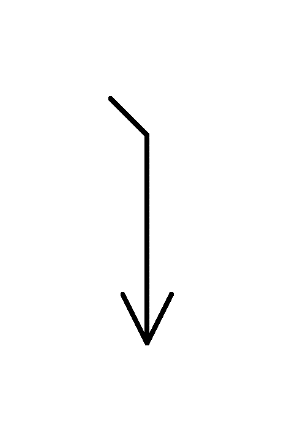

&#1056;&#1080;&#1089;&#1091;&#1085;&#1086;&#1082; 2.1 &ndash; &#1076;&#1086;&#1087;&#1086;&#1083;&#1085;&#1080;&#1090;&#1077;&#1083;&#1100;&#1085;&#1099;&#1081; &#1076;&#1080;&#1072;&#1075;&#1086;&#1085;&#1072;&#1083;&#1100;&#1085;&#1099;&#1081; &#1086;&#1090;&#1088;&#1077;&#1079;&#1086;&#1082; &#1074; &#1085;&#1072;&#1095;&#1072;&#1083;&#1077; &#1074;&#1077;&#1088;&#1090;&#1080;&#1082;&#1072;&#1083;&#1100;&#1085;&#1086;&#1075;&#1086; &#1091;&#1095;&#1072;&#1089;&#1090;&#1082;&#1072; &#1083;&#1080;&#1085;&#1080;&#1080;.

<ul class="c23 lst-kix_list_13-0"><li class="c21">&#1045;&#1089;&#1083;&#1080; &#1087;&#1086;&#1089;&#1083;&#1077;&#1076;&#1085;&#1080;&#1077; &#1076;&#1074;&#1077; &#1090;&#1086;&#1095;&#1082;&#1080; &#1083;&#1080;&#1085;&#1080;&#1080; &#1086;&#1087;&#1080;&#1089;&#1099;&#1074;&#1072;&#1102;&#1090; &#1074;&#1077;&#1088;&#1090;&#1080;&#1082;&#1072;&#1083;&#1100;&#1085;&#1099;&#1081; &#1086;&#1090;&#1088;&#1077;&#1079;&#1086;&#1082;, &#1072; &#1087;&#1077;&#1088;&#1077;&#1076; &#1101;&#1090;&#1080;&#1084; &#1087;&#1088;&#1080;&#1089;&#1091;&#1090;&#1089;&#1090;&#1074;&#1086;&#1074;&#1072;&#1083; &#1080; &#1075;&#1086;&#1088;&#1080;&#1079;&#1086;&#1085;&#1090;&#1072;&#1083;&#1100;&#1085;&#1099;&#1081; &#1091;&#1095;&#1072;&#1089;&#1090;&#1086;&#1082; &#1083;&#1080;&#1085;&#1080;&#1080;, &#1090;&#1086; &#1087;&#1088;&#1086;&#1074;&#1086;&#1076;&#1080;&#1090;&#1089;&#1103; &#1076;&#1086;&#1087;&#1086;&#1083;&#1085;&#1080;&#1090;&#1077;&#1083;&#1100;&#1085;&#1099;&#1081; &#1076;&#1080;&#1072;&#1075;&#1086;&#1085;&#1072;&#1083;&#1100;&#1085;&#1099;&#1081; &#1086;&#1090;&#1088;&#1077;&#1079;&#1086;&#1082; (&#1089;&#1084;. &#1088;&#1080;&#1089;&#1091;&#1085;&#1086;&#1082; 2.2).</li></ul>

&#1056;&#1080;&#1089;&#1091;&#1085;&#1086;&#1082; 2.2 &ndash; &#1076;&#1086;&#1087;&#1086;&#1083;&#1085;&#1080;&#1090;&#1077;&#1083;&#1100;&#1085;&#1099;&#1081; &#1076;&#1080;&#1072;&#1075;&#1086;&#1085;&#1072;&#1083;&#1100;&#1085;&#1099;&#1081; &#1086;&#1090;&#1088;&#1077;&#1079;&#1086;&#1082; &#1074; &#1082;&#1086;&#1085;&#1094;&#1077; &#1074;&#1077;&#1088;&#1090;&#1080;&#1082;&#1072;&#1083;&#1100;&#1085;&#1086;&#1075;&#1086; &#1091;&#1095;&#1072;&#1089;&#1090;&#1082;&#1072; &#1083;&#1080;&#1085;&#1080;&#1080;.
<ul class="c23 lst-kix_list_13-0"><li class="c21">&#1045;&#1089;&#1083;&#1080; &#1083;&#1080;&#1085;&#1080;&#1103; &#1085;&#1072;&#1095;&#1080;&#1085;&#1072;&#1077;&#1090;&#1089;&#1103; &#1074;&#1077;&#1088;&#1090;&#1080;&#1082;&#1072;&#1083;&#1100;&#1085;&#1099;&#1084; &#1091;&#1095;&#1072;&#1089;&#1090;&#1082;&#1086;&#1084;, &#1087;&#1086;&#1090;&#1086;&#1084; &#1089;&#1086;&#1076;&#1077;&#1088;&#1078;&#1080;&#1090; &#1075;&#1086;&#1088;&#1080;&#1079;&#1086;&#1085;&#1090;&#1072;&#1083;&#1100;&#1085;&#1099;&#1081; &#1091;&#1095;&#1072;&#1089;&#1090;&#1086;&#1082; &#1080; &#1079;&#1072;&#1082;&#1072;&#1085;&#1095;&#1080;&#1074;&#1072;&#1077;&#1090; &#1074;&#1077;&#1088;&#1090;&#1080;&#1082;&#1072;&#1083;&#1100;&#1085;&#1099;&#1084; &#1091;&#1095;&#1072;&#1089;&#1090;&#1082;&#1086;&#1084;, &#1087;&#1086; &#1089;&#1077;&#1088;&#1077;&#1076;&#1080;&#1085;&#1077; &#1075;&#1086;&#1088;&#1080;&#1079;&#1086;&#1085;&#1090;&#1072;&#1083;&#1100;&#1085;&#1086;&#1075;&#1086; &#1091;&#1095;&#1072;&#1089;&#1090;&#1082;&#1072; &#1089;&#1090;&#1072;&#1074;&#1080;&#1090;&#1089;&#1103; &#1089;&#1090;&#1088;&#1077;&#1083;&#1082;&#1072; (&#1089;&#1084;. &#1088;&#1080;&#1089;&#1091;&#1085;&#1086;&#1082; 2.3).</li></ul>
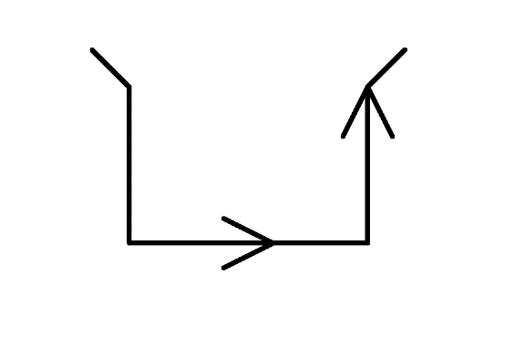

&#1056;&#1080;&#1089;&#1091;&#1085;&#1086;&#1082; 2.3. &ndash; &#1089;&#1090;&#1088;&#1077;&#1083;&#1082;&#1072; &#1087;&#1086; &#1089;&#1077;&#1088;&#1077;&#1076;&#1080;&#1085;&#1077; &#1075;&#1086;&#1088;&#1080;&#1079;&#1086;&#1085;&#1090;&#1072;&#1083;&#1100;&#1085;&#1086;&#1081; &#1083;&#1080;&#1085;&#1080;&#1080;

<ul class="c23 lst-kix_list_13-0"><li class="c21">&#1045;&#1089;&#1083;&#1080; &#1090;&#1086;&#1095;&#1082;&#1072; &#1085;&#1072;&#1095;&#1072;&#1083;&#1072; &#1075;&#1086;&#1088;&#1080;&#1079;&#1086;&#1085;&#1090;&#1072;&#1083;&#1100;&#1085;&#1086;&#1081; &#1083;&#1080;&#1085;&#1080;&#1080; &#1087;&#1088;&#1080;&#1085;&#1072;&#1076;&#1083;&#1077;&#1078;&#1080;&#1090; &#1074;&#1077;&#1088;&#1090;&#1080;&#1082;&#1072;&#1083;&#1100;&#1085;&#1086;&#1084;&#1091; &#1091;&#1095;&#1072;&#1089;&#1090;&#1082;&#1091; &#1076;&#1088;&#1091;&#1075;&#1086;&#1081; &#1083;&#1080;&#1085;&#1080;&#1080;, &#1090;&#1086; &#1087;&#1088;&#1086;&#1074;&#1086;&#1076;&#1080;&#1090;&#1089;&#1103; &#1076;&#1086;&#1087;&#1086;&#1083;&#1085;&#1080;&#1090;&#1077;&#1083;&#1100;&#1085;&#1099;&#1081; &#1076;&#1080;&#1072;&#1075;&#1086;&#1085;&#1072;&#1083;&#1100;&#1085;&#1099;&#1081; &#1086;&#1090;&#1088;&#1077;&#1079;&#1086;&#1082; (&#1089;&#1084;. &#1088;&#1080;&#1089;&#1091;&#1085;&#1086;&#1082; 2.4).</li></ul>
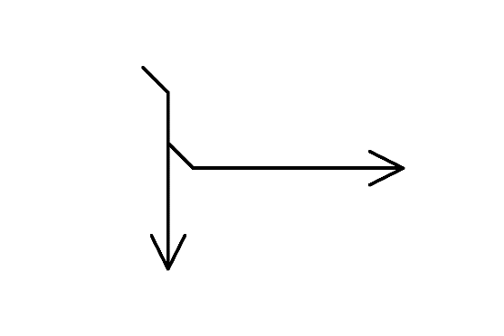

&#1056;&#1080;&#1089;&#1091;&#1085;&#1086;&#1082; 2.4. &ndash; &#1076;&#1086;&#1087;&#1086;&#1083;&#1085;&#1080;&#1090;&#1077;&#1083;&#1100;&#1085;&#1099;&#1081; &#1076;&#1080;&#1072;&#1075;&#1086;&#1085;&#1072;&#1083;&#1100;&#1085;&#1099;&#1081; &#1086;&#1090;&#1088;&#1077;&#1079;&#1086;&#1082; &#1074; &#1085;&#1072;&#1095;&#1072;&#1083;&#1077; &#1075;&#1086;&#1088;&#1080;&#1079;&#1086;&#1085;&#1090;&#1072;&#1083;&#1100;&#1085;&#1086;&#1075;&#1086; &#1091;&#1095;&#1072;&#1089;&#1090;&#1082;&#1072; &#1083;&#1080;&#1085;&#1080;&#1080;

<ul class="c23 lst-kix_list_13-0"><li class="c4 c41">&#1045;&#1089;&#1083;&#1080; &#1090;&#1086;&#1095;&#1082;&#1072; &#1082;&#1086;&#1085;&#1094;&#1072; &#1075;&#1086;&#1088;&#1080;&#1079;&#1086;&#1085;&#1090;&#1072;&#1083;&#1100;&#1085;&#1086;&#1081; &#1083;&#1080;&#1085;&#1080;&#1080; &#1087;&#1088;&#1080;&#1085;&#1072;&#1076;&#1083;&#1077;&#1078;&#1080;&#1090; &#1074;&#1077;&#1088;&#1090;&#1080;&#1082;&#1072;&#1083;&#1100;&#1085;&#1086;&#1084;&#1091; &#1091;&#1095;&#1072;&#1089;&#1090;&#1082;&#1091; &#1076;&#1088;&#1091;&#1075;&#1086;&#1081; &#1083;&#1080;&#1085;&#1080;&#1080;, &#1090;&#1086; &#1087;&#1088;&#1086;&#1074;&#1086;&#1076;&#1080;&#1090;&#1089;&#1103; &#1076;&#1086;&#1087;&#1086;&#1083;&#1085;&#1080;&#1090;&#1077;&#1083;&#1100;&#1085;&#1099;&#1081; &#1076;&#1080;&#1072;&#1075;&#1086;&#1085;&#1072;&#1083;&#1100;&#1085;&#1099;&#1081; &#1086;&#1090;&#1088;&#1077;&#1079;&#1086;&#1082; (&#1089;&#1084;. &#1088;&#1080;&#1089;&#1091;&#1085;&#1086;&#1082; 2.5.).</li></ul>
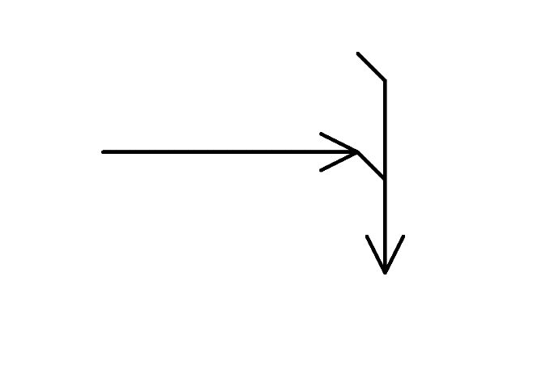

&#1056;&#1080;&#1089;&#1091;&#1085;&#1086;&#1082; 2.5. &ndash; &#1076;&#1086;&#1087;&#1086;&#1083;&#1085;&#1080;&#1090;&#1077;&#1083;&#1100;&#1085;&#1099;&#1081; &#1076;&#1080;&#1072;&#1075;&#1086;&#1085;&#1072;&#1083;&#1100;&#1085;&#1099;&#1081; &#1086;&#1090;&#1088;&#1077;&#1079;&#1086;&#1082; &#1074; &#1082;&#1086;&#1085;&#1094;&#1077; &#1075;&#1086;&#1088;&#1080;&#1079;&#1086;&#1085;&#1090;&#1072;&#1083;&#1100;&#1085;&#1086;&#1075;&#1086; &#1091;&#1095;&#1072;&#1089;&#1090;&#1082;&#1072; &#1083;&#1080;&#1085;&#1080;&#1080;

<ul class="c23 lst-kix_list_13-0"><li class="c4 c41">&#1055;&#1086;&#1083;&#1100;&#1079;&#1086;&#1074;&#1072;&#1090;&#1077;&#1083;&#1100; &#1076;&#1086;&#1083;&#1078;&#1077;&#1085; &#1080;&#1084;&#1077;&#1090;&#1100; &#1074;&#1086;&#1079;&#1084;&#1086;&#1078;&#1085;&#1086;&#1089;&#1090;&#1100; &#1080;&#1079;&#1084;&#1077;&#1085;&#1103;&#1090;&#1100; &#1088;&#1072;&#1079;&#1084;&#1077;&#1088; &#1087;&#1086;&#1083;&#1086;&#1090;&#1085;&#1072;</li><li class="c21">&#1055;&#1086;&#1083;&#1100;&#1079;&#1086;&#1074;&#1072;&#1090;&#1077;&#1083;&#1100; &#1076;&#1086;&#1083;&#1078;&#1077;&#1085; &#1080;&#1084;&#1077;&#1090;&#1100; &#1074;&#1086;&#1079;&#1084;&#1086;&#1078;&#1085;&#1086;&#1089;&#1090;&#1100; &#1080;&#1079;&#1084;&#1077;&#1085;&#1080;&#1090;&#1100; &#1084;&#1072;&#1089;&#1096;&#1090;&#1072;&#1073; &#1080;&#1079;&#1086;&#1073;&#1088;&#1072;&#1078;&#1077;&#1085;&#1080;&#1103;</li></ul>

<ol class="c23 lst-kix_list_4-0" start="3"><li class="c31 c41"><h1 id="h.17dp8vu" style="display:inline">&#1055;&#1056;&#1054;&#1045;&#1050;&#1058;&#1048;&#1056;&#1054;&#1042;&#1040;&#1053;&#1048;&#1045; &#1055;&#1056;&#1054;&#1043;&#1056;&#1040;&#1052;&#1052;&#1053;&#1054;&#1043;&#1054; &#1057;&#1056;&#1045;&#1044;&#1057;&#1058;&#1042;&#1040;</h1></li></ol><ol class="c23 lst-kix_list_4-1 start" start="1"><li class="c18"><h2 id="h.3rdcrjn" style="display:inline">&#1055;&#1088;&#1086;&#1077;&#1082;&#1090;&#1080;&#1088;&#1086;&#1074;&#1072;&#1085;&#1080;&#1077; &#1076;&#1080;&#1085;&#1072;&#1084;&#1080;&#1095;&#1077;&#1089;&#1082;&#1080;&#1093; &#1089;&#1090;&#1088;&#1091;&#1082;&#1090;&#1091;&#1088; &#1076;&#1072;&#1085;&#1085;&#1099;&#1093;</h2></li></ol>

&#1042; &#1087;&#1077;&#1088;&#1074;&#1091;&#1102; &#1086;&#1095;&#1077;&#1088;&#1077;&#1076;&#1100;, &#1085;&#1077;&#1086;&#1073;&#1093;&#1086;&#1076;&#1080;&#1084;&#1086; &#1093;&#1088;&#1072;&#1085;&#1080;&#1090;&#1100; &#1092;&#1080;&#1075;&#1091;&#1088;&#1099;. &#1058;&#1072;&#1082; &#1082;&#1072;&#1082; &#1087;&#1086;&#1083;&#1100;&#1079;&#1086;&#1074;&#1072;&#1090;&#1077;&#1083;&#1100; &#1073;&#1091;&#1076;&#1077;&#1090; &#1087;&#1086;&#1089;&#1090;&#1086;&#1103;&#1085;&#1085;&#1086; &#1076;&#1086;&#1073;&#1072;&#1074;&#1083;&#1103;&#1090;&#1100; &#1080; &#1091;&#1076;&#1072;&#1083;&#1103;&#1090;&#1100; &#1092;&#1080;&#1075;&#1091;&#1088;&#1099;, &#1085;&#1072;&#1087;&#1088;&#1072;&#1096;&#1080;&#1074;&#1072;&#1077;&#1090;&#1089;&#1103; &#1080;&#1089;&#1087;&#1086;&#1083;&#1100;&#1079;&#1086;&#1074;&#1072;&#1085;&#1080;&#1077; &#1076;&#1080;&#1085;&#1072;&#1084;&#1080;&#1095;&#1077;&#1089;&#1082;&#1080;&#1093; &#1089;&#1087;&#1080;&#1089;&#1082;&#1086;&#1074;. &#1054;&#1076;&#1085;&#1072;&#1082;&#1086; &#1085;&#1091;&#1078;&#1085;&#1086; &#1087;&#1088;&#1077;&#1076;&#1091;&#1089;&#1084;&#1086;&#1090;&#1088;&#1077;&#1090;&#1100; &#1089;&#1083;&#1077;&#1076;&#1091;&#1102;&#1097;&#1080;&#1077; &#1086;&#1089;&#1086;&#1073;&#1077;&#1085;&#1085;&#1086;&#1089;&#1090;&#1080;:
<ul class="c23 lst-kix_list_14-0 start"><li class="c4 c41">&#1055;&#1088;&#1080;&#1089;&#1091;&#1090;&#1089;&#1090;&#1074;&#1091;&#1102;&#1090; &#1088;&#1072;&#1079;&#1083;&#1080;&#1095;&#1085;&#1099;&#1077; &#1092;&#1080;&#1075;&#1091;&#1088;&#1099; &#1089; &#1088;&#1072;&#1079;&#1085;&#1099;&#1084; &#1089;&#1087;&#1086;&#1089;&#1086;&#1073;&#1086;&#1084; &#1086;&#1087;&#1080;&#1089;&#1072;&#1085;&#1080;&#1103;. </li><li class="c4 c41">&#1059; &#1083;&#1080;&#1085;&#1080;&#1081; &#1087;&#1086;&#1083;&#1100;&#1079;&#1086;&#1074;&#1072;&#1090;&#1077;&#1083;&#1100; &#1084;&#1086;&#1078;&#1077;&#1090; &#1076;&#1080;&#1085;&#1072;&#1084;&#1080;&#1095;&#1077;&#1089;&#1082;&#1080; &#1076;&#1086;&#1073;&#1072;&#1074;&#1083;&#1103;&#1090;&#1100; &#1090;&#1086;&#1095;&#1082;&#1080;. </li><li class="c21">&#1048;&#1085;&#1092;&#1086;&#1088;&#1084;&#1072;&#1090;&#1080;&#1074;&#1085;&#1091;&#1102; &#1095;&#1072;&#1089;&#1090;&#1100; &#1085;&#1091;&#1078;&#1085;&#1086; &#1089;&#1086;&#1093;&#1088;&#1072;&#1085;&#1103;&#1090;&#1100; &#1074; &#1092;&#1072;&#1081;&#1083;, &#1072; &#1074; &#1092;&#1072;&#1081;&#1083;&#1077; &#1085;&#1077;&#1086;&#1073;&#1093;&#1086;&#1076;&#1080;&#1084;&#1086; &#1082;&#1072;&#1082;-&#1083;&#1080;&#1073;&#1086; &#1093;&#1088;&#1072;&#1085;&#1080;&#1090;&#1100; &#1089;&#1086;&#1093;&#1088;&#1072;&#1085;&#1077;&#1085;&#1085;&#1086;&#1077; &#1088;&#1072;&#1079;&#1088;&#1077;&#1096;&#1077;&#1085;&#1080;&#1077; &#1087;&#1086;&#1083;&#1086;&#1090;&#1085;&#1072; &#1080; &#1087;&#1088;&#1086;&#1074;&#1077;&#1088;&#1103;&#1090;&#1100; &#1092;&#1072;&#1081;&#1083; &#1085;&#1072; &#1074;&#1072;&#1083;&#1080;&#1076;&#1085;&#1086;&#1089;&#1090;&#1100;.</li></ul>
&#1055;&#1086;&#1101;&#1090;&#1086;&#1084;&#1091; &#1073;&#1099;&#1083;&#1086; &#1087;&#1088;&#1080;&#1085;&#1103;&#1090;&#1086; &#1088;&#1077;&#1096;&#1077;&#1085;&#1080;&#1077; &#1080;&#1089;&#1087;&#1086;&#1083;&#1100;&#1079;&#1086;&#1074;&#1072;&#1090;&#1100; &#1074; &#1082;&#1072;&#1095;&#1077;&#1089;&#1090;&#1074;&#1077; &#1079;&#1072;&#1087;&#1080;&#1089;&#1080; &#1080;&#1085;&#1092;&#1086;&#1088;&#1084;&#1072;&#1090;&#1080;&#1074;&#1085;&#1086;&#1081; &#1095;&#1072;&#1089;&#1090;&#1080; &#1089;&#1087;&#1080;&#1089;&#1082;&#1072; &#1079;&#1072;&#1087;&#1080;&#1089;&#1100; &#1089; &#1074;&#1072;&#1088;&#1080;&#1072;&#1085;&#1090;&#1085;&#1086;&#1081; &#1095;&#1072;&#1089;&#1090;&#1100;&#1102;. &#1057;&#1090;&#1088;&#1091;&#1082;&#1090;&#1091;&#1088;&#1072; &#1087;&#1088;&#1077;&#1076;&#1089;&#1090;&#1072;&#1074;&#1083;&#1077;&#1085;&#1072; &#1085;&#1072; &#1088;&#1080;&#1089;&#1091;&#1085;&#1082;&#1077; 3.1. 

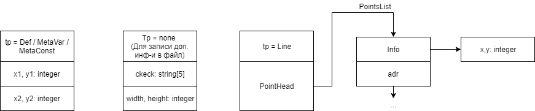

&#1056;&#1080;&#1089;&#1091;&#1085;&#1086;&#1082; 3.1 &ndash; &#1089;&#1090;&#1088;&#1091;&#1082;&#1090;&#1091;&#1088;&#1072; &#1086;&#1089;&#1085;&#1086;&#1074;&#1085;&#1086;&#1075;&#1086; &#1089;&#1087;&#1080;&#1089;&#1082;&#1072; &#1087;&#1088;&#1086;&#1075;&#1088;&#1072;&#1084;&#1084;&#1099;

&#1058;&#1072;&#1082; &#1082;&#1072;&#1082; &#1092;&#1080;&#1075;&#1091;&#1088;&#1072; &#1083;&#1080;&#1085;&#1080;&#1080; &#1093;&#1088;&#1072;&#1085;&#1080;&#1090; &#1074; &#1089;&#1077;&#1073;&#1077; &#1091;&#1082;&#1072;&#1079;&#1072;&#1090;&#1077;&#1083;&#1100; &#1085;&#1072; &#1089;&#1087;&#1080;&#1089;&#1086;&#1082; &#1090;&#1086;&#1095;&#1077;&#1082; &#1083;&#1080;&#1085;&#1080;&#1080;, &#1085;&#1091;&#1078;&#1085;&#1086; &#1087;&#1088;&#1080;&#1076;&#1091;&#1084;&#1072;&#1090;&#1100;, &#1082;&#1072;&#1082; &#1089;&#1086;&#1093;&#1088;&#1072;&#1085;&#1103;&#1090;&#1100; &#1101;&#1090;&#1086; &#1074; &#1092;&#1072;&#1081;&#1083;. &#1044;&#1083;&#1103; &#1101;&#1090;&#1086;&#1075;&#1086; &#1103; &#1088;&#1077;&#1096;&#1080;&#1083; &#1089;&#1086;&#1079;&#1076;&#1072;&#1090;&#1100; &#1089;&#1076;&#1077;&#1083;&#1072;&#1090;&#1100; &#1086;&#1090;&#1076;&#1077;&#1083;&#1100;&#1085;&#1086;&#1077; &#1087;&#1088;&#1077;&#1076;&#1089;&#1090;&#1072;&#1074;&#1083;&#1077;&#1085;&#1080;&#1077; &#1079;&#1072;&#1087;&#1080;&#1089;&#1080; &#1076;&#1083;&#1103; &#1083;&#1080;&#1085;&#1080;&#1081; &#1080;&#1084;&#1077;&#1085;&#1085;&#1086; &#1076;&#1083;&#1103; &#1089;&#1086;&#1093;&#1088;&#1072;&#1085;&#1077;&#1085;&#1080;&#1103; &#1074; &#1092;&#1072;&#1081;&#1083;. &#1055;&#1088;&#1080; &#1090;&#1072;&#1082;&#1086;&#1081; &#1089;&#1090;&#1088;&#1091;&#1082;&#1090;&#1091;&#1088;&#1077; &#1082;&#1086;&#1086;&#1088;&#1076;&#1080;&#1085;&#1072;&#1090;&#1099; &#1087;&#1088;&#1077;&#1086;&#1073;&#1088;&#1072;&#1079;&#1091;&#1102;&#1090;&#1089;&#1103; &#1074; &#1089;&#1087;&#1077;&#1094;&#1080;&#1072;&#1083;&#1100;&#1085;&#1099;&#1081; &#1090;&#1077;&#1082;&#1089;&#1090;&#1086;&#1074;&#1099;&#1081; &#1092;&#1086;&#1088;&#1084;&#1072;&#1090;, &#1072; &#1087;&#1088;&#1080; &#1086;&#1090;&#1082;&#1088;&#1099;&#1090;&#1080;&#1080; &#1092;&#1072;&#1081;&#1083;&#1072;, &#1076;&#1077;&#1082;&#1086;&#1076;&#1080;&#1088;&#1091;&#1102;&#1090;&#1089;&#1103; &#1080; &#1087;&#1088;&#1077;&#1086;&#1073;&#1088;&#1072;&#1079;&#1091;&#1102;&#1090;&#1089;&#1103; &#1086;&#1073;&#1088;&#1072;&#1090;&#1085;&#1086; &ndash; &#1074; &#1089;&#1087;&#1080;&#1089;&#1086;&#1082; &#1090;&#1086;&#1095;&#1077;&#1082;. &#1057;&#1090;&#1088;&#1091;&#1082;&#1090;&#1091;&#1088;&#1072; &#1079;&#1072;&#1087;&#1080;&#1089;&#1080; &#1083;&#1080;&#1085;&#1080;&#1080; &#1076;&#1083;&#1103; &#1079;&#1072;&#1087;&#1080;&#1089;&#1080; &#1074; &#1092;&#1072;&#1081;&#1083; &#1087;&#1088;&#1077;&#1076;&#1089;&#1090;&#1072;&#1074;&#1083;&#1077;&#1085;&#1072; &#1085;&#1072; &#1088;&#1080;&#1089;&#1091;&#1085;&#1082;&#1077; 3.2.

&#1056;&#1080;&#1089;&#1091;&#1085;&#1086;&#1082; 3.2. - &#1089;&#1090;&#1088;&#1091;&#1082;&#1090;&#1091;&#1088;&#1072; &#1079;&#1072;&#1087;&#1080;&#1089;&#1080; &#1083;&#1080;&#1085;&#1080;&#1080; &#1076;&#1083;&#1103; &#1079;&#1072;&#1087;&#1080;&#1089;&#1080; &#1074; &#1092;&#1072;&#1081;&#1083;

&#1044;&#1083;&#1103; &#1090;&#1086;&#1075;&#1086;, &#1095;&#1090;&#1086;&#1073;&#1099; &#1087;&#1088;&#1077;&#1076;&#1091;&#1089;&#1084;&#1086;&#1090;&#1088;&#1077;&#1090;&#1100; &#1092;&#1091;&#1085;&#1082;&#1094;&#1080;&#1086;&#1085;&#1072;&#1083; &#1086;&#1090;&#1084;&#1077;&#1085;&#1099; &#1080;&#1079;&#1084;&#1077;&#1085;&#1077;&#1085;&#1080;&#1081;, &#1085;&#1077;&#1086;&#1073;&#1093;&#1086;&#1076;&#1080;&#1084;&#1086; &#1075;&#1076;&#1077;-&#1090;&#1086; &#1093;&#1088;&#1072;&#1085;&#1080;&#1090;&#1100; &#1082;&#1072;&#1078;&#1076;&#1086;&#1077; &#1080;&#1079;&#1084;&#1077;&#1085;&#1077;&#1085;&#1080;&#1077;. &#1044;&#1083;&#1103; &#1101;&#1090;&#1086;&#1075;&#1086; &#1083;&#1091;&#1095;&#1096;&#1077; &#1074;&#1089;&#1077;&#1075;&#1086; &#1087;&#1086;&#1076;&#1093;&#1086;&#1076;&#1080;&#1090; &#1089;&#1090;&#1077;&#1082;, &#1090;.&#1077;. &#1082;&#1072;&#1078;&#1076;&#1086;&#1077; &#1080;&#1079;&#1084;&#1077;&#1085;&#1077;&#1085;&#1080;&#1077; &#1073;&#1091;&#1076;&#1077;&#1090; &#1087;&#1086;&#1084;&#1077;&#1097;&#1072;&#1090;&#1100;&#1089;&#1103; &#1074; &#1074;&#1077;&#1088;&#1096;&#1080;&#1085;&#1091; &#1089;&#1090;&#1077;&#1082;&#1072;. &#1055;&#1088;&#1080; &#1086;&#1090;&#1084;&#1077;&#1085;&#1077; &#1080;&#1079;&#1084;&#1077;&#1085;&#1077;&#1085;&#1080;&#1081; &#1073;&#1091;&#1076;&#1077;&#1090; &#1080;&#1079;&#1074;&#1083;&#1077;&#1082;&#1072;&#1090;&#1100;&#1089;&#1103; &#1074;&#1077;&#1088;&#1096;&#1080;&#1085;&#1072; &#1080; &#1074;&#1077;&#1088;&#1096;&#1080;&#1085;&#1072; &#1073;&#1091;&#1076;&#1077;&#1090; &#1087;&#1077;&#1088;&#1077;&#1084;&#1077;&#1097;&#1072;&#1090;&#1100;&#1089;&#1103; &#1082; &#1087;&#1088;&#1077;&#1076;&#1099;&#1076;&#1091;&#1097;&#1077;&#1084;&#1091; &#1101;&#1083;&#1077;&#1084;&#1077;&#1085;&#1090;&#1091;, &#1090;&#1086; &#1077;&#1089;&#1090;&#1100; &#1089;&#1090;&#1088;&#1091;&#1082;&#1090;&#1091;&#1088;&#1072; &#1073;&#1091;&#1076;&#1077;&#1090; &#1080;&#1084;&#1077;&#1090;&#1100; &#1074;&#1080;&#1076;, &#1087;&#1088;&#1080;&#1074;&#1077;&#1076;&#1077;&#1085;&#1085;&#1099;&#1081; &#1085;&#1072; &#1088;&#1080;&#1089;&#1091;&#1085;&#1082;&#1077; 3.3. 

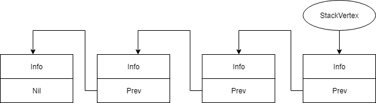

&#1056;&#1080;&#1089;&#1091;&#1085;&#1086;&#1082; 3.3 &ndash; &#1089;&#1090;&#1088;&#1091;&#1082;&#1090;&#1091;&#1088;&#1072; &#1089;&#1090;&#1077;&#1082;&#1072; &#1080;&#1079;&#1084;&#1077;&#1085;&#1077;&#1085;&#1080;&#1081;

&#1044;&#1083;&#1103; &#1090;&#1086;&#1075;&#1086;, &#1095;&#1090;&#1086;&#1073;&#1099; &#1085;&#1077; &#1076;&#1086;&#1087;&#1091;&#1089;&#1090;&#1080;&#1090;&#1100; &#1080;&#1079;&#1074;&#1083;&#1077;&#1095;&#1077;&#1085;&#1080;&#1103; &#1089;&#1072;&#1084;&#1086;&#1075;&#1086; &#1087;&#1086;&#1089;&#1083;&#1077;&#1076;&#1085;&#1077;&#1075;&#1086; &#1101;&#1083;&#1077;&#1084;&#1077;&#1085;&#1090;&#1072;, &#1090;&#1077;&#1084; &#1089;&#1072;&#1084;&#1099;&#1084;, &#1087;&#1086;&#1090;&#1077;&#1088;&#1080; &#1091;&#1082;&#1072;&#1079;&#1072;&#1090;&#1077;&#1083;&#1103; &#1085;&#1072; &#1074;&#1077;&#1088;&#1096;&#1080;&#1085;&#1091; (&#1090;.&#1082;. &#1086;&#1085; &#1073;&#1091;&#1076;&#1077;&#1090; nil), &#1103; &#1088;&#1077;&#1096;&#1080;&#1083; &#1089;&#1076;&#1077;&#1083;&#1072;&#1090;&#1100; &#1087;&#1077;&#1088;&#1077;&#1084;&#1077;&#1085;&#1085;&#1091;&#1102;, &#1086;&#1090;&#1074;&#1077;&#1095;&#1072;&#1102;&#1097;&#1091;&#1102; &#1079;&#1072; &laquo;&#1074;&#1072;&#1088;&#1080;&#1072;&#1085;&#1090;&#1085;&#1086;&#1089;&#1090;&#1100;&raquo; &#1080;&#1085;&#1092;&#1086;&#1088;&#1084;&#1072;&#1094;&#1080;&#1086;&#1085;&#1085;&#1086;&#1081; &#1095;&#1072;&#1089;&#1090;&#1080; &#1089;&#1090;&#1077;&#1082;&#1072; &#1089;&#1087;&#1077;&#1094;&#1080;&#1072;&#1083;&#1100;&#1085;&#1086; &#1090;&#1080;&#1087;&#1072; &#1080; &#1079;&#1072;&#1087;&#1088;&#1077;&#1090;&#1080;&#1090;&#1100; &#1080;&#1079;&#1084;&#1077;&#1085;&#1103;&#1090;&#1100; &#1079;&#1072;&#1087;&#1080;&#1089;&#1080; &#1089; &#1090;&#1072;&#1082;&#1080;&#1084; &#1090;&#1080;&#1087;&#1086;&#1084;. 

&#1053;&#1077;&#1086;&#1073;&#1093;&#1086;&#1076;&#1080;&#1084;&#1086; &#1087;&#1088;&#1077;&#1076;&#1091;&#1089;&#1084;&#1086;&#1090;&#1088;&#1077;&#1090;&#1100; &#1089;&#1086;&#1093;&#1088;&#1072;&#1085;&#1077;&#1085;&#1080;&#1077; &#1089;&#1083;&#1077;&#1076;&#1091;&#1102;&#1097;&#1080;&#1093; &#1080;&#1079;&#1084;&#1077;&#1085;&#1077;&#1085;&#1080;&#1081;:
<ul class="c23 lst-kix_list_15-0 start"><li class="c4 c41">&#1059;&#1076;&#1072;&#1083;&#1077;&#1085;&#1080;&#1077; &#1092;&#1080;&#1075;&#1091;&#1088;&#1099;</li></ul>
&#1047;&#1072;&#1087;&#1080;&#1089;&#1100; &#1076;&#1086;&#1083;&#1078;&#1085;&#1072; &#1089;&#1086;&#1076;&#1077;&#1088;&#1078;&#1072;&#1090;&#1100;:
<ul class="c23 lst-kix_list_15-1 start"><li class="c4 c78">&#1057;&#1089;&#1099;&#1083;&#1082;&#1091; &#1085;&#1072; &#1091;&#1076;&#1072;&#1083;&#1077;&#1085;&#1085;&#1091;&#1102; &#1092;&#1080;&#1075;&#1091;&#1088;&#1091;</li><li class="c4 c78">&#1057;&#1089;&#1099;&#1083;&#1082;&#1091; &#1085;&#1072; &#1092;&#1080;&#1075;&#1091;&#1088;&#1091;, &#1088;&#1072;&#1089;&#1087;&#1086;&#1083;&#1086;&#1078;&#1077;&#1085;&#1085;&#1091;&#1102; &#1074; &#1089;&#1087;&#1080;&#1089;&#1082;&#1077; &#1087;&#1077;&#1088;&#1077;&#1076; &#1091;&#1076;&#1072;&#1083;&#1077;&#1085;&#1085;&#1086;&#1081;.</li></ul><ul class="c23 lst-kix_list_15-0"><li class="c4 c41">&#1044;&#1086;&#1073;&#1072;&#1074;&#1083;&#1077;&#1085;&#1080;&#1077; &#1090;&#1086;&#1095;&#1082;&#1080; &#1083;&#1080;&#1085;&#1080;&#1080;:</li></ul>
&#1047;&#1072;&#1087;&#1080;&#1089;&#1100; &#1076;&#1086;&#1083;&#1078;&#1085;&#1072; &#1089;&#1086;&#1076;&#1077;&#1088;&#1078;&#1072;&#1090;&#1100;:
<ul class="c23 lst-kix_list_15-1"><li class="c4 c78">&#1057;&#1089;&#1099;&#1083;&#1082;&#1091; &#1085;&#1072; &#1092;&#1080;&#1075;&#1091;&#1088;&#1091; &#1083;&#1080;&#1085;&#1080;&#1080;</li><li class="c4 c78">&#1057;&#1089;&#1099;&#1083;&#1082;&#1091; &#1085;&#1072; &#1076;&#1086;&#1073;&#1072;&#1074;&#1083;&#1077;&#1085;&#1085;&#1091;&#1102; &#1090;&#1086;&#1095;&#1082;&#1091; &#1074; &#1089;&#1087;&#1080;&#1089;&#1082;&#1077; &#1090;&#1086;&#1095;&#1077;&#1082; &#1076;&#1072;&#1085;&#1085;&#1086;&#1081; &#1083;&#1080;&#1085;&#1080;&#1080;</li></ul><ul class="c23 lst-kix_list_15-0"><li class="c4 c41">&#1044;&#1086;&#1073;&#1072;&#1074;&#1083;&#1077;&#1085;&#1080;&#1077; &#1092;&#1080;&#1075;&#1091;&#1088;&#1099;</li></ul>
&#1047;&#1072;&#1087;&#1080;&#1089;&#1100; &#1076;&#1086;&#1083;&#1078;&#1085;&#1072; &#1089;&#1086;&#1076;&#1077;&#1088;&#1078;&#1072;&#1090;&#1100;:
<ul class="c23 lst-kix_list_15-1"><li class="c4 c78">&#1057;&#1089;&#1099;&#1083;&#1082;&#1091; &#1085;&#1072; &#1076;&#1086;&#1073;&#1072;&#1074;&#1083;&#1077;&#1085;&#1085;&#1091;&#1102; &#1092;&#1080;&#1075;&#1091;&#1088;&#1091;</li></ul><ul class="c23 lst-kix_list_15-0"><li class="c4 c41">&#1055;&#1077;&#1088;&#1077;&#1084;&#1077;&#1097;&#1077;&#1085;&#1080;&#1077; &#1092;&#1080;&#1075;&#1091;&#1088;&#1099;/&#1080;&#1079;&#1084;&#1077;&#1085;&#1077;&#1085;&#1080;&#1077; &#1088;&#1072;&#1079;&#1084;&#1077;&#1088;&#1086;&#1074; &#1092;&#1080;&#1075;&#1091;&#1088;&#1099; (&#1082;&#1088;&#1086;&#1084;&#1077; &#1083;&#1080;&#1085;&#1080;&#1081;) </li></ul>
&#1047;&#1072;&#1087;&#1080;&#1089;&#1100; &#1076;&#1086;&#1083;&#1078;&#1085;&#1072; &#1089;&#1086;&#1076;&#1077;&#1088;&#1078;&#1072;&#1090;&#1100;:
<ul class="c23 lst-kix_list_15-1"><li class="c4 c78">&#1057;&#1089;&#1099;&#1083;&#1082;&#1091; &#1085;&#1072; &#1092;&#1080;&#1075;&#1091;&#1088;&#1091;, &#1082;&#1086;&#1090;&#1086;&#1088;&#1091;&#1102; &#1087;&#1077;&#1088;&#1077;&#1084;&#1077;&#1089;&#1090;&#1080;&#1083;&#1080;</li><li class="c4 c78">&#1055;&#1088;&#1077;&#1076;&#1099;&#1076;&#1091;&#1097;&#1077;&#1077; &#1079;&#1085;&#1072;&#1095;&#1077;&#1085;&#1080;&#1077; &#1079;&#1072;&#1087;&#1080;&#1089;&#1080; &#1080;&#1085;&#1092;&#1086;&#1088;&#1084;&#1072;&#1090;&#1080;&#1074;&#1085;&#1086;&#1081; &#1095;&#1072;&#1089;&#1090;&#1080; &#1092;&#1080;&#1075;&#1091;&#1088;&#1099; (&#1087;&#1088;&#1077;&#1076;&#1099;&#1076;&#1091;&#1097;&#1080;&#1077; &#1082;&#1086;&#1086;&#1088;&#1076;&#1080;&#1085;&#1072;&#1090;&#1099;)</li></ul><ul class="c23 lst-kix_list_15-0"><li class="c4 c41">&#1055;&#1077;&#1088;&#1077;&#1084;&#1077;&#1097;&#1077;&#1085;&#1080;&#1077; &#1083;&#1080;&#1085;&#1080;&#1080; / &#1087;&#1077;&#1088;&#1077;&#1084;&#1077;&#1097;&#1077;&#1085;&#1080;&#1077; &#1090;&#1086;&#1095;&#1082;&#1080; &#1083;&#1080;&#1085;&#1080;&#1080;</li></ul>
&#1047;&#1072;&#1087;&#1080;&#1089;&#1100; &#1076;&#1086;&#1083;&#1078;&#1085;&#1072; &#1089;&#1086;&#1076;&#1077;&#1088;&#1078;&#1072;&#1090;&#1100;:
<ul class="c23 lst-kix_list_15-1"><li class="c4 c78">&#1057;&#1089;&#1099;&#1083;&#1082;&#1072; &#1085;&#1072; &#1092;&#1080;&#1075;&#1091;&#1088;&#1091; &#1083;&#1080;&#1085;&#1080;&#1080;, &#1082;&#1086;&#1090;&#1086;&#1088;&#1091;&#1102; &#1087;&#1077;&#1088;&#1077;&#1084;&#1077;&#1089;&#1090;&#1080;&#1083;&#1080;</li><li class="c4 c78">&#1050;&#1086;&#1087;&#1080;&#1102; &#1089;&#1090;&#1072;&#1088;&#1099;&#1093; &#1082;&#1086;&#1086;&#1088;&#1076;&#1080;&#1085;&#1072;&#1090; &#1074;&#1089;&#1077;&#1093; &#1090;&#1086;&#1095;&#1077;&#1082;, &#1089;&#1086;&#1093;&#1088;&#1072;&#1085;&#1077;&#1085;&#1085;&#1099;&#1093; &#1074; &#1090;&#1077;&#1082;&#1089;&#1090;&#1086;&#1074;&#1086;&#1084; &#1092;&#1086;&#1088;&#1084;&#1072;&#1090;&#1077; (&#1048;&#1089;&#1087;&#1086;&#1083;&#1100;&#1079;&#1091;&#1103; &#1090;&#1086;&#1090; &#1078;&#1077; &#1087;&#1088;&#1080;&#1085;&#1094;&#1080;&#1087;, &#1082;&#1072;&#1082; &#1087;&#1088;&#1080; &#1089;&#1086;&#1093;&#1088;&#1072;&#1085;&#1077;&#1085;&#1080;&#1080; &#1074; &#1092;&#1072;&#1081;&#1083;).</li></ul><ul class="c23 lst-kix_list_15-0"><li class="c4 c41">&#1048;&#1079;&#1084;&#1077;&#1085;&#1077;&#1085;&#1080;&#1077; &#1090;&#1077;&#1082;&#1089;&#1090;&#1072; &#1092;&#1080;&#1075;&#1091;&#1088;&#1099; (&#1050;&#1088;&#1086;&#1084;&#1077; &#1083;&#1080;&#1085;&#1080;&#1081;)</li></ul>
&#1047;&#1072;&#1087;&#1080;&#1089;&#1100; &#1076;&#1086;&#1083;&#1078;&#1085;&#1072; &#1089;&#1086;&#1076;&#1077;&#1088;&#1078;&#1072;&#1090;&#1100;:
<ul class="c23 lst-kix_list_15-1"><li class="c4 c78">&#1057;&#1089;&#1099;&#1083;&#1082;&#1072; &#1085;&#1072; &#1092;&#1080;&#1075;&#1091;&#1088;&#1091;</li><li class="c4 c78">&#1055;&#1088;&#1077;&#1076;&#1099;&#1076;&#1091;&#1097;&#1080;&#1081; &#1090;&#1077;&#1082;&#1089;&#1090;</li></ul><ul class="c23 lst-kix_list_15-0"><li class="c4 c41">&#1048;&#1079;&#1084;&#1077;&#1085;&#1077;&#1085;&#1080;&#1077; &#1088;&#1072;&#1079;&#1084;&#1077;&#1088;&#1086;&#1074; &#1087;&#1086;&#1083;&#1086;&#1090;&#1085;&#1072;</li></ul>
&#1047;&#1072;&#1087;&#1080;&#1089;&#1100; &#1076;&#1086;&#1083;&#1078;&#1085;&#1072; &#1089;&#1086;&#1076;&#1077;&#1088;&#1078;&#1072;&#1090;&#1100;:
<ul class="c23 lst-kix_list_15-1"><li class="c25 c78">&#1055;&#1088;&#1077;&#1076;&#1099;&#1076;&#1091;&#1097;&#1080;&#1077; &#1079;&#1085;&#1072;&#1095;&#1077;&#1085;&#1080;&#1103; &#1096;&#1080;&#1088;&#1080;&#1085;&#1099; &#1080; &#1074;&#1099;&#1089;&#1086;&#1090;&#1099; &#1087;&#1086;&#1083;&#1086;&#1090;&#1085;&#1072;</li></ul>
&#1040; &#1090;&#1072;&#1082;&#1078;&#1077; &#1076;&#1086;&#1083;&#1078;&#1085;&#1072; &#1073;&#1099;&#1090;&#1100; &#1079;&#1072;&#1087;&#1080;&#1089;&#1100;, &#1089;&#1080;&#1075;&#1085;&#1072;&#1083;&#1080;&#1079;&#1080;&#1088;&#1091;&#1102;&#1097;&#1072;&#1103; &#1082;&#1086;&#1085;&#1077;&#1094; &#1089;&#1090;&#1077;&#1082;&#1072; (&#1080;&#1089;&#1087;&#1086;&#1083;&#1100;&#1079;&#1091;&#1077;&#1090;&#1089;&#1103; &#1090;&#1086;&#1083;&#1100;&#1082;&#1086; &#1076;&#1083;&#1103; &#1077;&#1076;&#1080;&#1085;&#1089;&#1090;&#1074;&#1077;&#1085;&#1085;&#1086;&#1081; &#1079;&#1072;&#1087;&#1080;&#1089;&#1080; &#1074; &#1082;&#1086;&#1085;&#1094;&#1077; &#1089;&#1090;&#1077;&#1082;&#1072; &#1080; &#1073;&#1086;&#1083;&#1100;&#1096;&#1077; &#1085;&#1080;&#1075;&#1076;&#1077;).

&#1055;&#1086;&#1089;&#1083;&#1077; &#1072;&#1085;&#1072;&#1083;&#1080;&#1079;&#1072; &#1090;&#1077;&#1093; &#1080;&#1079;&#1084;&#1077;&#1085;&#1077;&#1085;&#1080;&#1081;, &#1082;&#1086;&#1090;&#1086;&#1088;&#1099;&#1077; &#1085;&#1077;&#1086;&#1073;&#1093;&#1086;&#1076;&#1080;&#1084;&#1086; &#1087;&#1088;&#1077;&#1076;&#1091;&#1089;&#1084;&#1086;&#1090;&#1088;&#1077;&#1090;&#1100;, &#1084;&#1085;&#1086;&#1102; &#1073;&#1099;&#1083;&#1086; &#1087;&#1088;&#1080;&#1085;&#1103;&#1090;&#1086; &#1088;&#1077;&#1096;&#1077;&#1085;&#1080;&#1077; &#1074;&#1099;&#1085;&#1077;&#1089;&#1090;&#1080; &#1074; &#1086;&#1073;&#1097;&#1091;&#1102; &#1095;&#1072;&#1089;&#1090;&#1100; &#1080;&#1085;&#1092;&#1086;&#1088;&#1084;&#1072;&#1090;&#1080;&#1074;&#1085;&#1086;&#1081; &#1079;&#1072;&#1087;&#1080;&#1089;&#1080; &#1089;&#1090;&#1077;&#1082;&#1072; &#1089;&#1089;&#1099;&#1083;&#1082;&#1091; &#1085;&#1072; &#1092;&#1080;&#1075;&#1091;&#1088;&#1091;, &#1089; &#1082;&#1086;&#1090;&#1086;&#1088;&#1086;&#1081; &#1087;&#1088;&#1086;&#1080;&#1079;&#1086;&#1096;&#1083;&#1080; &#1084;&#1072;&#1085;&#1080;&#1087;&#1091;&#1083;&#1103;&#1094;&#1080;&#1080;, &#1072; &#1086;&#1089;&#1090;&#1072;&#1083;&#1100;&#1085;&#1086;&#1077; &#1089;&#1086;&#1093;&#1088;&#1072;&#1085;&#1103;&#1090;&#1100; &#1074; &#1074;&#1072;&#1088;&#1080;&#1072;&#1085;&#1090;&#1085;&#1091;&#1102; &#1095;&#1072;&#1089;&#1090;&#1100;.

<ol class="c23 lst-kix_list_4-1" start="2"><li class="c18"><h2 id="h.26in1rg" style="display:inline">&#1056;&#1072;&#1079;&#1088;&#1072;&#1073;&#1086;&#1090;&#1082;&#1072; &#1072;&#1083;&#1075;&#1086;&#1088;&#1080;&#1090;&#1084;&#1072; &#1088;&#1077;&#1072;&#1082;&#1094;&#1080;&#1080; &#1085;&#1072; &#1082;&#1083;&#1080;&#1082; &#1087;&#1086;&#1083;&#1100;&#1079;&#1086;&#1074;&#1072;&#1090;&#1077;&#1083;&#1103; &#1087;&#1086; &#1087;&#1086;&#1083;&#1086;&#1090;&#1085;&#1091;</h2></li></ol>

&#1055;&#1086;&#1089;&#1083;&#1077; &#1090;&#1086;&#1075;&#1086;, &#1082;&#1072;&#1082; &#1087;&#1086;&#1083;&#1100;&#1079;&#1086;&#1074;&#1072;&#1090;&#1077;&#1083;&#1100; &#1082;&#1083;&#1080;&#1082;&#1085;&#1077;&#1090; &#1087;&#1086; &#1087;&#1086;&#1083;&#1086;&#1090;&#1085;&#1091;, &#1085;&#1077;&#1086;&#1073;&#1093;&#1086;&#1076;&#1080;&#1084;&#1086; &#1086;&#1073;&#1088;&#1072;&#1073;&#1086;&#1090;&#1072;&#1090;&#1100; &#1076;&#1072;&#1085;&#1085;&#1086;&#1077; &#1089;&#1086;&#1073;&#1099;&#1090;&#1080;&#1077;, &#1080;, &#1077;&#1089;&#1083;&#1080; &#1090;&#1077;&#1082;&#1091;&#1097;&#1080;&#1081; &#1088;&#1077;&#1078;&#1080;&#1084; &#1085;&#1077; &#1103;&#1074;&#1083;&#1103;&#1077;&#1090;&#1089;&#1103; &#1088;&#1077;&#1078;&#1080;&#1084;&#1086;&#1084; &#1088;&#1077;&#1076;&#1072;&#1082;&#1090;&#1080;&#1088;&#1086;&#1074;&#1072;&#1085;&#1080;&#1103;, &#1076;&#1086;&#1073;&#1072;&#1074;&#1080;&#1090;&#1100; &#1092;&#1080;&#1075;&#1091;&#1088;&#1091;. &#1058;&#1072;&#1082;&#1078;&#1077; &#1085;&#1077;&#1086;&#1073;&#1093;&#1086;&#1076;&#1080;&#1084;&#1086; &#1091;&#1095;&#1077;&#1089;&#1090;&#1100;, &#1095;&#1090;&#1086; &#1076;&#1086;&#1083;&#1078;&#1077;&#1085; &#1073;&#1099;&#1090;&#1100; &#1092;&#1080;&#1082;&#1089;&#1080;&#1088;&#1086;&#1074;&#1072;&#1085;&#1085;&#1099;&#1081; &#1096;&#1072;&#1075; &laquo;&#1089;&#1077;&#1090;&#1082;&#1080;&raquo; &#1087;&#1086;&#1083;&#1086;&#1090;&#1085;&#1072; &#1076;&#1083;&#1103; &#1073;&#1086;&#1083;&#1100;&#1096;&#1077;&#1075;&#1086; &#1091;&#1076;&#1086;&#1073;&#1089;&#1090;&#1074;&#1072; &#1087;&#1086;&#1083;&#1100;&#1079;&#1086;&#1074;&#1072;&#1090;&#1077;&#1083;&#1103;. &#1058;&#1086; &#1077;&#1089;&#1090;&#1100;, &#1087;&#1086;&#1089;&#1083;&#1077; &#1082;&#1083;&#1080;&#1082;&#1072; &#1082;&#1086;&#1086;&#1088;&#1076;&#1080;&#1085;&#1072;&#1090;&#1099; &#1076;&#1086;&#1083;&#1078;&#1085;&#1099; &laquo;&#1086;&#1082;&#1088;&#1091;&#1075;&#1083;&#1103;&#1090;&#1100;&#1089;&#1103;&raquo; &#1076;&#1086; &#1073;&#1083;&#1080;&#1078;&#1072;&#1081;&#1096;&#1077;&#1081; &#1074;&#1077;&#1088;&#1096;&#1080;&#1085;&#1099; &#1085;&#1077;&#1074;&#1080;&#1076;&#1080;&#1084;&#1086;&#1081; &#1089;&#1077;&#1090;&#1082;&#1080;. &#1057;&#1093;&#1077;&#1084;&#1072; &#1072;&#1083;&#1075;&#1086;&#1088;&#1080;&#1090;&#1084;&#1072; &#1087;&#1088;&#1077;&#1076;&#1089;&#1090;&#1072;&#1074;&#1083;&#1077;&#1085;&#1072; &#1085;&#1072; &#1088;&#1080;&#1089;&#1091;&#1085;&#1082;&#1077; 3.4. 

&#1056;&#1077;&#1078;&#1080;&#1084;&#1099; &#1088;&#1080;&#1089;&#1086;&#1074;&#1072;&#1085;&#1080;&#1103; &#1080; &#1088;&#1077;&#1076;&#1072;&#1082;&#1090;&#1080;&#1088;&#1086;&#1074;&#1072;&#1085;&#1080;&#1103; &#1103; &#1088;&#1077;&#1096;&#1080;&#1083; &#1079;&#1072;&#1087;&#1080;&#1089;&#1099;&#1074;&#1072;&#1090;&#1100; &#1074; &#1086;&#1090;&#1076;&#1077;&#1083;&#1100;&#1085;&#1099;&#1077; &#1087;&#1077;&#1088;&#1077;&#1095;&#1080;&#1089;&#1083;&#1080;&#1084;&#1099;&#1077; &#1090;&#1080;&#1087;&#1099;. (&#1044;&#1083;&#1103; &#1088;&#1080;&#1089;&#1086;&#1074;&#1072;&#1085;&#1080;&#1103;: &#1056;&#1080;&#1089;&#1086;&#1074;&#1072;&#1085;&#1080;&#1077; &#1090;&#1077;&#1082;&#1089;&#1090;&#1086;&#1074;&#1086;&#1081; &#1092;&#1080;&#1075;&#1091;&#1088;&#1099;, &#1088;&#1080;&#1089;&#1086;&#1074;&#1072;&#1085;&#1080;&#1077; &#1092;&#1080;&#1075;&#1091;&#1088;&#1099;, &#1085;&#1077;&#1090; &#1088;&#1080;&#1089;&#1086;&#1074;&#1072;&#1085;&#1080;&#1103;, &#1076;&#1083;&#1103; &#1088;&#1077;&#1076;&#1072;&#1082;&#1090;&#1080;&#1088;&#1086;&#1074;&#1072;&#1085;&#1080;&#1103;: &#1087;&#1077;&#1088;&#1077;&#1084;&#1077;&#1097;&#1077;&#1085;&#1080;&#1077; &#1092;&#1080;&#1075;&#1091;&#1088;&#1099;, &#1087;&#1077;&#1088;&#1077;&#1084;&#1077;&#1097;&#1077;&#1085;&#1080;&#1077; &#1074;&#1077;&#1088;&#1096;&#1080;&#1085;&#1099;, &#1087;&#1077;&#1088;&#1077;&#1084;&#1077;&#1097;&#1077;&#1085;&#1080;&#1077; &#1089;&#1090;&#1086;&#1088;&#1086;&#1085;&#1099;).

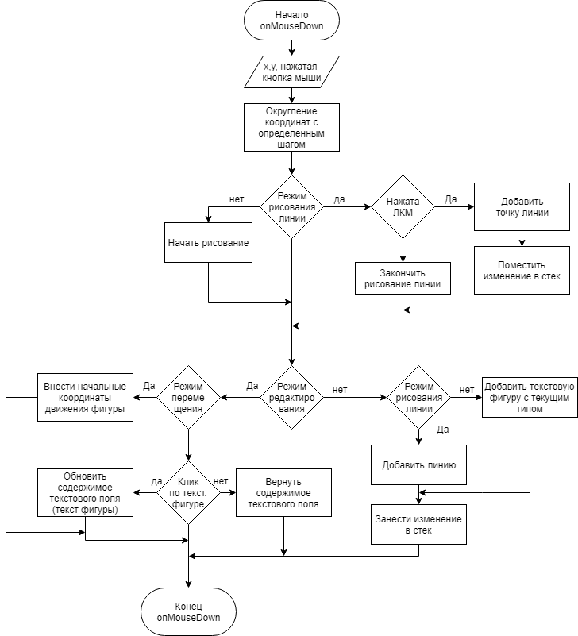

&#1056;&#1080;&#1089;&#1091;&#1085;&#1086;&#1082; 3.4 &ndash; &#1089;&#1093;&#1077;&#1084;&#1072; &#1072;&#1083;&#1075;&#1086;&#1088;&#1080;&#1090;&#1084;&#1072; &#1088;&#1077;&#1072;&#1082;&#1094;&#1080;&#1080; &#1085;&#1072; &#1082;&#1083;&#1080;&#1082; &#1087;&#1086;&#1083;&#1100;&#1079;&#1086;&#1074;&#1072;&#1090;&#1077;&#1083;&#1103; &#1087;&#1086; &#1087;&#1086;&#1083;&#1086;&#1090;&#1085;&#1091;

<ol class="c23 lst-kix_list_4-1" start="3"><li class="c18"><h2 id="h.lnxbz9" style="display:inline">&#1056;&#1072;&#1079;&#1088;&#1072;&#1073;&#1086;&#1090;&#1082;&#1072; &#1072;&#1083;&#1075;&#1086;&#1088;&#1080;&#1090;&#1084;&#1072; &#1087;&#1077;&#1088;&#1077;&#1084;&#1077;&#1097;&#1077;&#1085;&#1080;&#1077; &#1090;&#1086;&#1095;&#1082;&#1080; &#1074;&#1085;&#1091;&#1090;&#1088;&#1080; &#1083;&#1080;&#1085;&#1080;&#1080;</h2></li></ol>

&#1045;&#1089;&#1083;&#1080; &#1072;&#1083;&#1075;&#1086;&#1088;&#1080;&#1090;&#1084; &#1087;&#1077;&#1088;&#1077;&#1084;&#1077;&#1097;&#1077;&#1085;&#1080;&#1103; &#1092;&#1080;&#1075;&#1091;&#1088;&#1099; / &#1074;&#1077;&#1088;&#1096;&#1080;&#1085;&#1099; &#1090;&#1077;&#1082;&#1089;&#1090;&#1086;&#1074;&#1086;&#1081; &#1092;&#1080;&#1075;&#1091;&#1088;&#1099; / &#1089;&#1090;&#1086;&#1088;&#1086;&#1085;&#1099; &#1090;&#1077;&#1082;&#1089;&#1090;&#1086;&#1074;&#1086;&#1081; &#1092;&#1080;&#1075;&#1091;&#1088;&#1099; / &#1094;&#1077;&#1083;&#1086;&#1081; &#1083;&#1080;&#1085;&#1080;&#1080; &#1101;&#1083;&#1077;&#1084;&#1077;&#1085;&#1090;&#1072;&#1088;&#1077;&#1085;, &#1080;&#1079;-&#1079;&#1072; &#1095;&#1077;&#1075;&#1086; &#1103; &#1088;&#1077;&#1096;&#1080;&#1083; &#1076;&#1072;&#1078;&#1077; &#1085;&#1077; &#1086;&#1087;&#1080;&#1089;&#1099;&#1074;&#1072;&#1090;&#1100; &#1077;&#1075;&#1086; &#1074; &#1076;&#1072;&#1085;&#1085;&#1086;&#1084; &#1088;&#1072;&#1079;&#1076;&#1077;&#1083;&#1077;, &#1090;&#1086; &#1072;&#1083;&#1075;&#1086;&#1088;&#1080;&#1090;&#1084; &#1087;&#1077;&#1088;&#1077;&#1084;&#1077;&#1097;&#1077;&#1085;&#1080;&#1103; &#1086;&#1076;&#1085;&#1086;&#1081; &#1090;&#1086;&#1095;&#1082;&#1080; &#1087;&#1088;&#1103;&#1084;&#1086;&#1081; &#1080;&#1084;&#1077;&#1077;&#1090; &laquo;&#1087;&#1086;&#1076;&#1074;&#1086;&#1076;&#1085;&#1099;&#1077; &#1082;&#1072;&#1084;&#1085;&#1080;&raquo;. &#1045;&#1089;&#1083;&#1080; &#1076;&#1074;&#1080;&#1078;&#1077;&#1090;&#1089;&#1103; &#1086;&#1076;&#1085;&#1072; &#1083;&#1080;&#1085;&#1080;&#1103;, &#1084;&#1086;&#1078;&#1077;&#1090; &#1076;&#1074;&#1080;&#1075;&#1072;&#1090;&#1100;&#1089;&#1103; &#1077;&#1097;&#1077; &#1085;&#1077;&#1086;&#1075;&#1088;&#1072;&#1085;&#1080;&#1095;&#1077;&#1085;&#1085;&#1086;&#1077; &#1082;&#1086;&#1083;&#1080;&#1095;&#1077;&#1089;&#1090;&#1074;&#1086; &#1090;&#1086;&#1095;&#1077;&#1082;, &#1074;&#1077;&#1076;&#1100; &#1083;&#1080;&#1085;&#1080;&#1080; &#1074;&#1089;&#1077;&#1075;&#1076;&#1072; &#1076;&#1086;&#1083;&#1078;&#1085;&#1099; &#1073;&#1099;&#1090;&#1100; &#1087;&#1072;&#1088;&#1072;&#1083;&#1083;&#1077;&#1083;&#1100;&#1085;&#1099; &#1086;&#1076;&#1085;&#1086;&#1081; &#1080;&#1079; &#1086;&#1089;&#1077;&#1081;. &#1063;&#1090;&#1086;&#1073;&#1099; &#1080;&#1079;&#1073;&#1077;&#1078;&#1072;&#1090;&#1100; &#1089;&#1083;&#1091;&#1095;&#1072;&#1077;&#1074;, &#1082;&#1086;&#1075;&#1076;&#1072; &#1091;&#1095;&#1072;&#1089;&#1090;&#1086;&#1082; &#1083;&#1080;&#1085;&#1080;&#1080; &#1087;&#1088;&#1086;&#1093;&#1086;&#1076;&#1080;&#1090; &#1087;&#1086;&#1076; &#1091;&#1075;&#1083;&#1086;&#1084; &#1082; &#1086;&#1073;&#1086;&#1080;&#1084; &#1086;&#1089;&#1103;&#1084;, &#1085;&#1077;&#1086;&#1073;&#1093;&#1086;&#1076;&#1080;&#1084;&#1086; &#1088;&#1072;&#1079;&#1088;&#1072;&#1073;&#1086;&#1090;&#1072;&#1090;&#1100; &#1087;&#1088;&#1072;&#1074;&#1080;&#1083;&#1100;&#1085;&#1099;&#1081; &#1072;&#1083;&#1075;&#1086;&#1088;&#1080;&#1090;&#1084; &#1087;&#1077;&#1088;&#1077;&#1084;&#1077;&#1097;&#1077;&#1085;&#1080;&#1103; &#1090;&#1086;&#1095;&#1082;&#1080; &#1074;&#1085;&#1091;&#1090;&#1088;&#1080; &#1083;&#1080;&#1085;&#1080;&#1080;. 

&#1040;&#1083;&#1075;&#1086;&#1088;&#1080;&#1090;&#1084; &#1076;&#1086;&#1083;&#1078;&#1077;&#1085; &#1087;&#1088;&#1080;&#1085;&#1080;&#1084;&#1072;&#1090;&#1100; &#1085;&#1072; &#1074;&#1093;&#1086;&#1076; &#1089;&#1089;&#1099;&#1083;&#1082;&#1091; &#1085;&#1072; &laquo;&#1075;&#1086;&#1083;&#1086;&#1074;&#1091;&raquo; &#1089;&#1087;&#1080;&#1089;&#1082;&#1072; &#1092;&#1080;&#1075;&#1091;&#1088;, &#1082;&#1086;&#1086;&#1088;&#1076;&#1080;&#1085;&#1072;&#1090;&#1099; &#1076;&#1086; &#1076;&#1074;&#1080;&#1078;&#1077;&#1085;&#1080;&#1103; &#1090;&#1086;&#1095;&#1082;&#1080; &#1080; &#1082;&#1086;&#1086;&#1088;&#1076;&#1080;&#1085;&#1072;&#1090;&#1099; &#1087;&#1086;&#1089;&#1083;&#1077; &#1076;&#1074;&#1080;&#1078;&#1077;&#1085;&#1080;&#1103; &#1090;&#1086;&#1095;&#1077;&#1082;. &#1042; &#1087;&#1088;&#1086;&#1094;&#1077;&#1089;&#1089;&#1077; &#1088;&#1072;&#1073;&#1086;&#1090;&#1099;, &#1072;&#1083;&#1075;&#1086;&#1088;&#1080;&#1090;&#1084; &#1076;&#1086;&#1083;&#1078;&#1077;&#1085; &#1080;&#1079;&#1084;&#1077;&#1085;&#1080;&#1090;&#1100; &#1082;&#1086;&#1086;&#1088;&#1076;&#1080;&#1085;&#1072;&#1090;&#1099; &#1076;&#1088;&#1091;&#1075;&#1080;&#1093; &#1090;&#1086;&#1095;&#1077;&#1082; &#1083;&#1080;&#1085;&#1080;&#1080; &#1090;&#1072;&#1082;, &#1095;&#1090;&#1086;&#1073;&#1099; &#1087;&#1077;&#1088;&#1077;&#1084;&#1077;&#1097;&#1077;&#1085;&#1085;&#1072;&#1103; &#1090;&#1086;&#1095;&#1082;&#1072; &#1086;&#1089;&#1090;&#1072;&#1083;&#1072;&#1089;&#1100; &#1085;&#1072; &#1084;&#1077;&#1089;&#1090;&#1077; &#1080; &#1074;&#1085;&#1091;&#1090;&#1088;&#1080; &#1083;&#1080;&#1085;&#1080;&#1080; &#1085;&#1077; &#1073;&#1099;&#1083;&#1086; &#1091;&#1095;&#1072;&#1089;&#1090;&#1082;&#1086;&#1074;, &#1085;&#1072;&#1087;&#1088;&#1072;&#1074;&#1083;&#1077;&#1085;&#1085;&#1099;&#1093; &#1087;&#1086;&#1076; &#1091;&#1075;&#1083;&#1086;&#1084; &#1082; &#1086;&#1089;&#1103;&#1084;.

&#1048;&#1076;&#1077;&#1103; &#1072;&#1083;&#1075;&#1086;&#1088;&#1080;&#1090;&#1084;&#1072;: &#1085;&#1072;&#1081;&#1090;&#1080; &#1086;&#1073;&#1083;&#1072;&#1089;&#1090;&#1100; &#1083;&#1080;&#1085;&#1080;&#1080;, &#1074;&#1089;&#1077; &#1090;&#1086;&#1095;&#1082;&#1080; &#1082;&#1086;&#1090;&#1086;&#1088;&#1086;&#1081; &#1080;&#1084;&#1077;&#1090;&#1100; &#1083;&#1080;&#1073;&#1086; &#1082;&#1086;&#1086;&#1088;&#1076;&#1080;&#1085;&#1072;&#1090;&#1091; x, &#1083;&#1080;&#1073;&#1086; &#1082;&#1086;&#1086;&#1088;&#1076;&#1080;&#1085;&#1072;&#1090;&#1091; y, &#1088;&#1072;&#1074;&#1085;&#1091;&#1102; &#1089;&#1090;&#1072;&#1088;&#1086;&#1084;&#1091; &#1079;&#1085;&#1072;&#1095;&#1077;&#1085;&#1080;&#1077; &#1082;&#1086;&#1086;&#1088;&#1076;&#1080;&#1085;&#1072;&#1090;&#1099; &#1087;&#1077;&#1088;&#1077;&#1084;&#1077;&#1097;&#1072;&#1077;&#1084;&#1086;&#1081; &#1090;&#1086;&#1095;&#1082;&#1080;. &#1055;&#1088;&#1080; &#1101;&#1090;&#1086;&#1084; &#1074;&#1089;&#1077; &#1090;&#1086;&#1095;&#1082;&#1080; &#1086;&#1073;&#1083;&#1072;&#1089;&#1090;&#1080; &#1076;&#1086;&#1083;&#1078;&#1085;&#1099; &#1080;&#1076;&#1090;&#1080; &#1087;&#1086;&#1076;&#1088;&#1103;&#1076; &#1080; &#1074; &#1086;&#1073;&#1083;&#1072;&#1089;&#1090;&#1080; &#1085;&#1077; &#1076;&#1086;&#1083;&#1078;&#1085;&#1086; &#1089;&#1086;&#1076;&#1077;&#1088;&#1078;&#1072;&#1090;&#1100;&#1089;&#1103; &#1085;&#1080; &#1086;&#1076;&#1085;&#1086;&#1081; &#1090;&#1086;&#1095;&#1082;&#1080;, &#1085;&#1077; &#1089;&#1086;&#1086;&#1090;&#1074;&#1077;&#1090;&#1089;&#1090;&#1074;&#1091;&#1102;&#1097;&#1080;&#1093; &#1076;&#1072;&#1085;&#1085;&#1086;&#1084;&#1091; &#1091;&#1089;&#1083;&#1086;&#1074;&#1080;&#1102;. &#1055;&#1086;&#1089;&#1083;&#1077; &#1085;&#1072;&#1093;&#1086;&#1078;&#1076;&#1077;&#1085;&#1080;&#1103; &#1086;&#1073;&#1083;&#1072;&#1089;&#1090;&#1080;, &#1085;&#1091;&#1078;&#1085;&#1086; &#1080;&#1079;&#1084;&#1077;&#1085;&#1080;&#1090;&#1100; &#1082;&#1086;&#1086;&#1088;&#1076;&#1080;&#1085;&#1072;&#1090;&#1099; &#1082;&#1072;&#1078;&#1076;&#1086;&#1081; &#1090;&#1086;&#1095;&#1082;&#1080; &#1074;&#1085;&#1091;&#1090;&#1088;&#1080; &#1086;&#1073;&#1083;&#1072;&#1089;&#1090;&#1080;. &#1055;&#1088;&#1080;&#1084;&#1077;&#1088; &#1087;&#1086;&#1080;&#1089;&#1082;&#1072; &#1090;&#1072;&#1082;&#1086;&#1081; &#1086;&#1073;&#1083;&#1072;&#1089;&#1090;&#1080; &#1087;&#1088;&#1080;&#1074;&#1077;&#1076;&#1077;&#1085; &#1085;&#1072; &#1088;&#1080;&#1089;&#1091;&#1085;&#1082;&#1072;&#1093; 3.5&#1072; &#1080; 3.5&#1073;.

&#1056;&#1080;&#1089;&#1091;&#1085;&#1086;&#1082; 3.5&#1072; &ndash; &#1080;&#1089;&#1093;&#1086;&#1076;&#1085;&#1072;&#1103; &#1083;&#1080;&#1085;&#1080;&#1103;. 

&#1056;&#1080;&#1089; 3.5&#1073; &ndash; &#1085;&#1072;&#1081;&#1076;&#1077;&#1085;&#1085;&#1072;&#1103; &#1072;&#1083;&#1075;&#1086;&#1088;&#1080;&#1090;&#1084;&#1086;&#1084; &#1086;&#1073;&#1083;&#1072;&#1089;&#1090;&#1100;

&#1057;&#1093;&#1077;&#1084;&#1072; &#1076;&#1072;&#1085;&#1085;&#1086;&#1075;&#1086; &#1072;&#1083;&#1075;&#1086;&#1088;&#1080;&#1090;&#1084;&#1072; &#1087;&#1088;&#1077;&#1076;&#1089;&#1090;&#1072;&#1074;&#1083;&#1077;&#1085;&#1072; &#1085;&#1072; &#1088;&#1080;&#1089;&#1091;&#1085;&#1082;&#1077; 3.6

&#1055;&#1088;&#1080;&#1084;&#1077;&#1095;&#1072;&#1085;&#1080;&#1077;: &#1076;&#1072;&#1085;&#1085;&#1099;&#1081; &#1072;&#1083;&#1075;&#1086;&#1088;&#1080;&#1090;&#1084; &#1087;&#1077;&#1088;&#1077;&#1084;&#1077;&#1097;&#1072;&#1077;&#1090; &#1090;&#1086;&#1083;&#1100;&#1082;&#1086; &#1090;&#1086;&#1095;&#1082;&#1080; &#1074;&#1086;&#1082;&#1088;&#1091;&#1075; &#1080;&#1089;&#1093;&#1086;&#1076;&#1085;&#1086;&#1081;. &#1050;&#1086;&#1086;&#1088;&#1076;&#1080;&#1085;&#1072;&#1090;&#1099; &#1080;&#1089;&#1093;&#1086;&#1076;&#1085;&#1086;&#1081; &#1090;&#1086;&#1095;&#1082;&#1080; &#1076;&#1086;&#1083;&#1078;&#1085;&#1099; &#1073;&#1099;&#1090;&#1100; &#1080;&#1079;&#1084;&#1077;&#1085;&#1077;&#1085;&#1099; &#1076;&#1086; &#1087;&#1088;&#1080;&#1084;&#1077;&#1085;&#1077;&#1085;&#1080;&#1103; &#1072;&#1083;&#1075;&#1086;&#1088;&#1080;&#1090;&#1084;&#1072;.

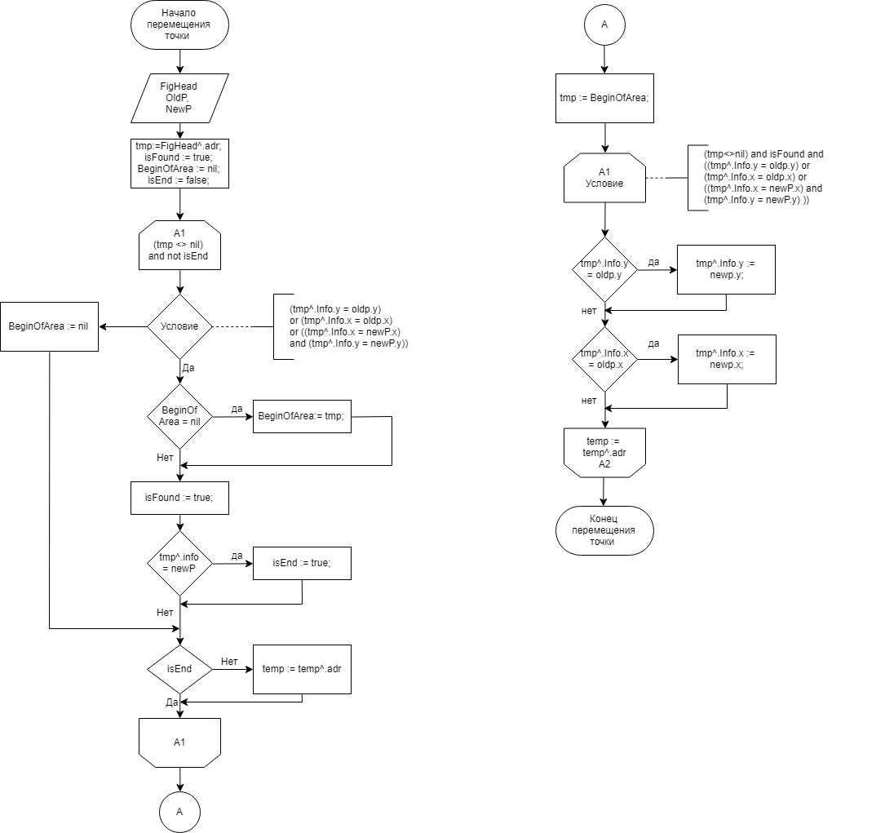

&#1056;&#1080;&#1089;&#1091;&#1085;&#1086;&#1082; 3.6 &ndash; &#1089;&#1093;&#1077;&#1084;&#1072; &#1072;&#1083;&#1075;&#1086;&#1088;&#1080;&#1090;&#1084;&#1072; &#1087;&#1077;&#1088;&#1077;&#1084;&#1077;&#1097;&#1077;&#1085;&#1080;&#1077; &#1090;&#1086;&#1095;&#1082;&#1080; &#1074;&#1085;&#1091;&#1090;&#1088;&#1080; &#1083;&#1080;&#1085;&#1080;&#1080;

<ol class="c23 lst-kix_list_4-1" start="4"><li class="c18"><h2 id="h.35nkun2" style="display:inline">&#1056;&#1072;&#1079;&#1088;&#1072;&#1073;&#1086;&#1090;&#1082;&#1072; &#1072;&#1083;&#1075;&#1086;&#1088;&#1080;&#1090;&#1084;&#1072; &laquo;&#1087;&#1088;&#1080;&#1084;&#1072;&#1075;&#1085;&#1080;&#1095;&#1080;&#1074;&#1072;&#1085;&#1080;&#1103; &#1092;&#1080;&#1075;&#1091;&#1088;&raquo;</h2></li></ol>

&nbsp;&nbsp;&nbsp;&nbsp;&nbsp;&nbsp;&nbsp;&nbsp;&nbsp;&#1063;&#1090;&#1086;&#1073;&#1099; &#1087;&#1086;&#1083;&#1100;&#1079;&#1086;&#1074;&#1072;&#1090;&#1077;&#1083;&#1102; &#1073;&#1099;&#1083;&#1086; &#1087;&#1088;&#1086;&#1097;&#1077; &#1088;&#1077;&#1076;&#1072;&#1082;&#1090;&#1080;&#1088;&#1086;&#1074;&#1072;&#1090;&#1100; &#1089;&#1080;&#1085;&#1090;&#1072;&#1082;&#1089;&#1080;&#1095;&#1077;&#1089;&#1082;&#1080;&#1077; &#1076;&#1080;&#1072;&#1075;&#1088;&#1072;&#1084;&#1084;&#1099;, &#1103; &#1088;&#1077;&#1096;&#1080;&#1083; &#1076;&#1086;&#1073;&#1072;&#1074;&#1080;&#1090;&#1100; &#1092;&#1091;&#1085;&#1082;&#1094;&#1080;&#1086;&#1085;&#1072;&#1083; &laquo;&#1087;&#1088;&#1080;&#1084;&#1072;&#1075;&#1085;&#1080;&#1095;&#1080;&#1074;&#1072;&#1085;&#1080;&#1103;&raquo; &#1092;&#1080;&#1075;&#1091;&#1088;.

&nbsp;&nbsp;&nbsp;&nbsp;&nbsp;&nbsp;&nbsp;&nbsp;&#1058;&#1088;&#1077;&#1073;&#1086;&#1074;&#1072;&#1085;&#1080;&#1103; &#1082; &#1072;&#1083;&#1075;&#1086;&#1088;&#1080;&#1090;&#1084;&#1091;:
<ul class="c23 lst-kix_list_16-0 start"><li class="c4 c41">&#1045;&#1089;&#1083;&#1080; &#1085;&#1072;&#1095;&#1072;&#1083;&#1100;&#1085;&#1072;&#1103;/&#1082;&#1086;&#1085;&#1077;&#1095;&#1085;&#1072;&#1103; &#1090;&#1086;&#1095;&#1082;&#1072; &#1083;&#1080;&#1085;&#1080;&#1080; &#1085;&#1072;&#1093;&#1086;&#1076;&#1080;&#1090;&#1089;&#1103; &#1086;&#1095;&#1077;&#1085;&#1100; &#1073;&#1083;&#1080;&#1079;&#1082;&#1086; &#1082; &#1076;&#1088;&#1091;&#1075;&#1086;&#1081; &#1083;&#1080;&#1085;&#1080;&#1080;, &#1082;&#1086;&#1086;&#1088;&#1076;&#1080;&#1085;&#1072;&#1090;&#1099; &#1101;&#1090;&#1086;&#1081; &#1090;&#1086;&#1095;&#1082;&#1080; &#1076;&#1086;&#1083;&#1078;&#1085;&#1099; &#1080;&#1079;&#1084;&#1077;&#1085;&#1080;&#1090;&#1100;&#1089;&#1103; &#1090;&#1072;&#1082;, &#1095;&#1090;&#1086;&#1073;&#1099; &#1090;&#1086;&#1095;&#1082;&#1072; &#1089;&#1090;&#1072;&#1083;&#1072; &#1087;&#1088;&#1080;&#1085;&#1072;&#1076;&#1083;&#1077;&#1078;&#1072;&#1090;&#1100; &#1087;&#1088;&#1103;&#1084;&#1086;&#1081;, &#1088;&#1072;&#1089;&#1087;&#1086;&#1083;&#1086;&#1078;&#1077;&#1085;&#1085;&#1086;&#1081; &#1086;&#1095;&#1077;&#1085;&#1100; &#1073;&#1083;&#1080;&#1079;&#1082;&#1086;.</li><li class="c4 c41">&#1045;&#1089;&#1083;&#1080; &#1085;&#1072;&#1095;&#1072;&#1083;&#1100;&#1085;&#1072;&#1103;/&#1082;&#1086;&#1085;&#1077;&#1095;&#1085;&#1072;&#1103; &#1090;&#1086;&#1095;&#1082;&#1072; &#1083;&#1080;&#1085;&#1080;&#1080; &#1085;&#1072;&#1093;&#1086;&#1076;&#1080;&#1090;&#1089;&#1103; &#1086;&#1095;&#1077;&#1085;&#1100; &#1073;&#1083;&#1080;&#1079;&#1082;&#1086; &#1082; &#1090;&#1077;&#1082;&#1089;&#1090;&#1086;&#1074;&#1086;&#1081; &#1092;&#1080;&#1075;&#1091;&#1088;&#1077;, &#1082;&#1086;&#1086;&#1088;&#1076;&#1080;&#1085;&#1072;&#1090;&#1099; &#1101;&#1090;&#1086;&#1081; &#1090;&#1086;&#1095;&#1082;&#1080; &#1076;&#1086;&#1083;&#1078;&#1085;&#1099; &#1080;&#1079;&#1084;&#1077;&#1085;&#1080;&#1090;&#1100;&#1089;&#1103; &#1090;&#1072;&#1082;, &#1095;&#1090;&#1086;&#1073;&#1099; &#1090;&#1086;&#1095;&#1082;&#1072; &#1086;&#1082;&#1072;&#1079;&#1072;&#1083;&#1072;&#1089;&#1100; (&#1089;&#1084;. &#1088;&#1080;&#1089;&#1091;&#1085;&#1086;&#1082; 3.5):</li></ul><ul class="c23 lst-kix_list_16-1 start"><li class="c4 c78">&#1042; &#1094;&#1077;&#1085;&#1090;&#1088;&#1077; &#1087;&#1088;&#1103;&#1084;&#1086;&#1091;&#1075;&#1086;&#1083;&#1100;&#1085;&#1086;&#1081; &#1092;&#1080;&#1075;&#1091;&#1088;&#1099; &#1087;&#1086; &#1086;&#1089;&#1080; OY</li><li class="c4 c78">&#1053;&#1072; &#1082;&#1088;&#1072;&#1102; &#1087;&#1088;&#1103;&#1084;&#1086;&#1091;&#1075;&#1086;&#1083;&#1100;&#1085;&#1086;&#1081; &#1092;&#1080;&#1075;&#1091;&#1088;&#1099; &#1087;&#1086; &#1086;&#1089;&#1080; OX</li></ul><ul class="c23 lst-kix_list_16-0"><li class="c21">&#1045;&#1089;&#1083;&#1080; &#1090;&#1077;&#1082;&#1089;&#1090;&#1086;&#1074;&#1099;&#1077; &#1092;&#1080;&#1075;&#1091;&#1088;&#1099; &#1088;&#1072;&#1089;&#1087;&#1086;&#1083;&#1072;&#1075;&#1072;&#1102;&#1090;&#1089;&#1103; &#1087;&#1088;&#1080;&#1073;&#1083;&#1080;&#1079;&#1080;&#1090;&#1077;&#1083;&#1100;&#1085;&#1086; &#1085;&#1072; &#1086;&#1076;&#1085;&#1086;&#1084; &#1091;&#1088;&#1086;&#1074;&#1085;&#1077; &#1087;&#1086; &#1086;&#1089;&#1080; OY, &#1086;&#1085;&#1080; &#1076;&#1086;&#1083;&#1078;&#1085;&#1099; &#1074;&#1099;&#1088;&#1072;&#1074;&#1085;&#1080;&#1074;&#1072;&#1090;&#1100;&#1089;&#1103; &#1087;&#1086; &#1086;&#1076;&#1085;&#1086;&#1081; &#1082;&#1086;&#1086;&#1088;&#1076;&#1080;&#1085;&#1072;&#1090;&#1077; Y.</li></ul>

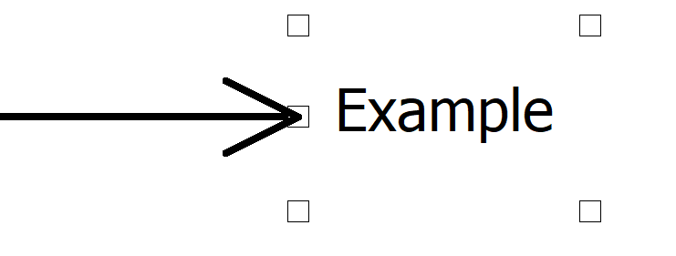

&#1056;&#1080;&#1089;&#1091;&#1085;&#1086;&#1082; 3.7 &ndash; &#1087;&#1088;&#1080;&#1084;&#1077;&#1088; &#1087;&#1086;&#1083;&#1086;&#1078;&#1077;&#1085;&#1080;&#1103; &#1090;&#1086;&#1095;&#1077;&#1082; &#1087;&#1086;&#1089;&#1083;&#1077; &#1087;&#1088;&#1080;&#1084;&#1077;&#1085;&#1077;&#1085;&#1080;&#1103; &#1072;&#1083;&#1075;&#1086;&#1088;&#1080;&#1090;&#1084;&#1072; &laquo;&#1087;&#1088;&#1080;&#1084;&#1072;&#1075;&#1085;&#1080;&#1095;&#1080;&#1074;&#1072;&#1085;&#1080;&#1103;&raquo; &#1083;&#1080;&#1085;&#1080;&#1080; &#1082; &#1090;&#1077;&#1082;&#1089;&#1090;&#1086;&#1074;&#1086;&#1081; &#1092;&#1080;&#1075;&#1091;&#1088;&#1077;.

&#1042; &#1082;&#1072;&#1095;&#1077;&#1089;&#1090;&#1074;&#1077; &#1079;&#1085;&#1072;&#1095;&#1077;&#1085;&#1080;&#1103;, &#1088;&#1072;&#1089;&#1089;&#1090;&#1086;&#1103;&#1085;&#1080;&#1077; &#1074; &#1089;&#1082;&#1086;&#1083;&#1100;&#1082;&#1086; &#1087;&#1080;&#1082;&#1089;&#1077;&#1083;&#1077;&#1081; &#1089;&#1095;&#1080;&#1090;&#1072;&#1090;&#1100; &laquo;&#1073;&#1083;&#1080;&#1079;&#1082;&#1080;&#1084;&raquo;, &#1073;&#1099;&#1083;&#1086; &#1087;&#1088;&#1080;&#1085;&#1103;&#1090;&#1086; &#1074;&#1099;&#1085;&#1077;&#1089;&#1090;&#1080; &#1074; &#1086;&#1090;&#1076;&#1077;&#1083;&#1100;&#1085;&#1091;&#1102; &#1082;&#1086;&#1085;&#1089;&#1090;&#1072;&#1085;&#1090;&#1091; &#1076;&#1083;&#1103; &#1090;&#1086;&#1075;&#1086;, &#1095;&#1090;&#1086;&#1073;&#1099; &#1077;&#1077; &#1079;&#1085;&#1072;&#1095;&#1077;&#1085;&#1080;&#1077; &#1084;&#1086;&#1078;&#1085;&#1086; &#1073;&#1099;&#1083;&#1086; &#1080;&#1079;&#1084;&#1077;&#1085;&#1080;&#1090;&#1100; &#1074; &#1083;&#1102;&#1073;&#1086;&#1081; &#1084;&#1086;&#1084;&#1077;&#1085;&#1090;.

<ol class="c23 lst-kix_list_4-2 start" start="1"><li class="c18"><h2 id="h.1ksv4uv" style="display:inline">&#1056;&#1072;&#1079;&#1088;&#1072;&#1073;&#1086;&#1090;&#1082;&#1072; &#1072;&#1083;&#1075;&#1086;&#1088;&#1080;&#1090;&#1084;&#1072; &#1087;&#1086;&#1080;&#1089;&#1082;&#1072; &#1083;&#1080;&#1085;&#1080;&#1080; &#1074;&#1073;&#1083;&#1080;&#1079;&#1080; &#1090;&#1086;&#1095;&#1082;&#1080;</h2></li></ol>

&#1058;&#1072;&#1082; &#1082;&#1072;&#1082; &#1083;&#1080;&#1085;&#1080;&#1103; &#1087;&#1088;&#1077;&#1076;&#1089;&#1090;&#1072;&#1074;&#1083;&#1103;&#1077;&#1090; &#1089;&#1086;&#1073;&#1086;&#1081; &#1089;&#1087;&#1080;&#1089;&#1086;&#1082; &#1090;&#1086;&#1095;&#1077;&#1082;, &#1103; &#1088;&#1077;&#1096;&#1080;&#1083; &#1074;&#1099;&#1085;&#1077;&#1089;&#1090;&#1080; &#1072;&#1083;&#1075;&#1086;&#1088;&#1080;&#1090;&#1084; &#1087;&#1086;&#1080;&#1089;&#1082;&#1072; &#1083;&#1080;&#1085;&#1080;&#1080; &#1074;&#1073;&#1083;&#1080;&#1079;&#1080; &#1090;&#1086;&#1095;&#1082;&#1080; &#1074; &#1086;&#1090;&#1076;&#1077;&#1083;&#1100;&#1085;&#1099;&#1081; &#1072;&#1083;&#1075;&#1086;&#1088;&#1080;&#1090;&#1084;. &#1040;&#1083;&#1075;&#1086;&#1088;&#1080;&#1090;&#1084; &#1076;&#1086;&#1083;&#1078;&#1077;&#1085; &#1085;&#1072; &#1074;&#1093;&#1086;&#1076;&#1077; &#1087;&#1088;&#1080;&#1085;&#1080;&#1084;&#1072;&#1090;&#1100; &#1089;&#1089;&#1099;&#1083;&#1082;&#1091; &#1085;&#1072; &laquo;&#1075;&#1086;&#1083;&#1086;&#1074;&#1091;&raquo; &#1089;&#1087;&#1080;&#1089;&#1082;&#1072; &#1092;&#1080;&#1075;&#1091;&#1088; &#1080; &#1082;&#1086;&#1086;&#1088;&#1076;&#1080;&#1085;&#1072;&#1090;&#1091; &#1090;&#1086;&#1095;&#1082;&#1080;, &#1074;&#1073;&#1083;&#1080;&#1079;&#1080; &#1082;&#1086;&#1090;&#1086;&#1088;&#1086;&#1081; &#1085;&#1072;&#1076;&#1086; &#1085;&#1072;&#1081;&#1090;&#1080; &#1083;&#1080;&#1085;&#1080;&#1102;. &#1053;&#1072; &#1074;&#1099;&#1093;&#1086;&#1076;&#1077; &#1072;&#1083;&#1075;&#1086;&#1088;&#1080;&#1090;&#1084; &#1076;&#1086;&#1083;&#1078;&#1077;&#1085; &#1074;&#1077;&#1088;&#1085;&#1091;&#1090;&#1100; &#1090;&#1086;&#1095;&#1082;&#1091;, &#1087;&#1088;&#1080;&#1085;&#1072;&#1076;&#1083;&#1077;&#1078;&#1072;&#1097;&#1091;&#1102; &#1087;&#1088;&#1103;&#1084;&#1086;&#1081;, &#1080; &#1082;&#1086;&#1090;&#1086;&#1088;&#1072;&#1103; &#1073;&#1091;&#1076;&#1077;&#1090; &#1085;&#1072;&#1080;&#1073;&#1086;&#1083;&#1077;&#1077; &#1073;&#1083;&#1080;&#1079;&#1082;&#1072;&#1103; &#1082; &#1080;&#1089;&#1093;&#1086;&#1076;&#1085;&#1086;&#1081; &#1090;&#1086;&#1095;&#1082;&#1077; &#1080; &#1089;&#1089;&#1099;&#1083;&#1082;&#1091; &#1085;&#1072; &#1073;&#1083;&#1080;&#1078;&#1072;&#1081;&#1096;&#1091;&#1102; &#1090;&#1086;&#1095;&#1082;&#1091; &#1089;&#1087;&#1080;&#1089;&#1082;&#1072; &#1090;&#1086;&#1095;&#1077;&#1082; &#1087;&#1088;&#1103;&#1084;&#1086;&#1081; (nil &#1077;&#1089;&#1083;&#1080; &#1085;&#1077; &#1085;&#1072;&#1081;&#1076;&#1077;&#1085;&#1086; &#1087;&#1088;&#1103;&#1084;&#1086;&#1081; &#1087;&#1086;&#1073;&#1083;&#1080;&#1079;&#1086;&#1089;&#1090;&#1080;).

&#1057;&#1093;&#1077;&#1084;&#1072; &#1072;&#1083;&#1075;&#1086;&#1088;&#1080;&#1090;&#1084;&#1072; &#1087;&#1088;&#1077;&#1076;&#1089;&#1090;&#1072;&#1074;&#1083;&#1077;&#1085;&#1072; &#1085;&#1072; &#1088;&#1080;&#1089;&#1091;&#1085;&#1082;&#1077; 3.6. 

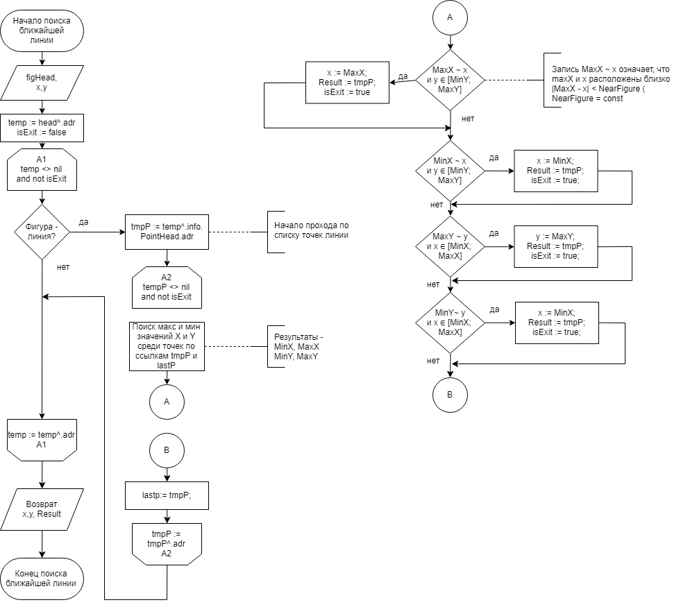

&#1056;&#1080;&#1089;&#1091;&#1085;&#1086;&#1082; 3.8 &ndash; &#1089;&#1093;&#1077;&#1084;&#1072; &#1072;&#1083;&#1075;&#1086;&#1088;&#1080;&#1090;&#1084;&#1072; &#1087;&#1086;&#1080;&#1089;&#1082;&#1072; &#1073;&#1083;&#1080;&#1078;&#1072;&#1081;&#1096;&#1077;&#1081; &#1083;&#1080;&#1085;&#1080;&#1080;

<ol class="c23 lst-kix_list_4-2" start="2"><li class="c18"><h2 id="h.44sinio" style="display:inline">&#1056;&#1072;&#1079;&#1088;&#1072;&#1073;&#1086;&#1090;&#1082;&#1072; &#1072;&#1083;&#1075;&#1086;&#1088;&#1080;&#1090;&#1084;&#1072; &laquo;&#1087;&#1088;&#1080;&#1084;&#1072;&#1075;&#1085;&#1080;&#1095;&#1080;&#1074;&#1072;&#1085;&#1080;&#1103;&raquo; &#1083;&#1080;&#1085;&#1080;&#1080; &#1082; &#1090;&#1077;&#1082;&#1089;&#1090;&#1086;&#1074;&#1086;&#1081; &#1092;&#1080;&#1075;&#1091;&#1088;&#1077;</h2></li></ol>

&#1040;&#1083;&#1075;&#1086;&#1088;&#1080;&#1090;&#1084; &#1076;&#1086;&#1083;&#1078;&#1077;&#1085; &#1087;&#1088;&#1080;&#1085;&#1080;&#1084;&#1072;&#1090;&#1100; &#1085;&#1072; &#1074;&#1093;&#1086;&#1076;&#1077; &#1089;&#1089;&#1099;&#1083;&#1082;&#1080; &#1085;&#1072; &#1075;&#1086;&#1083;&#1086;&#1074;&#1091; &#1089;&#1087;&#1080;&#1089;&#1082;&#1072; &#1092;&#1080;&#1075;&#1091;&#1088; &#1080; &#1085;&#1072; &#1090;&#1086;&#1095;&#1082;&#1091; &#1086;&#1087;&#1088;&#1077;&#1076;&#1077;&#1083;&#1077;&#1085;&#1085;&#1086;&#1081; &#1083;&#1080;&#1085;&#1080;&#1080;. &#1045;&#1089;&#1083;&#1080; &#1072;&#1083;&#1075;&#1086;&#1088;&#1080;&#1090;&#1084; &#1085;&#1072;&#1093;&#1086;&#1076;&#1080;&#1090; &#1090;&#1077;&#1082;&#1089;&#1090;&#1086;&#1074;&#1091;&#1102; &#1092;&#1080;&#1075;&#1091;&#1088;&#1091; &#1088;&#1103;&#1076;&#1086;&#1084; &#1089; &#1090;&#1086;&#1095;&#1082;&#1086;&#1081;, &#1086;&#1085; &#1084;&#1077;&#1085;&#1103;&#1077;&#1090; &#1082;&#1086;&#1086;&#1088;&#1076;&#1080;&#1085;&#1072;&#1090;&#1099; &#1101;&#1090;&#1086;&#1081; &#1090;&#1086;&#1095;&#1082;&#1080; &#1080; &#1092;&#1091;&#1085;&#1082;&#1094;&#1080;&#1103; &#1074;&#1086;&#1079;&#1074;&#1088;&#1072;&#1097;&#1072;&#1077;&#1090; true. &#1048;&#1085;&#1072;&#1095;&#1077; &ndash; &#1072;&#1083;&#1075;&#1086;&#1088;&#1080;&#1090;&#1084; &#1085;&#1080;&#1095;&#1077;&#1075;&#1086; &#1085;&#1077; &#1084;&#1077;&#1085;&#1103;&#1077;&#1090;, &#1080; &#1092;&#1091;&#1085;&#1082;&#1094;&#1080;&#1103; &#1074;&#1086;&#1079;&#1074;&#1088;&#1072;&#1097;&#1072;&#1077;&#1090; false. &#1057;&#1093;&#1077;&#1084;&#1072; &#1072;&#1083;&#1075;&#1086;&#1088;&#1080;&#1090;&#1084;&#1072; &#1087;&#1088;&#1077;&#1076;&#1089;&#1090;&#1072;&#1074;&#1083;&#1077;&#1085;&#1072; &#1085;&#1072; &#1088;&#1080;&#1089;&#1091;&#1085;&#1082;&#1077; 3.7.

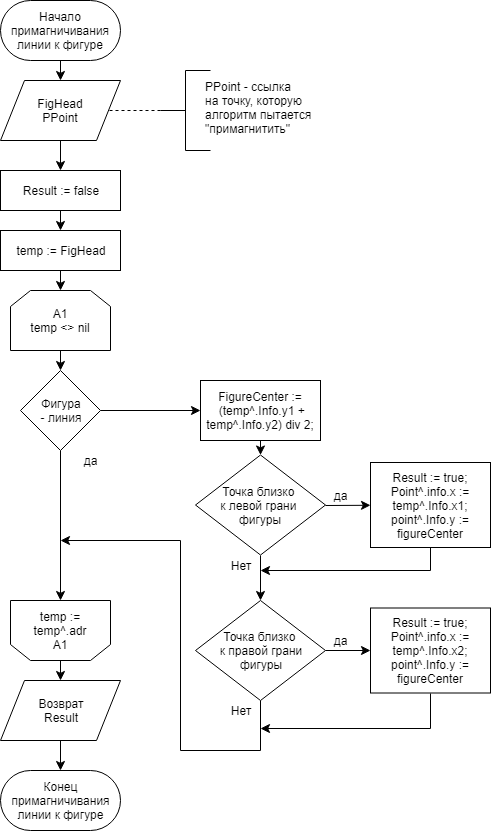

&#1056;&#1080;&#1089;&#1091;&#1085;&#1086;&#1082; 3.9 &ndash; &#1057;&#1093;&#1077;&#1084;&#1072; &#1072;&#1083;&#1075;&#1086;&#1088;&#1080;&#1090;&#1072; &laquo;&#1087;&#1088;&#1080;&#1084;&#1072;&#1075;&#1085;&#1080;&#1095;&#1080;&#1074;&#1072;&#1085;&#1080;&#1103;&raquo; &#1083;&#1080;&#1085;&#1080;&#1080; &#1082; &#1090;&#1077;&#1082;&#1089;&#1090;&#1086;&#1074;&#1086;&#1081; &#1092;&#1080;&#1075;&#1091;&#1088;&#1077;

<ol class="c23 lst-kix_list_4-2" start="3"><li class="c18"><h2 id="h.2jxsxqh" style="display:inline">&#1056;&#1072;&#1079;&#1088;&#1072;&#1073;&#1086;&#1090;&#1082;&#1072; &#1072;&#1083;&#1075;&#1086;&#1088;&#1080;&#1090;&#1084;&#1072; &laquo;&#1087;&#1088;&#1080;&#1084;&#1072;&#1075;&#1085;&#1080;&#1095;&#1080;&#1074;&#1072;&#1085;&#1080;&#1103;&raquo; &#1090;&#1086;&#1095;&#1082;&#1080; &#1082; &#1083;&#1080;&#1085;&#1080;&#1080;</h2></li></ol>

&#1047;&#1072;&#1084;&#1077;&#1095;&#1072;&#1085;&#1080;&#1077;: &#1040;&#1083;&#1075;&#1086;&#1088;&#1080;&#1090;&#1084; &#1076;&#1086;&#1083;&#1078;&#1077;&#1085; &#1087;&#1077;&#1088;&#1077;&#1084;&#1077;&#1097;&#1072;&#1090;&#1100; &#1090;&#1086;&#1083;&#1100;&#1082;&#1086; &#1086;&#1076;&#1085;&#1091;, &#1089;&#1072;&#1084;&#1091;&#1102; &#1073;&#1083;&#1080;&#1078;&#1072;&#1081;&#1096;&#1091;&#1102; &#1082; &#1090;&#1086;&#1095;&#1082;&#1077; &#1083;&#1080;&#1085;&#1080;&#1102;. &#1054;&#1089;&#1090;&#1072;&#1083;&#1100;&#1085;&#1099;&#1077; &#1090;&#1086;&#1095;&#1082;&#1080; &#1083;&#1080;&#1085;&#1080;&#1080; &#1073;&#1091;&#1076;&#1091;&#1090; &#1087;&#1077;&#1088;&#1077;&#1084;&#1077;&#1097;&#1072;&#1090;&#1100;&#1089;&#1103; &#1088;&#1072;&#1085;&#1077;&#1077; &#1088;&#1072;&#1079;&#1088;&#1072;&#1073;&#1086;&#1090;&#1072;&#1085;&#1085;&#1099;&#1084; &#1072;&#1083;&#1075;&#1086;&#1088;&#1080;&#1090;&#1084;&#1086;&#1084;. 

&#1057;&#1093;&#1077;&#1084;&#1072; &#1072;&#1083;&#1075;&#1086;&#1088;&#1080;&#1090;&#1084;&#1072; &#1087;&#1088;&#1077;&#1076;&#1089;&#1090;&#1072;&#1074;&#1083;&#1077;&#1085;&#1072; &#1085;&#1072; &#1088;&#1080;&#1089;&#1091;&#1085;&#1082;&#1077; 3.8.

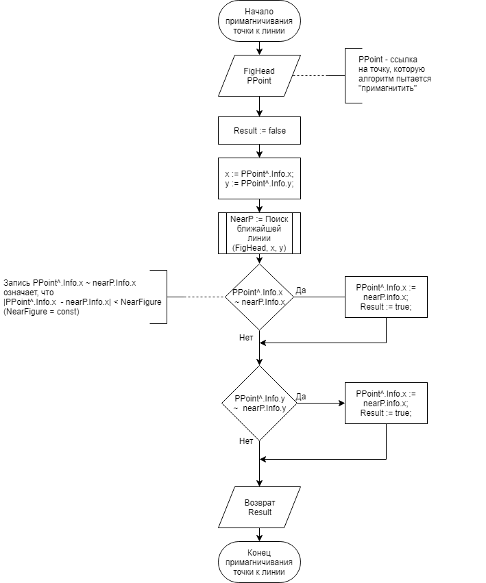

&#1056;&#1080;&#1089;&#1091;&#1085;&#1086;&#1082; 3.8. &ndash; &#1089;&#1093;&#1077;&#1084;&#1072; &#1072;&#1083;&#1075;&#1086;&#1088;&#1080;&#1090;&#1084;&#1072; &laquo;&#1087;&#1088;&#1080;&#1084;&#1072;&#1075;&#1085;&#1080;&#1095;&#1080;&#1074;&#1072;&#1085;&#1080;&#1103;&raquo; &#1090;&#1086;&#1095;&#1082;&#1080; &#1082; &#1083;&#1080;&#1085;&#1080;&#1080;
<ol class="c23 lst-kix_list_4-2" start="4"><li class="c18"><h2 id="h.z337ya" style="display:inline">&#1054;&#1073;&#1086;&#1073;&#1097;&#1077;&#1085;&#1080;&#1077; &#1072;&#1083;&#1075;&#1086;&#1088;&#1080;&#1090;&#1084;&#1086;&#1074; &laquo;&#1087;&#1088;&#1080;&#1084;&#1072;&#1075;&#1085;&#1080;&#1095;&#1080;&#1074;&#1072;&#1085;&#1080;&#1103;&raquo;</h2></li></ol>

&#1057;&#1093;&#1077;&#1084;&#1072; &#1086;&#1073;&#1086;&#1073;&#1097;&#1077;&#1085;&#1085;&#1086;&#1075;&#1086; &#1072;&#1083;&#1075;&#1086;&#1088;&#1080;&#1090;&#1084;&#1072; &#1087;&#1088;&#1080;&#1084;&#1072;&#1075;&#1085;&#1080;&#1095;&#1080;&#1074;&#1072;&#1085;&#1080;&#1103; &#1087;&#1088;&#1077;&#1076;&#1089;&#1090;&#1072;&#1074;&#1083;&#1077;&#1085;&#1072; &#1085;&#1072; &#1088;&#1080;&#1089;&#1091;&#1085;&#1082;&#1077; 3.9.

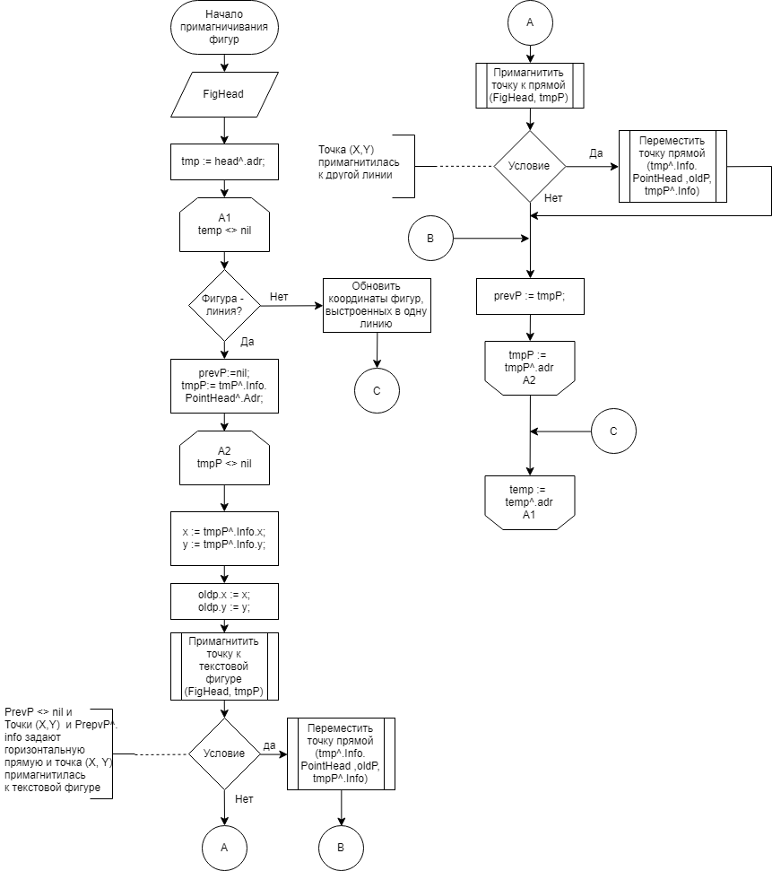

&#1056;&#1080;&#1089;&#1091;&#1085;&#1086;&#1082; 3.9 &ndash; &#1086;&#1073;&#1097;&#1072;&#1103; &#1089;&#1093;&#1077;&#1084;&#1072; &#1072;&#1083;&#1075;&#1086;&#1088;&#1080;&#1090;&#1084;&#1072; &laquo;&#1087;&#1088;&#1080;&#1084;&#1072;&#1075;&#1085;&#1080;&#1095;&#1080;&#1074;&#1072;&#1085;&#1080;&#1103;&raquo;

<ol class="c23 lst-kix_list_4-1" start="5"><li class="c18"><h2 id="h.3j2qqm3" style="display:inline">&#1056;&#1072;&#1079;&#1088;&#1072;&#1073;&#1086;&#1090;&#1082;&#1072; &#1072;&#1083;&#1075;&#1086;&#1088;&#1080;&#1090;&#1084;&#1072; &#1086;&#1090;&#1088;&#1080;&#1089;&#1086;&#1074;&#1082;&#1080; &#1083;&#1080;&#1085;&#1080;&#1081; </h2></li></ol>
&#1040;&#1083;&#1075;&#1086;&#1088;&#1080;&#1090;&#1084; &#1086;&#1090;&#1088;&#1080;&#1089;&#1086;&#1074;&#1082;&#1080; &#1083;&#1080;&#1085;&#1080;&#1081; &#1076;&#1086;&#1083;&#1078;&#1077;&#1085; &#1087;&#1088;&#1077;&#1076;&#1091;&#1089;&#1084;&#1086;&#1090;&#1088;&#1077;&#1090;&#1100; &#1086;&#1089;&#1086;&#1073;&#1077;&#1085;&#1085;&#1086;&#1089;&#1090;&#1080; &#1087;&#1086;&#1089;&#1090;&#1088;&#1086;&#1077;&#1085;&#1080;&#1103; &#1089;&#1080;&#1085;&#1090;&#1072;&#1082;&#1089;&#1080;&#1095;&#1077;&#1089;&#1082;&#1080;&#1093; &#1076;&#1080;&#1072;&#1075;&#1088;&#1072;&#1084;&#1084;, &#1074; &#1090;&#1086;&#1084; &#1095;&#1080;&#1089;&#1083;&#1077;, &#1076;&#1086;&#1089;&#1090;&#1088;&#1072;&#1080;&#1074;&#1072;&#1090;&#1100; &#1095;&#1072;&#1089;&#1090;&#1080; &#1083;&#1080;&#1085;&#1080;&#1081; &#1074; &#1079;&#1072;&#1074;&#1080;&#1089;&#1080;&#1084;&#1086;&#1089;&#1090;&#1080; &#1086;&#1090; &#1074;&#1079;&#1072;&#1080;&#1084;&#1085;&#1086;&#1075;&#1086; &#1088;&#1072;&#1089;&#1087;&#1086;&#1083;&#1086;&#1078;&#1077;&#1085;&#1080;&#1103; &#1092;&#1080;&#1075;&#1091;&#1088; &#1085;&#1072; &#1087;&#1086;&#1083;&#1086;&#1090;&#1085;&#1077;. &#1057;&#1093;&#1077;&#1084;&#1072; &#1087;&#1088;&#1077;&#1076;&#1089;&#1090;&#1072;&#1074;&#1083;&#1077;&#1085;&#1072; &#1085;&#1072; &#1088;&#1080;&#1089;&#1091;&#1085;&#1082;&#1077; 3.10

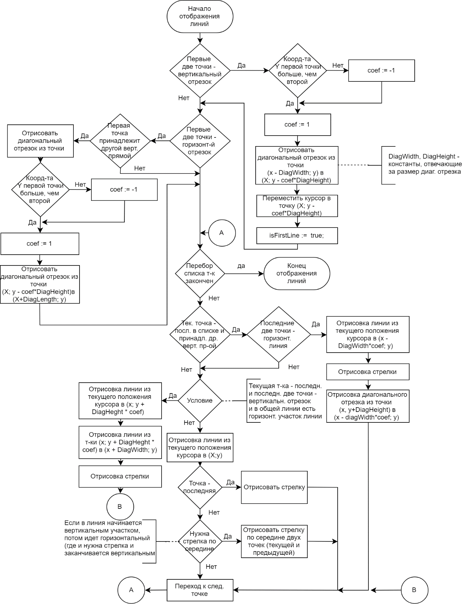
<ol class="c23 lst-kix_list_4-1" start="6"><li class="c18"><h2 id="h.1y810tw" style="display:inline">&#1056;&#1072;&#1079;&#1088;&#1072;&#1073;&#1086;&#1090;&#1082;&#1072; &#1072;&#1083;&#1075;&#1086;&#1088;&#1080;&#1090;&#1084; &#1086;&#1090;&#1088;&#1080;&#1089;&#1086;&#1074;&#1082;&#1080; &#1092;&#1080;&#1075;&#1091;&#1088;</h2></li></ol>

&#1040;&#1083;&#1075;&#1086;&#1088;&#1080;&#1090;&#1084; &#1086;&#1090;&#1088;&#1080;&#1089;&#1086;&#1074;&#1082;&#1080; &#1092;&#1080;&#1075;&#1091;&#1088; &#1103;&#1074;&#1083;&#1103;&#1077;&#1090;&#1089;&#1103; &#1076;&#1086;&#1074;&#1086;&#1083;&#1100;&#1085;&#1086; &#1087;&#1088;&#1086;&#1089;&#1090;&#1099;&#1084;, &#1086;&#1076;&#1085;&#1072;&#1082;&#1086; &#1103;&#1074;&#1083;&#1103;&#1077;&#1090;&#1089;&#1103; &#1086;&#1076;&#1085;&#1080;&#1084; &#1080;&#1079; &#1073;&#1072;&#1079;&#1086;&#1074;&#1099;&#1093; &#1074; &#1087;&#1088;&#1086;&#1075;&#1088;&#1072;&#1084;&#1084;&#1085;&#1086;&#1084; &#1089;&#1088;&#1077;&#1076;&#1089;&#1090;&#1074;&#1077;. &#1057;&#1093;&#1077;&#1084;&#1072; &#1072;&#1083;&#1075;&#1086;&#1088;&#1080;&#1090;&#1084;&#1072; &#1087;&#1088;&#1077;&#1076;&#1089;&#1090;&#1072;&#1074;&#1083;&#1077;&#1085;&#1072; &#1085;&#1072; &#1088;&#1080;&#1089;&#1091;&#1085;&#1082;&#1077; 3.11.

&#1055;&#1088;&#1080;&#1084;&#1077;&#1095;&#1072;&#1085;&#1080;&#1077;: &#1040;&#1083;&#1075;&#1086;&#1088;&#1080;&#1090;&#1084;&#1072; &#1086;&#1090;&#1088;&#1080;&#1089;&#1086;&#1074;&#1082;&#1080; &#1092;&#1080;&#1075;&#1091;&#1088; (&#1074; &#1090;.&#1095;. &#1072;&#1083;&#1075;&#1086;&#1088;&#1080;&#1090;&#1084; &#1086;&#1090;&#1088;&#1080;&#1089;&#1086;&#1074;&#1082;&#1080; &#1083;&#1080;&#1085;&#1080;&#1081; &#1091;&#1085;&#1080;&#1074;&#1077;&#1088;&#1089;&#1072;&#1083;&#1077;&#1085; &#1082;&#1072;&#1082; &#1076;&#1083;&#1103; &#1086;&#1090;&#1088;&#1080;&#1089;&#1086;&#1074;&#1082;&#1080; &#1085;&#1072; Canvas, &#1090;&#1072;&#1082; &#1080; &#1076;&#1083;&#1103; &#1086;&#1090;&#1088;&#1080;&#1089;&#1086;&#1074;&#1082;&#1080; &#1074; SVG-&#1092;&#1086;&#1088;&#1084;&#1072;&#1090;&#1077;.

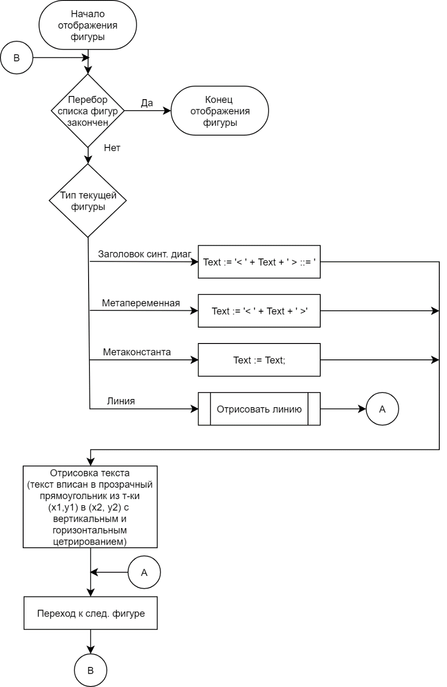

&#1056;&#1080;&#1089;&#1091;&#1085;&#1086;&#1082; 3.11 &ndash; &#1089;&#1093;&#1077;&#1084;&#1072; &#1072;&#1083;&#1075;&#1086;&#1088;&#1080;&#1090;&#1084;&#1072; &#1086;&#1090;&#1088;&#1080;&#1089;&#1086;&#1074;&#1082;&#1080; &#1092;&#1080;&#1075;&#1091;&#1088;. 

<ol class="c23 lst-kix_list_4-0" start="4"><li class="c31 c41"><h1 id="h.4i7ojhp" style="display:inline">&#1057;&#1054;&#1047;&#1044;&#1040;&#1053;&#1048;&#1045; (&#1050;&#1054;&#1053;&#1057;&#1058;&#1056;&#1059;&#1048;&#1056;&#1054;&#1042;&#1040;&#1053;&#1048;&#1045;) &#1055;&#1056;&#1054;&#1043;&#1056;&#1040;&#1052;&#1052;&#1053;&#1054;&#1043;&#1054; &#1057;&#1056;&#1045;&#1044;&#1057;&#1058;&#1042;&#1040;</h1></li></ol><ol class="c23 lst-kix_list_4-1 start" start="1"><li class="c18"><h2 id="h.2xcytpi" style="display:inline">&#1042;&#1079;&#1072;&#1080;&#1084;&#1086;&#1076;&#1077;&#1081;&#1089;&#1090;&#1074;&#1080;&#1077; &#1084;&#1077;&#1078;&#1076;&#1091; &#1092;&#1086;&#1088;&#1084;&#1072;&#1084;&#1080;</h2></li></ol>

&#1042; &#1087;&#1088;&#1086;&#1075;&#1088;&#1072;&#1084;&#1084;&#1085;&#1086;&#1084; &#1089;&#1088;&#1077;&#1076;&#1089;&#1090;&#1074;&#1077; &#1080;&#1089;&#1087;&#1086;&#1083;&#1100;&#1079;&#1091;&#1077;&#1090;&#1089;&#1103; &#1090;&#1088;&#1080; &#1092;&#1086;&#1088;&#1084;&#1099;:&nbsp;&nbsp;&nbsp;&nbsp;&nbsp;&nbsp;&nbsp;&nbsp;
<ul class="c23 lst-kix_list_18-0 start"><li class="c4 c41">&#1043;&#1083;&#1072;&#1074;&#1085;&#1072;&#1103; &#1092;&#1086;&#1088;&#1084;&#1072; (&#1042;&#1089;&#1077; &#1086;&#1089;&#1085;&#1086;&#1074;&#1085;&#1099;&#1077; &#1076;&#1077;&#1081;&#1089;&#1090;&#1074;&#1080;&#1103; &#1087;&#1088;&#1086;&#1080;&#1089;&#1093;&#1086;&#1076;&#1103;&#1090; &#1085;&#1072; &#1085;&#1077;&#1081;).</li><li class="c4 c41">&#1060;&#1086;&#1088;&#1084;&#1072; &#1080;&#1079;&#1084;&#1077;&#1085;&#1077;&#1085;&#1080;&#1103; &#1088;&#1072;&#1079;&#1084;&#1077;&#1088;&#1086;&#1074; &#1087;&#1086;&#1083;&#1086;&#1090;&#1085;&#1072;.</li><li class="c21">&#1060;&#1086;&#1088;&#1084;&#1072; &#1076;&#1083;&#1103; &#1086;&#1090;&#1086;&#1073;&#1088;&#1072;&#1078;&#1077;&#1085;&#1080;&#1103; HTML &#1089;&#1090;&#1088;&#1072;&#1085;&#1080;&#1094; &#1089;&#1087;&#1088;&#1072;&#1074;&#1082;&#1080;.</li></ul>
&#1057;&#1093;&#1077;&#1084;&#1072; &#1074;&#1079;&#1072;&#1080;&#1084;&#1086;&#1076;&#1077;&#1081;&#1089;&#1090;&#1074;&#1080;&#1103; &#1092;&#1086;&#1088;&#1084; &#1086;&#1090;&#1086;&#1073;&#1088;&#1072;&#1078;&#1077;&#1085;&#1072; &#1085;&#1072; &#1088;&#1080;&#1089;&#1091;&#1085;&#1082;&#1077; 4.1.

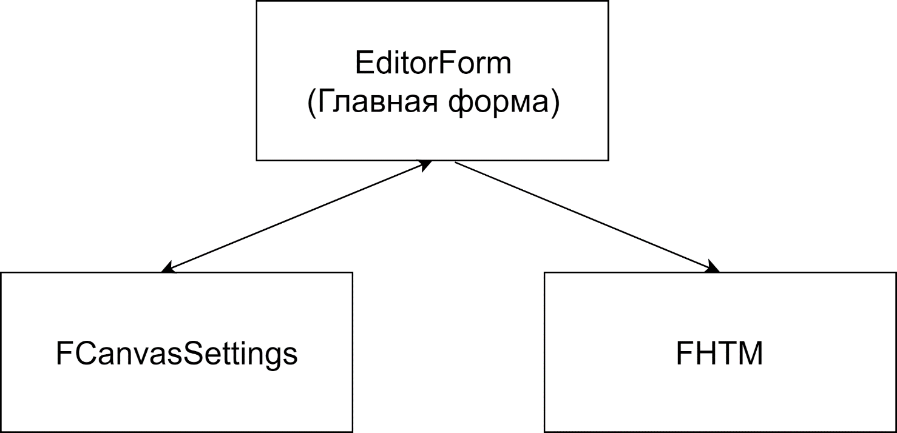

&#1056;&#1080;&#1089;&#1091;&#1085;&#1086;&#1082; 4.1 &ndash; &#1089;&#1093;&#1077;&#1084;&#1072; &#1074;&#1079;&#1072;&#1080;&#1084;&#1086;&#1076;&#1077;&#1081;&#1089;&#1090;&#1074;&#1080;&#1103; &#1092;&#1086;&#1088;&#1084; 

&#1060;&#1086;&#1088;&#1084;&#1072; FHTML &#1087;&#1088;&#1086;&#1089;&#1090;&#1086; &#1086;&#1090;&#1086;&#1073;&#1088;&#1072;&#1078;&#1072;&#1077;&#1090; HTML &#1082;&#1086;&#1076;, &#1079;&#1072;&#1076;&#1072;&#1085;&#1085;&#1099;&#1081; &#1074; &#1088;&#1077;&#1089;&#1091;&#1088;&#1089;&#1072;&#1093; &#1087;&#1088;&#1080;&#1083;&#1086;&#1078;&#1077;&#1085;&#1080;&#1103; &#1080; &#1086;&#1090;&#1086;&#1073;&#1088;&#1072;&#1078;&#1072;&#1077;&#1090; &#1077;&#1075;&#1086; &#1076;&#1083;&#1103; &#1087;&#1086;&#1083;&#1100;&#1079;&#1086;&#1074;&#1072;&#1090;&#1077;&#1083;&#1103;. (&#1089;&#1084;. &#1088;&#1080;&#1089;&#1091;&#1085;&#1086;&#1082; 4.2).

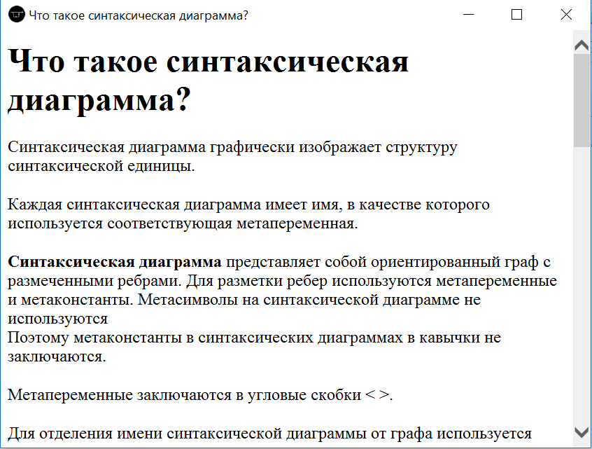

&#1056;&#1080;&#1089;&#1091;&#1085;&#1086;&#1082; 4.2 &ndash; &#1089;&#1082;&#1088;&#1080;&#1085;&#1096;&#1086;&#1090; &#1092;&#1086;&#1088;&#1084;&#1099; FHTML

&#1060;&#1086;&#1088;&#1084;&#1072; FCanvasSettings &#1087;&#1088;&#1077;&#1076;&#1086;&#1089;&#1090;&#1072;&#1074;&#1083;&#1103;&#1077;&#1090; &#1086;&#1082;&#1085;&#1086; &#1076;&#1083;&#1103; &#1080;&#1079;&#1084;&#1077;&#1085;&#1077;&#1085;&#1080;&#1103; &#1088;&#1072;&#1079;&#1084;&#1077;&#1088;&#1086;&#1074; &#1087;&#1086;&#1083;&#1086;&#1090;&#1085;&#1072;. &#1042; &#1087;&#1088;&#1086;&#1094;&#1077;&#1076;&#1091;&#1088;&#1091; &#1086;&#1090;&#1086;&#1073;&#1088;&#1072;&#1078;&#1077;&#1085;&#1080;&#1103; &#1076;&#1072;&#1085;&#1085;&#1086;&#1081; &#1092;&#1086;&#1088;&#1084;&#1099; &#1080;&#1079; &#1075;&#1083;&#1072;&#1074;&#1085;&#1086;&#1081; &#1092;&#1086;&#1088;&#1084;&#1099; &#1087;&#1077;&#1088;&#1077;&#1076;&#1072;&#1077;&#1090;&#1089;&#1103; &#1090;&#1077;&#1082;&#1091;&#1097;&#1080;&#1081; &#1088;&#1072;&#1079;&#1084;&#1077;&#1088; Canvas. &#1055;&#1086;&#1089;&#1083;&#1077; &#1079;&#1072;&#1082;&#1088;&#1099;&#1090;&#1080;&#1103; &#1092;&#1086;&#1088;&#1084;&#1099; &#1089; &#1074;&#1086;&#1079;&#1074;&#1088;&#1072;&#1090;&#1086;&#1084; mrOk, &#1092;&#1086;&#1088;&#1084;&#1072; &#1074;&#1086;&#1079;&#1074;&#1088;&#1072;&#1097;&#1072;&#1077;&#1090; &#1085;&#1086;&#1074;&#1099;&#1077; &#1088;&#1072;&#1079;&#1084;&#1077;&#1088;&#1099; &#1095;&#1077;&#1088;&#1077;&#1079; var-&#1087;&#1072;&#1088;&#1072;&#1084;&#1077;&#1090;&#1088;&#1099; &#1087;&#1088;&#1086;&#1094;&#1077;&#1076;&#1091;&#1088;&#1099;. (&#1089;&#1084;. &#1088;&#1080;&#1089;&#1091;&#1085;&#1086;&#1082; 4.3).

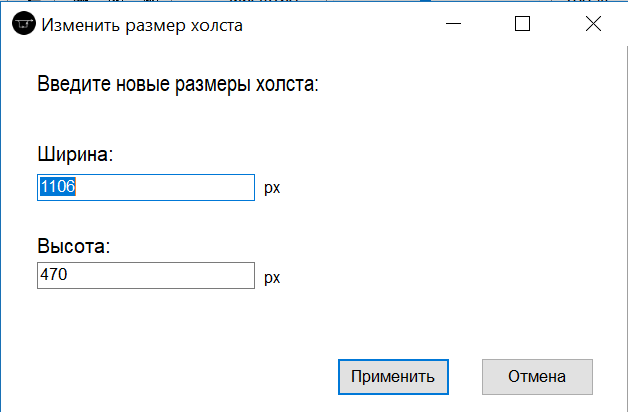

&#1056;&#1080;&#1089;&#1091;&#1085;&#1086;&#1082; 4.3 &ndash; &#1089;&#1082;&#1088;&#1080;&#1085;&#1096;&#1086;&#1090; &#1092;&#1086;&#1088;&#1084;&#1099; FCanvasSettings

&#1060;&#1086;&#1088;&#1084;&#1072; EditorForm &#1087;&#1088;&#1077;&#1076;&#1089;&#1090;&#1072;&#1074;&#1083;&#1103;&#1077;&#1090; &#1089;&#1086;&#1073;&#1086;&#1081; &#1075;&#1083;&#1072;&#1074;&#1085;&#1091;&#1102; &#1092;&#1086;&#1088;&#1084;&#1091; &#1089; &#1084;&#1077;&#1085;&#1102;, tool bar &#1080; &#1086;&#1073;&#1083;&#1072;&#1089;&#1090;&#1100;&#1102; &#1088;&#1080;&#1089;&#1086;&#1074;&#1072;&#1085;&#1080;&#1103;. (&#1089;&#1084;. &#1088;&#1080;&#1089;&#1091;&#1085;&#1086;&#1082; 4.4).

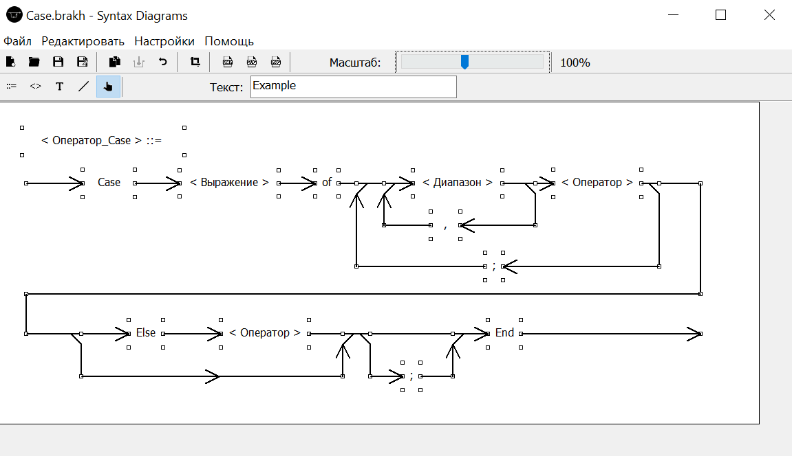

&#1056;&#1080;&#1089;&#1091;&#1085;&#1086;&#1082; 4.4 &ndash; &#1089;&#1082;&#1088;&#1080;&#1085;&#1096;&#1086;&#1090; &#1075;&#1083;&#1072;&#1074;&#1085;&#1086;&#1081; &#1092;&#1086;&#1088;&#1084;&#1099;.

&#1057;&#1093;&#1077;&#1084;&#1072; &#1072;&#1083;&#1075;&#1086;&#1088;&#1080;&#1090;&#1084;&#1072; &#1088;&#1072;&#1073;&#1086;&#1090;&#1099; &#1074;&#1089;&#1077;&#1081; &#1087;&#1088;&#1086;&#1075;&#1088;&#1072;&#1084;&#1084;&#1099; &#1087;&#1088;&#1077;&#1076;&#1089;&#1090;&#1072;&#1074;&#1083;&#1077;&#1085;&#1072; &#1074; &#1087;&#1088;&#1080;&#1083;&#1086;&#1078;&#1077;&#1085;&#1080;&#1080; 1. &#1058;&#1077;&#1082;&#1089;&#1090; &#1087;&#1088;&#1086;&#1075;&#1088;&#1072;&#1084;&#1084;&#1099; &#1087;&#1088;&#1077;&#1076;&#1089;&#1090;&#1072;&#1074;&#1083;&#1077;&#1085; &#1074; &#1087;&#1088;&#1080;&#1083;&#1086;&#1078;&#1077;&#1085;&#1080;&#1080; 2.
<ol class="c23 lst-kix_list_4-1" start="2"><li class="c18"><h2 id="h.1ci93xb" style="display:inline">&#1057;&#1090;&#1088;&#1091;&#1082;&#1090;&#1091;&#1088;&#1072; &#1084;&#1086;&#1076;&#1091;&#1083;&#1077;&#1081; &#1087;&#1088;&#1086;&#1075;&#1088;&#1072;&#1084;&#1084;&#1099;</h2></li></ol>

&#1042; &#1087;&#1088;&#1086;&#1094;&#1077;&#1089;&#1089;&#1077; &#1088;&#1072;&#1079;&#1088;&#1072;&#1073;&#1086;&#1090;&#1082;&#1080; &#1087;&#1088;&#1086;&#1075;&#1088;&#1072;&#1084;&#1084;&#1085;&#1086;&#1075;&#1086; &#1089;&#1088;&#1077;&#1076;&#1089;&#1090;&#1074;&#1072; &#1084;&#1085;&#1086;&#1102; &#1073;&#1099;&#1083;&#1086; &#1074;&#1099;&#1076;&#1077;&#1083;&#1077;&#1085;&#1086; 11 &#1084;&#1086;&#1076;&#1091;&#1083;&#1077;&#1081;. &#1053;&#1077;&#1082;&#1086;&#1090;&#1086;&#1088;&#1099;&#1077; &#1080;&#1079; &#1084;&#1086;&#1076;&#1091;&#1083;&#1077;&#1081; &#1084;&#1086;&#1078;&#1085;&#1086; &#1074;&#1099;&#1076;&#1077;&#1083;&#1080;&#1090;&#1100; &#1074; &#1075;&#1088;&#1091;&#1087;&#1087;&#1099;. 

&#1052;&#1086;&#1076;&#1091;&#1083;&#1080; &#1092;&#1086;&#1088;&#1084;:
<ul class="c23 lst-kix_list_19-0 start"><li class="c4 c41">Main &ndash; &#1084;&#1086;&#1076;&#1091;&#1083;&#1100; &#1075;&#1083;&#1072;&#1074;&#1085;&#1086;&#1081; &#1092;&#1086;&#1088;&#1084;&#1099;</li><li class="c4 c41">FCanvasSizeSettings &ndash; &#1084;&#1086;&#1076;&#1091;&#1083;&#1100; &#1092;&#1086;&#1088;&#1084;&#1099; FCanvasSettings</li><li class="c4 c41">FHTMLView &ndash; &#1084;&#1086;&#1076;&#1091;&#1083;&#1100; &#1092;&#1086;&#1088;&#1084;&#1099; FHTML</li></ul>
&#1052;&#1086;&#1076;&#1091;&#1083;&#1080; &laquo;&#1055;&#1088;&#1077;&#1076;&#1089;&#1090;&#1072;&#1074;&#1083;&#1077;&#1085;&#1080;&#1103;&raquo; (View):
<ul class="c23 lst-kix_list_20-0 start"><li class="c4 c41">View.Canvas &ndash; &#1084;&#1086;&#1076;&#1091;&#1083;&#1100; &#1089; &#1085;&#1072;&#1073;&#1086;&#1088;&#1086;&#1084; &#1087;&#1088;&#1086;&#1094;&#1077;&#1076;&#1091;&#1088; &#1080; &#1092;&#1091;&#1085;&#1082;&#1094;&#1080;&#1080; &#1087;&#1088;&#1077;&#1076;&#1089;&#1090;&#1072;&#1074;&#1083;&#1077;&#1085;&#1080;&#1103; &#1092;&#1080;&#1075;&#1091;&#1088; &#1085;&#1072; &#1082;&#1072;&#1085;&#1074;&#1072;&#1089;&#1077;.</li><li class="c4 c41">View.SVG &ndash; &#1084;&#1086;&#1076;&#1091;&#1083;&#1100; &#1089; &#1085;&#1072;&#1073;&#1086;&#1088;&#1086;&#1084; &#1087;&#1088;&#1086;&#1094;&#1077;&#1076;&#1091;&#1088; &#1080; &#1092;&#1091;&#1085;&#1082;&#1094;&#1080;&#1080; &#1087;&#1088;&#1077;&#1076;&#1089;&#1090;&#1072;&#1074;&#1083;&#1077;&#1085;&#1080;&#1103; &#1092;&#1080;&#1075;&#1091;&#1088; &#1074; SVG.</li></ul>
&#1052;&#1086;&#1076;&#1091;&#1083;&#1080; &laquo;&#1052;&#1086;&#1076;&#1077;&#1083;&#1080;&raquo; (Model):
<ul class="c23 lst-kix_list_21-0 start"><li class="c4 c41">Model &ndash; &#1084;&#1086;&#1076;&#1091;&#1083;&#1100; &#1089; &#1085;&#1072;&#1073;&#1086;&#1088;&#1086;&#1084; &#1086;&#1089;&#1085;&#1086;&#1074;&#1085;&#1099;&#1093; &#1087;&#1088;&#1086;&#1094;&#1077;&#1076;&#1091;&#1088; &#1080; &#1092;&#1091;&#1085;&#1082;&#1094;&#1080;&#1081; &#1084;&#1086;&#1076;&#1077;&#1083;&#1080;.</li><li class="c4 c41">Model.Lines &ndash; &#1084;&#1086;&#1076;&#1091;&#1083;&#1100; &#1089; &#1085;&#1072;&#1073;&#1086;&#1088;&#1086;&#1084; &#1087;&#1088;&#1086;&#1094;&#1077;&#1076;&#1091;&#1088; &#1080; &#1092;&#1091;&#1085;&#1082;&#1094;&#1080;&#1081; &#1074;&#1079;&#1072;&#1080;&#1084;&#1086;&#1076;&#1077;&#1081;&#1089;&#1090;&#1074;&#1080;&#1103; &#1084;&#1086;&#1076;&#1077;&#1083;&#1080; &#1089; &#1083;&#1080;&#1085;&#1080;&#1103;&#1084;&#1080; &#1080; &#1090;&#1086;&#1095;&#1082;&#1072;&#1084;&#1080;.</li><li class="c4 c41">Model.UndoStack &ndash; &#1084;&#1086;&#1076;&#1091;&#1083;&#1100; &#1089; &#1085;&#1072;&#1073;&#1086;&#1088;&#1086;&#1084; &#1087;&#1088;&#1086;&#1094;&#1077;&#1076;&#1091;&#1088; &#1080; &#1092;&#1091;&#1085;&#1082;&#1094;&#1080;&#1081; &#1074;&#1079;&#1072;&#1080;&#1084;&#1086;&#1076;&#1077;&#1081;&#1089;&#1090;&#1074;&#1080;&#1103; &#1084;&#1086;&#1076;&#1077;&#1083;&#1080; &#1089;&#1086; &laquo;&#1057;&#1090;&#1077;&#1082;&#1086;&#1084; &#1080;&#1079;&#1084;&#1077;&#1085;&#1077;&#1085;&#1080;&#1081;&raquo;</li></ul>

&#1052;&#1086;&#1076;&#1091;&#1083;&#1080; &#1089; &#1076;&#1072;&#1085;&#1085;&#1099;&#1084;&#1080;:
<ul class="c23 lst-kix_list_22-0 start"><li class="c4 c41">Data.Types &ndash; &#1086;&#1089;&#1085;&#1086;&#1074;&#1085;&#1099;&#1077; &#1090;&#1080;&#1087;&#1099;, &#1085;&#1077;&#1086;&#1073;&#1093;&#1086;&#1076;&#1080;&#1084;&#1099;&#1077; &#1076;&#1083;&#1103; &#1076;&#1088;&#1091;&#1075;&#1080;&#1093; &#1084;&#1086;&#1076;&#1091;&#1083;&#1077;&#1081;.</li><li class="c4 c41">Data.InitData &ndash; &#1080;&#1085;&#1080;&#1094;&#1080;&#1072;&#1083;&#1080;&#1079;&#1080;&#1088;&#1086;&#1074;&#1072;&#1085;&#1085;&#1099;&#1077; &#1076;&#1072;&#1085;&#1085;&#1099;&#1077; (&#1082;&#1086;&#1085;&#1089;&#1090;&#1072;&#1085;&#1090;&#1099;, resourcestring), &#1085;&#1077;&#1086;&#1073;&#1093;&#1086;&#1076;&#1080;&#1084;&#1099;&#1077; &#1076;&#1083;&#1103; &#1076;&#1088;&#1091;&#1075;&#1080;&#1093; &#1084;&#1086;&#1076;&#1091;&#1083;&#1077;&#1081;.</li></ul>

<ol class="c23 lst-kix_list_4-1" start="3"><li class="c18"><h2 id="h.3whwml4" style="display:inline">&#1054;&#1087;&#1080;&#1089;&#1072;&#1085;&#1080;&#1077; &#1084;&#1086;&#1076;&#1091;&#1083;&#1103; Main</h2></li></ol>

&#1052;&#1086;&#1076;&#1091;&#1083;&#1100; Main &#1103;&#1074;&#1083;&#1103;&#1077;&#1090;&#1089;&#1103; &#1102;&#1085;&#1080;&#1090;&#1086;&#1084; &#1075;&#1083;&#1072;&#1074;&#1085;&#1086;&#1081; &#1092;&#1086;&#1088;&#1084;&#1099;. &#1057;&#1086;&#1076;&#1077;&#1088;&#1078;&#1072;&#1085;&#1080;&#1077; &#1084;&#1086;&#1076;&#1091;&#1083;&#1103; &ndash; &#1084;&#1077;&#1090;&#1086;&#1076;&#1099; &#1082;&#1083;&#1072;&#1089;&#1089;&#1072; &#1092;&#1086;&#1088;&#1084;&#1099;, &#1074; &#1086;&#1089;&#1085;&#1086;&#1074;&#1085;&#1086;&#1084; &ndash; &#1086;&#1073;&#1088;&#1072;&#1073;&#1086;&#1090;&#1095;&#1080;&#1082;&#1080; &#1089;&#1086;&#1073;&#1099;&#1090;&#1080;&#1081;.

&#1054;&#1087;&#1080;&#1089;&#1072;&#1085;&#1080;&#1077; &#1086;&#1089;&#1085;&#1086;&#1074;&#1085;&#1099;&#1093; &#1087;&#1086;&#1076;&#1087;&#1088;&#1086;&#1075;&#1088;&#1072;&#1084;&#1084;, &#1086;&#1087;&#1080;&#1089;&#1072;&#1085;&#1085;&#1099;&#1093; &#1074; &#1084;&#1086;&#1076;&#1091;&#1083;&#1077; Main &#1087;&#1088;&#1080;&#1074;&#1077;&#1076;&#1077;&#1085;&#1086; &#1074; &#1090;&#1072;&#1073;&#1083;&#1080;&#1094;&#1077; 4.1. (&#1042; &#1090;&#1072;&#1073;&#1083;&#1080;&#1094;&#1077; &#1087;&#1088;&#1080;&#1074;&#1077;&#1076;&#1077;&#1085;&#1099; &#1090;&#1086;&#1083;&#1100;&#1082;&#1086; &#1089;&#1072;&#1084;&#1099;&#1077; &#1086;&#1089;&#1085;&#1086;&#1074;&#1085;&#1099;&#1077; &#1087;&#1086;&#1076;&#1087;&#1088;&#1086;&#1075;&#1088;&#1072;&#1084;&#1084;&#1099;, &#1084;&#1085;&#1086;&#1075;&#1080;&#1077; &#1086;&#1073;&#1088;&#1072;&#1073;&#1086;&#1090;&#1095;&#1080;&#1082;&#1080; &#1089;&#1086;&#1073;&#1099;&#1090;&#1080;&#1081;, &#1074; &#1090;.&#1095;. &#1089;&#1086;&#1073;&#1099;&#1090;&#1080;&#1081; ActionList &#1085;&#1077; &#1074;&#1082;&#1083;&#1102;&#1095;&#1077;&#1085;&#1099; &#1074; &#1090;&#1072;&#1073;&#1083;&#1080;&#1094;&#1091;).

&#1058;&#1072;&#1073;&#1083;&#1080;&#1094;&#1072; 4.1. &ndash; &#1086;&#1089;&#1085;&#1086;&#1074;&#1085;&#1099;&#1077; &#1087;&#1086;&#1076;&#1087;&#1088;&#1086;&#1075;&#1088;&#1072;&#1084;&#1084;&#1099; &#1084;&#1086;&#1076;&#1091;&#1083;&#1103; Main
<table class="c61"><tbody><tr class="c19"><td class="c36" colspan="1" rowspan="1">
&#1048;&#1084;&#1103; &#1087;&#1086;&#1076;&#1087;&#1088;&#1086;&#1075;&#1088;&#1072;&#1084;&#1084;&#1099;
</td><td class="c16" colspan="1" rowspan="1">
&#1054;&#1087;&#1080;&#1089;&#1072;&#1085;&#1080;&#1077;
</td><td class="c40" colspan="1" rowspan="1">
&#1047;&#1072;&#1075;&#1086;&#1083;&#1086;&#1074;&#1086;&#1082; &#1087;&#1086;&#1076;&#1087;&#1088;&#1086;&#1075;&#1088;&#1072;&#1084;&#1084;&#1099;
</td><td class="c29" colspan="1" rowspan="1">
&#1048;&#1084;&#1103; &#1087;&#1072;&#1088;&#1072;&#1084;&#1077;&#1090;&#1088;&#1072;
</td><td class="c15" colspan="1" rowspan="1">
&#1053;&#1072;&#1079;&#1085;&#1072;&#1095;&#1077;&#1085;&#1080;&#1077; &#1087;&#1072;&#1088;&#1072;&#1084;&#1077;&#1090;&#1088;&#1072;
</td></tr><tr class="c19"><td class="c36" colspan="1" rowspan="1">
changeEditorText
</td><td class="c16" colspan="1" rowspan="1">
&#1048;&#1079;&#1084;&#1077;&#1085;&#1077;&#1085;&#1080;&#1077; &#1089;&#1086;&#1076;&#1077;&#1088;&#1078;&#1080;&#1084;&#1086;&#1075;&#1086; &#1090;&#1077;&#1082;&#1089;&#1090;&#1086;&#1074;&#1086;&#1075;&#1086; &#1087;&#1086;&#1083;&#1103;
</td><td class="c40" colspan="1" rowspan="1">
procedure TEditorForm.changeEditorText(newtext: string);
</td><td class="c29" colspan="1" rowspan="1">
newtext
</td><td class="c15" colspan="1" rowspan="1">
&#1053;&#1086;&#1074;&#1099;&#1081; &#1090;&#1077;&#1082;&#1089;&#1090;
</td></tr><tr class="c19"><td class="c36" colspan="1" rowspan="1">
tbSelectScaleChange
</td><td class="c16" colspan="1" rowspan="1">
&#1054;&#1073;&#1088;&#1072;&#1073;&#1086;&#1090;&#1095;&#1080;&#1082; &#1089;&#1086;&#1073;&#1099;&#1090;&#1080;&#1103; &#1080;&#1079;&#1084;&#1077;&#1085;&#1077;&#1085;&#1080;&#1103; &#1087;&#1086;&#1083;&#1079;&#1091;&#1085;&#1082;&#1072; &#1084;&#1072;&#1089;&#1096;&#1090;&#1072;&#1073;&#1072;
</td><td class="c40" colspan="1" rowspan="1">
procedure TEditorForm.tbSelectScaleChange(Sender: TObject);
</td><td class="c29" colspan="1" rowspan="1">
Sender
</td><td class="c15" colspan="1" rowspan="1">
&#1054;&#1073;&#1098;&#1077;&#1082;&#1090;, &#1082;&#1086;&#1090;&#1086;&#1088;&#1099;&#1081; &#1089;&#1075;&#1077;&#1085;&#1077;&#1088;&#1080;&#1088;&#1086;&#1074;&#1072;&#1083; &#1089;&#1086;&#1073;&#1099;&#1090;&#1080;&#1077;
</td></tr><tr class="c19"><td class="c36" colspan="1" rowspan="2">
useScale
</td><td class="c16" colspan="1" rowspan="2">
&#1052;&#1072;&#1089;&#1096;&#1090;&#1072;&#1073;&#1080;&#1088;&#1086;&#1074;&#1072;&#1085;&#1080;&#1077; &#1082;&#1086;&#1086;&#1088;&#1076;&#1080;&#1085;&#1072;&#1090; (&#1074;&#1086;&#1079;&#1074;&#1088;&#1072;&#1097;&#1072;&#1077;&#1090; &#1085;&#1086;&#1074;&#1099;&#1077; &#1082;&#1086;&#1086;&#1088;&#1076;&#1080;&#1085;&#1072;&#1090;&#1099; &#1074; var-&#1087;&#1072;&#1088;&#1072;&#1084;&#1077;&#1090;&#1088;&#1099;)
</td><td class="c40" colspan="1" rowspan="2">
procedure TEditorForm.useScale(var x, y: integer);
</td><td class="c29" colspan="1" rowspan="1">
x
</td><td class="c15" colspan="1" rowspan="1">
&#1050;&#1086;&#1086;&#1088;&#1076;&#1080;&#1085;&#1072;&#1090;&#1072; &#1061;
</td></tr><tr class="c19"><td class="c29" colspan="1" rowspan="1">
y
</td><td class="c15" colspan="1" rowspan="1">
&#1050;&#1086;&#1086;&#1088;&#1076;&#1080;&#1085;&#1072;&#1090;&#1072; Y
</td></tr><tr class="c19"><td class="c36" colspan="1" rowspan="4">
pbMainMouseDown
</td><td class="c16" colspan="1" rowspan="4">
&#1054;&#1073;&#1088;&#1072;&#1073;&#1086;&#1090;&#1082;&#1072; &#1085;&#1072;&#1078;&#1072;&#1090;&#1080;&#1077; &#1084;&#1099;&#1096;&#1080;.

&#1042;&#1085;&#1091;&#1090;&#1088;&#1080; &#1086;&#1073;&#1088;&#1072;&#1073;&#1086;&#1090;&#1095;&#1080;&#1082;&#1072; &ndash; &#1074; &#1079;&#1072;&#1074;&#1080;&#1089;&#1080;&#1084;&#1086;&#1089;&#1090;&#1080; &#1086;&#1090; &#1088;&#1077;&#1078;&#1080;&#1084;&#1072; &#1076;&#1086;&#1073;&#1072;&#1074;&#1083;&#1103;&#1077;&#1090;&#1089;&#1103; &#1083;&#1080;&#1085;&#1080;&#1103;/&#1076;&#1086;&#1073;&#1072;&#1074;&#1083;&#1103;&#1077;&#1090;&#1089;&#1103; &#1092;&#1080;&#1075;&#1091;&#1088;&#1072;/&#1088;&#1077;&#1076;&#1072;&#1082;&#1090;&#1080;&#1088;&#1091;&#1077;&#1090;&#1089;&#1103; &#1092;&#1080;&#1075;&#1091;&#1088;&#1072;
</td><td class="c40" colspan="1" rowspan="4">
procedure TEditorForm.pbMainMouseDown(Sender: TObject;Button: TMouseButton; &nbsp;Shift: TShiftState; X, Y: Integer);
</td><td class="c29" colspan="1" rowspan="1">
Sender
</td><td class="c15" colspan="1" rowspan="1">
&#1054;&#1073;&#1098;&#1077;&#1082;&#1090;, &#1082;&#1086;&#1090;&#1086;&#1088;&#1099;&#1081; &#1089;&#1075;&#1077;&#1085;&#1077;&#1088;&#1080;&#1088;&#1086;&#1074;&#1072;&#1083; &#1089;&#1086;&#1073;&#1099;&#1090;&#1080;&#1077;
</td></tr><tr class="c19"><td class="c29" colspan="1" rowspan="1">
Button
</td><td class="c15" colspan="1" rowspan="1">
&#1050;&#1085;&#1086;&#1087;&#1082;&#1072; &#1084;&#1099;&#1096;&#1080;
</td></tr><tr class="c19"><td class="c29" colspan="1" rowspan="1">
X
</td><td class="c15" colspan="1" rowspan="1">
&#1050;&#1086;&#1086;&#1088;&#1076;&#1080;&#1085;&#1072;&#1090;&#1072; &#1061;
</td></tr><tr class="c19"><td class="c29" colspan="1" rowspan="1">
Y
</td><td class="c15" colspan="1" rowspan="1">
&#1050;&#1086;&#1086;&#1088;&#1076;&#1080;&#1085;&#1072;&#1090;&#1072; Y
</td></tr><tr class="c19"><td class="c36" colspan="1" rowspan="1">
getFigureHead:PFigList;
</td><td class="c16" colspan="1" rowspan="1">
Return figure head
</td><td class="c40" colspan="1" rowspan="1">
function TEditorForm.getFigureHead:PFigList;
</td><td class="c29" colspan="1" rowspan="1">

</td><td class="c15" colspan="1" rowspan="1">

</td></tr><tr class="c19"><td class="c36" colspan="1" rowspan="4">
pbMainMouseMove
</td><td class="c16" colspan="1" rowspan="4">
&#1054;&#1073;&#1088;&#1072;&#1073;&#1086;&#1090;&#1082;&#1072; &#1085;&#1072;&#1078;&#1072;&#1090;&#1080;&#1077; &#1084;&#1099;&#1096;&#1080;
</td><td class="c40" colspan="1" rowspan="4">
procedure TEditorForm.pbMainMouseMove(Sender: TObject; Shift:TShiftState; X, &nbsp;Y: Integer);
</td><td class="c29" colspan="1" rowspan="1">
Sender
</td><td class="c15" colspan="1" rowspan="1">
&#1054;&#1073;&#1098;&#1077;&#1082;&#1090;, &#1082;&#1086;&#1090;&#1086;&#1088;&#1099;&#1081; &#1089;&#1075;&#1077;&#1085;&#1077;&#1088;&#1080;&#1088;&#1086;&#1074;&#1072;&#1083; &#1089;&#1086;&#1073;&#1099;&#1090;&#1080;&#1077;
</td></tr><tr class="c19"><td class="c29" colspan="1" rowspan="1">
Shift
</td><td class="c15" colspan="1" rowspan="1">

</td></tr><tr class="c19"><td class="c29" colspan="1" rowspan="1">
X
</td><td class="c15" colspan="1" rowspan="1">

</td></tr><tr class="c19"><td class="c29" colspan="1" rowspan="1">
Y
</td><td class="c15" colspan="1" rowspan="1">

</td></tr><tr class="c19"><td class="c36" colspan="1" rowspan="5">
pbMainMouseUp
</td><td class="c16" colspan="1" rowspan="5">
&#1054;&#1073;&#1088;&#1072;&#1073;&#1086;&#1090;&#1082;&#1072; &#1085;&#1072;&#1078;&#1072;&#1090;&#1080;&#1077; &#1084;&#1099;&#1096;&#1080;
</td><td class="c40" colspan="1" rowspan="5">
procedure TEditorForm.pbMainMouseUp(Sender: TObject; Button:TMouseButton; &nbsp;Shift: TShiftState; X, Y: Integer);
</td><td class="c29" colspan="1" rowspan="1">
Sender
</td><td class="c15" colspan="1" rowspan="1">
&#1054;&#1073;&#1098;&#1077;&#1082;&#1090;, &#1082;&#1086;&#1090;&#1086;&#1088;&#1099;&#1081; &#1089;&#1075;&#1077;&#1085;&#1077;&#1088;&#1080;&#1088;&#1086;&#1074;&#1072;&#1083; &#1089;&#1086;&#1073;&#1099;&#1090;&#1080;&#1077;
</td></tr><tr class="c19"><td class="c29" colspan="1" rowspan="1">
Button
</td><td class="c15" colspan="1" rowspan="1">
&#1082;&#1085;&#1086;&#1087;&#1082;&#1072;
</td></tr><tr class="c19"><td class="c29" colspan="1" rowspan="1">
Shift
</td><td class="c15" colspan="1" rowspan="1">

</td></tr><tr class="c19"><td class="c29" colspan="1" rowspan="1">
X
</td><td class="c15" colspan="1" rowspan="1">

</td></tr><tr class="c19"><td class="c29" colspan="1" rowspan="1">
Y
</td><td class="c15" colspan="1" rowspan="1">

</td></tr><tr class="c19"><td class="c36" colspan="1" rowspan="1">
pbMainPaint
</td><td class="c16" colspan="1" rowspan="1">
&#1054;&#1073;&#1088;&#1072;&#1073;&#1086;&#1090;&#1095;&#1080;&#1082; &#1089;&#1086;&#1073;&#1099;&#1090;&#1080;&#1103; &#1087;&#1077;&#1088;&#1077;&#1088;&#1080;&#1089;&#1086;&#1074;&#1082;&#1080;. &#1042;&#1085;&#1091;&#1090;&#1088;&#1080; &ndash; &#1087;&#1077;&#1088;&#1077;&#1088;&#1080;&#1089;&#1086;&#1074;&#1099;&#1074;&#1072;&#1102;&#1090;&#1089;&#1103; &#1092;&#1080;&#1075;&#1091;&#1088;&#1099;
</td><td class="c40" colspan="1" rowspan="1">
procedure TEditorForm.pbMainPaint(Sender: TObject);
</td><td class="c29" colspan="1" rowspan="1">
Sender
</td><td class="c15" colspan="1" rowspan="1">
&#1054;&#1073;&#1098;&#1077;&#1082;&#1090;, &#1082;&#1086;&#1090;&#1086;&#1088;&#1099;&#1081; &#1089;&#1075;&#1077;&#1085;&#1077;&#1088;&#1080;&#1088;&#1086;&#1074;&#1072;&#1083; &#1089;&#1086;&#1073;&#1099;&#1090;&#1080;&#1077;
</td></tr><tr class="c19"><td class="c36" colspan="1" rowspan="1">
clearScreen;
</td><td class="c16" colspan="1" rowspan="1">
&#1054;&#1095;&#1080;&#1089;&#1090;&#1082;&#1072; &#1101;&#1082;&#1088;&#1072;&#1085;&#1072;
</td><td class="c40" colspan="1" rowspan="1">
procedure TEditorForm.clearScreen;
</td><td class="c29" colspan="1" rowspan="1">

</td><td class="c15" colspan="1" rowspan="1">

</td></tr><tr class="c19"><td class="c36" colspan="1" rowspan="1">
analyseParams: string; 
</td><td class="c16" colspan="1" rowspan="1">
&#1040;&#1085;&#1072;&#1083;&#1080;&#1079; &#1074;&#1093;&#1086;&#1076;&#1085;&#1099;&#1093; &#1087;&#1072;&#1088;&#1072;&#1084;&#1077;&#1090;&#1088;&#1086;&#1074; (&#1073;&#1099;&#1083;&#1072; &#1083;&#1080; &#1087;&#1088;&#1086;&#1075;&#1088;&#1072;&#1084;&#1084;&#1072; &#1086;&#1090;&#1082;&#1088;&#1099;&#1090;&#1072; &#1087;&#1091;&#1090;&#1077;&#1084; &#1086;&#1090;&#1082;&#1088;&#1099;&#1090;&#1080;&#1103; &#1092;&#1072;&#1081;&#1083;&#1072; &#1080; &#1089;&#1093;&#1086;&#1076;&#1085;&#1080;&#1082;&#1072;&#1084;&#1080; &#1089;&#1080;&#1085;&#1090;. &#1076;&#1080;&#1072;&#1075;&#1088;&#1072;&#1084;&#1084;&#1099;, &#1074;&#1086;&#1079;&#1074;&#1088;&#1072;&#1097;&#1072;&#1077;&#1090; &#1087;&#1091;&#1090;&#1100; &#1082; &#1092;&#1072;&#1081;&#1083;&#1091;)
</td><td class="c40" colspan="1" rowspan="1">
function analyseParams: string; &nbsp;
</td><td class="c29" colspan="1" rowspan="1">

</td><td class="c15" colspan="1" rowspan="1">

</td></tr><tr class="c19"><td class="c36" colspan="1" rowspan="1">
FormCreate
</td><td class="c16" colspan="1" rowspan="1">
&#1057;&#1086;&#1073;&#1099;&#1090;&#1080;&#1077; &#1087;&#1088;&#1080; &#1089;&#1086;&#1079;&#1076;&#1072;&#1085;&#1080;&#1080; &#1092;&#1086;&#1088;&#1084;&#1099;
</td><td class="c40" colspan="1" rowspan="1">
procedure TEditorForm.FormCreate(Sender: TObject);
</td><td class="c29" colspan="1" rowspan="1">
Sender
</td><td class="c15" colspan="1" rowspan="1">
&#1054;&#1073;&#1098;&#1077;&#1082;&#1090;, &#1082;&#1086;&#1090;&#1086;&#1088;&#1099;&#1081; &#1089;&#1075;&#1077;&#1085;&#1077;&#1088;&#1080;&#1088;&#1086;&#1074;&#1072;&#1083; &#1089;&#1086;&#1073;&#1099;&#1090;&#1080;&#1077;
</td></tr><tr class="c19"><td class="c36" colspan="1" rowspan="2">
FormKeyDown
</td><td class="c16" colspan="1" rowspan="2">
&#1054;&#1073;&#1088;&#1072;&#1073;&#1086;&#1090;&#1082;&#1072; &#1085;&#1072;&#1078;&#1072;&#1090;&#1080;&#1081; &#1082;&#1083;&#1072;&#1074;&#1080;&#1096;&#1080;: 

&#1059;&#1076;&#1072;&#1083;&#1077;&#1085;&#1080;&#1077; &#1085;&#1072; &#1082;&#1083;&#1072;&#1074;&#1080;&#1096;&#1091; Delete, &#1087;&#1088;&#1080;&#1084;&#1077;&#1085;&#1077;&#1085;&#1080;&#1077; &#1085;&#1086;&#1074;&#1086;&#1075;&#1086; &#1090;&#1077;&#1082;&#1089;&#1090;&#1072; &#1085;&#1072; Enter &#1080; &#1080;&#1079;&#1084;&#1077;&#1085;&#1077;&#1085;&#1080;&#1077; &#1084;&#1072;&#1089;&#1096;&#1090;&#1072;&#1073;&#1072; &#1085;&#1072; Ctrl + &lsquo;+&rsquo; &#1080; Ctrl + &lsquo;-&lsquo;
</td><td class="c40" colspan="1" rowspan="2">
procedure TEditorForm.FormKeyDown(Sender: TObject; var Key:Word; &nbsp;Shift: TShiftState);
</td><td class="c29" colspan="1" rowspan="1">
Sender
</td><td class="c15" colspan="1" rowspan="1">
&#1054;&#1073;&#1098;&#1077;&#1082;&#1090;, &#1082;&#1086;&#1090;&#1086;&#1088;&#1099;&#1081; &#1089;&#1075;&#1077;&#1085;&#1077;&#1088;&#1080;&#1088;&#1086;&#1074;&#1072;&#1083; &#1089;&#1086;&#1073;&#1099;&#1090;&#1080;&#1077;
</td></tr><tr class="c19"><td class="c29" colspan="1" rowspan="1">
Key
</td><td class="c15" colspan="1" rowspan="1">
&#1050;&#1086;&#1076; &#1082;&#1083;&#1072;&#1074;&#1080;&#1096;&#1080;
</td></tr><tr class="c19"><td class="c36" colspan="1" rowspan="1">
ExtractFileNameEx
</td><td class="c16" colspan="1" rowspan="1">
output: input brakh
</td><td class="c40" colspan="1" rowspan="1">
function ExtractFileNameEx(FileName:string):string;
</td><td class="c29" colspan="1" rowspan="1">
FileName
</td><td class="c15" colspan="1" rowspan="1">
&#1053;&#1072;&#1079;&#1074;&#1072;&#1085;&#1080;&#1077;
</td></tr><tr class="c19"><td class="c36" colspan="1" rowspan="1">
openFile
</td><td class="c16" colspan="1" rowspan="1">
&#1054;&#1090;&#1082;&#1088;&#1099;&#1090;&#1080;&#1077; &#1092;&#1072;&#1081;&#1083;&#1072;
</td><td class="c40" colspan="1" rowspan="1">
function TEditorForm.openFile(mode: TFileMode):string;
</td><td class="c29" colspan="1" rowspan="1">
mode
</td><td class="c15" colspan="1" rowspan="1">
&#1056;&#1077;&#1078;&#1080;&#1084;(&#1088;&#1072;&#1089;&#1096;&#1080;&#1088;&#1077;&#1085;&#1080;&#1077;, &#1082;&#1086;&#1090;&#1086;&#1088;&#1086;&#1077; &#1085;&#1072;&#1076;&#1086; &#1086;&#1090;&#1082;&#1088;&#1099;&#1090;&#1100;)
</td></tr><tr class="c19"><td class="c36" colspan="1" rowspan="1">
saveBMPFile;
</td><td class="c16" colspan="1" rowspan="1">
&#1069;&#1082;&#1089;&#1087;&#1086;&#1088;&#1090; &#1074; BMP
</td><td class="c40" colspan="1" rowspan="1">
procedure TEditorForm.saveBMPFile;
</td><td class="c29" colspan="1" rowspan="1">

</td><td class="c15" colspan="1" rowspan="1">

</td></tr><tr class="c19"><td class="c36" colspan="1" rowspan="3">
changeCanvasSize
</td><td class="c16" colspan="1" rowspan="3">
&#1048;&#1079;&#1084;&#1077;&#1085;&#1077;&#1085;&#1080;&#1077; &#1088;&#1072;&#1079;&#1084;&#1077;&#1088;&#1086;&#1074; &#1087;&#1086;&#1083;&#1086;&#1090;&#1085;&#1072;
</td><td class="c40" colspan="1" rowspan="3">
procedure TEditorForm.changeCanvasSize(w,h: Integer; flag:Boolean = true);
</td><td class="c29" colspan="1" rowspan="1">
w
</td><td class="c15" colspan="1" rowspan="1">
&#1053;&#1086;&#1074;&#1072;&#1103; &#1096;&#1080;&#1088;&#1080;&#1085;&#1072;
</td></tr><tr class="c19"><td class="c29" colspan="1" rowspan="1">
h
</td><td class="c15" colspan="1" rowspan="1">
&#1053;&#1086;&#1074;&#1072;&#1103; &#1074;&#1099;&#1089;&#1086;&#1090;&#1072;
</td></tr><tr class="c19"><td class="c29" colspan="1" rowspan="1">
flag
</td><td class="c15" colspan="1" rowspan="1">
&#1060;&#1083;&#1072;&#1075; (&#1079;&#1072;&#1087;&#1080;&#1089;&#1099;&#1074;&#1072;&#1090;&#1100; &#1083;&#1080; &#1080;&#1079;&#1084;&#1077;&#1085;&#1077;&#1085;&#1080;&#1077; &#1074; &#1089;&#1090;&#1077;&#1082;)
</td></tr><tr class="c19"><td class="c36" colspan="1" rowspan="1">
newFile;
</td><td class="c16" colspan="1" rowspan="1">
&#1057;&#1086;&#1079;&#1076;&#1072;&#1085;&#1080;&#1077; &#1085;&#1086;&#1074;&#1086;&#1075;&#1086; &#1092;&#1072;&#1081;&#1083;&#1072;
</td><td class="c40" colspan="1" rowspan="1">
procedure TEditorForm.newFile;
</td><td class="c29" colspan="1" rowspan="1">

</td><td class="c15" colspan="1" rowspan="1">

</td></tr><tr class="c19"><td class="c36" colspan="1" rowspan="1">
saveFile
</td><td class="c16" colspan="1" rowspan="1">
&#1057;&#1086;&#1093;&#1088;&#1072;&#1085;&#1077;&#1085;&#1080;&#1077; &#1092;&#1072;&#1081;&#1083;&#1072;
</td><td class="c40" colspan="1" rowspan="1">
function TEditorForm.saveFile(mode: TFileMode):string;
</td><td class="c29" colspan="1" rowspan="1">
mode
</td><td class="c15" colspan="1" rowspan="1">
&#1056;&#1077;&#1078;&#1080;&#1084;, &#1089;&#1086;&#1076;&#1077;&#1088;&#1078;&#1072;&#1097;&#1080;&#1081; &#1088;&#1072;&#1089;&#1096;&#1080;&#1088;&#1077;&#1085;&#1080;&#1077;, &#1082;&#1086;&#1090;&#1086;&#1088;&#1086;&#1077; &#1085;&#1072;&#1076;&#1086; &#1089;&#1086;&#1093;&#1088;&#1072;&#1085;&#1080;&#1090;&#1100;
</td></tr><tr class="c19"><td class="c36" colspan="1" rowspan="1">
savePNGFile;
</td><td class="c16" colspan="1" rowspan="1">
&#1069;&#1082;&#1089;&#1087;&#1086;&#1088;&#1090; &#1074; PNG
</td><td class="c40" colspan="1" rowspan="1">
procedure TEditorForm.savePNGFile;
</td><td class="c29" colspan="1" rowspan="1">

</td><td class="c15" colspan="1" rowspan="1">

</td></tr><tr class="c19"><td class="c36" colspan="1" rowspan="1">
saveBrakhFile:boolean;
</td><td class="c16" colspan="1" rowspan="1">
&#1057;&#1086;&#1093;&#1088;&#1072;&#1085;&#1077;&#1085;&#1080;&#1077; &#1080;&#1089;&#1093;&#1086;&#1076;&#1085;&#1086;&#1075;&#1086; &#1092;&#1072;&#1081;&#1083;&#1072;
</td><td class="c40" colspan="1" rowspan="1">
function TEditorForm.saveBrakhFile:boolean;
</td><td class="c29" colspan="1" rowspan="1">

</td><td class="c15" colspan="1" rowspan="1">

</td></tr><tr class="c19"><td class="c36" colspan="1" rowspan="1">
saveSVGFile;
</td><td class="c16" colspan="1" rowspan="1">
&#1069;&#1082;&#1089;&#1087;&#1086;&#1088;&#1090; &#1074; SVG
</td><td class="c40" colspan="1" rowspan="1">
procedure TEditorForm.saveSVGFile;
</td><td class="c29" colspan="1" rowspan="1">

</td><td class="c15" colspan="1" rowspan="1">

</td></tr></tbody></table>

<ol class="c23 lst-kix_list_4-1" start="4"><li class="c18"><h2 id="h.2bn6wsx" style="display:inline">&#1054;&#1087;&#1080;&#1089;&#1072;&#1085;&#1080;&#1077; &#1084;&#1086;&#1076;&#1091;&#1083;&#1103; FCanvasSizeSettings</h2></li></ol>

&#1052;&#1086;&#1076;&#1091;&#1083;&#1100; FCanvasSizeSettings &#1103;&#1074;&#1083;&#1103;&#1077;&#1090;&#1089;&#1103; &#1102;&#1085;&#1080;&#1090;&#1086;&#1084; &#1092;&#1086;&#1088;&#1084;&#1099; FCanvasSize. &#1045;&#1075;&#1086; &#1087;&#1088;&#1077;&#1076;&#1085;&#1072;&#1079;&#1085;&#1072;&#1095;&#1077;&#1085;&#1080;&#1077; &ndash; &#1074;&#1077;&#1088;&#1085;&#1091;&#1090;&#1100; &#1085;&#1086;&#1074;&#1099;&#1077; &#1074;&#1074;&#1077;&#1076;&#1077;&#1085;&#1085;&#1099;&#1077; &#1087;&#1086;&#1083;&#1100;&#1079;&#1086;&#1074;&#1072;&#1090;&#1077;&#1083;&#1077;&#1084; &#1088;&#1072;&#1079;&#1084;&#1077;&#1088;&#1099; &#1092;&#1086;&#1088;&#1084;&#1099;. &#1054;&#1087;&#1080;&#1089;&#1072;&#1085;&#1080;&#1077; &#1086;&#1089;&#1085;&#1086;&#1074;&#1085;&#1099;&#1093; &#1087;&#1086;&#1076;&#1087;&#1088;&#1086;&#1075;&#1088;&#1072;&#1084;&#1084;, &#1086;&#1087;&#1080;&#1089;&#1072;&#1085;&#1085;&#1099;&#1093; &#1074; &#1084;&#1086;&#1076;&#1091;&#1083;&#1077; FCanvasSizeSettings &#1087;&#1088;&#1080;&#1074;&#1077;&#1076;&#1077;&#1085;&#1086; &#1074; &#1090;&#1072;&#1073;&#1083;&#1080;&#1094;&#1077; 4.2.

&#1058;&#1072;&#1073;&#1083;&#1080;&#1094;&#1072; 4.2. &ndash; &#1086;&#1089;&#1085;&#1086;&#1074;&#1085;&#1099;&#1077; &#1087;&#1086;&#1076;&#1087;&#1088;&#1086;&#1075;&#1088;&#1072;&#1084;&#1084;&#1099; &#1084;&#1086;&#1076;&#1091;&#1083;&#1103; FCanvasSizeSettings
<table class="c61"><tbody><tr class="c19"><td class="c36" colspan="1" rowspan="1">
&#1048;&#1084;&#1103; &#1087;&#1086;&#1076;&#1087;&#1088;&#1086;&#1075;&#1088;&#1072;&#1084;&#1084;&#1099;
</td><td class="c16" colspan="1" rowspan="1">
&#1054;&#1087;&#1080;&#1089;&#1072;&#1085;&#1080;&#1077;
</td><td class="c40" colspan="1" rowspan="1">
&#1047;&#1072;&#1075;&#1086;&#1083;&#1086;&#1074;&#1086;&#1082; &#1087;&#1086;&#1076;&#1087;&#1088;&#1086;&#1075;&#1088;&#1072;&#1084;&#1084;&#1099;
</td><td class="c29" colspan="1" rowspan="1">
&#1048;&#1084;&#1103; &#1087;&#1072;&#1088;&#1072;&#1084;&#1077;&#1090;&#1088;&#1072;
</td><td class="c15" colspan="1" rowspan="1">
&#1053;&#1072;&#1079;&#1085;&#1072;&#1095;&#1077;&#1085;&#1080;&#1077; &#1087;&#1072;&#1088;&#1072;&#1084;&#1077;&#1090;&#1088;&#1072;
</td></tr><tr class="c19"><td class="c36" colspan="1" rowspan="2">
ControlsToItem
</td><td class="c16" colspan="1" rowspan="2">
&#1055;&#1088;&#1086;&#1094;&#1077;&#1076;&#1091;&#1088;&#1072; &#1074;&#1086;&#1079;&#1074;&#1088;&#1072;&#1097;&#1072;&#1077;&#1090; &#1074; var-&#1087;&#1072;&#1088;&#1072;&#1084;&#1077;&#1090;&#1088;&#1099; &#1074;&#1074;&#1077;&#1076;&#1077;&#1085;&#1085;&#1099;&#1077; &#1087;&#1086;&#1083;&#1100;&#1079;&#1086;&#1074;&#1072;&#1090;&#1077;&#1083;&#1077;&#1084; &#1076;&#1072;&#1085;&#1085;&#1099;&#1077; 
</td><td class="c40" colspan="1" rowspan="2">
procedure TFCanvasSettings.ControlsToItem(var w, h: integer);
</td><td class="c29" colspan="1" rowspan="1">
w
</td><td class="c15" colspan="1" rowspan="1">

</td></tr><tr class="c19"><td class="c29" colspan="1" rowspan="1">
h
</td><td class="c15" colspan="1" rowspan="1">

</td></tr><tr class="c19"><td class="c36" colspan="1" rowspan="2">
showForm
</td><td class="c16" colspan="1" rowspan="2">
&#1054;&#1090;&#1086;&#1073;&#1088;&#1072;&#1078;&#1077;&#1085;&#1080;&#1077; &#1092;&#1086;&#1088;&#1084;&#1099; &#1089; &#1086;&#1090;&#1086;&#1073;&#1088;&#1072;&#1078;&#1077;&#1085;&#1080;&#1077;&#1084; &#1090;&#1077;&#1082;&#1091;&#1097;&#1080;&#1093; &#1088;&#1072;&#1079;&#1084;&#1077;&#1088;&#1086;&#1074;
</td><td class="c40" colspan="1" rowspan="2">
function TFCanvasSettings.showForm(var w,h:integer):TModalResult;
</td><td class="c29" colspan="1" rowspan="1">
w
</td><td class="c15" colspan="1" rowspan="1">
&#1058;&#1077;&#1082;&#1091;&#1097;&#1072;&#1103; &#1096;&#1080;&#1088;&#1080;&#1085;&#1072;
</td></tr><tr class="c19"><td class="c29" colspan="1" rowspan="1">
h
</td><td class="c15" colspan="1" rowspan="1">
&#1058;&#1077;&#1082;&#1091;&#1097;&#1072;&#1103; &#1074;&#1099;&#1089;&#1086;&#1090;&#1072;
</td></tr></tbody></table>

<ol class="c23 lst-kix_list_4-1" start="5"><li class="c18"><h2 id="h.qsh70q" style="display:inline">&#1054;&#1087;&#1080;&#1089;&#1072;&#1085;&#1080;&#1077; &#1084;&#1086;&#1076;&#1091;&#1083;&#1103; FHTMLView</h2></li></ol>

&#1052;&#1086;&#1076;&#1091;&#1083;&#1100; FHTMLView &#1103;&#1074;&#1083;&#1103;&#1077;&#1090;&#1089;&#1103; &#1102;&#1085;&#1080;&#1090;&#1086;&#1084; &#1092;&#1086;&#1088;&#1084;&#1099; FHTML. &#1045;&#1075;&#1086; &#1087;&#1088;&#1077;&#1076;&#1085;&#1072;&#1079;&#1085;&#1072;&#1095;&#1077;&#1085;&#1080;&#1077; &ndash; &#1086;&#1090;&#1086;&#1073;&#1088;&#1072;&#1079;&#1080;&#1090;&#1100; HTML &#1089;&#1090;&#1088;&#1072;&#1085;&#1080;&#1094;&#1091; &#1089;&#1086; &#1089;&#1087;&#1088;&#1072;&#1074;&#1082;&#1086;&#1081;, &#1085;&#1072;&#1093;&#1086;&#1076;&#1103;&#1097;&#1091;&#1102;&#1089;&#1103; &#1074; &#1088;&#1077;&#1091;&#1088;&#1089;&#1072;&#1093;. &#1054;&#1087;&#1080;&#1089;&#1072;&#1085;&#1080;&#1077; &#1086;&#1089;&#1085;&#1086;&#1074;&#1085;&#1099;&#1093; &#1087;&#1086;&#1076;&#1087;&#1088;&#1086;&#1075;&#1088;&#1072;&#1084;&#1084;, &#1086;&#1087;&#1080;&#1089;&#1072;&#1085;&#1085;&#1099;&#1093; &#1074; &#1084;&#1086;&#1076;&#1091;&#1083;&#1077; FHTMLView &#1087;&#1088;&#1080;&#1074;&#1077;&#1076;&#1077;&#1085;&#1086; &#1074; &#1090;&#1072;&#1073;&#1083;&#1080;&#1094;&#1077; 4.3.

&#1058;&#1072;&#1073;&#1083;&#1080;&#1094;&#1072; 4.3. &ndash; &#1086;&#1089;&#1085;&#1086;&#1074;&#1085;&#1099;&#1077; &#1087;&#1086;&#1076;&#1087;&#1088;&#1086;&#1075;&#1088;&#1072;&#1084;&#1084;&#1099; &#1084;&#1086;&#1076;&#1091;&#1083;&#1103; FHTMLView
<table class="c46"><tbody><tr class="c19"><td class="c86" colspan="1" rowspan="1">
&#1048;&#1084;&#1103; &#1087;&#1086;&#1076;&#1087;&#1088;&#1086;&#1075;&#1088;&#1072;&#1084;&#1084;&#1099;
</td><td class="c16" colspan="1" rowspan="1">
&#1054;&#1087;&#1080;&#1089;&#1072;&#1085;&#1080;&#1077;
</td><td class="c40" colspan="1" rowspan="1">
&#1047;&#1072;&#1075;&#1086;&#1083;&#1086;&#1074;&#1086;&#1082; &#1087;&#1086;&#1076;&#1087;&#1088;&#1086;&#1075;&#1088;&#1072;&#1084;&#1084;&#1099;
</td><td class="c29" colspan="1" rowspan="1">
&#1048;&#1084;&#1103; &#1087;&#1072;&#1088;&#1072;&#1084;&#1077;&#1090;&#1088;&#1072;
</td><td class="c15" colspan="1" rowspan="1">
&#1053;&#1072;&#1079;&#1085;&#1072;&#1095;&#1077;&#1085;&#1080;&#1077; &#1087;&#1072;&#1088;&#1072;&#1084;&#1077;&#1090;&#1088;&#1072;
</td></tr><tr class="c19"><td class="c86" colspan="1" rowspan="1">
WMMouseActivate
</td><td class="c16" colspan="1" rowspan="1">
&#1057;&#1074;&#1086;&#1081; &#1086;&#1073;&#1088;&#1072;&#1073;&#1086;&#1090;&#1095;&#1080;&#1082; &#1089;&#1086;&#1073;&#1099;&#1090;&#1080;&#1103; &#1085;&#1072;&#1078;&#1072;&#1090;&#1080;&#1103; &#1055;&#1050;&#1052;.
</td><td class="c40" colspan="1" rowspan="1">
procedure TFHtml.WMMouseActivate(var Msg: TMessage);
</td><td class="c29" colspan="1" rowspan="1">
Msg
</td><td class="c15" colspan="1" rowspan="1">
&#1057;&#1086;&#1086;&#1073;&#1097;&#1077;&#1085;&#1080;&#1077; windows
</td></tr><tr class="c95"><td class="c86" colspan="1" rowspan="2">
showHTML
</td><td class="c16" colspan="1" rowspan="2">
&#1054;&#1090;&#1086;&#1073;&#1088;&#1072;&#1078;&#1077;&#1085;&#1080;&#1077; &#1092;&#1086;&#1088;&#1084;&#1099; &#1089; &#1074;&#1099;&#1074;&#1086;&#1076;&#1086;&#1084; &#1085;&#1091;&#1078;&#1085;&#1086;&#1075;&#1086; HTML &#1092;&#1072;&#1081;&#1083;&#1072; &#1074; TWebBrowser
</td><td class="c40" colspan="1" rowspan="2">
procedure TFHtml.showHTML(title, htmlres: WideString);
</td><td class="c29" colspan="1" rowspan="1">
title
</td><td class="c15" colspan="1" rowspan="1">
&#1047;&#1072;&#1075;&#1086;&#1083;&#1086;&#1074;&#1086;&#1082; &#1086;&#1082;&#1085;&#1072;
</td></tr><tr class="c82"><td class="c29" colspan="1" rowspan="1">
htmlres
</td><td class="c15" colspan="1" rowspan="1">
&#1053;&#1072;&#1079;&#1074;&#1072;&#1085;&#1080;&#1077; &#1088;&#1077;&#1089;&#1091;&#1088;&#1089;&#1072; HTML &#1092;&#1072;&#1081;&#1083;&#1072;
</td></tr></tbody></table>

<ol class="c23 lst-kix_list_4-1" start="6"><li class="c18"><h2 id="h.3as4poj" style="display:inline">&#1054;&#1087;&#1080;&#1089;&#1072;&#1085;&#1080;&#1077; &#1084;&#1086;&#1076;&#1091;&#1083;&#1077;&#1081; &laquo;&#1052;&#1086;&#1076;&#1077;&#1083;&#1080;&raquo;</h2></li></ol>

<ol class="c23 lst-kix_list_4-2" start="5"><li class="c18"><h2 id="h.1pxezwc" style="display:inline">&#1054;&#1087;&#1080;&#1089;&#1072;&#1085;&#1080;&#1077; &#1084;&#1086;&#1076;&#1091;&#1083;&#1103; Model</h2></li></ol>

&#1052;&#1086;&#1076;&#1091;&#1083;&#1100; Model &#1103;&#1074;&#1083;&#1103;&#1077;&#1090;&#1089;&#1103; &#1086;&#1089;&#1085;&#1086;&#1074;&#1085;&#1099;&#1084; &#1102;&#1085;&#1080;&#1090;&#1086;&#1084; &#1084;&#1086;&#1076;&#1077;&#1083;&#1080;. &#1042; &#1084;&#1086;&#1076;&#1091;&#1083;&#1077; &#1087;&#1088;&#1080;&#1089;&#1091;&#1090;&#1089;&#1090;&#1074;&#1091;&#1102;&#1090; &#1087;&#1086;&#1076;&#1087;&#1088;&#1086;&#1075;&#1088;&#1072;&#1084;&#1084;&#1099; &#1074;&#1079;&#1072;&#1080;&#1084;&#1086;&#1076;&#1077;&#1081;&#1089;&#1090;&#1074;&#1080;&#1103; &#1089; &#1092;&#1080;&#1075;&#1091;&#1088;&#1072;&#1084;&#1080;, &#1092;&#1091;&#1085;&#1082;&#1094;&#1080;&#1080; &#1086;&#1090;&#1084;&#1077;&#1085;&#1099; &#1080;&#1079;&#1084;&#1077;&#1085;&#1077;&#1085;&#1080;&#1081; &#1080; &#1090;.&#1076;. &#1054;&#1087;&#1080;&#1089;&#1072;&#1085;&#1080;&#1077; &#1086;&#1089;&#1085;&#1086;&#1074;&#1085;&#1099;&#1093; &#1087;&#1086;&#1076;&#1087;&#1088;&#1086;&#1075;&#1088;&#1072;&#1084;&#1084;, &#1086;&#1087;&#1080;&#1089;&#1072;&#1085;&#1085;&#1099;&#1093; &#1074; &#1084;&#1086;&#1076;&#1091;&#1083;&#1077; Model &#1087;&#1088;&#1080;&#1074;&#1077;&#1076;&#1077;&#1085;&#1086; &#1074; &#1090;&#1072;&#1073;&#1083;&#1080;&#1094;&#1077; 4.4.

&#1058;&#1072;&#1073;&#1083;&#1080;&#1094;&#1072; 4.4 &ndash; &#1086;&#1089;&#1085;&#1086;&#1074;&#1085;&#1099;&#1077; &#1087;&#1086;&#1076;&#1087;&#1088;&#1086;&#1075;&#1088;&#1072;&#1084;&#1084;&#1099; &#1084;&#1086;&#1076;&#1091;&#1083;&#1103; Model
<table class="c61"><tbody><tr class="c19"><td class="c36" colspan="1" rowspan="1">
&#1048;&#1084;&#1103; &#1087;&#1086;&#1076;&#1087;&#1088;&#1086;&#1075;&#1088;&#1072;&#1084;&#1084;&#1099;
</td><td class="c30" colspan="1" rowspan="1">
&#1054;&#1087;&#1080;&#1089;&#1072;&#1085;&#1080;&#1077;
</td><td class="c40" colspan="1" rowspan="1">
&#1047;&#1072;&#1075;&#1086;&#1083;&#1086;&#1074;&#1086;&#1082; &#1087;&#1086;&#1076;&#1087;&#1088;&#1086;&#1075;&#1088;&#1072;&#1084;&#1084;&#1099;
</td><td class="c29" colspan="1" rowspan="1">
&#1048;&#1084;&#1103; &#1087;&#1072;&#1088;&#1072;&#1084;&#1077;&#1090;&#1088;&#1072;
</td><td class="c7" colspan="1" rowspan="1">
&#1053;&#1072;&#1079;&#1085;&#1072;&#1095;&#1077;&#1085;&#1080;&#1077; &#1087;&#1072;&#1088;&#1072;&#1084;&#1077;&#1090;&#1088;&#1072;
</td></tr><tr class="c19"><td class="c36" colspan="1" rowspan="1">
createFigList
</td><td class="c30" colspan="1" rowspan="1">
&#1057;&#1086;&#1079;&#1076;&#1072;&#1085;&#1080;&#1077; &#1089;&#1087;&#1080;&#1089;&#1082;&#1072; &#1092;&#1080;&#1075;&#1091;&#1088;
</td><td class="c40" colspan="1" rowspan="1">
procedure createFigList(var head: PFigList);
</td><td class="c29" colspan="1" rowspan="1">
head
</td><td class="c7" colspan="1" rowspan="1">
&#1057;&#1089;&#1099;&#1083;&#1082;&#1072; &#1085;&#1072; &#1075;&#1086;&#1083;&#1086;&#1074;&#1091; &#1089;&#1087;&#1080;&#1089;&#1082;&#1072; &#1092;&#1080;&#1075;&#1091;&#1088;
</td></tr><tr class="c19"><td class="c36" colspan="1" rowspan="2">
copyFigure
</td><td class="c30" colspan="1" rowspan="2">
&#1050;&#1086;&#1087;&#1080;&#1088;&#1086;&#1074;&#1072;&#1085;&#1080;&#1077; &#1092;&#1080;&#1075;&#1091;&#1088;&#1099; 
</td><td class="c40" colspan="1" rowspan="2">
procedure copyFigure(head: PFigList; copyfigure:PFigList);
</td><td class="c29" colspan="1" rowspan="1">
head
</td><td class="c7" colspan="1" rowspan="1">
&#1057;&#1089;&#1099;&#1083;&#1082;&#1072; &#1085;&#1072; &#1075;&#1086;&#1083;&#1086;&#1074;&#1091; &#1089;&#1087;&#1080;&#1089;&#1082;&#1072; &#1092;&#1080;&#1075;&#1091;&#1088;
</td></tr><tr class="c19"><td class="c29" colspan="1" rowspan="1">
copyfigure
</td><td class="c7" colspan="1" rowspan="1">
&#1057;&#1089;&#1099;&#1083;&#1082;&#1072; &#1085;&#1072; &#1092;&#1080;&#1075;&#1091;&#1088;&#1091;, &#1082;&#1086;&#1090;&#1086;&#1088;&#1091;&#1102; &#1085;&#1072;&#1076;&#1086; &#1089;&#1082;&#1086;&#1087;&#1080;&#1088;&#1086;&#1074;&#1072;&#1090;&#1100;
</td></tr><tr class="c19"><td class="c36" colspan="1" rowspan="5">
addFigure
</td><td class="c30" colspan="1" rowspan="5">
&#1044;&#1086;&#1073;&#1072;&#1074;&#1083;&#1077;&#1085;&#1077;&#1080;&#1077; &#1085;&#1086;&#1074;&#1086;&#1081; &#1092;&#1080;&#1075;&#1091;&#1088;&#1099; &#1080; &#1074;&#1086;&#1079;&#1074;&#1088;&#1072;&#1090; &#1089;&#1089;&#1099;&#1083;&#1082;&#1080; &#1085;&#1072; &#1085;&#1077;&#1077;
</td><td class="c40" colspan="1" rowspan="5">
function addFigure(head: PFigList; x,y: integer; ftype: TType; Text:String = &#39;Kek&#39;):PFigList;
</td><td class="c29" colspan="1" rowspan="1">
head
</td><td class="c7" colspan="1" rowspan="1">
&#1043;&#1086;&#1083;&#1086;&#1074;&#1072;
</td></tr><tr class="c19"><td class="c29" colspan="1" rowspan="1">
x
</td><td class="c7" colspan="1" rowspan="1">
&#1050;&#1086;&#1086;&#1088;&#1076;&#1080;&#1085;&#1072;&#1090;&#1072; &#1061;, &#1082;&#1091;&#1076;&#1072; &#1085;&#1091;&#1078;&#1085;&#1086; &#1076;&#1086;&#1073;&#1072;&#1074;&#1080;&#1090;&#1100; &#1092;&#1080;&#1075;&#1091;&#1088;&#1091;
</td></tr><tr class="c19"><td class="c29" colspan="1" rowspan="1">
y
</td><td class="c7" colspan="1" rowspan="1">
&#1050;&#1086;&#1086;&#1088;&#1076;&#1080;&#1085;&#1072;&#1090;&#1072; Y, &#1082;&#1091;&#1076;&#1072; &#1085;&#1091;&#1078;&#1085;&#1086; &#1076;&#1086;&#1073;&#1072;&#1074;&#1080;&#1090;&#1100; &#1092;&#1080;&#1075;&#1091;&#1088;&#1091;
</td></tr><tr class="c19"><td class="c29" colspan="1" rowspan="1">
ftype
</td><td class="c7" colspan="1" rowspan="1">
&#1058;&#1080;&#1087; &#1092;&#1080;&#1075;&#1091;&#1088;&#1099;
</td></tr><tr class="c19"><td class="c29" colspan="1" rowspan="1">
Text
</td><td class="c7" colspan="1" rowspan="1">
&#1058;&#1077;&#1082;&#1089;&#1090; &#1092;&#1080;&#1075;&#1091;&#1088;&#1099;
</td></tr><tr class="c19"><td class="c36" colspan="1" rowspan="3">
getClickFigure
</td><td class="c30" colspan="1" rowspan="3">
&#1060;&#1091;&#1085;&#1082;&#1094;&#1080;&#1103; &#1086;&#1079;&#1074;&#1088;&#1072;&#1097;&#1072;&#1077;&#1090; &#1092;&#1080;&#1075;&#1091;&#1088;&#1091;, &#1087;&#1086; &#1082;&#1086;&#1090;&#1086;&#1088;&#1086;&#1081; &#1073;&#1099;&#1083; &#1082;&#1083;&#1080;&#1082;
</td><td class="c40" colspan="1" rowspan="3">
function getClickFigure(x,y:integer; head: PFigList):PFigList;
</td><td class="c29" colspan="1" rowspan="1">
x
</td><td class="c7" colspan="1" rowspan="1">
&#1050;&#1086;&#1086;&#1088;&#1076;&#1080;&#1085;&#1072;&#1090;&#1072; X &#1082;&#1083;&#1080;&#1082;&#1072;
</td></tr><tr class="c19"><td class="c29" colspan="1" rowspan="1">
y
</td><td class="c7" colspan="1" rowspan="1">
&#1050;&#1086;&#1086;&#1088;&#1076;&#1080;&#1085;&#1072;&#1090;&#1072; Y &#1082;&#1083;&#1080;&#1082;&#1072;
</td></tr><tr class="c19"><td class="c29" colspan="1" rowspan="1">
head
</td><td class="c7" colspan="1" rowspan="1">
&#1057;&#1089;&#1099;&#1083;&#1082;&#1072; &#1085;&#1072; &#1075;&#1086;&#1083;&#1086;&#1074;&#1091; &#1089;&#1087;&#1080;&#1089;&#1082;&#1072; &#1092;&#1080;&#1075;&#1091;&#1088;
</td></tr><tr class="c19"><td class="c36" colspan="1" rowspan="2">
removeFigure
</td><td class="c30" colspan="1" rowspan="2">
&#1060;&#1091;&#1085;&#1082;&#1094;&#1080;&#1103; &#1074;&#1099;&#1087;&#1086;&#1083;&#1085;&#1103;&#1077;&#1090; &#1083;&#1086;&#1075;&#1080;&#1095;&#1077;&#1089;&#1082;&#1086;&#1077; &#1091;&#1076;&#1072;&#1083;&#1077;&#1085;&#1080;&#1077; &#1092;&#1080;&#1075;&#1091;&#1088;&#1099; &#1080; &#1074;&#1086;&#1079;&#1074;&#1088;&#1072;&#1097;&#1072;&#1077;&#1090; &#1089;&#1089;&#1099;&#1083;&#1082;&#1091; &#1085;&#1072; &#1087;&#1088;&#1077;&#1076;&#1096;&#1077;&#1089;&#1090;&#1074;&#1091;&#1102;&#1097;&#1091;&#1102; &#1091;&#1076;&#1072;&#1083;&#1077;&#1085;&#1085;&#1086;&#1081; &#1092;&#1080;&#1075;&#1091;&#1088;&#1091; &#1092;&#1080;&#1075;&#1091;&#1088;&#1091; (&#1076;&#1083;&#1103; &#1087;&#1086;&#1084;&#1077;&#1097;&#1077;&#1085;&#1080;&#1103; &#1074; &#1089;&#1090;&#1077;&#1082; &#1080;&#1079;&#1084;&#1077;&#1085;&#1077;&#1085;&#1080;&#1081;)
</td><td class="c40" colspan="1" rowspan="2">
function removeFigure(head: PFigList; adr: PFigList):PFigList;
</td><td class="c29" colspan="1" rowspan="1">
head
</td><td class="c7" colspan="1" rowspan="1">
&#1057;&#1089;&#1099;&#1083;&#1082;&#1072; &#1085;&#1072; &#1075;&#1086;&#1083;&#1086;&#1074;&#1091; &#1089;&#1087;&#1080;&#1089;&#1082;&#1072; &#1092;&#1080;&#1075;&#1091;&#1088;
</td></tr><tr class="c19"><td class="c29" colspan="1" rowspan="1">
adr
</td><td class="c7" colspan="1" rowspan="1">
&#1040;&#1076;&#1088;&#1077;&#1089; &#1092;&#1080;&#1075;&#1091;&#1088;&#1099;, &#1082;&#1086;&#1090;&#1086;&#1088;&#1091;&#1102; &#1085;&#1072;&#1076;&#1086; &#1091;&#1076;&#1072;&#1083;&#1080;&#1090;&#1100;
</td></tr><tr class="c19"><td class="c36" colspan="1" rowspan="1">
removeAllList
</td><td class="c30" colspan="1" rowspan="1">
&#1059;&#1076;&#1072;&#1083;&#1077;&#1085;&#1080;&#1077; &#1089;&#1087;&#1080;&#1089;&#1082;&#1072; &#1092;&#1080;&#1075;&#1091;&#1088;
</td><td class="c40" colspan="1" rowspan="1">
procedure removeAllList(head:PFigList);
</td><td class="c29" colspan="1" rowspan="1">
head
</td><td class="c7" colspan="1" rowspan="1">
&#1057;&#1089;&#1099;&#1083;&#1082;&#1072; &#1085;&#1072; &#1075;&#1086;&#1083;&#1086;&#1074;&#1091; &#1089;&#1087;&#1080;&#1089;&#1082;&#1072; &#1092;&#1080;&#1075;&#1091;&#1088;
</td></tr><tr class="c19"><td class="c36" colspan="1" rowspan="6">
ChangeCoords
</td><td class="c30" colspan="1" rowspan="6">
&#1048;&#1079;&#1084;&#1077;&#1085;&#1077;&#1085;&#1080;&#1077; &#1082;&#1086;&#1086;&#1088;&#1076;&#1080;&#1085;&#1072;&#1090; &#1092;&#1080;&#1075;&#1091;&#1088;&#1099; (&#1087;&#1077;&#1088;&#1077;&#1084;&#1077;&#1097;&#1077;&#1085;&#1080;&#1077;/&#1080;&#1079;&#1084;&#1077;&#1085;&#1077;&#1085;&#1080;&#1077; &#1088;&#1072;&#1079;&#1084;&#1077;&#1088;&#1086;&#1074; &#1080; &#1090;&#1076;)
</td><td class="c40" colspan="1" rowspan="6">
procedure ChangeCoords(F: PFigList; EM: TEditMode; x,y:integer; var TmpX, TmpY: integer);
</td><td class="c29" colspan="1" rowspan="1">
F
</td><td class="c7" colspan="1" rowspan="1">
&#1059;&#1082;&#1072;&#1079;&#1072;&#1090;&#1077;&#1083;&#1100; &#1085;&#1072; &#1088;&#1077;&#1076;&#1072;&#1082;&#1090;&#1080;&#1088;&#1091;&#1077;&#1084;&#1091;&#1102; &#1092;&#1080;&#1075;&#1091;&#1088;&#1091;
</td></tr><tr class="c19"><td class="c29" colspan="1" rowspan="1">
EM
</td><td class="c7" colspan="1" rowspan="1">
&#1058;&#1080;&#1087; &#1088;&#1077;&#1076;&#1072;&#1082;&#1090;&#1080;&#1088;&#1086;&#1074;&#1072;&#1085;&#1080;&#1103; (&#1087;&#1077;&#1088;&#1077;&#1084;&#1077;&#1097;&#1077;&#1085;&#1080;&#1077;/&#1080;&#1079;&#1084;&#1077;&#1085;&#1077;&#1085;&#1080;&#1077; &#1074;&#1077;&#1088;&#1096;&#1080;&#1085;&#1099;/&#1076;&#1074;&#1080;&#1078;&#1077;&#1085;&#1080;&#1077; &#1089;&#1090;&#1086;&#1088;&#1086;&#1085;&#1099; &#1080; &#1090;&#1076;)
</td></tr><tr class="c19"><td class="c29" colspan="1" rowspan="1">
x
</td><td class="c7" colspan="1" rowspan="1">
&#1057;&#1090;&#1072;&#1088;&#1072;&#1103; &#1082;&#1086;&#1086;&#1088;&#1076;&#1080;&#1085;&#1072;&#1090;&#1072; &#1061; 
</td></tr><tr class="c19"><td class="c29" colspan="1" rowspan="1">
y
</td><td class="c7" colspan="1" rowspan="1">
&#1057;&#1090;&#1072;&#1088;&#1072;&#1103; &#1082;&#1086;&#1086;&#1088;&#1076;&#1080;&#1085;&#1072;&#1090;&#1072; Y
</td></tr><tr class="c19"><td class="c29" colspan="1" rowspan="1">
TmpX
</td><td class="c7" colspan="1" rowspan="1">
&#1053;&#1086;&#1074;&#1072;&#1103; &#1082;&#1086;&#1086;&#1088;&#1076;&#1080;&#1085;&#1072;&#1090;&#1072; &#1061; 
</td></tr><tr class="c19"><td class="c29" colspan="1" rowspan="1">
TmpY
</td><td class="c7" colspan="1" rowspan="1">
&#1053;&#1086;&#1074;&#1072;&#1103; &#1082;&#1086;&#1086;&#1088;&#1076;&#1080;&#1085;&#1072;&#1090;&#1072; &#1061; 
</td></tr><tr class="c19"><td class="c36" colspan="1" rowspan="2">
magnetizeWithFigures
</td><td class="c30" colspan="1" rowspan="2">
&laquo;&#1055;&#1088;&#1080;&#1084;&#1072;&#1075;&#1085;&#1080;&#1095;&#1080;&#1074;&#1072;&#1085;&#1080;&#1077;&raquo; &#1083;&#1080;&#1085;&#1080;&#1081; &#1082; &#1090;&#1077;&#1082;&#1089;&#1090;&#1086;&#1074;&#1099;&#1084; &#1092;&#1080;&#1075;&#1091;&#1088;&#1072;&#1084;
</td><td class="c40" colspan="1" rowspan="2">
function magnetizeWithFigures(head: PFigList; Point: PpointsList):Boolean;
</td><td class="c29" colspan="1" rowspan="1">
head
</td><td class="c7" colspan="1" rowspan="1">
&#1057;&#1089;&#1099;&#1083;&#1082;&#1072; &#1085;&#1072; &#1075;&#1086;&#1083;&#1086;&#1074;&#1091; &#1089;&#1087;&#1080;&#1089;&#1082;&#1072; &#1092;&#1080;&#1075;&#1091;&#1088;
</td></tr><tr class="c19"><td class="c29" colspan="1" rowspan="1">
Point
</td><td class="c7" colspan="1" rowspan="1">
&#1058;&#1086;&#1095;&#1082;&#1072;, &#1082; &#1082;&#1086;&#1090;&#1086;&#1088;&#1086;&#1081; &#1087;&#1088;&#1080;&#1084;&#1072;&#1075;&#1085;&#1080;&#1095;&#1080;&#1074;&#1072;&#1077;&#1090;&#1089;&#1103; &#1092;&#1080;&#1075;&#1091;&#1088;&#1072;
</td></tr><tr class="c19"><td class="c36" colspan="1" rowspan="1">
MagnetizeLines
</td><td class="c30" colspan="1" rowspan="1">
&laquo;&#1055;&#1088;&#1080;&#1084;&#1072;&#1075;&#1085;&#1080;&#1095;&#1080;&#1074;&#1072;&#1085;&#1080;&#1077;&raquo; &#1083;&#1080;&#1085;&#1080;&#1081; &#1082; &#1092;&#1080;&#1075;&#1091;&#1088;&#1072;&#1084; (&#1090;&#1077;&#1082;&#1089;&#1090;&#1086;&#1074;&#1099;&#1084; &#1080; &#1085;&#1080;&#1083;&#1080;&#1103;&#1084;) (&#1077;&#1089;&#1083;&#1080; &#1088;&#1072;&#1089;&#1087;&#1086;&#1083;&#1086;&#1078;&#1077;&#1085;&#1099; &#1088;&#1103;&#1076;&#1086;&#1084;, &#1086;&#1085;&#1080; &#1089;&#1086;&#1077;&#1076;&#1080;&#1085;&#1103;&#1102;&#1090;&#1089;&#1103;)
</td><td class="c40" colspan="1" rowspan="1">
procedure MagnetizeLines(head: PfigList);
</td><td class="c29" colspan="1" rowspan="1">
head
</td><td class="c7" colspan="1" rowspan="1">
&#1057;&#1089;&#1099;&#1083;&#1082;&#1072; &#1085;&#1072; &#1075;&#1086;&#1083;&#1086;&#1074;&#1091; &#1089;&#1087;&#1080;&#1089;&#1082;&#1072; &#1092;&#1080;&#1075;&#1091;&#1088;
</td></tr><tr class="c100"><td class="c36" colspan="1" rowspan="2">
undoChanges
</td><td class="c30" colspan="1" rowspan="2">
&#1054;&#1090;&#1084;&#1077;&#1085;&#1072; &#1080;&#1079;&#1084;&#1077;&#1085;&#1077;&#1085;&#1080;&#1081;
</td><td class="c40" colspan="1" rowspan="2">
procedure undoChanges(UndoRec: TUndoStackInfo; Canvas: TCanvas);
</td><td class="c29" colspan="1" rowspan="1">
UndoRec
</td><td class="c7" colspan="1" rowspan="1">
&#1047;&#1072;&#1087;&#1080;&#1089;&#1100; &#1080;&#1079; &#1089;&#1090;&#1077;&#1082;&#1072;
</td></tr><tr class="c106"><td class="c29" colspan="1" rowspan="1">
Canvas
</td><td class="c7" colspan="1" rowspan="1">
&#1054;&#1073;&#1098;&#1077;&#1082;&#1090; Canvas
</td></tr></tbody></table><h2 class="c85"></h2><ol class="c23 lst-kix_list_4-2" start="6"><li class="c18"><h2 id="h.49x2ik5" style="display:inline">&#1054;&#1087;&#1080;&#1089;&#1072;&#1085;&#1080;&#1077; &#1084;&#1086;&#1076;&#1091;&#1083;&#1103; Model.Lines</h2></li></ol>

&#1052;&#1086;&#1076;&#1091;&#1083;&#1100; Model.Lines &#1103;&#1074;&#1083;&#1103;&#1077;&#1090;&#1089;&#1103; &#1076;&#1086;&#1087;&#1086;&#1083;&#1085;&#1080;&#1090;&#1077;&#1083;&#1100;&#1085;&#1099;&#1084; &#1102;&#1085;&#1080;&#1090;&#1086;&#1084; &#1084;&#1086;&#1076;&#1077;&#1083;&#1080;. &#1042; &#1084;&#1086;&#1076;&#1091;&#1083;&#1077; &#1087;&#1088;&#1080;&#1089;&#1091;&#1090;&#1089;&#1090;&#1074;&#1091;&#1102;&#1090; &#1087;&#1086;&#1076;&#1087;&#1088;&#1086;&#1075;&#1088;&#1072;&#1084;&#1084;&#1099; &#1074;&#1079;&#1072;&#1080;&#1084;&#1086;&#1076;&#1077;&#1081;&#1089;&#1090;&#1074;&#1080;&#1103; &#1089; &#1083;&#1080;&#1085;&#1080;&#1103;&#1084;&#1080;. &#1054;&#1087;&#1080;&#1089;&#1072;&#1085;&#1080;&#1077; &#1086;&#1089;&#1085;&#1086;&#1074;&#1085;&#1099;&#1093; &#1087;&#1086;&#1076;&#1087;&#1088;&#1086;&#1075;&#1088;&#1072;&#1084;&#1084;, &#1086;&#1087;&#1080;&#1089;&#1072;&#1085;&#1085;&#1099;&#1093; &#1074; &#1084;&#1086;&#1076;&#1091;&#1083;&#1077; Model.Lines &#1087;&#1088;&#1080;&#1074;&#1077;&#1076;&#1077;&#1085;&#1086; &#1074; &#1090;&#1072;&#1073;&#1083;&#1080;&#1094;&#1077; 4.5.

&#1058;&#1072;&#1073;&#1083;&#1080;&#1094;&#1072; 4.5 &ndash; &#1086;&#1089;&#1085;&#1086;&#1074;&#1085;&#1099;&#1077; &#1087;&#1086;&#1076;&#1087;&#1088;&#1086;&#1075;&#1088;&#1072;&#1084;&#1084;&#1099; &#1084;&#1086;&#1076;&#1091;&#1083;&#1103; Model.Lines
<table class="c61"><tbody><tr class="c19"><td class="c36" colspan="1" rowspan="1">
&#1048;&#1084;&#1103; &#1087;&#1086;&#1076;&#1087;&#1088;&#1086;&#1075;&#1088;&#1072;&#1084;&#1084;&#1099;
</td><td class="c30" colspan="1" rowspan="1">
&#1054;&#1087;&#1080;&#1089;&#1072;&#1085;&#1080;&#1077;
</td><td class="c40" colspan="1" rowspan="1">
&#1047;&#1072;&#1075;&#1086;&#1083;&#1086;&#1074;&#1086;&#1082; &#1087;&#1086;&#1076;&#1087;&#1088;&#1086;&#1075;&#1088;&#1072;&#1084;&#1084;&#1099;
</td><td class="c29" colspan="1" rowspan="1">
&#1048;&#1084;&#1103; &#1087;&#1072;&#1088;&#1072;&#1084;&#1077;&#1090;&#1088;&#1072;
</td><td class="c7" colspan="1" rowspan="1">
&#1053;&#1072;&#1079;&#1085;&#1072;&#1095;&#1077;&#1085;&#1080;&#1077; &#1087;&#1072;&#1088;&#1072;&#1084;&#1077;&#1090;&#1088;&#1072;
</td></tr><tr class="c19"><td class="c36" colspan="1" rowspan="2">
changeLineCoordsFromStr
</td><td class="c30" colspan="1" rowspan="2">
&#1048;&#1079;&#1084;&#1077;&#1085;&#1077;&#1085;&#1080;&#1077; &#1082;&#1086;&#1086;&#1088;&#1076;&#1080;&#1085;&#1072;&#1090; &#1086;&#1087;&#1088;&#1077;&#1076;&#1077;&#1083;&#1077;&#1085;&#1085;&#1086;&#1081; &#1083;&#1080;&#1085;&#1080;&#1080; &#1087;&#1091;&#1090;&#1077;&#1084; &#1087;&#1072;&#1088;&#1089;&#1080;&#1085;&#1075;&#1072; &#1089;&#1090;&#1088;&#1086;&#1082;&#1080; &#1089; &#1082;&#1086;&#1086;&#1088;&#1076;&#1080;&#1085;&#1072;&#1090;&#1072;&#1084;&#1080;
</td><td class="c40" colspan="1" rowspan="2">
procedure changeLineCoordsFromStr (head: PPointsList; st:string);
</td><td class="c29" colspan="1" rowspan="1">
head
</td><td class="c7" colspan="1" rowspan="1">
&#1059;&#1082;&#1072;&#1079;&#1072;&#1090;&#1077;&#1083;&#1100; &#1085;&#1072; &#1075;&#1086;&#1083;&#1086;&#1074;&#1091; &#1089;&#1087;&#1080;&#1089;&#1082;&#1072; &#1090;&#1086;&#1095;&#1077;&#1082; &#1083;&#1080;&#1085;&#1080;&#1080;. 
</td></tr><tr class="c19"><td class="c29" colspan="1" rowspan="1">
st
</td><td class="c7" colspan="1" rowspan="1">
&#1057;&#1090;&#1088;&#1086;&#1082;&#1072; &#1089; &#1082;&#1086;&#1086;&#1088;&#1076;&#1080;&#1085;&#1072;&#1090;&#1072;&#1084;&#1080; &#1074; &#1079;&#1072;&#1088;&#1072;&#1085;&#1077;&#1077; &#1079;&#1072;&#1076;&#1072;&#1085;&#1085;&#1086;&#1084; &#1092;&#1086;&#1088;&#1084;&#1072;&#1090;&#1077;:

&quot;X1/Y1&quot;&quot;X2/Y2&quot;&hellip;
</td></tr><tr class="c19"><td class="c36" colspan="1" rowspan="1">
copyPointList
</td><td class="c30" colspan="1" rowspan="1">
&#1057;&#1086;&#1079;&#1076;&#1072;&#1090;&#1100; &#1082;&#1086;&#1087;&#1080;&#1102; &#1089;&#1087;&#1080;&#1089;&#1082;&#1072; &#1090;&#1086;&#1095;&#1077;&#1082;. (&#1044;&#1083;&#1103; &#1090;&#1086;&#1075;&#1086;, &#1095;&#1090;&#1086;&#1073;&#1099; &#1089;&#1082;&#1086;&#1087;&#1080;&#1088;&#1086;&#1074;&#1072;&#1090;&#1100; &#1083;&#1080;&#1085;&#1080;&#1102;)
</td><td class="c40" colspan="1" rowspan="1">
function copyPointList(copiedHead: PPointsList):PPointsList;
</td><td class="c29" colspan="1" rowspan="1">
copiedHead
</td><td class="c7" colspan="1" rowspan="1">
&#1059;&#1082;&#1072;&#1079;&#1072;&#1090;&#1077;&#1083;&#1100; &#1085;&#1072; &#1075;&#1086;&#1083;&#1086;&#1074;&#1091; &#1089;&#1087;&#1080;&#1089;&#1082;&#1072; &#1090;&#1086;&#1095;&#1077;&#1082;, &#1082;&#1086;&#1090;&#1086;&#1088;&#1099;&#1081; &#1085;&#1072;&#1076;&#1086; &#1089;&#1082;&#1086;&#1087;&#1080;&#1088;&#1086;&#1074;&#1072;&#1090;&#1100;
</td></tr><tr class="c19"><td class="c36" colspan="1" rowspan="3">
addLine
</td><td class="c30" colspan="1" rowspan="3">
&#1044;&#1086;&#1073;&#1072;&#1074;&#1083;&#1077;&#1085;&#1080;&#1077; &#1083;&#1080;&#1085;&#1080;&#1080; &#1074; &#1089;&#1087;&#1080;&#1089;&#1086;&#1082; &#1092;&#1080;&#1075;&#1091;&#1088;, &#1089;&#1086;&#1079;&#1076;&#1072;&#1085;&#1080;&#1077; &#1089;&#1087;&#1080;&#1089;&#1082;&#1072; &#1090;&#1086;&#1095;&#1077;&#1082; &#1083;&#1080;&#1085;&#1080;&#1080;, &#1076;&#1086;&#1073;&#1072;&#1074;&#1083;&#1077;&#1085;&#1080;&#1077; &#1074; &#1085;&#1077;&#1075;&#1086; &#1087;&#1077;&#1088;&#1074;&#1086;&#1081; &#1090;&#1086;&#1095;&#1082;&#1080;
</td><td class="c40" colspan="1" rowspan="3">
function addLine(head: PFigList; x,y: integer):PFigList;
</td><td class="c29" colspan="1" rowspan="1">
head
</td><td class="c7" colspan="1" rowspan="1">
&#1059;&#1082;&#1072;&#1079;&#1072;&#1090;&#1077;&#1083;&#1100; &#1085;&#1072; &#1089;&#1087;&#1080;&#1089;&#1086;&#1082; &#1092;&#1080;&#1075;&#1091;&#1088;
</td></tr><tr class="c19"><td class="c29" colspan="1" rowspan="1">
x
</td><td class="c7" colspan="1" rowspan="1">
&#1050;&#1086;&#1086;&#1088;&#1076;&#1080;&#1085;&#1072;&#1090;&#1072; X &#1087;&#1077;&#1088;&#1074;&#1086;&#1081; &#1090;&#1086;&#1095;&#1082;&#1080; &#1083;&#1080;&#1085;&#1080;&#1080;
</td></tr><tr class="c19"><td class="c29" colspan="1" rowspan="1">
y
</td><td class="c7" colspan="1" rowspan="1">
&#1050;&#1086;&#1086;&#1088;&#1076;&#1080;&#1085;&#1072;&#1090;&#1072; Y &#1087;&#1077;&#1088;&#1074;&#1086;&#1081; &#1090;&#1086;&#1095;&#1082;&#1080; &#1083;&#1080;&#1085;&#1080;&#1080;
</td></tr><tr class="c19"><td class="c36" colspan="1" rowspan="2">
removeTrashLines
</td><td class="c30" colspan="1" rowspan="2">
&#1059;&#1076;&#1072;&#1083;&#1077;&#1085;&#1080;&#1077; &laquo;&#1084;&#1091;&#1089;&#1086;&#1088;&#1085;&#1099;&#1093;&raquo; &#1083;&#1080;&#1085;&#1080;&#1081; (&#1083;&#1080;&#1085;&#1080;&#1081;, &#1089;&#1086;&#1089;&#1090;&#1086;&#1103;&#1097;&#1080;&#1093; &#1080;&#1079; &#1086;&#1076;&#1085;&#1086;&#1081; &#1090;&#1086;&#1095;&#1082;&#1080;, &#1087;&#1088;&#1080;&#1095;&#1077;&#1084; &#1088;&#1080;&#1089;&#1086;&#1074;&#1072;&#1085;&#1080;&#1077; &#1083;&#1080;&#1085;&#1080;&#1080; &#1079;&#1072;&#1082;&#1086;&#1085;&#1095;&#1077;&#1085;&#1086;)
</td><td class="c40" colspan="1" rowspan="2">
procedure removeTrashLines(head: PFigList; curr: PFigList);
</td><td class="c29" colspan="1" rowspan="1">
head
</td><td class="c7" colspan="1" rowspan="1">
&#1059;&#1082;&#1072;&#1079;&#1072;&#1090;&#1077;&#1083;&#1100; &#1085;&#1072; &#1075;&#1086;&#1083;&#1086;&#1074;&#1091; &#1089;&#1087;&#1080;&#1089;&#1082;&#1072; &#1092;&#1080;&#1075;&#1091;&#1088;
</td></tr><tr class="c19"><td class="c29" colspan="1" rowspan="1">
curr
</td><td class="c7" colspan="1" rowspan="1">
&#1059;&#1082;&#1072;&#1079;&#1072;&#1090;&#1077;&#1083;&#1100; &#1085;&#1072; &#1090;&#1077;&#1082;&#1091;&#1097;&#1091;&#1102; &#1083;&#1080;&#1085;&#1080;&#1102;.
</td></tr><tr class="c19"><td class="c36" colspan="1" rowspan="3">
addNewPoint
</td><td class="c30" colspan="1" rowspan="3">
&#1044;&#1086;&#1073;&#1072;&#1074;&#1083;&#1077;&#1085;&#1080;&#1077; &#1085;&#1086;&#1074;&#1086;&#1081; &#1090;&#1086;&#1095;&#1082;&#1080; &#1074; &#1089;&#1087;&#1080;&#1089;&#1086;&#1082; &#1090;&#1086;&#1095;&#1077;&#1082; &#1083;&#1080;&#1085;&#1080;&#1080;
</td><td class="c40" colspan="1" rowspan="3">
function addNewPoint(var head: PPointsList; x,y:integer):PPointsList;
</td><td class="c29" colspan="1" rowspan="1">
head
</td><td class="c7" colspan="1" rowspan="1">
&#1059;&#1082;&#1072;&#1079;&#1072;&#1090;&#1077;&#1083;&#1100; &#1085;&#1072; &#1075;&#1086;&#1083;&#1086;&#1074;&#1091; &#1089;&#1087;&#1080;&#1089;&#1082;&#1072; &#1090;&#1086;&#1095;&#1077;&#1082; &#1083;&#1080;&#1085;&#1080;&#1080;
</td></tr><tr class="c19"><td class="c29" colspan="1" rowspan="1">
x
</td><td class="c7" colspan="1" rowspan="1">
&#1050;&#1086;&#1086;&#1088;&#1076;&#1080;&#1085;&#1072;&#1090;&#1072; X &#1076;&#1086;&#1073;&#1072;&#1074;&#1083;&#1103;&#1077;&#1084;&#1086;&#1081; &#1090;&#1086;&#1095;&#1082;&#1080;
</td></tr><tr class="c19"><td class="c29" colspan="1" rowspan="1">
y
</td><td class="c7" colspan="1" rowspan="1">
&#1050;&#1086;&#1086;&#1088;&#1076;&#1080;&#1085;&#1072;&#1090;&#1072; Y &#1076;&#1086;&#1073;&#1072;&#1074;&#1083;&#1103;&#1077;&#1084;&#1086;&#1081; &#1090;&#1086;&#1095;&#1082;&#1080;
</td></tr><tr class="c19"><td class="c36" colspan="1" rowspan="1">
checkLineCoords
</td><td class="c30" colspan="1" rowspan="1">
&#1055;&#1088;&#1086;&#1094;&#1077;&#1076;&#1091;&#1088;&#1072; &#1087;&#1088;&#1077;&#1074;&#1088;&#1072;&#1097;&#1072;&#1077;&#1090; &#1083;&#1080;&#1085;&#1080;&#1080; &#1087;&#1086;&#1076; &#1091;&#1075;&#1083;&#1086;&#1084; &#1074; &#1074;&#1077;&#1088;&#1090;&#1080;&#1082;&#1072;&#1083;&#1100;&#1085;&#1099;&#1077; &#1080;&#1083;&#1080; &#1075;&#1086;&#1088;&#1080;&#1079;&#1086;&#1085;&#1090;&#1072;&#1083;&#1100;&#1085;&#1099;&#1077; &#1074; &#1079;&#1072;&#1074;&#1080;&#1089;&#1080;&#1084;&#1086;&#1089;&#1090;&#1080; &#1086;&#1090; &#1091;&#1075;&#1083;&#1072; &#1085;&#1072;&#1082;&#1083;&#1086;&#1085;&#1072;. 

</td><td class="c40" colspan="1" rowspan="1">
procedure checkLineCoords(head: PPointsList);
</td><td class="c29" colspan="1" rowspan="1">
head
</td><td class="c7" colspan="1" rowspan="1">
&#1059;&#1082;&#1072;&#1079;&#1072;&#1090;&#1077;&#1083;&#1100; &#1085;&#1072; &#1089;&#1087;&#1080;&#1089;&#1086;&#1082; &#1090;&#1086;&#1095;&#1077;&#1082; &#1083;&#1080;&#1085;&#1080;&#1080;
</td></tr><tr class="c19"><td class="c36" colspan="1" rowspan="3">
MoveLine
</td><td class="c30" colspan="1" rowspan="3">
&#1055;&#1077;&#1088;&#1077;&#1084;&#1077;&#1097;&#1077;&#1085;&#1080;&#1077; &#1074;&#1089;&#1077;&#1093; &#1090;&#1086;&#1095;&#1077;&#1082;, &#1089;&#1074;&#1103;&#1079;&#1072;&#1085;&#1085;&#1099;&#1093; &#1089; &#1090;&#1086;&#1095;&#1082;&#1086;&#1081;, &#1087;&#1077;&#1088;&#1077;&#1084;&#1077;&#1097;&#1077;&#1085;&#1085;&#1086;&#1081; &#1080;&#1079; &#1082;&#1086;&#1086;&#1088;&#1076;&#1080;&#1085;&#1072;&#1090; (onlp.&#1093;, oldp.y) &#1074; (newp.x, newp.y)

</td><td class="c40" colspan="1" rowspan="3">
procedure MoveLine(head: PPointsList; oldp, newp: TPointsInfo);
</td><td class="c29" colspan="1" rowspan="1">
head
</td><td class="c7" colspan="1" rowspan="1">
&#1059;&#1082;&#1072;&#1079;&#1072;&#1090;&#1077;&#1083;&#1100; &#1085;&#1072; &#1075;&#1086;&#1083;&#1086;&#1074;&#1091; &#1089;&#1087;&#1080;&#1089;&#1082;&#1072; &#1090;&#1086;&#1095;&#1077;&#1082; &#1083;&#1080;&#1085;&#1080;&#1080;
</td></tr><tr class="c19"><td class="c29" colspan="1" rowspan="1">
oldp
</td><td class="c7" colspan="1" rowspan="1">
&#1047;&#1072;&#1087;&#1080;&#1089;&#1100; &#1089;&#1086; &#1089;&#1090;&#1072;&#1088;&#1099;&#1084;&#1080; &#1082;&#1086;&#1086;&#1088;&#1076;&#1080;&#1085;&#1072;&#1090;&#1072;&#1084;&#1080; &#1087;&#1077;&#1088;&#1077;&#1084;&#1077;&#1097;&#1077;&#1085;&#1085;&#1086;&#1081; &#1090;&#1086;&#1095;&#1082;&#1080;
</td></tr><tr class="c19"><td class="c29" colspan="1" rowspan="1">
newp
</td><td class="c7" colspan="1" rowspan="1">
&#1047;&#1072;&#1087;&#1080;&#1089;&#1100; &#1089; &#1085;&#1086;&#1074;&#1099;&#1084;&#1080; &#1082;&#1086;&#1086;&#1088;&#1076;&#1080;&#1085;&#1072;&#1090;&#1072;&#1084;&#1080; &#1087;&#1077;&#1088;&#1077;&#1084;&#1077;&#1097;&#1077;&#1085;&#1085;&#1086;&#1081; &#1090;&#1086;&#1095;&#1082;&#1080;
</td></tr><tr class="c19"><td class="c36" colspan="1" rowspan="3">
moveALlLinePoint
</td><td class="c30" colspan="1" rowspan="3">
&#1055;&#1077;&#1088;&#1077;&#1084;&#1077;&#1097;&#1077;&#1085;&#1080;&#1077; &#1074;&#1089;&#1077;&#1093; &#1090;&#1086;&#1095;&#1077;&#1082; &#1083;&#1080;&#1085;&#1080;&#1080;, &#1080;&#1079;&#1084;&#1077;&#1085;&#1103;&#1103; &#1082;&#1086;&#1086;&#1088;&#1076;&#1080;&#1085;&#1072;&#1090;&#1099; &#1093; &#1085;&#1072; dx &#1080; &#1082;&#1086;&#1086;&#1088;&#1076;&#1080;&#1085;&#1072;&#1090;&#1099; y &#1085;&#1072; dy
</td><td class="c40" colspan="1" rowspan="3">
procedure moveALlLinePoint(head: PPointsList; dx, dy: integer);
</td><td class="c29" colspan="1" rowspan="1">
head
</td><td class="c7" colspan="1" rowspan="1">
&#1059;&#1082;&#1072;&#1079;&#1072;&#1090;&#1077;&#1083;&#1100; &#1085;&#1072; &#1075;&#1086;&#1083;&#1086;&#1074;&#1091; &#1089;&#1087;&#1080;&#1089;&#1082;&#1072; &#1090;&#1086;&#1095;&#1077;&#1082; &#1083;&#1080;&#1085;&#1080;&#1080;
</td></tr><tr class="c19"><td class="c29" colspan="1" rowspan="1">
dx
</td><td class="c7" colspan="1" rowspan="1">
&#1057;&#1084;&#1077;&#1097;&#1077;&#1085;&#1080;&#1077; &#1087;&#1086; x
</td></tr><tr class="c19"><td class="c29" colspan="1" rowspan="1">
dy
</td><td class="c7" colspan="1" rowspan="1">
&#1057;&#1084;&#1077;&#1097;&#1077;&#1085;&#1080;&#1077; &#1087;&#1086; y
</td></tr><tr class="c19"><td class="c36" colspan="1" rowspan="3">
searchNearLine
</td><td class="c30" colspan="1" rowspan="3">
&#1060;&#1091;&#1085;&#1082;&#1094;&#1080;&#1103; &#1080;&#1097;&#1077;&#1090; &#1083;&#1080;&#1085;&#1080;&#1102; &#1074;&#1073;&#1083;&#1080;&#1079;&#1080; &#1090;&#1086;&#1095;&#1082;&#1080; (&#1074; &#1086;&#1073;&#1083;&#1072;&#1089;&#1090;&#1080;, &#1079;&#1072;&#1076;&#1072;&#1085;&#1085;&#1086;&#1081; &#1074; &#1082;&#1086;&#1085;&#1089;&#1090;&#1072;&#1085;&#1090;&#1077;) &#1080; &#1074;&#1086;&#1079;&#1074;&#1088;&#1072;&#1097;&#1072;&#1077;&#1090; &#1085;&#1072;&#1081;&#1076;&#1077;&#1085;&#1085;&#1099;&#1081; &#1082;&#1086;&#1086;&#1088;&#1076;&#1080;&#1085;&#1072;&#1090;&#1099; &#1095;&#1077;&#1088;&#1077;&#1079; var-&#1087;&#1072;&#1088;&#1072;&#1084;&#1077;&#1090;&#1088;&#1099;. &#1056;&#1077;&#1079;&#1091;&#1083;&#1100;&#1090;&#1072;&#1090; &#1092;&#1091;&#1085;&#1082;&#1094;&#1080;&#1080; &ndash; &#1073;&#1083;&#1080;&#1078;&#1072;&#1081;&#1096;&#1072;&#1103; &#1090;&#1086;&#1095;&#1082;&#1072; &#1087;&#1088;&#1103;&#1084;&#1086;&#1081;. (nil &#1077;&#1089;&#1083;&#1080; &#1083;&#1080;&#1085;&#1080;&#1081; &#1085;&#1077; &#1085;&#1072;&#1081;&#1076;&#1077;&#1085;&#1086;).
</td><td class="c40" colspan="1" rowspan="3">
function searchNearLine(head: PFigList; var x,y: integer):PPointsList;
</td><td class="c29" colspan="1" rowspan="1">
head
</td><td class="c7" colspan="1" rowspan="1">
&#1043;&#1086;&#1083;&#1086;&#1074;&#1072;
</td></tr><tr class="c19"><td class="c29" colspan="1" rowspan="1">
x
</td><td class="c7" colspan="1" rowspan="1">
&#1050;&#1086;&#1086;&#1088;&#1076;&#1080;&#1085;&#1072;&#1090;&#1072; &#1061;, &#1086;&#1082;&#1086;&#1083;&#1086; &#1082;&#1086;&#1090;&#1086;&#1088;&#1086;&#1081; &#1080;&#1097;&#1091;&#1090;&#1089;&#1103; &#1083;&#1080;&#1085;&#1080;&#1080;
</td></tr><tr class="c19"><td class="c29" colspan="1" rowspan="1">
y
</td><td class="c7" colspan="1" rowspan="1">
&#1050;&#1086;&#1086;&#1088;&#1076;&#1080;&#1085;&#1072;&#1090;&#1072; Y, &#1086;&#1082;&#1086;&#1083;&#1086; &#1082;&#1086;&#1090;&#1086;&#1088;&#1086;&#1081; &#1080;&#1097;&#1091;&#1090;&#1089;&#1103; &#1083;&#1080;&#1085;&#1080;&#1080;
</td></tr></tbody></table>

<ol class="c23 lst-kix_list_4-2" start="7"><li class="c18"><h2 id="h.2p2csry" style="display:inline">&#1054;&#1087;&#1080;&#1089;&#1072;&#1085;&#1080;&#1077; &#1084;&#1086;&#1076;&#1091;&#1083;&#1103; Model.UndoStack</h2></li></ol>

&#1052;&#1086;&#1076;&#1091;&#1083;&#1100; Model.Lines &#1103;&#1074;&#1083;&#1103;&#1077;&#1090;&#1089;&#1103; &#1076;&#1086;&#1087;&#1086;&#1083;&#1085;&#1080;&#1090;&#1077;&#1083;&#1100;&#1085;&#1099;&#1084; &#1102;&#1085;&#1080;&#1090;&#1086;&#1084; &#1084;&#1086;&#1076;&#1077;&#1083;&#1080;. &#1042; &#1084;&#1086;&#1076;&#1091;&#1083;&#1077; &#1087;&#1088;&#1080;&#1089;&#1091;&#1090;&#1089;&#1090;&#1074;&#1091;&#1102;&#1090; &#1087;&#1086;&#1076;&#1087;&#1088;&#1086;&#1075;&#1088;&#1072;&#1084;&#1084;&#1099; &#1074;&#1079;&#1072;&#1080;&#1084;&#1086;&#1076;&#1077;&#1081;&#1089;&#1090;&#1074;&#1080;&#1103; &#1089; &#1083;&#1080;&#1085;&#1080;&#1103;&#1084;&#1080;. 

&#1054;&#1089;&#1085;&#1086;&#1074;&#1085;&#1072;&#1103; &#1080;&#1076;&#1077;&#1103; &#1074;&#1079;&#1072;&#1080;&#1084;&#1086;&#1076;&#1077;&#1081;&#1089;&#1090;&#1074;&#1080;&#1103; &#1089;&#1086; &#1089;&#1090;&#1077;&#1082;&#1086;&#1084; &ndash; &#1082;&#1072;&#1078;&#1076;&#1086;&#1077; &#1080;&#1079;&#1084;&#1077;&#1085;&#1077;&#1085;&#1080;&#1077; &#1087;&#1086;&#1083;&#1100;&#1079;&#1086;&#1074;&#1072;&#1090;&#1077;&#1083;&#1103; &#1076;&#1086;&#1073;&#1072;&#1074;&#1083;&#1103;&#1077;&#1090; &#1079;&#1072;&#1087;&#1080;&#1089;&#1100; &#1074; &#1089;&#1090;&#1077;&#1082;. &#1045;&#1089;&#1083;&#1080; &#1087;&#1086;&#1083;&#1100;&#1079;&#1086;&#1074;&#1072;&#1090;&#1077;&#1083;&#1100; &#1093;&#1086;&#1095;&#1077;&#1096;&#1100; &#1086;&#1090;&#1084;&#1077;&#1085;&#1080;&#1090;&#1100; &#1080;&#1079;&#1084;&#1077;&#1085;&#1077;&#1085;&#1080;&#1077; &ndash; &#1080;&#1079;&#1074;&#1083;&#1077;&#1082;&#1072;&#1077;&#1090;&#1089;&#1103; &#1079;&#1072;&#1087;&#1080;&#1089;&#1100; &#1080;&#1079; &#1074;&#1077;&#1088;&#1096;&#1080;&#1085;&#1099; &#1089;&#1090;&#1077;&#1082;&#1072; &#1080; &#1086;&#1073;&#1088;&#1072;&#1073;&#1072;&#1090;&#1099;&#1074;&#1072;&#1077;&#1090;&#1089;&#1103; &#1074; &#1084;&#1086;&#1076;&#1077;&#1083;&#1080;. 

&#1054;&#1073;&#1088;&#1072;&#1073;&#1086;&#1090;&#1082;&#1077; &#1087;&#1086;&#1076;&#1076;&#1072;&#1102;&#1090;&#1089;&#1103; &#1089;&#1083;&#1077;&#1076;&#1091;&#1102;&#1097;&#1080;&#1077; &#1080;&#1079;&#1084;&#1077;&#1085;&#1077;&#1085;&#1080;&#1103;:
<ul class="c23 lst-kix_list_15-0"><li class="c4 c41">&#1059;&#1076;&#1072;&#1083;&#1077;&#1085;&#1080;&#1077; &#1092;&#1080;&#1075;&#1091;&#1088;&#1099; (&#1042; &#1089;&#1090;&#1077;&#1082;&#1077; &#1089;&#1086;&#1076;&#1077;&#1088;&#1078;&#1080;&#1090;&#1089;&#1103; &#1089;&#1089;&#1099;&#1083;&#1082;&#1072; &#1091;&#1076;&#1072;&#1083;&#1077;&#1085;&#1085;&#1086;&#1081; &#1089;&#1090;&#1088;&#1072;&#1085;&#1080;&#1094;&#1099; &#1080; &#1089;&#1089;&#1099;&#1083;&#1082;&#1072; &#1085;&#1072; &#1092;&#1080;&#1075;&#1091;&#1088;&#1091;, &#1088;&#1072;&#1089;&#1087;&#1086;&#1083;&#1086;&#1078;&#1077;&#1085;&#1085;&#1091;&#1102; &#1087;&#1077;&#1088;&#1077;&#1076; &#1091;&#1076;&#1072;&#1083;&#1077;&#1085;&#1085;&#1086;&#1081;)</li><li class="c4 c41">&#1044;&#1086;&#1073;&#1072;&#1074;&#1083;&#1077;&#1085;&#1080;&#1077; &#1090;&#1086;&#1095;&#1082;&#1080; &#1083;&#1080;&#1085;&#1080;&#1080; (&#1042; &#1089;&#1090;&#1077;&#1082;&#1077; &#1089;&#1086;&#1076;&#1077;&#1088;&#1078;&#1080;&#1090;&#1089;&#1103; &#1089;&#1089;&#1099;&#1083;&#1082;&#1072; &#1085;&#1072; &#1083;&#1080;&#1085;&#1080;&#1102; &#1080; &#1089;&#1089;&#1099;&#1083;&#1082;&#1072; &#1085;&#1072; &#1076;&#1086;&#1073;&#1072;&#1074;&#1083;&#1077;&#1085;&#1085;&#1091;&#1102; &#1090;&#1086;&#1095;&#1082;&#1091;)</li><li class="c4 c41">&#1044;&#1086;&#1073;&#1072;&#1074;&#1083;&#1077;&#1085;&#1080;&#1077; &#1092;&#1080;&#1075;&#1091;&#1088;&#1099; (&#1042; &#1089;&#1090;&#1077;&#1082;&#1077; &#1089;&#1086;&#1076;&#1077;&#1088;&#1078;&#1080;&#1090;&#1089;&#1103; &#1089;&#1089;&#1099;&#1083;&#1082;&#1072; &#1085;&#1072; &#1076;&#1086;&#1073;&#1072;&#1074;&#1083;&#1077;&#1085;&#1085;&#1091;&#1102; &#1092;&#1080;&#1075;&#1091;&#1088;&#1091;)</li><li class="c4 c41">&#1055;&#1077;&#1088;&#1077;&#1084;&#1077;&#1097;&#1077;&#1085;&#1080;&#1077; &#1092;&#1080;&#1075;&#1091;&#1088;&#1099;/&#1080;&#1079;&#1084;&#1077;&#1085;&#1077;&#1085;&#1080;&#1077; &#1088;&#1072;&#1079;&#1084;&#1077;&#1088;&#1086;&#1074; &#1092;&#1080;&#1075;&#1091;&#1088;&#1099; (&#1082;&#1088;&#1086;&#1084;&#1077; &#1083;&#1080;&#1085;&#1080;&#1081;) (&#1042; &#1089;&#1090;&#1077;&#1082;&#1077; &#1089;&#1086;&#1076;&#1077;&#1088;&#1078;&#1080;&#1090;&#1089;&#1103; &#1089;&#1089;&#1099;&#1083;&#1082;&#1072; &#1085;&#1072; &#1092;&#1080;&#1075;&#1091;&#1088;&#1091;, &#1082;&#1086;&#1090;&#1086;&#1088;&#1091;&#1102; &#1087;&#1077;&#1088;&#1077;&#1084;&#1077;&#1089;&#1090;&#1080;&#1083;&#1080; &#1080; &#1087;&#1088;&#1077;&#1076;&#1099;&#1076;&#1091;&#1097;&#1077;&#1077; &#1079;&#1085;&#1072;&#1095;&#1077;&#1085;&#1080;&#1077; &#1079;&#1072;&#1087;&#1080;&#1089;&#1080; &#1080;&#1085;&#1092;&#1086;&#1088;&#1084;&#1072;&#1090;&#1080;&#1074;&#1085;&#1086;&#1081; &#1095;&#1072;&#1089;&#1090;&#1080; &#1092;&#1080;&#1075;&#1091;&#1088;&#1099; (&#1087;&#1088;&#1077;&#1076;&#1099;&#1076;&#1091;&#1097;&#1080;&#1077; &#1082;&#1086;&#1086;&#1088;&#1076;&#1080;&#1085;&#1072;&#1090;&#1099;))</li><li class="c4 c41">&#1055;&#1077;&#1088;&#1077;&#1084;&#1077;&#1097;&#1077;&#1085;&#1080;&#1077; &#1083;&#1080;&#1085;&#1080;&#1080; / &#1087;&#1077;&#1088;&#1077;&#1084;&#1077;&#1097;&#1077;&#1085;&#1080;&#1077; &#1090;&#1086;&#1095;&#1082;&#1080; &#1083;&#1080;&#1085;&#1080;&#1080; (&#1042; &#1089;&#1090;&#1077;&#1082;&#1077; &#1089;&#1086;&#1076;&#1077;&#1088;&#1078;&#1080;&#1090;&#1089;&#1103; &#1089;&#1089;&#1099;&#1083;&#1082;&#1072; &#1085;&#1072; &#1092;&#1080;&#1075;&#1091;&#1088;&#1091; &#1083;&#1080;&#1085;&#1080;&#1080;, &#1082;&#1086;&#1090;&#1086;&#1088;&#1091;&#1102; &#1087;&#1077;&#1088;&#1077;&#1084;&#1077;&#1089;&#1090;&#1080;&#1083;&#1080; &#1080; &#1082;&#1086;&#1087;&#1080;&#1102; &#1089;&#1090;&#1072;&#1088;&#1099;&#1093; &#1082;&#1086;&#1086;&#1088;&#1076;&#1080;&#1085;&#1072;&#1090; &#1074;&#1089;&#1077;&#1093; &#1090;&#1086;&#1095;&#1077;&#1082;, &#1089;&#1086;&#1093;&#1088;&#1072;&#1085;&#1077;&#1085;&#1085;&#1099;&#1093; &#1074; &#1090;&#1077;&#1082;&#1089;&#1090;&#1086;&#1074;&#1086;&#1084; &#1092;&#1086;&#1088;&#1084;&#1072;&#1090;&#1077;)</li><li class="c4 c41">&#1048;&#1079;&#1084;&#1077;&#1085;&#1077;&#1085;&#1080;&#1077; &#1090;&#1077;&#1082;&#1089;&#1090;&#1072; &#1092;&#1080;&#1075;&#1091;&#1088;&#1099; (&#1050;&#1088;&#1086;&#1084;&#1077; &#1083;&#1080;&#1085;&#1080;&#1081;) (&#1042; &#1089;&#1090;&#1077;&#1082;&#1077; &#1089;&#1086;&#1076;&#1077;&#1088;&#1078;&#1080;&#1090;&#1089;&#1103; &#1089;&#1089;&#1099;&#1083;&#1082;&#1072; &#1085;&#1072; &#1092;&#1080;&#1075;&#1091;&#1088;&#1091; &#1080; &#1087;&#1088;&#1077;&#1076;&#1099;&#1076;&#1091;&#1097;&#1080;&#1081; &#1090;&#1077;&#1082;&#1089;&#1090;)</li><li class="c21">&#1048;&#1079;&#1084;&#1077;&#1085;&#1077;&#1085;&#1080;&#1077; &#1088;&#1072;&#1079;&#1084;&#1077;&#1088;&#1086;&#1074; &#1087;&#1086;&#1083;&#1086;&#1090;&#1085;&#1072; (&#1042; &#1089;&#1090;&#1077;&#1082;&#1077; &#1089;&#1086;&#1076;&#1077;&#1088;&#1078;&#1072;&#1090;&#1089;&#1103; &#1087;&#1088;&#1077;&#1076;&#1099;&#1076;&#1091;&#1097;&#1080;&#1077; &#1079;&#1085;&#1072;&#1095;&#1077;&#1085;&#1080;&#1103; &#1096;&#1080;&#1088;&#1080;&#1085;&#1099; &#1080; &#1074;&#1099;&#1089;&#1086;&#1090;&#1099; &#1087;&#1086;&#1083;&#1086;&#1090;&#1085;&#1072;)</li></ul>
&#1054;&#1087;&#1080;&#1089;&#1072;&#1085;&#1080;&#1077; &#1086;&#1089;&#1085;&#1086;&#1074;&#1085;&#1099;&#1093; &#1087;&#1086;&#1076;&#1087;&#1088;&#1086;&#1075;&#1088;&#1072;&#1084;&#1084;, &#1086;&#1087;&#1080;&#1089;&#1072;&#1085;&#1085;&#1099;&#1093; &#1074; &#1084;&#1086;&#1076;&#1091;&#1083;&#1077; Model.Lines &#1087;&#1088;&#1080;&#1074;&#1077;&#1076;&#1077;&#1085;&#1086; &#1074; &#1090;&#1072;&#1073;&#1083;&#1080;&#1094;&#1077; 4.6

&#1058;&#1072;&#1073;&#1083;&#1080;&#1094;&#1072; 4.6 &ndash; &#1086;&#1089;&#1085;&#1086;&#1074;&#1085;&#1099;&#1077; &#1087;&#1086;&#1076;&#1087;&#1088;&#1086;&#1075;&#1088;&#1072;&#1084;&#1084;&#1099; &#1084;&#1086;&#1076;&#1091;&#1083;&#1103; Model.UndoStack
<table class="c61"><tbody><tr class="c19"><td class="c36" colspan="1" rowspan="1">
&#1048;&#1084;&#1103; &#1087;&#1086;&#1076;&#1087;&#1088;&#1086;&#1075;&#1088;&#1072;&#1084;&#1084;&#1099;
</td><td class="c16" colspan="1" rowspan="1">
&#1054;&#1087;&#1080;&#1089;&#1072;&#1085;&#1080;&#1077;
</td><td class="c65" colspan="1" rowspan="1">
&#1047;&#1072;&#1075;&#1086;&#1083;&#1086;&#1074;&#1086;&#1082; &#1087;&#1086;&#1076;&#1087;&#1088;&#1086;&#1075;&#1088;&#1072;&#1084;&#1084;&#1099;
</td><td class="c29" colspan="1" rowspan="1">
&#1048;&#1084;&#1103; &#1087;&#1072;&#1088;&#1072;&#1084;&#1077;&#1090;&#1088;&#1072;
</td><td class="c65" colspan="1" rowspan="1">
&#1053;&#1072;&#1079;&#1085;&#1072;&#1095;&#1077;&#1085;&#1080;&#1077; &#1087;&#1072;&#1088;&#1072;&#1084;&#1077;&#1090;&#1088;&#1072;
</td></tr><tr class="c19"><td class="c36" colspan="1" rowspan="1">
CreateStack
</td><td class="c16" colspan="1" rowspan="1">
&#1055;&#1088;&#1086;&#1094;&#1077;&#1076;&#1091;&#1088;&#1072; &#1089;&#1086;&#1079;&#1076;&#1072;&#1077;&#1090; &#1089;&#1090;&#1077;&#1082; &#1080;&#1079;&#1084;&#1077;&#1085;&#1077;&#1085;&#1080;&#1081; &#1080; &#1087;&#1086;&#1084;&#1077;&#1097;&#1072;&#1077;&#1090; &#1074; &#1089;&#1086;&#1079;&#1076;&#1072;&#1085;&#1085;&#1099;&#1081; &#1101;&#1083;&#1077;&#1084;&#1077;&#1085;&#1090; &#1090;&#1080;&#1087; &laquo;&#1047;&#1072;&#1087;&#1088;&#1077;&#1090; &#1085;&#1072; &#1080;&#1079;&#1084;&#1077;&#1085;&#1077;&#1085;&#1080;&#1077;&raquo;
</td><td class="c65" colspan="1" rowspan="1">
procedure CreateStack(var adr: PUndoStack);
</td><td class="c29" colspan="1" rowspan="1">
adr
</td><td class="c65" colspan="1" rowspan="1">
&#1055;&#1077;&#1088;&#1077;&#1084;&#1077;&#1085;&#1085;&#1072;&#1103;, &#1074; &#1082;&#1086;&#1090;&#1086;&#1088;&#1091;&#1102; &#1085;&#1077;&#1086;&#1073;&#1093;&#1086;&#1076;&#1080;&#1084;&#1086; &#1087;&#1086;&#1084;&#1077;&#1089;&#1090;&#1080;&#1090;&#1100; &#1072;&#1076;&#1088;&#1077;&#1089; &#1074;&#1077;&#1088;&#1096;&#1080;&#1085;&#1099; &#1089;&#1090;&#1077;&#1082;&#1072; &#1087;&#1086;&#1089;&#1083;&#1077; &#1089;&#1086;&#1079;&#1076;&#1072;&#1085;&#1080;&#1103;
</td></tr><tr class="c19"><td class="c36" colspan="1" rowspan="2">
UndoStackPush
</td><td class="c16" colspan="1" rowspan="2">
&#1055;&#1088;&#1086;&#1094;&#1077;&#1076;&#1091;&#1088;&#1072; &#1089;&#1086;&#1079;&#1076;&#1072;&#1077;&#1090; &#1085;&#1086;&#1074;&#1099;&#1081; &#1101;&#1083;&#1077;&#1084;&#1077;&#1085;&#1090; &#1074; &#1089;&#1090;&#1077;&#1082;&#1077; &#1080;&#1079;&#1084;&#1077;&#1085;&#1077;&#1085;&#1080;&#1081; (&#1074; &#1074;&#1077;&#1088;&#1096;&#1080;&#1085;&#1077;) &#1080; &#1087;&#1077;&#1088;&#1077;&#1084;&#1077;&#1096;&#1072;&#1077;&#1090; &#1091;&#1082;&#1072;&#1079;&#1072;&#1090;&#1077;&#1083;&#1100; &#1074;&#1077;&#1088;&#1096;&#1080;&#1085;&#1099; &#1089;&#1090;&#1077;&#1082;&#1072; &#1085;&#1072; &#1072;&#1076;&#1088;&#1077;&#1089; &#1089;&#1086;&#1079;&#1076;&#1072;&#1085;&#1085;&#1086;&#1075;&#1086; &#1101;&#1083;&#1077;&#1084;&#1077;&#1085;&#1090;&#1072;
</td><td class="c65" colspan="1" rowspan="2">
procedure UndoStackPush(var Vertex: PUndoStack; info: TUndoStackInfo);
</td><td class="c29" colspan="1" rowspan="1">
Vertex
</td><td class="c65" colspan="1" rowspan="1">
&#1059;&#1082;&#1072;&#1079;&#1072;&#1090;&#1077;&#1083;&#1100; &#1085;&#1072; &#1074;&#1077;&#1088;&#1096;&#1080;&#1085;&#1091; &#1089;&#1090;&#1077;&#1082;&#1072;
</td></tr><tr class="c19"><td class="c29" colspan="1" rowspan="1">
info
</td><td class="c65" colspan="1" rowspan="1">
&#1048;&#1085;&#1092;&#1086;&#1088;&#1084;&#1072;&#1094;&#1080;&#1102;, &#1082;&#1086;&#1090;&#1086;&#1088;&#1091;&#1102; &#1085;&#1072;&#1076;&#1086; &#1074;&#1085;&#1077;&#1089;&#1090;&#1080; &#1074; &#1085;&#1086;&#1074;&#1099;&#1081; &#1101;&#1083;&#1077;&#1084;&#1077;&#1085;&#1090; &#1089;&#1090;&#1077;&#1082;&#1072;
</td></tr><tr class="c19"><td class="c36" colspan="1" rowspan="2">
undoStackPop
</td><td class="c16" colspan="1" rowspan="2">
&#1048;&#1079;&#1074;&#1083;&#1077;&#1095;&#1077;&#1085;&#1080;&#1077; &#1086;&#1076;&#1085;&#1086;&#1081; &#1079;&#1072;&#1087;&#1080;&#1089;&#1080; &#1080;&#1079; &#1074;&#1077;&#1088;&#1096;&#1080;&#1085;&#1099; &#1089;&#1090;&#1077;&#1082;&#1072; &#1080;&#1079;&#1084;&#1077;&#1085;&#1077;&#1085;&#1080;&#1081; &#1080; &#1087;&#1077;&#1088;&#1077;&#1084;&#1077;&#1097;&#1077;&#1085;&#1080;&#1077; &#1074;&#1077;&#1088;&#1096;&#1080;&#1085;&#1099; &#1089;&#1090;&#1077;&#1082;&#1072; &#1085;&#1072; &#1087;&#1088;&#1077;&#1076;&#1099;&#1076;&#1091;&#1097;&#1080;&#1081; &#1101;&#1083;&#1077;&#1084;&#1077;&#1085;&#1090; &#1074; &#1089;&#1090;&#1077;&#1082;&#1077;. &#1060;&#1091;&#1085;&#1082;&#1094;&#1080;&#1103; &#1074;&#1086;&#1079;&#1074;&#1088;&#1072;&#1097;&#1072;&#1077;&#1090; false &#1080; &#1085;&#1077; &#1074;&#1099;&#1087;&#1086;&#1083;&#1085;&#1103;&#1077;&#1090; &#1076;&#1077;&#1081;&#1089;&#1090;&#1074;&#1080;&#1081;, &#1077;&#1089;&#1083;&#1080; &#1089;&#1090;&#1077;&#1082; &#1087;&#1091;&#1089;&#1090;
</td><td class="c65" colspan="1" rowspan="2">
function undoStackPop(var Vertex: PUndoStack; var rec: TUndoStackInfo):boolean;
</td><td class="c29" colspan="1" rowspan="1">
Vertex
</td><td class="c65" colspan="1" rowspan="1">
&#1059;&#1082;&#1072;&#1079;&#1072;&#1090;&#1077;&#1083;&#1100; &#1085;&#1072; &#1074;&#1077;&#1088;&#1096;&#1080;&#1085;&#1091; &#1089;&#1090;&#1077;&#1082;&#1072;
</td></tr><tr class="c19"><td class="c29" colspan="1" rowspan="1">
rec
</td><td class="c65" colspan="1" rowspan="1">
&#1055;&#1077;&#1088;&#1077;&#1084;&#1077;&#1085;&#1085;&#1072;&#1103;, &#1074; &#1082;&#1086;&#1090;&#1086;&#1088;&#1091;&#1102; &#1074;&#1086;&#1079;&#1074;&#1088;&#1072;&#1097;&#1072;&#1077;&#1090;&#1089;&#1103; &#1080;&#1079;&#1074;&#1083;&#1077;&#1095;&#1077;&#1085;&#1085;&#1072;&#1103; &#1079;&#1072;&#1087;&#1080;&#1089;&#1100;
</td></tr><tr class="c19"><td class="c36" colspan="1" rowspan="1">
isStackEmpty
</td><td class="c16" colspan="1" rowspan="1">
&#1060;&#1091;&#1085;&#1082;&#1094;&#1080;&#1103; &#1074;&#1086;&#1079;&#1074;&#1088;&#1072;&#1097;&#1072;&#1077;&#1090; true, &#1077;&#1089;&#1083;&#1080; &#1089;&#1090;&#1077;&#1082; &#1080;&#1079;&#1084;&#1077;&#1085;&#1077;&#1085;&#1080;&#1081; &#1087;&#1091;&#1089;&#1090;
</td><td class="c65" colspan="1" rowspan="1">
function isStackEmpty(Vertex: PUndoStack): Boolean;
</td><td class="c29" colspan="1" rowspan="1">
Vertex
</td><td class="c65" colspan="1" rowspan="1">
&#1059;&#1082;&#1072;&#1079;&#1072;&#1090;&#1077;&#1083;&#1100; &#1085;&#1072; &#1074;&#1077;&#1088;&#1096;&#1080;&#1085;&#1091; &#1089;&#1090;&#1077;&#1082;&#1072;
</td></tr><tr class="c19"><td class="c36" colspan="1" rowspan="1">
UndoStackClear
</td><td class="c16" colspan="1" rowspan="1">
&#1054;&#1095;&#1080;&#1089;&#1090;&#1082;&#1072; &#1089;&#1090;&#1077;&#1082;&#1072; &#1080;&#1079;&#1084;&#1077;&#1085;&#1077;&#1085;&#1080;&#1081;
</td><td class="c65" colspan="1" rowspan="1">
procedure UndoStackClear(var vertex: PUndoStack);
</td><td class="c29" colspan="1" rowspan="1">
vertex
</td><td class="c65" colspan="1" rowspan="1">
&#1059;&#1082;&#1072;&#1079;&#1072;&#1090;&#1077;&#1083;&#1100; &#1085;&#1072; &#1074;&#1077;&#1088;&#1096;&#1080;&#1085;&#1091; &#1089;&#1090;&#1077;&#1082;&#1072;
</td></tr></tbody></table>

<ol class="c23 lst-kix_list_4-1" start="7"><li class="c18"><h2 id="h.147n2zr" style="display:inline">&#1054;&#1087;&#1080;&#1089;&#1072;&#1085;&#1080;&#1077; &#1084;&#1086;&#1076;&#1091;&#1083;&#1077;&#1081; &laquo;&#1055;&#1088;&#1077;&#1076;&#1089;&#1090;&#1072;&#1074;&#1083;&#1077;&#1085;&#1080;&#1103;&raquo;</h2></li></ol>

<ol class="c23 lst-kix_list_4-2" start="8"><li class="c18"><h2 id="h.3o7alnk" style="display:inline">&#1054;&#1087;&#1080;&#1089;&#1072;&#1085;&#1080;&#1077; &#1084;&#1086;&#1076;&#1091;&#1083;&#1103; View.Canvas</h2></li></ol>

&#1052;&#1086;&#1076;&#1091;&#1083;&#1100; Model.Lines &#1103;&#1074;&#1083;&#1103;&#1077;&#1090;&#1089;&#1103; &#1086;&#1089;&#1085;&#1086;&#1074;&#1085;&#1099;&#1084; &#1102;&#1085;&#1080;&#1090;&#1086;&#1084; &#1087;&#1088;&#1077;&#1076;&#1089;&#1090;&#1072;&#1074;&#1083;&#1077;&#1085;&#1080;&#1103; &#1092;&#1080;&#1075;&#1091;&#1088; &#1085;&#1072; &#1087;&#1086;&#1083;&#1086;&#1090;&#1085;&#1077;. &#1054;&#1087;&#1080;&#1089;&#1072;&#1085;&#1080;&#1077; &#1086;&#1089;&#1085;&#1086;&#1074;&#1085;&#1099;&#1093; &#1087;&#1086;&#1076;&#1087;&#1088;&#1086;&#1075;&#1088;&#1072;&#1084;&#1084;, &#1086;&#1087;&#1080;&#1089;&#1072;&#1085;&#1085;&#1099;&#1093; &#1074; &#1084;&#1086;&#1076;&#1091;&#1083;&#1077; Model.Lines &#1087;&#1088;&#1080;&#1074;&#1077;&#1076;&#1077;&#1085;&#1086; &#1074; &#1090;&#1072;&#1073;&#1083;&#1080;&#1094;&#1077; 4.7

&#1058;&#1072;&#1073;&#1083;&#1080;&#1094;&#1072; 4.7 &ndash; &#1086;&#1089;&#1085;&#1086;&#1074;&#1085;&#1099;&#1077; &#1087;&#1086;&#1076;&#1087;&#1088;&#1086;&#1075;&#1088;&#1072;&#1084;&#1084;&#1099; &#1084;&#1086;&#1076;&#1091;&#1083;&#1103; View.Canvas
<table class="c61"><tbody><tr class="c19"><td class="c15" colspan="1" rowspan="1">
&#1048;&#1084;&#1103; &#1087;&#1086;&#1076;&#1087;&#1088;&#1086;&#1075;&#1088;&#1072;&#1084;&#1084;&#1099;
</td><td class="c40" colspan="1" rowspan="1">
&#1054;&#1087;&#1080;&#1089;&#1072;&#1085;&#1080;&#1077;
</td><td class="c70" colspan="1" rowspan="1">
&#1047;&#1072;&#1075;&#1086;&#1083;&#1086;&#1074;&#1086;&#1082; &#1087;&#1086;&#1076;&#1087;&#1088;&#1086;&#1075;&#1088;&#1072;&#1084;&#1084;&#1099;
</td><td class="c26" colspan="1" rowspan="1">
&#1048;&#1084;&#1103; &#1087;&#1072;&#1088;&#1072;&#1084;&#1077;&#1090;&#1088;&#1072;
</td><td class="c15" colspan="1" rowspan="1">
&#1053;&#1072;&#1079;&#1085;&#1072;&#1095;&#1077;&#1085;&#1080;&#1077; &#1087;&#1072;&#1088;&#1072;&#1084;&#1077;&#1090;&#1088;&#1072;
</td></tr><tr class="c19"><td class="c15" colspan="1" rowspan="3">
ScaleMoveTo
</td><td class="c40" colspan="1" rowspan="3">
MoveTo &#1089; &#1087;&#1088;&#1080;&#1084;&#1077;&#1085;&#1077;&#1085;&#1080;&#1077;&#1084; &#1084;&#1072;&#1089;&#1096;&#1090;&#1072;&#1073;&#1072; 
</td><td class="c70" colspan="1" rowspan="3">
procedure ScaleMoveTo(canvas:TCanvas; x,y: integer);
</td><td class="c26" colspan="1" rowspan="1">
canvas
</td><td class="c15" colspan="1" rowspan="1">
Canvas
</td></tr><tr class="c19"><td class="c26" colspan="1" rowspan="1">
x
</td><td class="c15" colspan="1" rowspan="1">
X
</td></tr><tr class="c19"><td class="c26" colspan="1" rowspan="1">
y
</td><td class="c15" colspan="1" rowspan="1">
Y
</td></tr><tr class="c19"><td class="c15" colspan="1" rowspan="3">
ScaleLineTo
</td><td class="c40" colspan="1" rowspan="3">
LineTo &#1089; &#1087;&#1088;&#1080;&#1084;&#1077;&#1085;&#1077;&#1085;&#1080;&#1077;&#1084; &#1084;&#1072;&#1089;&#1096;&#1090;&#1072;&#1073;&#1072;
</td><td class="c70" colspan="1" rowspan="3">
procedure ScaleLineTo(canvas:TCanvas; x,y: integer);
</td><td class="c26" colspan="1" rowspan="1">
canvas
</td><td class="c15" colspan="1" rowspan="1">
Canvas
</td></tr><tr class="c19"><td class="c26" colspan="1" rowspan="1">
x
</td><td class="c15" colspan="1" rowspan="1">
X
</td></tr><tr class="c19"><td class="c26" colspan="1" rowspan="1">
y
</td><td class="c15" colspan="1" rowspan="1">
Y
</td></tr><tr class="c19"><td class="c15" colspan="1" rowspan="4">
drawArrowVertical
</td><td class="c40" colspan="1" rowspan="4">
&#1054;&#1090;&#1088;&#1080;&#1089;&#1086;&#1074;&#1082;&#1072; &#1074;&#1077;&#1088;&#1090;&#1080;&#1082;&#1072;&#1083;&#1100;&#1085;&#1086;&#1081; &#1089;&#1090;&#1088;&#1077;&#1083;&#1082;&#1080;
</td><td class="c70" colspan="1" rowspan="4">
procedure drawArrowVertical(Canvas:TCanvas; x,y : integer; coef: ShortInt);
</td><td class="c26" colspan="1" rowspan="1">
Canvas
</td><td class="c15" colspan="1" rowspan="1">
Canvas
</td></tr><tr class="c19"><td class="c26" colspan="1" rowspan="1">
x
</td><td class="c15" colspan="1" rowspan="1">
&#1050;&#1086;&#1086;&#1088;&#1076;&#1080;&#1085;&#1072;&#1090;&#1072; X &#1082;&#1086;&#1085;&#1094;&#1072; &#1089;&#1090;&#1088;&#1077;&#1083;&#1082;&#1080;
</td></tr><tr class="c19"><td class="c26" colspan="1" rowspan="1">
y
</td><td class="c15" colspan="1" rowspan="1">
&#1050;&#1086;&#1086;&#1088;&#1076;&#1080;&#1085;&#1072;&#1090;&#1072; Y &#1082;&#1086;&#1085;&#1094;&#1072; &#1089;&#1090;&#1088;&#1077;&#1083;&#1082;&#1080;
</td></tr><tr class="c19"><td class="c26" colspan="1" rowspan="1">
coef
</td><td class="c15" colspan="1" rowspan="1">
&#1050;&#1086;&#1101;&#1092;&#1092;&#1080;&#1094;&#1080;&#1077;&#1085;&#1090;, &#1086;&#1090;&#1074;&#1077;&#1095;&#1072;&#1102;&#1097;&#1080;&#1081; &#1079;&#1072; &#1085;&#1072;&#1087;&#1088;&#1072;&#1074;&#1083;&#1077;&#1085;&#1080;&#1077;
</td></tr><tr class="c19"><td class="c15" colspan="1" rowspan="4">
drawArrow
</td><td class="c40" colspan="1" rowspan="4">
&#1054;&#1090;&#1088;&#1080;&#1089;&#1086;&#1074;&#1082;&#1072; &#1075;&#1086;&#1088;&#1080;&#1079;&#1086;&#1085;&#1090;&#1072;&#1083;&#1100;&#1085;&#1086;&#1081; &#1089;&#1090;&#1088;&#1077;&#1083;&#1082;&#1080;
</td><td class="c70" colspan="1" rowspan="4">
procedure drawArrow(Canvas:TCanvas; x,y : integer; coef: ShortInt);
</td><td class="c26" colspan="1" rowspan="1">
Canvas
</td><td class="c15" colspan="1" rowspan="1">
Canvas
</td></tr><tr class="c19"><td class="c26" colspan="1" rowspan="1">
x
</td><td class="c15" colspan="1" rowspan="1">
&#1050;&#1086;&#1086;&#1088;&#1076;&#1080;&#1085;&#1072;&#1090;&#1072; X &#1082;&#1086;&#1085;&#1094;&#1072; &#1089;&#1090;&#1088;&#1077;&#1083;&#1082;&#1080;
</td></tr><tr class="c19"><td class="c26" colspan="1" rowspan="1">
y
</td><td class="c15" colspan="1" rowspan="1">
&#1050;&#1086;&#1086;&#1088;&#1076;&#1080;&#1085;&#1072;&#1090;&#1072; Y &#1082;&#1086;&#1085;&#1094;&#1072; &#1089;&#1090;&#1088;&#1077;&#1083;&#1082;&#1080;
</td></tr><tr class="c19"><td class="c26" colspan="1" rowspan="1">
coef
</td><td class="c15" colspan="1" rowspan="1">
&#1050;&#1086;&#1101;&#1092;&#1092;&#1080;&#1094;&#1080;&#1077;&#1085;&#1090;, &#1086;&#1090;&#1074;&#1077;&#1095;&#1072;&#1102;&#1097;&#1080;&#1081; &#1079;&#1072; &#1085;&#1072;&#1087;&#1088;&#1072;&#1074;&#1083;&#1077;&#1085;&#1080;&#1077;
</td></tr><tr class="c19"><td class="c15" colspan="1" rowspan="3">
drawOutBoundLine
</td><td class="c40" colspan="1" rowspan="3">
&#1054;&#1090;&#1088;&#1080;&#1089;&#1086;&#1074;&#1082;&#1072; &#1076;&#1080;&#1072;&#1075;&#1086;&#1085;&#1072;&#1083;&#1100;&#1085;&#1086;&#1075;&#1086; &#1086;&#1090;&#1088;&#1077;&#1079;&#1082;&#1072; &#1087;&#1077;&#1088;&#1077;&#1076; &#1085;&#1072;&#1095;&#1072;&#1083;&#1086;&#1084; &#1075;&#1086;&#1088;&#1080;&#1079;&#1086;&#1085;&#1090;&#1072;&#1083;&#1100;&#1085;&#1086;&#1081; &#1083;&#1080;&#1085;&#1080;&#1080;
</td><td class="c70" colspan="1" rowspan="3">
procedure drawOutBoundLine(canvas: TCanvas; FirstP: TPointsInfo; tmp:PPointsList);
</td><td class="c26" colspan="1" rowspan="1">
canvas
</td><td class="c15" colspan="1" rowspan="1">
Canvas
</td></tr><tr class="c19"><td class="c26" colspan="1" rowspan="1">
FirstP
</td><td class="c15" colspan="1" rowspan="1">
&#1055;&#1077;&#1088;&#1074;&#1072;&#1103; &#1090;&#1086;&#1095;&#1082;&#1072;
</td></tr><tr class="c19"><td class="c26" colspan="1" rowspan="1">
tmp
</td><td class="c15" colspan="1" rowspan="1">
&#1058;&#1077;&#1082;&#1091;&#1097;&#1072;&#1103; &#1090;&#1086;&#1095;&#1082;&#1072;
</td></tr><tr class="c19"><td class="c15" colspan="1" rowspan="3">
drawVertexRect
</td><td class="c40" colspan="1" rowspan="3">
&#1054;&#1090;&#1088;&#1080;&#1089;&#1086;&#1074;&#1082;&#1072; &#1074;&#1077;&#1088;&#1096;&#1080;&#1085; &#1092;&#1080;&#1075;&#1091;&#1088;&#1099;
</td><td class="c70" colspan="1" rowspan="3">
procedure drawVertexRect(canvas:TCanvas; point: TPointsInfo; color:TColor = clBlack);
</td><td class="c26" colspan="1" rowspan="1">
canvas
</td><td class="c15" colspan="1" rowspan="1">
Canvas
</td></tr><tr class="c19"><td class="c26" colspan="1" rowspan="1">
point
</td><td class="c15" colspan="1" rowspan="1">
&#1058;&#1086;&#1095;&#1082;&#1072; &#1089; &#1082;&#1086;&#1086;&#1088;&#1076;&#1080;&#1085;&#1072;&#1090;&#1072;&#1084;&#1080;
</td></tr><tr class="c19"><td class="c26" colspan="1" rowspan="1">
color
</td><td class="c15" colspan="1" rowspan="1">
&#1062;&#1074;&#1077;&#1090;
</td></tr><tr class="c19"><td class="c15" colspan="1" rowspan="3">
drawIncomingLine
</td><td class="c40" colspan="1" rowspan="3">
&#1054;&#1090;&#1088;&#1080;&#1089;&#1086;&#1074;&#1082;&#1072; &#1076;&#1080;&#1072;&#1075;&#1086;&#1085;&#1072;&#1083;&#1100;&#1085;&#1086;&#1075;&#1086; &#1086;&#1090;&#1088;&#1077;&#1079;&#1082;&#1072; &#1087;&#1086;&#1089;&#1083;&#1077; &#1082;&#1086;&#1085;&#1094;&#1072;&#1075;&#1086;&#1088;&#1080;&#1079;&#1086;&#1085;&#1090;&#1072;&#1083;&#1100;&#1085;&#1086;&#1081; &#1083;&#1080;&#1085;&#1080;&#1080;
</td><td class="c70" colspan="1" rowspan="3">
procedure drawIncomingLine(canvas: tcanvas; point: TPointsInfo; coef: ShortInt);
</td><td class="c26" colspan="1" rowspan="1">
canvas
</td><td class="c15" colspan="1" rowspan="1">
Canvas
</td></tr><tr class="c19"><td class="c26" colspan="1" rowspan="1">
point
</td><td class="c15" colspan="1" rowspan="1">
&#1058;&#1086;&#1095;&#1082;&#1072; &#1089; &#1082;&#1086;&#1086;&#1088;&#1076;&#1080;&#1085;&#1072;&#1090;&#1072;&#1084;&#1080;
</td></tr><tr class="c19"><td class="c26" colspan="1" rowspan="1">
coef
</td><td class="c15" colspan="1" rowspan="1">
&#1050;&#1086;&#1101;&#1092;&#1092;&#1080;&#1094;&#1080;&#1077;&#1085;&#1090;, &#1086;&#1090;&#1074;&#1077;&#1095;&#1072;&#1102;&#1097;&#1080;&#1081; &#1079;&#1072; &#1085;&#1072;&#1087;&#1088;&#1072;&#1074;&#1083;&#1077;&#1085;&#1080;&#1077;
</td></tr><tr class="c19"><td class="c15" colspan="1" rowspan="3">
drawArrowAtEnd
</td><td class="c40" colspan="1" rowspan="3">
&#1054;&#1090;&#1088;&#1080;&#1089;&#1086;&#1074;&#1082;&#1072; &#1089;&#1090;&#1088;&#1077;&#1083;&#1082;&#1080; &#1085;&#1072; &#1082;&#1086;&#1085;&#1094;&#1077; &#1083;&#1080;&#1085;&#1080;&#1080;
</td><td class="c70" colspan="1" rowspan="3">
procedure drawArrowAtEnd(canvas:TCanvas; point, PrevPoint:TPointsInfo);
</td><td class="c26" colspan="1" rowspan="1">
canvas
</td><td class="c15" colspan="1" rowspan="1">
Canvas
</td></tr><tr class="c19"><td class="c26" colspan="1" rowspan="1">
point
</td><td class="c15" colspan="1" rowspan="1">
&#1050;&#1086;&#1086;&#1088;&#1076;&#1080;&#1085;&#1072;&#1090;&#1099; &#1089; &#1090;&#1077;&#1082;&#1091;&#1097;&#1077;&#1081; &#1090;&#1086;&#1095;&#1082;&#1080;
</td></tr><tr class="c19"><td class="c26" colspan="1" rowspan="1">
PrevPoint
</td><td class="c15" colspan="1" rowspan="1">
&#1050;&#1086;&#1086;&#1088;&#1076;&#1080;&#1085;&#1072;&#1090;&#1099; &#1087;&#1088;&#1077;&#1076;&#1099;&#1076;&#1091;&#1097;&#1077;&#1081; &#1090;&#1086;&#1095;&#1082;&#1080;
</td></tr><tr class="c19"><td class="c15" colspan="1" rowspan="4">
drawLines
</td><td class="c40" colspan="1" rowspan="4">
&#1054;&#1090;&#1088;&#1080;&#1089;&#1086;&#1074;&#1082;&#1072; &#1083;&#1080;&#1085;&#1080;&#1080;
</td><td class="c70" colspan="1" rowspan="4">
procedure drawLines(Canvas:TCanvas; head: PPointsList; isVertex: boolean; scale: Real);
</td><td class="c26" colspan="1" rowspan="1">
Canvas
</td><td class="c15" colspan="1" rowspan="1">
Canvas
</td></tr><tr class="c19"><td class="c26" colspan="1" rowspan="1">
head
</td><td class="c15" colspan="1" rowspan="1">
&#1057;&#1089;&#1099;&#1083;&#1082;&#1072; &#1085;&#1072; &#1075;&#1086;&#1083;&#1086;&#1074;&#1091; &#1089;&#1087;&#1080;&#1089;&#1082;&#1072; &#1092;&#1080;&#1075;&#1091;&#1088;
</td></tr><tr class="c19"><td class="c26" colspan="1" rowspan="1">
isVertex
</td><td class="c15" colspan="1" rowspan="1">
&#1054;&#1090;&#1088;&#1080;&#1089;&#1086;&#1074;&#1099;&#1074;&#1072;&#1090;&#1100; &#1083;&#1080; &#1074;&#1077;&#1088;&#1080;&#1096;&#1085;&#1099; &#1092;&#1080;&#1075;&#1091;&#1088;
</td></tr><tr class="c19"><td class="c26" colspan="1" rowspan="1">
scale
</td><td class="c15" colspan="1" rowspan="1">
&#1052;&#1072;&#1089;&#1096;&#1090;&#1072;&#1073;
</td></tr><tr class="c19"><td class="c15" colspan="1" rowspan="4">
drawFigure
</td><td class="c40" colspan="1" rowspan="4">
&#1054;&#1090;&#1088;&#1080;&#1089;&#1086;&#1074;&#1082;&#1072; &#1092;&#1080;&#1075;&#1091;&#1088;
</td><td class="c70" colspan="1" rowspan="4">
procedure drawFigure(Canvas:TCanvas; head:PFigList; scale: real; isVertex:boolean = true);
</td><td class="c26" colspan="1" rowspan="1">
Canvas
</td><td class="c15" colspan="1" rowspan="1">
Canvas
</td></tr><tr class="c19"><td class="c26" colspan="1" rowspan="1">
head
</td><td class="c15" colspan="1" rowspan="1">
&#1057;&#1089;&#1099;&#1083;&#1082;&#1072; &#1085;&#1072; &#1075;&#1086;&#1083;&#1086;&#1074;&#1091; &#1089;&#1087;&#1080;&#1089;&#1082;&#1072; &#1090;&#1086;&#1095;&#1077;&#1082; &#1083;&#1080;&#1085;&#1080;&#1080;
</td></tr><tr class="c19"><td class="c26" colspan="1" rowspan="1">
scale
</td><td class="c15" colspan="1" rowspan="1">
&#1052;&#1072;&#1089;&#1096;&#1090;&#1072;&#1073;
</td></tr><tr class="c19"><td class="c26" colspan="1" rowspan="1">
isVertex
</td><td class="c15" colspan="1" rowspan="1">
&#1054;&#1090;&#1088;&#1080;&#1089;&#1086;&#1074;&#1099;&#1074;&#1072;&#1090;&#1100; &#1083;&#1080; &#1074;&#1077;&#1088;&#1080;&#1096;&#1085;&#1099; &#1092;&#1080;&#1075;&#1091;&#1088;
</td></tr></tbody></table>

<ol class="c23 lst-kix_list_4-2" start="9"><li class="c18"><h2 id="h.23ckvvd" style="display:inline">&nbsp;&#1054;&#1087;&#1080;&#1089;&#1072;&#1085;&#1080;&#1077; &#1084;&#1086;&#1076;&#1091;&#1083;&#1103; View.SVG</h2></li></ol>

&#1052;&#1086;&#1076;&#1091;&#1083;&#1100; Model.SVG &#1103;&#1074;&#1083;&#1103;&#1077;&#1090;&#1089;&#1103; &#1086;&#1089;&#1085;&#1086;&#1074;&#1085;&#1099;&#1084; &#1102;&#1085;&#1080;&#1090;&#1086;&#1084; &#1087;&#1088;&#1077;&#1076;&#1089;&#1090;&#1072;&#1074;&#1083;&#1077;&#1085;&#1080;&#1103; &#1092;&#1080;&#1075;&#1091;&#1088; &#1074; SVG. &#1054;&#1087;&#1080;&#1089;&#1072;&#1085;&#1080;&#1077; &#1086;&#1089;&#1085;&#1086;&#1074;&#1085;&#1099;&#1093; &#1087;&#1086;&#1076;&#1087;&#1088;&#1086;&#1075;&#1088;&#1072;&#1084;&#1084;, &#1086;&#1087;&#1080;&#1089;&#1072;&#1085;&#1085;&#1099;&#1093; &#1074; &#1084;&#1086;&#1076;&#1091;&#1083;&#1077; Model.SVG &#1087;&#1088;&#1080;&#1074;&#1077;&#1076;&#1077;&#1085;&#1086; &#1074; &#1090;&#1072;&#1073;&#1083;&#1080;&#1094;&#1077; 4.8.

&#1058;&#1072;&#1073;&#1083;&#1080;&#1094;&#1072; 4.7 &ndash; &#1086;&#1089;&#1085;&#1086;&#1074;&#1085;&#1099;&#1077; &#1087;&#1086;&#1076;&#1087;&#1088;&#1086;&#1075;&#1088;&#1072;&#1084;&#1084;&#1099; &#1084;&#1086;&#1076;&#1091;&#1083;&#1103; View.SVG
<table class="c61"><tbody><tr class="c19"><td class="c60" colspan="1" rowspan="1">
&#1048;&#1084;&#1103; &#1087;&#1086;&#1076;&#1087;&#1088;&#1086;&#1075;&#1088;&#1072;&#1084;&#1084;&#1099;
</td><td class="c43" colspan="1" rowspan="1">
&#1054;&#1087;&#1080;&#1089;&#1072;&#1085;&#1080;&#1077;
</td><td class="c81" colspan="1" rowspan="1">
&#1047;&#1072;&#1075;&#1086;&#1083;&#1086;&#1074;&#1086;&#1082; &#1087;&#1086;&#1076;&#1087;&#1088;&#1086;&#1075;&#1088;&#1072;&#1084;&#1084;&#1099;
</td><td class="c26" colspan="1" rowspan="1">
&#1048;&#1084;&#1103; &#1087;&#1072;&#1088;&#1072;&#1084;&#1077;&#1090;&#1088;&#1072;
</td><td class="c35" colspan="1" rowspan="1">
&#1053;&#1072;&#1079;&#1085;&#1072;&#1095;&#1077;&#1085;&#1080;&#1077; &#1087;&#1072;&#1088;&#1072;&#1084;&#1077;&#1090;&#1088;&#1072;
</td></tr><tr class="c19"><td class="c60" colspan="1" rowspan="2">
getSVGOpenTag
</td><td class="c43" colspan="1" rowspan="2">
&#1060;&#1091;&#1085;&#1082;&#1094;&#1080;&#1103; &#1074;&#1086;&#1079;&#1074;&#1088;&#1072;&#1097;&#1072;&#1077;&#1090; &#1086;&#1090;&#1082;&#1088;&#1099;&#1090;&#1080;&#1077; &#1090;&#1077;&#1075;&#1072; svg
</td><td class="c81" colspan="1" rowspan="2">
function getSVGOpenTag(h,w: integer):UTF8String;
</td><td class="c26" colspan="1" rowspan="1">
h
</td><td class="c35" colspan="1" rowspan="1">
&#1042;&#1099;&#1089;&#1086;&#1090;&#1072; &#1087;&#1086;&#1083;&#1086;&#1090;&#1085;&#1072;
</td></tr><tr class="c19"><td class="c26" colspan="1" rowspan="1">
w
</td><td class="c35" colspan="1" rowspan="1">
&#1064;&#1080;&#1088;&#1080;&#1085;&#1072; &#1087;&#1086;&#1083;&#1086;&#1090;&#1085;&#1072;
</td></tr><tr class="c19"><td class="c60" colspan="1" rowspan="4">
writePatch
</td><td class="c43" colspan="1" rowspan="4">
&#1060;&#1091;&#1085;&#1082;&#1094;&#1080;&#1103; &#1074;&#1086;&#1079;&#1074;&#1088;&#1072;&#1097;&#1072;&#1077;&#1090; &#1090;&#1077;&#1075; path, &#1086;&#1087;&#1080;&#1089;&#1099;&#1074;&#1072;&#1102;&#1097;&#1080;&#1081; &#1083;&#1080;&#1085;&#1080;&#1102; &#1080;&#1079; &#1090;&#1086;&#1095;&#1082;&#1080; &#1074; &#1090;&#1086;&#1095;&#1082;&#1091;
</td><td class="c81" colspan="1" rowspan="4">
function writePatch(Point1, Point2: TPointsInfo; color: UTF8String = &#39;black&#39;; width:Integer =Default_LineSVG_Width):UTF8String;
</td><td class="c26" colspan="1" rowspan="1">
Point1
</td><td class="c35" colspan="1" rowspan="1">
&#1050;&#1086;&#1086;&#1088;&#1076;&#1080;&#1085;&#1072;&#1090;&#1099; &#1087;&#1077;&#1088;&#1074;&#1086;&#1081; &#1090;&#1086;&#1095;&#1082;&#1080;
</td></tr><tr class="c19"><td class="c26" colspan="1" rowspan="1">
Point2
</td><td class="c35" colspan="1" rowspan="1">
&#1050;&#1086;&#1086;&#1088;&#1076;&#1080;&#1085;&#1072;&#1090;&#1099; &#1074;&#1090;&#1086;&#1088;&#1086;&#1081; &#1090;&#1086;&#1095;&#1082;&#1080;
</td></tr><tr class="c19"><td class="c26" colspan="1" rowspan="1">
color
</td><td class="c35" colspan="1" rowspan="1">
&#1062;&#1074;&#1077;&#1090;
</td></tr><tr class="c19"><td class="c26" colspan="1" rowspan="1">
width
</td><td class="c35" colspan="1" rowspan="1">
&#1064;&#1080;&#1088;&#1080;&#1085;&#1072; &#1083;&#1080;&#1085;&#1080;&#1080;
</td></tr><tr class="c19"><td class="c60" colspan="1" rowspan="4">
writeSVGText
</td><td class="c43" colspan="1" rowspan="4">
&#1060;&#1091;&#1085;&#1082;&#1094;&#1080;&#1103; &#1074;&#1086;&#1079;&#1074;&#1088;&#1072;&#1097;&#1072;&#1077;&#1090; &#1090;&#1077;&#1075; text, &#1086;&#1087;&#1080;&#1089;&#1099;&#1074;&#1072;&#1102;&#1097;&#1080;&#1081; &#1090;&#1077;&#1082;&#1089;&#1090;&#1086;&#1074;&#1091;&#1102; &#1092;&#1080;&#1075;&#1091;&#1088;&#1091;
</td><td class="c81" colspan="1" rowspan="4">
function writeSVGText(Figure: TFigureInfo; text: UTF8String; family:UTF8String = &nbsp; &nbsp; &nbsp; &nbsp; &nbsp; &nbsp; &nbsp; &nbsp; &nbsp; &nbsp; &nbsp; &nbsp; &nbsp; &nbsp; &nbsp; &nbsp; &nbsp; &nbsp; &nbsp; &nbsp;&#39;Tahoma&#39;; size:integer = 16):UTF8String;
</td><td class="c26" colspan="1" rowspan="1">
Figure
</td><td class="c35" colspan="1" rowspan="1">
&#1054;&#1087;&#1080;&#1089;&#1072;&#1085;&#1080;&#1077; &#1092;&#1080;&#1075;&#1091;&#1088;&#1099;
</td></tr><tr class="c19"><td class="c26" colspan="1" rowspan="1">
text
</td><td class="c35" colspan="1" rowspan="1">
&#1058;&#1077;&#1082;&#1089;&#1090;
</td></tr><tr class="c19"><td class="c26" colspan="1" rowspan="1">
family
</td><td class="c35" colspan="1" rowspan="1">
&#1053;&#1072;&#1079;&#1074;&#1072;&#1085;&#1080;&#1077; &#1096;&#1088;&#1080;&#1092;&#1090;&#1072;
</td></tr><tr class="c19"><td class="c26" colspan="1" rowspan="1">
size
</td><td class="c35" colspan="1" rowspan="1">
&#1056;&#1072;&#1079;&#1084;&#1077;&#1088; &#1096;&#1088;&#1080;&#1092;&#1090;&#1072;
</td></tr><tr class="c19"><td class="c60" colspan="1" rowspan="1">
htmlspecialchars
</td><td class="c43" colspan="1" rowspan="1">
&#1055;&#1088;&#1077;&#1086;&#1073;&#1088;&#1072;&#1079;&#1086;&#1074;&#1072;&#1085;&#1080;&#1077; &#1090;&#1072;&#1082;&#1080;&#1093; &#1089;&#1080;&#1084;&#1074;&#1086;&#1083;&#1086;&#1074;, &#1082;&#1072;&#1082; &ldquo;&lt;&rdquo;, &ldquo;&gt;&rdquo; &#1080; &#1090;&#1076; &#1074; HTML-&#1089;&#1091;&#1097;&#1085;&#1086;&#1089;&#1090;&#1080;
</td><td class="c81" colspan="1" rowspan="1">
function htmlspecialchars(s: UTF8String):UTF8String;
</td><td class="c26" colspan="1" rowspan="1">
s
</td><td class="c35" colspan="1" rowspan="1">
&#1048;&#1089;&#1093;&#1086;&#1076;&#1085;&#1072;&#1103; &#1089;&#1090;&#1088;&#1086;&#1082;&#1072;
</td></tr><tr class="c19"><td class="c60" colspan="1" rowspan="6">
exportToSVG
</td><td class="c43" colspan="1" rowspan="6">
&#1055;&#1088;&#1086;&#1094;&#1077;&#1076;&#1091;&#1088;&#1072; &#1089;&#1086;&#1079;&#1076;&#1072;&#1077;&#1090; &#1080; &#1079;&#1072;&#1087;&#1080;&#1089;&#1099;&#1074;&#1072;&#1077;&#1090; &#1090;&#1077;&#1082;&#1089;&#1090;&#1086;&#1074;&#1099;&#1081; &#1092;&#1072;&#1081;&#1083; &#1074; &#1092;&#1086;&#1088;&#1084;&#1072;&#1090;&#1077; XML &#1089; &#1074;&#1077;&#1082;&#1090;&#1086;&#1088;&#1085;&#1099;&#1084; &#1087;&#1088;&#1077;&#1076;&#1089;&#1090;&#1072;&#1074;&#1083;&#1077;&#1085;&#1080;&#1077;&#1084; &#1089;&#1080;&#1085;&#1090;&#1072;&#1082;&#1089;&#1080;&#1095;&#1077;&#1089;&#1082;&#1086;&#1081; &#1076;&#1080;&#1072;&#1075;&#1088;&#1072;&#1084;&#1084;&#1099; &#1074; &#1092;&#1086;&#1088;&#1084;&#1072;&#1090;&#1077; SVG
</td><td class="c81" colspan="1" rowspan="6">
procedure exportToSVG(head: PFigList; w,h: Integer; path:UTF8String; title: UTF8String; desc: UTF8String);
</td><td class="c26" colspan="1" rowspan="1">
head
</td><td class="c35" colspan="1" rowspan="1">
&#1059;&#1082;&#1072;&#1079;&#1072;&#1090;&#1077;&#1083;&#1100; &#1085;&#1072; &#1075;&#1086;&#1083;&#1086;&#1074;&#1091; &#1089;&#1087;&#1080;&#1089;&#1082;&#1072; &#1092;&#1080;&#1075;&#1091;&#1088;
</td></tr><tr class="c19"><td class="c26" colspan="1" rowspan="1">
w
</td><td class="c35" colspan="1" rowspan="1">
&#1064;&#1080;&#1088;&#1080;&#1085;&#1072; &#1087;&#1086;&#1083;&#1086;&#1090;&#1085;&#1072;
</td></tr><tr class="c19"><td class="c26" colspan="1" rowspan="1">
h
</td><td class="c35" colspan="1" rowspan="1">
&#1042;&#1099;&#1089;&#1086;&#1090;&#1072; &#1087;&#1086;&#1083;&#1086;&#1090;&#1085;&#1072;
</td></tr><tr class="c19"><td class="c26" colspan="1" rowspan="1">
path
</td><td class="c35" colspan="1" rowspan="1">
&#1055;&#1091;&#1090;&#1100; &#1076;&#1083;&#1103; &#1089;&#1086;&#1093;&#1088;&#1072;&#1085;&#1077;&#1085;&#1080;&#1103; &#1092;&#1072;&#1081;&#1083;&#1072;
</td></tr><tr class="c93"><td class="c26" colspan="1" rowspan="1">
title
</td><td class="c35" colspan="1" rowspan="1">
&#1053;&#1072;&#1079;&#1074;&#1072;&#1085;&#1080;&#1077; &#1092;&#1072;&#1081;&#1083;&#1072;
</td></tr><tr class="c103"><td class="c26" colspan="1" rowspan="1">
Desc
</td><td class="c35" colspan="1" rowspan="1">
&#1054;&#1087;&#1080;&#1089;&#1072;&#1085;&#1080;&#1077; &#1092;&#1072;&#1081;&#1083;&#1072;
</td></tr></tbody></table>

<ol class="c23 lst-kix_list_4-0" start="5"><li class="c31 c41"><h1 id="h.ihv636" style="display:inline">&#1058;&#1045;&#1057;&#1058;&#1048;&#1056;&#1054;&#1042;&#1040;&#1053;&#1048;&#1045;, &#1055;&#1056;&#1054;&#1042;&#1045;&#1056;&#1050;&#1040; &#1056;&#1040;&#1041;&#1054;&#1058;&#1054;&#1057;&#1055;&#1054;&#1057;&#1054;&#1041;&#1053;&#1054;&#1057;&#1058;&#1048; &#1048; &#1040;&#1053;&#1040;&#1051;&#1048;&#1047; &#1055;&#1054;&#1051;&#1059;&#1063;&#1045;&#1053;&#1053;&#1067;&#1061; &#1056;&#1045;&#1047;&#1059;&#1051;&#1068;&#1058;&#1040;&#1058;&#1054;&#1042;</h1></li></ol>

&#1055;&#1088;&#1086;&#1074;&#1077;&#1076;&#1077;&#1085;&#1086; &#1090;&#1077;&#1089;&#1090;&#1080;&#1088;&#1086;&#1074;&#1072;&#1085;&#1080;&#1077; &#1087;&#1088;&#1086;&#1075;&#1088;&#1072;&#1084;&#1084;&#1085;&#1086;&#1075;&#1086; &#1089;&#1088;&#1077;&#1076;&#1089;&#1090;&#1074;&#1072;. &#1058;&#1077;&#1089;&#1090;&#1080;&#1088;&#1086;&#1074;&#1072;&#1085;&#1080;&#1077; &#1087;&#1088;&#1086;&#1075;&#1088;&#1072;&#1084;&#1084;&#1085;&#1086;&#1075;&#1086; &#1089;&#1088;&#1077;&#1076;&#1089;&#1090;&#1074;&#1072; &#1087;&#1088;&#1086;&#1080;&#1079;&#1074;&#1086;&#1076;&#1080;&#1083;&#1072;&#1089;&#1100; &#1085;&#1072; &#1087;&#1077;&#1088;&#1089;&#1086;&#1085;&#1072;&#1083;&#1100;&#1085;&#1086;&#1084; &#1082;&#1086;&#1084;&#1087;&#1100;&#1102;&#1090;&#1077;&#1088;&#1077; &#1089; &#1091;&#1089;&#1090;&#1072;&#1085;&#1086;&#1074;&#1083;&#1077;&#1085;&#1085;&#1086;&#1081; &#1086;&#1087;&#1077;&#1088;&#1072;&#1094;&#1080;&#1086;&#1085;&#1085;&#1086;&#1081; &#1089;&#1080;&#1089;&#1090;&#1077;&#1084;&#1086;&#1081; Windows 10. &#1044;&#1086;&#1087;&#1086;&#1083;&#1085;&#1080;&#1090;&#1077;&#1083;&#1100;&#1085;&#1086; &#1088;&#1072;&#1073;&#1086;&#1090;&#1086;&#1089;&#1087;&#1086;&#1089;&#1086;&#1073;&#1085;&#1086;&#1089;&#1090;&#1100; &#1073;&#1099;&#1083;&#1072; &#1087;&#1088;&#1086;&#1074;&#1077;&#1088;&#1077;&#1085;&#1072; &#1085;&#1072; &#1074;&#1080;&#1088;&#1090;&#1091;&#1072;&#1083;&#1100;&#1085;&#1086;&#1081; &#1084;&#1072;&#1096;&#1080;&#1085;&#1077; &#1089; &#1091;&#1089;&#1090;&#1072;&#1085;&#1086;&#1074;&#1083;&#1077;&#1085;&#1085;&#1086;&#1081; Windows XP.
<ol class="c23 lst-kix_list_4-1" start="8"><li class="c18"><h2 id="h.32hioqz" style="display:inline">&#1058;&#1077;&#1089;&#1090;&#1080;&#1088;&#1086;&#1074;&#1072;&#1085;&#1080;&#1077; &#1092;&#1091;&#1085;&#1082;&#1094;&#1080;&#1086;&#1085;&#1072;&#1083;&#1072; &#1076;&#1086;&#1073;&#1072;&#1074;&#1083;&#1077;&#1085;&#1080;&#1103; &#1092;&#1080;&#1075;&#1091;&#1088;.</h2></li></ol>

&#1058;&#1072;&#1073;&#1083;&#1080;&#1094;&#1072; 5.1 - &#1090;&#1077;&#1089;&#1090;&#1080;&#1088;&#1086;&#1074;&#1072;&#1085;&#1080;&#1077; &#1092;&#1091;&#1085;&#1082;&#1094;&#1080;&#1086;&#1085;&#1072;&#1083;&#1072; &#1076;&#1086;&#1073;&#1072;&#1074;&#1083;&#1077;&#1085;&#1080;&#1103; &#1092;&#1080;&#1075;&#1091;&#1088;
<table class="c46"><tbody><tr class="c19"><td class="c5" colspan="1" rowspan="1">
&#1053;&#1086;&#1084;&#1077;&#1088;

&#1090;&#1077;&#1089;&#1090;&#1072;
</td><td class="c74" colspan="1" rowspan="1">
&#1058;&#1077;&#1089;&#1090;&#1080;&#1088;&#1091;&#1077;&#1084;&#1072;&#1103; &#1092;&#1091;&#1085;&#1082;&#1094;&#1080;&#1086;&#1085;&#1072;&#1083;&#1100;&#1085;&#1086;&#1089;&#1090;&#1100;
</td><td class="c22" colspan="1" rowspan="1">
&#1055;&#1086;&#1089;&#1083;&#1077;&#1076;&#1086;&#1074;&#1072;&#1090;&#1077;&#1083;&#1100;&#1085;&#1086;&#1089;&#1090;&#1100; &#1076;&#1077;&#1081;&#1089;&#1090;&#1074;&#1080;&#1081;
</td><td class="c44" colspan="1" rowspan="1">
&#1054;&#1078;&#1080;&#1076;&#1072;&#1077;&#1084;&#1099;&#1081; &#1088;&#1077;&#1079;&#1091;&#1083;&#1100;&#1090;&#1072;&#1090;
</td><td class="c62" colspan="1" rowspan="1">
&#1055;&#1086;&#1083;&#1091;&#1095;&#1077;&#1085;&#1085;&#1099;&#1081; &#1088;&#1077;&#1079;&#1091;&#1083;&#1100;&#1090;&#1072;&#1090;
</td></tr><tr class="c19"><td class="c33" colspan="1" rowspan="1">
0
</td><td class="c74" colspan="1" rowspan="1">
&#1044;&#1086;&#1073;&#1072;&#1074;&#1083;&#1077;&#1085;&#1080;&#1077; &#1092;&#1080;&#1075;&#1091;&#1088;&#1099; &laquo;&#1047;&#1072;&#1075;&#1086;&#1083;&#1086;&#1074;&#1086;&#1082; &#1057;&#1044;&raquo;
</td><td class="c22" colspan="1" rowspan="1">
1.&#1042;&#1099;&#1073;&#1086;&#1088; &#1074; &#1082;&#1072;&#1095;&#1077;&#1089;&#1090;&#1074;&#1077; &#1090;&#1077;&#1082;&#1091;&#1097;&#1077;&#1081; &#1092;&#1080;&#1075;&#1091;&#1088;&#1099; &laquo;&#1047;&#1072;&#1075;&#1086;&#1083;&#1086;&#1074;&#1086;&#1082; &#1057;&#1044;&raquo;
<ol class="c23 lst-kix_list_23-0 start" start="2"><li class="c25 c104">2.&#1050;&#1083;&#1080;&#1082;&#1085;&#1091;&#1090;&#1100; &#1087;&#1086; &#1087;&#1086;&#1083;&#1086;&#1090;&#1085;&#1091;</li></ol></td><td class="c44" colspan="1" rowspan="1">
&#1060;&#1080;&#1075;&#1091;&#1088;&#1072; &#1076;&#1086;&#1073;&#1072;&#1074;&#1080;&#1090;&#1089;&#1103;, &#1090;&#1077;&#1082;&#1089;&#1090; &#1079;&#1072;&#1082;&#1083;&#1102;&#1095;&#1080;&#1090;&#1089;&#1103; &#1074; &laquo;&lt; &gt;&raquo; &#1080; &#1074; &#1082;&#1086;&#1085;&#1094;&#1077; &#1076;&#1086;&#1073;&#1072;&#1074;&#1080;&#1090;&#1089;&#1103; &laquo;::=&raquo;
</td><td class="c42" colspan="1" rowspan="1">
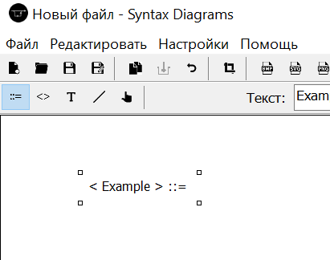

&#1058;&#1077;&#1089;&#1090; &#1087;&#1088;&#1086;&#1081;&#1076;&#1077;&#1085;!
</td></tr><tr class="c19"><td class="c33" colspan="1" rowspan="1">
1
</td><td class="c74" colspan="1" rowspan="1">
&#1044;&#1086;&#1073;&#1072;&#1074;&#1083;&#1077;&#1085;&#1080;&#1077; &#1092;&#1080;&#1075;&#1091;&#1088;&#1099; &laquo;&#1052;&#1077;&#1090;&#1072;&#1087;&#1077;&#1088;&#1077;&#1084;&#1077;&#1085;&#1085;&#1072;&#1103;&raquo;
</td><td class="c22" colspan="1" rowspan="1">
1.&#1042;&#1099;&#1073;&#1086;&#1088; &#1074; &#1082;&#1072;&#1095;&#1077;&#1089;&#1090;&#1074;&#1077; &#1090;&#1077;&#1082;&#1091;&#1097;&#1077;&#1081; &#1092;&#1080;&#1075;&#1091;&#1088;&#1099; &laquo;&#1052;&#1077;&#1090;&#1072;&#1087;&#1077;&#1088;&#1077;&#1084;&#1077;&#1085;&#1085;&#1072;&#1103;&raquo;

2.&#1050;&#1083;&#1080;&#1082;&#1085;&#1091;&#1090;&#1100; &#1087;&#1086; &#1087;&#1086;&#1083;&#1086;&#1090;&#1085;&#1091;
</td><td class="c44" colspan="1" rowspan="1">
&#1060;&#1080;&#1075;&#1091;&#1088;&#1072; &#1076;&#1086;&#1073;&#1072;&#1074;&#1080;&#1090;&#1089;&#1103;, &#1090;&#1077;&#1082;&#1089;&#1090; &#1079;&#1072;&#1082;&#1083;&#1102;&#1095;&#1080;&#1090;&#1089;&#1103; &#1074; &laquo;&lt; &gt;&raquo;
</td><td class="c42" colspan="1" rowspan="1">
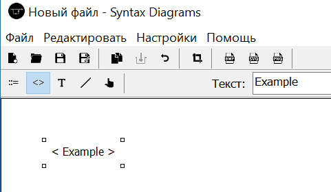

&#1058;&#1077;&#1089;&#1090; &#1087;&#1088;&#1086;&#1081;&#1076;&#1077;&#1085;!
</td></tr><tr class="c19"><td class="c33" colspan="1" rowspan="1">
2
</td><td class="c74" colspan="1" rowspan="1">
&#1044;&#1086;&#1073;&#1072;&#1074;&#1083;&#1077;&#1085;&#1080;&#1077; &#1092;&#1080;&#1075;&#1091;&#1088;&#1099; &laquo;&#1052;&#1077;&#1090;&#1072;&#1082;&#1086;&#1085;&#1089;&#1090;&#1072;&#1085;&#1090;&#1072;&raquo;
</td><td class="c22" colspan="1" rowspan="1">
1.&#1042;&#1099;&#1073;&#1086;&#1088; &#1074; &#1082;&#1072;&#1095;&#1077;&#1089;&#1090;&#1074;&#1077; &#1090;&#1077;&#1082;&#1091;&#1097;&#1077;&#1081; &#1092;&#1080;&#1075;&#1091;&#1088;&#1099; &laquo;&#1052;&#1077;&#1090;&#1072;&#1082;&#1086;&#1085;&#1089;&#1090;&#1085;&#1090;&#1072;&raquo;

2.&#1050;&#1083;&#1080;&#1082;&#1085;&#1091;&#1090;&#1100; &#1087;&#1086; &#1087;&#1086;&#1083;&#1086;&#1090;&#1085;&#1091;
</td><td class="c44" colspan="1" rowspan="1">
&#1060;&#1080;&#1075;&#1091;&#1088;&#1072; &#1076;&#1086;&#1073;&#1072;&#1074;&#1080;&#1090;&#1089;&#1103;, &#1090;&#1077;&#1082;&#1089;&#1090; &#1074;&#1099;&#1074;&#1077;&#1076;&#1077;&#1090;&#1089;&#1103; &laquo;&#1082;&#1072;&#1082; &#1077;&#1089;&#1090;&#1100;&raquo;
</td><td class="c42" colspan="1" rowspan="1">
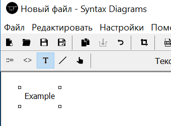

&#1058;&#1077;&#1089;&#1090; &#1087;&#1088;&#1086;&#1081;&#1076;&#1077;&#1085;!
</td></tr><tr class="c19"><td class="c33" colspan="1" rowspan="1">
3
</td><td class="c74" colspan="1" rowspan="1">
&#1044;&#1086;&#1073;&#1072;&#1074;&#1083;&#1077;&#1085;&#1080;&#1077; &#1083;&#1080;&#1085;&#1080;&#1080;
</td><td class="c22" colspan="1" rowspan="1">
1. &#1042;&#1099;&#1073;&#1086;&#1088; &#1074; &#1082;&#1072;&#1095;&#1077;&#1089;&#1090;&#1074;&#1077; &#1090;&#1077;&#1082;&#1091;&#1097;&#1077;&#1081; &#1092;&#1080;&#1075;&#1091;&#1088;&#1099; &laquo;&#1051;&#1080;&#1085;&#1080;&#1103;&raquo;

2. &#1050;&#1083;&#1080;&#1082;&#1085;&#1091;&#1090;&#1100; &#1086;&#1076;&#1080;&#1085; &#1088;&#1072;&#1079; &#1087;&#1086; &#1087;&#1086;&#1083;&#1086;&#1090;&#1085;&#1091; (&#1051;&#1077;&#1074;&#1086;&#1081; &#1082;&#1085;&#1086;&#1087;&#1082;&#1086;&#1081; &#1084;&#1099;&#1096;&#1080;).

3. &#1050;&#1083;&#1080;&#1082;&#1085;&#1091;&#1090;&#1100; &#1074;&#1090;&#1086;&#1088;&#1086;&#1081; &#1088;&#1072;&#1079; &#1087;&#1086; &#1087;&#1086;&#1083;&#1086;&#1090;&#1085;&#1091; &#1085;&#1072; &#1086;&#1076;&#1085;&#1086;&#1084; &#1091;&#1088;&#1086;&#1074;&#1085;&#1077; &#1087;&#1086; &#1086;&#1089;&#1080; OX &#1089; &#1087;&#1088;&#1086;&#1096;&#1083;&#1086;&#1081; &#1090;&#1086;&#1095;&#1082;&#1086;&#1081; (&#1051;&#1077;&#1074;&#1086;&#1081; &#1082;&#1085;&#1086;&#1087;&#1082;&#1086;&#1081; &#1084;&#1099;&#1096;&#1080;).

4. &#1053;&#1072;&#1078;&#1072;&#1090;&#1100; &#1055;&#1050;&#1052;.
</td><td class="c44" colspan="1" rowspan="1">
&#1044;&#1086;&#1073;&#1072;&#1074;&#1080;&#1090;&#1089;&#1103; &#1083;&#1080;&#1085;&#1080;&#1103; &#1080;&#1079; &#1076;&#1074;&#1091;&#1093; &#1090;&#1086;&#1095;&#1077;&#1082;.
</td><td class="c42" colspan="1" rowspan="1">
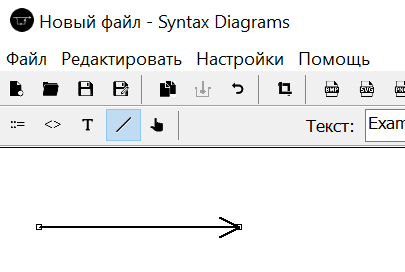

&#1058;&#1077;&#1089;&#1090; &#1087;&#1088;&#1086;&#1081;&#1076;&#1077;&#1085;! 
</td></tr><tr class="c19"><td class="c33" colspan="1" rowspan="1">
4
</td><td class="c74" colspan="1" rowspan="1">
&#1044;&#1086;&#1073;&#1072;&#1074;&#1083;&#1077;&#1085;&#1080;&#1077; &#1083;&#1080;&#1085;&#1080;&#1080;

(&#1058;&#1086;&#1095;&#1082;&#1080; &#1085;&#1077; &#1085;&#1072; &#1086;&#1076;&#1085;&#1086;&#1084; &#1091;&#1088;&#1086;&#1074;&#1085;&#1077;)
</td><td class="c22" colspan="1" rowspan="1">
1. &#1042;&#1099;&#1073;&#1086;&#1088; &#1074; &#1082;&#1072;&#1095;&#1077;&#1089;&#1090;&#1074;&#1077; &#1090;&#1077;&#1082;&#1091;&#1097;&#1077;&#1081; &#1092;&#1080;&#1075;&#1091;&#1088;&#1099; &laquo;&#1051;&#1080;&#1085;&#1080;&#1103;&raquo;

2. &#1050;&#1083;&#1080;&#1082;&#1085;&#1091;&#1090;&#1100; &#1086;&#1076;&#1080;&#1085; &#1088;&#1072;&#1079; &#1087;&#1086; &#1087;&#1086;&#1083;&#1086;&#1090;&#1085;&#1091; (&#1051;&#1077;&#1074;&#1086;&#1081; &#1082;&#1085;&#1086;&#1087;&#1082;&#1086;&#1081; &#1084;&#1099;&#1096;&#1080;).

3. &#1050;&#1083;&#1080;&#1082;&#1085;&#1091;&#1090;&#1100; &#1074;&#1090;&#1086;&#1088;&#1086;&#1081; &#1088;&#1072;&#1079; &#1087;&#1086; &#1090;&#1086;&#1095;&#1082;&#1077;, &#1085;&#1077; &#1085;&#1072;&#1093;&#1086;&#1076;&#1103;&#1097;&#1080;&#1081;&#1089;&#1103; &#1085;&#1072; &#1086;&#1076;&#1085;&#1086;&#1084; &#1091;&#1088;&#1086;&#1074;&#1085;&#1077; &#1085;&#1080; &#1087;&#1086; &#1086;&#1089;&#1080; &#1054;&#1061;, &#1085;&#1080; &#1087;&#1086; &#1086;&#1089;&#1080; OY (&#1051;&#1077;&#1074;&#1086;&#1081; &#1082;&#1085;&#1086;&#1087;&#1082;&#1086;&#1081; &#1084;&#1099;&#1096;&#1080;).

4. &#1053;&#1072;&#1078;&#1072;&#1090;&#1100; &#1055;&#1050;&#1052;.
</td><td class="c44" colspan="1" rowspan="1">
&#1044;&#1086;&#1073;&#1072;&#1074;&#1080;&#1090;&#1089;&#1103; &#1083;&#1080;&#1085;&#1080;&#1103;, &#1087;&#1072;&#1088;&#1072;&#1083;&#1083;&#1077;&#1083;&#1100;&#1085;&#1072;&#1103; &#1086;&#1076;&#1085;&#1086;&#1081; &#1080;&#1079; &#1086;&#1089;&#1077;&#1081;

(&#1057;&#1087;&#1088;&#1086;&#1077;&#1094;&#1080;&#1088;&#1091;&#1077;&#1090;&#1089;&#1103; &#1085;&#1072; &#1073;&#1083;&#1080;&#1078;&#1072;&#1081;&#1096;&#1091;&#1102; &#1086;&#1089;&#1100;)
</td><td class="c42" colspan="1" rowspan="1">

&#1058;&#1077;&#1089;&#1090; &#1087;&#1088;&#1086;&#1081;&#1076;&#1077;&#1085;!
</td></tr><tr class="c19"><td class="c33" colspan="1" rowspan="1">
5
</td><td class="c74" colspan="1" rowspan="1">
&#1044;&#1086;&#1073;&#1072;&#1074;&#1083;&#1077;&#1085;&#1080;&#1077; &#1083;&#1080;&#1085;&#1080;&#1080; &#1089; &#1085;&#1077;&#1089;&#1082;&#1086;&#1083;&#1100;&#1082;&#1080;&#1084;&#1080; &#1090;&#1086;&#1095;&#1082;&#1072;&#1084;&#1080;
</td><td class="c22" colspan="1" rowspan="1">
1. &#1042;&#1099;&#1073;&#1086;&#1088; &#1074; &#1082;&#1072;&#1095;&#1077;&#1089;&#1090;&#1074;&#1077; &#1090;&#1077;&#1082;&#1091;&#1097;&#1077;&#1081; &#1092;&#1080;&#1075;&#1091;&#1088;&#1099; &laquo;&#1051;&#1080;&#1085;&#1080;&#1103;&raquo;

2. &#1050;&#1083;&#1080;&#1082;&#1085;&#1091;&#1090;&#1100; &#1086;&#1076;&#1080;&#1085; &#1088;&#1072;&#1079; &#1087;&#1086; &#1087;&#1086;&#1083;&#1086;&#1090;&#1085;&#1091; (&#1051;&#1077;&#1074;&#1086;&#1081; &#1082;&#1085;&#1086;&#1087;&#1082;&#1086;&#1081; &#1084;&#1099;&#1096;&#1080;).

3. &#1050;&#1083;&#1080;&#1082;&#1085;&#1091;&#1090;&#1100; &#1077;&#1097;&#1077; &#1085;&#1077;&#1089;&#1082;&#1086;&#1083;&#1100;&#1082;&#1086; &#1088;&#1072;&#1079; &#1087;&#1086; &#1087;&#1086;&#1083;&#1086;&#1090;&#1085;&#1091; &#1074; &#1087;&#1088;&#1086;&#1080;&#1079;&#1074;&#1086;&#1083;&#1100;&#1085;&#1099;&#1093; &#1090;&#1086;&#1095;&#1082;&#1072;&#1093;. (&#1051;&#1077;&#1074;&#1086;&#1081; &#1082;&#1085;&#1086;&#1087;&#1082;&#1086;&#1081; &#1084;&#1099;&#1096;&#1080;)

4. &#1053;&#1072;&#1078;&#1072;&#1090;&#1100; &#1055;&#1050;&#1052;.
</td><td class="c44" colspan="1" rowspan="1">
&#1044;&#1086;&#1073;&#1072;&#1074;&#1080;&#1090;&#1089;&#1103; &#1083;&#1080;&#1085;&#1080;&#1103;
</td><td class="c42" colspan="1" rowspan="1">
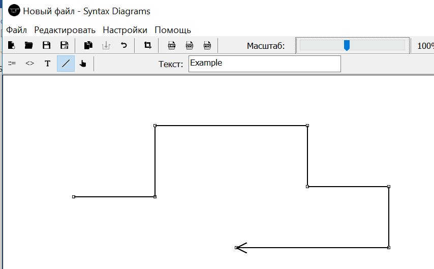

&#1058;&#1077;&#1089;&#1090; &#1087;&#1088;&#1086;&#1081;&#1076;&#1077;&#1085;!
</td></tr><tr class="c19"><td class="c33" colspan="1" rowspan="1">
6
</td><td class="c74" colspan="1" rowspan="1">
&#1044;&#1086;&#1073;&#1072;&#1074;&#1083;&#1077;&#1085;&#1080;&#1077; &#1083;&#1080;&#1085;&#1080;&#1080;, &#1089;&#1086;&#1089;&#1090;&#1086;&#1103;&#1097;&#1077;&#1081; &#1080;&#1079; &#1086;&#1076;&#1085;&#1086;&#1081; &#1090;&#1086;&#1095;&#1082;&#1080;
</td><td class="c22" colspan="1" rowspan="1">
1. &#1042;&#1099;&#1073;&#1086;&#1088; &#1074; &#1082;&#1072;&#1095;&#1077;&#1089;&#1090;&#1074;&#1077; &#1090;&#1077;&#1082;&#1091;&#1097;&#1077;&#1081; &#1092;&#1080;&#1075;&#1091;&#1088;&#1099; &laquo;&#1051;&#1080;&#1085;&#1080;&#1103;&raquo;

2. &#1050;&#1083;&#1080;&#1082;&#1085;&#1091;&#1090;&#1100; &#1086;&#1076;&#1080;&#1085; &#1088;&#1072;&#1079; &#1087;&#1086; &#1087;&#1086;&#1083;&#1086;&#1090;&#1085;&#1091; (&#1051;&#1077;&#1074;&#1086;&#1081; &#1082;&#1085;&#1086;&#1087;&#1082;&#1086;&#1081; &#1084;&#1099;&#1096;&#1080;).

3. &#1053;&#1072;&#1078;&#1072;&#1090;&#1100; &#1055;&#1050;&#1052;.
</td><td class="c44" colspan="1" rowspan="1">
&#1051;&#1080;&#1085;&#1080;&#1103; &#1085;&#1077; &#1076;&#1086;&#1073;&#1072;&#1074;&#1080;&#1090;&#1089;&#1103;

(&#1059;&#1076;&#1072;&#1083;&#1080;&#1090;&#1089;&#1103; &laquo;&#1089;&#1073;&#1086;&#1088;&#1097;&#1080;&#1082;&#1086;&#1084; &#1084;&#1091;&#1089;&#1086;&#1088;&#1072;&raquo;)
</td><td class="c42" colspan="1" rowspan="1">
&#1058;&#1077;&#1089;&#1090; &#1087;&#1088;&#1086;&#1081;&#1076;&#1077;&#1085;
</td></tr><tr class="c19"><td class="c33" colspan="1" rowspan="1">
7
</td><td class="c74" colspan="1" rowspan="1">
&#1044;&#1086;&#1073;&#1072;&#1074;&#1083;&#1077;&#1085;&#1080;&#1077; &#1083;&#1080;&#1085;&#1080;&#1080;, &#1091; &#1082;&#1086;&#1090;&#1086;&#1088;&#1086;&#1081; &#1073;&#1091;&#1076;&#1077;&#1090; &#1084;&#1085;&#1086;&#1075;&#1086; &#1090;&#1086;&#1095;&#1077;&#1082; &#1089; &#1086;&#1076;&#1080;&#1085;&#1072;&#1082;&#1086;&#1074;&#1099;&#1084;&#1080; &#1082;&#1086;&#1086;&#1088;&#1076;&#1080;&#1085;&#1072;&#1090;&#1072;&#1084;&#1080;
</td><td class="c22" colspan="1" rowspan="1">
1. &#1042;&#1099;&#1073;&#1086;&#1088; &#1074; &#1082;&#1072;&#1095;&#1077;&#1089;&#1090;&#1074;&#1077; &#1090;&#1077;&#1082;&#1091;&#1097;&#1077;&#1081; &#1092;&#1080;&#1075;&#1091;&#1088;&#1099; &laquo;&#1051;&#1080;&#1085;&#1080;&#1103;&raquo;

2. &#1050;&#1083;&#1080;&#1082;&#1085;&#1091;&#1090;&#1100; &#1086;&#1076;&#1080;&#1085; &#1088;&#1072;&#1079; &#1087;&#1086; &#1087;&#1086;&#1083;&#1086;&#1090;&#1085;&#1091; (&#1051;&#1077;&#1074;&#1086;&#1081; &#1082;&#1085;&#1086;&#1087;&#1082;&#1086;&#1081; &#1084;&#1099;&#1096;&#1080;).

3. &#1050;&#1083;&#1080;&#1082;&#1085;&#1091;&#1090;&#1100; &#1085;&#1077;&#1089;&#1082;&#1086;&#1083;&#1100;&#1082;&#1086; &#1088;&#1072;&#1079; &#1087;&#1086; &#1101;&#1090;&#1086;&#1081; &#1078;&#1077; &#1090;&#1086;&#1095;&#1082;&#1077; (&#1051;&#1077;&#1074;&#1086;&#1081; &#1082;&#1085;&#1086;&#1087;&#1082;&#1086;&#1081; &#1084;&#1099;&#1096;&#1080;)

4. &#1053;&#1072;&#1078;&#1072;&#1090;&#1100; &#1055;&#1050;&#1052;.
</td><td class="c44" colspan="1" rowspan="1">
&#1051;&#1080;&#1085;&#1080;&#1103; &#1085;&#1077; &#1076;&#1086;&#1073;&#1072;&#1074;&#1080;&#1090;&#1089;&#1103;

(&#1059;&#1076;&#1072;&#1083;&#1080;&#1090;&#1089;&#1103; &laquo;&#1089;&#1073;&#1086;&#1088;&#1097;&#1080;&#1082;&#1086;&#1084; &#1084;&#1091;&#1089;&#1086;&#1088;&#1072;&raquo;)
</td><td class="c42" colspan="1" rowspan="1">
&#1058;&#1077;&#1089;&#1090; &#1087;&#1088;&#1086;&#1081;&#1076;&#1077;&#1085;
</td></tr></tbody></table>

<ol class="c23 lst-kix_list_4-1" start="9"><li class="c18"><h2 id="h.1hmsyys" style="display:inline">&#1058;&#1077;&#1089;&#1090;&#1080;&#1088;&#1086;&#1074;&#1072;&#1085;&#1080;&#1077; &#1086;&#1090;&#1086;&#1073;&#1088;&#1072;&#1078;&#1077;&#1085;&#1080;&#1103; &#1083;&#1080;&#1085;&#1080;&#1081; &#1087;&#1088;&#1080; &#1088;&#1072;&#1079;&#1085;&#1086;&#1084; &#1074;&#1079;&#1072;&#1080;&#1084;&#1085;&#1086;&#1084; &#1088;&#1072;&#1089;&#1087;&#1086;&#1083;&#1086;&#1078;&#1077;&#1085;&#1080;&#1080; &#1092;&#1080;&#1075;&#1091;&#1088;.</h2></li></ol>

&#1058;&#1072;&#1073;&#1083;&#1080;&#1094;&#1072; 5.2 - &#1090;&#1077;&#1089;&#1090;&#1080;&#1088;&#1086;&#1074;&#1072;&#1085;&#1080;&#1077; &#1092;&#1091;&#1085;&#1082;&#1094;&#1080;&#1086;&#1085;&#1072;&#1083;&#1072; &#1086;&#1090;&#1086;&#1073;&#1088;&#1072;&#1078;&#1077;&#1085;&#1080;&#1103; &#1083;&#1080;&#1085;&#1080;&#1081;
<table class="c46"><tbody><tr class="c19"><td class="c5" colspan="1" rowspan="1">
&#1053;&#1086;&#1084;&#1077;&#1088;

&#1090;&#1077;&#1089;&#1090;&#1072;
</td><td class="c3" colspan="1" rowspan="1">
&#1058;&#1077;&#1089;&#1090;&#1080;&#1088;&#1091;&#1077;&#1084;&#1072;&#1103; &#1092;&#1091;&#1085;&#1082;&#1094;&#1080;&#1086;&#1085;&#1072;&#1083;&#1100;&#1085;&#1086;&#1089;&#1090;&#1100;
</td><td class="c68" colspan="1" rowspan="1">
&#1055;&#1086;&#1089;&#1083;&#1077;&#1076;&#1086;&#1074;&#1072;&#1090;&#1077;&#1083;&#1100;&#1085;&#1086;&#1089;&#1090;&#1100; &#1076;&#1077;&#1081;&#1089;&#1090;&#1074;&#1080;&#1081;
</td><td class="c51" colspan="1" rowspan="1">
&#1054;&#1078;&#1080;&#1076;&#1072;&#1077;&#1084;&#1099;&#1081; &#1088;&#1077;&#1079;&#1091;&#1083;&#1100;&#1090;&#1072;&#1090;
</td><td class="c62" colspan="1" rowspan="1">
&#1055;&#1086;&#1083;&#1091;&#1095;&#1077;&#1085;&#1085;&#1099;&#1081; &#1088;&#1077;&#1079;&#1091;&#1083;&#1100;&#1090;&#1072;&#1090;
</td></tr><tr class="c19"><td class="c33" colspan="1" rowspan="1">
0
</td><td class="c3" colspan="1" rowspan="6">
&#1054;&#1090;&#1086;&#1073;&#1088;&#1072;&#1078;&#1077;&#1085;&#1080;&#1077; &#1089;&#1090;&#1088;&#1077;&#1083;&#1082;&#1080; &#1085;&#1072; &#1082;&#1086;&#1085;&#1094;&#1077; &#1083;&#1080;&#1085;&#1080;&#1080;.
</td><td class="c68" colspan="1" rowspan="1">
1. &#1044;&#1086;&#1073;&#1072;&#1074;&#1080;&#1090;&#1100; &#1087;&#1077;&#1088;&#1074;&#1091;&#1102; &#1090;&#1086;&#1095;&#1082;&#1091; &#1083;&#1080;&#1085;&#1080;&#1080;

2. &#1044;&#1086;&#1073;&#1072;&#1074;&#1080;&#1090;&#1100; &#1074;&#1090;&#1086;&#1088;&#1091;&#1102; &#1090;&#1086;&#1095;&#1082;&#1091; &#1083;&#1080;&#1085;&#1080;&#1080; &#1089;&#1087;&#1088;&#1072;&#1074;&#1072; &#1086;&#1090; &#1087;&#1077;&#1088;&#1074;&#1086;&#1081;

3. &#1047;&#1072;&#1082;&#1086;&#1085;&#1095;&#1080;&#1090;&#1100; &#1088;&#1080;&#1089;&#1086;&#1074;&#1072;&#1085;&#1080;&#1077; &#1083;&#1080;&#1085;&#1080;&#1080;
</td><td class="c51" colspan="1" rowspan="1">
&#1057;&#1090;&#1088;&#1077;&#1083;&#1082;&#1072; &#1086;&#1090;&#1086;&#1073;&#1088;&#1072;&#1079;&#1080;&#1090;&#1089;&#1103;
</td><td class="c42" colspan="1" rowspan="1">
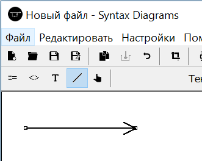

&#1058;&#1077;&#1089;&#1090; &#1087;&#1088;&#1086;&#1081;&#1076;&#1077;&#1085;
</td></tr><tr class="c19"><td class="c33" colspan="1" rowspan="1">
1
</td><td class="c68" colspan="1" rowspan="1">
1. &#1044;&#1086;&#1073;&#1072;&#1074;&#1080;&#1090;&#1100; &#1087;&#1077;&#1088;&#1074;&#1091;&#1102; &#1090;&#1086;&#1095;&#1082;&#1091; &#1083;&#1080;&#1085;&#1080;&#1080;

2. &#1044;&#1086;&#1073;&#1072;&#1074;&#1080;&#1090;&#1100; &#1074;&#1090;&#1086;&#1088;&#1091;&#1102; &#1090;&#1086;&#1095;&#1082;&#1091; &#1083;&#1080;&#1085;&#1080;&#1080; &#1089;&#1083;&#1077;&#1074;&#1072; &#1086;&#1090; &#1087;&#1077;&#1088;&#1074;&#1086;&#1081;

3. &#1047;&#1072;&#1082;&#1086;&#1085;&#1095;&#1080;&#1090;&#1100; &#1088;&#1080;&#1089;&#1086;&#1074;&#1072;&#1085;&#1080;&#1077; &#1083;&#1080;&#1085;&#1080;&#1080;
</td><td class="c51" colspan="1" rowspan="1">
&#1057;&#1090;&#1088;&#1077;&#1083;&#1082;&#1072; &#1086;&#1090;&#1086;&#1073;&#1088;&#1072;&#1079;&#1080;&#1090;&#1089;&#1103;
</td><td class="c42" colspan="1" rowspan="1">
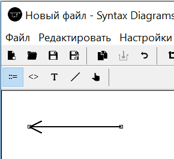

&#1058;&#1077;&#1089;&#1090; &#1087;&#1088;&#1086;&#1081;&#1076;&#1077;&#1085;
</td></tr><tr class="c19"><td class="c33" colspan="1" rowspan="1">
2
</td><td class="c68" colspan="1" rowspan="1">
1. &#1044;&#1086;&#1073;&#1072;&#1074;&#1080;&#1090;&#1100; &#1087;&#1077;&#1088;&#1074;&#1091;&#1102; &#1090;&#1086;&#1095;&#1082;&#1091; &#1083;&#1080;&#1085;&#1080;&#1080;

2. &#1044;&#1086;&#1073;&#1072;&#1074;&#1080;&#1090;&#1100; &#1074;&#1090;&#1086;&#1088;&#1091;&#1102; &#1090;&#1086;&#1095;&#1082;&#1091; &#1083;&#1080;&#1085;&#1080;&#1080; &#1089;&#1074;&#1077;&#1088;&#1093;&#1091; &#1086;&#1090; &#1087;&#1077;&#1088;&#1074;&#1086;&#1081;

3. &#1047;&#1072;&#1082;&#1086;&#1085;&#1095;&#1080;&#1090;&#1100; &#1088;&#1080;&#1089;&#1086;&#1074;&#1072;&#1085;&#1080;&#1077; &#1083;&#1080;&#1085;&#1080;&#1080;
</td><td class="c51" colspan="1" rowspan="1">
&#1057;&#1090;&#1088;&#1077;&#1083;&#1082;&#1072; &#1086;&#1090;&#1086;&#1073;&#1088;&#1072;&#1079;&#1080;&#1090;&#1089;&#1103;
</td><td class="c42" colspan="1" rowspan="1">
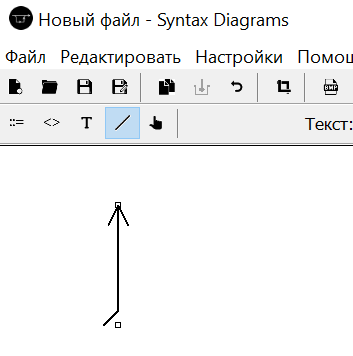

&#1058;&#1077;&#1089;&#1090; &#1087;&#1088;&#1086;&#1081;&#1076;&#1077;&#1085;
</td></tr><tr class="c19"><td class="c33" colspan="1" rowspan="1">
3
</td><td class="c68" colspan="1" rowspan="1">
1. &#1044;&#1086;&#1073;&#1072;&#1074;&#1080;&#1090;&#1100; &#1087;&#1077;&#1088;&#1074;&#1091;&#1102; &#1090;&#1086;&#1095;&#1082;&#1091; &#1083;&#1080;&#1085;&#1080;&#1080;

2. &#1044;&#1086;&#1073;&#1072;&#1074;&#1080;&#1090;&#1100; &#1074;&#1090;&#1086;&#1088;&#1091;&#1102; &#1090;&#1086;&#1095;&#1082;&#1091; &#1083;&#1080;&#1085;&#1080;&#1080; &#1089;&#1085;&#1080;&#1079;&#1091; &#1086;&#1090; &#1087;&#1077;&#1088;&#1074;&#1086;&#1081;

3. &#1047;&#1072;&#1082;&#1086;&#1085;&#1095;&#1080;&#1090;&#1100; &#1088;&#1080;&#1089;&#1086;&#1074;&#1072;&#1085;&#1080;&#1077; &#1083;&#1080;&#1085;&#1080;&#1080;
</td><td class="c51" colspan="1" rowspan="1">
&#1057;&#1090;&#1088;&#1077;&#1083;&#1082;&#1072; &#1086;&#1090;&#1086;&#1073;&#1088;&#1072;&#1079;&#1080;&#1090;&#1089;&#1103;
</td><td class="c42" colspan="1" rowspan="1">
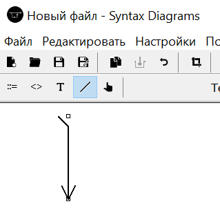

&#1058;&#1077;&#1089;&#1090; &#1087;&#1088;&#1086;&#1081;&#1076;&#1077;&#1085;
</td></tr><tr class="c19"><td class="c33" colspan="1" rowspan="1">
4
</td><td class="c68" colspan="1" rowspan="1">
1. &#1044;&#1086;&#1073;&#1072;&#1074;&#1080;&#1090;&#1100; &#1087;&#1077;&#1088;&#1074;&#1091;&#1102; &#1090;&#1086;&#1095;&#1082;&#1091; &#1083;&#1080;&#1085;&#1080;&#1080;

2. &#1044;&#1086;&#1073;&#1072;&#1074;&#1080;&#1090;&#1100; &#1077;&#1097;&#1077; &#1085;&#1077;&#1089;&#1082;&#1086;&#1083;&#1100;&#1082;&#1086; &#1090;&#1086;&#1095;&#1077;&#1082;

3. &#1047;&#1072;&#1082;&#1086;&#1085;&#1095;&#1080;&#1090;&#1100; &#1088;&#1080;&#1089;&#1086;&#1074;&#1072;&#1085;&#1080;&#1077; &#1083;&#1080;&#1085;&#1080;&#1080;
</td><td class="c51" colspan="1" rowspan="1">
&#1057;&#1090;&#1088;&#1077;&#1083;&#1082;&#1072; &#1086;&#1090;&#1086;&#1073;&#1088;&#1072;&#1079;&#1080;&#1090;&#1089;&#1103;
</td><td class="c42" colspan="1" rowspan="1">
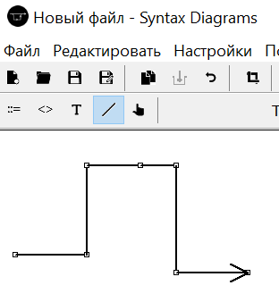

&#1058;&#1077;&#1089;&#1090; &#1087;&#1088;&#1086;&#1081;&#1076;&#1077;&#1085;
</td></tr><tr class="c19"><td class="c33" colspan="1" rowspan="1">
5
</td><td class="c68" colspan="1" rowspan="1">
1. &#1044;&#1086;&#1073;&#1072;&#1074;&#1080;&#1090;&#1100; &#1087;&#1077;&#1088;&#1074;&#1091;&#1102; &#1090;&#1086;&#1095;&#1082;&#1091; &#1083;&#1080;&#1085;&#1080;&#1080;

2. &#1044;&#1086;&#1073;&#1072;&#1074;&#1080;&#1090;&#1100; &#1077;&#1097;&#1077; &#1085;&#1077;&#1089;&#1082;&#1086;&#1083;&#1100;&#1082;&#1086; &#1090;&#1086;&#1095;&#1077;&#1082;

3. &#1044;&#1086;&#1073;&#1072;&#1074;&#1080;&#1090;&#1100; &#1087;&#1086;&#1089;&#1083;&#1077;&#1076;&#1085;&#1102;&#1102; &#1090;&#1086;&#1095;&#1082;&#1091; &#1087;&#1086; &#1090;&#1077;&#1084; &#1078;&#1077; &#1082;&#1086;&#1086;&#1088;&#1076;&#1080;&#1085;&#1072;&#1090;&#1072;&#1084;, &#1095;&#1090;&#1086; &#1080; &#1087;&#1088;&#1077;&#1076;&#1099;&#1076;&#1091;&#1097;&#1072;&#1103;.

4. &#1047;&#1072;&#1082;&#1086;&#1085;&#1095;&#1080;&#1090;&#1100; &#1088;&#1080;&#1089;&#1086;&#1074;&#1072;&#1085;&#1080;&#1077; &#1083;&#1080;&#1085;&#1080;&#1080;
</td><td class="c51" colspan="1" rowspan="1">
&#1057;&#1090;&#1088;&#1077;&#1083;&#1082;&#1072; &#1085;&#1077; &#1086;&#1090;&#1086;&#1073;&#1088;&#1072;&#1079;&#1080;&#1090;&#1089;&#1103;
</td><td class="c42" colspan="1" rowspan="1">
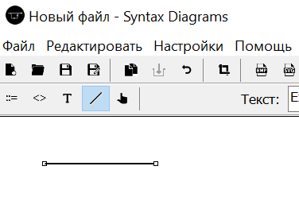 &#1058;&#1077;&#1089;&#1090; &#1087;&#1088;&#1086;&#1081;&#1076;&#1077;&#1085;
</td></tr><tr class="c19"><td class="c33" colspan="1" rowspan="1">
6
</td><td class="c3" colspan="1" rowspan="5">
&#1054;&#1090;&#1086;&#1073;&#1088;&#1072;&#1078;&#1077;&#1085;&#1080;&#1077; &#1076;&#1080;&#1072;&#1075;&#1086;&#1085;&#1072;&#1083;&#1100;&#1085;&#1086;&#1075;&#1086; &#1086;&#1090;&#1088;&#1077;&#1079;&#1082;&#1072; &#1074; &#1085;&#1072;&#1095;&#1072;&#1083;&#1077; &#1074;&#1077;&#1088;&#1090;&#1080;&#1082;&#1072;&#1083;&#1100;&#1085;&#1086;&#1081; &#1083;&#1080;&#1085;&#1080;&#1080;
</td><td class="c68" colspan="1" rowspan="1">
1. &#1044;&#1086;&#1073;&#1072;&#1074;&#1080;&#1090;&#1100; &#1083;&#1080;&#1085;&#1080;&#1102; &#1080;&#1079; &#1076;&#1074;&#1091;&#1093; &#1090;&#1086;&#1095;&#1077;&#1082; (&#1042;&#1090;&#1086;&#1088;&#1072;&#1103; &#1074;&#1099;&#1096;&#1077; &#1087;&#1077;&#1088;&#1074;&#1086;&#1081;)

2. &#1047;&#1072;&#1082;&#1086;&#1085;&#1095;&#1080;&#1090;&#1100; &#1088;&#1080;&#1089;&#1086;&#1074;&#1072;&#1085;&#1080;&#1077;
</td><td class="c51" colspan="1" rowspan="1">
&#1044;&#1080;&#1072;&#1075;&#1086;&#1085;&#1072;&#1083;&#1100;&#1085;&#1099;&#1081; &#1086;&#1090;&#1088;&#1077;&#1079;&#1086;&#1082; &#1087;&#1086;&#1103;&#1074;&#1080;&#1090;&#1089;&#1103;
</td><td class="c42" colspan="1" rowspan="1">
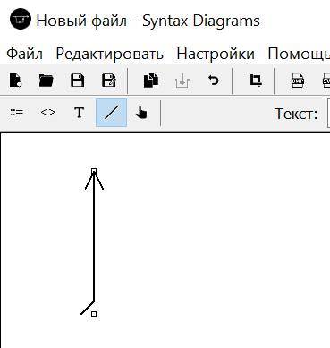

&#1058;&#1077;&#1089;&#1090; &#1087;&#1088;&#1086;&#1081;&#1076;&#1077;&#1085;
</td></tr><tr class="c19"><td class="c33" colspan="1" rowspan="1">
7
</td><td class="c68" colspan="1" rowspan="1">
1. &#1044;&#1086;&#1073;&#1072;&#1074;&#1080;&#1090;&#1100; &#1083;&#1080;&#1085;&#1080;&#1102; &#1080;&#1079; &#1076;&#1074;&#1091;&#1093; &#1090;&#1086;&#1095;&#1077;&#1082; (&#1042;&#1090;&#1086;&#1088;&#1072;&#1103; &#1085;&#1080;&#1078;&#1077; &#1087;&#1077;&#1088;&#1074;&#1086;&#1081;)

2. &#1047;&#1072;&#1082;&#1086;&#1085;&#1095;&#1080;&#1090;&#1100; &#1088;&#1080;&#1089;&#1086;&#1074;&#1072;&#1085;&#1080;&#1077;
</td><td class="c51" colspan="1" rowspan="1">
&#1044;&#1080;&#1072;&#1075;&#1086;&#1085;&#1072;&#1083;&#1100;&#1085;&#1099;&#1081; &#1086;&#1090;&#1088;&#1077;&#1079;&#1086;&#1082; &#1087;&#1086;&#1103;&#1074;&#1080;&#1090;&#1089;&#1103;
</td><td class="c42" colspan="1" rowspan="1">
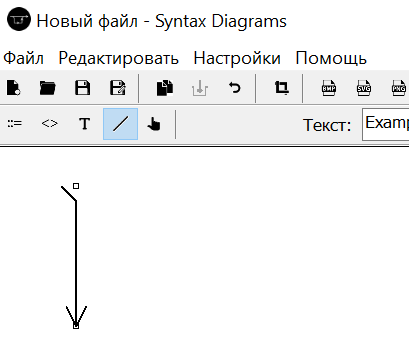

&#1058;&#1077;&#1089;&#1090; &#1087;&#1088;&#1086;&#1081;&#1076;&#1077;&#1085;
</td></tr><tr class="c19"><td class="c33" colspan="1" rowspan="1">
8
</td><td class="c68" colspan="1" rowspan="1">
1. &#1044;&#1086;&#1073;&#1072;&#1074;&#1080;&#1090;&#1100; &#1083;&#1080;&#1085;&#1080;&#1102; &#1080;&#1079; &#1076;&#1074;&#1091;&#1093; &#1085;&#1077;&#1089;&#1082;&#1086;&#1083;&#1100;&#1082;&#1080;&#1093; &#1090;&#1086;&#1095;&#1077;&#1082;, &#1087;&#1088;&#1080;&#1095;&#1077;&#1084; &#1087;&#1077;&#1088;&#1074;&#1099;&#1077; &#1076;&#1074;&#1077; &#1090;&#1086;&#1095;&#1082;&#1080; &ndash; &#1074;&#1077;&#1088;&#1090;&#1080;&#1082;&#1072;&#1083;&#1100;&#1085;&#1099;&#1081; &#1086;&#1090;&#1088;&#1077;&#1079;&#1086;&#1082;

2. &#1047;&#1072;&#1082;&#1086;&#1085;&#1095;&#1080;&#1090;&#1100; &#1088;&#1080;&#1089;&#1086;&#1074;&#1072;&#1085;&#1080;&#1077;
</td><td class="c51" colspan="1" rowspan="1">
&#1044;&#1080;&#1072;&#1075;&#1086;&#1085;&#1072;&#1083;&#1100;&#1085;&#1099;&#1081; &#1086;&#1090;&#1088;&#1077;&#1079;&#1086;&#1082; &#1087;&#1086;&#1103;&#1074;&#1080;&#1090;&#1089;&#1103;
</td><td class="c42" colspan="1" rowspan="1">
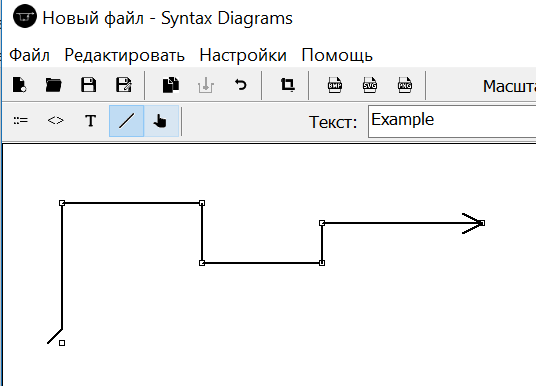

&#1058;&#1077;&#1089;&#1090; &#1087;&#1088;&#1086;&#1081;&#1076;&#1077;&#1085;
</td></tr><tr class="c19"><td class="c33" colspan="1" rowspan="1">
9
</td><td class="c68" colspan="1" rowspan="1">
1. &#1044;&#1086;&#1073;&#1072;&#1074;&#1080;&#1090;&#1100; &#1083;&#1080;&#1085;&#1080;&#1102; &#1080;&#1079; &#1076;&#1074;&#1091;&#1093; &#1090;&#1086;&#1095;&#1077;&#1082; (&#1042;&#1090;&#1086;&#1088;&#1072;&#1103; &#1083;&#1077;&#1074;&#1077;&#1077; &#1087;&#1077;&#1088;&#1074;&#1086;&#1081;)

2. &#1047;&#1072;&#1082;&#1086;&#1085;&#1095;&#1080;&#1090;&#1100; &#1088;&#1080;&#1089;&#1086;&#1074;&#1072;&#1085;&#1080;&#1077;
</td><td class="c51" colspan="1" rowspan="1">
&#1044;&#1080;&#1072;&#1075;&#1086;&#1085;&#1072;&#1083;&#1100;&#1085;&#1099;&#1081; &#1086;&#1090;&#1088;&#1077;&#1079;&#1086;&#1082; &#1085;&#1077; &#1087;&#1086;&#1103;&#1074;&#1080;&#1090;&#1089;&#1103;
</td><td class="c42" colspan="1" rowspan="1">

&#1058;&#1077;&#1089;&#1090; &#1087;&#1088;&#1086;&#1081;&#1076;&#1077;&#1085;
</td></tr><tr class="c19"><td class="c33" colspan="1" rowspan="1">
10
</td><td class="c68" colspan="1" rowspan="1">
1. &#1044;&#1086;&#1073;&#1072;&#1074;&#1080;&#1090;&#1100; &#1083;&#1080;&#1085;&#1080;&#1102; &#1080;&#1079; &#1076;&#1074;&#1091;&#1093; &#1090;&#1086;&#1095;&#1077;&#1082; (&#1042;&#1090;&#1086;&#1088;&#1072;&#1103; &#1087;&#1088;&#1072;&#1074;&#1077;&#1077; &#1087;&#1077;&#1088;&#1074;&#1086;&#1081;)

2. &#1047;&#1072;&#1082;&#1086;&#1085;&#1095;&#1080;&#1090;&#1100; &#1088;&#1080;&#1089;&#1086;&#1074;&#1072;&#1085;&#1080;&#1077;
</td><td class="c51" colspan="1" rowspan="1">
&#1044;&#1080;&#1072;&#1075;&#1086;&#1085;&#1072;&#1083;&#1100;&#1085;&#1099;&#1081; &#1085;&#1077; &#1086;&#1090;&#1088;&#1077;&#1079;&#1086;&#1082; &#1087;&#1086;&#1103;&#1074;&#1080;&#1090;&#1089;&#1103;
</td><td class="c42" colspan="1" rowspan="1">

&#1058;&#1077;&#1089;&#1090; &#1087;&#1088;&#1086;&#1081;&#1076;&#1077;&#1085;
</td></tr><tr class="c19"><td class="c33" colspan="1" rowspan="1">
11
</td><td class="c3" colspan="1" rowspan="4">
&#1054;&#1090;&#1086;&#1073;&#1088;&#1072;&#1078;&#1077;&#1085;&#1080;&#1077; &#1076;&#1080;&#1072;&#1075;&#1086;&#1085;&#1072;&#1083;&#1100;&#1085;&#1086;&#1075;&#1086; &#1086;&#1090;&#1088;&#1077;&#1079;&#1082;&#1072; &#1074; &#1082;&#1086;&#1085;&#1094;&#1077; &#1074;&#1077;&#1088;&#1090;&#1080;&#1082;&#1072;&#1083;&#1100;&#1085;&#1086;&#1081; &#1083;&#1080;&#1085;&#1080;&#1080;
</td><td class="c68" colspan="1" rowspan="1">
1. &#1044;&#1086;&#1073;&#1072;&#1074;&#1080;&#1090;&#1100; &#1083;&#1080;&#1085;&#1080;&#1102; &#1080;&#1079; &#1090;&#1088;&#1077;&#1093; &#1090;&#1086;&#1095;&#1077;&#1082;:

&#1055;&#1077;&#1088;&#1074;&#1099;&#1077; &#1076;&#1074;&#1077; &ndash; &#1074;&#1077;&#1088;&#1090;&#1080;&#1082;&#1072;&#1083;&#1100;&#1085;&#1099;&#1081; &#1086;&#1090;&#1088;&#1077;&#1079;&#1086;&#1082;

&#1055;&#1086;&#1089;&#1083;&#1077;&#1076;&#1085;&#1080;&#1077; &#1076;&#1074;&#1077; &ndash; &#1075;&#1086;&#1088;&#1080;&#1079;&#1086;&#1085;&#1090;&#1072;&#1083;&#1100;&#1085;&#1099;&#1081;

2. &#1047;&#1072;&#1082;&#1086;&#1085;&#1095;&#1080;&#1090;&#1100; &#1088;&#1080;&#1089;&#1086;&#1074;&#1072;&#1085;&#1080;&#1077;
</td><td class="c51" colspan="1" rowspan="1">
&#1044;&#1080;&#1072;&#1075;&#1086;&#1085;&#1072;&#1083;&#1100;&#1085;&#1099;&#1081; &#1086;&#1090;&#1088;&#1077;&#1079;&#1086;&#1082; &#1074; &#1082;&#1086;&#1085;&#1094;&#1077; &#1083;&#1080;&#1085;&#1080;&#1080; &#1087;&#1086;&#1103;&#1074;&#1080;&#1090;&#1089;&#1103;
</td><td class="c42" colspan="1" rowspan="1">
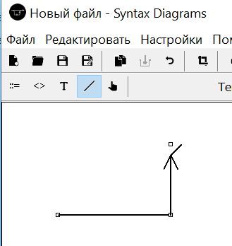

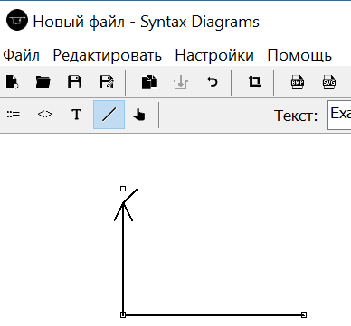

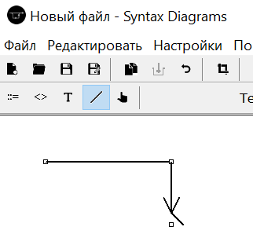

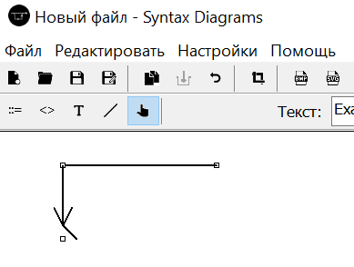

&#1058;&#1077;&#1089;&#1090; &#1087;&#1088;&#1086;&#1081;&#1076;&#1077;&#1085;
</td></tr><tr class="c19"><td class="c33" colspan="1" rowspan="1">
12
</td><td class="c68" colspan="1" rowspan="1">
1. &#1044;&#1086;&#1073;&#1072;&#1074;&#1080;&#1090;&#1100; &#1083;&#1080;&#1085;&#1080;&#1102; &#1080;&#1079; &#1090;&#1088;&#1077;&#1093; &#1090;&#1086;&#1095;&#1077;&#1082;, &#1086;&#1073;&#1097;&#1072;&#1103; &#1083;&#1080;&#1085;&#1080;&#1103; - &#1074;&#1077;&#1088;&#1090;&#1080;&#1082;&#1072;&#1083;&#1100;&#1085;&#1072;&#1103;

2. &#1047;&#1072;&#1082;&#1086;&#1085;&#1095;&#1080;&#1090;&#1100; &#1088;&#1080;&#1089;&#1086;&#1074;&#1072;&#1085;&#1080;&#1077;
</td><td class="c51" colspan="1" rowspan="1">
&#1044;&#1080;&#1072;&#1075;&#1086;&#1085;&#1072;&#1083;&#1100;&#1085;&#1099;&#1081; &#1086;&#1090;&#1088;&#1077;&#1079;&#1086;&#1082; &#1074; &#1082;&#1086;&#1085;&#1094;&#1077; &#1083;&#1080;&#1085;&#1080;&#1080; &#1085;&#1077; &#1087;&#1086;&#1103;&#1074;&#1080;&#1090;&#1089;&#1103;
</td><td class="c42" colspan="1" rowspan="1">
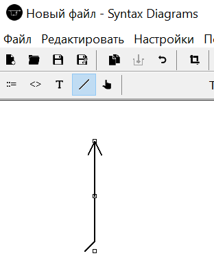

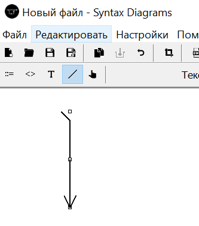

&#1058;&#1077;&#1089;&#1090; &#1087;&#1088;&#1086;&#1081;&#1076;&#1077;&#1085;! 
</td></tr><tr class="c19"><td class="c33" colspan="1" rowspan="1">
13
</td><td class="c68" colspan="1" rowspan="1">
1. &#1044;&#1086;&#1073;&#1072;&#1074;&#1080;&#1090;&#1100; &#1074;&#1077;&#1088;&#1090;&#1080;&#1082;&#1072;&#1083;&#1100;&#1085;&#1091;&#1102; &#1083;&#1080;&#1085;&#1080;&#1102; &#1080;&#1079; &#1076;&#1074;&#1091;&#1093; &#1090;&#1086;&#1095;&#1077;&#1082;

2. &#1047;&#1072;&#1082;&#1086;&#1085;&#1095;&#1080;&#1090;&#1100; &#1088;&#1080;&#1089;&#1086;&#1074;&#1072;&#1085;&#1080;&#1077;
</td><td class="c51" colspan="1" rowspan="1">
&#1044;&#1080;&#1072;&#1075;&#1086;&#1085;&#1072;&#1083;&#1100;&#1085;&#1099;&#1081; &#1086;&#1090;&#1088;&#1077;&#1079;&#1086;&#1082; &#1074; &#1082;&#1086;&#1085;&#1094;&#1077; &#1083;&#1080;&#1085;&#1080;&#1080; &#1085;&#1077; &#1087;&#1086;&#1103;&#1074;&#1080;&#1090;&#1089;&#1103;
</td><td class="c42" colspan="1" rowspan="1">
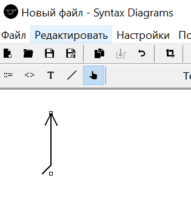

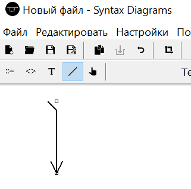

&#1058;&#1077;&#1089;&#1090; &#1087;&#1088;&#1086;&#1081;&#1076;&#1077;&#1085;
</td></tr><tr class="c19"><td class="c33" colspan="1" rowspan="1">
14
</td><td class="c68" colspan="1" rowspan="1">
1. &#1044;&#1086;&#1073;&#1072;&#1074;&#1080;&#1090;&#1100; &#1075;&#1086;&#1088;&#1080;&#1079;&#1086;&#1085;&#1090;&#1072;&#1083;&#1100;&#1085;&#1091;&#1102; &#1083;&#1080;&#1085;&#1080;&#1102; &#1080;&#1079; &#1076;&#1074;&#1091;&#1093; &#1090;&#1086;&#1095;&#1077;&#1082;

2. &#1047;&#1072;&#1082;&#1086;&#1085;&#1095;&#1080;&#1090;&#1100; &#1088;&#1080;&#1089;&#1086;&#1074;&#1072;&#1085;&#1080;&#1077;
</td><td class="c51" colspan="1" rowspan="1">
&#1044;&#1080;&#1072;&#1075;&#1086;&#1085;&#1072;&#1083;&#1100;&#1085;&#1099;&#1081; &#1086;&#1090;&#1088;&#1077;&#1079;&#1086;&#1082; &#1074; &#1082;&#1086;&#1085;&#1094;&#1077; &#1083;&#1080;&#1085;&#1080;&#1080; &#1085;&#1077; &#1087;&#1086;&#1103;&#1074;&#1080;&#1090;&#1089;&#1103;
</td><td class="c42" colspan="1" rowspan="1">
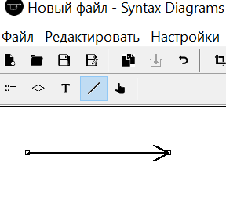

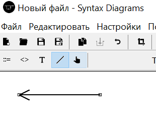

&#1058;&#1077;&#1089;&#1090; &#1087;&#1088;&#1086;&#1081;&#1076;&#1077;&#1085;
</td></tr><tr class="c19"><td class="c33" colspan="1" rowspan="1">
15
</td><td class="c3" colspan="1" rowspan="4">
&#1054;&#1090;&#1086;&#1073;&#1088;&#1072;&#1078;&#1077;&#1085;&#1080;&#1077; &#1076;&#1080;&#1072;&#1075;&#1086;&#1085;&#1072;&#1083;&#1100;&#1085;&#1086;&#1075;&#1086; &#1086;&#1090;&#1088;&#1077;&#1079;&#1082;&#1072; &#1074; &#1085;&#1072;&#1095;&#1072;&#1083;&#1077; &#1080; &#1082;&#1086;&#1085;&#1094;&#1077; &#1075;&#1086;&#1088;&#1080;&#1079;&#1086;&#1085;&#1090;&#1072;&#1083;&#1100;&#1085;&#1086;&#1081; &#1083;&#1080;&#1085;&#1080;&#1080;
</td><td class="c68" colspan="1" rowspan="1">
1. &#1044;&#1086;&#1073;&#1072;&#1074;&#1080;&#1090;&#1100; &#1075;&#1086;&#1088;&#1080;&#1079;&#1086;&#1085;&#1090;&#1072;&#1083;&#1100;&#1085;&#1091;&#1102; &#1083;&#1080;&#1085;&#1080;&#1102; &#1080;&#1079; &#1076;&#1074;&#1091;&#1093; &#1090;&#1086;&#1095;&#1077;&#1082;

2. &#1047;&#1072;&#1082;&#1086;&#1085;&#1095;&#1080;&#1090;&#1100; &#1088;&#1080;&#1089;&#1086;&#1074;&#1072;&#1085;&#1080;&#1077;
</td><td class="c51" colspan="1" rowspan="1">
&#1044;&#1080;&#1072;&#1075;&#1086;&#1085;&#1072;&#1083;&#1100;&#1085;&#1099;&#1081; &#1086;&#1090;&#1088;&#1077;&#1079;&#1086;&#1082; &#1085;&#1077; &#1076;&#1086;&#1073;&#1072;&#1074;&#1080;&#1090;&#1089;&#1103;
</td><td class="c42" colspan="1" rowspan="1">

</td></tr><tr class="c19"><td class="c33" colspan="1" rowspan="1">
16
</td><td class="c68" colspan="1" rowspan="1">
1. &#1044;&#1086;&#1073;&#1072;&#1074;&#1080;&#1090;&#1100; &#1075;&#1086;&#1088;&#1080;&#1079;&#1086;&#1085;&#1090;&#1072;&#1083;&#1100;&#1085;&#1091;&#1102; &#1083;&#1080;&#1085;&#1080;&#1102; &#1080;&#1079; &#1076;&#1074;&#1091;&#1093; &#1090;&#1086;&#1095;&#1077;&#1082;.

2. &#1057;&#1073;&#1086;&#1082;&#1091; &#1076;&#1086;&#1073;&#1072;&#1074;&#1080;&#1090;&#1100; &#1074;&#1077;&#1088;&#1090;&#1080;&#1082;&#1072;&#1083;&#1100;&#1085;&#1091;&#1102; &#1083;&#1080;&#1085;&#1080;&#1102; &#1090;&#1072;&#1082;, &#1095;&#1090;&#1086;&#1073;&#1099; &#1086;&#1076;&#1080;&#1085; &#1080;&#1079; &#1082;&#1086;&#1085;&#1094;&#1086;&#1074; &#1087;&#1077;&#1088;&#1074;&#1086;&#1081; &#1083;&#1080;&#1085;&#1080;&#1080; &#1087;&#1088;&#1080;&#1085;&#1072;&#1076;&#1083;&#1077;&#1078;&#1072;&#1083; &#1074;&#1090;&#1086;&#1088;&#1086;&#1081;.

3. &#1047;&#1072;&#1082;&#1086;&#1085;&#1095;&#1080;&#1090;&#1100; &#1088;&#1080;&#1089;&#1086;&#1074;&#1072;&#1085;&#1080;&#1077;
</td><td class="c51" colspan="1" rowspan="1">
&#1044;&#1080;&#1072;&#1075;&#1086;&#1085;&#1072;&#1083;&#1100;&#1085;&#1099;&#1081; &#1086;&#1090;&#1088;&#1077;&#1079;&#1086;&#1082; &#1076;&#1086;&#1073;&#1072;&#1074;&#1080;&#1090;&#1089;&#1103;
</td><td class="c42" colspan="1" rowspan="1">
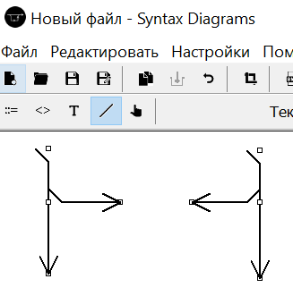

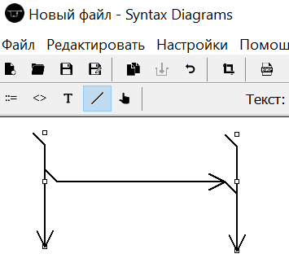

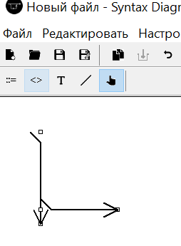
</td></tr><tr class="c19"><td class="c33" colspan="1" rowspan="1">
17
</td><td class="c68" colspan="1" rowspan="1">
1. &#1044;&#1086;&#1073;&#1072;&#1074;&#1080;&#1090;&#1100; &#1075;&#1086;&#1088;&#1080;&#1079;&#1086;&#1085;&#1090;&#1072;&#1083;&#1100;&#1085;&#1091;&#1102; &#1083;&#1080;&#1085;&#1080;&#1102; &#1080;&#1079; &#1076;&#1074;&#1091;&#1093; &#1090;&#1086;&#1095;&#1077;&#1082;.

2. &#1057;&#1073;&#1086;&#1082;&#1091; &#1076;&#1086;&#1073;&#1072;&#1074;&#1080;&#1090;&#1100; &#1074;&#1077;&#1088;&#1090;&#1080;&#1082;&#1072;&#1083;&#1100;&#1085;&#1091;&#1102; &#1083;&#1080;&#1085;&#1080;&#1102; &#1090;&#1072;&#1082;, &#1095;&#1090;&#1086;&#1073;&#1099; &#1086;&#1076;&#1080;&#1085; &#1080;&#1079; &#1082;&#1086;&#1085;&#1094;&#1086;&#1074; &#1087;&#1077;&#1088;&#1074;&#1086;&#1081; &#1083;&#1080;&#1085;&#1080;&#1080; &#1087;&#1088;&#1080;&#1085;&#1072;&#1076;&#1083;&#1077;&#1078;&#1072;&#1083; &#1074;&#1090;&#1086;&#1088;&#1086;&#1081;.

(&#1053;&#1072; &#1089;&#1072;&#1084;&#1086;&#1084; &#1082;&#1088;&#1072;&#1102; &#1074;&#1090;&#1086;&#1088;&#1086;&#1081; &#1083;&#1080;&#1085;&#1080;&#1080;)

3. &#1047;&#1072;&#1082;&#1086;&#1085;&#1095;&#1080;&#1090;&#1100; &#1088;&#1080;&#1089;&#1086;&#1074;&#1072;&#1085;&#1080;&#1077;
</td><td class="c51" colspan="1" rowspan="1">
&#1043;&#1086;&#1088;&#1080;&#1079;&#1086;&#1085;&#1090;&#1072;&#1083;&#1100;&#1085;&#1099;&#1081; &#1086;&#1090;&#1088;&#1077;&#1079;&#1086;&#1082; &#1085;&#1077; &#1086;&#1090;&#1086;&#1073;&#1088;&#1072;&#1079;&#1080;&#1090;&#1089;&#1103;
</td><td class="c42" colspan="1" rowspan="1">
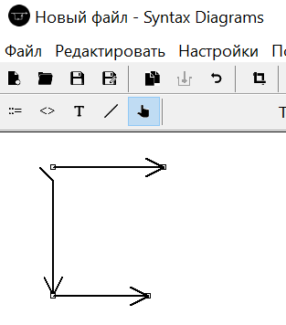

&#1058;&#1077;&#1089;&#1090; &#1087;&#1088;&#1086;&#1081;&#1076;&#1077;&#1085;
</td></tr><tr class="c19"><td class="c33" colspan="1" rowspan="1">
18
</td><td class="c68" colspan="1" rowspan="1">
1. &#1044;&#1086;&#1073;&#1072;&#1074;&#1080;&#1090;&#1100; &#1075;&#1086;&#1088;&#1080;&#1079;&#1086;&#1085;&#1090;&#1072;&#1083;&#1100;&#1085;&#1091;&#1102; &#1083;&#1080;&#1085;&#1080;&#1102; &#1080;&#1079; &#1076;&#1074;&#1091;&#1093; &#1090;&#1086;&#1095;&#1077;&#1082;.

2. &#1044;&#1086;&#1073;&#1072;&#1074;&#1080;&#1090;&#1100; &#1074;&#1077;&#1088;&#1090;&#1080;&#1082;&#1072;&#1083;&#1100;&#1085;&#1091;&#1102; &#1083;&#1080;&#1085;&#1080;&#1102; &#1090;&#1072;&#1082;, &#1095;&#1090;&#1086;&#1073;&#1099; &#1086;&#1085;&#1080; &#1087;&#1077;&#1088;&#1077;&#1089;&#1077;&#1082;&#1072;&#1083;&#1080;&#1089;&#1100; &#1085;&#1077; &#1074; &#1087;&#1077;&#1088;&#1074;&#1086;&#1081; &#1090;&#1086;&#1095;&#1082;&#1077;

3. &#1047;&#1072;&#1082;&#1086;&#1085;&#1095;&#1080;&#1090;&#1100; &#1088;&#1080;&#1089;&#1086;&#1074;&#1072;&#1085;&#1080;&#1077;
</td><td class="c51" colspan="1" rowspan="1">
&#1043;&#1086;&#1088;&#1080;&#1079;&#1086;&#1085;&#1090;&#1072;&#1083;&#1100;&#1085;&#1099;&#1081; &#1086;&#1090;&#1088;&#1077;&#1079;&#1086;&#1082; &#1085;&#1077; &#1086;&#1090;&#1086;&#1073;&#1088;&#1072;&#1079;&#1080;&#1100;&#1089;&#1103;
</td><td class="c42" colspan="1" rowspan="1">
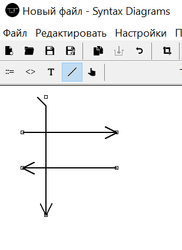

&#1058;&#1077;&#1089;&#1090; &#1087;&#1088;&#1086;&#1081;&#1076;&#1077;&#1085;
</td></tr><tr class="c19"><td class="c33" colspan="1" rowspan="1">
19
</td><td class="c3" colspan="1" rowspan="1">
&#1054;&#1090;&#1086;&#1073;&#1088;&#1072;&#1078;&#1077;&#1085;&#1080;&#1077; &#1089;&#1090;&#1088;&#1077;&#1083;&#1082;&#1080; &#1087;&#1086; &#1089;&#1077;&#1088;&#1077;&#1076;&#1080;&#1085;&#1077; &#1075;&#1086;&#1088;&#1080;&#1079;&#1086;&#1085;&#1090;&#1072;&#1083;&#1100;&#1085;&#1086;&#1081; &#1083;&#1080;&#1085;&#1080;&#1080;
</td><td class="c68" colspan="1" rowspan="1">
1. &#1044;&#1086;&#1073;&#1072;&#1074;&#1080;&#1090;&#1100; &#1087;&#1077;&#1088;&#1074;&#1099;&#1077; &#1076;&#1074;&#1077; &#1090;&#1086;&#1095;&#1082;&#1080; &#1083;&#1080;&#1085;&#1080;&#1080;. &#1055;&#1077;&#1088;&#1074;&#1099;&#1077; &#1076;&#1074;&#1077; &#1090;&#1086;&#1095;&#1082;&#1080; &ndash; &#1074;&#1077;&#1088;&#1090;&#1080;&#1082;&#1072;&#1083;&#1100;&#1085;&#1099;&#1081; &#1086;&#1090;&#1088;&#1077;&#1079;&#1086;&#1082;.

2. &#1044;&#1086;&#1073;&#1072;&#1074;&#1080;&#1090;&#1100; &#1090;&#1088;&#1077;&#1090;&#1100;&#1102; &#1090;&#1086;&#1095;&#1082;&#1091;. &#1042;&#1090;&#1086;&#1088;&#1072;&#1103; &#1080; &#1090;&#1088;&#1077;&#1090;&#1100;&#1103; &#1090;&#1086;&#1095;&#1082;&#1072; &ndash; &#1075;&#1086;&#1088;&#1080;&#1079;&#1086;&#1085;&#1090;&#1072;&#1083;&#1100;&#1085;&#1099;&#1081; &#1086;&#1090;&#1088;&#1077;&#1079;&#1086;&#1082;.

3. &#1044;&#1086;&#1073;&#1072;&#1074;&#1080;&#1090;&#1100; &#1095;&#1077;&#1090;&#1074;&#1077;&#1088;&#1090;&#1091;&#1102; &#1090;&#1086;&#1095;&#1082;&#1091;. &#1058;&#1088;&#1077;&#1090;&#1100;&#1103; &#1080; &#1095;&#1077;&#1090;&#1074;&#1077;&#1088;&#1090;&#1072;&#1103; &#1090;&#1086;&#1095;&#1082;&#1072; &ndash; &#1074;&#1077;&#1088;&#1090;&#1080;&#1082;&#1072;&#1083;&#1100;&#1085;&#1072;&#1103; &#1083;&#1080;&#1085;&#1080;&#1103;.
</td><td class="c51" colspan="1" rowspan="1">
&#1057;&#1090;&#1088;&#1077;&#1083;&#1082;&#1072; &#1087;&#1086; &#1089;&#1077;&#1088;&#1077;&#1076;&#1080;&#1085;&#1077; &#1086;&#1090;&#1086;&#1073;&#1088;&#1072;&#1079;&#1080;&#1090;&#1089;&#1103; 
</td><td class="c42" colspan="1" rowspan="1">
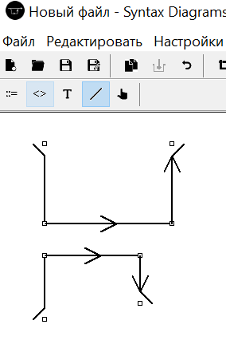

&#1058;&#1077;&#1089;&#1090; &#1087;&#1088;&#1086;&#1081;&#1076;&#1077;&#1085;
</td></tr></tbody></table>

<ol class="c23 lst-kix_list_4-1" start="10"><li class="c18"><h2 id="h.41mghml" style="display:inline">&#1058;&#1077;&#1089;&#1090;&#1080;&#1088;&#1086;&#1074;&#1072;&#1085;&#1080;&#1077; &#1092;&#1091;&#1085;&#1082;&#1094;&#1080;&#1086;&#1085;&#1072;&#1083;&#1072; &#1088;&#1077;&#1076;&#1072;&#1082;&#1090;&#1080;&#1088;&#1086;&#1074;&#1072;&#1085;&#1080;&#1103; &#1090;&#1077;&#1082;&#1089;&#1090;&#1086;&#1074;&#1099;&#1093; &#1092;&#1080;&#1075;&#1091;&#1088;.</h2></li></ol>

&#1058;&#1072;&#1073;&#1083;&#1080;&#1094;&#1072; 5.3 - &#1090;&#1077;&#1089;&#1090;&#1080;&#1088;&#1086;&#1074;&#1072;&#1085;&#1080;&#1077; &#1092;&#1091;&#1085;&#1082;&#1094;&#1080;&#1086;&#1085;&#1072;&#1083;&#1072; &#1088;&#1077;&#1076;&#1072;&#1082;&#1090;&#1080;&#1088;&#1086;&#1074;&#1072;&#1085;&#1080;&#1103; &#1090;&#1077;&#1082;&#1089;&#1090;&#1086;&#1074;&#1099;&#1093; &#1092;&#1080;&#1075;&#1091;&#1088;
<table class="c46"><tbody><tr class="c19"><td class="c5" colspan="1" rowspan="1">
&#1053;&#1086;&#1084;&#1077;&#1088;

&#1058;&#1077;&#1089;&#1090;&#1072;
</td><td class="c0" colspan="1" rowspan="1">
&#1058;&#1077;&#1089;&#1090;&#1080;&#1088;&#1091;&#1077;&#1084;&#1072;&#1103; &#1092;&#1091;&#1085;&#1082;&#1094;&#1080;&#1086;&#1085;&#1072;&#1083;&#1100;&#1085;&#1086;&#1089;&#1090;&#1100;
</td><td class="c39" colspan="1" rowspan="1">
&#1055;&#1086;&#1089;&#1083;&#1077;&#1076;&#1086;&#1074;&#1072;&#1090;&#1077;&#1083;&#1100;&#1085;&#1086;&#1089;&#1090;&#1100; &#1076;&#1077;&#1081;&#1089;&#1090;&#1074;&#1080;&#1081;
</td><td class="c22" colspan="1" rowspan="1">
&#1054;&#1078;&#1080;&#1076;&#1072;&#1077;&#1084;&#1099;&#1081; &#1088;&#1077;&#1079;&#1091;&#1083;&#1100;&#1090;&#1072;&#1090;
</td><td class="c10" colspan="1" rowspan="1">
&#1055;&#1086;&#1083;&#1091;&#1095;&#1077;&#1085;&#1085;&#1099;&#1081; &#1088;&#1077;&#1079;&#1091;&#1083;&#1100;&#1090;&#1072;&#1090;
</td></tr><tr class="c19"><td class="c5" colspan="1" rowspan="1">
0
</td><td class="c0" colspan="1" rowspan="1">
&#1055;&#1077;&#1088;&#1077;&#1084;&#1077;&#1097;&#1077;&#1085;&#1080;&#1077; &#1092;&#1080;&#1075;&#1091;&#1088;&#1099;
</td><td class="c39" colspan="1" rowspan="1">
1. &#1055;&#1077;&#1088;&#1077;&#1082;&#1083;&#1102;&#1095;&#1080;&#1090;&#1100; &#1088;&#1077;&#1078;&#1080;&#1084; &#1085;&#1072; &laquo;&#1056;&#1077;&#1078;&#1080;&#1084; &#1088;&#1077;&#1076;&#1072;&#1082;&#1090;&#1080;&#1088;&#1086;&#1074;&#1072;&#1085;&#1080;&#1103;&raquo;.

2. &#1053;&#1072;&#1074;&#1077;&#1089;&#1090;&#1080; &#1082;&#1091;&#1088;&#1089;&#1086;&#1088; &#1085;&#1072; &#1094;&#1077;&#1085;&#1090;&#1088; &#1092;&#1080;&#1075;&#1091;&#1088;&#1099;.

3. &#1047;&#1072;&#1078;&#1072;&#1090;&#1100; &#1083;&#1077;&#1074;&#1091;&#1102; &#1082;&#1085;&#1086;&#1087;&#1082;&#1091; &#1084;&#1099;&#1096;&#1080;.

4. &#1055;&#1077;&#1088;&#1077;&#1084;&#1077;&#1089;&#1090;&#1080;&#1090;&#1100; &#1082;&#1091;&#1088;&#1089;&#1086;&#1088;

5. &#1054;&#1090;&#1087;&#1091;&#1089;&#1090;&#1080;&#1090;&#1100; &#1082;&#1091;&#1088;&#1089;&#1086;&#1088;
</td><td class="c22" colspan="1" rowspan="1">
&#1060;&#1080;&#1075;&#1091;&#1088;&#1072; &#1087;&#1077;&#1088;&#1077;&#1084;&#1077;&#1089;&#1090;&#1080;&#1090;&#1089;&#1103;
</td><td class="c10" colspan="1" rowspan="1">
&#1058;&#1077;&#1089;&#1090; &#1087;&#1088;&#1086;&#1081;&#1076;&#1077;&#1085; 
</td></tr><tr class="c19"><td class="c5" colspan="1" rowspan="1">
1
</td><td class="c0" colspan="1" rowspan="2">
&#1048;&#1079;&#1084;&#1077;&#1085;&#1077;&#1085;&#1080;&#1077; &#1088;&#1072;&#1079;&#1084;&#1077;&#1088;&#1086;&#1074; &#1092;&#1080;&#1075;&#1091;&#1088;&#1099; &#1087;&#1091;&#1090;&#1077;&#1084; &#1087;&#1077;&#1088;&#1077;&#1090;&#1072;&#1089;&#1082;&#1080;&#1074;&#1072;&#1085;&#1080;&#1103; &#1074;&#1077;&#1088;&#1096;&#1080;&#1085;&#1099;
</td><td class="c39" colspan="1" rowspan="1">
1. &#1055;&#1077;&#1088;&#1077;&#1082;&#1083;&#1102;&#1095;&#1080;&#1090;&#1100; &#1088;&#1077;&#1078;&#1080;&#1084; &#1085;&#1072; &laquo;&#1056;&#1077;&#1078;&#1080;&#1084; &#1088;&#1077;&#1076;&#1072;&#1082;&#1090;&#1080;&#1088;&#1086;&#1074;&#1072;&#1085;&#1080;&#1103;&raquo;.

2. &#1053;&#1072;&#1074;&#1077;&#1089;&#1090;&#1080; &#1082;&#1091;&#1088;&#1089;&#1086;&#1088; &#1085;&#1072; &#1074;&#1077;&#1088;&#1096;&#1080;&#1085;&#1091; &#1092;&#1080;&#1075;&#1091;&#1088;&#1099;.

3. &#1047;&#1072;&#1078;&#1072;&#1090;&#1100; &#1083;&#1077;&#1074;&#1091;&#1102; &#1082;&#1085;&#1086;&#1087;&#1082;&#1091; &#1084;&#1099;&#1096;&#1080;.

4. &#1055;&#1077;&#1088;&#1077;&#1084;&#1077;&#1089;&#1090;&#1080;&#1090;&#1100; &#1082;&#1091;&#1088;&#1089;&#1086;&#1088;

5. &#1054;&#1090;&#1087;&#1091;&#1089;&#1090;&#1080;&#1090;&#1100; &#1082;&#1091;&#1088;&#1089;&#1086;&#1088;
</td><td class="c22" colspan="1" rowspan="1">
&#1055;&#1077;&#1088;&#1077;&#1084;&#1077;&#1089;&#1090;&#1080;&#1090;&#1089;&#1103; &#1074;&#1077;&#1088;&#1096;&#1080;&#1085;&#1072;, &#1080;, &#1089;&#1083;&#1077;&#1076;&#1086;&#1074;&#1072;&#1090;&#1077;&#1083;&#1100;&#1085;&#1086;, &#1080;&#1079;&#1084;&#1077;&#1085;&#1080;&#1090;&#1089;&#1103; &#1088;&#1072;&#1079;&#1084;&#1077;&#1088; &#1092;&#1080;&#1075;&#1091;&#1088;&#1099;
</td><td class="c10" colspan="1" rowspan="1">
&#1058;&#1077;&#1089;&#1090; &#1087;&#1088;&#1086;&#1081;&#1076;&#1077;&#1085;
</td></tr><tr class="c19"><td class="c5" colspan="1" rowspan="1">
2
</td><td class="c39" colspan="1" rowspan="1">
1. &#1055;&#1077;&#1088;&#1077;&#1082;&#1083;&#1102;&#1095;&#1080;&#1090;&#1100; &#1088;&#1077;&#1078;&#1080;&#1084; &#1085;&#1072; &laquo;&#1056;&#1077;&#1078;&#1080;&#1084; &#1088;&#1077;&#1076;&#1072;&#1082;&#1090;&#1080;&#1088;&#1086;&#1074;&#1072;&#1085;&#1080;&#1103;&raquo;.

2. &#1053;&#1072;&#1074;&#1077;&#1089;&#1090;&#1080; &#1082;&#1091;&#1088;&#1089;&#1086;&#1088; &#1085;&#1072; &#1074;&#1077;&#1088;&#1096;&#1080;&#1085;&#1091; &#1092;&#1080;&#1075;&#1091;&#1088;&#1099;.

3. &#1047;&#1072;&#1078;&#1072;&#1090;&#1100; &#1083;&#1077;&#1074;&#1091;&#1102; &#1082;&#1085;&#1086;&#1087;&#1082;&#1091; &#1084;&#1099;&#1096;&#1080;

4. &#1055;&#1077;&#1088;&#1077;&#1084;&#1077;&#1089;&#1090;&#1080;&#1090;&#1100; &#1082;&#1091;&#1088;&#1089;&#1086;&#1088;, &#1091;&#1084;&#1077;&#1085;&#1100;&#1096;&#1072;&#1103; &#1092;&#1080;&#1075;&#1091;&#1088;&#1091; &#1076;&#1086; &#1090;&#1072;&#1082;&#1086;&#1075;&#1086; &#1091;&#1088;&#1086;&#1074;&#1085;&#1103;, &#1095;&#1090;&#1086;&#1073;&#1099; &#1088;&#1072;&#1079;&#1084;&#1077;&#1088;&#1099; &#1092;&#1080;&#1075;&#1091;&#1088;&#1099; &#1073;&#1099;&#1083;&#1080; &#1084;&#1077;&#1085;&#1100;&#1096;&#1077; &#1088;&#1072;&#1079;&#1084;&#1077;&#1088;&#1072; &#1090;&#1077;&#1082;&#1089;&#1090;&#1072;

5. &#1054;&#1090;&#1087;&#1091;&#1089;&#1090;&#1080;&#1090;&#1100; &#1082;&#1091;&#1088;&#1089;&#1086;&#1088;
</td><td class="c22" colspan="1" rowspan="1">
&#1056;&#1072;&#1079;&#1084;&#1077;&#1088; &#1092;&#1080;&#1075;&#1091;&#1088;&#1099; &#1073;&#1091;&#1076;&#1077;&#1090; &#1080;&#1079;&#1084;&#1077;&#1085;&#1103;&#1090;&#1100;&#1089;&#1103;, &#1087;&#1088;&#1080;&#1095;&#1077;&#1084; &#1085;&#1077; &#1076;&#1086;&#1087;&#1091;&#1089;&#1090;&#1080;&#1090;&#1089;&#1103;, &#1095;&#1090;&#1086;&#1073;&#1099; &#1090;&#1077;&#1082;&#1089;&#1090; &#1074;&#1099;&#1093;&#1086;&#1076;&#1080;&#1083; &#1079;&#1072; &#1088;&#1072;&#1084;&#1082;&#1080; 
</td><td class="c10" colspan="1" rowspan="1">
&#1058;&#1077;&#1089;&#1090; &#1087;&#1088;&#1086;&#1081;&#1076;&#1077;&#1085;
</td></tr><tr class="c19"><td class="c5" colspan="1" rowspan="1">
3
</td><td class="c0" colspan="1" rowspan="2">
&#1055;&#1077;&#1088;&#1077;&#1084;&#1077;&#1097;&#1077;&#1085;&#1080;&#1077; &#1089;&#1090;&#1086;&#1088;&#1086;&#1085;&#1099; &#1092;&#1080;&#1075;&#1091;&#1088;&#1099;
</td><td class="c39" colspan="1" rowspan="1">
1. &#1055;&#1077;&#1088;&#1077;&#1082;&#1083;&#1102;&#1095;&#1080;&#1090;&#1100; &#1088;&#1077;&#1078;&#1080;&#1084; &#1085;&#1072; &laquo;&#1056;&#1077;&#1078;&#1080;&#1084; &#1088;&#1077;&#1076;&#1072;&#1082;&#1090;&#1080;&#1088;&#1086;&#1074;&#1072;&#1085;&#1080;&#1103;&raquo;.

2. &#1053;&#1072;&#1074;&#1077;&#1089;&#1090;&#1080; &#1082;&#1091;&#1088;&#1089;&#1086;&#1088; &#1085;&#1072; &#1089;&#1090;&#1086;&#1088;&#1086;&#1085;&#1091; &#1092;&#1080;&#1075;&#1091;&#1088;&#1099;.

3. &#1047;&#1072;&#1078;&#1072;&#1090;&#1100; &#1083;&#1077;&#1074;&#1091;&#1102; &#1082;&#1085;&#1086;&#1087;&#1082;&#1091; &#1084;&#1099;&#1096;&#1080;, &#1091;&#1084;&#1077;&#1085;&#1100;&#1096;&#1072;&#1103; &#1092;&#1080;&#1075;&#1091;&#1088;&#1091; &#1076;&#1086; &#1090;&#1072;&#1082;&#1086;&#1075;&#1086; &#1091;&#1088;&#1086;&#1074;&#1085;&#1103;, &#1095;&#1090;&#1086;&#1073;&#1099; &#1088;&#1072;&#1079;&#1084;&#1077;&#1088;&#1099; &#1092;&#1080;&#1075;&#1091;&#1088;&#1099; &#1073;&#1099;&#1083;&#1080; &#1084;&#1077;&#1085;&#1100;&#1096;&#1077; &#1088;&#1072;&#1079;&#1084;&#1077;&#1088;&#1072; &#1090;&#1077;&#1082;&#1089;&#1090;&#1072;

4. &#1055;&#1077;&#1088;&#1077;&#1084;&#1077;&#1089;&#1090;&#1080;&#1090;&#1100; &#1082;&#1091;&#1088;&#1089;&#1086;&#1088;

5. &#1054;&#1090;&#1087;&#1091;&#1089;&#1090;&#1080;&#1090;&#1100; &#1082;&#1091;&#1088;&#1089;&#1086;&#1088;
</td><td class="c22" colspan="1" rowspan="1">
&#1057;&#1090;&#1086;&#1088;&#1086;&#1085;&#1072; &#1087;&#1077;&#1088;&#1077;&#1076;&#1074;&#1080;&#1075;&#1072;&#1077;&#1090;&#1089;&#1103;
</td><td class="c10" colspan="1" rowspan="1">
&#1058;&#1077;&#1089;&#1090; &#1087;&#1088;&#1086;&#1081;&#1076;&#1077;&#1085;
</td></tr><tr class="c19"><td class="c5" colspan="1" rowspan="1">
4
</td><td class="c39" colspan="1" rowspan="1">
1. &#1055;&#1077;&#1088;&#1077;&#1082;&#1083;&#1102;&#1095;&#1080;&#1090;&#1100; &#1088;&#1077;&#1078;&#1080;&#1084; &#1085;&#1072; &laquo;&#1056;&#1077;&#1078;&#1080;&#1084; &#1088;&#1077;&#1076;&#1072;&#1082;&#1090;&#1080;&#1088;&#1086;&#1074;&#1072;&#1085;&#1080;&#1103;&raquo;.

2. &#1053;&#1072;&#1074;&#1077;&#1089;&#1090;&#1080; &#1082;&#1091;&#1088;&#1089;&#1086;&#1088; &#1085;&#1072; &#1089;&#1090;&#1086;&#1088;&#1086;&#1085;&#1091; &#1092;&#1080;&#1075;&#1091;&#1088;&#1099;.

3. &#1047;&#1072;&#1078;&#1072;&#1090;&#1100; &#1083;&#1077;&#1074;&#1091;&#1102; &#1082;&#1085;&#1086;&#1087;&#1082;&#1091; &#1084;&#1099;&#1096;&#1080;

4. &#1055;&#1077;&#1088;&#1077;&#1084;&#1077;&#1089;&#1090;&#1080;&#1090;&#1100; &#1082;&#1091;&#1088;&#1089;&#1086;&#1088;, &#1091;&#1084;&#1077;&#1085;&#1100;&#1096;&#1072;&#1103; &#1092;&#1080;&#1075;&#1091;&#1088;&#1091; &#1076;&#1086; &#1090;&#1072;&#1082;&#1086;&#1075;&#1086; &#1091;&#1088;&#1086;&#1074;&#1085;&#1103;, &#1095;&#1090;&#1086;&#1073;&#1099; &#1088;&#1072;&#1079;&#1084;&#1077;&#1088;&#1099; &#1092;&#1080;&#1075;&#1091;&#1088;&#1099; &#1073;&#1099;&#1083;&#1080; &#1084;&#1077;&#1085;&#1100;&#1096;&#1077; &#1088;&#1072;&#1079;&#1084;&#1077;&#1088;&#1072; &#1090;&#1077;&#1082;&#1089;&#1090;&#1072;

5. &#1054;&#1090;&#1087;&#1091;&#1089;&#1090;&#1080;&#1090;&#1100; &#1082;&#1091;&#1088;&#1089;&#1086;&#1088;
</td><td class="c22" colspan="1" rowspan="1">
&#1057;&#1090;&#1086;&#1088;&#1086;&#1085;&#1072; &#1087;&#1088;&#1077;&#1076;&#1074;&#1080;&#1075;&#1072;&#1077;&#1090;&#1089;&#1103;, &#1087;&#1088;&#1080;&#1095;&#1077;&#1084; &#1085;&#1077; &#1076;&#1086;&#1087;&#1091;&#1089;&#1090;&#1080;&#1090;&#1089;&#1103;, &#1095;&#1090;&#1086;&#1073;&#1099; &#1090;&#1077;&#1082;&#1089;&#1090; &#1074;&#1099;&#1093;&#1086;&#1076;&#1080;&#1083; &#1079;&#1072; &#1088;&#1072;&#1084;&#1082;&#1080;
</td><td class="c10" colspan="1" rowspan="1">

</td></tr><tr class="c19"><td class="c5" colspan="1" rowspan="1">
5
</td><td class="c0" colspan="1" rowspan="1">
&#1048;&#1079;&#1084;&#1077;&#1085;&#1077;&#1085;&#1080;&#1077; &#1090;&#1077;&#1082;&#1089;&#1090;&#1072; &#1074;&#1085;&#1091;&#1090;&#1088;&#1080; &#1092;&#1080;&#1075;&#1091;&#1088;&#1099;
</td><td class="c39" colspan="1" rowspan="1">
1. &#1055;&#1077;&#1088;&#1077;&#1082;&#1083;&#1102;&#1095;&#1080;&#1090;&#1100; &#1088;&#1077;&#1078;&#1080;&#1084; &#1085;&#1072; &laquo;&#1056;&#1077;&#1078;&#1080;&#1084; &#1088;&#1077;&#1076;&#1072;&#1082;&#1090;&#1080;&#1088;&#1086;&#1074;&#1072;&#1085;&#1080;&#1103;&raquo;

2. &#1050;&#1083;&#1080;&#1082;&#1085;&#1091;&#1090;&#1100; &#1087;&#1086; &#1090;&#1077;&#1082;&#1089;&#1090;&#1086;&#1074;&#1086;&#1081; &#1092;&#1080;&#1075;&#1091;&#1088;&#1077;. 

3. &#1048;&#1079;&#1084;&#1077;&#1085;&#1080;&#1090;&#1100; &#1089;&#1086;&#1076;&#1077;&#1088;&#1078;&#1080;&#1084;&#1086;&#1077; &#1090;&#1077;&#1082;&#1089;&#1090;&#1086;&#1074;&#1086;&#1075;&#1086; &#1087;&#1086;&#1083;&#1103;

4. &#1053;&#1072;&#1078;&#1072;&#1090;&#1100; &#1082;&#1083;&#1072;&#1074;&#1080;&#1096;&#1091; &laquo;Enter&raquo;
</td><td class="c22" colspan="1" rowspan="1">
&#1058;&#1077;&#1082;&#1089;&#1090; &#1092;&#1080;&#1075;&#1091;&#1088;&#1099; &#1080;&#1079;&#1084;&#1077;&#1085;&#1080;&#1090;&#1089;&#1103;
</td><td class="c10" colspan="1" rowspan="1">
&#1058;&#1077;&#1089;&#1090; &#1087;&#1088;&#1086;&#1081;&#1076;&#1077;&#1085;
</td></tr><tr class="c19"><td class="c5" colspan="1" rowspan="1">
6
</td><td class="c0" colspan="1" rowspan="1">
&#1059;&#1076;&#1072;&#1083;&#1077;&#1085;&#1080;&#1077; &#1092;&#1080;&#1075;&#1091;&#1088;&#1099;
</td><td class="c39" colspan="1" rowspan="1">
1. &#1055;&#1077;&#1088;&#1077;&#1082;&#1083;&#1102;&#1095;&#1080;&#1090;&#1100; &#1088;&#1077;&#1078;&#1080;&#1084; &#1085;&#1072; &laquo;&#1056;&#1077;&#1078;&#1080;&#1084; &#1088;&#1077;&#1076;&#1072;&#1082;&#1090;&#1080;&#1088;&#1086;&#1074;&#1072;&#1085;&#1080;&#1103;&raquo;

2. &#1050;&#1083;&#1080;&#1082;&#1085;&#1091;&#1090;&#1100; &#1087;&#1086; &#1090;&#1077;&#1082;&#1089;&#1090;&#1086;&#1074;&#1086;&#1081; &#1092;&#1080;&#1075;&#1091;&#1088;&#1077;. 

3. &#1053;&#1072;&#1078;&#1072;&#1090;&#1100; &#1082;&#1083;&#1072;&#1074;&#1080;&#1096;&#1091; &laquo;Delete&raquo;
</td><td class="c22" colspan="1" rowspan="1">
&#1060;&#1080;&#1075;&#1091;&#1088;&#1072; &#1091;&#1076;&#1072;&#1083;&#1080;&#1090;&#1089;&#1103;
</td><td class="c10" colspan="1" rowspan="1">
&#1058;&#1077;&#1089;&#1090; &#1087;&#1088;&#1086;&#1081;&#1076;&#1077;&#1085;
</td></tr></tbody></table>

<ol class="c23 lst-kix_list_4-1" start="11"><li class="c18"><h2 id="h.2grqrue" style="display:inline">&#1058;&#1077;&#1089;&#1090;&#1080;&#1088;&#1086;&#1074;&#1072;&#1085;&#1080;&#1077; &#1092;&#1091;&#1085;&#1082;&#1094;&#1080;&#1086;&#1085;&#1072;&#1083;&#1072; &#1088;&#1077;&#1076;&#1072;&#1082;&#1090;&#1080;&#1088;&#1086;&#1074;&#1072;&#1085;&#1080;&#1103; &#1083;&#1080;&#1085;&#1080;&#1081;</h2></li></ol>

&#1058;&#1072;&#1073;&#1083;&#1080;&#1094;&#1072; 5.4 - &#1090;&#1077;&#1089;&#1090;&#1080;&#1088;&#1086;&#1074;&#1072;&#1085;&#1080;&#1077; &#1092;&#1091;&#1085;&#1082;&#1094;&#1080;&#1086;&#1085;&#1072;&#1083;&#1072; &#1088;&#1077;&#1076;&#1072;&#1082;&#1090;&#1080;&#1088;&#1086;&#1074;&#1072;&#1085;&#1080;&#1103; &#1083;&#1080;&#1085;&#1080;&#1081;
<table class="c46"><tbody><tr class="c19"><td class="c5" colspan="1" rowspan="1">
&#1053;&#1086;&#1084;&#1077;&#1088;

&#1058;&#1077;&#1089;&#1090;&#1072;
</td><td class="c0" colspan="1" rowspan="1">
&#1058;&#1077;&#1089;&#1090;&#1080;&#1088;&#1091;&#1077;&#1084;&#1072;&#1103; &#1092;&#1091;&#1085;&#1082;&#1094;&#1080;&#1086;&#1085;&#1072;&#1083;&#1100;&#1085;&#1086;&#1089;&#1090;&#1100;
</td><td class="c39" colspan="1" rowspan="1">
&#1055;&#1086;&#1089;&#1083;&#1077;&#1076;&#1086;&#1074;&#1072;&#1090;&#1077;&#1083;&#1100;&#1085;&#1086;&#1089;&#1090;&#1100; &#1076;&#1077;&#1081;&#1089;&#1090;&#1074;&#1080;&#1081;
</td><td class="c22" colspan="1" rowspan="1">
&#1054;&#1078;&#1080;&#1076;&#1072;&#1077;&#1084;&#1099;&#1081; &#1088;&#1077;&#1079;&#1091;&#1083;&#1100;&#1090;&#1072;&#1090;
</td><td class="c10" colspan="1" rowspan="1">
&#1055;&#1086;&#1083;&#1091;&#1095;&#1077;&#1085;&#1085;&#1099;&#1081; &#1088;&#1077;&#1079;&#1091;&#1083;&#1100;&#1090;&#1072;&#1090;
</td></tr><tr class="c19"><td class="c5" colspan="1" rowspan="1">
0
</td><td class="c0" colspan="1" rowspan="1">
&#1055;&#1077;&#1088;&#1077;&#1084;&#1077;&#1097;&#1077;&#1085;&#1080;&#1077; &#1074;&#1089;&#1077;&#1081; &#1083;&#1080;&#1085;&#1080;&#1080;
</td><td class="c39" colspan="1" rowspan="1">
1. &#1055;&#1077;&#1088;&#1077;&#1082;&#1083;&#1102;&#1095;&#1080;&#1090;&#1100; &#1088;&#1077;&#1078;&#1080;&#1084; &#1085;&#1072; &laquo;&#1056;&#1077;&#1078;&#1080;&#1084; &#1088;&#1077;&#1076;&#1072;&#1082;&#1090;&#1080;&#1088;&#1086;&#1074;&#1072;&#1085;&#1080;&#1103;&raquo;.

2. &#1053;&#1072;&#1074;&#1077;&#1089;&#1090;&#1080; &#1082;&#1091;&#1088;&#1089;&#1086;&#1088; &#1085;&#1072; &#1083;&#1080;&#1085;&#1080;&#1102; (&#1085;&#1077; &#1085;&#1072; &#1074;&#1077;&#1088;&#1096;&#1080;&#1085;&#1091;)

3. &#1047;&#1072;&#1078;&#1072;&#1090;&#1100; &#1083;&#1077;&#1074;&#1091;&#1102; &#1082;&#1085;&#1086;&#1087;&#1082;&#1091; &#1084;&#1099;&#1096;&#1080;

4. &#1055;&#1077;&#1088;&#1077;&#1084;&#1077;&#1089;&#1090;&#1080;&#1090;&#1100; &#1082;&#1091;&#1088;&#1089;&#1086;&#1088;

5. &#1054;&#1090;&#1087;&#1091;&#1089;&#1090;&#1080;&#1090;&#1100; &#1082;&#1091;&#1088;&#1089;&#1086;&#1088;
</td><td class="c22" colspan="1" rowspan="1">
&#1051;&#1080;&#1085;&#1080;&#1103; &#1087;&#1077;&#1088;&#1077;&#1084;&#1077;&#1096;&#1072;&#1077;&#1090;&#1089;&#1103;
</td><td class="c10" colspan="1" rowspan="1">
&#1058;&#1077;&#1089;&#1090; &#1087;&#1088;&#1086;&#1081;&#1076;&#1077;&#1085;
</td></tr><tr class="c19"><td class="c5" colspan="1" rowspan="1">
1
</td><td class="c0" colspan="1" rowspan="1">
&#1055;&#1077;&#1088;&#1077;&#1084;&#1077;&#1097;&#1077;&#1085;&#1080;&#1077; &#1086;&#1090;&#1076;&#1077;&#1083;&#1100;&#1085;&#1086;&#1081; &#1090;&#1086;&#1095;&#1082;&#1080; &#1083;&#1080;&#1085;&#1080;&#1080;
</td><td class="c39" colspan="1" rowspan="1">
1. &#1055;&#1077;&#1088;&#1077;&#1082;&#1083;&#1102;&#1095;&#1080;&#1090;&#1100; &#1088;&#1077;&#1078;&#1080;&#1084; &#1085;&#1072; &laquo;&#1056;&#1077;&#1078;&#1080;&#1084; &#1088;&#1077;&#1076;&#1072;&#1082;&#1090;&#1080;&#1088;&#1086;&#1074;&#1072;&#1085;&#1080;&#1103;&raquo;.

2. &#1053;&#1072;&#1074;&#1077;&#1089;&#1090;&#1080; &#1082;&#1091;&#1088;&#1089;&#1086;&#1088; &#1085;&#1072; &#1083;&#1080;&#1085;&#1080;&#1102; (&#1085;&#1077; &#1085;&#1072; &#1074;&#1077;&#1088;&#1096;&#1080;&#1085;&#1091;)

3. &#1047;&#1072;&#1078;&#1072;&#1090;&#1100; &#1083;&#1077;&#1074;&#1091;&#1102; &#1082;&#1085;&#1086;&#1087;&#1082;&#1091; &#1084;&#1099;&#1096;&#1080;

4. &#1055;&#1077;&#1088;&#1077;&#1084;&#1077;&#1089;&#1090;&#1080;&#1090;&#1100; &#1082;&#1091;&#1088;&#1089;&#1086;&#1088;

5. &#1054;&#1090;&#1087;&#1091;&#1089;&#1090;&#1080;&#1090;&#1100; &#1082;&#1091;&#1088;&#1089;&#1086;&#1088;
</td><td class="c22" colspan="1" rowspan="1">
&#1055;&#1077;&#1088;&#1077;&#1084;&#1077;&#1089;&#1090;&#1080;&#1090;&#1089;&#1103; &#1090;&#1086;&#1095;&#1082;&#1072;, &#1072; &#1074;&#1084;&#1077;&#1089;&#1090;&#1077; &#1089; &#1085;&#1077;&#1081; &#1089;&#1084;&#1077;&#1078;&#1085;&#1099;&#1077; &#1090;&#1086;&#1095;&#1082;&#1080;
</td><td class="c10" colspan="1" rowspan="1">
&#1058;&#1077;&#1089;&#1090; &#1087;&#1088;&#1086;&#1081;&#1076;&#1077;&#1085;
</td></tr><tr class="c19"><td class="c5" colspan="1" rowspan="1">
2
</td><td class="c0" colspan="1" rowspan="1">
&#1059;&#1076;&#1072;&#1083;&#1077;&#1085;&#1080;&#1077; &#1083;&#1080;&#1085;&#1080;&#1080;
</td><td class="c39" colspan="1" rowspan="1">
1. &#1055;&#1077;&#1088;&#1077;&#1082;&#1083;&#1102;&#1095;&#1080;&#1090;&#1100; &#1088;&#1077;&#1078;&#1080;&#1084; &#1085;&#1072; &laquo;&#1056;&#1077;&#1078;&#1080;&#1084; &#1088;&#1077;&#1076;&#1072;&#1082;&#1090;&#1080;&#1088;&#1086;&#1074;&#1072;&#1085;&#1080;&#1103;&raquo;

2. &#1050;&#1083;&#1080;&#1082;&#1085;&#1091;&#1090;&#1100; &#1087;&#1086; &#1083;&#1080;&#1085;&#1080;&#1080;. 

3. &#1053;&#1072;&#1078;&#1072;&#1090;&#1100; &#1082;&#1083;&#1072;&#1074;&#1080;&#1096;&#1091; &laquo;Delete&raquo;
</td><td class="c22" colspan="1" rowspan="1">
&#1051;&#1080;&#1085;&#1080;&#1103; &#1091;&#1076;&#1072;&#1083;&#1080;&#1090;&#1089;&#1103;
</td><td class="c10" colspan="1" rowspan="1">
&#1058;&#1077;&#1089;&#1090; &#1087;&#1088;&#1086;&#1081;&#1076;&#1077;&#1085;
</td></tr><tr class="c19"><td class="c5" colspan="1" rowspan="1">
3
</td><td class="c0" colspan="1" rowspan="3">
&#1050;&#1086;&#1087;&#1080;&#1088;&#1086;&#1074;&#1072;&#1085;&#1080;&#1077; &#1080; &#1074;&#1089;&#1090;&#1072;&#1074;&#1082;&#1072; &#1092;&#1080;&#1075;&#1091;&#1088;&#1099;
</td><td class="c39" colspan="1" rowspan="1">
1. &#1053;&#1072;&#1088;&#1080;&#1089;&#1086;&#1074;&#1072;&#1090;&#1100; &#1092;&#1080;&#1075;&#1091;&#1088;&#1091;

2. &#1057;&#1082;&#1086;&#1087;&#1080;&#1088;&#1086;&#1074;&#1072;&#1090;&#1100; &#1092;&#1080;&#1075;&#1091;&#1088;&#1091;

3. &#1042;&#1089;&#1090;&#1072;&#1074;&#1080;&#1090;&#1100; &#1092;&#1080;&#1075;&#1091;&#1088;&#1091;
</td><td class="c22" colspan="1" rowspan="1">
&#1060;&#1080;&#1075;&#1091;&#1088;&#1072; &#1089;&#1082;&#1086;&#1087;&#1080;&#1088;&#1086;&#1074;&#1072;&#1083;&#1072;&#1089;&#1100;
</td><td class="c10" colspan="1" rowspan="1">
&#1058;&#1077;&#1089;&#1090; &#1087;&#1088;&#1086;&#1081;&#1076;&#1077;&#1085;
</td></tr><tr class="c19"><td class="c5" colspan="1" rowspan="1">
4
</td><td class="c39" colspan="1" rowspan="1">
1. &#1053;&#1072;&#1088;&#1080;&#1089;&#1086;&#1074;&#1072;&#1090;&#1100; &#1092;&#1080;&#1075;&#1091;&#1088;&#1091;

2. &#1057;&#1082;&#1086;&#1087;&#1080;&#1088;&#1086;&#1074;&#1072;&#1090;&#1100; &#1092;&#1080;&#1075;&#1091;&#1088;&#1091;.

3. &#1042;&#1089;&#1090;&#1072;&#1074;&#1080;&#1090;&#1100; &#1092;&#1080;&#1075;&#1091;&#1088;&#1091;.

4. &#1042;&#1089;&#1090;&#1072;&#1074;&#1080;&#1090;&#1100; &#1092;&#1080;&#1075;&#1091;&#1088;&#1091;.

5. &#1042;&#1089;&#1090;&#1072;&#1074;&#1080;&#1090;&#1100; &#1092;&#1080;&#1075;&#1091;&#1088;&#1091;.

6. &#1057;&#1082;&#1086;&#1087;&#1080;&#1088;&#1086;&#1074;&#1072;&#1090;&#1100; &#1092;&#1080;&#1075;&#1091;&#1088;&#1091;.

7. &#1042;&#1089;&#1090;&#1072;&#1074;&#1080;&#1090;&#1100; &#1092;&#1080;&#1075;&#1091;&#1088;&#1091;
</td><td class="c22" colspan="1" rowspan="1">
&#1050;&#1086;&#1087;&#1080;&#1088;&#1086;&#1074;&#1072;&#1085;&#1080;&#1077; &#1091;&#1089;&#1087;&#1077;&#1096;&#1085;&#1086; &#1087;&#1088;&#1086;&#1080;&#1079;&#1086;&#1096;&#1083;&#1086;, &#1087;&#1091;&#1085;&#1082;&#1090;&#1099; 4 &#1080; 5 &#1085;&#1077; &#1076;&#1072;&#1083;&#1080; &#1088;&#1077;&#1079;&#1091;&#1083;&#1100;&#1090;&#1072;&#1090;&#1086;&#1074;
</td><td class="c10" colspan="1" rowspan="1">
&#1058;&#1077;&#1089;&#1090; &#1087;&#1088;&#1086;&#1081;&#1076;&#1077;&#1085;
</td></tr><tr class="c19"><td class="c5" colspan="1" rowspan="1">
5
</td><td class="c39" colspan="1" rowspan="1">
1. &#1053;&#1072;&#1088;&#1080;&#1089;&#1086;&#1074;&#1072;&#1090;&#1100; &#1092;&#1080;&#1075;&#1091;&#1088;&#1091;

2. &#1042;&#1089;&#1090;&#1072;&#1074;&#1080;&#1090;&#1100; &#1092;&#1080;&#1075;&#1091;&#1088;&#1091;

3. &#1057;&#1082;&#1086;&#1087;&#1080;&#1088;&#1086;&#1074;&#1072;&#1090;&#1100; &#1092;&#1080;&#1075;&#1091;&#1088;&#1091;

4. &#1042;&#1089;&#1090;&#1072;&#1074;&#1080;&#1090;&#1100; &#1092;&#1080;&#1075;&#1091;&#1088;&#1091;
</td><td class="c22" colspan="1" rowspan="1">
&#1050;&#1086;&#1087;&#1080;&#1088;&#1086;&#1074;&#1072;&#1085;&#1080;&#1077; &#1091;&#1089;&#1087;&#1077;&#1096;&#1085;&#1086; &#1087;&#1088;&#1086;&#1080;&#1079;&#1086;&#1096;&#1083;&#1086;, &#1087;. 2 &#1085;&#1077; &#1076;&#1072;&#1083; &#1088;&#1077;&#1079;&#1091;&#1083;&#1100;&#1090;&#1072;&#1090;&#1086;&#1074;
</td><td class="c10" colspan="1" rowspan="1">
&#1058;&#1077;&#1089;&#1090; &#1087;&#1088;&#1086;&#1081;&#1076;&#1077;&#1085;
</td></tr></tbody></table>

<ol class="c23 lst-kix_list_4-1" start="12"><li class="c18"><h2 id="h.vx1227" style="display:inline">&#1058;&#1077;&#1089;&#1090;&#1080;&#1088;&#1086;&#1074;&#1072;&#1085;&#1080;&#1077; &#1092;&#1091;&#1085;&#1082;&#1094;&#1080;&#1086;&#1085;&#1072;&#1083;&#1072; &#1080;&#1079;&#1084;&#1077;&#1085;&#1077;&#1085;&#1080;&#1103; &#1088;&#1072;&#1079;&#1084;&#1077;&#1088;&#1072; &#1087;&#1086;&#1083;&#1086;&#1090;&#1085;&#1072;</h2></li></ol>

&#1058;&#1072;&#1073;&#1083;&#1080;&#1094;&#1072; 5.5 - &#1090;&#1077;&#1089;&#1090;&#1080;&#1088;&#1086;&#1074;&#1072;&#1085;&#1080;&#1077; &#1092;&#1091;&#1085;&#1082;&#1094;&#1080;&#1086;&#1085;&#1072;&#1083;&#1072; &#1080;&#1079;&#1084;&#1077;&#1085;&#1077;&#1085;&#1080;&#1103; &#1088;&#1072;&#1079;&#1084;&#1077;&#1088;&#1086;&#1074; &#1087;&#1086;&#1083;&#1086;&#1090;&#1085;&#1072;
<table class="c46"><tbody><tr class="c19"><td class="c5" colspan="1" rowspan="1">
&#1053;&#1086;&#1084;&#1077;&#1088;

&#1058;&#1077;&#1089;&#1090;&#1072;
</td><td class="c3" colspan="1" rowspan="1">
&#1058;&#1077;&#1089;&#1090;&#1080;&#1088;&#1091;&#1077;&#1084;&#1072;&#1103; &#1092;&#1091;&#1085;&#1082;&#1094;&#1080;&#1086;&#1085;&#1072;&#1083;&#1100;&#1085;&#1086;&#1089;&#1090;&#1100;
</td><td class="c64" colspan="1" rowspan="1">
&#1055;&#1086;&#1089;&#1083;&#1077;&#1076;&#1086;&#1074;&#1072;&#1090;&#1077;&#1083;&#1100;&#1085;&#1086;&#1089;&#1090;&#1100; &#1076;&#1077;&#1081;&#1089;&#1090;&#1074;&#1080;&#1081;
</td><td class="c44" colspan="1" rowspan="1">
&#1054;&#1078;&#1080;&#1076;&#1072;&#1077;&#1084;&#1099;&#1081; &#1088;&#1077;&#1079;&#1091;&#1083;&#1100;&#1090;&#1072;&#1090;
</td><td class="c76" colspan="1" rowspan="1">
&#1055;&#1086;&#1083;&#1091;&#1095;&#1077;&#1085;&#1085;&#1099;&#1081; &#1088;&#1077;&#1079;&#1091;&#1083;&#1100;&#1090;&#1072;&#1090;
</td></tr><tr class="c19"><td class="c5" colspan="1" rowspan="1">
0
</td><td class="c3" colspan="1" rowspan="2">
&#1048;&#1079;&#1084;&#1077;&#1085;&#1077;&#1085;&#1080;&#1077; &#1088;&#1072;&#1079;&#1084;&#1077;&#1088;&#1072; &#1095;&#1077;&#1088;&#1077;&#1079; &#1092;&#1086;&#1088;&#1084;&#1091; &#1088;&#1077;&#1076;&#1072;&#1082;&#1090;&#1080;&#1088;&#1086;&#1074;&#1072;&#1085;&#1080;&#1103; &#1088;&#1072;&#1079;&#1084;&#1077;&#1088;&#1072; &#1087;&#1086;&#1090;&#1086;&#1085;&#1072;
</td><td class="c64" colspan="1" rowspan="1">
1. &#1042; &#1084;&#1077;&#1085;&#1102; &#1074;&#1099;&#1073;&#1088;&#1072;&#1090;&#1100; &#1053;&#1072;&#1089;&#1090;&#1088;&#1086;&#1081;&#1082;&#1072; &ndash; &#1056;&#1072;&#1079;&#1084;&#1077;&#1088; &#1093;&#1086;&#1083;&#1089;&#1090;&#1072;

2. &#1042;&#1074;&#1077;&#1089;&#1090;&#1080; &#1074;&#1072;&#1083;&#1080;&#1076;&#1085;&#1099;&#1077; &#1088;&#1072;&#1079;&#1084;&#1077;&#1088;&#1099;
</td><td class="c44" colspan="1" rowspan="1">
&#1056;&#1072;&#1079;&#1084;&#1077;&#1088; &#1087;&#1086;&#1083;&#1086;&#1090;&#1085;&#1072; &#1087;&#1086;&#1084;&#1077;&#1085;&#1103;&#1077;&#1090;&#1089;&#1103;
</td><td class="c76" colspan="1" rowspan="1">
&#1058;&#1077;&#1089;&#1090; &#1087;&#1088;&#1086;&#1081;&#1076;&#1077;&#1085;
</td></tr><tr class="c19"><td class="c5" colspan="1" rowspan="1">
1
</td><td class="c64" colspan="1" rowspan="1">
1. &#1042; &#1084;&#1077;&#1085;&#1102; &#1074;&#1099;&#1073;&#1088;&#1072;&#1090;&#1100; &#1053;&#1072;&#1089;&#1090;&#1088;&#1086;&#1081;&#1082;&#1072; &ndash; &#1056;&#1072;&#1079;&#1084;&#1077;&#1088; &#1093;&#1086;&#1083;&#1089;&#1090;&#1072;

2. &#1055;&#1086;&#1087;&#1088;&#1086;&#1073;&#1086;&#1074;&#1072;&#1090;&#1100; &#1074;&#1074;&#1077;&#1089;&#1090;&#1080; &#1085;&#1077;&#1074;&#1072;&#1083;&#1080;&#1076;&#1085;&#1099;&#1077; &#1088;&#1072;&#1079;&#1084;&#1077;&#1088;&#1099; (&#1054;&#1090;&#1088;&#1080;&#1094;&#1072;&#1090;&#1077;&#1083;&#1100;&#1085;&#1099;&#1077; &#1088;&#1072;&#1079;&#1084;&#1077;&#1088;&#1099;/&#1073;&#1091;&#1082;&#1074;&#1099;/&#1089;&#1080;&#1084;&#1074;&#1086;&#1083;&#1099;)
</td><td class="c44" colspan="1" rowspan="1">
&#1055;&#1086;&#1103;&#1074;&#1080;&#1090;&#1089;&#1103; &#1087;&#1088;&#1077;&#1076;&#1091;&#1087;&#1088;&#1077;&#1078;&#1076;&#1077;&#1085;&#1080;&#1077;
</td><td class="c76" colspan="1" rowspan="1">
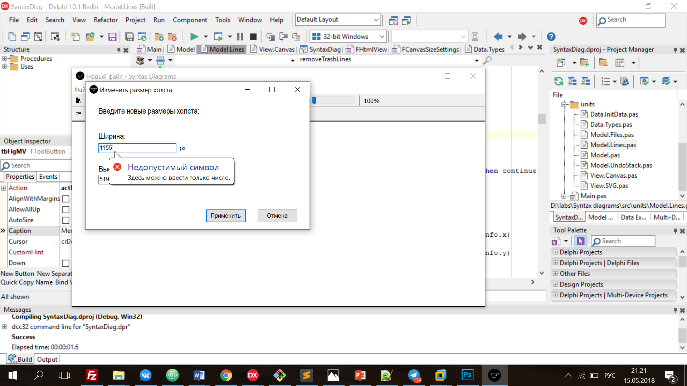

&#1058;&#1077;&#1089;&#1090; &#1087;&#1088;&#1086;&#1081;&#1076;&#1077;&#1085;
</td></tr><tr class="c19"><td class="c5" colspan="1" rowspan="1">
2
</td><td class="c3" colspan="1" rowspan="1">
&#1053;&#1072;&#1078;&#1072;&#1090;&#1080;&#1077; &laquo;&#1054;&#1090;&#1084;&#1077;&#1085;&#1072; &#1087;&#1086;&#1089;&#1083;&#1077; &#1080;&#1079;&#1084;&#1077;&#1085;&#1077;&#1085;&#1080;&#1103; &#1076;&#1072;&#1085;&#1085;&#1099;&#1093;&raquo;
</td><td class="c64" colspan="1" rowspan="1">
1. &#1042; &#1084;&#1077;&#1085;&#1102; &#1074;&#1099;&#1073;&#1088;&#1072;&#1090;&#1100; &#1053;&#1072;&#1089;&#1090;&#1088;&#1086;&#1081;&#1082;&#1072; &ndash; &#1056;&#1072;&#1079;&#1084;&#1077;&#1088; &#1093;&#1086;&#1083;&#1089;&#1090;&#1072;

2. &#1048;&#1079;&#1084;&#1077;&#1085;&#1080;&#1090;&#1100; &#1088;&#1072;&#1079;&#1084;&#1077;&#1088;&#1099;

3. &#1053;&#1072;&#1078;&#1072;&#1090;&#1100; &laquo;&#1054;&#1090;&#1084;&#1077;&#1085;&#1072;&raquo;
</td><td class="c44" colspan="1" rowspan="1">
&#1053;&#1080;&#1095;&#1077;&#1075;&#1086; &#1085;&#1077; &#1080;&#1079;&#1084;&#1077;&#1085;&#1080;&#1090;&#1089;&#1103;
</td><td class="c76" colspan="1" rowspan="1">
&#1058;&#1077;&#1089;&#1090; &#1087;&#1088;&#1086;&#1081;&#1076;&#1077;&#1085;
</td></tr><tr class="c19"><td class="c5" colspan="1" rowspan="1">
3
</td><td class="c3" colspan="1" rowspan="1">
&#1048;&#1079;&#1084;&#1077;&#1085;&#1077;&#1085;&#1080;&#1077; &#1088;&#1072;&#1079;&#1084;&#1077;&#1088;&#1072; &#1095;&#1077;&#1088;&#1077;&#1079; &#1088;&#1077;&#1076;&#1072;&#1082;&#1090;&#1080;&#1088;&#1086;&#1074;&#1072;&#1085;&#1080;&#1077; &#1084;&#1099;&#1096;&#1100;&#1102;
</td><td class="c64" colspan="1" rowspan="1">
1. &#1042;&#1099;&#1073;&#1088;&#1072;&#1090;&#1100; &#1074; ToolBar &laquo;&#1048;&#1079;&#1084;&#1077;&#1085;&#1080;&#1090;&#1100; &#1088;&#1072;&#1079;&#1084;&#1077;&#1088; &#1087;&#1086;&#1083;&#1086;&#1090;&#1085;&#1072;&raquo;

2. &#1055;&#1088;&#1086;&#1074;&#1086;&#1076;&#1080;&#1090;&#1100; &#1082;&#1091;&#1088;&#1089;&#1086;&#1088;&#1086;&#1084;.

3. &#1053;&#1072;&#1078;&#1072;&#1090;&#1100; &#1051;&#1050;&#1052;
</td><td class="c44" colspan="1" rowspan="1">
&#1055;&#1088;&#1080; &#1082;&#1072;&#1078;&#1076;&#1086;&#1084; &#1087;&#1077;&#1088;&#1077;&#1084;&#1077;&#1097;&#1077;&#1085;&#1080;&#1080; &#1082;&#1091;&#1088;&#1089;&#1086;&#1088;&#1072; &#1088;&#1072;&#1079;&#1084;&#1077;&#1088; &#1084;&#1077;&#1085;&#1103;&#1077;&#1090;&#1089;&#1103;. &#1055;&#1088;&#1080; &#1085;&#1072;&#1078;&#1072;&#1090;&#1080;&#1080; &#1051;&#1050;&#1052; - &#1091;&#1089;&#1090;&#1072;&#1085;&#1072;&#1074;&#1083;&#1080;&#1074;&#1072;&#1077;&#1090;&#1089;&#1103;
</td><td class="c76" colspan="1" rowspan="1">
&#1058;&#1077;&#1089;&#1090; &#1087;&#1088;&#1086;&#1081;&#1076;&#1077;&#1085;
</td></tr></tbody></table>

<ol class="c23 lst-kix_list_4-1" start="13"><li class="c18"><h2 id="h.3fwokq0" style="display:inline">&#1058;&#1077;&#1089;&#1090;&#1080;&#1088;&#1086;&#1074;&#1072;&#1085;&#1080;&#1077; &#1092;&#1091;&#1085;&#1082;&#1094;&#1080;&#1086;&#1085;&#1072;&#1083;&#1072; &#1086;&#1090;&#1084;&#1077;&#1085;&#1099; &#1080;&#1079;&#1084;&#1077;&#1085;&#1077;&#1085;&#1080;&#1081;</h2></li></ol>

&#1058;&#1072;&#1073;&#1083;&#1080;&#1094;&#1072; 5.6 - &#1090;&#1077;&#1089;&#1090;&#1080;&#1088;&#1086;&#1074;&#1072;&#1085;&#1080;&#1077; &#1092;&#1091;&#1085;&#1082;&#1094;&#1080;&#1086;&#1085;&#1072;&#1083;&#1072; &#1086;&#1090;&#1084;&#1077;&#1085;&#1099; &#1080;&#1079;&#1084;&#1077;&#1085;&#1077;&#1085;&#1080;&#1081;
<table class="c46"><tbody><tr class="c19"><td class="c5" colspan="1" rowspan="1">
&#1053;&#1086;&#1084;&#1077;&#1088;

&#1058;&#1077;&#1089;&#1090;&#1072;
</td><td class="c0" colspan="1" rowspan="1">
&#1058;&#1077;&#1089;&#1090;&#1080;&#1088;&#1091;&#1077;&#1084;&#1072;&#1103; &#1092;&#1091;&#1085;&#1082;&#1094;&#1080;&#1086;&#1085;&#1072;&#1083;&#1100;&#1085;&#1086;&#1089;&#1090;&#1100;
</td><td class="c39" colspan="1" rowspan="1">
&#1055;&#1086;&#1089;&#1083;&#1077;&#1076;&#1086;&#1074;&#1072;&#1090;&#1077;&#1083;&#1100;&#1085;&#1086;&#1089;&#1090;&#1100; &#1076;&#1077;&#1081;&#1089;&#1090;&#1074;&#1080;&#1081;
</td><td class="c22" colspan="1" rowspan="1">
&#1054;&#1078;&#1080;&#1076;&#1072;&#1077;&#1084;&#1099;&#1081; &#1088;&#1077;&#1079;&#1091;&#1083;&#1100;&#1090;&#1072;&#1090;
</td><td class="c10" colspan="1" rowspan="1">
&#1055;&#1086;&#1083;&#1091;&#1095;&#1077;&#1085;&#1085;&#1099;&#1081; &#1088;&#1077;&#1079;&#1091;&#1083;&#1100;&#1090;&#1072;&#1090;
</td></tr><tr class="c19"><td class="c5" colspan="1" rowspan="1">
0
</td><td class="c0" colspan="1" rowspan="1">
&#1054;&#1090;&#1084;&#1077;&#1085;&#1072; &#1076;&#1086;&#1073;&#1072;&#1074;&#1083;&#1077;&#1085;&#1080;&#1103; &#1092;&#1080;&#1075;&#1091;&#1088;&#1099;
</td><td class="c39" colspan="1" rowspan="1">
1. &#1044;&#1086;&#1073;&#1072;&#1074;&#1080;&#1090;&#1100; &#1092;&#1080;&#1075;&#1091;&#1088;&#1091;

2. &#1054;&#1090;&#1084;&#1077;&#1085;&#1080;&#1090;&#1100; &#1080;&#1079;&#1084;&#1077;&#1085;&#1077;&#1085;&#1080;&#1077;
</td><td class="c22" colspan="1" rowspan="1">
&#1044;&#1086;&#1073;&#1072;&#1074;&#1083;&#1077;&#1085;&#1085;&#1072;&#1103; &#1092;&#1080;&#1075;&#1091;&#1088;&#1072; &#1091;&#1076;&#1072;&#1083;&#1080;&#1090;&#1089;&#1103;
</td><td class="c10" colspan="1" rowspan="1">
&#1058;&#1077;&#1089;&#1090; &#1087;&#1088;&#1086;&#1081;&#1076;&#1077;&#1085;
</td></tr><tr class="c19"><td class="c5" colspan="1" rowspan="1">
1
</td><td class="c0" colspan="1" rowspan="1">
&#1054;&#1090;&#1084;&#1077;&#1085;&#1072; &#1091;&#1076;&#1072;&#1083;&#1077;&#1085;&#1080;&#1103; &#1092;&#1080;&#1075;&#1091;&#1088;&#1099;
</td><td class="c39" colspan="1" rowspan="1">
1. &#1044;&#1086;&#1073;&#1072;&#1074;&#1080;&#1090;&#1100; &#1092;&#1080;&#1075;&#1091;&#1088;&#1091;

2. &#1059;&#1076;&#1072;&#1083;&#1080;&#1090;&#1100; &#1092;&#1080;&#1075;&#1091;&#1088;&#1091;

3. &#1054;&#1090;&#1084;&#1077;&#1085;&#1080;&#1090;&#1100; &#1080;&#1079;&#1084;&#1077;&#1085;&#1077;&#1085;&#1080;&#1077;
</td><td class="c22" colspan="1" rowspan="1">
&#1060;&#1080;&#1075;&#1091;&#1088;&#1072; &#1074;&#1085;&#1086;&#1074;&#1100; &#1087;&#1086;&#1103;&#1074;&#1080;&#1090;&#1089;&#1103;
</td><td class="c10" colspan="1" rowspan="1">
&#1058;&#1077;&#1089;&#1090; &#1087;&#1088;&#1086;&#1081;&#1076;&#1077;&#1085;
</td></tr><tr class="c19"><td class="c5" colspan="1" rowspan="1">
2
</td><td class="c0" colspan="1" rowspan="1">
&#1054;&#1090;&#1084;&#1077;&#1085;&#1072; &#1080;&#1079;&#1084;&#1077;&#1085;&#1077;&#1085;&#1080;&#1103; &#1088;&#1072;&#1079;&#1084;&#1077;&#1088;&#1086;&#1074; &#1090;&#1077;&#1082;&#1089;&#1090;&#1086;&#1074;&#1086;&#1081; &#1092;&#1080;&#1075;&#1091;&#1088;&#1099;
</td><td class="c39" colspan="1" rowspan="1">
1. &#1044;&#1086;&#1073;&#1072;&#1074;&#1080;&#1090;&#1100; &#1090;&#1077;&#1082;&#1089;&#1090;&#1086;&#1074;&#1091;&#1102; &#1092;&#1080;&#1075;&#1091;&#1088;&#1091;

2. &#1048;&#1079;&#1084;&#1077;&#1085;&#1080;&#1090;&#1100; &#1088;&#1072;&#1079;&#1084;&#1077;&#1088;&#1099; &#1090;&#1077;&#1082;&#1089;&#1090;&#1086;&#1074;&#1086;&#1081; &#1092;&#1080;&#1075;&#1091;&#1088;&#1099;

3. &#1054;&#1090;&#1084;&#1077;&#1085;&#1080;&#1090;&#1100; &#1080;&#1079;&#1084;&#1077;&#1085;&#1077;&#1085;&#1080;&#1077;
</td><td class="c22" colspan="1" rowspan="1">
&#1059;&#1089;&#1090;&#1072;&#1085;&#1086;&#1074;&#1103;&#1090;&#1089;&#1103; &#1087;&#1088;&#1077;&#1078;&#1085;&#1080;&#1077; &#1088;&#1072;&#1079;&#1084;&#1077;&#1088;&#1099;
</td><td class="c10" colspan="1" rowspan="1">
&#1058;&#1077;&#1089;&#1090; &#1087;&#1088;&#1086;&#1081;&#1076;&#1077;&#1085;
</td></tr><tr class="c19"><td class="c5" colspan="1" rowspan="1">
3
</td><td class="c0" colspan="1" rowspan="1">
&#1054;&#1090;&#1084;&#1077;&#1085;&#1072; &#1087;&#1077;&#1088;&#1077;&#1084;&#1077;&#1097;&#1077;&#1085;&#1080;&#1103; &#1092;&#1080;&#1075;&#1091;&#1088;&#1099;
</td><td class="c39" colspan="1" rowspan="1">
1. &#1044;&#1086;&#1073;&#1072;&#1074;&#1080;&#1090;&#1100; &#1092;&#1080;&#1075;&#1091;&#1088;&#1091;

2. &#1055;&#1077;&#1088;&#1077;&#1084;&#1077;&#1089;&#1090;&#1080;&#1090;&#1100; &#1092;&#1080;&#1075;&#1091;&#1088;&#1091;

3. &#1054;&#1090;&#1084;&#1077;&#1085;&#1080;&#1090;&#1100; &#1080;&#1079;&#1084;&#1077;&#1085;&#1077;&#1085;&#1080;&#1103;
</td><td class="c22" colspan="1" rowspan="1">
&#1060;&#1080;&#1075;&#1091;&#1088;&#1072; &#1074;&#1077;&#1088;&#1085;&#1077;&#1090;&#1089;&#1103; &#1074; &#1087;&#1088;&#1077;&#1078;&#1085;&#1077;&#1077; &#1087;&#1086;&#1083;&#1086;&#1078;&#1077;&#1085;&#1080;&#1077;
</td><td class="c10" colspan="1" rowspan="1">
&#1058;&#1077;&#1089;&#1090; &#1087;&#1088;&#1086;&#1081;&#1076;&#1077;&#1085;.
</td></tr><tr class="c19"><td class="c5" colspan="1" rowspan="1">
4
</td><td class="c0" colspan="1" rowspan="3">
&#1054;&#1090;&#1084;&#1077;&#1085;&#1072; &#1076;&#1086;&#1073;&#1072;&#1074;&#1083;&#1077;&#1085;&#1080;&#1103; &#1090;&#1086;&#1095;&#1082;&#1080; &#1083;&#1080;&#1085;&#1080;&#1080;.
</td><td class="c39" colspan="1" rowspan="1">
1. &#1044;&#1086;&#1073;&#1072;&#1074;&#1080;&#1090;&#1100; &#1087;&#1077;&#1088;&#1074;&#1091;&#1102; &#1090;&#1086;&#1095;&#1082;&#1091; &#1083;&#1080;&#1085;&#1080;&#1080;.

2. &#1044;&#1086;&#1073;&#1072;&#1074;&#1080;&#1090;&#1100; &#1074;&#1090;&#1086;&#1088;&#1091;&#1102; &#1090;&#1086;&#1095;&#1082;&#1091; &#1083;&#1080;&#1085;&#1080;&#1080;. 

3. &#1054;&#1090;&#1084;&#1077;&#1085;&#1080;&#1090;&#1100; &#1080;&#1079;&#1084;&#1077;&#1085;&#1077;&#1085;&#1080;&#1103;
</td><td class="c22" colspan="1" rowspan="1">
&#1058;&#1086;&#1095;&#1082;&#1072; &#1091;&#1076;&#1072;&#1083;&#1080;&#1090;&#1089;&#1103;
</td><td class="c10" colspan="1" rowspan="1">
&#1058;&#1077;&#1089;&#1090; &#1087;&#1088;&#1086;&#1081;&#1076;&#1077;&#1085;
</td></tr><tr class="c19"><td class="c5" colspan="1" rowspan="1">
5
</td><td class="c39" colspan="1" rowspan="1">
1. &#1044;&#1086;&#1073;&#1072;&#1074;&#1080;&#1090;&#1100; &#1087;&#1077;&#1088;&#1074;&#1091;&#1102; &#1090;&#1086;&#1095;&#1082;&#1091; &#1083;&#1080;&#1085;&#1080;&#1080;. 

2. &#1054;&#1090;&#1084;&#1077;&#1085;&#1080;&#1090;&#1100; &#1080;&#1079;&#1084;&#1077;&#1085;&#1077;&#1085;&#1080;&#1103;
</td><td class="c22" colspan="1" rowspan="1">
&#1058;&#1086;&#1095;&#1082;&#1072; &#1091;&#1076;&#1072;&#1083;&#1080;&#1090;&#1089;&#1103; &#1074;&#1084;&#1077;&#1089;&#1090;&#1077; &#1089; &#1092;&#1080;&#1075;&#1091;&#1088;&#1086;&#1081;
</td><td class="c10" colspan="1" rowspan="1">
&#1058;&#1077;&#1089;&#1090; &#1087;&#1088;&#1086;&#1081;&#1076;&#1077;&#1085;
</td></tr><tr class="c19"><td class="c5" colspan="1" rowspan="1">
6
</td><td class="c39" colspan="1" rowspan="1">
1. &#1044;&#1086;&#1073;&#1072;&#1074;&#1080;&#1090;&#1100; &#1087;&#1077;&#1088;&#1074;&#1091;&#1102; &#1090;&#1086;&#1095;&#1082;&#1091; &#1083;&#1080;&#1085;&#1080;&#1080;.

2. &#1044;&#1086;&#1073;&#1072;&#1074;&#1080;&#1090;&#1100; &#1074;&#1090;&#1086;&#1088;&#1091;&#1102; &#1090;&#1086;&#1095;&#1082;&#1091; &#1083;&#1080;&#1085;&#1080;&#1080;. 

3. &#1054;&#1090;&#1084;&#1077;&#1085;&#1080;&#1090;&#1100; &#1080;&#1079;&#1084;&#1077;&#1085;&#1077;&#1085;&#1080;&#1103;

4. &#1044;&#1086;&#1073;&#1072;&#1074;&#1080;&#1090;&#1100; &#1085;&#1086;&#1074;&#1091;&#1102; &#1090;&#1086;&#1095;&#1082;&#1091; &#1083;&#1080;&#1085;&#1080;&#1080;
</td><td class="c22" colspan="1" rowspan="1">
&#1042;&#1090;&#1086;&#1088;&#1072;&#1103; &#1090;&#1086;&#1095;&#1082;&#1072; &#1091;&#1076;&#1072;&#1083;&#1080;&#1090;&#1089;&#1103;, &#1087;&#1086;&#1089;&#1083;&#1077; &#1095;&#1077;&#1075;&#1086; &#1076;&#1086;&#1073;&#1072;&#1074;&#1080;&#1090;&#1089;&#1103; &#1085;&#1086;&#1074;&#1072;&#1103;
</td><td class="c10" colspan="1" rowspan="1">
&#1058;&#1077;&#1089;&#1090; &#1087;&#1088;&#1086;&#1081;&#1076;&#1077;&#1085;
</td></tr><tr class="c19"><td class="c5" colspan="1" rowspan="1">
7
</td><td class="c0" colspan="1" rowspan="1">
&#1054;&#1090;&#1084;&#1077;&#1085;&#1072; &#1080;&#1079;&#1084;&#1077;&#1085;&#1077;&#1085;&#1080;&#1103; &#1090;&#1077;&#1082;&#1089;&#1090;&#1072; &#1092;&#1080;&#1075;&#1091;&#1088;&#1099;
</td><td class="c39" colspan="1" rowspan="1">
1. &#1044;&#1086;&#1073;&#1072;&#1074;&#1080;&#1090;&#1100; &#1092;&#1080;&#1075;&#1091;&#1088;&#1091;

2. &#1048;&#1079;&#1084;&#1077;&#1085;&#1080;&#1090;&#1100; &#1090;&#1077;&#1082;&#1089;&#1090; &#1092;&#1080;&#1075;&#1091;&#1088;&#1099;

3. &#1054;&#1090;&#1084;&#1077;&#1085;&#1080;&#1090;&#1100; &#1080;&#1079;&#1084;&#1077;&#1085;&#1077;&#1085;&#1080;&#1103;
</td><td class="c22" colspan="1" rowspan="1">
&#1042;&#1077;&#1088;&#1085;&#1077;&#1090;&#1089;&#1103; &#1080;&#1089;&#1093;&#1086;&#1076;&#1085;&#1099;&#1081; &#1090;&#1077;&#1082;&#1089;&#1090;
</td><td class="c10" colspan="1" rowspan="1">
&#1058;&#1077;&#1089;&#1090; &#1087;&#1088;&#1086;&#1081;&#1076;&#1077;&#1085;
</td></tr><tr class="c19"><td class="c5" colspan="1" rowspan="1">
8
</td><td class="c0" colspan="1" rowspan="1">
&#1057;&#1086;&#1074;&#1084;&#1077;&#1097;&#1077;&#1085;&#1080;&#1077;
</td><td class="c39" colspan="1" rowspan="1">
1. &#1044;&#1086;&#1073;&#1072;&#1074;&#1080;&#1090;&#1100; &#1092;&#1080;&#1075;&#1091;&#1088;&#1091;

2. &#1044;&#1086;&#1073;&#1072;&#1074;&#1080;&#1090;&#1100; &#1077;&#1097;&#1077; &#1086;&#1076;&#1085;&#1091; &#1092;&#1080;&#1075;&#1091;&#1088;&#1091;

3. &#1054;&#1090;&#1084;&#1077;&#1085;&#1080;&#1090;&#1100; &#1080;&#1079;&#1084;&#1077;&#1085;&#1077;&#1085;&#1080;&#1103;

4. &#1048;&#1079;&#1084;&#1077;&#1085;&#1080;&#1090;&#1100; &#1088;&#1072;&#1079;&#1084;&#1077;&#1088;&#1099; &#1087;&#1086;&#1083;&#1086;&#1090;&#1085;&#1072;

5. &#1048;&#1079;&#1084;&#1077;&#1085;&#1080;&#1090;&#1100; &#1090;&#1077;&#1082;&#1089;&#1090; &#1092;&#1080;&#1075;&#1091;&#1088;&#1099;

6. &#1059;&#1076;&#1072;&#1083;&#1080;&#1090;&#1100; &#1092;&#1080;&#1075;&#1091;&#1088;&#1091;

7. &#1044;&#1086;&#1073;&#1072;&#1074;&#1080;&#1090;&#1100; &#1083;&#1080;&#1085;&#1080;&#1102;

8. &#1055;&#1077;&#1088;&#1077;&#1084;&#1077;&#1089;&#1090;&#1080;&#1090;&#1100; &#1083;&#1080;&#1085;&#1080;&#1102;

9. &#1059;&#1076;&#1072;&#1083;&#1080;&#1090;&#1100; &#1083;&#1080;&#1085;&#1080;&#1102;

10. &#1054;&#1090;&#1084;&#1077;&#1085;&#1080;&#1090;&#1100; &#1080;&#1079;&#1084;&#1077;&#1085;&#1077;&#1085;&#1080;&#1103;

11. &#1054;&#1090;&#1084;&#1077;&#1085;&#1080;&#1090;&#1100; &#1080;&#1079;&#1084;&#1077;&#1085;&#1077;&#1085;&#1080;&#1103;

12. &#1054;&#1090;&#1084;&#1077;&#1085;&#1080;&#1090;&#1100; &#1080;&#1079;&#1084;&#1077;&#1085;&#1077;&#1085;&#1080;&#1103;
</td><td class="c22" colspan="1" rowspan="1">
&#1042;&#1089;&#1077; &#1080;&#1079;&#1084;&#1077;&#1085;&#1077;&#1085;&#1080;&#1103; &#1086;&#1090;&#1084;&#1077;&#1085;&#1103;&#1102;&#1090;&#1089;&#1103; &#1087;&#1086;&#1089;&#1083;&#1077;&#1076;&#1086;&#1074;&#1072;&#1090;&#1077;&#1083;&#1100;&#1085;&#1086;
</td><td class="c10" colspan="1" rowspan="1">
&#1058;&#1077;&#1089;&#1090; &#1087;&#1088;&#1086;&#1081;&#1076;&#1077;&#1085;
</td></tr><tr class="c19"><td class="c5" colspan="1" rowspan="1">
9
</td><td class="c0" colspan="1" rowspan="1">
&#1055;&#1086;&#1087;&#1099;&#1090;&#1082;&#1072; &#1086;&#1090;&#1084;&#1077;&#1085;&#1099; &#1080;&#1079;&#1084;&#1077;&#1085;&#1077;&#1085;&#1080;&#1081; &#1074; &#1087;&#1091;&#1089;&#1090;&#1086;&#1084; &#1089;&#1090;&#1077;&#1082;&#1077;
</td><td class="c39" colspan="1" rowspan="1">
1. &#1054;&#1090;&#1084;&#1077;&#1085;&#1080;&#1090;&#1100; &#1080;&#1079;&#1084;&#1077;&#1085;&#1077;&#1085;&#1080;&#1103;.

2. &#1054;&#1090;&#1084;&#1077;&#1085;&#1080;&#1090;&#1100; &#1080;&#1079;&#1084;&#1077;&#1085;&#1077;&#1085;&#1080;&#1103;.

3. &#1054;&#1090;&#1084;&#1077;&#1085;&#1080;&#1090;&#1100; &#1080;&#1079;&#1084;&#1077;&#1085;&#1077;&#1085;&#1080;&#1103;

4. &#1044;&#1086;&#1073;&#1072;&#1074;&#1080;&#1090;&#1100; &#1092;&#1080;&#1075;&#1091;&#1088;&#1091;

5. &#1054;&#1090;&#1084;&#1077;&#1085;&#1080;&#1090;&#1100; &#1080;&#1079;&#1084;&#1077;&#1085;&#1077;&#1085;&#1080;&#1103;
</td><td class="c22" colspan="1" rowspan="1">
&#1055;&#1091;&#1085;&#1082;&#1090;&#1099; 1-3 &#1085;&#1077; &#1076;&#1072;&#1076;&#1091;&#1090; &#1088;&#1077;&#1079;&#1091;&#1083;&#1100;&#1090;&#1072;&#1090;&#1099;, &#1092;&#1080;&#1075;&#1091;&#1088;&#1072; &#1091;&#1089;&#1087;&#1077;&#1096;&#1085;&#1086; &#1076;&#1086;&#1073;&#1072;&#1074;&#1080;&#1083;&#1072;&#1089;&#1100;, &#1087;&#1086;&#1089;&#1083;&#1077; &#1095;&#1077;&#1075;&#1086;, &#1087;&#1088;&#1080; &#1086;&#1090;&#1084;&#1077;&#1085;&#1077; &#1080;&#1079;&#1084;&#1077;&#1085;&#1077;&#1085;&#1080;&#1081;, &#1091;&#1076;&#1072;&#1083;&#1080;&#1083;&#1072;&#1089;&#1100;
</td><td class="c10" colspan="1" rowspan="1">
&#1058;&#1077;&#1089;&#1090; &#1087;&#1088;&#1086;&#1081;&#1076;&#1077;&#1085;
</td></tr><tr class="c19"><td class="c5" colspan="1" rowspan="1">
10
</td><td class="c0" colspan="1" rowspan="1">
&#1054;&#1090;&#1082;&#1088;&#1099;&#1090;&#1080;&#1077; &#1092;&#1072;&#1081;&#1083;&#1072; &#1087;&#1086;&#1089;&#1083;&#1077; &#1086;&#1090;&#1084;&#1077;&#1085;&#1099; &#1080;&#1079;&#1084;&#1077;&#1085;&#1077;&#1085;&#1080;&#1081;
</td><td class="c39" colspan="1" rowspan="1">
1. &#1044;&#1086;&#1073;&#1072;&#1074;&#1080;&#1090;&#1100; &#1092;&#1080;&#1075;&#1091;&#1088;&#1091;

2. &#1054;&#1090;&#1082;&#1088;&#1099;&#1090;&#1100; &#1076;&#1088;&#1091;&#1075;&#1086;&#1081; &#1092;&#1072;&#1081;&#1083;

3. &#1054;&#1090;&#1084;&#1077;&#1085;&#1080;&#1090;&#1100; &#1080;&#1079;&#1084;&#1077;&#1085;&#1077;&#1085;&#1080;&#1103;
</td><td class="c22" colspan="1" rowspan="1">
&#1053;&#1080;&#1095;&#1077;&#1075;&#1086; &#1085;&#1077; &#1087;&#1088;&#1086;&#1080;&#1079;&#1086;&#1081;&#1076;&#1077;&#1090;
</td><td class="c10" colspan="1" rowspan="1">
&#1058;&#1077;&#1089;&#1090; &#1087;&#1088;&#1086;&#1081;&#1076;&#1077;&#1085;
</td></tr></tbody></table>

<ol class="c23 lst-kix_list_4-1" start="14"><li class="c18"><h2 id="h.1v1yuxt" style="display:inline">&#1058;&#1077;&#1089;&#1090;&#1080;&#1088;&#1086;&#1074;&#1072;&#1085;&#1080;&#1077; &#1092;&#1091;&#1085;&#1082;&#1094;&#1080;&#1086;&#1085;&#1072;&#1083;&#1072; &laquo;&#1087;&#1088;&#1080;&#1084;&#1072;&#1075;&#1085;&#1080;&#1095;&#1080;&#1074;&#1072;&#1085;&#1080;&#1103;&raquo;</h2></li></ol>

&#1058;&#1072;&#1073;&#1083;&#1080;&#1094;&#1072; 5.7 - &#1090;&#1077;&#1089;&#1090;&#1080;&#1088;&#1086;&#1074;&#1072;&#1085;&#1080;&#1077; &#1092;&#1091;&#1085;&#1082;&#1094;&#1080;&#1086;&#1085;&#1072;&#1083;&#1072; &laquo;&#1087;&#1088;&#1080;&#1084;&#1072;&#1075;&#1085;&#1080;&#1095;&#1080;&#1074;&#1072;&#1085;&#1080;&#1103;&raquo;
<table class="c46"><tbody><tr class="c19"><td class="c5" colspan="1" rowspan="1">
&#1053;&#1086;&#1084;&#1077;&#1088;

&#1058;&#1077;&#1089;&#1090;&#1072;
</td><td class="c0" colspan="1" rowspan="1">
&#1058;&#1077;&#1089;&#1090;&#1080;&#1088;&#1091;&#1077;&#1084;&#1072;&#1103; &#1092;&#1091;&#1085;&#1082;&#1094;&#1080;&#1086;&#1085;&#1072;&#1083;&#1100;&#1085;&#1086;&#1089;&#1090;&#1100;
</td><td class="c39" colspan="1" rowspan="1">
&#1055;&#1086;&#1089;&#1083;&#1077;&#1076;&#1086;&#1074;&#1072;&#1090;&#1077;&#1083;&#1100;&#1085;&#1086;&#1089;&#1090;&#1100; &#1076;&#1077;&#1081;&#1089;&#1090;&#1074;&#1080;&#1081;
</td><td class="c22" colspan="1" rowspan="1">
&#1054;&#1078;&#1080;&#1076;&#1072;&#1077;&#1084;&#1099;&#1081; &#1088;&#1077;&#1079;&#1091;&#1083;&#1100;&#1090;&#1072;&#1090;
</td><td class="c10" colspan="1" rowspan="1">
&#1055;&#1086;&#1083;&#1091;&#1095;&#1077;&#1085;&#1085;&#1099;&#1081; &#1088;&#1077;&#1079;&#1091;&#1083;&#1100;&#1090;&#1072;&#1090;
</td></tr><tr class="c19"><td class="c5" colspan="1" rowspan="1">
0
</td><td class="c0" colspan="1" rowspan="2">
&#1051;&#1080;&#1085;&#1080;&#1103; &#1088;&#1072;&#1089;&#1087;&#1086;&#1083;&#1086;&#1078;&#1077;&#1085;&#1072; &#1073;&#1083;&#1080;&#1079;&#1082;&#1086; &#1082; &#1076;&#1088;&#1091;&#1075;&#1086;&#1081; &#1083;&#1080;&#1085;&#1080;&#1080;
</td><td class="c39" colspan="1" rowspan="1">
1. &#1053;&#1072;&#1088;&#1080;&#1089;&#1086;&#1074;&#1072;&#1090;&#1100; &#1086;&#1076;&#1085;&#1091; &#1074;&#1077;&#1088;&#1090;&#1080;&#1082;&#1072;&#1083;&#1100;&#1085;&#1091;&#1102; &#1083;&#1080;&#1085;&#1080;&#1102;.

2. &#1053;&#1072;&#1088;&#1080;&#1089;&#1086;&#1074;&#1072;&#1090;&#1100; &#1074;&#1090;&#1086;&#1088;&#1091;&#1102; &#1075;&#1086;&#1088;&#1080;&#1079;&#1086;&#1085;&#1090;&#1072;&#1083;&#1100;&#1085;&#1091;&#1102; &#1083;&#1080;&#1085;&#1080;&#1102; &#1090;&#1072;&#1082;, &#1095;&#1090;&#1086;&#1073;&#1099; &#1085;&#1072;&#1095;&#1072;&#1083;&#1100;&#1085;&#1072;&#1103; &#1080;&#1083;&#1080; &#1082;&#1086;&#1085;&#1077;&#1095;&#1085;&#1072;&#1103; &#1090;&#1086;&#1095;&#1082;&#1072; &#1073;&#1099;&#1083;&#1072; &#1073;&#1083;&#1080;&#1079;&#1082;&#1086; &#1082; &#1087;&#1077;&#1088;&#1074;&#1086;&#1081; &#1083;&#1080;&#1085;&#1080;&#1080;
</td><td class="c22" colspan="1" rowspan="1">
&#1051;&#1080;&#1085;&#1080;&#1080; &#1089;&#1086;&#1077;&#1076;&#1080;&#1085;&#1103;&#1090;&#1089;&#1103;
</td><td class="c10" colspan="1" rowspan="1">
&#1058;&#1077;&#1089;&#1090; &#1087;&#1088;&#1086;&#1081;&#1076;&#1077;&#1085;
</td></tr><tr class="c19"><td class="c5" colspan="1" rowspan="1">
1
</td><td class="c39" colspan="1" rowspan="1">
1. &#1053;&#1072;&#1088;&#1080;&#1089;&#1086;&#1074;&#1072;&#1090;&#1100; &#1086;&#1076;&#1085;&#1091; &#1074;&#1077;&#1088;&#1090;&#1080;&#1082;&#1072;&#1083;&#1100;&#1085;&#1091;&#1102; &#1083;&#1080;&#1085;&#1080;&#1102;.

2. &#1053;&#1072;&#1088;&#1080;&#1089;&#1086;&#1074;&#1072;&#1090;&#1100; &#1074;&#1090;&#1086;&#1088;&#1091;&#1102; &#1075;&#1086;&#1088;&#1080;&#1079;&#1086;&#1085;&#1090;&#1072;&#1083;&#1100;&#1085;&#1091;&#1102; &#1083;&#1080;&#1085;&#1080;&#1102; &#1090;&#1072;&#1082;, &#1095;&#1090;&#1086;&#1073;&#1099; &#1085;&#1072;&#1095;&#1072;&#1083;&#1100;&#1085;&#1072;&#1103; &#1080;&#1083;&#1080; &#1082;&#1086;&#1085;&#1077;&#1095;&#1085;&#1072;&#1103; &#1090;&#1086;&#1095;&#1082;&#1072; &#1073;&#1099;&#1083;&#1072; &#1073;&#1083;&#1080;&#1079;&#1082;&#1086; &#1082; &#1087;&#1077;&#1088;&#1074;&#1086;&#1081; &#1083;&#1080;&#1085;&#1080;&#1080;

3. &#1055;&#1077;&#1088;&#1077;&#1084;&#1077;&#1089;&#1090;&#1080;&#1090;&#1100; &#1087;&#1077;&#1088;&#1074;&#1091;&#1102; &#1083;&#1080;&#1085;&#1080;&#1102; &#1085;&#1072; &#1085;&#1077;&#1073;&#1086;&#1083;&#1100;&#1096;&#1086;&#1077; &#1088;&#1072;&#1089;&#1089;&#1090;&#1086;&#1103;&#1085;&#1080;&#1077;
</td><td class="c22" colspan="1" rowspan="1">
&#1042;&#1084;&#1077;&#1089;&#1090;&#1077; &#1089; &#1087;&#1077;&#1088;&#1074;&#1086;&#1081; &#1083;&#1080;&#1085;&#1080;&#1077;&#1081; &#1087;&#1077;&#1088;&#1077;&#1084;&#1077;&#1089;&#1090;&#1080;&#1090;&#1089;&#1103; &#1074;&#1090;&#1086;&#1088;&#1072;&#1103;
</td><td class="c10" colspan="1" rowspan="1">
&#1058;&#1077;&#1089;&#1090; &#1087;&#1088;&#1086;&#1081;&#1076;&#1077;&#1085;
</td></tr><tr class="c19"><td class="c5" colspan="1" rowspan="1">
2
</td><td class="c0" colspan="1" rowspan="2">
&#1051;&#1080;&#1085;&#1080;&#1103; &#1088;&#1072;&#1089;&#1087;&#1086;&#1083;&#1086;&#1078;&#1077;&#1085;&#1072; &#1073;&#1083;&#1080;&#1079;&#1082;&#1086; &#1082; &#1092;&#1080;&#1075;&#1091;&#1088;&#1077; 
</td><td class="c39" colspan="1" rowspan="1">
1. &#1053;&#1072;&#1088;&#1080;&#1089;&#1086;&#1074;&#1072;&#1090;&#1100; &#1092;&#1080;&#1075;&#1091;&#1088;&#1091;.

2. &#1053;&#1072;&#1088;&#1080;&#1089;&#1086;&#1074;&#1072;&#1090;&#1100; &#1083;&#1080;&#1085;&#1080;, &#1073;&#1083;&#1080;&#1079;&#1082;&#1091;&#1102; &#1082; &#1073;&#1086;&#1082;&#1086;&#1074;&#1086;&#1081; &#1075;&#1088;&#1072;&#1085;&#1080; &#1092;&#1080;&#1075;&#1091;&#1088;&#1099;
</td><td class="c22" colspan="1" rowspan="1">
&#1051;&#1080;&#1085;&#1080;&#1103; &#1087;&#1088;&#1080;&#1084;&#1072;&#1075;&#1085;&#1080;&#1090;&#1080;&#1090;&#1089;&#1103; &#1082; &#1092;&#1080;&#1075;&#1091;&#1088;&#1077;
</td><td class="c10" colspan="1" rowspan="1">
&#1058;&#1077;&#1089;&#1090; &#1087;&#1088;&#1086;&#1081;&#1076;&#1077;&#1085;
</td></tr><tr class="c19"><td class="c5" colspan="1" rowspan="1">
3
</td><td class="c39" colspan="1" rowspan="1">
1. &#1053;&#1072;&#1088;&#1080;&#1089;&#1086;&#1074;&#1072;&#1090;&#1100; &#1092;&#1080;&#1075;&#1091;&#1088;&#1091;.

2. &#1053;&#1072;&#1088;&#1080;&#1089;&#1086;&#1074;&#1072;&#1090;&#1100; &#1083;&#1080;&#1085;&#1080;, &#1073;&#1083;&#1080;&#1079;&#1082;&#1091;&#1102; &#1082; &#1073;&#1086;&#1082;&#1086;&#1074;&#1086;&#1081; &#1075;&#1088;&#1072;&#1085;&#1080; &#1092;&#1080;&#1075;&#1091;&#1088;&#1099;

3. &#1055;&#1077;&#1088;&#1077;&#1084;&#1077;&#1089;&#1090;&#1080;&#1090;&#1100; &#1092;&#1080;&#1075;&#1091;&#1088;&#1091; &#1085;&#1072; &#1085;&#1077;&#1073;&#1086;&#1083;&#1100;&#1096;&#1086;&#1077; &#1088;&#1072;&#1089;&#1089;&#1090;&#1086;&#1103;&#1085;&#1080;&#1077;
</td><td class="c22" colspan="1" rowspan="1">
&#1042;&#1084;&#1077;&#1089;&#1090;&#1077; &#1089; &#1092;&#1080;&#1075;&#1091;&#1088;&#1086;&#1081; &#1087;&#1077;&#1088;&#1077;&#1084;&#1077;&#1089;&#1090;&#1080;&#1090;&#1089;&#1103; &#1083;&#1080;&#1085;&#1080;&#1103;
</td><td class="c10" colspan="1" rowspan="1">
&#1058;&#1077;&#1089;&#1090; &#1087;&#1088;&#1086;&#1081;&#1076;&#1077;&#1085;
</td></tr></tbody></table><ol class="c23 lst-kix_list_4-1" start="15"><li class="c18"><h2 id="h.4f1mdlm" style="display:inline">&#1058;&#1077;&#1089;&#1090;&#1080;&#1088;&#1086;&#1074;&#1072;&#1085;&#1080;&#1077; &#1087;&#1088;&#1086;&#1095;&#1077;&#1075;&#1086; &#1092;&#1091;&#1085;&#1082;&#1094;&#1080;&#1086;&#1085;&#1072;&#1083;&#1072; &#1087;&#1088;&#1086;&#1075;&#1088;&#1072;&#1084;&#1084;&#1085;&#1086;&#1075;&#1086; &#1089;&#1088;&#1077;&#1076;&#1089;&#1090;&#1074;&#1072;</h2></li></ol>

&#1058;&#1072;&#1073;&#1083;&#1080;&#1094;&#1072; 5.8 &ndash; &#1090;&#1077;&#1089;&#1090;&#1080;&#1088;&#1086;&#1074;&#1072;&#1085;&#1080;&#1077; &#1087;&#1088;&#1086;&#1095;&#1077;&#1075;&#1086; &#1092;&#1091;&#1085;&#1082;&#1094;&#1080;&#1086;&#1085;&#1072;&#1083;&#1072; &#1087;&#1088;&#1086;&#1075;&#1088;&#1072;&#1084;&#1084;&#1085;&#1086;&#1075;&#1086; &#1089;&#1088;&#1077;&#1076;&#1089;&#1090;&#1074;&#1072;
<table class="c46"><tbody><tr class="c19"><td class="c5" colspan="1" rowspan="1">
&#1053;&#1086;&#1084;&#1077;&#1088;

&#1058;&#1077;&#1089;&#1090;&#1072;
</td><td class="c3" colspan="2" rowspan="1">
&#1058;&#1077;&#1089;&#1090;&#1080;&#1088;&#1091;&#1077;&#1084;&#1072;&#1103; &#1092;&#1091;&#1085;&#1082;&#1094;&#1080;&#1086;&#1085;&#1072;&#1083;&#1100;&#1085;&#1086;&#1089;&#1090;&#1100;
</td><td class="c52" colspan="3" rowspan="1">
&#1055;&#1086;&#1089;&#1083;&#1077;&#1076;&#1086;&#1074;&#1072;&#1090;&#1077;&#1083;&#1100;&#1085;&#1086;&#1089;&#1090;&#1100; &#1076;&#1077;&#1081;&#1089;&#1090;&#1074;&#1080;&#1081;
</td><td class="c44" colspan="1" rowspan="1">
&#1054;&#1078;&#1080;&#1076;&#1072;&#1077;&#1084;&#1099;&#1081; &#1088;&#1077;&#1079;&#1091;&#1083;&#1100;&#1090;&#1072;&#1090;
</td><td class="c34" colspan="1" rowspan="1">
&#1055;&#1086;&#1083;&#1091;&#1095;&#1077;&#1085;&#1085;&#1099;&#1081; &#1088;&#1077;&#1079;&#1091;&#1083;&#1100;&#1090;&#1072;&#1090;
</td></tr><tr class="c19"><td class="c5" colspan="1" rowspan="1">
0
</td><td class="c3" colspan="2" rowspan="5">
&#1057;&#1086;&#1093;&#1088;&#1072;&#1085;&#1077;&#1085;&#1080;&#1077; &#1080;&#1089;&#1093;&#1086;&#1076;&#1085;&#1086;&#1075;&#1086; &#1092;&#1072;&#1081;&#1083;&#1072; &#1080; &#1077;&#1075;&#1086; &#1086;&#1090;&#1082;&#1088;&#1099;&#1090;&#1080;&#1077;
</td><td class="c52" colspan="3" rowspan="1">
1. &#1053;&#1072;&#1088;&#1080;&#1089;&#1086;&#1074;&#1072;&#1090;&#1100; &#1090;&#1077;&#1082;&#1089;&#1090;&#1086;&#1074;&#1091;&#1102; &#1092;&#1080;&#1075;&#1091;&#1088;&#1091;

2. &#1057;&#1086;&#1093;&#1088;&#1072;&#1085;&#1080;&#1090;&#1100; &#1092;&#1072;&#1081;&#1083;

3. &#1047;&#1072;&#1082;&#1088;&#1099;&#1090;&#1100; &#1087;&#1088;&#1086;&#1075;&#1088;&#1072;&#1084;&#1084;&#1091;

4. &#1054;&#1090;&#1082;&#1088;&#1099;&#1090;&#1100; &#1092;&#1072;&#1081;&#1083;
</td><td class="c44" colspan="1" rowspan="1">
&#1057;&#1086;&#1093;&#1088;&#1072;&#1085;&#1077;&#1085;&#1080;&#1077; &#1080; &#1086;&#1090;&#1082;&#1088;&#1099;&#1090;&#1080;&#1077; &#1087;&#1088;&#1086;&#1096;&#1083;&#1080; &#1091;&#1089;&#1087;&#1077;&#1096;&#1085;&#1086;
</td><td class="c34" colspan="1" rowspan="1">
&#1058;&#1077;&#1089;&#1090; &#1087;&#1088;&#1086;&#1081;&#1076;&#1077;&#1085;
</td></tr><tr class="c19"><td class="c5" colspan="1" rowspan="1">
1
</td><td class="c52" colspan="3" rowspan="1">
1. &#1053;&#1072;&#1088;&#1080;&#1089;&#1086;&#1074;&#1072;&#1090;&#1100; &#1083;&#1080;&#1085;&#1080;&#1102;

2. &#1057;&#1086;&#1093;&#1088;&#1072;&#1085;&#1080;&#1090;&#1100; &#1092;&#1072;&#1081;&#1083;

3. &#1047;&#1072;&#1082;&#1088;&#1099;&#1090;&#1100; &#1087;&#1088;&#1086;&#1075;&#1088;&#1072;&#1084;&#1084;&#1091;

4. &#1054;&#1090;&#1082;&#1088;&#1099;&#1090;&#1100; &#1092;&#1072;&#1081;&#1083;
</td><td class="c44" colspan="1" rowspan="1">
&#1057;&#1086;&#1093;&#1088;&#1072;&#1085;&#1077;&#1085;&#1080;&#1077; &#1080; &#1086;&#1090;&#1082;&#1088;&#1099;&#1090;&#1080;&#1077; &#1087;&#1088;&#1086;&#1096;&#1083;&#1080; &#1091;&#1089;&#1087;&#1077;&#1096;&#1085;&#1086;
</td><td class="c34" colspan="1" rowspan="1">
&#1058;&#1077;&#1089;&#1090; &#1087;&#1088;&#1086;&#1081;&#1076;&#1077;&#1085;
</td></tr><tr class="c19"><td class="c5" colspan="1" rowspan="1">
2
</td><td class="c52" colspan="3" rowspan="1">
1. &#1053;&#1072;&#1088;&#1080;&#1089;&#1086;&#1074;&#1072;&#1090;&#1100; &#1083;&#1080;&#1085;&#1080;&#1102;

2. &#1053;&#1072;&#1088;&#1080;&#1089;&#1086;&#1074;&#1072;&#1090;&#1100; &#1090;&#1077;&#1082;&#1089;&#1090;&#1086;&#1074;&#1091;&#1102; &#1092;&#1080;&#1075;&#1091;&#1088;&#1091;

3. &#1057;&#1086;&#1093;&#1088;&#1072;&#1085;&#1080;&#1090;&#1100; &#1092;&#1072;&#1081;&#1083;

4. &#1047;&#1072;&#1082;&#1088;&#1099;&#1090;&#1100; &#1087;&#1088;&#1086;&#1075;&#1088;&#1072;&#1084;&#1084;&#1091;

5. &#1054;&#1090;&#1082;&#1088;&#1099;&#1090;&#1100; &#1092;&#1072;&#1081;&#1083;
</td><td class="c44" colspan="1" rowspan="1">
&#1057;&#1086;&#1093;&#1088;&#1072;&#1085;&#1077;&#1085;&#1080;&#1077; &#1080; &#1086;&#1090;&#1082;&#1088;&#1099;&#1090;&#1080;&#1077; &#1087;&#1088;&#1086;&#1096;&#1083;&#1080; &#1091;&#1089;&#1087;&#1077;&#1096;&#1085;&#1086;
</td><td class="c34" colspan="1" rowspan="1">
&#1058;&#1077;&#1089;&#1090; &#1087;&#1088;&#1086;&#1081;&#1076;&#1077;&#1085;
</td></tr><tr class="c19"><td class="c5" colspan="1" rowspan="1">
3
</td><td class="c52" colspan="3" rowspan="1">
1. &#1057;&#1086;&#1093;&#1088;&#1072;&#1085;&#1080;&#1090;&#1100; &#1092;&#1072;&#1081;&#1083; (&#1053;&#1072; &#1082;&#1072;&#1085;&#1074;&#1072;&#1089;&#1077; &#1085;&#1080;&#1095;&#1077;&#1075;&#1086; &#1085;&#1077;&#1090;)

2. &#1047;&#1072;&#1082;&#1088;&#1099;&#1090;&#1100; &#1087;&#1088;&#1086;&#1075;&#1088;&#1072;&#1084;&#1084;&#1091;

3. &#1054;&#1090;&#1082;&#1088;&#1099;&#1090;&#1100; &#1092;&#1072;&#1081;&#1083;
</td><td class="c44" colspan="1" rowspan="1">
&#1057;&#1086;&#1093;&#1088;&#1072;&#1085;&#1077;&#1085;&#1080;&#1077; &#1080; &#1086;&#1090;&#1082;&#1088;&#1099;&#1090;&#1080;&#1077; &#1087;&#1088;&#1086;&#1096;&#1083;&#1080; &#1091;&#1089;&#1087;&#1077;&#1096;&#1085;&#1086;
</td><td class="c34" colspan="1" rowspan="1">
&#1058;&#1077;&#1089;&#1090; &#1087;&#1088;&#1086;&#1081;&#1076;&#1077;&#1085;
</td></tr><tr class="c19"><td class="c5" colspan="1" rowspan="1">
4
</td><td class="c52" colspan="3" rowspan="1">
1. &#1054;&#1090;&#1082;&#1088;&#1099;&#1090;&#1100; &#1092;&#1072;&#1081;&#1083;, &#1089;&#1086;&#1079;&#1076;&#1072;&#1085;&#1085;&#1099;&#1081; &#1085;&#1077; &#1087;&#1088;&#1086;&#1075;&#1088;&#1072;&#1084;&#1084;&#1086;&#1081;
</td><td class="c44" colspan="1" rowspan="1">
&#1057;&#1086;&#1086;&#1073;&#1097;&#1077;&#1085;&#1080;&#1077; &#1086;&#1073; &#1086;&#1096;&#1080;&#1073;&#1082;&#1077; 
</td><td class="c34" colspan="1" rowspan="1">
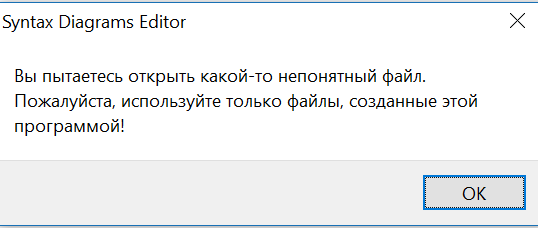

&#1058;&#1077;&#1089;&#1090; &#1087;&#1088;&#1086;&#1081;&#1076;&#1077;&#1085;
</td></tr><tr class="c19"><td class="c5" colspan="1" rowspan="1">
5
</td><td class="c3" colspan="2" rowspan="2">
&#1069;&#1082;&#1089;&#1087;&#1086;&#1088;&#1090; &#1074; PNG
</td><td class="c52" colspan="3" rowspan="1">
1. &#1053;&#1072;&#1088;&#1080;&#1089;&#1086;&#1074;&#1072;&#1090;&#1100; &#1095;&#1090;&#1086;-&#1090;&#1086; &#1085;&#1072; &#1087;&#1086;&#1083;&#1086;&#1090;&#1085;&#1077;

2. &#1042;&#1099;&#1073;&#1088;&#1072;&#1090;&#1100; &laquo;&#1069;&#1082;&#1089;&#1087;&#1086;&#1088;&#1090; &#1074; PNG&raquo;

3. &#1042;&#1099;&#1073;&#1088;&#1072;&#1090;&#1100; &#1087;&#1091;&#1090;&#1100;
</td><td class="c44" colspan="1" rowspan="1">
&#1060;&#1072;&#1081;&#1083; &#1089;&#1086;&#1093;&#1088;&#1072;&#1085;&#1080;&#1083;&#1089;&#1103;
</td><td class="c34" colspan="1" rowspan="1">
&#1058;&#1077;&#1089;&#1090; &#1087;&#1088;&#1086;&#1081;&#1076;&#1077;&#1085;
</td></tr><tr class="c19"><td class="c5" colspan="1" rowspan="1">
6
</td><td class="c52" colspan="3" rowspan="1">
1. &#1042;&#1099;&#1073;&#1088;&#1072;&#1090;&#1100; &laquo;&#1069;&#1082;&#1089;&#1087;&#1086;&#1088;&#1090; &#1074; PNG&raquo;

2. &#1042;&#1099;&#1073;&#1088;&#1072;&#1090;&#1100; &#1087;&#1091;&#1090;&#1100;
</td><td class="c44" colspan="1" rowspan="1">
&#1060;&#1072;&#1081;&#1083; &#1089;&#1086;&#1093;&#1088;&#1072;&#1085;&#1080;&#1083;&#1089;&#1103;
</td><td class="c34" colspan="1" rowspan="1">
&#1058;&#1077;&#1089;&#1090; &#1087;&#1088;&#1086;&#1081;&#1076;&#1077;&#1085;
</td></tr><tr class="c19"><td class="c5" colspan="1" rowspan="1">
7
</td><td class="c3" colspan="2" rowspan="2">
&#1069;&#1082;&#1089;&#1087;&#1086;&#1088;&#1090; &#1074; BMP
</td><td class="c52" colspan="3" rowspan="1">
1. &#1053;&#1072;&#1088;&#1080;&#1089;&#1086;&#1074;&#1072;&#1090;&#1100; &#1095;&#1090;&#1086;-&#1090;&#1086; &#1085;&#1072; &#1087;&#1086;&#1083;&#1086;&#1090;&#1085;&#1077;

2. &#1042;&#1099;&#1073;&#1088;&#1072;&#1090;&#1100; &laquo;&#1069;&#1082;&#1089;&#1087;&#1086;&#1088;&#1090; &#1074; BMP&raquo;

3. &#1042;&#1099;&#1073;&#1088;&#1072;&#1090;&#1100; &#1087;&#1091;&#1090;&#1100;
</td><td class="c44" colspan="1" rowspan="1">
&#1060;&#1072;&#1081;&#1083; &#1089;&#1086;&#1093;&#1088;&#1072;&#1085;&#1080;&#1083;&#1089;&#1103;
</td><td class="c34" colspan="1" rowspan="1">
&#1058;&#1077;&#1089;&#1090; &#1087;&#1088;&#1086;&#1081;&#1076;&#1077;&#1085;
</td></tr><tr class="c19"><td class="c5" colspan="1" rowspan="1">
8
</td><td class="c52" colspan="3" rowspan="1">
1. &#1042;&#1099;&#1073;&#1088;&#1072;&#1090;&#1100; &laquo;&#1069;&#1082;&#1089;&#1087;&#1086;&#1088;&#1090; &#1074; BMP&raquo;

2. &#1042;&#1099;&#1073;&#1088;&#1072;&#1090;&#1100; &#1087;&#1091;&#1090;&#1100;
</td><td class="c44" colspan="1" rowspan="1">
&#1060;&#1072;&#1081;&#1083; &#1089;&#1086;&#1093;&#1088;&#1072;&#1085;&#1080;&#1083;&#1089;&#1103;
</td><td class="c34" colspan="1" rowspan="1">
&#1058;&#1077;&#1089;&#1090; &#1087;&#1088;&#1086;&#1081;&#1076;&#1077;&#1085;
</td></tr><tr class="c19"><td class="c5" colspan="1" rowspan="1">
9
</td><td class="c3" colspan="2" rowspan="2">
&#1069;&#1082;&#1089;&#1087;&#1086;&#1088;&#1090; &#1074; SVG
</td><td class="c52" colspan="3" rowspan="1">
1. &#1053;&#1072;&#1088;&#1080;&#1089;&#1086;&#1074;&#1072;&#1090;&#1100; &#1095;&#1090;&#1086;-&#1090;&#1086; &#1085;&#1072; &#1087;&#1086;&#1083;&#1086;&#1090;&#1085;&#1077;

2. &#1042;&#1099;&#1073;&#1088;&#1072;&#1090;&#1100; &laquo;&#1069;&#1082;&#1089;&#1087;&#1086;&#1088;&#1090; &#1074; SVG&raquo;

3. &#1042;&#1099;&#1073;&#1088;&#1072;&#1090;&#1100; &#1087;&#1091;&#1090;&#1100;
</td><td class="c44" colspan="1" rowspan="1">
&#1060;&#1072;&#1081;&#1083; &#1089;&#1086;&#1093;&#1088;&#1072;&#1085;&#1080;&#1083;&#1089;&#1103;
</td><td class="c34" colspan="1" rowspan="1">
&#1058;&#1077;&#1089;&#1090; &#1087;&#1088;&#1086;&#1081;&#1076;&#1077;&#1085;
</td></tr><tr class="c19"><td class="c5" colspan="1" rowspan="1">
10
</td><td class="c52" colspan="3" rowspan="1">
1. &#1042;&#1099;&#1073;&#1088;&#1072;&#1090;&#1100; &laquo;&#1069;&#1082;&#1089;&#1087;&#1086;&#1088;&#1090; &#1074; SVG&raquo;

2. &#1042;&#1099;&#1073;&#1088;&#1072;&#1090;&#1100; &#1087;&#1091;&#1090;&#1100;
</td><td class="c44" colspan="1" rowspan="1">
&#1060;&#1072;&#1081;&#1083; &#1089;&#1086;&#1093;&#1088;&#1072;&#1085;&#1080;&#1083;&#1089;&#1103;
</td><td class="c34" colspan="1" rowspan="1">
&#1058;&#1077;&#1089;&#1090; &#1087;&#1088;&#1086;&#1081;&#1076;&#1077;&#1085;
</td></tr><tr class="c19"><td class="c5" colspan="1" rowspan="1">
11
</td><td class="c3" colspan="2" rowspan="1">
&#1057;&#1086;&#1079;&#1076;&#1072;&#1085;&#1080;&#1077; &#1085;&#1086;&#1074;&#1086;&#1075;&#1086; &#1092;&#1072;&#1081;&#1083;&#1072;
</td><td class="c52" colspan="3" rowspan="1">
1. &#1053;&#1072;&#1088;&#1080;&#1089;&#1086;&#1074;&#1072;&#1090;&#1100; &#1095;&#1090;&#1086;-&#1090;&#1086; &#1085;&#1072; &#1087;&#1086;&#1083;&#1086;&#1090;&#1085;&#1077;

2. &#1042;&#1099;&#1073;&#1088;&#1072;&#1090;&#1100; &laquo;&#1053;&#1086;&#1074;&#1099;&#1081; &#1092;&#1072;&#1081;&#1083;&raquo;
</td><td class="c44" colspan="1" rowspan="1">
&#1055;&#1086;&#1082;&#1072;&#1078;&#1077;&#1090;&#1089;&#1103; &#1091;&#1074;&#1077;&#1076;&#1086;&#1084;&#1083;&#1077;&#1085;&#1080;&#1077;, &#1095;&#1090;&#1086; &#1085;&#1077;&#1089;&#1086;&#1093;&#1088;&#1072;&#1085;&#1077;&#1085;&#1085;&#1099;&#1077; &#1080;&#1079;&#1084;&#1077;&#1085;&#1077;&#1085;&#1080;&#1103; &#1091;&#1076;&#1072;&#1083;&#1103;&#1090;&#1089;&#1103;, &#1077;&#1089;&#1083;&#1080; &#1074;&#1099;&#1073;&#1088;&#1072;&#1085;&#1086; &laquo;&#1054;&#1050;&raquo; - &#1089;&#1086;&#1079;&#1076;&#1072;&#1089;&#1090;&#1089;&#1103; &#1085;&#1086;&#1074;&#1099;&#1081; &#1092;&#1072;&#1081;&#1083;
</td><td class="c34" colspan="1" rowspan="1">
&#1058;&#1077;&#1089;&#1090; &#1087;&#1088;&#1086;&#1081;&#1076;&#1077;&#1085;
</td></tr><tr class="c19"><td class="c5" colspan="1" rowspan="1">
12
</td><td class="c3" colspan="2" rowspan="6">
&#1047;&#1072;&#1082;&#1088;&#1099;&#1090;&#1080;&#1077; &#1092;&#1086;&#1088;&#1084;&#1099;
</td><td class="c52" colspan="3" rowspan="1">
1. &#1053;&#1072;&#1088;&#1080;&#1089;&#1086;&#1074;&#1072;&#1090;&#1100; &#1095;&#1090;&#1086;-&#1090;&#1086; &#1085;&#1072; &#1087;&#1086;&#1083;&#1086;&#1090;&#1085;&#1077;

2. &#1047;&#1072;&#1082;&#1088;&#1099;&#1090;&#1100; &#1092;&#1086;&#1088;&#1084;&#1091;
</td><td class="c44" colspan="1" rowspan="1">
&#1055;&#1086;&#1082;&#1072;&#1078;&#1077;&#1090;&#1089;&#1103; &#1087;&#1088;&#1077;&#1076;&#1083;&#1086;&#1078;&#1077;&#1085;&#1080;&#1077; &#1089;&#1086;&#1093;&#1088;&#1072;&#1085;&#1080;&#1090;&#1100; &#1080;&#1079;&#1084;&#1077;&#1085;&#1077;&#1085;&#1080;&#1103;
</td><td class="c34" colspan="1" rowspan="1">
&#1058;&#1077;&#1089;&#1090; &#1087;&#1088;&#1086;&#1081;&#1076;&#1077;&#1085;
</td></tr><tr class="c19"><td class="c5" colspan="1" rowspan="1">
13
</td><td class="c52" colspan="3" rowspan="1">
1. &#1047;&#1072;&#1082;&#1088;&#1099;&#1090;&#1100; &#1092;&#1086;&#1088;&#1084;&#1091;
</td><td class="c44" colspan="1" rowspan="1">
&#1060;&#1086;&#1088;&#1084;&#1072; &#1079;&#1072;&#1082;&#1088;&#1086;&#1077;&#1090;&#1089;&#1103; 
</td><td class="c34" colspan="1" rowspan="1">
&#1058;&#1077;&#1089;&#1090; &#1087;&#1088;&#1086;&#1081;&#1076;&#1077;&#1085;
</td></tr><tr class="c19"><td class="c5" colspan="1" rowspan="1">
14
</td><td class="c52" colspan="3" rowspan="1">
1. &#1053;&#1072;&#1088;&#1080;&#1089;&#1086;&#1074;&#1072;&#1090;&#1100; &#1095;&#1090;&#1086;-&#1090;&#1086; &#1085;&#1072; &#1087;&#1086;&#1083;&#1086;&#1090;&#1085;&#1077;

2. &#1047;&#1072;&#1082;&#1088;&#1099;&#1090;&#1100; &#1092;&#1086;&#1088;&#1084;&#1091;

3. &#1053;&#1072;&#1078;&#1072;&#1090;&#1100; &laquo;&#1044;&#1072;&raquo;

4. &#1057;&#1086;&#1093;&#1088;&#1072;&#1085;&#1080;&#1090;&#1100; &#1092;&#1072;&#1081;&#1083;
</td><td class="c44" colspan="1" rowspan="1">
&#1060;&#1072;&#1081;&#1083; &#1089;&#1086;&#1093;&#1088;&#1072;&#1085;&#1080;&#1090;&#1089;&#1103;, &#1092;&#1086;&#1088;&#1084;&#1072; &#1079;&#1072;&#1082;&#1088;&#1086;&#1077;&#1090;&#1089;&#1103;
</td><td class="c34" colspan="1" rowspan="1">
&#1058;&#1077;&#1089;&#1090; &#1087;&#1088;&#1086;&#1081;&#1076;&#1077;&#1085;
</td></tr><tr class="c19"><td class="c5" colspan="1" rowspan="1">
15
</td><td class="c52" colspan="3" rowspan="1">
1. &#1053;&#1072;&#1088;&#1080;&#1089;&#1086;&#1074;&#1072;&#1090;&#1100; &#1095;&#1090;&#1086;-&#1090;&#1086; &#1085;&#1072; &#1087;&#1086;&#1083;&#1086;&#1090;&#1085;&#1077;

2. &#1047;&#1072;&#1082;&#1088;&#1099;&#1090;&#1100; &#1092;&#1086;&#1088;&#1084;&#1091;

3. &#1053;&#1072;&#1078;&#1072;&#1090;&#1100; &laquo;&#1044;&#1072;&raquo;

4. &#1054;&#1090;&#1084;&#1077;&#1085;&#1080;&#1090;&#1100; &#1089;&#1086;&#1093;&#1088;&#1072;&#1085;&#1077;&#1085;&#1080;&#1077;
</td><td class="c44" colspan="1" rowspan="1">
&#1060;&#1086;&#1088;&#1084;&#1072; &#1085;&#1077; &#1079;&#1072;&#1082;&#1088;&#1086;&#1077;&#1090;&#1089;&#1103;
</td><td class="c34" colspan="1" rowspan="1">
&#1058;&#1077;&#1089;&#1090; &#1087;&#1088;&#1086;&#1081;&#1076;&#1077;&#1085;
</td></tr><tr class="c19"><td class="c5" colspan="1" rowspan="1">
16
</td><td class="c52" colspan="3" rowspan="1">
1. &#1053;&#1072;&#1088;&#1080;&#1089;&#1086;&#1074;&#1072;&#1090;&#1100; &#1095;&#1090;&#1086;-&#1090;&#1086; &#1085;&#1072; &#1087;&#1086;&#1083;&#1086;&#1090;&#1085;&#1077;

2. &#1047;&#1072;&#1082;&#1088;&#1099;&#1090;&#1100; &#1092;&#1086;&#1088;&#1084;&#1091;

3. &#1053;&#1072;&#1078;&#1072;&#1090;&#1100; &laquo;&#1054;&#1090;&#1084;&#1077;&#1085;&#1072;&raquo;
</td><td class="c44" colspan="1" rowspan="1">
&#1060;&#1086;&#1088;&#1084;&#1072; &#1085;&#1077; &#1079;&#1072;&#1082;&#1088;&#1086;&#1077;&#1090;&#1089;&#1103;
</td><td class="c34" colspan="1" rowspan="1">
&#1058;&#1077;&#1089;&#1090; &#1087;&#1088;&#1086;&#1081;&#1076;&#1077;&#1085;
</td></tr><tr class="c19"><td class="c5" colspan="1" rowspan="1">
17
</td><td class="c52" colspan="3" rowspan="1">
1. &#1053;&#1072;&#1088;&#1080;&#1089;&#1086;&#1074;&#1072;&#1090;&#1100; &#1095;&#1090;&#1086;-&#1090;&#1086; &#1085;&#1072; &#1087;&#1086;&#1083;&#1086;&#1090;&#1085;&#1077;

2. &#1047;&#1072;&#1082;&#1088;&#1099;&#1090;&#1100; &#1092;&#1086;&#1088;&#1084;&#1091;

3. &#1053;&#1072;&#1078;&#1072;&#1090;&#1100; &laquo;&#1053;&#1077;&#1090;&raquo;
</td><td class="c44" colspan="1" rowspan="1">
&#1060;&#1086;&#1088;&#1084;&#1072; &#1079;&#1072;&#1082;&#1088;&#1086;&#1077;&#1090;&#1089;&#1103;, &#1080;&#1079;&#1084;&#1077;&#1085;&#1077;&#1085;&#1080;&#1103; &#1085;&#1077; &#1089;&#1086;&#1093;&#1088;&#1072;&#1085;&#1103;&#1090;&#1089;&#1103;
</td><td class="c34" colspan="1" rowspan="1">
&#1058;&#1077;&#1089;&#1090; &#1087;&#1088;&#1086;&#1081;&#1076;&#1077;&#1085;
</td></tr><tr class="c19"><td class="c5" colspan="1" rowspan="1">
18
</td><td class="c53" colspan="1" rowspan="1">
&#1048;&#1079;&#1084;&#1077;&#1085;&#1077;&#1085;&#1080;&#1077; &#1084;&#1072;&#1089;&#1096;&#1090;&#1072;&#1073;&#1072;
</td><td class="c64" colspan="2" rowspan="1">
1. &#1053;&#1072;&#1088;&#1080;&#1089;&#1086;&#1074;&#1072;&#1090;&#1100; &#1095;&#1090;&#1086;-&#1090;&#1086; &#1085;&#1072; &#1087;&#1086;&#1083;&#1086;&#1090;&#1085;&#1077;.

2. &#1048;&#1079;&#1084;&#1077;&#1085;&#1080;&#1090;&#1100; &#1084;&#1072;&#1089;&#1096;&#1090;&#1072;&#1073; &#1087;&#1091;&#1090;&#1077;&#1084; &#1080;&#1079;&#1084;&#1077;&#1085;&#1077;&#1085;&#1080;&#1103; &laquo;&#1087;&#1086;&#1083;&#1079;&#1091;&#1085;&#1082;&#1072;&raquo; &#1084;&#1072;&#1089;&#1096;&#1090;&#1072;&#1073;&#1072;
</td><td class="c3" colspan="1" rowspan="1">
&#1052;&#1072;&#1089;&#1096;&#1090;&#1072;&#1073; &#1080;&#1079;&#1084;&#1077;&#1085;&#1080;&#1090;&#1089;&#1103;
</td><td class="c91" colspan="3" rowspan="1">

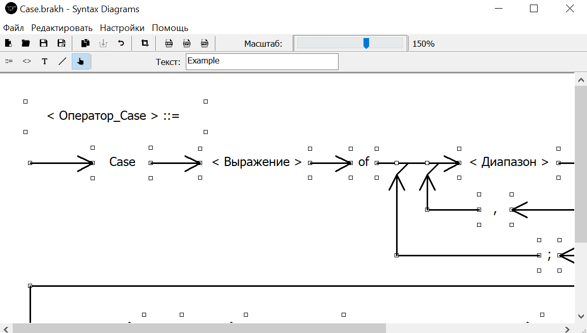

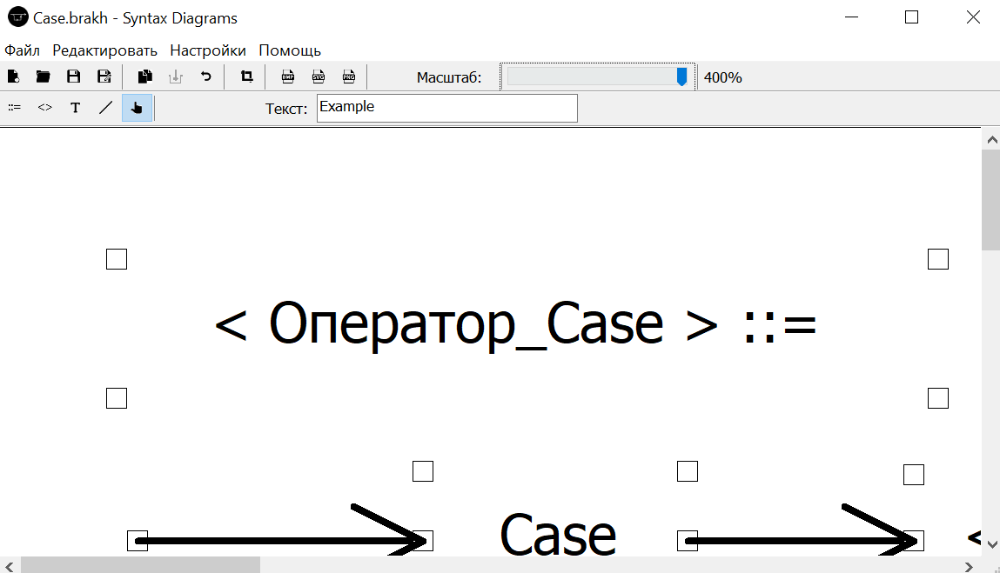

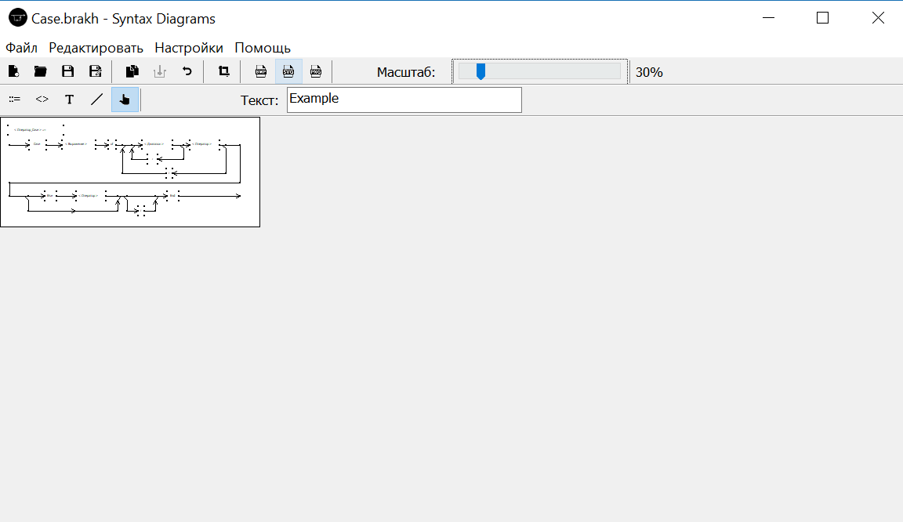

&#1058;&#1077;&#1089;&#1090; &#1087;&#1088;&#1086;&#1081;&#1076;&#1077;&#1085;
</td></tr></tbody></table>

<ol class="c23 lst-kix_list_4-1" start="16"><li class="c18"><h2 id="h.2u6wntf" style="display:inline">&#1042;&#1099;&#1074;&#1086;&#1076; &#1080;&#1079; &#1087;&#1088;&#1086;&#1093;&#1086;&#1078;&#1076;&#1077;&#1085;&#1080;&#1103; &#1090;&#1077;&#1089;&#1090;&#1080;&#1088;&#1086;&#1074;&#1072;&#1085;&#1080;&#1103;</h2></li></ol>

&#1055;&#1088;&#1086;&#1075;&#1088;&#1072;&#1084;&#1084;&#1072; &#1091;&#1089;&#1087;&#1077;&#1096;&#1085;&#1086; &#1087;&#1088;&#1086;&#1096;&#1083;&#1072; &#1074;&#1089;&#1077; &#1090;&#1077;&#1089;&#1090;&#1099;, &#1095;&#1090;&#1086; &#1087;&#1086;&#1082;&#1072;&#1079;&#1099;&#1074;&#1072;&#1077;&#1090; &#1082;&#1086;&#1088;&#1088;&#1077;&#1082;&#1090;&#1085;&#1086;&#1089;&#1090;&#1100; &#1088;&#1072;&#1073;&#1086;&#1090;&#1099; &#1087;&#1088;&#1086;&#1075;&#1088;&#1072;&#1084;&#1084;&#1099; &#1080; &#1089;&#1086;&#1086;&#1090;&#1074;&#1077;&#1090;&#1089;&#1090;&#1074;&#1080;&#1077; &#1092;&#1091;&#1085;&#1082;&#1094;&#1080;&#1086;&#1085;&#1072;&#1083;&#1100;&#1085;&#1099;&#1084; &#1090;&#1088;&#1077;&#1073;&#1086;&#1074;&#1072;&#1085;&#1080;&#1103;&#1084;.

<ol class="c23 lst-kix_list_4-0" start="6"><li class="c31 c41"><h1 id="h.19c6y18" style="display:inline">&#1056;&#1059;&#1050;&#1054;&#1042;&#1054;&#1044;&#1057;&#1058;&#1042;&#1054; &#1055;&#1054; &#1059;&#1057;&#1058;&#1040;&#1053;&#1054;&#1042;&#1050;&#1045; &#1048; &#1048;&#1057;&#1055;&#1054;&#1051;&#1068;&#1047;&#1054;&#1042;&#1040;&#1053;&#1048;&#1070;</h1></li></ol>

&#1044;&#1083;&#1103; &#1090;&#1086;&#1075;&#1086;, &#1095;&#1090;&#1086;&#1073;&#1099; &#1085;&#1072;&#1095;&#1072;&#1090;&#1100; &#1080;&#1089;&#1087;&#1086;&#1083;&#1100;&#1079;&#1086;&#1074;&#1072;&#1085;&#1080;&#1077; &#1087;&#1088;&#1086;&#1075;&#1088;&#1072;&#1084;&#1084;&#1099;, &#1085;&#1077;&#1086;&#1073;&#1093;&#1086;&#1076;&#1080;&#1084;&#1086; &#1079;&#1072;&#1087;&#1091;&#1089;&#1090;&#1080;&#1090;&#1100; &#1092;&#1072;&#1081;&#1083; SyntaxDiag.exe, &#1083;&#1080;&#1073;&#1086; &#1086;&#1090;&#1082;&#1088;&#1099;&#1090;&#1100; &#1092;&#1072;&#1081;&#1083; &#1092;&#1072;&#1081;&#1083; &#1089; &#1088;&#1072;&#1089;&#1096;&#1080;&#1088;&#1077;&#1085;&#1080;&#1077;&#1084; &laquo;.brakh&raquo; (&#1056;&#1072;&#1089;&#1096;&#1080;&#1088;&#1077;&#1085;&#1080;&#1077; &#1079;&#1072;&#1088;&#1072;&#1085;&#1077;&#1077; &#1076;&#1086;&#1083;&#1078;&#1085;&#1099; &#1073;&#1099;&#1090;&#1100; &#1072;&#1089;&#1089;&#1086;&#1094;&#1080;&#1080;&#1088;&#1086;&#1074;&#1072;&#1085;&#1086; &#1089; &#1087;&#1088;&#1086;&#1075;&#1088;&#1072;&#1084;&#1084;&#1086;&#1081;). &#1055;&#1086;&#1089;&#1083;&#1077; &#1086;&#1090;&#1082;&#1088;&#1099;&#1090;&#1080;&#1077; &#1087;&#1088;&#1086;&#1075;&#1088;&#1072;&#1084;&#1084;&#1099; &#1087;&#1086;&#1103;&#1074;&#1080;&#1090;&#1089;&#1103; &#1086;&#1082;&#1085;&#1086;, &#1087;&#1086;&#1082;&#1072;&#1079;&#1072;&#1085;&#1085;&#1086;&#1077; &#1085;&#1072; &#1088;&#1080;&#1089;&#1091;&#1085;&#1082;&#1077; 6.1.

&nbsp;

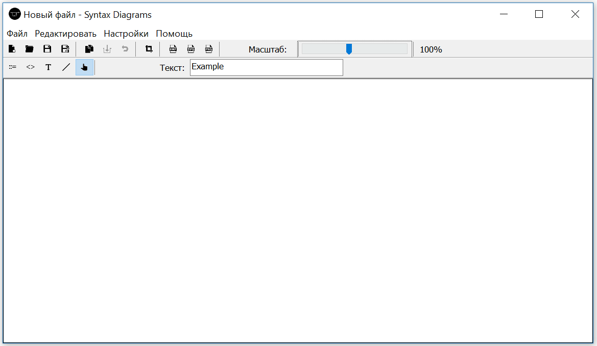

&#1056;&#1080;&#1089;&#1091;&#1085;&#1086;&#1082; 6.1 &ndash; &#1086;&#1082;&#1085;&#1086; &#1088;&#1077;&#1076;&#1072;&#1082;&#1090;&#1086;&#1088;&#1072; &#1089;&#1080;&#1085;&#1090;&#1072;&#1082;&#1089;&#1080;&#1095;&#1077;&#1089;&#1082;&#1080;&#1093; &#1076;&#1080;&#1072;&#1075;&#1088;&#1072;&#1084;&#1084;.

&#1055;&#1086; &#1091;&#1084;&#1086;&#1083;&#1095;&#1072;&#1085;&#1080;&#1102; &#1087;&#1088;&#1080; &#1086;&#1090;&#1082;&#1088;&#1099;&#1090;&#1080;&#1080; &#1072;&#1082;&#1090;&#1080;&#1074;&#1077;&#1085; &#1088;&#1077;&#1078;&#1080;&#1084; &laquo;&#1056;&#1077;&#1076;&#1072;&#1082;&#1090;&#1080;&#1088;&#1086;&#1074;&#1072;&#1085;&#1080;&#1103;&raquo;, &#1074; &#1082;&#1086;&#1090;&#1086;&#1088;&#1086;&#1084; &#1079;&#1072;&#1087;&#1088;&#1077;&#1097;&#1077;&#1085;&#1086; &#1088;&#1080;&#1089;&#1086;&#1074;&#1072;&#1085;&#1080;&#1077;. &#1063;&#1090;&#1086;&#1073;&#1099; &#1077;&#1075;&#1086; &#1087;&#1077;&#1088;&#1077;&#1082;&#1083;&#1102;&#1095;&#1080;&#1090;&#1100;, &#1085;&#1077;&#1086;&#1073;&#1093;&#1086;&#1076;&#1080;&#1084;&#1086; &#1074;&#1099;&#1073;&#1088;&#1072;&#1090;&#1100; &#1087;&#1086;&#1076;&#1093;&#1086;&#1076;&#1103;&#1097;&#1080;&#1081; &#1088;&#1077;&#1078;&#1080;&#1084;, &#1082;&#1083;&#1080;&#1082;&#1085;&#1091;&#1074; &#1085;&#1072; &#1089;&#1086;&#1086;&#1090;&#1074;&#1077;&#1090;&#1089;&#1090;&#1074;&#1091;&#1102;&#1097;&#1091;&#1102; &#1080;&#1082;&#1086;&#1085;&#1082;&#1091; &#1074; ToolBar (&#1088;&#1080;&#1089;&#1091;&#1085;&#1086;&#1082; 6.2).

&#1056;&#1080;&#1089;&#1091;&#1085;&#1086;&#1082; 6.2. &ndash; &#1080;&#1082;&#1086;&#1085;&#1082;&#1080; &#1080;&#1079;&#1084;&#1077;&#1085;&#1077;&#1085;&#1080;&#1103; &#1088;&#1077;&#1078;&#1080;&#1084;&#1072;.

&#1055;&#1086;&#1089;&#1083;&#1077; &#1074;&#1099;&#1073;&#1086;&#1088;&#1072; &#1088;&#1077;&#1078;&#1080;&#1084;&#1072;, &#1084;&#1086;&#1078;&#1085;&#1086; &#1087;&#1088;&#1080;&#1089;&#1090;&#1091;&#1087;&#1080;&#1090;&#1100; &#1082; &#1088;&#1080;&#1089;&#1086;&#1074;&#1072;&#1085;&#1080;&#1102; (&#1045;&#1089;&#1083;&#1080; &#1085;&#1077; &#1074;&#1099;&#1073;&#1088;&#1072;&#1085; &#1088;&#1077;&#1078;&#1080;&#1084; &#1088;&#1077;&#1076;&#1072;&#1082;&#1090;&#1080;&#1088;&#1086;&#1074;&#1072;&#1085;&#1080;&#1103;&raquo;. &#1045;&#1089;&#1083;&#1080; &#1074;&#1099;&#1073;&#1088;&#1072;&#1085; &#1088;&#1077;&#1078;&#1080;&#1084; &laquo;&#1083;&#1080;&#1085;&#1080;&#1103;&raquo;, &#1090;&#1086; &#1082;&#1072;&#1078;&#1076;&#1086;&#1077; &#1085;&#1072;&#1078;&#1072;&#1090;&#1080;&#1077; &#1051;&#1050;&#1052; &#1087;&#1086; &#1087;&#1086;&#1083;&#1086;&#1090;&#1085;&#1091; &#1076;&#1086;&#1073;&#1072;&#1074;&#1083;&#1103;&#1077;&#1090; &#1085;&#1086;&#1074;&#1091;&#1102; &#1090;&#1086;&#1095;&#1082;&#1091; &#1092;&#1080;&#1075;&#1091;&#1088;&#1091;. &#1053;&#1072;&#1078;&#1072;&#1090;&#1080;&#1077; &#1055;&#1050;&#1052; &ndash; &#1087;&#1088;&#1077;&#1082;&#1088;&#1072;&#1097;&#1072;&#1077;&#1090; &#1088;&#1080;&#1089;&#1086;&#1074;&#1072;&#1085;&#1080;&#1077; &#1090;&#1077;&#1082;&#1091;&#1097;&#1077;&#1081; &#1092;&#1080;&#1075;&#1091;&#1088;&#1099;. &#1048;&#1085;&#1072;&#1095;&#1077;, &#1077;&#1089;&#1083;&#1080; &#1074;&#1099;&#1073;&#1088;&#1072;&#1085; &#1086;&#1076;&#1080;&#1085; &#1080;&#1079; &#1088;&#1077;&#1078;&#1080;&#1084;&#1086;&#1074; &#1088;&#1080;&#1089;&#1086;&#1074;&#1072;&#1085;&#1080;&#1103; &#1090;&#1077;&#1082;&#1089;&#1090;&#1086;&#1074;&#1099;&#1093; &#1092;&#1080;&#1075;&#1091;&#1088; &ndash; &#1082;&#1072;&#1078;&#1076;&#1086;&#1077; &#1085;&#1072;&#1078;&#1072;&#1090;&#1080;&#1077; &#1084;&#1099;&#1096;&#1080; &#1076;&#1086;&#1073;&#1072;&#1074;&#1083;&#1103;&#1077;&#1090; &#1085;&#1086;&#1074;&#1091;&#1102; &#1092;&#1080;&#1075;&#1091;&#1088;&#1091;. 

&#1063;&#1090;&#1086;&#1073;&#1099; &#1080;&#1079;&#1084;&#1077;&#1085;&#1080;&#1090;&#1100; &#1090;&#1077;&#1082;&#1089;&#1090;, &#1082;&#1086;&#1090;&#1086;&#1088;&#1099;&#1081; &#1073;&#1091;&#1076;&#1077;&#1090; &#1086;&#1090;&#1086;&#1073;&#1088;&#1072;&#1078;&#1072;&#1090;&#1100;&#1089;&#1103; &#1074;&#1085;&#1091;&#1090;&#1088;&#1080; &#1092;&#1080;&#1075;&#1091;&#1088;&#1099;, &#1085;&#1077;&#1086;&#1073;&#1093;&#1086;&#1076;&#1080;&#1084;&#1086; &#1086;&#1090;&#1088;&#1077;&#1076;&#1072;&#1082;&#1090;&#1080;&#1088;&#1086;&#1074;&#1072;&#1090;&#1100; &#1089;&#1086;&#1076;&#1077;&#1088;&#1078;&#1080;&#1084;&#1086;&#1077; &#1090;&#1077;&#1082;&#1089;&#1090;&#1086;&#1074;&#1086;&#1075;&#1086; &#1087;&#1086;&#1083;&#1103;, &#1087;&#1088;&#1080;&#1074;&#1077;&#1076;&#1077;&#1085;&#1085;&#1086;&#1075;&#1086; &#1085;&#1072; &#1088;&#1080;&#1089;&#1091;&#1085;&#1082;&#1077; 6.3.

&#1056;&#1080;&#1089;&#1091;&#1085;&#1086;&#1082; 6.3 &ndash; &#1090;&#1077;&#1082;&#1089;&#1090;&#1086;&#1074;&#1086;&#1077; &#1087;&#1086;&#1083;&#1077;, &#1086;&#1090;&#1074;&#1077;&#1095;&#1072;&#1102;&#1097;&#1077;&#1077; &#1079;&#1072; &#1089;&#1086;&#1076;&#1077;&#1088;&#1078;&#1080;&#1084;&#1086;&#1077; &#1090;&#1077;&#1082;&#1089;&#1090;&#1086;&#1074;&#1086;&#1081; &#1092;&#1080;&#1075;&#1091;&#1088;&#1099;

&#1055;&#1088;&#1080;&#1084;&#1077;&#1088; &#1088;&#1080;&#1089;&#1086;&#1074;&#1072;&#1085;&#1080;&#1103; &#1087;&#1088;&#1080;&#1074;&#1077;&#1076;&#1077;&#1085; &#1085;&#1072; &#1088;&#1080;&#1089;&#1091;&#1085;&#1082;&#1077; 6.4. 

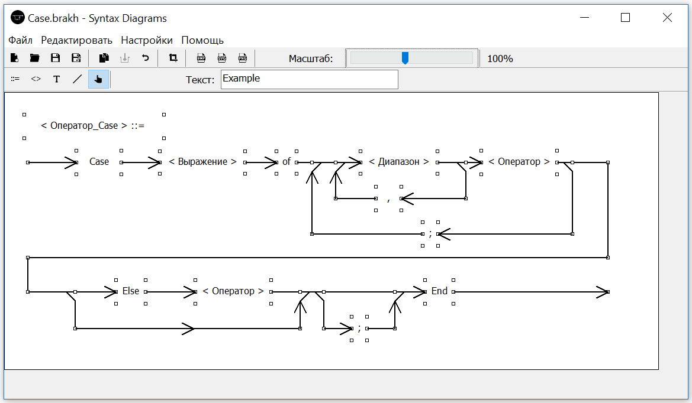

&#1056;&#1080;&#1089;&#1091;&#1085;&#1086;&#1082; 6.4 &ndash; &#1087;&#1088;&#1080;&#1084;&#1077;&#1088; &#1088;&#1080;&#1089;&#1086;&#1074;&#1072;&#1085;&#1080;&#1103; &#1085;&#1072; &#1087;&#1086;&#1083;&#1086;&#1090;&#1085;&#1077;

&nbsp;&nbsp;&nbsp;&nbsp;&nbsp;&nbsp;&nbsp;&nbsp;&#1045;&#1089;&#1083;&#1080; &#1074;&#1099;&#1073;&#1088;&#1072;&#1085; &#1088;&#1077;&#1078;&#1080;&#1084; &laquo;&#1056;&#1077;&#1076;&#1072;&#1082;&#1090;&#1080;&#1088;&#1086;&#1074;&#1072;&#1085;&#1080;&#1103;&raquo; (&#1048;&#1082;&#1086;&#1085;&#1082;&#1072; &#1082;&#1091;&#1088;&#1089;&#1086;&#1088;&#1072;), &#1090;&#1086; &#1087;&#1088;&#1080; &#1085;&#1072;&#1074;&#1077;&#1076;&#1077;&#1085;&#1080;&#1080; &#1085;&#1072; &#1092;&#1080;&#1075;&#1091;&#1088;&#1091; &#1084;&#1077;&#1085;&#1103;&#1077;&#1090;&#1089;&#1103; &#1082;&#1091;&#1088;&#1089;&#1086;&#1088;, &#1087;&#1086;&#1089;&#1083;&#1077; &#1095;&#1077;&#1075;&#1086; &#1086;&#1073;&#1099;&#1095;&#1085;&#1099;&#1084; &#1079;&#1072;&#1078;&#1072;&#1090;&#1080;&#1077;&#1084; &#1080; &#1087;&#1077;&#1088;&#1077;&#1084;&#1077;&#1097;&#1077;&#1085;&#1080;&#1077;&#1084; &#1082;&#1091;&#1088;&#1089;&#1086;&#1088;&#1072; &#1084;&#1086;&#1078;&#1085;&#1086; &#1080;&#1079;&#1084;&#1077;&#1085;&#1103;&#1090;&#1100; &#1092;&#1080;&#1075;&#1091;&#1088;&#1091; (&#1088;&#1080;&#1089;&#1091;&#1085;&#1086;&#1082; 6.5).

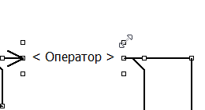

&#1056;&#1080;&#1089;&#1091;&#1085;&#1086;&#1082; 6.5 &ndash; &#1080;&#1079;&#1084;&#1077;&#1085;&#1077;&#1085;&#1080;&#1077; &#1082;&#1091;&#1088;&#1089;&#1086;&#1088;&#1072; &#1087;&#1088;&#1080; &#1085;&#1072;&#1074;&#1077;&#1076;&#1077;&#1085;&#1080;&#1080; &#1085;&#1072; &#1074;&#1077;&#1088;&#1096;&#1080;&#1085;&#1091;

&#1044;&#1083;&#1103; &#1080;&#1079;&#1084;&#1077;&#1085;&#1077;&#1085;&#1080;&#1103; &#1090;&#1077;&#1082;&#1089;&#1090;&#1072; &#1091;&#1078;&#1077; &#1076;&#1086;&#1073;&#1072;&#1074;&#1083;&#1077;&#1085;&#1085;&#1086;&#1081; &#1092;&#1080;&#1075;&#1091;&#1088;&#1099;, &#1085;&#1077;&#1086;&#1073;&#1093;&#1086;&#1076;&#1080;&#1084;&#1086; &#1074;&#1099;&#1073;&#1088;&#1072;&#1090;&#1100; &#1088;&#1077;&#1078;&#1080;&#1084; &laquo;&#1056;&#1077;&#1076;&#1072;&#1082;&#1090;&#1080;&#1088;&#1086;&#1074;&#1072;&#1085;&#1080;&#1077;&raquo;, &#1082;&#1083;&#1080;&#1082;&#1085;&#1091;&#1090;&#1100; &#1085;&#1072; &#1092;&#1080;&#1075;&#1091;&#1088;&#1091;, &#1074; &#1082;&#1086;&#1090;&#1086;&#1088;&#1086;&#1081; &#1085;&#1091;&#1078;&#1085;&#1086; &#1087;&#1086;&#1084;&#1077;&#1085;&#1103;&#1090;&#1100; &#1090;&#1077;&#1082;&#1089;&#1090;, &#1080;&#1079;&#1084;&#1077;&#1085;&#1080;&#1090;&#1100; &#1089;&#1086;&#1076;&#1077;&#1088;&#1078;&#1080;&#1084;&#1086;&#1077; &#1090;&#1077;&#1082;&#1089;&#1090;&#1086;&#1074;&#1086;&#1075;&#1086; &#1087;&#1086;&#1083;&#1103; (&#1056;&#1080;&#1089;&#1091;&#1085;&#1086;&#1082; 6.3) &#1080; &#1085;&#1072;&#1078;&#1072;&#1090;&#1100; Enter.

&#1044;&#1083;&#1103; &#1080;&#1079;&#1084;&#1077;&#1085;&#1077;&#1085;&#1080;&#1103; &#1084;&#1072;&#1089;&#1096;&#1090;&#1072;&#1073;&#1072; &#1080;&#1079;&#1086;&#1073;&#1088;&#1072;&#1078;&#1077;&#1085;&#1080;&#1077;, &#1085;&#1077;&#1086;&#1073;&#1093;&#1086;&#1076;&#1080;&#1084;&#1086; &#1087;&#1077;&#1088;&#1077;&#1076;&#1074;&#1080;&#1085;&#1091;&#1090;&#1100; &#1089;&#1086;&#1086;&#1090;&#1074;&#1077;&#1090;&#1089;&#1090;&#1074;&#1091;&#1102;&#1097;&#1080;&#1081; &laquo;&#1087;&#1086;&#1083;&#1079;&#1091;&#1085;&#1086;&#1082;&raquo; (&#1088;&#1080;&#1089;&#1091;&#1085;&#1086;&#1082; 6.6) &#1074; &#1085;&#1091;&#1078;&#1085;&#1091;&#1102; &#1089;&#1090;&#1086;&#1088;&#1086;&#1085;&#1091;. &#1055;&#1088;&#1080;&#1084;&#1077;&#1088; &#1080;&#1079;&#1084;&#1077;&#1085;&#1077;&#1085;&#1080;&#1103; &#1084;&#1072;&#1089;&#1096;&#1090;&#1072;&#1073;&#1072; &#1087;&#1088;&#1080;&#1074;&#1077;&#1076;&#1077;&#1085; &#1085;&#1072; &#1088;&#1080;&#1089;&#1091;&#1085;&#1082;&#1077; 6.7.

&#1056;&#1080;&#1089;&#1091;&#1085;&#1086;&#1082; 6.6 &ndash; &#1087;&#1086;&#1083;&#1079;&#1091;&#1085;&#1086;&#1082; &#1080;&#1079;&#1084;&#1077;&#1085;&#1077;&#1085;&#1080;&#1103; &#1084;&#1072;&#1089;&#1096;&#1090;&#1072;&#1073;&#1072;

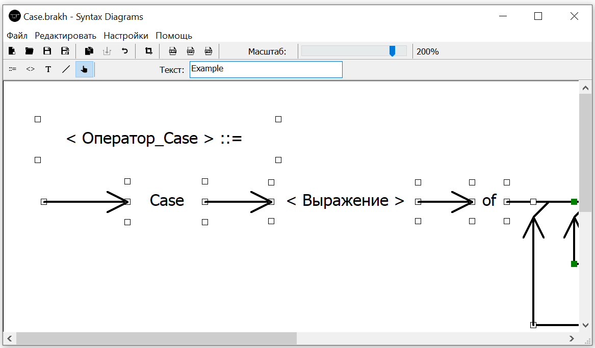

&#1056;&#1080;&#1089;&#1091;&#1085;&#1086;&#1082; 6.7 &ndash; &#1087;&#1088;&#1080;&#1084;&#1077;&#1088; &#1080;&#1079;&#1084;&#1077;&#1085;&#1077;&#1085;&#1080;&#1103; &#1084;&#1072;&#1089;&#1096;&#1090;&#1072;&#1073;&#1072;. 

&nbsp;&nbsp;&nbsp;&nbsp;&nbsp;&nbsp;&nbsp;&nbsp;&#1058;&#1072;&#1082;&#1078;&#1077; &#1074; &#1087;&#1088;&#1086;&#1075;&#1088;&#1072;&#1084;&#1084;&#1077; &#1087;&#1088;&#1080;&#1089;&#1091;&#1090;&#1089;&#1090;&#1074;&#1091;&#1077;&#1090; &#1091;&#1076;&#1086;&#1073;&#1085;&#1086;&#1077; &#1084;&#1077;&#1085;&#1102; (&#1088;&#1080;&#1089;&#1091;&#1085;&#1086;&#1082; 6.8) &#1080; toolbar (&#1088;&#1080;&#1089;&#1091;&#1085;&#1086;&#1082; 6.9), &#1075;&#1076;&#1077; &#1084;&#1086;&#1078;&#1085;&#1086; &#1085;&#1072;&#1081;&#1090;&#1080; &#1090;&#1072;&#1082;&#1080;&#1077; &#1092;&#1091;&#1085;&#1082;&#1094;&#1080;&#1080;, &#1082;&#1072;&#1082;
<ul class="c23 lst-kix_list_24-0 start"><li class="c4 c41">&#1054;&#1090;&#1082;&#1088;&#1099;&#1090;&#1080;&#1077; &#1092;&#1072;&#1081;&#1083;&#1072;</li><li class="c4 c41">&#1057;&#1086;&#1093;&#1088;&#1072;&#1085;&#1077;&#1085;&#1080;&#1077; &#1080;&#1089;&#1093;&#1086;&#1076;&#1085;&#1086;&#1075;&#1086; &#1092;&#1072;&#1081;&#1083;&#1072;</li><li class="c4 c41">&#1069;&#1082;&#1089;&#1087;&#1086;&#1088;&#1090; &#1074; &#1088;&#1072;&#1089;&#1090;&#1088;&#1086;&#1074;&#1099;&#1077; &#1092;&#1086;&#1088;&#1084;&#1072;&#1090;&#1099;</li><li class="c4 c41">&#1069;&#1082;&#1089;&#1087;&#1086;&#1088;&#1090; &#1074; &#1074;&#1077;&#1082;&#1090;&#1086;&#1088;&#1085;&#1099;&#1077; &#1092;&#1086;&#1088;&#1084;&#1072;&#1090;&#1099;</li><li class="c4 c41">&#1057;&#1086;&#1079;&#1076;&#1072;&#1085;&#1080;&#1077; &#1085;&#1086;&#1074;&#1086;&#1081; &#1089;&#1080;&#1085;&#1090;&#1072;&#1082;&#1089;&#1080;&#1095;&#1077;&#1089;&#1082;&#1086;&#1081; &#1076;&#1080;&#1072;&#1075;&#1088;&#1072;&#1084;&#1084;&#1099;</li><li class="c4 c41">&#1050;&#1086;&#1087;&#1080;&#1088;&#1086;&#1074;&#1072;&#1085;&#1080;&#1077; &#1092;&#1080;&#1075;&#1091;&#1088;</li><li class="c4 c41">&#1042;&#1089;&#1090;&#1072;&#1074;&#1082;&#1072; &#1092;&#1080;&#1075;&#1091;&#1088;</li><li class="c4 c41">&#1054;&#1090;&#1084;&#1077;&#1085;&#1072; &#1080;&#1079;&#1084;&#1077;&#1085;&#1077;&#1085;&#1080;&#1081;</li><li class="c4 c41">&#1048;&#1079;&#1084;&#1077;&#1085;&#1077;&#1085;&#1080;&#1077; &#1088;&#1072;&#1079;&#1084;&#1077;&#1088;&#1072; &#1093;&#1086;&#1083;&#1089;&#1090;&#1072;</li><li class="c4 c41">&#1055;&#1088;&#1086;&#1089;&#1084;&#1086;&#1090;&#1088; &#1089;&#1087;&#1088;&#1072;&#1074;&#1082;&#1080;</li><li class="c4 c41">&#1048;&#1079;&#1084;&#1077;&#1085;&#1080;&#1090;&#1100; &#1103;&#1079;&#1099;&#1082; (&#1057;&#1082;&#1088;&#1080;&#1085;&#1096;&#1086;&#1090; &#1087;&#1088;&#1086;&#1075;&#1088;&#1072;&#1084;&#1084;&#1099; &#1087;&#1086;&#1089;&#1083;&#1077; &#1089;&#1084;&#1077;&#1085;&#1099; &#1103;&#1079;&#1099;&#1082;&#1072; &#1087;&#1088;&#1077;&#1076;&#1089;&#1090;&#1072;&#1074;&#1083;&#1077;&#1085; &#1085;&#1072; &#1088;&#1080;&#1089;&#1091;&#1085;&#1082;&#1077; 6.10)</li></ul>

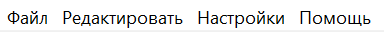

&#1056;&#1080;&#1089;&#1091;&#1085;&#1086;&#1082; 6.8 &ndash; &#1075;&#1083;&#1072;&#1074;&#1085;&#1086;&#1077; &#1084;&#1077;&#1085;&#1102; &#1087;&#1088;&#1086;&#1075;&#1088;&#1072;&#1084;&#1084;&#1099;

&#1056;&#1080;&#1089;&#1091;&#1085;&#1086;&#1082; 6.9 &ndash; &#1075;&#1083;&#1072;&#1074;&#1085;&#1099;&#1081; ToolBar &#1087;&#1088;&#1086;&#1075;&#1088;&#1072;&#1084;&#1084;&#1099;

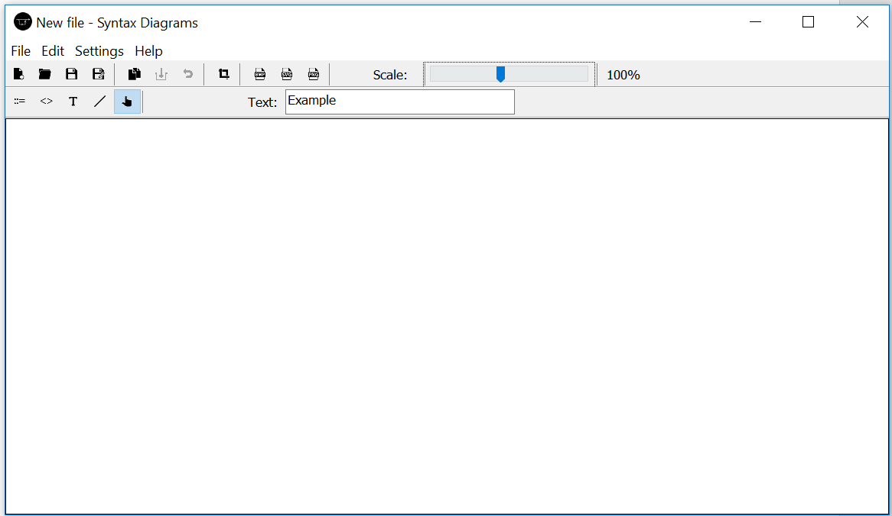

&#1056;&#1080;&#1089;&#1091;&#1085;&#1086;&#1082; 6.10 &ndash; &#1089;&#1082;&#1088;&#1080;&#1085;&#1096;&#1086;&#1090; &#1075;&#1083;&#1072;&#1074;&#1085;&#1086;&#1075;&#1086; &#1086;&#1082;&#1085;&#1072; &#1087;&#1086;&#1089;&#1083;&#1077; &#1089;&#1084;&#1077;&#1085;&#1099; &#1103;&#1079;&#1099;&#1082;&#1072;

<h1 class="c31" id="h.3tbugp1">&#1047;&#1040;&#1050;&#1051;&#1070;&#1063;&#1045;&#1053;&#1048;&#1045;</h1>
&nbsp;&nbsp;&nbsp;&nbsp;&nbsp;&nbsp;&nbsp;&nbsp;&#1042; &#1087;&#1088;&#1086;&#1094;&#1077;&#1089;&#1089;&#1077; &#1074;&#1099;&#1087;&#1086;&#1083;&#1085;&#1077;&#1085;&#1080;&#1103; &#1082;&#1091;&#1088;&#1089;&#1086;&#1074;&#1086;&#1075;&#1086; &#1087;&#1088;&#1086;&#1077;&#1082;&#1090;&#1072; &#1073;&#1099;&#1083;&#1086; &#1088;&#1072;&#1079;&#1088;&#1072;&#1073;&#1086;&#1090;&#1072;&#1085;&#1086; &#1087;&#1088;&#1080;&#1083;&#1086;&#1078;&#1077;&#1085;&#1080;&#1077;, &#1080;&#1084;&#1077;&#1102;&#1097;&#1080;&#1081; &#1076;&#1086;&#1089;&#1090;&#1072;&#1090;&#1086;&#1095;&#1085;&#1099;&#1081; &#1092;&#1091;&#1085;&#1082;&#1094;&#1080;&#1086;&#1085;&#1072;&#1083; &#1076;&#1083;&#1103; &#1087;&#1086;&#1089;&#1090;&#1088;&#1086;&#1077;&#1085;&#1080;&#1077; &#1089;&#1080;&#1085;&#1090;&#1072;&#1082;&#1089;&#1080;&#1095;&#1077;&#1089;&#1082;&#1080;&#1093; &#1076;&#1080;&#1072;&#1075;&#1088;&#1072;&#1084;&#1084;. &#1055;&#1088;&#1086;&#1075;&#1088;&#1072;&#1084;&#1084;&#1072; &#1089;&#1086;&#1076;&#1077;&#1088;&#1078;&#1080;&#1090; &#1085;&#1077; &#1090;&#1086;&#1083;&#1100;&#1082;&#1086; &#1086;&#1089;&#1085;&#1086;&#1074;&#1085;&#1099;&#1077; &#1092;&#1091;&#1085;&#1082;&#1094;&#1080;&#1080;, &#1085;&#1086; &#1080; &#1088;&#1103;&#1076; &#1076;&#1086;&#1087;&#1086;&#1083;&#1085;&#1080;&#1090;&#1077;&#1083;&#1100;&#1085;&#1099;&#1093;, &#1089;&#1087;&#1086;&#1089;&#1086;&#1073;&#1089;&#1090;&#1074;&#1091;&#1102;&#1097;&#1080;&#1093; &#1088;&#1072;&#1089;&#1096;&#1080;&#1088;&#1080;&#1090;&#1100; &#1092;&#1091;&#1085;&#1082;&#1094;&#1080;&#1086;&#1085;&#1072;&#1083; &#1087;&#1088;&#1086;&#1075;&#1088;&#1072;&#1084;&#1084;&#1085;&#1086;&#1075;&#1086; &#1089;&#1088;&#1077;&#1076;&#1089;&#1090;&#1074;&#1072; &#1080; &#1091;&#1083;&#1091;&#1095;&#1096;&#1080;&#1090;&#1100; &#1074;&#1079;&#1072;&#1080;&#1084;&#1086;&#1076;&#1077;&#1081;&#1089;&#1090;&#1074;&#1080;&#1077; &#1089; &#1087;&#1086;&#1083;&#1100;&#1079;&#1086;&#1074;&#1072;&#1090;&#1077;&#1083;&#1077;&#1084;. &#1041;&#1083;&#1072;&#1075;&#1086;&#1076;&#1072;&#1088;&#1103; &#1084;&#1091;&#1083;&#1100;&#1090;&#1080;&#1103;&#1079;&#1099;&#1095;&#1085;&#1086;&#1084;&#1091; &#1080;&#1085;&#1090;&#1077;&#1088;&#1092;&#1077;&#1081;&#1089;&#1091;, &#1087;&#1088;&#1080;&#1083;&#1086;&#1078;&#1077;&#1085;&#1080;&#1077; &#1084;&#1086;&#1078;&#1077;&#1090; &#1080;&#1089;&#1087;&#1086;&#1083;&#1100;&#1079;&#1086;&#1074;&#1072;&#1090;&#1100;&#1089;&#1103; &#1074; &#1088;&#1072;&#1079;&#1085;&#1099;&#1093; &#1089;&#1090;&#1088;&#1072;&#1085;&#1072;&#1093;.

&nbsp;&nbsp;&nbsp;&nbsp;&nbsp;&nbsp;&nbsp;&nbsp;&#1055;&#1088;&#1080; &#1090;&#1077;&#1089;&#1090;&#1080;&#1088;&#1086;&#1074;&#1072;&#1085;&#1080;&#1080; &#1080; &#1086;&#1090;&#1083;&#1072;&#1076;&#1082;&#1077; &#1085;&#1077; &#1073;&#1099;&#1083;&#1086; &#1074;&#1099;&#1103;&#1074;&#1083;&#1077;&#1085;&#1086; &#1089;&#1083;&#1091;&#1095;&#1072;&#1077;&#1074; &#1085;&#1077;&#1082;&#1086;&#1088;&#1088;&#1077;&#1082;&#1090;&#1085;&#1086;&#1081; &#1088;&#1072;&#1073;&#1086;&#1090;&#1099; &#1087;&#1088;&#1086;&#1075;&#1088;&#1072;&#1084;&#1084;&#1099;, &#1085;&#1077;&#1089;&#1090;&#1072;&#1073;&#1080;&#1083;&#1100;&#1085;&#1086;&#1081; &#1088;&#1072;&#1073;&#1086;&#1090;&#1099;, &#1087;&#1086;&#1103;&#1074;&#1083;&#1077;&#1085;&#1080;&#1103; &#1089;&#1090;&#1086;&#1088;&#1086;&#1085;&#1085;&#1080;&#1093; &#1086;&#1096;&#1080;&#1073;&#1086;&#1082; &#1080; &#1090;.&#1076;.

&nbsp;&nbsp;&nbsp;&nbsp;&nbsp;&nbsp;&nbsp;&nbsp;&#1055;&#1088;&#1086;&#1089;&#1090;&#1086;&#1081; &#1080; &#1091;&#1076;&#1086;&#1073;&#1085;&#1099;&#1081; &#1087;&#1086;&#1083;&#1100;&#1079;&#1086;&#1074;&#1072;&#1090;&#1077;&#1083;&#1100;&#1089;&#1082;&#1080;&#1081; &#1080;&#1085;&#1090;&#1077;&#1088;&#1092;&#1077;&#1081;&#1089; &#1087;&#1086;&#1079;&#1074;&#1086;&#1083;&#1103;&#1077;&#1090; &#1087;&#1086;&#1083;&#1100;&#1079;&#1086;&#1074;&#1072;&#1090;&#1077;&#1083;&#1102; &#1083;&#1077;&#1075;&#1082;&#1086; &#1087;&#1088;&#1080;&#1074;&#1099;&#1082;&#1085;&#1091;&#1090;&#1100; &#1082; &#1087;&#1088;&#1080;&#1083;&#1086;&#1078;&#1077;&#1085;&#1080;&#1102; &#1080; &#1085;&#1072;&#1095;&#1072;&#1090;&#1100; &#1088;&#1080;&#1089;&#1086;&#1074;&#1072;&#1090;&#1100; &#1076;&#1080;&#1072;&#1075;&#1088;&#1072;&#1084;&#1084;&#1099;. &#1053;&#1072;&#1083;&#1080;&#1095;&#1080;&#1077; &#1089;&#1087;&#1088;&#1072;&#1074;&#1082;&#1080; &#1087;&#1086; &#1080;&#1089;&#1087;&#1086;&#1083;&#1100;&#1079;&#1086;&#1074;&#1072;&#1085;&#1080;&#1102; &#1074; &#1089;&#1072;&#1084;&#1086;&#1084; &#1087;&#1088;&#1080;&#1083;&#1086;&#1078;&#1077;&#1085;&#1080;&#1080; &#1076;&#1077;&#1083;&#1072;&#1102;&#1090; &#1101;&#1090;&#1086;&#1090; &#1087;&#1088;&#1086;&#1094;&#1077;&#1089;&#1089; &#1077;&#1097;&#1077; &#1082;&#1072;&#1095;&#1077;&#1089;&#1090;&#1074;&#1077;&#1085;&#1085;&#1077;&#1077;. 

&nbsp;&nbsp;&nbsp;&nbsp;&nbsp;&nbsp;&nbsp;&nbsp;&#1053;&#1072;&#1087;&#1080;&#1089;&#1072;&#1085;&#1085;&#1099;&#1081; &#1082;&#1086;&#1076; &#1083;&#1077;&#1075;&#1082;&#1086; &#1084;&#1086;&#1076;&#1080;&#1092;&#1080;&#1094;&#1080;&#1088;&#1091;&#1077;&#1090;&#1089;&#1103; &#1076;&#1083;&#1103; &#1076;&#1086;&#1073;&#1072;&#1074;&#1083;&#1077;&#1085;&#1080;&#1103; &#1085;&#1086;&#1074;&#1099;&#1093; &#1092;&#1080;&#1075;&#1091;&#1088;, &#1072; &#1080;&#1079;&#1084;&#1077;&#1085;&#1077;&#1085;&#1080;&#1103; &#1074;&#1080;&#1076;&#1072; &#1084;&#1086;&#1078;&#1077;&#1090; &#1073;&#1099;&#1090;&#1100; &#1084;&#1086;&#1076;&#1080;&#1092;&#1080;&#1094;&#1080;&#1088;&#1086;&#1074;&#1072;&#1085; &#1087;&#1091;&#1090;&#1077;&#1084; &#1080;&#1079;&#1084;&#1077;&#1085;&#1077;&#1085;&#1080;&#1103; &#1082;&#1086;&#1085;&#1089;&#1090;&#1072;&#1085;&#1090;. &#1042; &#1076;&#1072;&#1083;&#1100;&#1085;&#1077;&#1081;&#1096;&#1077;&#1084; &#1074;&#1086;&#1079;&#1084;&#1086;&#1078;&#1085;&#1099; &#1091;&#1083;&#1091;&#1095;&#1096;&#1077;&#1085;&#1080;&#1103; &#1080; &#1076;&#1086;&#1088;&#1072;&#1073;&#1086;&#1090;&#1082;&#1080;, &#1074;&#1085;&#1086;&#1089;&#1103;&#1097;&#1080;&#1077; &#1085;&#1086;&#1074;&#1099;&#1081; &#1092;&#1091;&#1085;&#1082;&#1094;&#1080;&#1086;&#1085;&#1072;&#1083; &#1074; &#1087;&#1088;&#1086;&#1075;&#1088;&#1072;&#1084;&#1084;&#1091;. 

&nbsp;&nbsp;&nbsp;&nbsp;&nbsp;&nbsp;&nbsp;&nbsp;&#1042; &#1087;&#1088;&#1086;&#1094;&#1077;&#1089;&#1089;&#1077; &#1088;&#1072;&#1079;&#1088;&#1072;&#1073;&#1086;&#1090;&#1082;&#1080;, &#1103; &#1080;&#1079;&#1091;&#1095;&#1080;&#1083; &#1087;&#1088;&#1080;&#1085;&#1094;&#1080;&#1087;&#1099; &#1088;&#1072;&#1073;&#1086;&#1090;&#1099; &#1089; &#1075;&#1088;&#1072;&#1092;&#1080;&#1082;&#1086;&#1081; &#1074; &#1103;&#1079;&#1099;&#1082;&#1077; &#1087;&#1088;&#1086;&#1075;&#1088;&#1072;&#1084;&#1084;&#1080;&#1088;&#1086;&#1074;&#1072;&#1085;&#1080;&#1103; Delphi, &#1087;&#1088;&#1080;&#1085;&#1094;&#1080;&#1087; &#1088;&#1072;&#1073;&#1086;&#1090;&#1099; &#1089; &#1074;&#1077;&#1082;&#1090;&#1086;&#1088;&#1085;&#1099;&#1084; &#1092;&#1086;&#1088;&#1084;&#1072;&#1090;&#1086;&#1084; SVG &#1080; &#1085;&#1072;&#1091;&#1095;&#1080;&#1083;&#1089;&#1103; &#1087;&#1088;&#1072;&#1074;&#1080;&#1083;&#1100;&#1085;&#1086; &#1077;&#1075;&#1086; &#1079;&#1072;&#1087;&#1086;&#1083;&#1085;&#1103;&#1090;&#1100;, &#1087;&#1088;&#1080;&#1085;&#1094;&#1080;&#1087;&#1099; &#1087;&#1088;&#1072;&#1074;&#1080;&#1083;&#1100;&#1085;&#1086;&#1081; &#1086;&#1088;&#1075;&#1072;&#1085;&#1080;&#1079;&#1072;&#1094;&#1080;&#1080; &#1087;&#1086;&#1083;&#1100;&#1079;&#1086;&#1074;&#1072;&#1090;&#1077;&#1083;&#1100;&#1089;&#1082;&#1086;&#1075;&#1086; &#1080;&#1085;&#1090;&#1077;&#1088;&#1092;&#1077;&#1081;&#1089;&#1072;. &#1055;&#1086;&#1083;&#1091;&#1095;&#1077;&#1085;&#1085;&#1099;&#1077; &#1079;&#1085;&#1072;&#1085;&#1080;&#1103; &#1080; &#1086;&#1087;&#1099;&#1090; &#1087;&#1086;&#1079;&#1074;&#1086;&#1083;&#1103;&#1090; &#1083;&#1077;&#1075;&#1082;&#1086; &#1087;&#1088;&#1080;&#1084;&#1077;&#1085;&#1080;&#1090;&#1100; &#1080;&#1093; &#1074; &#1085;&#1086;&#1074;&#1099;&#1093; &#1087;&#1088;&#1086;&#1077;&#1082;&#1090;&#1072;&#1093;.

&nbsp;&nbsp;&nbsp;&nbsp;&nbsp;&nbsp;&nbsp;&nbsp;&#1056;&#1072;&#1079;&#1088;&#1072;&#1073;&#1086;&#1090;&#1072;&#1085;&#1085;&#1086;&#1077; &#1087;&#1088;&#1086;&#1075;&#1088;&#1072;&#1084;&#1084;&#1085;&#1086;&#1077; &#1089;&#1088;&#1077;&#1076;&#1089;&#1090;&#1074;&#1086; &#1084;&#1086;&#1078;&#1085;&#1086; &#1087;&#1088;&#1080;&#1084;&#1077;&#1085;&#1103;&#1090;&#1100; &#1082;&#1072;&#1082; &#1074; &#1086;&#1073;&#1091;&#1095;&#1072;&#1102;&#1097;&#1080;&#1093; &#1094;&#1077;&#1083;&#1103;&#1093; (&#1053;&#1072;&#1087;&#1088;&#1080;&#1084;&#1077;&#1088;: &#1076;&#1083;&#1103; &#1080;&#1079;&#1091;&#1095;&#1077;&#1085;&#1080;&#1103; &#1089;&#1090;&#1091;&#1076;&#1077;&#1085;&#1090;&#1072;&#1084;&#1080; &#1085;&#1086;&#1074;&#1086;&#1075;&#1086; &#1103;&#1079;&#1099;&#1082;&#1072; &#1087;&#1088;&#1086;&#1075;&#1088;&#1072;&#1084;&#1084;&#1080;&#1088;&#1086;&#1074;&#1072;&#1085;&#1080;&#1103;), &#1090;&#1072;&#1082; &#1080; &#1088;&#1072;&#1079;&#1088;&#1072;&#1073;&#1086;&#1090;&#1095;&#1080;&#1082;&#1072;&#1084;&#1080; &#1103;&#1079;&#1099;&#1082;&#1086;&#1074; &#1087;&#1088;&#1086;&#1075;&#1088;&#1072;&#1084;&#1084;&#1080;&#1088;&#1086;&#1074;&#1072;&#1085;&#1080;&#1103; &#1080; &#1082;&#1086;&#1084;&#1087;&#1080;&#1083;&#1103;&#1090;&#1086;&#1088;&#1086;&#1074; &#1076;&#1083;&#1103; &#1090;&#1086;&#1075;&#1086;, &#1095;&#1090;&#1086;&#1073;&#1099; &#1085;&#1072;&#1075;&#1083;&#1103;&#1076;&#1085;&#1077;&#1077; &#1086;&#1087;&#1080;&#1089;&#1072;&#1090;&#1100; &#1089;&#1080;&#1085;&#1090;&#1072;&#1082;&#1089;&#1080;&#1089; &#1103;&#1079;&#1099;&#1082;&#1072; &#1074; &#1089;&#1087;&#1088;&#1072;&#1074;&#1086;&#1095;&#1085;&#1099;&#1093; &#1084;&#1072;&#1090;&#1077;&#1088;&#1080;&#1072;&#1083;&#1072;&#1093;. 

<h1 class="c31" id="h.28h4qwu">&#1057;&#1055;&#1048;&#1057;&#1054;&#1050; &#1051;&#1048;&#1058;&#1045;&#1056;&#1040;&#1058;&#1059;&#1056;&#1067;</h1>
[1] &#1043;&#1083;&#1091;&#1093;&#1086;&#1074;&#1072;, &#1051;.&#1040;. &#1054;&#1089;&#1085;&#1086;&#1074;&#1099; &#1072;&#1083;&#1075;&#1086;&#1088;&#1080;&#1090;&#1084;&#1080;&#1079;&#1072;&#1094;&#1080;&#1080; &#1080; &#1087;&#1088;&#1086;&#1075;&#1088;&#1072;&#1084;&#1084;&#1080;&#1088;&#1086;&#1074;&#1072;&#1085;&#1080;&#1103;: &#1091;&#1095;&#1077;&#1073;&#1085;&#1086;&#1077; &#1087;&#1086;&#1089;&#1086;&#1073;&#1080;&#1077;. &#1042; 2 &#1063;. / &#1051;.&#1040;. &#1043;&#1083;&#1091;&#1093;&#1086;&#1074;&#1072;. &ndash; &#1041;&#1043;&#1059;&#1048;&#1056;, 2006 &ndash; &#1063;. 1. &ndash; 195 &#1089;.

[2]&nbsp;&#1044;&#1086;&#1082;&#1091;&#1084;&#1077;&#1085;&#1090;&#1072;&#1094;&#1080;&#1103; &#1087;&#1086; SVG &ndash; MSDN [&#1069;&#1083;&#1077;&#1082;&#1090;&#1088;&#1086;&#1085;&#1085;&#1099;&#1081; &#1088;&#1077;&#1089;&#1091;&#1088;&#1089;] &#1056;&#1077;&#1078;&#1080;&#1084; &#1076;&#1086;&#1089;&#1090;&#1091;&#1087;&#1072;: https://msdn.microsoft.com/library/bg124132(v=vs.85).aspx &mdash; &#1044;&#1072;&#1090;&#1072; &#1076;&#1086;&#1089;&#1090;&#1091;&#1087;&#1072;: 06.04.18

&nbsp;[3]&nbsp;SVG &ndash; MDN web docs [&#1069;&#1083;&#1077;&#1082;&#1090;&#1088;&#1086;&#1085;&#1085;&#1099;&#1081; &#1088;&#1077;&#1089;&#1091;&#1088;&#1089;] &#1056;&#1077;&#1078;&#1080;&#1084; &#1076;&#1086;&#1089;&#1090;&#1091;&#1087;&#1072;: https://developer.mozilla.org/docs/Web/SVG#Documentation&nbsp;&mdash; &#1044;&#1072;&#1090;&#1072; &#1076;&#1086;&#1089;&#1090;&#1091;&#1087;&#1072;: 04.04.18

[4]&nbsp;Help for RAD Studio 10.2 Tokyo [&#1069;&#1083;&#1077;&#1082;&#1090;&#1088;&#1086;&#1085;&#1085;&#1099;&#1081; &#1088;&#1077;&#1089;&#1091;&#1088;&#1089;] &#1056;&#1077;&#1078;&#1080;&#1084; &#1076;&#1086;&#1089;&#1090;&#1091;&#1087;&#1072;: http://docwiki.embarcadero.com/RADStudio/Tokyo/en/Main_Page&mdash; &#1044;&#1072;&#1090;&#1072; &#1076;&#1086;&#1089;&#1090;&#1091;&#1087;&#1072;: 16.04.18

[5] &#1040;.&#1053;.&#1042;&#1072;&#1083;&#1100;&#1074;&#1072;&#1095;&#1077;&#1074;, &#1050;.&#1040;.&#1057;&#1091;&#1088;&#1082;&#1086;&#1074;, &#1044;.&#1040;.&#1057;&#1091;&#1088;&#1082;&#1086;&#1074;, &#1070;.&#1052;.&#1063;&#1077;&#1090;&#1099;&#1088;&#1100;&#1082;&#1086;. &#1055;&#1088;&#1086;&#1075;&#1088;&#1072;&#1084;&#1084;&#1080;&#1088;&#1086;&#1074;&#1072;&#1085;&#1080;&#1077; &#1085;&#1072; &#1103;&#1079;&#1099;&#1082;&#1077; Delphi. &#1059;&#1095;&#1077;&#1073;&#1085;&#1086;&#1077; &#1087;&#1086;&#1089;&#1086;&#1073;&#1080;&#1077;[&#1069;&#1083;&#1077;&#1082;&#1090;&#1088;&#1086;&#1085;&#1085;&#1099;&#1081; &#1088;&#1077;&#1089;&#1091;&#1088;&#1089;] &#1056;&#1077;&#1078;&#1080;&#1084; &#1076;&#1086;&#1089;&#1090;&#1091;&#1087;&#1072;: http://www.rsdn.ru/?summary/3165.xml. &#1044;&#1072;&#1090;&#1072; &#1076;&#1086;&#1089;&#1090;&#1091;&#1087;&#1072;: 20.04.18

<h1 class="c31" id="h.nmf14n">&#1055;&#1056;&#1048;&#1051;&#1054;&#1046;&#1045;&#1053;&#1048;&#1045; 1</h1>
&#1057;&#1093;&#1077;&#1084;&#1072; &#1072;&#1083;&#1075;&#1086;&#1088;&#1080;&#1090;&#1084;&#1072; &#1088;&#1072;&#1073;&#1086;&#1090;&#1099; &#1087;&#1088;&#1086;&#1075;&#1088;&#1072;&#1084;&#1084;&#1099;

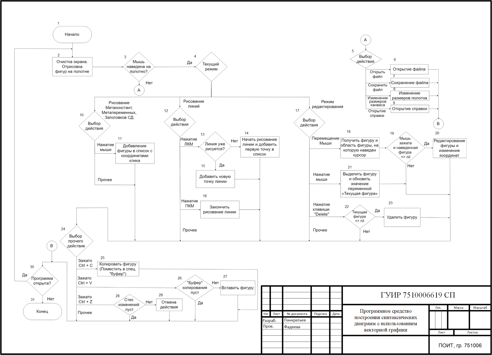
<h1 class="c31" id="h.37m2jsg">&#1055;&#1056;&#1048;&#1051;&#1054;&#1046;&#1045;&#1053;&#1048;&#1045; 2</h1>
&#1048;&#1089;&#1093;&#1086;&#1076;&#1085;&#1099;&#1081; &#1082;&#1086;&#1076; &#1087;&#1088;&#1086;&#1075;&#1088;&#1072;&#1084;&#1084;&#1099;

&#1052;&#1086;&#1076;&#1091;&#1083;&#1100; &#1075;&#1083;&#1072;&#1074;&#1085;&#1086;&#1081; &#1092;&#1086;&#1088;&#1084;&#1099;:

unit Main;

interface

uses

&nbsp; Winapi.Windows, Winapi.Messages, System.SysUtils, System.Variants, System.Classes, Vcl.Graphics,

&nbsp; Vcl.Controls, Vcl.Forms, Vcl.Dialogs, Vcl.ExtCtrls, Vcl.StdCtrls, math,

&nbsp; Vcl.Menus, Data.Types, View.Canvas, Data.InitData, Model, View.SVG, Vcl.Buttons,

&nbsp; System.Actions, Vcl.ActnList, System.ImageList, Vcl.ImgList,

&nbsp; Vcl.Imaging.pngimage, Vcl.ComCtrls, Vcl.ToolWin, Model.UndoStack, Model.Lines;

type

&nbsp; TEditorForm = class(TForm)

&nbsp; &nbsp; edtRectText: TEdit;

&nbsp; &nbsp; MainMenu: TMainMenu;

&nbsp; &nbsp; mnFile: TMenuItem;

&nbsp; &nbsp; mniSave: TMenuItem;

&nbsp; &nbsp; mniOpen: TMenuItem;

&nbsp; &nbsp; OpenDialog1: TOpenDialog;

&nbsp; &nbsp; SaveDialog1: TSaveDialog;

&nbsp; &nbsp; mniToSVG: TMenuItem;

&nbsp; &nbsp; pbMain: TPaintBox;

&nbsp; &nbsp; mniExportToBMP: TMenuItem;

&nbsp; &nbsp; mniExport: TMenuItem;

&nbsp; &nbsp; mniSaveAs: TMenuItem;

&nbsp; &nbsp; mnSettings: TMenuItem;

&nbsp; &nbsp; mniHolstSize: TMenuItem;

&nbsp; &nbsp; sbMain: TScrollBox;

&nbsp; &nbsp; mniHtml: TMenuItem;

&nbsp; &nbsp; mniWhatIsSD: TMenuItem;

&nbsp; &nbsp; mniNew: TMenuItem;

&nbsp; &nbsp; alMenu: TActionList;

&nbsp; &nbsp; actNew: TAction;

&nbsp; &nbsp; actOpen: TAction;

&nbsp; &nbsp; actSave: TAction;

&nbsp; &nbsp; actSaveAs: TAction;

&nbsp; &nbsp; actExportBMP: TAction;

&nbsp; &nbsp; actExportSVG: TAction;

&nbsp; &nbsp; actCopy: TAction;

&nbsp; &nbsp; mniEdit: TMenuItem;

&nbsp; &nbsp; mniCopy: TMenuItem;

&nbsp; &nbsp; actPast: TAction;

&nbsp; &nbsp; mniPast: TMenuItem;

&nbsp; &nbsp; ilMenu: TImageList;

&nbsp; &nbsp; actCanvasSize: TAction;

&nbsp; &nbsp; actAboutSB: TAction;

&nbsp; &nbsp; tbarMenu: TToolBar;

&nbsp; &nbsp; tbNew: TToolButton;

&nbsp; &nbsp; tbOpen: TToolButton;

&nbsp; &nbsp; tbSave: TToolButton;

&nbsp; &nbsp; tbSaveAs: TToolButton;

&nbsp; &nbsp; ToolButton5: TToolButton;

&nbsp; &nbsp; tbCopy: TToolButton;

&nbsp; &nbsp; tbPast: TToolButton;

&nbsp; &nbsp; ToolButton1: TToolButton;

&nbsp; &nbsp; tbBMP: TToolButton;

&nbsp; &nbsp; tbSVG: TToolButton;

&nbsp; &nbsp; tbSelectFigType: TToolBar;

&nbsp; &nbsp; tbFigDef: TToolButton;

&nbsp; &nbsp; tbFigMV: TToolButton;

&nbsp; &nbsp; tbFigConst: TToolButton;

&nbsp; &nbsp; tbFigLine: TToolButton;

&nbsp; &nbsp; tbFigNone: TToolButton;

&nbsp; &nbsp; ilFigures: TImageList;

&nbsp; &nbsp; alSelectFigure: TActionList;

&nbsp; &nbsp; actFigNone: TAction;

&nbsp; &nbsp; actFigLine: TAction;

&nbsp; &nbsp; actFigDef: TAction;

&nbsp; &nbsp; actFigMetaVar: TAction;

&nbsp; &nbsp; actFigMetaConst: TAction;

&nbsp; &nbsp; lblEnterText: TLabel;

&nbsp; &nbsp; tbSelectScale: TTrackBar;

&nbsp; &nbsp; lblScale: TLabel;

&nbsp; &nbsp; lblScaleView: TLabel;

&nbsp; &nbsp; actUndo: TAction;

&nbsp; &nbsp; mniUndo: TMenuItem;

&nbsp; &nbsp; ToolButton2: TToolButton;

&nbsp; &nbsp; actHelp: TAction;

&nbsp; &nbsp; mniProgramHelp: TMenuItem;

&nbsp; &nbsp; actPNG: TAction;

&nbsp; &nbsp; mniPNGExport: TMenuItem;

&nbsp; &nbsp; tbPNG: TToolButton;

&nbsp; &nbsp; actResizeCanvas: TAction;

&nbsp; &nbsp; tbResizeCanvas: TToolButton;

&nbsp; &nbsp; ToolButton4: TToolButton;

&nbsp; &nbsp; actChangeMagnetize: TAction;

&nbsp; &nbsp; mniMagnetizeLine: TMenuItem;

&nbsp; &nbsp; procedure FormCreate(Sender: TObject);

&nbsp; &nbsp; procedure clearScreen;

&nbsp; &nbsp; procedure pbMainMouseUp(Sender: TObject; Button: TMouseButton;

&nbsp; &nbsp; &nbsp; Shift: TShiftState; X, Y: Integer);

&nbsp; &nbsp; procedure pbMainMouseDown(Sender: TObject; Button: TMouseButton;

&nbsp; &nbsp; &nbsp; Shift: TShiftState; X, Y: Integer);

&nbsp; &nbsp; procedure pbMainMouseMove(Sender: TObject; Shift: TShiftState; X, Y: Integer);

&nbsp; &nbsp; procedure FormKeyDown(Sender: TObject; var Key: Word; Shift: TShiftState);

&nbsp; &nbsp; procedure changeEditorText(newtext: string);

&nbsp; &nbsp; procedure FormResize(Sender: TObject);

&nbsp; &nbsp; function &nbsp;saveBrakhFile:boolean;

&nbsp; &nbsp; procedure saveSVGFile;

&nbsp; &nbsp; procedure pbMainPaint(Sender: TObject);

&nbsp; &nbsp; procedure saveBMPFile;

&nbsp; &nbsp; procedure savePNGFile;

&nbsp; &nbsp; procedure endDrawLine;

&nbsp; &nbsp; procedure FormClose(Sender: TObject; var Action: TCloseAction);

&nbsp; &nbsp; procedure mniNewClick(Sender: TObject);

&nbsp; &nbsp; procedure sbMainMouseWheelDown(Sender: TObject; Shift: TShiftState;

&nbsp; &nbsp; &nbsp; MousePos: TPoint; var Handled: Boolean);

&nbsp; &nbsp; procedure sbMainMouseWheelUp(Sender: TObject; Shift: TShiftState;

&nbsp; &nbsp; &nbsp; MousePos: TPoint; var Handled: Boolean);

&nbsp; &nbsp; procedure FormKeyPress(Sender: TObject; var Key: Char);

&nbsp; &nbsp; procedure actNewExecute(Sender: TObject);

&nbsp; &nbsp; procedure actOpenExecute(Sender: TObject);

&nbsp; &nbsp; procedure actSaveExecute(Sender: TObject);

&nbsp; &nbsp; procedure actSaveAsExecute(Sender: TObject);

&nbsp; &nbsp; procedure actExportBMPExecute(Sender: TObject);

&nbsp; &nbsp; procedure actExportSVGExecute(Sender: TObject);

&nbsp; &nbsp; procedure actCopyExecute(Sender: TObject);

&nbsp; &nbsp; procedure actPastExecute(Sender: TObject);

&nbsp; &nbsp; procedure actCanvasSizeExecute(Sender: TObject);

&nbsp; &nbsp; procedure actAboutSBExecute(Sender: TObject);

&nbsp; &nbsp; procedure actFigNoneExecute(Sender: TObject);

&nbsp; &nbsp; procedure actFigLineExecute(Sender: TObject);

&nbsp; &nbsp; procedure actFigDefExecute(Sender: TObject);

&nbsp; &nbsp; procedure actFigMetaVarExecute(Sender: TObject);

&nbsp; &nbsp; procedure actFigMetaConstExecute(Sender: TObject);

&nbsp; &nbsp; procedure tbSelectScaleChange(Sender: TObject);

&nbsp; &nbsp; procedure actUndoExecute(Sender: TObject);

&nbsp; &nbsp; procedure actHelpExecute(Sender: TObject);

&nbsp; &nbsp; procedure actPNGExecute(Sender: TObject);

&nbsp; &nbsp; procedure Action1Execute(Sender: TObject);

&nbsp; &nbsp; procedure FormDestroy(Sender: TObject);

&nbsp; &nbsp; procedure actResizeCanvasExecute(Sender: TObject);

&nbsp; &nbsp; procedure sbMainMouseMove(Sender: TObject; Shift: TShiftState; X,

&nbsp; &nbsp; &nbsp; Y: Integer);

&nbsp; &nbsp; procedure sbMainMouseDown(Sender: TObject; Button: TMouseButton;

&nbsp; &nbsp; &nbsp; Shift: TShiftState; X, Y: Integer);

&nbsp; &nbsp; procedure actChangeMagnetizeExecute(Sender: TObject);

&nbsp; &nbsp; 

&nbsp; private

&nbsp; &nbsp; isChanged: Boolean;

&nbsp; &nbsp; currpath: string;

&nbsp; &nbsp; isMoveFigure: Boolean;

&nbsp; &nbsp; oldDM: TDrawMode;

&nbsp; &nbsp; USVertex: PUndoStack; // US - Undo Stack

&nbsp; &nbsp; procedure switchChangedStatus(flag: Boolean);

&nbsp; &nbsp; procedure changePath(path: string);

&nbsp; &nbsp; procedure newFile;

&nbsp; &nbsp; procedure updateCanvasSizeWithCoords(x,y: Integer);

&nbsp; public

&nbsp; &nbsp; PBW, PBH: integer;

&nbsp; &nbsp; FScale: Real;

&nbsp; &nbsp; procedure useScale(var x,y: integer);

&nbsp; &nbsp; procedure DiscardScale(var x,y: integer);

&nbsp; &nbsp; procedure SD_Resize;

&nbsp; &nbsp; function getFigureHead:PFigList;

&nbsp; &nbsp; function openFile(mode: TFileMode):string;

&nbsp; &nbsp; function saveFile(mode: TFileMode):string;

&nbsp; &nbsp; procedure changeCanvasSize(w,h: Integer; flag: Boolean = true);

&nbsp; &nbsp; procedure getCanvasSIze(var w,h:Integer);

&nbsp; end;

var

&nbsp; EditorForm: TEditorForm;

&nbsp; FigHead: PFigList;

&nbsp; CurrType: TType;

&nbsp; CurrLineType: TLineType;

&nbsp; CurrFigure, ClickFigure: PFigList;

&nbsp; tempX, tempY: integer;

&nbsp; DM: TDrawMode;

&nbsp; EM: TEditMode;

&nbsp; prevText:String;

&nbsp; currPointAdr: PPointsList;

&nbsp; CoppyFigure: PFigList;

&nbsp; //FT: TFigureType;

implementation

{$R *.dfm}

{$R HTML.RES}

{$R+}

{$R-}

uses FCanvasSizeSettings, FHtmlView, Model.Files;

procedure TEditorForm.changeEditorText(newtext: string);

begin

&nbsp; edtRectText.text := newtext

end;

procedure TEditorForm.switchChangedStatus(flag: Boolean);

begin

&nbsp; isChanged := flag;

end;

// Select the scale of the image

procedure TEditorForm.tbSelectScaleChange(Sender: TObject);

begin

&nbsp; case (Sender as TTrackBar).Position of

&nbsp; &nbsp; 1: FScale := 0.1;

&nbsp; &nbsp; 2: FScale := 0.3;

&nbsp; &nbsp; 3: FScale := 0.5;

&nbsp; &nbsp; 4: FScale := 0.8;

&nbsp; &nbsp; 5: FScale := 1;

&nbsp; &nbsp; 6: FScale := 1.2;

&nbsp; &nbsp; 7: FScale := 1.5;

&nbsp; &nbsp; 8: FScale := 1.7;

&nbsp; &nbsp; 9: FScale := 2;

&nbsp; &nbsp; 10: FScale := 4;

&nbsp; end;

&nbsp; lblScaleView.Caption := &#39; &nbsp;&#39; + IntToStr( Round(FScale*100) ) + &#39;%&#39;;

&nbsp; changeCanvasSize(PBW, PBH);

&nbsp; Self.Invalidate;

end;

procedure TEditorForm.updateCanvasSizeWithCoords(x, y: Integer);

begin

&nbsp; pbMain.Width := x;

&nbsp; pbMain.Height := y; 

&nbsp; pbMain.Repaint;

end;

procedure TEditorForm.useScale(var x, y: integer);

begin

&nbsp; x := Round(FScale*x);

&nbsp; y := Round(FScale*y);

end;

procedure TEditorForm.pbMainMouseDown(Sender: TObject; Button: TMouseButton;

&nbsp; Shift: TShiftState; X, Y: Integer);

var x0, y0: Integer;

&nbsp; UndoRec: TUndoStackInfo;

begin &nbsp;

&nbsp; x0 := x;

&nbsp; y0 := y;

&nbsp; roundCoords(x,y); // round coords (Use steps)

&nbsp; 

&nbsp; if dm = DrawLine then

&nbsp; begin

&nbsp; &nbsp; case button of

&nbsp; &nbsp; &nbsp; TMouseButton.mbLeft:

&nbsp; &nbsp; &nbsp; begin

&nbsp; &nbsp; &nbsp; &nbsp; // Add new point of current line:

&nbsp; &nbsp; &nbsp; &nbsp; UndoRec.PrevPointAdr := addNewPoint( CurrFigure^.Info.PointHead, Round(x / FScale),Round(y / FScale));

&nbsp; &nbsp; &nbsp; &nbsp; // CHANGES STASCK PUSHING START

&nbsp; &nbsp; &nbsp; &nbsp; UndoRec.ChangeType := chAddPoint;

&nbsp; &nbsp; &nbsp; &nbsp; UndoRec.adr := CurrFigure;

&nbsp; &nbsp; &nbsp; &nbsp; UndoStackPush(USVertex, UndoRec);

&nbsp; &nbsp; &nbsp; &nbsp; isChanged := true;

&nbsp; &nbsp; &nbsp; &nbsp; actUndo.Enabled := true;

&nbsp; &nbsp; &nbsp; &nbsp; // CHANGES STASCK PUSHING END

&nbsp; &nbsp; &nbsp; end;

&nbsp; &nbsp; &nbsp; // If clicked button - right or middle then finish drawing

&nbsp; &nbsp; &nbsp; TMouseButton.mbRight: 

&nbsp; &nbsp; &nbsp; begin

&nbsp; &nbsp; &nbsp; &nbsp; // Remove lines with one point

&nbsp; &nbsp; &nbsp; &nbsp; endDrawLine;

&nbsp; &nbsp; &nbsp; end;

&nbsp; &nbsp; &nbsp; TMouseButton.mbMiddle: endDrawLine;

&nbsp; &nbsp; end;

&nbsp; end

&nbsp; else

&nbsp; &nbsp; DM := Draw; // Begin Drawing

&nbsp; // If 

&nbsp; if (EM = NoEdit) and (CurrType &lt;&gt; None) then

&nbsp; begin

&nbsp; &nbsp; isChanged := true;

&nbsp; &nbsp; // if at the moment nothing draws, start drawing

&nbsp; &nbsp; if CurrType &lt;&gt; Line then

&nbsp; &nbsp; begin

&nbsp; &nbsp; &nbsp; // Add new figure to canvas

&nbsp; &nbsp; &nbsp; CurrFigure := addFigure(FigHead, Round(x/FScale),Round(y/FSCale), CurrType, edtRectText.Text);

&nbsp; &nbsp; &nbsp; // CHANGES STACK PUSHING START

&nbsp; &nbsp; &nbsp; UndoRec.ChangeType := chInsert;

&nbsp; &nbsp; &nbsp; UndoRec.adr := Currfigure;

&nbsp; &nbsp; &nbsp; CurrFigure.Info.y1 := y - abs(CurrFigure.Info.y1 - CurrFigure.Info.y2) div 2;

&nbsp; &nbsp; &nbsp; UndoStackPush(USVertex, UndoRec);

&nbsp; &nbsp; &nbsp; actUndo.Enabled := true;

&nbsp; &nbsp; &nbsp; // CHANGES STACK PUSHING END

&nbsp; &nbsp; end

&nbsp; &nbsp; else if (DM &lt;&gt; DrawLine) and (Button = mbLeft) then

&nbsp; &nbsp; begin

&nbsp; &nbsp; &nbsp; // Add new lines to canvas

&nbsp; &nbsp; &nbsp; CurrFigure := addLine(FigHead, Round(x/FScale),Round(y/FScale));

&nbsp; &nbsp; &nbsp; // CHANGES STASCK PUSHING START

&nbsp; &nbsp; &nbsp; UndoRec.ChangeType := chInsert;

&nbsp; &nbsp; &nbsp; UndoRec.adr := Currfigure;

&nbsp; &nbsp; &nbsp; DM := DrawLine;

&nbsp; &nbsp; &nbsp; UndoStackPush(USVertex, UndoRec);

&nbsp; &nbsp; &nbsp; actUndo.Enabled := true;

&nbsp; &nbsp; &nbsp; // CHANGES STASCK PUSHING END

&nbsp; &nbsp; end;

&nbsp; end

&nbsp; else

&nbsp; begin

&nbsp; &nbsp; tempx:= x; // Update coordinates for moving

&nbsp; &nbsp; tempy:= y;

&nbsp; end;

&nbsp; // If the click occurred on the figure, we put the current variable in the 

&nbsp; // appropriate variable

&nbsp; ClickFigure := getClickFigure(Round(x0/FScale) ,Round(y0/FScale), FigHead);

&nbsp; if (ClickFigure &lt;&gt; nil) and (ClickFigure^.Info.tp &lt;&gt; line) and (CurrFigure &lt;&gt; nil)

&nbsp; &nbsp; &nbsp; &nbsp; and (CurrFigure^.Info.tp &lt;&gt; line) then

&nbsp; begin

&nbsp; &nbsp; // We paste into the text field with the text of the figure the text of the current shape

&nbsp; &nbsp; changeEditorText(String(ClickFigure^.Info.Txt));

&nbsp; end

&nbsp; else

&nbsp; begin

&nbsp; &nbsp; changeEditorText(prevText);

&nbsp; end;

end;

procedure changeCursor(ScrollBox:TScrollBox; Mode: TEditMode);

begin

&nbsp; case mode of

&nbsp; &nbsp; NoEdit: ScrollBox.Cursor := crArrow;

&nbsp; &nbsp; Move: ScrollBox.Cursor := crSizeAll;

&nbsp; &nbsp; TSide: ScrollBox.Cursor := crSizeNS;

&nbsp; &nbsp; BSide: ScrollBox.Cursor := crSizeNS;

&nbsp; &nbsp; RSide: ScrollBox.Cursor := crSizeWE;

&nbsp; &nbsp; LSide: ScrollBox.Cursor := crSizeWE;

&nbsp; &nbsp; Vert1: ScrollBox.Cursor := crSizeNWSE;

&nbsp; &nbsp; Vert2: ScrollBox.Cursor := crSizeNESW;

&nbsp; &nbsp; Vert3: ScrollBox.Cursor := crSizeNESW;

&nbsp; &nbsp; Vert4: ScrollBox.Cursor := crSizeNWSE;

&nbsp; &nbsp; LineMove: ScrollBox.Cursor := crHandPoint;

&nbsp; end;

end;

// Return canvas size

procedure TEditorForm.getCanvasSIze(var w, h: Integer);

begin

&nbsp; w := Self.pbMain.Width;

&nbsp; h := self.pbMain.Height;

end;

// Return figure head

function TEditorForm.getFigureHead:PFigList;

begin

&nbsp; Result:= FigHead;

end;

procedure TEditorForm.pbMainMouseMove(Sender: TObject; Shift: TShiftState; X,

&nbsp; Y: Integer);

var

&nbsp; undorec: TUndoStackInfo;

begin &nbsp;

&nbsp; if dm = ResizeCanvas then

&nbsp; begin

&nbsp; &nbsp; updateCanvasSizeWithCoords(x, y);

&nbsp; &nbsp; exit;

&nbsp; end;

&nbsp; 

&nbsp; if clickfigure = nil then

&nbsp; &nbsp; prevText:= edtRectText.Text;

&nbsp; if (CurrType &lt;&gt; Line) and (DM = DrawLine) then

&nbsp; &nbsp; DM := nodraw;

&nbsp; if (dm = NoDraw) and (CurrType = None) then

&nbsp; begin

&nbsp; 

&nbsp; &nbsp; EM := getEditMode(DM, Round(x/FScale),Round(y/FScale),FigHead, CurrType);

&nbsp; &nbsp; changeCursor(sbMain, EM); // &#1052;&#1077;&#1085;&#1103;&#1077;&#1084; &#1082;&#1091;&#1088;&#1089;&#1086;&#1088; &#1074; &#1079;&#1072;&#1074;&#1080;&#1089;&#1080;&#1084;&#1086;&#1089;&#1090;&#1080; &#1086;&#1090; &#1087;&#1086;&#1083;&#1086;&#1078;&#1077;&#1085;&#1080;&#1103; &#1084;&#1099;&#1096;&#1080;

&nbsp; &nbsp; if ClickFigure &lt;&gt; nil then

&nbsp; &nbsp; begin

&nbsp; &nbsp; &nbsp; selectFigure(pbMain.Canvas, ClickFigure); // add green verts for selected figure

&nbsp; &nbsp; end;

&nbsp; end;

&nbsp; if (DM = draw) and (currfigure &lt;&gt; nil) &nbsp;then

&nbsp; begin

&nbsp; &nbsp; if not isMoveFigure then

&nbsp; &nbsp; begin

&nbsp; &nbsp; &nbsp; // START MOVING

&nbsp; &nbsp; &nbsp; // CHANGES STACK PUSHING START

&nbsp; &nbsp; &nbsp; isMoveFigure := true;

&nbsp; &nbsp; &nbsp; undorec.adr := CurrFigure;

&nbsp; &nbsp; &nbsp; if CurrFigure^.Info.tp &lt;&gt; Line then

&nbsp; &nbsp; &nbsp; begin

&nbsp; &nbsp; &nbsp; &nbsp; undorec.ChangeType := chFigMove;

&nbsp; &nbsp; &nbsp; &nbsp; undorec.PrevInfo := CurrFigure^.Info;

&nbsp; &nbsp; &nbsp; end

&nbsp; &nbsp; &nbsp; else

&nbsp; &nbsp; &nbsp; begin

&nbsp; &nbsp; &nbsp; &nbsp; undorec.ChangeType := chPointMove;

&nbsp; &nbsp; &nbsp; &nbsp; undorec.st := pointsToStr(CurrFigure^.Info.PointHead^.adr);

&nbsp; &nbsp; &nbsp; end;

&nbsp; &nbsp; &nbsp; UndoStackPush(USVertex, undorec);

&nbsp; &nbsp; &nbsp; actUndo.Enabled := true;

&nbsp; &nbsp; &nbsp; // CHANGES STACK PUSHING END

&nbsp; &nbsp; end;

&nbsp; &nbsp; switchChangedStatus(TRUE); 

&nbsp; &nbsp; ChangeCoords(CurrFigure, EM, x,y, tempX, tempY ); // Changes coords

&nbsp; &nbsp; 

&nbsp; &nbsp; TempX:= X; // Update old coords

&nbsp; &nbsp; TempY:= Y;

&nbsp; &nbsp; pbMain.Repaint;

&nbsp; end;

end;

procedure TEditorForm.pbMainMouseUp(Sender: TObject; Button: TMouseButton;

&nbsp; Shift: TShiftState; X, Y: Integer);

begin

&nbsp; if DM &lt;&gt; DrawLine then

&nbsp; begin

&nbsp; &nbsp; DM := NoDraw; // End draw

&nbsp; &nbsp; checkFigureCoord(CurrFigure);

&nbsp; end;

&nbsp; if isMoveFigure then

&nbsp; begin

&nbsp; &nbsp; if mniMagnetizeLine.Checked then &nbsp; &nbsp;

&nbsp; &nbsp; &nbsp; SearchFiguresInOneLine(FigHead, CurrFigure);

&nbsp; &nbsp; isMoveFigure := false;

&nbsp; end;

&nbsp; if mniMagnetizeLine.Checked then &nbsp; &nbsp;

&nbsp; &nbsp; MagnetizeLines(FigHead);

&nbsp; 

&nbsp; Self.pbMain.Repaint;

&nbsp; pbMain.Repaint;

end;

procedure TEditorForm.pbMainPaint(Sender: TObject);

begin

&nbsp; with (Sender as TPaintBox) do

&nbsp; begin

&nbsp; &nbsp; clearScreen;

&nbsp; &nbsp; drawFigure(Canvas, FigHead, FScale); // Draw all figures, lines

&nbsp; end;

end;

procedure TEditorForm.clearScreen;

begin

&nbsp; if DM = ResizeCanvas then

&nbsp; begin

&nbsp; &nbsp; pbMain.Canvas.Pen.Width := 1;

&nbsp; &nbsp; pbmain.Canvas.Pen.Style := psDash;

&nbsp; &nbsp; pbMain.Canvas.Pen.Color := clBlack;

&nbsp; end

&nbsp; else

&nbsp; begin

&nbsp; &nbsp; pbMain.Canvas.Pen.Width := 1;

&nbsp; &nbsp; pbMain.Canvas.Pen.Style := psSolid;

&nbsp; &nbsp; pbMain.Canvas.Pen.Color := clBlack; &nbsp; &nbsp;

&nbsp; end;

&nbsp; 

&nbsp; pbMain.Canvas.Rectangle(0,0,pbMain.Width,pbMain.Height); // Draw white rectangle :)

end;

procedure TEditorForm.DiscardScale(var x, y: integer);

begin

&nbsp; x := Round(x/FScale);

&nbsp; y := Round(y/FScale);

end;

procedure TEditorForm.endDrawLine;

begin

&nbsp; removeTrashLines(FigHead, CurrFigure); 

&nbsp; dm:=NoDraw;

&nbsp; pbMain.Repaint;

end;

procedure TEditorForm.FormClose(Sender: TObject; var Action: TCloseAction);

var

&nbsp;answer: integer;

begin

&nbsp; if isChanged then

&nbsp; begin

&nbsp; &nbsp; answer := MessageDlg(rsExitDlg,mtCustom,

&nbsp; &nbsp; &nbsp; &nbsp; &nbsp; &nbsp; &nbsp; &nbsp; &nbsp; &nbsp; &nbsp; &nbsp; &nbsp; &nbsp; &nbsp; [mbYes,mbNo,mbCancel], 0);

&nbsp; &nbsp; case answer of

&nbsp; &nbsp; &nbsp; mrYes:

&nbsp; &nbsp; &nbsp; begin

&nbsp; &nbsp; &nbsp; &nbsp; if saveBrakhFile then

&nbsp; &nbsp; &nbsp; &nbsp; &nbsp; Action := caFree

&nbsp; &nbsp; &nbsp; &nbsp; else

&nbsp; &nbsp; &nbsp; &nbsp; &nbsp; Action := caNone;

&nbsp; &nbsp; &nbsp; end;

&nbsp; &nbsp; &nbsp; mrNo: Action := caFree;

&nbsp; &nbsp; &nbsp; mrCancel: Action := caNone;

&nbsp; &nbsp; end;

&nbsp; end;

end;

function analyseParams: string; &nbsp;// The name of the file when opened is not through the program

var

&nbsp; params: string;

&nbsp; i: integer;

begin

&nbsp; params:=&#39;&#39;;

&nbsp; if ParamCount&gt;0 then

&nbsp; for i := 1 to ParamCount do

&nbsp; begin

&nbsp; params := params + ParamStr(i);

&nbsp; if i&lt;&gt;ParamCount then params := params + &#39; &#39;;

&nbsp; end;

&nbsp; result := params;

end;

procedure TEditorForm.FormCreate(Sender: TObject); 

var path : string;

begin

&nbsp; // Initialise: 

&nbsp; FScale := 1; // Default Scale

&nbsp; PBH := pbMain.height;

&nbsp; PBW := pbMain.Width;

&nbsp; pbMain.Width := round(pbMain.Width*Fscale);

&nbsp; pbMain.Height := round(pbMain.height*Fscale);

&nbsp; tbFigNone.Down := true;

&nbsp; actPast.Enabled := false;

&nbsp; currpath := &#39;&#39;;

&nbsp; Self.DoubleBuffered := true;

&nbsp; switchChangedStatus(false);

&nbsp; createFigList(FigHead);

&nbsp; CurrType := None;

&nbsp; EM := NoEdit;

&nbsp; CurrFigure := nil;

&nbsp; clearScreen;

&nbsp; CoppyFigure := nil;

&nbsp; // UNDO STACK

&nbsp; CreateStack(USVertex);

&nbsp; path := analyseParams; // &#1040;&#1085;&#1072;&#1083;&#1080;&#1079;&#1080;&#1088;&#1091;&#1077;&#1084; &#1074;&#1093;&#1086;&#1076;&#1085;&#1099;&#1077; &#1087;&#1072;&#1088;&#1072;&#1084;&#1077;&#1090;&#1088;&#1099;, &#1086;&#1090;&#1082;&#1088;&#1099;&#1090;&#1072; &#1083;&#1080; &#1087;&#1088;&#1086;&#1075;&#1088;&#1072;&#1084;&#1084;&#1072;

&nbsp; // &#1086;&#1090;&#1082;&#1088;&#1099;&#1090;&#1080;&#1077;&#1084; .brakh-&#1092;&#1072;&#1081;&#1083;&#1072;

&nbsp; if path &lt;&gt; &#39;&#39; then

&nbsp; begin

&nbsp; &nbsp; removeAllList(FigHead);

&nbsp; &nbsp; changePath(path);

&nbsp; &nbsp; readFile(FigHead, path);

&nbsp; end;

end;

procedure TEditorForm.FormDestroy(Sender: TObject);

begin

&nbsp; removeAllList(FigHead);

&nbsp; Dispose(FigHead);

&nbsp; UndoStackClear(USVertex);

&nbsp; Dispose(USVertex);

end;

procedure TEditorForm.FormKeyDown(Sender: TObject; var Key: Word;

&nbsp; Shift: TShiftState);

var

&nbsp; UndoRec: TUndoStackInfo;

begin

&nbsp; if (key = VK_DELETE) and (ClickFigure &lt;&gt; nil) then

&nbsp; begin

&nbsp; &nbsp; // CHANGES STACK PUSHING START

&nbsp; &nbsp; UndoRec.adr := ClickFigure;

&nbsp; &nbsp; UndoRec.PrevFigure := removeFigure(FigHead, ClickFigure);

&nbsp; &nbsp; UndoRec.ChangeType :=chDelete;

&nbsp; &nbsp; actUndo.Enabled := true;

&nbsp; &nbsp; UndoStackPush(USVertex, UndoRec);

&nbsp; &nbsp; // CHANGES STACK PUSHING END

&nbsp; &nbsp; switchChangedStatus(true);

&nbsp; &nbsp; ClickFigure := nil;

&nbsp; &nbsp; Self.clearScreen;

&nbsp; &nbsp; drawFigure(pbMain.canvas,FigHead, FScale);

&nbsp; end;

&nbsp; if (key = VK_RETURN) and (ClickFigure &lt;&gt; nil) and (ClickFigure.Info.tp &lt;&gt; Line) then

&nbsp; begin

&nbsp; &nbsp; // CHANGES STACK PUSHING START

&nbsp; &nbsp; UndoRec.adr := ClickFigure;

&nbsp; &nbsp; UndoRec.text := ClickFigure.Info.Txt;

&nbsp; &nbsp; UndoRec.ChangeType := chChangeText;

&nbsp; &nbsp; UndoStackPush(USVertex, UndoRec);

&nbsp; &nbsp; actUndo.Enabled := true;

&nbsp; &nbsp; // CHANGES STACK PUSHING END

&nbsp; &nbsp; // Change Caption of current figure

&nbsp; &nbsp; ClickFigure.Info.Txt := ShortString(edtRectText.Text);

&nbsp; &nbsp; pbMain.Repaint;

&nbsp; end;

&nbsp; //ShowMessage( IntToStr(key) );

&nbsp; // SHORTCUT FOR SCALE UP : ctrl + &quot;+&quot;

&nbsp; if (GetKeyState( VK_OEM_PLUS ) &lt; 0) and (GetKeyState(VK_CONTROL) &lt; 0) then

&nbsp; begin

&nbsp; &nbsp; tbSelectScale.Position := tbSelectScale.Position + 1;

&nbsp; &nbsp; tbSelectScale.Update;

&nbsp; end;

&nbsp; 

&nbsp; // SHORTCUT FOR SCALE DOWN : ctrl + &quot;-&quot;

&nbsp; if (GetKeyState( VK_OEM_MINUS ) &lt; 0) and (GetKeyState(VK_CONTROL) &lt; 0) then

&nbsp; begin

&nbsp; &nbsp; tbSelectScale.Position := tbSelectScale.Position - 1;

&nbsp; &nbsp; tbSelectScale.Update;

&nbsp; end; &nbsp;

end;

procedure TEditorForm.FormKeyPress(Sender: TObject; var Key: Char);

begin

&nbsp; // REMOVE BEEEEEEEEP WHERE PRESSED &quot;ENTER&quot;

&nbsp; if (Key = #13) and (ClickFigure &lt;&gt; nil) and (ClickFigure.Info.tp &lt;&gt; Line) then

&nbsp; begin

&nbsp; &nbsp; Key := #0;

&nbsp; end;

end;

procedure TEditorForm.FormResize(Sender: TObject);

begin

&nbsp; pbMain.Repaint;

end;

// Reurn only filename, delete other path 

// Example: input: C:/data/input.brakh

// &nbsp; &nbsp; &nbsp; &nbsp; &nbsp;output: input brakh

function ExtractFileNameEx(FileName:string):string;

var

&nbsp; i:integer;

begin

&nbsp; i:=Length(FileName);

&nbsp; if i&lt;&gt;0 then

&nbsp; begin

&nbsp; &nbsp; while (FileName[i]&lt;&gt;&#39;\&#39;) and (i&gt;0) do

&nbsp; &nbsp; begin

&nbsp; &nbsp; &nbsp; i:=i-1;

&nbsp; &nbsp; &nbsp; Result:=Copy(FileName,i+1,Length(FileName)-i);

&nbsp; &nbsp; end;

&nbsp; end;

end;

function TEditorForm.openFile(mode: TFileMode):string;

begin

&nbsp; Result := &#39;&#39;;

&nbsp; case mode of

&nbsp; &nbsp; FSVG:

&nbsp; &nbsp; begin

&nbsp; &nbsp; &nbsp; OpenDialog1.DefaultExt := &#39;svg&#39;;

&nbsp; &nbsp; &nbsp; OpenDialog1.Filter := &#39;SVG|*.svg&#39;;

&nbsp; &nbsp; end;

&nbsp; &nbsp; FBRakh:

&nbsp; &nbsp; begin

&nbsp; &nbsp; &nbsp; OpenDialog1.DefaultExt := &#39;brakh&#39;;

&nbsp; &nbsp; &nbsp; OpenDialog1.Filter := &#39;Source-File|*.brakh&#39;;

&nbsp; &nbsp; end;

&nbsp; end;

&nbsp; if OpenDialog1.Execute then

&nbsp; begin

&nbsp; &nbsp; Result := OpenDialog1.FileName;

&nbsp; end;

end;

// SAVING BMP FILE

procedure TEditorForm.saveBMPFile;

var

&nbsp; path: string;

&nbsp; oldScale: real;

const

&nbsp; ExportScale = 4; // Create good DPI for image :)

begin

&nbsp; oldScale := FScale; // Save old scale

&nbsp; path := saveFile(FBmp); // Getting path of file

&nbsp; if path &lt;&gt; &#39;&#39; then

&nbsp; begin

&nbsp; &nbsp; ClickFigure := nil;

&nbsp; &nbsp; with TBitMap.Create do begin // Create bitmap

&nbsp; &nbsp; &nbsp; // Change bitmap size

&nbsp; &nbsp; &nbsp; width := pbMain.Width*ExportScale;

&nbsp; &nbsp; &nbsp; height := pbMain.Height*ExportScale;

&nbsp; &nbsp; &nbsp; // Change Scale for image

&nbsp; &nbsp; &nbsp; FScale := ExportScale;

&nbsp; &nbsp; &nbsp; // Draw figure for bitmap canvas

&nbsp; &nbsp; &nbsp; drawFigure(Canvas, FigHead,ExportScale, false);

&nbsp; &nbsp; &nbsp; 

&nbsp; &nbsp; &nbsp; FScale := oldScale; // Return old scale

&nbsp; &nbsp; &nbsp; SaveToFile(path); // Save bmp

&nbsp; &nbsp; &nbsp; free; // free bitmap

&nbsp; &nbsp; end;

&nbsp; end;

end;

// Change canvas size

procedure TEditorForm.changeCanvasSize(w,h: Integer; flag: Boolean = true);

var

&nbsp; UndoRec: TUndoStackInfo;

begin

&nbsp; if flag then

&nbsp; begin

&nbsp; &nbsp; // CHANGES STACK PUSHING START

&nbsp; &nbsp; UndoRec.ChangeType := chCanvasSize;

&nbsp; &nbsp; UndoRec.w := PBW;

&nbsp; &nbsp; UndoRec.h := PBH;

&nbsp; &nbsp; UndoStackPush(USVertex, UndoRec);

&nbsp; &nbsp; actUndo.Enabled := true;

&nbsp; &nbsp; // CHANGES STACK PUSHING EDD

&nbsp; end;

&nbsp; PBH := h; // Update global size (for scale = 1)

&nbsp; PBW := w;

&nbsp; useScale(W, H); // Use scale for height and width

&nbsp; pbMain.width := w; // update sizes

&nbsp; pbMain.height := h;

end;

// Create new diagram

procedure TEditorForm.newFile;

begin

&nbsp; Self.Caption := rsNewFile + &#39; - Syntax Diagrams&#39;;

&nbsp; removeAllList(FigHead);

&nbsp; currpath := &#39;&#39;;

&nbsp; switchChangedStatus(false);

&nbsp; pbMain.Repaint;

end;

procedure TEditorForm.mniNewClick(Sender: TObject);

var

&nbsp; answer: Integer;

begin

&nbsp; answer := MessageDlg(rsNewFileDlg,mtCustom,[mbYes,mbNo], 0);

&nbsp; if &nbsp;answer = mrYes then

&nbsp; begin

&nbsp; &nbsp; newFile;

&nbsp; end;

end;

// Change path 

procedure TEditorForm.changePath(path: string);

var

&nbsp; &nbsp; FileName: string;

begin

&nbsp; FileName := ExtractFileNameEx(path);

&nbsp; Self.Caption := FileName + &#39; - Syntax Diagrams&#39;;

&nbsp; currpath := path;

end;

function TEditorForm.saveFile(mode: TFileMode):string;

begin

&nbsp; Result := &#39;&#39;;

&nbsp; case mode of

&nbsp; &nbsp; FSvg:

&nbsp; &nbsp; begin

&nbsp; &nbsp; &nbsp; saveDialog1.FileName := &#39;SyntaxDiagrams.svg&#39;;

&nbsp; &nbsp; &nbsp; saveDialog1.Filter := &#39;SVG|*.svg&#39;;

&nbsp; &nbsp; &nbsp; saveDialog1.DefaultExt := &#39;svg&#39;;

&nbsp; &nbsp; end;

&nbsp; &nbsp; FBrakh:

&nbsp; &nbsp; begin

&nbsp; &nbsp; &nbsp; saveDialog1.FileName := &#39;SyntaxDiagrams.brakh&#39;;

&nbsp; &nbsp; &nbsp; saveDialog1.Filter := &#39;Source-File|*.brakh&#39;;

&nbsp; &nbsp; &nbsp; saveDialog1.DefaultExt := &#39;brakh&#39;;

&nbsp; &nbsp; end;

&nbsp; &nbsp; FBmp:

&nbsp; &nbsp; begin

&nbsp; &nbsp; &nbsp; saveDialog1.FileName := &#39;SyntaxDiagrams.bmp&#39;;

&nbsp; &nbsp; &nbsp; saveDialog1.Filter := &#39;Bitmap Picture|*.bmp&#39;;

&nbsp; &nbsp; &nbsp; saveDialog1.DefaultExt := &#39;bmp&#39;;

&nbsp; &nbsp; end;

&nbsp; &nbsp; FPng:

&nbsp; &nbsp; &nbsp;begin

&nbsp; &nbsp; &nbsp; saveDialog1.FileName := &#39;SyntaxDiagrams.png&#39;;

&nbsp; &nbsp; &nbsp; saveDialog1.Filter := &#39;PNG|*.png&#39;;

&nbsp; &nbsp; &nbsp; saveDialog1.DefaultExt := &#39;png&#39;;

&nbsp; &nbsp; end;

&nbsp; end;

&nbsp; if SaveDialog1.Execute then

&nbsp; begin

&nbsp; &nbsp; Result := SaveDialog1.FileName;

&nbsp; end;

end;

// EXPORT TO PNG FILE

procedure TEditorForm.savePNGFile;

var

&nbsp; path: string;

&nbsp; oldScale: real;

&nbsp; png : TPngImage;

&nbsp; bitmap: TBitmap;

const

&nbsp; ExportScale = 4;

begin

&nbsp; oldScale := FScale; // Save old scale

&nbsp; path := saveFile(FPng); // Get file path

&nbsp; if path &lt;&gt; &#39;&#39; then

&nbsp; begin

&nbsp; &nbsp; ClickFigure := nil;

&nbsp; &nbsp; try

&nbsp; &nbsp; &nbsp; bitmap := TBitMap.Create; &nbsp;// create bitmap

&nbsp; &nbsp; &nbsp; with bitmap do

&nbsp; &nbsp; &nbsp; begin

&nbsp; &nbsp; &nbsp; &nbsp; png := TPNGImage.Create; // Create PNGimage

&nbsp; &nbsp; &nbsp; &nbsp; width := pbMain.Width*ExportScale; // Change bitmap size

&nbsp; &nbsp; &nbsp; &nbsp; height := pbMain.Height*ExportScale; 

&nbsp; &nbsp; &nbsp; &nbsp; FScale := ExportScale; // Scale for image

&nbsp; &nbsp; &nbsp; &nbsp; drawFigure(Canvas, FigHead,ExportScale, false); // Drawing figure for bitmap canvas

&nbsp; &nbsp; &nbsp; &nbsp; FScale := oldScale; // return old scale

&nbsp; &nbsp; &nbsp; end;

&nbsp; &nbsp; &nbsp; &nbsp; png.Assign(bitmap); // SAVE TO PNG:

&nbsp; &nbsp; &nbsp; &nbsp; png.Draw(bitmap.Canvas, Rect(0, 0, bitmap.Width, bitmap.Height));

&nbsp; &nbsp; &nbsp; &nbsp; png.SaveToFile(path)

&nbsp; &nbsp; &nbsp;finally

&nbsp; &nbsp; &nbsp; &nbsp; bitmap.free;

&nbsp; &nbsp; &nbsp; &nbsp; png.free;

&nbsp; &nbsp; end;

&nbsp; end;

end;

// SAVE SOURCE FILE

function TEditorForm.saveBrakhFile:boolean;

var

&nbsp; path: string;

begin

&nbsp; Result:=false;

&nbsp; path := saveFile(FBrakh);

&nbsp; if path &lt;&gt; &#39;&#39; then

&nbsp; begin

&nbsp; &nbsp; saveToFile(FigHead, path);

&nbsp; &nbsp; changePath(path);

&nbsp; &nbsp; switchChangedStatus(False);

&nbsp; &nbsp; Result := true;

&nbsp; end;

end;

// EXPORT TO SVG

procedure TEditorForm.saveSVGFile;

var

&nbsp; path: string;

begin

&nbsp; path := saveFile(FSvg);

&nbsp; if path &lt;&gt; &#39;&#39; then

&nbsp; &nbsp; ExportTOSvg(FigHead, pbMain.Width, pbMain.Height, path, &#39;Syntax Diagram Project&#39;, &#39;Create by BrakhMen.info&#39;);

end;

procedure TEditorForm.sbMainMouseDown(Sender: TObject; Button: TMouseButton;

&nbsp; Shift: TShiftState; X, Y: Integer);

begin

&nbsp; if dm = ResizeCanvas then

&nbsp; begin

&nbsp; &nbsp; changeCanvasSize(Round(X/FScale),Round(Y/FScale));

&nbsp; &nbsp; DM := oldDM;

&nbsp; &nbsp; actResizeCanvas.Enabled := true;

&nbsp; &nbsp; tbResizeCanvas.Down := false;

&nbsp; &nbsp; pbMain.Repaint;

&nbsp; end;

end;

procedure TEditorForm.sbMainMouseMove(Sender: TObject; Shift: TShiftState;

&nbsp; X, Y: Integer);

begin

&nbsp; if dm = ResizeCanvas then

&nbsp; begin

&nbsp; &nbsp; updateCanvasSizeWithCoords(x, y);

&nbsp; end;

end;

procedure TEditorForm.sbMainMouseWheelDown(Sender: TObject;

&nbsp; Shift: TShiftState; MousePos: TPoint; var Handled: Boolean);

begin

&nbsp; if ssShift in Shift then

&nbsp; begin

&nbsp; &nbsp; with (Sender as TScrollBox).HorzScrollBar do

&nbsp; &nbsp; &nbsp;Position := Position + Increment;

&nbsp; end

&nbsp; else

&nbsp; begin

&nbsp; &nbsp; with (Sender as TScrollBox).VertScrollBar do

&nbsp; &nbsp; &nbsp;Position := Position + Increment;

&nbsp; end;

end;

procedure TEditorForm.sbMainMouseWheelUp(Sender: TObject;

&nbsp; Shift: TShiftState; MousePos: TPoint; var Handled: Boolean);

begin

&nbsp; if ssShift in Shift then

&nbsp; begin

&nbsp; &nbsp; with (Sender as TScrollBox).HorzScrollBar do

&nbsp; &nbsp; &nbsp;Position := Position - Increment;

&nbsp; end

&nbsp; else

&nbsp; begin

&nbsp; &nbsp; with (Sender as TScrollBox).VertScrollBar do

&nbsp; &nbsp; &nbsp;Position := Position - Increment;

&nbsp; end;

end;

procedure TEditorForm.SD_Resize;

begin

&nbsp; self.resize;

end;

// ACTIONS IMPLIMENTATION

procedure TEditorForm.actAboutSBExecute(Sender: TObject);

begin

&nbsp; // Open the form with displaying HTML

&nbsp; FHTml.showHTML(rsHelpHowIsSD_Caption,rsHelpHowIsSD_ResName);

end;

// Open the form with the form size settings

procedure TEditorForm.actCanvasSizeExecute(Sender: TObject);

var

&nbsp; neww, newh : integer;

begin

&nbsp; neww:= PBW;

&nbsp; newh := PBH;

&nbsp; FCanvasSettings.showForm(neww, newh); // Open form

&nbsp; changeCanvasSize(neww, newh);

&nbsp; Self.Repaint;

end;

procedure TEditorForm.actChangeMagnetizeExecute(Sender: TObject);

begin

&nbsp; ;

end;

procedure TEditorForm.actCopyExecute(Sender: TObject);

begin

&nbsp; CoppyFigure := ClickFigure;

&nbsp; actPast.Enabled := true;

end;

procedure TEditorForm.actExportBMPExecute(Sender: TObject);

begin

&nbsp; saveBMPFile;

end;

procedure TEditorForm.actExportSVGExecute(Sender: TObject);

begin

&nbsp; saveSVGFile;

end;

procedure TEditorForm.actFigDefExecute(Sender: TObject);

begin

&nbsp; if CurrType = Line then

&nbsp; &nbsp; endDrawLine;

&nbsp; CurrType := def;

end;

procedure TEditorForm.actFigLineExecute(Sender: TObject);

begin

&nbsp; CurrType := Line;

&nbsp; CurrLineType := LLine;

end;

procedure TEditorForm.actFigMetaConstExecute(Sender: TObject);

begin

&nbsp; if CurrType = Line then

&nbsp; &nbsp; endDrawLine;

&nbsp; CurrType := MetaConst;

end;

procedure TEditorForm.actFigMetaVarExecute(Sender: TObject);

begin

&nbsp; if CurrType = Line then

&nbsp; &nbsp; endDrawLine;

&nbsp; CurrType := MetaVar;

end;

procedure TEditorForm.actFigNoneExecute(Sender: TObject);

begin

&nbsp; if CurrType = Line then

&nbsp; &nbsp; endDrawLine;

&nbsp; CurrType := None;

end;

procedure TEditorForm.actHelpExecute(Sender: TObject);

begin

&nbsp; FHTml.showHTML(rsHelp_Caption,rsHelp_ResName);

end;

procedure TEditorForm.Action1Execute(Sender: TObject);

begin

&nbsp; showMessage(&#39;kek&#39;);

end;

// Create new Diagram

procedure TEditorForm.actNewExecute(Sender: TObject);

var

&nbsp; answer: Integer;

begin

&nbsp; answer := MessageDlg(rsNewFileDlg,mtCustom,[mbYes,mbNo], 0); &nbsp;

&nbsp; if &nbsp;answer = mrYes then

&nbsp; begin

&nbsp; &nbsp; newFile;

&nbsp; &nbsp; actUndo.Enabled := false;

&nbsp; &nbsp; UndoStackClear(USVertex);

&nbsp; end;

end;

// Open file

procedure TEditorForm.actOpenExecute(Sender: TObject);

var

&nbsp; path: string;

&nbsp; answer: integer;

begin

&nbsp; if isChanged then &nbsp;// if the diagram is changed, it is suggested to save the file 

&nbsp; begin

&nbsp; &nbsp; answer := MessageDlg(rsExitDlg,mtCustom,

&nbsp; &nbsp; &nbsp; &nbsp; &nbsp; &nbsp; &nbsp; &nbsp; &nbsp; &nbsp; &nbsp; &nbsp; &nbsp; &nbsp; &nbsp; [mbYes,mbNo,mbCancel], 0);

&nbsp; &nbsp; case answer of

&nbsp; &nbsp; &nbsp; mrYes:

&nbsp; &nbsp; &nbsp; begin

&nbsp; &nbsp; &nbsp; &nbsp; if not saveBrakhFile then exit &nbsp;// Save file

&nbsp; &nbsp; &nbsp; end;

&nbsp; &nbsp; &nbsp; mrNo: ;

&nbsp; &nbsp; &nbsp; mrCancel: exit;

&nbsp; &nbsp; end;

&nbsp; end;

&nbsp; path := openFile(FBrakh);

&nbsp; if path &lt;&gt; &#39;&#39; then

&nbsp; begin

&nbsp; &nbsp; removeAllList(FigHead);

&nbsp; &nbsp; actUndo.Enabled := false;

&nbsp; &nbsp; UndoStackClear(USVertex);

&nbsp; &nbsp; if readFile(FigHead, path) then

&nbsp; &nbsp; begin

&nbsp; &nbsp; &nbsp; changePath(path);

&nbsp; &nbsp; &nbsp; switchChangedStatus(False);

&nbsp; &nbsp; end

&nbsp; &nbsp; else

&nbsp; &nbsp; &nbsp; newFile;

&nbsp; end;

end;

procedure TEditorForm.actPastExecute(Sender: TObject);

begin

&nbsp; actPast.Enabled := false;

&nbsp; if CoppyFigure = nil then exit;

&nbsp; 

&nbsp; CopyFigure(FigHead, CoppyFigure); // Create copy of CoppyFigure

end;

procedure TEditorForm.actPNGExecute(Sender: TObject);

begin

&nbsp; savePNGFile;

end;

procedure TEditorForm.actResizeCanvasExecute(Sender: TObject);

begin

&nbsp; tbResizeCanvas.Down := true;

&nbsp; if DM &lt;&gt; ResizeCanvas then

&nbsp; begin

&nbsp; &nbsp; oldDM := DM;

&nbsp; &nbsp; DM := ResizeCanvas;

&nbsp; end;

end;

procedure TEditorForm.actSaveAsExecute(Sender: TObject);

begin

&nbsp; saveBrakhFile;

end;

procedure TEditorForm.actSaveExecute(Sender: TObject);

begin

&nbsp;if currpath &lt;&gt; &#39;&#39; then

&nbsp; begin

&nbsp; &nbsp; saveToFile(FigHead, currpath);

&nbsp; &nbsp; switchChangedStatus(False);

&nbsp; end

&nbsp; else

&nbsp; &nbsp; saveBrakhFile;

end;

procedure TEditorForm.actUndoExecute(Sender: TObject);

&nbsp; var

&nbsp; &nbsp; undoRec: TUndoStackInfo;

begin

&nbsp; if undoStackPop(USVertex, undoRec) then // &quot;Pop&quot; an item from the stack

&nbsp; begin

&nbsp; &nbsp; undoChanges(undoRec, Canvas); // cancel changes

&nbsp; &nbsp; if mniMagnetizeLine.Checked then

&nbsp; &nbsp; &nbsp; MagnetizeLines(FigHead);

&nbsp; end;

&nbsp; if isStackEmpty(USVertex) then (Sender as TAction).Enabled := false;

&nbsp; ClickFigure := nil;

&nbsp; pbMain.Repaint;

end;

end.

&#1052;&#1086;&#1076;&#1091;&#1083;&#1100; &#1092;&#1086;&#1088;&#1084;&#1099; FHTML

unit FHtmlView;

interface

uses

&nbsp; Winapi.Windows, Winapi.Messages, System.SysUtils, System.Variants, System.Classes, Vcl.Graphics,

&nbsp; Vcl.Controls, Vcl.Forms, Vcl.Dialogs, Vcl.OleCtrls, SHDocVw, Vcl.Menus;

type

&nbsp; TFHtml = class(TForm)

&nbsp; &nbsp; WebBrowser1: TWebBrowser;

&nbsp; &nbsp; pmHtmlMenu: TPopupMenu;

&nbsp; &nbsp; pmiClose: TMenuItem;

&nbsp; &nbsp; procedure pmiCloseClick(Sender: TObject);

&nbsp; private

&nbsp; &nbsp; procedure WMMouseActivate(var Msg: TMessage); message WM_MOUSEACTIVATE;

&nbsp; public

&nbsp; &nbsp; procedure showHTML(title, htmlres: WideString);

&nbsp; end;

var

&nbsp; FHtml: TFHtml;

implementation

{$R *.dfm}

// &#1059;&#1073;&#1080;&#1088;&#1072;&#1077;&#1084; &#1089;&#1090;&#1072;&#1085;&#1076;&#1072;&#1088;&#1090;&#1085;&#1086;&#1077; &#1082;&#1086;&#1085;&#1090;&#1077;&#1082;&#1089;&#1090;&#1085;&#1086;&#1077; &#1084;&#1077;&#1085;&#1102; TWebBrowser &#1080; &#1087;&#1086;&#1082;&#1072;&#1079;&#1099;&#1074;&#1072;&#1077;&#1084;

// &#1057;&#1074;&#1086;&#1077;

procedure TFHtml.WMMouseActivate(var Msg: TMessage);

begin

&nbsp;&nbsp;&nbsp;&nbsp;&nbsp;&nbsp;&nbsp;&nbsp;try

&nbsp;&nbsp;&nbsp;&nbsp;&nbsp;&nbsp;&nbsp;&nbsp;&nbsp; inherited;

&nbsp;&nbsp;&nbsp;&nbsp;&nbsp;&nbsp;&nbsp;&nbsp;&nbsp; //&#1040;&#1085;&#1072;&#1083;&#1080;&#1079;&#1080;&#1088;&#1091;&#1077;&#1084;, &#1082;&#1072;&#1082;&#1072;&#1103; &#1082;&#1085;&#1086;&#1087;&#1082;&#1072; &#1084;&#1099;&#1096;&#1080; &#1085;&#1072;&#1078;&#1072;&#1090;&#1072;

&nbsp;&nbsp;&nbsp;&nbsp;&nbsp;&nbsp;&nbsp;&nbsp;&nbsp; if Msg.LParamHi = 516 then // &#1077;&#1089;&#1083;&#1080; &#1087;&#1088;&#1072;&#1074;&#1072;&#1103;

&nbsp;&nbsp;&nbsp;&nbsp;&nbsp;&nbsp;&nbsp;&nbsp;&nbsp; // &#1087;&#1086;&#1082;&#1072;&#1079;&#1099;&#1074;&#1072;&#1077;&#1084; &#1089;&#1074;&#1086;&#1077; &#1084;&#1077;&#1085;&#1102;

&nbsp;&nbsp;&nbsp;&nbsp;&nbsp;&nbsp;&nbsp;&nbsp;&nbsp; pmHtmlMenu.Popup(Mouse.CursorPos.x, Mouse.CursorPos.y);

&nbsp;&nbsp;&nbsp;&nbsp;&nbsp;&nbsp;&nbsp;&nbsp;&nbsp; Msg.Result := 0;

&nbsp;&nbsp;&nbsp;&nbsp;&nbsp;&nbsp;&nbsp;&nbsp;except

&nbsp;&nbsp;&nbsp;&nbsp;&nbsp;&nbsp;&nbsp;&nbsp;end;

end;

procedure TFHtml.pmiCloseClick(Sender: TObject);

begin

&nbsp; Self.Close;

end;

// &#1054;&#1090;&#1086;&#1073;&#1088;&#1072;&#1078;&#1077;&#1085;&#1080;&#1077; HTML &#1089;&#1090;&#1088;&#1072;&#1085;&#1080;&#1094;&#1099; &#1080;&#1079; &#1088;&#1077;&#1089;&#1091;&#1088;&#1089;&#1086;&#1074;.

procedure TFHtml.showHTML(title, htmlres: WideString);

var

&nbsp; s: WideString;

&nbsp; Flags, TargetFrameName, PostData, Headers: OleVariant;

begin

&nbsp; Self.Caption := title;

&nbsp; WebBrowser1.Navigate(&#39;res://&#39; + Application.ExeName + &#39;/&#39; + htmlres,

&nbsp; Flags, TargetFrameName, PostData, Headers);

&nbsp; Self.ShowModal;

end;

end.

&#1052;&#1086;&#1076;&#1091;&#1083;&#1100; &#1092;&#1086;&#1088;&#1084;&#1099; FCanvasSettings

unit FCanvasSizeSettings;

interface

uses

&nbsp; Winapi.Windows, Winapi.Messages, System.SysUtils, System.Variants, System.Classes, Vcl.Graphics,

&nbsp; Vcl.Controls, Vcl.Forms, Vcl.Dialogs, Vcl.StdCtrls, Vcl.ExtCtrls;

type

&nbsp; TFCanvasSettings = class(TForm)

&nbsp; &nbsp; Panel1: TPanel;

&nbsp; &nbsp; Label1: TLabel;

&nbsp; &nbsp; lblWidth: TLabel;

&nbsp; &nbsp; lblHeight: TLabel;

&nbsp; &nbsp; edtWidth: TEdit;

&nbsp; &nbsp; edtHeight: TEdit;

&nbsp; &nbsp; btnOk: TButton;

&nbsp; &nbsp; btnCancel: TButton;

&nbsp; &nbsp; lbl1px: TLabel;

&nbsp; &nbsp; Label2: TLabel;

&nbsp; private

&nbsp; &nbsp; procedure ControlsToItem(var w,h: integer);

&nbsp; public

&nbsp; &nbsp; function showForm(var w,h: integer):TModalResult;

&nbsp; end;

var

&nbsp; FCanvasSettings: TFCanvasSettings;

implementation

uses main;

{$R *.dfm}

// &#1042;&#1086;&#1079;&#1074;&#1074;&#1088;&#1072;&#1097;&#1072;&#1077;&#1090; &#1074; w,h &#1088;&#1072;&#1079;&#1084;&#1077;&#1088;&#1099;, &#1074;&#1074;&#1077;&#1076;&#1077;&#1085;&#1085;&#1099;&#1077; &#1087;&#1086;&#1083;&#1100;&#1079;&#1086;&#1074;&#1072;&#1090;&#1077;&#1083;&#1077;&#1084; &#1074; &#1090;&#1077;&#1082;&#1089;&#1090;&#1086;&#1074;&#1086;&#1084; &#1087;&#1086;&#1083;&#1077;

procedure TFCanvasSettings.ControlsToItem(var w, h: integer);

begin

&nbsp; try

&nbsp; &nbsp; w := StrToInt( edtWidth.Text );

&nbsp; &nbsp; h := StrToInt( edtHeight.Text );

&nbsp; except on E: EConvertError &nbsp; do

&nbsp; &nbsp; ShowMessage(&#39;&#1054;&#1096;&#1080;&#1073;&#1082;&#1072; &#1074;&#1074;&#1086;&#1076;&#1072;&#39;);

&nbsp; end;

end;

function TFCanvasSettings.showForm(var w,h: integer):TModalResult;

begin

&nbsp; edtWidth.Text := IntToStr(w);

&nbsp; edtHeight.Text := IntToStr(h);

&nbsp; Result := Self.ShowModal;

&nbsp; if Result = mrOk then

&nbsp; &nbsp; ControlsToItem(w,h);

end;

end.

&#1052;&#1086;&#1076;&#1091;&#1083;&#1100; Model

unit Model;

// MODEL par in MVC:

// responsible for processing information

interface

uses Data.Types, vcl.graphics, View.Canvas,vcl.dialogs, Data.InitData, math,

&nbsp; &nbsp; View.SVG, Model.Files, Model.Lines;

&nbsp;function getClickFigure(x,y:integer; head: PFigList):PFigList;

&nbsp;function removeFigure(head: PFigList; adr: PFigList):PFigList;

&nbsp;procedure removeAllList(head:PFigList);

&nbsp;procedure ChangeCoords(F: PFigList; EM: TEditMode; x,y:integer; var TmpX, TmpY: integer);

&nbsp;procedure createFigList(var head: PFigList);

&nbsp;function addFigure(head: PFigList; x,y: integer; ftype: TType; Text:String = &#39;Kek&#39;):PFigList;

&nbsp;function nearRound(x:integer):integer;

&nbsp;procedure roundCoords(var x,y:integer);

&nbsp;function getEditMode(status: TDrawMode; x,y: Integer; head: PFigList; CT: TType) :TEditMode;

&nbsp;procedure checkFigureCoord(R: PFigList);

&nbsp;procedure copyFigure(head: PFigList; copyfigure:PFigList);

&nbsp;procedure MagnetizeLines(head: PFigList);

&nbsp;function ScaleRound(scale: real; x: integer): integer;

&nbsp;procedure undoChanges(UndoRec: TUndoStackInfo; Canvas: TCanvas);

&nbsp;procedure SearchFiguresInOneLine(head, curr: PFigList);

implementation

uses System.Sysutils, main;

procedure createFigList(var head: PFigList);

begin

&nbsp; new(head);

&nbsp; head.Adr := nil;

end;

function nearRound(x:integer):integer;

begin

&nbsp; Result:= round(x/NearFigure)*NearFigure;

end;

// &#1055;&#1088;&#1086;&#1074;&#1077;&#1088;&#1082;&#1072; &#1082;&#1086;&#1086;&#1088;&#1076;&#1080;&#1085;&#1072;&#1090;, &#1095;&#1090;&#1086;&#1073;&#1099; &#1074;&#1099;&#1087;&#1086;&#1083;&#1085;&#1103;&#1083;&#1080;&#1089;&#1100; &#1091;&#1089;&#1083;&#1086;&#1074;&#1080;&#1103; x2 &gt; x1, y2 &gt; y1

// &#1045;&#1089;&#1083;&#1080; &#1091;&#1089;&#1083;&#1086;&#1074;&#1080;&#1077; &#1085;&#1077; &#1074;&#1099;&#1087;&#1086;&#1083;&#1085;&#1103;&#1077;&#1090;&#1089;&#1103; - &#1087;&#1088;&#1086;&#1094;&#1077;&#1076;&#1091;&#1088;&#1072; &#1084;&#1077;&#1085;&#1103;&#1077;&#1090; &#1082;&#1086;&#1086;&#1088;&#1076;&#1080;&#1085;&#1072;&#1090;&#1099; &#1084;&#1077;&#1089;&#1090;&#1072;&#1084;&#1080;

procedure checkFigureCoord(R: PFigList);

var

&nbsp; temp:integer;

begin

&nbsp; if (R&lt;&gt;nil) and (R^.Info.tp &lt;&gt; Line) then

&nbsp; with R^.Info do

&nbsp; begin

&nbsp; &nbsp; if x1 &gt; x2 then

&nbsp; &nbsp; begin

&nbsp; &nbsp; &nbsp; temp := x1;

&nbsp; &nbsp; &nbsp; x1 := x2;

&nbsp; &nbsp; &nbsp; x2:=temp;

&nbsp; &nbsp; end;

&nbsp; &nbsp; if y1 &gt; y2 then

&nbsp; &nbsp; begin

&nbsp; &nbsp; &nbsp; temp := y1;

&nbsp; &nbsp; &nbsp; y1 := y2;

&nbsp; &nbsp; &nbsp; y2:=temp;

&nbsp; &nbsp; end;

&nbsp; end;

end;

function ScaleRound(scale: real; x: integer):integer;

begin

&nbsp; Result := Round(X*Scale);

end;

// &#1057;&#1086;&#1079;&#1076;&#1072;&#1085;&#1080;&#1077; &#1082;&#1086;&#1087;&#1080;&#1080; &#1092;&#1080;&#1075;&#1091;&#1088;&#1099;

procedure copyFigure(head: PFigList; copyfigure:PFigList);

var

&nbsp; newfigure: TFigureInfo;

&nbsp; tmp: PFigList;

begin

&nbsp; newfigure := copyfigure^.Info;

&nbsp; if copyfigure^.Info.tp = Line then

&nbsp; &nbsp; newfigure.PointHead := copyPointList(copyfigure^.Info.PointHead);

&nbsp; if head = nil then exit;

&nbsp; tmp := head;

&nbsp; while tmp^.Adr &lt;&gt; nil do

&nbsp; begin 

&nbsp; &nbsp; tmp := tmp^.Adr;

&nbsp; end;

&nbsp; new(tmp^.adr);

&nbsp; tmp := tmp^.Adr;

&nbsp; tmp^.Adr := nil;

&nbsp; tmp^.Info := newfigure;

&nbsp; &nbsp; &nbsp; 

end;

// &#1060;&#1091;&#1085;&#1082;&#1094;&#1080;&#1103; &#1074;&#1086;&#1074;&#1079;&#1088;&#1072;&#1097;&#1072;&#1077;&#1090; &#1090;&#1080;&#1087; &#1088;&#1077;&#1078;&#1080;&#1084;&#1072; &#1088;&#1077;&#1076;&#1072;&#1082;&#1090;&#1080;&#1088;&#1086;&#1074;&#1072;&#1085;&#1080;&#1103; &#1074; &#1079;&#1072;&#1074;&#1080;&#1089;&#1080;&#1084;&#1086;&#1089;&#1090;&#1080; &#1086;&#1090; &#1090;&#1086;&#1075;&#1086;,

// &#1063;&#1090;&#1086; &#1085;&#1072;&#1093;&#1086;&#1076;&#1080;&#1090;&#1089;&#1103; &#1074;&#1086; &#1082;&#1086;&#1086;&#1088;&#1076;&#1080;&#1085;&#1072;&#1090;&#1072;&#1084; &#1085;&#1072;&#1074;&#1077;&#1076;&#1077;&#1085;&#1080;&#1103; &#1084;&#1099;&#1096;&#1080;

function getEditMode(status: TDrawMode; x,y: Integer; head: PFigList; CT: TType) :TEditMode;

var

&nbsp; r:TFigureInfo;

&nbsp; temp: PFigList;

&nbsp; tmpPoint: PPointsList;

begin

&nbsp; temp := head;

&nbsp; while temp &lt;&gt; nil do

&nbsp; begin

&nbsp; &nbsp; R := temp^.Info;

&nbsp; &nbsp; if (status = nodraw) and (R.tp &lt;&gt; Line) then

&nbsp; &nbsp; begin

&nbsp; &nbsp; &nbsp; if ( (x &gt; R.x1) and (x &lt; R.x2) and (y &gt; R.y1) and (y &lt; R.y2)) then

&nbsp; &nbsp; &nbsp; begin

&nbsp; &nbsp; &nbsp; &nbsp; // &#1042;&#1085;&#1091;&#1090;&#1088;&#1080; &#1086;&#1073;&#1098;&#1077;&#1082;&#1090;&#1072;

&nbsp; &nbsp; &nbsp; &nbsp; Result := Move;

&nbsp; &nbsp; &nbsp; end

&nbsp; &nbsp; &nbsp; else

&nbsp; &nbsp; &nbsp; begin

&nbsp; &nbsp; &nbsp; &nbsp; // &#1047;&#1072; &#1087;&#1088;&#1077;&#1076;&#1077;&#1083;&#1072;&#1084;&#1080; &#1086;&#1073;&#1098;&#1077;&#1082;&#1090;&#1072;

&nbsp; &nbsp; &nbsp; &nbsp; Result := NoEdit;

&nbsp; &nbsp; &nbsp; end;

&nbsp; &nbsp; &nbsp; if ( (x &gt; R.x1) and (x &lt; R.x2) and ((abs(y - R.y1) &lt; Tolerance) or (abs(y - R.y2) &lt; Tolerance))) then

&nbsp; &nbsp; &nbsp; begin

&nbsp; &nbsp; &nbsp; &nbsp; // &#1043;&#1086;&#1088;&#1080;&#1079;&#1086;&#1085;&#1090;&#1072;&#1083;&#1100;&#1085;&#1072;&#1103; &#1089;&#1090;&#1086;&#1088;&#1086;&#1085;&#1072;

&nbsp; &nbsp; &nbsp; &nbsp; if (abs(y - R.y1) &lt; Tolerance) then

&nbsp; &nbsp; &nbsp; &nbsp; &nbsp; Result := TSide

&nbsp; &nbsp; &nbsp; &nbsp; else

&nbsp; &nbsp; &nbsp; &nbsp; &nbsp; Result:= BSide;

&nbsp; &nbsp; &nbsp; end;

&nbsp; &nbsp; &nbsp; if ( (y &gt; R.y1) and (y &lt; R.y2) and ((abs(x - R.x1) &lt; Tolerance) or (abs(x - R.x2) &lt; Tolerance))) then

&nbsp; &nbsp; &nbsp; begin

&nbsp; &nbsp; &nbsp; &nbsp; // &#1042;&#1077;&#1088;&#1090;&#1080;&#1082;&#1072;&#1083;&#1100;&#1085;&#1072;&#1103; &#1089;&#1090;&#1086;&#1088;&#1086;&#1085;&#1072;

&nbsp; &nbsp; &nbsp; &nbsp; if (abs(x - R.x1) &lt; Tolerance) then

&nbsp; &nbsp; &nbsp; &nbsp; &nbsp; Result := Lside

&nbsp; &nbsp; &nbsp; &nbsp; else

&nbsp; &nbsp; &nbsp; &nbsp; &nbsp; Result:= RSide;

&nbsp; &nbsp; &nbsp; end;

&nbsp; &nbsp; &nbsp; if ((abs(y-R.y1) &lt; Tolerance) and (abs(x-R.x1) &lt; Tolerance)) then

&nbsp; &nbsp; &nbsp; begin

&nbsp; &nbsp; &nbsp; &nbsp; // &#1051;&#1077;&#1074;&#1072;&#1103; &#1074;&#1077;&#1088;&#1093;&#1085;&#1103;&#1103; &#1074;&#1077;&#1088;&#1096;&#1080;&#1085;&#1072;

&nbsp; &nbsp; &nbsp; &nbsp; Result := Vert1;

&nbsp; &nbsp; &nbsp; end;

&nbsp; &nbsp; &nbsp; if (abs(y-R.y1) &lt; Tolerance) and (abs(x-R.x2) &lt; Tolerance) then

&nbsp; &nbsp; &nbsp; begin

&nbsp; &nbsp; &nbsp; &nbsp; // &#1055;&#1088;&#1072;&#1074;&#1072;&#1103; &#1074;&#1077;&#1088;&#1093;&#1085;&#1103;&#1103; &#1074;&#1077;&#1088;&#1096;&#1080;&#1085;&#1072;

&nbsp; &nbsp; &nbsp; &nbsp; Result := Vert2;

&nbsp; &nbsp; &nbsp; end;

&nbsp; &nbsp; &nbsp; if (abs(y-R.y2) &lt; Tolerance) and (abs(x-R.x1) &lt; Tolerance) then

&nbsp; &nbsp; &nbsp; begin

&nbsp; &nbsp; &nbsp; &nbsp; // &#1051;&#1077;&#1074;&#1072;&#1103; &#1085;&#1080;&#1078;&#1085;&#1103;&#1103; &#1074;&#1077;&#1088;&#1096;&#1080;&#1085;&#1072;

&nbsp; &nbsp; &nbsp; &nbsp; Result := Vert3;

&nbsp; &nbsp; &nbsp; end;

&nbsp; &nbsp; &nbsp; if (abs(y-R.y2) &lt; Tolerance) and (abs(x-R.x2) &lt; Tolerance) then

&nbsp; &nbsp; &nbsp; begin

&nbsp; &nbsp; &nbsp; &nbsp; // &#1055;&#1088;&#1072;&#1074;&#1072;&#1103; &#1085;&#1080;&#1078;&#1085;&#1103;&#1103; &#1074;&#1077;&#1088;&#1096;&#1080;&#1085;&#1072;

&nbsp; &nbsp; &nbsp; &nbsp; Result := Vert4;

&nbsp; &nbsp; &nbsp; &nbsp; // ?? ?? ??? ?? ??? ?? ?? \\

&nbsp; &nbsp; &nbsp; end;

&nbsp; &nbsp; &nbsp; if result &lt;&gt; NoEdit then

&nbsp; &nbsp; &nbsp; begin

&nbsp; &nbsp; &nbsp; &nbsp; CurrFigure := temp;

&nbsp; &nbsp; &nbsp; &nbsp; exit;

&nbsp; &nbsp; &nbsp; end;

&nbsp; &nbsp; end

&nbsp; &nbsp; else if (status = nodraw) then

&nbsp; &nbsp; begin

&nbsp; &nbsp; &nbsp; tmpPoint := R.PointHead;

&nbsp; &nbsp; &nbsp; while tmpPoint &lt;&gt; nil do

&nbsp; &nbsp; &nbsp; begin

&nbsp; &nbsp; &nbsp; &nbsp; if (abs(y-tmpPoint^.Info.y) &lt; Tolerance) and (abs(x-tmpPoint^.Info.x) &lt; Tolerance) then

&nbsp; &nbsp; &nbsp; &nbsp; begin

&nbsp; &nbsp; &nbsp; &nbsp; &nbsp; CurrFigure := temp;

&nbsp; &nbsp; &nbsp; &nbsp; &nbsp; currPointAdr := tmpPoint;

&nbsp; &nbsp; &nbsp; &nbsp; &nbsp; Result := Move;

&nbsp; &nbsp; &nbsp; &nbsp; &nbsp; exit;

&nbsp; &nbsp; &nbsp; &nbsp; end;

&nbsp; &nbsp; &nbsp; &nbsp; { ToDo: KEK }

&nbsp; &nbsp; &nbsp; &nbsp; tmpPoint := tmpPoint^.Adr;

&nbsp; &nbsp; &nbsp; end;

&nbsp; &nbsp; &nbsp; if (CT = &nbsp;TType(4)) and (isBelongsLine(temp^.Info.PointHead, x,y)) then

&nbsp; &nbsp; &nbsp; begin

&nbsp; &nbsp; &nbsp; &nbsp; CurrFigure := temp;

&nbsp; &nbsp; &nbsp; &nbsp; Result := LineMove;

&nbsp; &nbsp; &nbsp; &nbsp; Exit;

&nbsp; &nbsp; &nbsp; end;

&nbsp; &nbsp; end;

&nbsp; &nbsp; temp := temp^.Adr;

&nbsp; end;

&nbsp; Result := &nbsp;NoEdit;

end;

// &#1054;&#1082;&#1088;&#1091;&#1075;&#1083;&#1077;&#1085;&#1080;&#1077; &#1082;&#1086;&#1086;&#1088;&#1076;&#1080;&#1085;&#1072;&#1090; &#1089; &#1079;&#1072;&#1076;&#1072;&#1085;&#1085;&#1099;&#1084; &#1096;&#1072;&#1075;&#1086;&#1084;.

procedure roundCoords(var x,y:integer);

begin

&nbsp; x := round(x/step_round)*step_round;

&nbsp; y := round(y/step_round)*step_round;

&nbsp; searchNearLine(FigHead, x,y);

end;

// &#1044;&#1086;&#1073;&#1072;&#1074;&#1083;&#1077;&#1085;&#1077;&#1080;&#1077; &#1085;&#1086;&#1074;&#1086;&#1081; &#1092;&#1080;&#1075;&#1091;&#1088;&#1099; &#1080; &#1074;&#1086;&#1079;&#1074;&#1088;&#1072;&#1090; &#1089;&#1089;&#1099;&#1083;&#1082;&#1080; &#1085;&#1072; &#1085;&#1077;&#1077;

function addFigure(head: PFigList; x,y: integer; ftype: TType; Text:String = &#39;Kek&#39;):PFigList;

var

&nbsp; tmp: PFigList;

begin

&nbsp; tmp := head;

&nbsp; while tmp^.adr &lt;&gt; nil do

&nbsp; &nbsp; tmp := tmp^.Adr;

&nbsp; new(tmp^.adr);

&nbsp; tmp := tmp^.Adr;

&nbsp; tmp^.Adr := nil;

&nbsp; with tmp^.Info do

&nbsp; begin

&nbsp; &nbsp; // &#1055;&#1086;-&#1091;&#1084;&#1086;&#1083;&#1095;&#1072;&#1085;&#1080;&#1102; - &#1083;&#1080;&#1085;&#1080;&#1103; - &#1090;&#1086;&#1095;&#1082;&#1072;. &#1042; &#1076;&#1072;&#1083;&#1100;&#1085;&#1077;&#1081;&#1096;&#1077;&#1084; - &#1088;&#1072;&#1079;&#1084;&#1077;&#1088;&#1099; &#1087;&#1086;&#1076;&#1089;&#1090;&#1088;&#1086;&#1103;&#1090;&#1089;&#1103; &#1087;&#1086;&#1076;

&nbsp; &nbsp; // &#1088;&#1072;&#1079;&#1084;&#1077;&#1088;&#1099; &#1090;&#1077;&#1082;&#1089;&#1090;&#1072; (&#1087;&#1088;&#1080; &#1086;&#1090;&#1088;&#1080;&#1089;&#1086;&#1074;&#1082;&#1077;)

&nbsp; &nbsp; x1 := x;

&nbsp; &nbsp; x2 := x;

&nbsp; &nbsp; y1 := y;

&nbsp; &nbsp; y2 := y;

&nbsp; &nbsp; Txt := ShortString(text);

&nbsp; &nbsp; Tp := ftype;

&nbsp; end;

&nbsp;

&nbsp; Result := tmp;

end;

// &#1042;&#1086;&#1079;&#1074;&#1088;&#1072;&#1097;&#1072;&#1077;&#1090; &#1092;&#1080;&#1075;&#1091;&#1088;&#1091;, &#1087;&#1086; &#1082;&#1086;&#1090;&#1086;&#1088;&#1086;&#1081; &#1073;&#1099;&#1083; &#1082;&#1083;&#1080;&#1082;

function getClickFigure(x,y:integer; head: PFigList):PFigList;

var

&nbsp; tmp:PFigList;

&nbsp; tmpP: PPointsList;

begin

&nbsp; tmp := head^.adr;

&nbsp; while tmp &lt;&gt; nil do

&nbsp; begin

&nbsp; &nbsp; if tmp^.Info.tp &lt;&gt; Line then

&nbsp; &nbsp; begin

&nbsp; &nbsp; &nbsp; if (x &gt; tmp^.Info.x1) &nbsp;// &#1045;&#1089;&#1083;&#1080; &#1090;&#1086;&#1095;&#1082;&#1072; &#1082;&#1083;&#1080;&#1082;&#1072; &#1087;&#1088;&#1080;&#1085;&#1072;&#1076;&#1083;&#1077;&#1078;&#1080;&#1090; &#1087;&#1088;&#1103;&#1084;&#1086;&#1091;&#1075;&#1086;&#1083;&#1100;&#1085;&#1086;&#1081; &#1087;&#1086;&#1074;&#1077;&#1088;&#1093;&#1085;&#1086;&#1089;&#1090;&#1080;

&nbsp; &nbsp; &nbsp; &nbsp; &nbsp; and &nbsp; &nbsp; &nbsp; &nbsp; &nbsp; &nbsp; &nbsp; &nbsp;// &#1058;&#1086; &#1074;&#1086;&#1079;&#1074;&#1088;&#1072;&#1097;&#1072;&#1077;&#1084; &#1092;&#1080;&#1075;&#1091;&#1088;&#1091;

&nbsp; &nbsp; &nbsp; &nbsp; &nbsp; (x &lt; tmp^.Info.x2)

&nbsp; &nbsp; &nbsp; &nbsp; &nbsp; and

&nbsp; &nbsp; &nbsp; &nbsp; &nbsp; (y &gt; tmp^.Info.y1)

&nbsp; &nbsp; &nbsp; &nbsp; &nbsp; and

&nbsp; &nbsp; &nbsp; &nbsp; &nbsp; (y &lt; tmp^.Info.y2)

&nbsp; &nbsp; &nbsp; &nbsp; &nbsp; then

&nbsp; &nbsp; &nbsp; begin

&nbsp; &nbsp; &nbsp; &nbsp; result := tmp;

&nbsp; &nbsp; &nbsp; &nbsp; exit;

&nbsp; &nbsp; &nbsp; end;

&nbsp; &nbsp; end

&nbsp; &nbsp; else

&nbsp; &nbsp; begin

&nbsp; &nbsp; &nbsp; if (tmp^.Info.PointHead = nil) or (tmp^.Info.PointHead^.Adr = nil) then

&nbsp; &nbsp; &nbsp; begin

&nbsp; &nbsp; &nbsp; &nbsp; tmp := tmp^.adr;

&nbsp; &nbsp; &nbsp; &nbsp;continue;

&nbsp; &nbsp; &nbsp; end;

&nbsp; &nbsp; &nbsp; tmpP := tmp^.Info.PointHead^.Adr;

&nbsp; &nbsp; &nbsp; while tmpP &lt;&gt; nil do

&nbsp; &nbsp; &nbsp; begin

&nbsp; &nbsp; &nbsp; &nbsp; // &#1058;&#1086;&#1095;&#1082;&#1072; &#1087;&#1088;&#1077;&#1085;&#1072;&#1076;&#1083;&#1077;&#1078;&#1080;&#1090; &#1074;&#1077;&#1088;&#1096;&#1080;&#1085;&#1077;

&nbsp; &nbsp; &nbsp; &nbsp; if (abs(y-tmpP^.Info.x) &lt;= Tolerance) and (abs(x-tmpP^.Info.y) &lt;= Tolerance) then

&nbsp; &nbsp; &nbsp; &nbsp; begin

&nbsp; &nbsp; &nbsp; &nbsp; &nbsp; result := tmp;

&nbsp; &nbsp; &nbsp; &nbsp; &nbsp; exit;

&nbsp; &nbsp; &nbsp; &nbsp; end;

&nbsp; &nbsp; &nbsp; &nbsp; if tmpP^.Adr &lt;&gt; nil then

&nbsp; &nbsp; &nbsp; &nbsp; begin

&nbsp; &nbsp; &nbsp; &nbsp; &nbsp; // &#1058;&#1086;&#1095;&#1082;&#1072; &#1087;&#1088;&#1077;&#1085;&#1072;&#1076;&#1083;&#1077;&#1078;&#1080;&#1090; &#1086;&#1090;&#1088;&#1077;&#1079;&#1082;&#1091;

&nbsp; &nbsp; &nbsp; &nbsp; &nbsp; if ((abs(y - tmpP^.Info.y) &lt;= Tolerance*2 ) and (x &gt; min(tmpP^.Info.x, tmpP^.adr^.Info.x)) and (x &lt;= max(tmpP^.Info.x, tmpP^.adr^.Info.x)) )

&nbsp; &nbsp; &nbsp; &nbsp; &nbsp; &nbsp; &nbsp; or

&nbsp; &nbsp; &nbsp; &nbsp; &nbsp; &nbsp; &nbsp;((abs(x - tmpP^.Info.x) &lt;= Tolerance*2) and (y &gt; min(tmpP^.Info.y, tmpP^.adr^.Info.y)) and (y &lt;= max(tmpP^.Info.y, tmpP^.adr^.Info.y))) then

&nbsp; &nbsp; &nbsp; &nbsp; &nbsp; begin

&nbsp; &nbsp; &nbsp; &nbsp; &nbsp; &nbsp; Result:= tmp;

&nbsp; &nbsp; &nbsp; &nbsp; &nbsp; &nbsp; exit;

&nbsp; &nbsp; &nbsp; &nbsp; &nbsp; end;

&nbsp; &nbsp; &nbsp; &nbsp; end;

&nbsp; &nbsp; &nbsp; &nbsp; tmpP := tmpP^.Adr;

&nbsp; &nbsp; &nbsp; end;

&nbsp; &nbsp; end;

&nbsp; &nbsp; tmp := tmp^.Adr;

&nbsp; end;

&nbsp; Result := nil;

end;

// &#1060;&#1091;&#1085;&#1082;&#1094;&#1080;&#1103; &#1074;&#1099;&#1087;&#1086;&#1083;&#1085;&#1103;&#1077;&#1090; &#1051;&#1054;&#1043;&#1048;&#1063;&#1045;&#1057;&#1050;&#1054;&#1045; &#1091;&#1076;&#1072;&#1083;&#1077;&#1085;&#1080;&#1077; &#1092;&#1080;&#1075;&#1091;&#1088;&#1099; &#1080; &#1074;&#1086;&#1079;&#1074;&#1088;&#1072;&#1097;&#1072;&#1077;&#1090; &#1089;&#1089;&#1099;&#1083;&#1082;&#1091;

// &#1053;&#1072; &#1087;&#1088;&#1077;&#1076;&#1096;&#1077;&#1089;&#1090;&#1074;&#1091;&#1102;&#1097;&#1091;&#1102; &#1091;&#1076;&#1072;&#1083;&#1077;&#1085;&#1085;&#1086;&#1081; &#1092;&#1080;&#1075;&#1091;&#1088;&#1091; &#1092;&#1080;&#1075;&#1091;&#1088;&#1091;.

// &#1055;&#1086;&#1090;&#1088;&#1077;&#1073;&#1085;&#1086;&#1089;&#1090;&#1100; &#1074; &#1051;&#1054;&#1043;&#1048;&#1063;&#1045;&#1057;&#1050;&#1054;&#1052; &#1091;&#1076;&#1072;&#1083;&#1077;&#1085;&#1080;&#1080; &#1086;&#1073;&#1091;&#1089;&#1083;&#1086;&#1074;&#1083;&#1077;&#1085;&#1086; &#1090;&#1077;&#1084;, &#1095;&#1090;&#1086; &#1085;&#1077;&#1086;&#1073;&#1093;&#1086;&#1076;&#1080;&#1084;&#1086;

// &#1087;&#1088;&#1077;&#1076;&#1091;&#1089;&#1084;&#1086;&#1090;&#1088;&#1077;&#1090;&#1100; &#1074;&#1086;&#1079;&#1084;&#1086;&#1078;&#1085;&#1086;&#1089;&#1090;&#1100; &#1086;&#1090;&#1084;&#1077;&#1085;&#1080;&#1090;&#1100; &#1080;&#1084;&#1079;&#1077;&#1085;&#1077;&#1085;&#1080;&#1077; &#1080; &#1074;&#1086;&#1089;&#1089;&#1090;&#1072;&#1085;&#1086;&#1074;&#1080;&#1090;&#1100;

// &#1092;&#1080;&#1075;&#1091;&#1088;&#1091;

function removeFigure(head: PFigList; adr: PFigList):PFigList;

var

&nbsp; temp,temp2:PFigList;

begin

&nbsp; temp := head;

&nbsp; while temp^.adr &lt;&gt; nil do

&nbsp; begin

&nbsp; &nbsp; temp2 := temp^.adr;

&nbsp; &nbsp; if temp2 = adr then

&nbsp; &nbsp; begin

&nbsp; &nbsp; &nbsp; temp^.adr := temp2^.adr;

&nbsp; &nbsp; &nbsp; Result := temp;

&nbsp; &nbsp; end

&nbsp; &nbsp; else

&nbsp; &nbsp; &nbsp; temp:= temp^.adr;

&nbsp; end;

end;

// &#1055;&#1086;&#1083;&#1085;&#1086;&#1089;&#1090;&#1100;&#1102; &#1091;&#1076;&#1072;&#1083;&#1080;&#1090;&#1100; &#1089;&#1087;&#1080;&#1089;&#1086;&#1082; &#1092;&#1080;&#1075;&#1091;&#1088; (&#1050;&#1088;&#1086;&#1084;&#1077; &#1075;&#1086;&#1083;&#1086;&#1074;&#1099;)

procedure removeAllList(head:PFigList);

var

&nbsp; temp, temp2: PFigList;

begin

&nbsp; temp := head^.Adr;

&nbsp; while temp &lt;&gt; nil do

&nbsp; begin

&nbsp; &nbsp; temp2:=temp^.Adr;

&nbsp; &nbsp; dispose(temp);

&nbsp; &nbsp; temp:=temp2;

&nbsp; end;

&nbsp; head.Adr := nil;

end;

// &#1056;&#1077;&#1076;&#1072;&#1082;&#1090;&#1080;&#1088;&#1086;&#1074;&#1072;&#1085;&#1080;&#1077; &#1092;&#1080;&#1075;&#1091;&#1088;&#1099; &#1080; &#1088;&#1077;&#1076;&#1072;&#1082;&#1090;&#1080;&#1088;&#1086;&#1074;&#1072;&#1085;&#1080;&#1077; &#1077;&#1077; &#1082;&#1086;&#1086;&#1088;&#1076;&#1080;&#1085;&#1072;&#1090;

procedure ChangeCoords(F: PFigList; EM: TEditMode; x,y:integer; var TmpX, TmpY: integer);

var

&nbsp; oldp: TPointsInfo;

begin

&nbsp; if F &lt;&gt; nil then

&nbsp; case EM of

&nbsp; &nbsp; NoEdit:

&nbsp; &nbsp; begin

&nbsp; &nbsp; end;

&nbsp; &nbsp; Move: // &#1055;&#1077;&#1088;&#1077;&#1084;&#1077;&#1097;&#1072;&#1077;&#1084; &#1086;&#1073;&#1098;&#1077;&#1082;&#1090; :)

&nbsp; &nbsp; begin

&nbsp; &nbsp; &nbsp; if F^.Info.tp = Line then

&nbsp; &nbsp; &nbsp; begin

&nbsp; &nbsp; &nbsp; &nbsp; oldp:= currPointAdr^.Info;

&nbsp; &nbsp; &nbsp; &nbsp; currPointAdr^.Info.x := currPointAdr^.Info.x - (TmpX - x);

&nbsp; &nbsp; &nbsp; &nbsp; currPointAdr^.Info.y := currPointAdr^.Info.y - (Tmpy - y);

&nbsp; &nbsp; &nbsp; &nbsp; MoveLine(CurrFigure^.Info.PointHead, oldp, currPointAdr^.Info);

&nbsp; &nbsp; &nbsp; end

&nbsp; &nbsp; &nbsp; else

&nbsp; &nbsp; &nbsp; begin

&nbsp; &nbsp; &nbsp; &nbsp; // &#1057;&#1084;&#1077;&#1097;&#1072;&#1077;&#1084; &#1086;&#1073;&#1098;&#1077;&#1082;&#1090;

&nbsp; &nbsp; &nbsp; &nbsp; // TmpX, TmpY - &#1089;&#1084;&#1077;&#1097;&#1077;&#1085;&#1080;&#1077; &#1082;&#1086;&#1086;&#1088;&#1076;&#1080;&#1085;&#1072;&#1090; &#1086;&#1090;&#1085;&#1086;&#1089;&#1080;&#1090;&#1077;&#1083;&#1100;&#1085;&#1086; &#1087;&#1088;&#1086;&#1096;&#1083;&#1086;&#1075;&#1086; &#1074;&#1099;&#1079;&#1086;&#1074;&#1072; &#1089;&#1086;&#1073;&#1099;&#1090;&#1080;&#1103;

&nbsp; &nbsp; &nbsp; &nbsp; F^.Info.x1 := F^.Info.x1 - (TmpX - x);

&nbsp; &nbsp; &nbsp; &nbsp; F^.Info.x2 := F^.Info.x2 - (TmpX - x);

&nbsp; &nbsp; &nbsp; &nbsp; F^.Info.y1 := F^.Info.y1 - (Tmpy - y);

&nbsp; &nbsp; &nbsp; &nbsp; F^.Info.y2 := F^.Info.y2 - (TmpY - y);

&nbsp; &nbsp; &nbsp; end;

&nbsp; &nbsp; end;

&nbsp; &nbsp; LineMove:

&nbsp; &nbsp; begin

&nbsp; &nbsp; &nbsp; moveALlLinePoint(CurrFigure^.Info.PointHead, (TmpX - x), (Tmpy - y));

&nbsp; &nbsp; end;

&nbsp; &nbsp; TSide:

&nbsp; &nbsp; begin

&nbsp; &nbsp; &nbsp; // &#1089;&#1084;&#1077;&#1097;&#1072;&#1077;&#1084; &#1074;&#1077;&#1088;&#1093;&#1085;&#1102;&#1102; &#1089;&#1090;&#1086;&#1088;&#1086;&#1085;&#1091;

&nbsp; &nbsp; &nbsp; F^.Info.y1 := F^.Info.y1 - (Tmpy - y);

&nbsp; &nbsp; end;

&nbsp; &nbsp; BSide:

&nbsp; &nbsp; begin

&nbsp; &nbsp; &nbsp; // &#1057;&#1084;&#1077;&#1097;&#1072;&#1077;&#1084; &#1085;&#1080;&#1078;&#1085;&#1102;&#1102; &#1089;&#1090;&#1086;&#1088;&#1086;&#1085;&#1091;

&nbsp; &nbsp; &nbsp; &nbsp;F^.Info.y2 := F^.Info.y2 - (Tmpy - y);

&nbsp; &nbsp; end;

&nbsp; &nbsp; RSide:

&nbsp; &nbsp; begin

&nbsp; &nbsp; &nbsp; // &#1057;&#1084;&#1077;&#1097;&#1072;&#1077;&#1084; &#1087;&#1088;&#1072;&#1074;&#1091;&#1102; &#1089;&#1090;&#1086;&#1088;&#1086;&#1085;&#1091;

&nbsp; &nbsp; &nbsp; F^.Info.x2 := F^.Info.x2 - (Tmpx - x);

&nbsp; &nbsp; end;

&nbsp; &nbsp; LSide:

&nbsp; &nbsp; begin

&nbsp; &nbsp; &nbsp; // &#1057;&#1084;&#1077;&#1097;&#1072;&#1077;&#1084; &#1083;&#1077;&#1074;&#1091;&#1102; &#1089;&#1090;&#1086;&#1088;&#1086;&#1085;&#1091;

&nbsp; &nbsp; &nbsp; F^.Info.x1 := F^.Info.x1 - (Tmpx - x);

&nbsp; &nbsp; end;

&nbsp; &nbsp; Vert1:

&nbsp; &nbsp; begin

&nbsp; &nbsp; &nbsp; F^.Info.x1 := F^.Info.x1 - (TmpX - x);

&nbsp; &nbsp; &nbsp; F^.Info.y1 := F^.Info.y1 - (Tmpy - y);

&nbsp; &nbsp; end;

&nbsp; &nbsp; Vert2:

&nbsp; &nbsp; begin

&nbsp; &nbsp; &nbsp; F^.Info.x2 := F^.Info.x2 - (TmpX - x);

&nbsp; &nbsp; &nbsp; F^.Info.y1 := F^.Info.y1 - (Tmpy - y);

&nbsp; &nbsp; end;

&nbsp; &nbsp; Vert3:

&nbsp; &nbsp; begin

&nbsp; &nbsp; &nbsp; F^.Info.x1 := F^.Info.x1 - (TmpX - x);

&nbsp; &nbsp; &nbsp; F^.Info.y2 := F^.Info.y2 - (Tmpy - y);

&nbsp; &nbsp; end;

&nbsp; &nbsp; Vert4:

&nbsp; &nbsp; begin

&nbsp; &nbsp; &nbsp; F^.Info.x2 := F^.Info.x2 - (TmpX - x);

&nbsp; &nbsp; &nbsp; F^.Info.y2 := F^.Info.y2 - (Tmpy - y);

&nbsp; &nbsp; end;

&nbsp; end;

end;

// &#1060;&#1091;&#1085;&#1082;&#1094;&#1080;&#1103; &quot;&#1055;&#1088;&#1080;&#1084;&#1072;&#1075;&#1085;&#1080;&#1095;&#1080;&#1074;&#1072;&#1077;&#1090;&quot; &#1090;&#1086;&#1095;&#1082;&#1091; &#1082; &#1092;&#1080;&#1075;&#1091;&#1088;&#1077; &#1080; &#1074;&#1086;&#1079;&#1074;&#1088;&#1072;&#1097;&#1072;&#1077;&#1090; true, &#1077;&#1089;&#1083;&#1080;

// &quot;&#1087;&#1088;&#1080;&#1084;&#1072;&#1075;&#1085;&#1080;&#1095;&#1080;&#1074;&#1072;&#1085;&#1080;&#1077;&quot; &#1091;&#1076;&#1072;&#1083;&#1086;&#1089;&#1100;

function magnetizeWithFigures(head: PFigList; Point: PPointsList):boolean;

var

&nbsp; temp: PFigList;

begin

&nbsp; temp := head^.adr;

&nbsp; Result := false;

&nbsp; while temp &lt;&gt; nil do

&nbsp; begin

&nbsp; &nbsp; if temp^.Info.tp &lt;&gt; Line then

&nbsp; &nbsp; begin

&nbsp; &nbsp; &nbsp; if (abs( Point^.Info.x - temp^.Info.x1) &lt; NearFigure) // &#1051;&#1077;&#1074;&#1072;&#1103; &#1075;&#1088;&#1072;&#1085;&#1100;

&nbsp; &nbsp; &nbsp; &nbsp; and

&nbsp; &nbsp; &nbsp; &nbsp; ( Point^.Info.y &lt; temp^.Info.y2 )

&nbsp; &nbsp; &nbsp; &nbsp; and

&nbsp; &nbsp; &nbsp; &nbsp; ( Point^.Info.y &gt; temp^.Info.y1 )

&nbsp; &nbsp; &nbsp; then

&nbsp; &nbsp; &nbsp; begin

&nbsp; &nbsp; &nbsp; &nbsp; Result := true;

&nbsp; &nbsp; &nbsp; &nbsp; Point^.info.x := temp^.Info.x1;

&nbsp; &nbsp; &nbsp; &nbsp; point^.Info.y := (temp^.Info.y1 + temp^.Info.y2) div 2;

&nbsp; &nbsp; &nbsp; end else if (abs( Point^.Info.x - temp^.Info.x2) &lt; NearFigure) &nbsp;// &#1055;&#1088;&#1072;&#1074;&#1072;&#1103; &#1075;&#1088;&#1072;&#1085;&#1100;

&nbsp; &nbsp; &nbsp; &nbsp; and

&nbsp; &nbsp; &nbsp; &nbsp; ( Point^.Info.y &lt; temp^.Info.y2 )

&nbsp; &nbsp; &nbsp; &nbsp; and

&nbsp; &nbsp; &nbsp; &nbsp; ( Point^.Info.y &gt; temp^.Info.y1 )

&nbsp; &nbsp; &nbsp; then

&nbsp; &nbsp; &nbsp; begin

&nbsp; &nbsp; &nbsp; &nbsp; Result := true;

&nbsp; &nbsp; &nbsp; &nbsp; Point^.info.x := temp^.Info.x2;

&nbsp; &nbsp; &nbsp; &nbsp; point^.Info.y := (temp^.Info.y1 + temp^.Info.y2) div 2;

&nbsp; &nbsp; &nbsp; end;

&nbsp; &nbsp; end;

&nbsp; &nbsp; temp := temp^.Adr;

&nbsp; end;

end;

// &#1055;&#1086;&#1080;&#1089;&#1082; &#1092;&#1080;&#1075;&#1091;&#1088;, &#1088;&#1072;&#1089;&#1087;&#1086;&#1083;&#1086;&#1078;&#1077;&#1085;&#1085;&#1099;&#1093; &#1087;&#1088;&#1080;&#1073;&#1083;&#1080;&#1079;&#1080;&#1090;&#1077;&#1083;&#1100;&#1085;&#1086; &#1074; &#1086;&#1076;&#1085;&#1091; &#1083;&#1080;&#1085;&#1080;&#1102;

// &#1048; &#1080;&#1079;&#1084;&#1077;&#1085;&#1077;&#1085;&#1080;&#1077; &#1082;&#1086;&#1086;&#1088;&#1076;&#1080;&#1085;&#1072;&#1090; &#1090;&#1072;&#1082;, &#1095;&#1090;&#1086;&#1073;&#1099; &#1086;&#1085;&#1080; &#1086;&#1082;&#1072;&#1079;&#1072;&#1083;&#1080;&#1089;&#1100; &#1090;&#1086;&#1095;&#1085;&#1086;

// &#1074; &#1086;&#1076;&#1085;&#1086;&#1081; &#1083;&#1080;&#1085;&#1080;&#1080;

procedure SearchFiguresInOneLine(head, curr: PFigList);

var &nbsp; 

&nbsp; temp: PFigList;

&nbsp; CurrY : Integer;

&nbsp; tempY : integer;

begin

&nbsp; with curr^.Info do

&nbsp; begin

&nbsp; &nbsp; CurrY := y1 + (y2 - y1) div 2; // &#1062;&#1077;&#1085;&#1090;&#1088; &#1087;&#1086; Y &#1087;&#1077;&#1088;&#1077;&#1076;&#1072;&#1085;&#1085;&#1086;&#1081; &#1092;&#1080;&#1075;&#1091;&#1088;&#1099;

&nbsp; end;

&nbsp; temp := head^.Adr;

&nbsp; while temp &lt;&gt; nil do

&nbsp; begin

&nbsp; &nbsp; if (temp^.Info.tp = line) or (temp = curr) then 

&nbsp; &nbsp; begin

&nbsp; &nbsp; &nbsp; temp := temp^.Adr;

&nbsp; &nbsp; &nbsp; continue;

&nbsp; &nbsp; end;

&nbsp; &nbsp; with temp^.Info do

&nbsp; &nbsp; begin

&nbsp; &nbsp; &nbsp; tempY := y1 + (y2 - y1) div 2; // &#1062;&#1077;&#1085;&#1090;&#1088; &#1087;&#1086; Y &#1090;&#1077;&#1082;&#1091;&#1097;&#1077;&#1081; &#1092;&#1080;&#1075;&#1091;&#1088;&#1099;

&nbsp; &nbsp; end;

&nbsp; &nbsp; if abs( CurrY - tempY ) &lt; NearFigure then

&nbsp; &nbsp; begin

&nbsp; &nbsp; &nbsp; temp^.Info.y1 := curry - (Temp^.Info.y2 - Temp^.Info.y1) div 2;

&nbsp; &nbsp; &nbsp; temp^.Info.y2 := curry + (Temp^.Info.y2 - Temp^.Info.y1) div 2; 

&nbsp; &nbsp; end;

&nbsp; &nbsp; 

&nbsp; &nbsp; temp := temp^.Adr;

&nbsp; end;

&nbsp; 

end;

// &quot;&#1055;&#1088;&#1080;&#1084;&#1072;&#1075;&#1085;&#1080;&#1095;&#1080;&#1074;&#1072;&#1085;&#1080;&#1077;&quot; &#1083;&#1080;&#1085;&#1080;&#1081; &#1082; &#1076;&#1088;&#1091;&#1075;&#1080;&#1084; &#1092;&#1080;&#1075;&#1091;&#1088;&#1072;&#1084;

procedure MagnetizeLines(head: PFigList);

var

&nbsp; tmp: PFigList;

&nbsp; tmpP: PPointsList;

&nbsp; NearP: PPointsList;

&nbsp; x,y : integer;

&nbsp; oldP, newP: TPointsInfo;

&nbsp; prevP: PPointsList;

begin

&nbsp; tmp := head^.adr;

&nbsp; while tmp &lt;&gt; nil do

&nbsp; begin

&nbsp; &nbsp; if tmp^.Info.tp &lt;&gt; Line then

&nbsp; &nbsp; begin

&nbsp; &nbsp; &nbsp; SearchFiguresInOneLine(head, tmp); // &#1055;&#1088;&#1086;&#1073;&#1091;&#1077;&#1084; &#1085;&#1072;&#1081;&#1090;&#1080; &#1092;&#1080;&#1075;&#1091;&#1088;&#1099; &#1074; &#1086;&#1076;&#1085;&#1091; &#1083;&#1080;&#1085;&#1080;&#1102;

&nbsp; &nbsp; &nbsp; tmp := tmp^.Adr;

&nbsp; &nbsp; &nbsp; continue;

&nbsp; &nbsp; end;

&nbsp; &nbsp; prevP:=nil;

&nbsp; &nbsp; tmpP:= tmP^.Info.PointHead^.Adr;

&nbsp; &nbsp; while tmpP &lt;&gt; nil do

&nbsp; &nbsp; begin

&nbsp; &nbsp; &nbsp; x := tmpP^.Info.x;

&nbsp; &nbsp; &nbsp; y := tmpP^.Info.y;

&nbsp; &nbsp; &nbsp; // &#1055;&#1088;&#1086;&#1073;&#1091;&#1077;&#1084; &#1087;&#1088;&#1080;&#1084;&#1072;&#1075;&#1085;&#1080;&#1090;&#1080;&#1090;&#1100; &#1083;&#1080;&#1085;&#1080;&#1102; &#1082; &#1090;&#1077;&#1082;&#1089;&#1090;&#1086;&#1074;&#1086;&#1081; &#1092;&#1080;&#1075;&#1091;&#1088;&#1077;

&nbsp; &nbsp; &nbsp; if (isHorLine(tmpP, prevP)) and (magnetizeWithFigures(head, tmpP)) then

&nbsp; &nbsp; &nbsp; begin

&nbsp; &nbsp; &nbsp; &nbsp; oldp.x := x;

&nbsp; &nbsp; &nbsp; &nbsp; oldp.y := y;

&nbsp; &nbsp; &nbsp; &nbsp; MoveLine(tmp^.Info.PointHead,oldP, tmpP^.Info);

&nbsp; &nbsp; &nbsp; &nbsp; tmpP := tmpP^.adr;

&nbsp; &nbsp; &nbsp; &nbsp; continue;

&nbsp; &nbsp; &nbsp; end;

&nbsp; &nbsp; &nbsp; // &#1055;&#1088;&#1086;&#1073;&#1091;&#1077;&#1084; &#1087;&#1088;&#1080;&#1084;&#1075;&#1085;&#1080;&#1090;&#1080;&#1090;&#1100; &#1083;&#1080;&#1085;&#1080;&#1102; &#1082; &#1076;&#1088;&#1091;&#1075;&#1086;&#1081; &#1083;&#1080;&#1085;&#1080;&#1080;

&nbsp; &nbsp; &nbsp; NearP := searchNearLine(head, x,y);

&nbsp; &nbsp; &nbsp; if NearP &lt;&gt; nil then

&nbsp; &nbsp; &nbsp; begin

&nbsp; &nbsp; &nbsp; &nbsp; oldp.x := tmpP^.Info.x;

&nbsp; &nbsp; &nbsp; &nbsp; oldp.y := tmpP^.Info.y;

&nbsp; &nbsp; &nbsp; &nbsp; newP.x := nearP.Info.x;

&nbsp; &nbsp; &nbsp; &nbsp; newP.y := tmpP^.Info.y;

&nbsp; &nbsp; &nbsp; &nbsp; if abs(tmpP^.Info.x &nbsp;- nearP.Info.x) &lt; nearFigure then

&nbsp; &nbsp; &nbsp; &nbsp; begin

&nbsp; &nbsp; &nbsp; &nbsp; &nbsp; tmpP^.Info := newP;

&nbsp; &nbsp; &nbsp; &nbsp; &nbsp; MoveLine(tmp^.Info.PointHead,oldP, tmpP^.Info);

&nbsp; &nbsp; &nbsp; &nbsp; end;

&nbsp; &nbsp; &nbsp; &nbsp; newP.x := tmpP^.Info.x;

&nbsp; &nbsp; &nbsp; &nbsp; newP.y := nearP.Info.y;

&nbsp; &nbsp; &nbsp; &nbsp; if abs(tmpP^.Info.y - nearP.Info.y) &lt; nearFigure then

&nbsp; &nbsp; &nbsp; &nbsp; begin

&nbsp; &nbsp; &nbsp; &nbsp; &nbsp; tmpP^.Info := newP;

&nbsp; &nbsp; &nbsp; &nbsp; &nbsp; MoveLine(tmp^.Info.PointHead,oldP, tmpP^.Info);

&nbsp; &nbsp; &nbsp; &nbsp; end;

&nbsp; &nbsp; &nbsp; end;

&nbsp; &nbsp; &nbsp; prevP := tmpP;

&nbsp; &nbsp; &nbsp; tmpP := tmpP^.Adr;

&nbsp; &nbsp; end;

&nbsp; &nbsp; tmp := tmp^.Adr;

&nbsp; end;

end;

// &#1054;&#1090;&#1084;&#1077;&#1085;&#1072; &#1080;&#1079;&#1084;&#1077;&#1085;&#1077;&#1085;&#1080;&#1081;

procedure undoChanges(UndoRec: TUndoStackInfo; Canvas: TCanvas);

var

&nbsp; tmp: PFigList;

&nbsp; tmpP: PPointsList;

begin

&nbsp; case UndoRec.ChangeType of

&nbsp; &nbsp; chDelete:

&nbsp; &nbsp; begin

&nbsp; &nbsp; &nbsp; // &#1057;&#1085;&#1086;&#1074;&#1072; &#1074;&#1086;&#1079;&#1074;&#1088;&#1072;&#1097;&#1072;&#1077;&#1084; &#1092;&#1080;&#1075;&#1091;&#1088;&#1091; (&#1054;&#1085;&#1072; &#1085;&#1077; &#1073;&#1099;&#1083;&#1072; &#1091;&#1076;&#1072;&#1083;&#1077;&#1085;&#1072; &#1092;&#1080;&#1079;&#1080;&#1095;&#1077;&#1089;&#1082;&#1080;, &#1090;&#1086;&#1083;&#1100;&#1082;&#1086; &#1083;&#1086;&#1075;&#1080;&#1095;&#1077;&#1089;&#1082;&#1080;)

&nbsp; &nbsp; &nbsp; tmp := UndoRec.adr;

&nbsp; &nbsp; &nbsp; tmp.Adr := UndoRec.PrevFigure^.Adr;

&nbsp; &nbsp; &nbsp; undoRec.PrevFigure^.Adr := tmp;

&nbsp; &nbsp; end;

&nbsp; &nbsp; chAddPoint:

&nbsp; &nbsp; begin

&nbsp; &nbsp; &nbsp; // &#1059;&#1076;&#1072;&#1083;&#1077;&#1085;&#1080;&#1077; &#1090;&#1086;&#1095;&#1082;&#1080; (&#1092;&#1080;&#1079;&#1080;&#1095;&#1077;&#1089;&#1082;&#1086;&#1077;)

&nbsp; &nbsp; &nbsp; tmpP:= UndoRec.PrevPointAdr^.adr;

&nbsp; &nbsp; &nbsp; UndoRec.PrevPointAdr^.Adr := nil;

&nbsp; &nbsp; &nbsp; Dispose(tmpP);

&nbsp; &nbsp; end;

&nbsp; &nbsp; chInsert:

&nbsp; &nbsp; begin

&nbsp; &nbsp; &nbsp; // &#1059;&#1076;&#1072;&#1083;&#1077;&#1085;&#1080;&#1077; &#1092;&#1080;&#1075;&#1091;&#1088;&#1099;

&nbsp; &nbsp; &nbsp; removeFigure(EditorForm.getFigureHead, UndoRec.adr)

&nbsp; &nbsp; end;

&nbsp; &nbsp; chFigMove:

&nbsp; &nbsp; begin

&nbsp; &nbsp; &nbsp; // &#1042;&#1086;&#1079;&#1074;&#1088;&#1072;&#1090; &#1087;&#1088;&#1077;&#1076;&#1099;&#1076;&#1091;&#1097;&#1080;&#1093; &#1082;&#1086;&#1086;&#1088;&#1076;&#1080;&#1085;&#1072;&#1090; &#1092;&#1080;&#1075;&#1091;&#1088;&#1099;

&nbsp; &nbsp; &nbsp; UndoRec.adr^.Info := UndoRec.PrevInfo;

&nbsp; &nbsp; end;

&nbsp; &nbsp; chPointMove:

&nbsp; &nbsp; begin

&nbsp; &nbsp; &nbsp; // &#1042;&#1086;&#1074;&#1079;&#1088;&#1072;&#1090; &#1087;&#1088;&#1077;&#1076;&#1099;&#1076;&#1091;&#1097;&#1080;&#1093; &#1082;&#1086;&#1086;&#1088;&#1076;&#1080;&#1085;&#1072;&#1090; &#1090;&#1086;&#1095;&#1077;&#1082; &#1083;&#1080;&#1085;&#1080;&#1080;

&nbsp; &nbsp; &nbsp; changeLineCoordsFromStr(UndoRec.adr^.Info.PointHead, UndoRec.st);

&nbsp; &nbsp; end;

&nbsp; &nbsp; chChangeText:

&nbsp; &nbsp; begin

&nbsp; &nbsp; &nbsp; // &#1042;&#1086;&#1079;&#1074;&#1088;&#1072;&#1090; &#1087;&#1088;&#1077;&#1076;&#1099;&#1076;&#1091;&#1097;&#1077;&#1075;&#1086; &#1090;&#1077;&#1082;&#1089;&#1090;&#1072;

&nbsp; &nbsp; &nbsp; UndoRec.adr^.Info.Txt := UndoRec.text;

&nbsp; &nbsp; end;

&nbsp; &nbsp; chCanvasSize:

&nbsp; &nbsp; begin

&nbsp; &nbsp; &nbsp; // &#1042;&#1086;&#1079;&#1074;&#1088;&#1072;&#1090; &#1087;&#1088;&#1086;&#1096;&#1083;&#1099;&#1093; &#1088;&#1072;&#1079;&#1084;&#1077;&#1088;&#1086;&#1074; &#1087;&#1086;&#1083;&#1086;&#1090;&#1085;&#1072;

&nbsp; &nbsp; &nbsp; EditorForm.changeCanvasSize(UndoRec.w, UndoRec.h, false);

&nbsp; &nbsp; end;

&nbsp; &nbsp; NonDeleted: // &#1053;&#1080;&#1095;&#1077;&#1075;&#1086; &#1085;&#1077; &#1076;&#1077;&#1083;&#1072;&#1077;&#1084; :)

&nbsp; &nbsp; ;

&nbsp; end;

end;

end.

&#1052;&#1086;&#1076;&#1091;&#1083;&#1100; Model.Lines

unit Model.Lines;

interface

&nbsp; uses Data.Types, Data.InitData;

&nbsp; function isHorisontalIntersection(head: PFigList; blocked: PPointsList): boolean;

&nbsp; function needMiddleArrow(tmp: PPointsList; FirstP: TPointsInfo) :Boolean;

&nbsp; function addLine(head: PFigList; x,y: integer):PFigList;

&nbsp; function addNewPoint(var head: PPointsList; x,y:integer):PPointsList;

&nbsp; function copyPointList(cf: PPointsList):PPointsList;

&nbsp; function isBelongsLine(head: PPointsList; x,y: integer): Boolean;

&nbsp; procedure MoveLine(head: PPointsList; oldp, newp: TPointsInfo);

&nbsp; procedure moveALlLinePoint(head: PPointsList; dx, dy: integer);

&nbsp; function isHorLine(curr, prev: PPointsList):boolean;

&nbsp; procedure changeLineCoordsFromStr(head: PPointsList; st:string);

&nbsp; function searchNearLine(head: PFigList; var x,y: integer):PPointsList;

&nbsp; procedure removeTrashLines(head: PFigList; curr: PFigList);

implementation

&nbsp; uses math, System.SysUtils, vcl.dialogs, Model;

// &#1055;&#1072;&#1088;&#1089;&#1080;&#1085;&#1075; &#1089;&#1090;&#1088;&#1086;&#1082;&#1080; &#1092;&#1086;&#1088;&#1084;&#1072;&#1090;&#1072; &quot;X1/Y1&quot;&quot;X2/Y2&quot;... &#1080; &#1080;&#1084;&#1079;&#1077;&#1085;&#1077;&#1085;&#1080;&#1077;

// &#1050;&#1086;&#1086;&#1088;&#1076;&#1080;&#1085;&#1072;&#1090; &#1089;&#1087;&#1080;&#1089;&#1082;&#1072; &#1090;&#1086;&#1095;&#1077;&#1082; &#1083;&#1080;&#1085;&#1080;&#1080; &#1085;&#1072; &#1082;&#1086;&#1086;&#1088;&#1076;&#1080;&#1085;&#1072;&#1090;&#1099;, &#1087;&#1086;&#1083;&#1091;&#1095;&#1077;&#1085;&#1085;&#1099;&#1077;

// &#1087;&#1088;&#1080; &#1087;&#1072;&#1088;&#1089;&#1080;&#1085;&#1075;&#1077;

procedure changeLineCoordsFromStr(head: PPointsList; st:string);

var

&nbsp; tmp: PPointsList;

&nbsp; xy: string;

begin

&nbsp; tmp:= head^.Adr;

&nbsp; if st &lt;&gt; &#39;&#39; then

&nbsp; begin

&nbsp; &nbsp; Delete(st,1,1);

&nbsp; &nbsp; st := st + &#39;&quot;&#39;;

&nbsp; end;

&nbsp; while (length(st) &lt;&gt; 0) and (st &lt;&gt; &#39;&quot;&#39;) do

&nbsp; begin

&nbsp; &nbsp; xy := copy(st, 1, pos(&#39;&quot;&#39;, st)-1);

&nbsp; &nbsp; Delete(st,1, pos(&#39;&quot;&#39;, st)+1);

&nbsp; &nbsp; if (st &lt;&gt; &#39;&#39;) or (xy &lt;&gt; &#39;&#39;) then

&nbsp; &nbsp; begin

&nbsp; &nbsp; &nbsp; if tmp &lt;&gt; nil then

&nbsp; &nbsp; &nbsp; begin

&nbsp; &nbsp; &nbsp; &nbsp; tmp^.Info.x := strtoint(copy(xy, 1,pos(&#39;/&#39;, xy)-1));

&nbsp; &nbsp; &nbsp; &nbsp; tmp^.Info.y := &nbsp;strtoint(copy(xy, pos(&#39;/&#39;, xy)+1, length(xy)));

&nbsp; &nbsp; &nbsp; &nbsp; tmp := tmp^.Adr;

&nbsp; &nbsp; &nbsp; end

&nbsp; &nbsp; &nbsp; else

&nbsp; &nbsp; &nbsp; begin

&nbsp; &nbsp; &nbsp; &nbsp; ShowMessage(&#39;Error (small)&#39;);

&nbsp; &nbsp; &nbsp; &nbsp; Exit;

&nbsp; &nbsp; &nbsp; end;

&nbsp; &nbsp; end;

&nbsp; end;

end;

// &#1055;&#1086;&#1083;&#1085;&#1072;&#1103; &#1082;&#1086;&#1087;&#1080;&#1103; &#1089;&#1087;&#1080;&#1089;&#1082;&#1072; &#1090;&#1086;&#1095;&#1077;&#1082;

function copyPointList(cf: PPointsList):PPointsList;

var

&nbsp; tmp: PPointsList;

begin

&nbsp; new(Result);

&nbsp; Result^.adr := nil;

&nbsp; tmp := cf;

&nbsp; if tmp = nil then exit;

&nbsp; tmp := tmp^.Adr;

&nbsp; while tmp &lt;&gt; nil do

&nbsp; begin

&nbsp; &nbsp; addNewPoint(Result, tmp^.Info.x, tmp^.Info.y);

&nbsp; &nbsp; tmp := tmp^.Adr;

&nbsp; end;

end;

// &#1044;&#1086;&#1073;&#1072;&#1074;&#1083;&#1103;&#1077;&#1084; &#1083;&#1080;&#1085;&#1080;&#1102; &#1080; &#1074;&#1086;&#1079;&#1074;&#1088;&#1072;&#1097;&#1072;&#1077;&#1084; &#1089;&#1089;&#1099;&#1083;&#1082;&#1091; &#1085;&#1072; &#1085;&#1077;&#1077;

function addLine(head: PFigList; x,y: integer):PFigList;

var

&nbsp; tmp: PFigList;

begin

&nbsp; tmp := head;

&nbsp; while tmp^.adr &lt;&gt; nil do

&nbsp; &nbsp; tmp := tmp^.Adr;

&nbsp; new(tmp^.adr);

&nbsp; tmp := tmp^.Adr;

&nbsp; tmp^.Adr := nil;

&nbsp; tmp^.Info.tp := line;

&nbsp; new(tmp^.Info.PointHead); // &#1057;&#1086;&#1079;&#1076;&#1072;&#1077;&#1084; &#1089;&#1087;&#1080;&#1089;&#1086;&#1082; &#1090;&#1086;&#1095;&#1077;&#1082;

&nbsp; tmp^.Info.PointHead^.Adr := nil;

&nbsp; addNewPoint(tmp^.Info.PointHead, x,y); // &#1044;&#1086;&#1073;&#1072;&#1074;&#1083;&#1103;&#1077;&#1084; &#1087;&#1077;&#1088;&#1074;&#1091;&#1102; &#1090;&#1086;&#1095;&#1082;&#1091;

&nbsp; result := tmp; // &#1042;&#1086;&#1079;&#1074;&#1088;&#1072;&#1097;&#1072;&#1077;&#1084; &#1089;&#1086;&#1079;&#1076;&#1072;&#1085;&#1085;&#1091;&#1102; &#1083;&#1080;&#1085;&#1080;&#1102;

end;

// &#1059;&#1076;&#1072;&#1083;&#1077;&#1085;&#1080;&#1077; &quot;&#1052;&#1091;&#1089;&#1086;&#1088;&#1085;&#1099;&#1093; &#1083;&#1080;&#1085;&#1080;&#1081;&quot; (&#1089;&#1086;&#1089;&#1090;&#1086;&#1103;&#1097;&#1080;&#1093; &#1080;&#1079; &#1086;&#1076;&#1085;&#1086;&#1081; &#1090;&#1086;&#1095;&#1082;&#1080;)

procedure removeTrashLines(head: PFigList; curr: PFigList);

var

&nbsp; tmp: PFigList;

begin

&nbsp; if head = nil then exit;

&nbsp; tmp := head^.adr;

&nbsp; while tmp &lt;&gt; nil do

&nbsp; begin

&nbsp; &nbsp; if tmp^.Info.tp = Line then

&nbsp; &nbsp; begin

&nbsp; &nbsp; &nbsp; if (tmp^.Info.PointHead = nil) or (tmp^.Info.PointHead^.Adr = nil) then continue;

&nbsp; &nbsp; &nbsp; if (tmp^.Info.PointHead^.Adr^.Adr = nil) and (tmp = curr) then

&nbsp; &nbsp; &nbsp; &nbsp; removeFigure(head,tmp) // &#1058;&#1086;&#1095;&#1082;&#1072; - &#1077;&#1076;&#1080;&#1085;&#1089;&#1090;&#1074;&#1077;&#1085;&#1085;&#1072;&#1103; &#1080; &#1092;&#1080;&#1075;&#1091;&#1088;&#1072; &#1076;&#1086;&#1088;&#1080;&#1089;&#1086;&#1074;&#1072;&#1085;&#1072; =&gt; &#1091;&#1076;&#1072;&#1083;&#1103;&#1077;&#1084;

&nbsp; &nbsp; &nbsp; else

&nbsp; &nbsp; &nbsp; if (tmp^.Info.PointHead^.Adr^.Adr &lt;&gt; nil)

&nbsp; &nbsp; &nbsp; &nbsp; and

&nbsp; &nbsp; &nbsp; &nbsp; (tmp^.Info.PointHead^.Adr.Info.x = tmp^.Info.PointHead^.Adr^.adr.Info.x)

&nbsp; &nbsp; &nbsp; &nbsp; and

&nbsp; &nbsp; &nbsp; &nbsp; (tmp^.Info.PointHead^.Adr.Info.y = tmp^.Info.PointHead^.Adr^.adr.Info.y)

&nbsp; &nbsp; &nbsp; then

&nbsp; &nbsp; &nbsp; begin

&nbsp; &nbsp; &nbsp; &nbsp; // &#1044;&#1086;&#1073;&#1072;&#1074;&#1083;&#1077;&#1085;&#1085;&#1086; &#1084;&#1085;&#1086;&#1075;&#1086; &#1090;&#1086;&#1095;&#1077;&#1082;, &#1085;&#1086; &#1074;&#1089;&#1077; &#1089; &#1086;&#1076;&#1085;&#1080;&#1084;&#1080; &#1082;&#1086;&#1086;&#1088;&#1076;&#1080;&#1085;&#1072;&#1090;&#1072;&#1084;&#1080; =&gt; &#1091;&#1076;&#1072;&#1083;&#1103;&#1077;&#1084; :)

&nbsp; &nbsp; &nbsp; &nbsp; tmp^.Info.PointHead := tmp^.Info.PointHead^.Adr;

&nbsp; &nbsp; &nbsp; &nbsp; removeTrashLines(head,curr);

&nbsp; &nbsp; &nbsp; end;

&nbsp; &nbsp; end;

&nbsp; &nbsp; &nbsp; tmp := tmp^.Adr;

&nbsp; end;

end;

// &#1044;&#1086;&#1073;&#1072;&#1074;&#1083;&#1077;&#1085;&#1080;&#1077; &#1090;&#1086;&#1095;&#1082;&#1080; &#1083;&#1080;&#1085;&#1080;&#1080;

function addNewPoint(var head: PPointsList; x,y:integer):PPointsList;

var

&nbsp; tmp :PPointsList;

&nbsp; id :integer;

&nbsp; px, py: integer;

begin

&nbsp; tmp := head;

&nbsp; while tmp^.adr &lt;&gt; nil do

&nbsp; &nbsp; tmp := tmp^.Adr;

&nbsp; if tmp &lt;&gt; head then

&nbsp; begin

&nbsp; &nbsp; px := tmp^.Info.x;

&nbsp; &nbsp; py := tmp^.Info.y;

&nbsp; &nbsp; // &#1047;&#1072;&#1087;&#1088;&#1077;&#1097;&#1072;&#1077;&#1084; &#1087;&#1088;&#1086;&#1074;&#1086;&#1076;&#1080;&#1090;&#1100; &#1087;&#1088;&#1103;&#1084;&#1091;&#1102; &#1087;&#1086;&#1076; &#1091;&#1075;&#1083;&#1086;&#1084;.

&nbsp; &nbsp; try

&nbsp; &nbsp; &nbsp; if (arctan(abs((y-py)/(x-px))) &lt; pi/4) &nbsp;then

&nbsp; &nbsp; &nbsp; &nbsp; y:=py

&nbsp; &nbsp; &nbsp; else

&nbsp; &nbsp; &nbsp; &nbsp; x:=px;

&nbsp; &nbsp; except on EZeroDivide do

&nbsp; &nbsp; end;

&nbsp; end;

&nbsp; new(tmp^.adr);

&nbsp; Result := tmp;

&nbsp; tmp := tmp^.adr;

&nbsp; tmp^.Info.x := x;

&nbsp; tmp^.Info.y := y;

&nbsp; tmp^.Adr := nil;

end;

// &#1055;&#1088;&#1086;&#1094;&#1077;&#1076;&#1091;&#1088;&#1072; &#1087;&#1088;&#1077;&#1074;&#1088;&#1072;&#1097;&#1072;&#1077;&#1090; &#1083;&#1080;&#1085;&#1080;&#1080; &#1087;&#1086;&#1076; &#1091;&#1075;&#1083;&#1086;&#1084; &#1074; &#1074;&#1077;&#1088;&#1090;&#1080;&#1082;&#1072;&#1083;&#1100;&#1085;&#1099;&#1077; &#1080;&#1083;&#1080; &#1075;&#1086;&#1088;&#1080;&#1079;&#1086;&#1085;&#1090;&#1072;&#1083;&#1100;&#1085;&#1099;&#1077;

// &#1042; &#1079;&#1072;&#1074;&#1080;&#1089;&#1080;&#1084;&#1086;&#1089;&#1090;&#1080; &#1086;&#1090; &#1091;&#1075;&#1083;&#1072; &#1085;&#1072;&#1082;&#1083;&#1086;&#1085;&#1072;. (&#1042;&#1089;&#1077; &#1083;&#1080;&#1085;&#1080;&#1080; &#1074; &#1089;&#1080;&#1085;&#1090;&#1072;&#1082;&#1089;&#1080;&#1095;&#1077;&#1089;&#1082;&#1080;&#1093; &#1076;&#1080;&#1072;&#1075;&#1088;&#1072;&#1084;&#1084;&#1072;&#1093;

// &#1044;&#1086;&#1083;&#1078;&#1085;&#1099; &#1073;&#1099;&#1090;&#1100; &#1087;&#1072;&#1088;&#1072;&#1083;&#1083;&#1077;&#1083;&#1100;&#1085;&#1099; &#1086;&#1076;&#1085;&#1086;&#1081; &#1080;&#1079; &#1086;&#1089;&#1077;&#1081;.

procedure checkLineCoords(head: PPointsList);

var

&nbsp; tmp:PPointsList;

begin

&nbsp; tmp := head^.adr;

&nbsp; while tmp^.adr &lt;&gt; NIL do

&nbsp; begin

&nbsp; &nbsp; try

&nbsp; &nbsp; &nbsp; if arctan(abs((tmp^.Adr^.Info.y-tmp^.Info.y)/(tmp^.Adr^.Info.x-tmp^.Info.x))) &lt; pi/4 then

&nbsp; &nbsp; &nbsp; &nbsp; &nbsp; tmp^.Info.y := tmp^.adr^.Info.y

&nbsp; &nbsp; &nbsp; else

&nbsp; &nbsp; &nbsp; &nbsp; &nbsp;tmp^.Info.x := tmp^.adr^.Info.x;

&nbsp; &nbsp; &nbsp; except on E: EZeroDivide do

&nbsp; &nbsp; end;

&nbsp; &nbsp; tmp := tmp^.Adr;

&nbsp; end;

end;

{&#1048;&#1076;&#1077;&#1103; &#1072;&#1083;&#1075;&#1086;&#1088;&#1080;&#1090;&#1084;&#1072;: &#1085;&#1072;&#1081;&#1090;&#1080; &#1086;&#1073;&#1083;&#1072;&#1089;&#1090;&#1100; &#1083;&#1080;&#1085;&#1080;&#1080;, &#1074;&#1089;&#1077; &#1090;&#1086;&#1095;&#1082;&#1080; &#1082;&#1086;&#1090;&#1086;&#1088;&#1086;&#1081; &#1080;&#1084;&#1077;&#1090;&#1100;

&#1083;&#1080;&#1073;&#1086; &#1082;&#1086;&#1086;&#1088;&#1076;&#1080;&#1085;&#1072;&#1090;&#1091; x, &#1083;&#1080;&#1073;&#1086; &#1082;&#1086;&#1086;&#1088;&#1076;&#1080;&#1085;&#1072;&#1090;&#1091; y, &#1088;&#1072;&#1074;&#1085;&#1091;&#1102; &#1089;&#1090;&#1072;&#1088;&#1086;&#1084;&#1091; &#1079;&#1085;&#1072;&#1095;&#1077;&#1085;&#1080;&#1077;

&#1082;&#1086;&#1086;&#1088;&#1076;&#1080;&#1085;&#1072;&#1090;&#1099; &#1087;&#1077;&#1088;&#1077;&#1084;&#1077;&#1097;&#1072;&#1077;&#1084;&#1086;&#1081; &#1090;&#1086;&#1095;&#1082;&#1080;. &#1055;&#1088;&#1080; &#1101;&#1090;&#1086;&#1084; &#1074;&#1089;&#1077; &#1090;&#1086;&#1095;&#1082;&#1080; &#1086;&#1073;&#1083;&#1072;&#1089;&#1090;&#1080;

&#1076;&#1086;&#1083;&#1078;&#1085;&#1099; &#1080;&#1076;&#1090;&#1080; &#1087;&#1086;&#1076;&#1088;&#1103;&#1076; &#1080; &#1074; &#1086;&#1073;&#1083;&#1072;&#1089;&#1090;&#1080; &#1085;&#1077; &#1076;&#1086;&#1083;&#1078;&#1085;&#1086; &#1089;&#1086;&#1076;&#1077;&#1088;&#1078;&#1072;&#1090;&#1100;&#1089;&#1103; &#1085;&#1080;

&#1086;&#1076;&#1085;&#1086;&#1081; &#1090;&#1086;&#1095;&#1082;&#1080;, &#1085;&#1077; &#1089;&#1086;&#1086;&#1090;&#1074;&#1077;&#1090;&#1089;&#1090;&#1074;&#1091;&#1102;&#1097;&#1080;&#1093; &#1076;&#1072;&#1085;&#1085;&#1086;&#1084;&#1091; &#1091;&#1089;&#1083;&#1086;&#1074;&#1080;&#1102;.

&#1055;&#1086;&#1089;&#1083;&#1077; &#1085;&#1072;&#1093;&#1086;&#1078;&#1076;&#1077;&#1085;&#1080;&#1103; &#1086;&#1073;&#1083;&#1072;&#1089;&#1090;&#1080;, &#1085;&#1091;&#1078;&#1085;&#1086; &#1080;&#1079;&#1084;&#1077;&#1085;&#1080;&#1090;&#1100; &#1082;&#1086;&#1086;&#1088;&#1076;&#1080;&#1085;&#1072;&#1090;&#1099;

&#1082;&#1072;&#1078;&#1076;&#1086;&#1081; &#1090;&#1086;&#1095;&#1082;&#1080; &#1074;&#1085;&#1091;&#1090;&#1088;&#1080; &#1086;&#1073;&#1083;&#1072;&#1089;&#1090;&#1080;.}

procedure MoveLine(head: PPointsList; oldp, newp: TPointsInfo);

var

&nbsp; tmp: PPointsList;

&nbsp; BeginOfArea: PPointsList;

&nbsp; isFound:Boolean;

&nbsp; isEnd: boolean;

begin

&nbsp; tmp:=head^.adr;

&nbsp; isFound := true;

&nbsp; BeginOfArea := nil;

&nbsp; isEnd := false;

&nbsp; // &#1055;&#1086;&#1080;&#1089;&#1082; &#1085;&#1072;&#1095;&#1072;&#1083;&#1072; &#1080;&#1089;&#1082;&#1086;&#1084;&#1086;&#1081; &#1086;&#1073;&#1083;&#1072;&#1089;&#1090;&#1080;

&nbsp; while (tmp &lt;&gt; nil) and not isEnd do

&nbsp; begin

&nbsp; &nbsp; if (tmp^.Info.y = oldp.y) or (tmp^.Info.x = oldp.x) or ((tmp^.Info.x = newP.x) and (tmp^.Info.y = newP.y)) then

&nbsp; &nbsp; begin

&nbsp; &nbsp; &nbsp; if BeginOfArea = nil then

&nbsp; &nbsp; &nbsp; &nbsp; BeginOfArea:= tmp;

&nbsp; &nbsp; &nbsp; isFound:= true;

&nbsp; &nbsp; &nbsp; if (tmp^.Info.x = newP.x) and (tmp^.Info.y = newP.y) then

&nbsp; &nbsp; &nbsp; &nbsp; isEnd := true;

&nbsp; &nbsp; end

&nbsp; &nbsp; else

&nbsp; &nbsp; begin

&nbsp; &nbsp; &nbsp; BeginOfArea := nil; // &#1045;&#1089;&#1083;&#1080; &#1090;&#1086;&#1095;&#1082;&#1072; &#1087;&#1088;&#1086;&#1090;&#1080;&#1074;&#1086;&#1088;&#1077;&#1095;&#1080;&#1090; &#1086;&#1076;&#1085;&#1086;&#1084;&#1091; &#1080;&#1079; &#1087;&#1077;&#1088;&#1077;&#1095;&#1080;&#1089;&#1083;&#1077;&#1085;&#1085;&#1099;&#1093; &#1074;&#1099;&#1096;&#1077; &#1091;&#1089;&#1083;&#1086;&#1074;&#1080;&#1081;,

&nbsp; &nbsp; &nbsp; // &#1090;&#1086; &#1079;&#1072;&#1085;&#1086;&#1075;&#1086; &#1080;&#1097;&#1077;&#1084; &#1085;&#1072;&#1095;&#1072;&#1083;&#1086; &#1086;&#1073;&#1083;&#1072;&#1089;&#1090;&#1080;

&nbsp; &nbsp; end;

&nbsp; &nbsp; if not isEnd then

&nbsp; &nbsp; &nbsp; tmp := tmp^.Adr;

&nbsp; end;

&nbsp; tmp := BeginOfArea;

&nbsp; // &#1080;&#1079;&#1084;&#1077;&#1085;&#1077;&#1085;&#1080;&#1077; &#1082;&#1086;&#1086;&#1088;&#1076;&#1080;&#1085;&#1072;&#1090; &#1090;&#1086;&#1095;&#1077;&#1082; &#1074;&#1085;&#1091;&#1090;&#1088;&#1080; &#1086;&#1073;&#1083;&#1072;&#1089;&#1090;&#1080;

&nbsp; while (tmp&lt;&gt;nil) and isFound and ((tmp^.Info.y = oldp.y) or (tmp^.Info.x = oldp.x) or ((tmp^.Info.x = newP.x) and (tmp^.Info.y = newP.y) )) do

&nbsp; begin

&nbsp; &nbsp; if tmp^.Info.y = oldp.y then

&nbsp; &nbsp; &nbsp; tmp^.Info.y := newp.y;

&nbsp; &nbsp; if tmp^.Info.x = oldp.x then

&nbsp; &nbsp; &nbsp; tmp^.Info.x := newp.x;

&nbsp; &nbsp; tmp := tmp^.Adr;

&nbsp; end;

end;

// &#1048;&#1079;&#1084;&#1077;&#1085;&#1077;&#1085;&#1080;&#1077; &#1082;&#1086;&#1086;&#1088;&#1076;&#1080;&#1085;&#1072;&#1090; &#1074;&#1089;&#1077;&#1093; &#1090;&#1086;&#1095;&#1077;&#1082; &#1083;&#1080;&#1085;&#1080;&#1080; &#1085;&#1072; &#1086;&#1076;&#1080;&#1085;&#1072;&#1082;&#1086;&#1074;&#1086;&#1077; &#1082;&#1086;&#1083;&#1080;&#1095;&#1077;&#1089;&#1090;&#1074;&#1086;

// &#1087;&#1080;&#1082;&#1089;&#1077;&#1083;&#1077;&#1081;

procedure moveALlLinePoint(head: PPointsList; dx, dy: integer);

var

&nbsp; tmp: PPointsList;

begin

&nbsp; tmp := head^.Adr;

&nbsp; while tmp &lt;&gt; nil do

&nbsp; begin

&nbsp; &nbsp; tmp^.Info.x := tmp^.Info.x - dx;

&nbsp; &nbsp; tmp^.Info.y := tmp^.Info.y - dy;

&nbsp; &nbsp; tmp := tmp^.Adr;

&nbsp; end;

end;

// &#1060;&#1091;&#1085;&#1082;&#1094;&#1080;&#1103; &#1080;&#1097;&#1077;&#1090; &#1083;&#1080;&#1085;&#1080;&#1102; &#1074;&#1073;&#1083;&#1080;&#1079;&#1080; &#1090;&#1086;&#1095;&#1082;&#1080; &#1080; &#1074;&#1086;&#1079;&#1074;&#1088;&#1072;&#1097;&#1072;&#1077;&#1090; &#1074; x,y &#1090;&#1086;&#1095;&#1082;&#1091; &#1085;&#1072; &#1087;&#1088;&#1103;&#1084;&#1086;&#1081;

// &#1074;&#1073;&#1083;&#1080;&#1079;&#1080; &#1080;&#1089;&#1093;&#1086;&#1076;&#1085;&#1086;&#1081; &#1090;&#1086;&#1095;&#1082;&#1080;. &#1045;&#1089;&#1083;&#1080; &#1092;&#1080;&#1075;&#1091;&#1088;&#1072; &#1085;&#1077; &#1085;&#1072;&#1096;&#1083;&#1072;&#1089;&#1100;, &#1092;&#1091;&#1085;&#1082;&#1094;&#1080;&#1103; &#1074;&#1077;&#1088;&#1085;&#1077;&#1090; nil

function searchNearLine(head: PFigList; var x,y: integer):PPointsList;

var

&nbsp; temp: PFigList;

&nbsp; tmpP: PPointsList;

&nbsp; lastP: PPointsList;

&nbsp; maxX, maxY, minX, minY:integer;

begin

&nbsp; Result := nil;

&nbsp; temp:= head.adr;

&nbsp; while temp &lt;&gt; nil do

&nbsp; begin

&nbsp; &nbsp; if temp^.Info.tp = line then

&nbsp; &nbsp; begin

&nbsp; &nbsp; &nbsp; if temp^.Info.PointHead = nil then

&nbsp; &nbsp; &nbsp; begin

&nbsp; &nbsp; &nbsp; &nbsp; temp := temp^.adr;

&nbsp; &nbsp; &nbsp; &nbsp; Continue;

&nbsp; &nbsp; &nbsp; end;

&nbsp; &nbsp; &nbsp; tmpP:= temp^.Info.PointHead^.adr;

&nbsp; &nbsp; &nbsp; lastP:=tmpP;

&nbsp; &nbsp; &nbsp; if tmpP^.Adr &lt;&gt; nil then

&nbsp; &nbsp; &nbsp; &nbsp; tmpP := tmpP^.adr;

&nbsp; &nbsp; &nbsp; while tmpP &lt;&gt; nil do

&nbsp; &nbsp; &nbsp; begin

&nbsp; &nbsp; &nbsp; &nbsp; // &#1055;&#1077;&#1088;&#1077;&#1073;&#1080;&#1088;&#1072;&#1077;&#1090; &#1090;&#1086;&#1095;&#1082;&#1080; &#1092;&#1080;&#1075;&#1091;&#1088;&#1099;

&nbsp; &nbsp; &nbsp; &nbsp; maxY := max(tmpP.Info.y, lastP.Info.y);

&nbsp; &nbsp; &nbsp; &nbsp; minY := min(tmpP.Info.y, lastP.Info.y);

&nbsp; &nbsp; &nbsp; &nbsp; maxX := max(tmpP.Info.x, lastP.Info.x);

&nbsp; &nbsp; &nbsp; &nbsp; minX := min(tmpP.Info.x, lastP.Info.x);

&nbsp; &nbsp; &nbsp; &nbsp; if (abs(MaxX - x) &lt; NearFigure)

&nbsp; &nbsp; &nbsp; &nbsp; &nbsp; &nbsp; and

&nbsp; &nbsp; &nbsp; &nbsp; &nbsp; &nbsp;(y &gt; minY)

&nbsp; &nbsp; &nbsp; &nbsp; &nbsp; &nbsp; and

&nbsp; &nbsp; &nbsp; &nbsp; &nbsp; &nbsp;(y &lt; maxY) then

&nbsp; &nbsp; &nbsp; &nbsp; begin

&nbsp; &nbsp; &nbsp; &nbsp; &nbsp; x := MaxX;

&nbsp; &nbsp; &nbsp; &nbsp; &nbsp; Result := tmpP;

&nbsp; &nbsp; &nbsp; &nbsp; &nbsp; exit;

&nbsp; &nbsp; &nbsp; &nbsp; end;

&nbsp; &nbsp; &nbsp; &nbsp; if (abs(MinX - x) &lt; NearFigure)

&nbsp; &nbsp; &nbsp; &nbsp; &nbsp; &nbsp; and

&nbsp; &nbsp; &nbsp; &nbsp; &nbsp; &nbsp;(y &gt; minY)

&nbsp; &nbsp; &nbsp; &nbsp; &nbsp; &nbsp; and

&nbsp; &nbsp; &nbsp; &nbsp; &nbsp; &nbsp;(y &lt; maxY) then

&nbsp; &nbsp; &nbsp; &nbsp; begin

&nbsp; &nbsp; &nbsp; &nbsp; &nbsp; x := MinX;

&nbsp; &nbsp; &nbsp; &nbsp; &nbsp; Result := tmpP;

&nbsp; &nbsp; &nbsp; &nbsp; &nbsp; exit;

&nbsp; &nbsp; &nbsp; &nbsp; end;

&nbsp; &nbsp; &nbsp; &nbsp; if (abs(MaxY - y) &lt; nearFigure)

&nbsp; &nbsp; &nbsp; &nbsp; &nbsp; &nbsp; and

&nbsp; &nbsp; &nbsp; &nbsp; &nbsp; &nbsp;(x &gt; minx)

&nbsp; &nbsp; &nbsp; &nbsp; &nbsp; &nbsp; and

&nbsp; &nbsp; &nbsp; &nbsp; &nbsp; &nbsp;(x &lt; maxx) then

&nbsp; &nbsp; &nbsp; &nbsp; begin

&nbsp; &nbsp; &nbsp; &nbsp; &nbsp; y := MaxY;

&nbsp; &nbsp; &nbsp; &nbsp; &nbsp; Result := tmpP;

&nbsp; &nbsp; &nbsp; &nbsp; &nbsp; exit;

&nbsp; &nbsp; &nbsp; &nbsp; end;

&nbsp; &nbsp; &nbsp; &nbsp; if (abs(MinY - Y) &lt; NearFigure)

&nbsp; &nbsp; &nbsp; &nbsp; &nbsp; &nbsp; and

&nbsp; &nbsp; &nbsp; &nbsp; &nbsp; &nbsp;(X &gt; minX)

&nbsp; &nbsp; &nbsp; &nbsp; &nbsp; &nbsp; and

&nbsp; &nbsp; &nbsp; &nbsp; &nbsp; &nbsp;(X &lt; maxX) then

&nbsp; &nbsp; &nbsp; &nbsp; begin

&nbsp; &nbsp; &nbsp; &nbsp; &nbsp; Y := MinY;

&nbsp; &nbsp; &nbsp; &nbsp; &nbsp; Result := tmpP;

&nbsp; &nbsp; &nbsp; &nbsp; &nbsp; exit;

&nbsp; &nbsp; &nbsp; &nbsp; end;

&nbsp; &nbsp; &nbsp; &nbsp; lastp:= tmpP;

&nbsp; &nbsp; &nbsp; &nbsp; tmpP := tmpP^.adr;

&nbsp; &nbsp; &nbsp; end;

&nbsp; &nbsp; end;

&nbsp; &nbsp; temp := temp^.Adr;

&nbsp; end;

end;

// BOOOLEAN FUNCTIONS

// &#1042;&#1086;&#1079;&#1074;&#1088;&#1072;&#1097;&#1072;&#1077;&#1090; true &#1077;&#1089;&#1083;&#1080; &#1083;&#1080;&#1085;&#1080;&#1103; &#1075;&#1086;&#1088;&#1080;&#1079;&#1086;&#1085;&#1090;&#1072;&#1083;&#1100;&#1085;&#1072;&#1103;

function isHorLine(curr, prev: PPointsList):boolean;

begin

&nbsp; if prev = nil then

&nbsp; &nbsp; Result := (curr^.Adr &lt;&gt; nil) and (curr^.Info.y = curr^.adr^.Info.y)

&nbsp; else

&nbsp; &nbsp; Result := prev^.Info.y = curr^.Info.y;

end;

// &#1042;&#1086;&#1079;&#1074;&#1088;&#1072;&#1097;&#1072;&#1077;&#1090; true &#1077;&#1089;&#1083;&#1080; &#1085;&#1091;&#1078;&#1085;&#1072; &#1089;&#1090;&#1088;&#1077;&#1083;&#1082;&#1072; &#1087;&#1086; &#1089;&#1077;&#1088;&#1077;&#1076;&#1080;&#1085;&#1077;

function needMiddleArrow(tmp: PPointsList; FirstP: TPointsInfo) :Boolean;

begin

&nbsp; Result := (tmp^.Adr &lt;&gt; nil) and (tmp^.adr^.Adr = nil) and (tmp^.Info.x &lt;&gt; FirstP.x)

&nbsp; &nbsp; &nbsp; &nbsp; and (tmp^.Info.x = tmp^.adr^.Info.x) and (abs(tmp^.Info.y - tmp^.adr^.Info.y) &gt; Tolerance*2)

end;

// &#1042;&#1086;&#1079;&#1074;&#1088;&#1072;&#1097;&#1072;&#1077;&#1090; true &#1077;&#1089;&#1083;&#1080; &#1085;&#1091;&#1078;&#1077;&#1085; &#1076;&#1080;&#1072;&#1075;&#1086;&#1085;&#1072;&#1083;&#1100;&#1085;&#1099;&#1081; &#1089;&#1088;&#1077;&#1079;

function isHorisontalIntersection(head: PFigList; blocked: PPointsList):boolean;

var

&nbsp; tmp: PFigList;

&nbsp; tmpP: PPointsList;

&nbsp; ti1, ti2: TPointsInfo;

begin

&nbsp; Result := false;

&nbsp; tmp:= head^.adr;

&nbsp; while tmp &lt;&gt; nil do

&nbsp; begin

&nbsp; &nbsp; if tmp^.Info.tp = Line then

&nbsp; &nbsp; begin

&nbsp; &nbsp; &nbsp; if tmp^.info.PointHead = nil then

&nbsp; &nbsp; &nbsp; begin

&nbsp; &nbsp; &nbsp; &nbsp; tmp := tmp^.adr;

&nbsp; &nbsp; &nbsp; &nbsp; continue;

&nbsp; &nbsp; &nbsp; end;

&nbsp; &nbsp; &nbsp; tmpP := tmp^.Info.PointHead^.adr;

&nbsp; &nbsp; &nbsp; while (tmpP &lt;&gt; nil) and (tmpP^.adr &lt;&gt; nil) do

&nbsp; &nbsp; &nbsp; begin

&nbsp; &nbsp; &nbsp; &nbsp; ti1 := tmpP^.Info;

&nbsp; &nbsp; &nbsp; &nbsp; ti2 := tmpP^.adr.Info;

&nbsp; &nbsp; &nbsp; &nbsp; if (abs(ti1.x- blocked.Info.x) &lt; NearFigure)

&nbsp; &nbsp; &nbsp; &nbsp; and (abs(ti2.x - blocked.Info.x) &lt; NearFigure)

&nbsp; &nbsp; &nbsp; &nbsp; and (blocked.Info.y &lt; max(ti1.y, ti2.y))

&nbsp; &nbsp; &nbsp; &nbsp; and (blocked.Info.y &gt; min(ti1.y, ti2.y))

&nbsp; &nbsp; &nbsp; &nbsp; and (tmpP &lt;&gt; blocked) and (tmpP^.adr &lt;&gt; blocked)

&nbsp; &nbsp; &nbsp; &nbsp; then

&nbsp; &nbsp; &nbsp; &nbsp; begin

&nbsp; &nbsp; &nbsp; &nbsp; &nbsp; Result := true;

&nbsp; &nbsp; &nbsp; &nbsp; &nbsp; exit;

&nbsp; &nbsp; &nbsp; &nbsp; end;

&nbsp; &nbsp; &nbsp; &nbsp; tmpP:= tmpP^.adr;

&nbsp; &nbsp; &nbsp; end;

&nbsp; &nbsp; end;

&nbsp; &nbsp; tmp := tmp^.Adr;

&nbsp; end;

end;

function isBelongsLine(head: PPointsList; x,y: integer): Boolean;

var

&nbsp; tmp, tmp2 : PPointsList;

begin

&nbsp; if (head = nil) or (head^.Adr = nil) or (head^.Adr^.Adr = nil) then exit;

&nbsp; tmp := head^.adr;

&nbsp; tmp2 := tmp^.Adr;

&nbsp; Result := false;

&nbsp; while (tmp &lt;&gt; nil) and (tmp2 &lt;&gt; nil) do

&nbsp; begin

&nbsp; &nbsp; if (tmp^.Info.x = tmp2^.Info.x) and (abs(tmp^.Info.x - x) &lt; Tolerance) then

&nbsp; &nbsp; begin

&nbsp; &nbsp; &nbsp; if (y &gt; min(tmp^.Info.y, tmp2^.Info.y)) and (y &lt; max(tmp^.Info.y, tmp2^.Info.y)) then

&nbsp; &nbsp; &nbsp; begin

&nbsp; &nbsp; &nbsp; &nbsp; Result := true;

&nbsp; &nbsp; &nbsp; &nbsp; exit

&nbsp; &nbsp; &nbsp; end;

&nbsp; &nbsp; end;

&nbsp; &nbsp; &nbsp;if (tmp^.Info.y = tmp2^.Info.y) and &nbsp;(abs(tmp^.Info.y - y) &lt; Tolerance) then

&nbsp; &nbsp; begin

&nbsp; &nbsp; &nbsp; if (x &gt; min(tmp^.Info.x, tmp2^.Info.x)) and (x &lt; max(tmp^.Info.x, tmp2^.Info.x)) then

&nbsp; &nbsp; &nbsp; begin

&nbsp; &nbsp; &nbsp; &nbsp; Result := true;

&nbsp; &nbsp; &nbsp; &nbsp; exit

&nbsp; &nbsp; &nbsp; end;

&nbsp; &nbsp; end;

&nbsp; &nbsp; tmp := tmp^.Adr;

&nbsp; &nbsp; tmp2 := tmp2^.adr;

&nbsp; end;

end;

end.

&#1052;&#1086;&#1076;&#1091;&#1083;&#1100; Model.UndoStack

unit Model.UndoStack;

interface

uses Data.Types; // in SD_Types - declaration of Stack type

&nbsp;procedure CreateStack(var adr: PUndoStack);

&nbsp;procedure UndoStackPush(var Vertex: PUndoStack; info: TUndoStackInfo);

&nbsp;function undoStackPop(var Vertex: PUndoStack; var rec: TUndoStackInfo):boolean;

&nbsp;function isStackEmpty(Vertex: PUndoStack): Boolean;

&nbsp;procedure UndoStackClear(var vertex: PUndoStack);

implementation

uses vcl.dialogs;

// &#1057;&#1086;&#1079;&#1076;&#1072;&#1085;&#1080;&#1077; &#1089;&#1090;&#1077;&#1082;&#1072;

procedure CreateStack(var adr: PUndoStack);

begin

&nbsp; new(adr);

&nbsp; adr^.Prev := nil;

&nbsp; adr^.Inf.ChangeType := NonDeleted; // &#1042;&#1089;&#1077;&#1075;&#1076;&#1072; &#1089;&#1072;&#1084;&#1099;&#1081; &#1087;&#1086;&#1089;&#1083;&#1077;&#1076;&#1085;&#1080;&#1081; &#1101;&#1083;&#1077;&#1084;&#1077;&#1085;&#1090;, &#1085;&#1077;&#1083;&#1100;&#1079;&#1103; &#1091;&#1076;&#1072;&#1083;&#1103;&#1090;&#1100;

end;

// &#1044;&#1086;&#1073;&#1072;&#1074;&#1083;&#1077;&#1085;&#1080;&#1077; &#1101;&#1083;&#1077;&#1084;&#1077;&#1085;&#1090;&#1072; &#1074; &#1089;&#1090;&#1077;&#1082; &#1080; &#1087;&#1077;&#1088;&#1077;&#1084;&#1077;&#1097;&#1077;&#1085;&#1080;&#1077; &#1074;&#1077;&#1088;&#1096;&#1080;&#1085;&#1099; &#1085;&#1072; &#1085;&#1086;&#1074;&#1099;&#1081; &#1101;&#1083;&#1077;&#1084;&#1077;&#1085;&#1090;

procedure UndoStackPush(var Vertex: PUndoStack; info: TUndoStackInfo);

var

&nbsp; tmp: PUndoStack;

begin

&nbsp; if Info.ChangeType = NonDeleted then

&nbsp; begin

&nbsp; &nbsp; ShowMessage(&#39;Error&#39;); // NonDelete - &#1090;&#1086;&#1083;&#1100;&#1082;&#1086; &#1089;&#1072;&#1084;&#1099;&#1081; &#1087;&#1086;&#1089;&#1083;&#1077;&#1076;&#1085;&#1080;&#1081; &#1101;&#1083;&#1077;&#1084;&#1077;&#1085;&#1090; &#1089;&#1090;&#1077;&#1082;&#1072;

&nbsp; end

&nbsp; else

&nbsp; begin

&nbsp; &nbsp; new(tmp);

&nbsp; &nbsp; tmp^.Prev := vertex;

&nbsp; &nbsp; vertex := tmp; &nbsp;// &#1055;&#1077;&#1088;&#1077;&#1084;&#1077;&#1097;&#1077;&#1085;&#1080;&#1077; &#1074;&#1077;&#1088;&#1096;&#1080;&#1085;&#1099;

&nbsp; &nbsp; tmp^.Inf := info;

&nbsp; end;

end;

// &#1045;&#1089;&#1083;&#1080; &#1089;&#1090;&#1077;&#1082; &#1087;&#1091;&#1089;&#1090;, &#1074;&#1086;&#1079;&#1074;&#1088;&#1072;&#1097;&#1072;&#1077;&#1090; false, &#1080;&#1085;&#1072;&#1095;&#1077;

// &#1048;&#1079;&#1074;&#1083;&#1077;&#1082;&#1072;&#1077;&#1090; &#1080;&#1079; &#1089;&#1090;&#1077;&#1082;&#1072; &#1086;&#1076;&#1085;&#1086;&#1075;&#1086; &#1101;&#1083;&#1077;&#1084;&#1077;&#1085;&#1072;&#1090;, &#1074;&#1086;&#1079;&#1074;&#1088;&#1072;&#1097;&#1072;&#1077;&#1090; &#1079;&#1072;&#1087;&#1080;&#1089;&#1100; &#1074; &#1087;&#1077;&#1088;&#1077;&#1084;&#1077;&#1085;&#1085;&#1091;&#1102; rec

// &#1048; &#1087;&#1077;&#1088;&#1077;&#1084;&#1077;&#1097;&#1077;&#1085;&#1080;&#1077; &#1074;&#1077;&#1088;&#1096;&#1080;&#1085;&#1099; &#1089;&#1090;&#1077;&#1082;&#1072; &#1085;&#1072; &#1087;&#1088;&#1077;&#1076;&#1099;&#1076;&#1091;&#1097;&#1080;&#1081; &#1101;&#1083;&#1077;&#1084;&#1077;&#1085;&#1090;

function undoStackPop(var Vertex: PUndoStack; var rec: TUndoStackInfo):boolean;

var

&nbsp; tmp: PUndoStack;

begin

&nbsp; Result := true;

&nbsp; if (vertex^.Inf.ChangeType &lt;&gt; NonDeleted) then // &#1045;&#1089;&#1083;&#1080; &#1089;&#1090;&#1077;&#1082; &#1085;&#1077; &#1087;&#1091;&#1089;&#1090;

&nbsp; begin

&nbsp; &nbsp; tmp := vertex;

&nbsp; &nbsp; rec := tmp^.Inf;

&nbsp; &nbsp; Vertex := tmp^.Prev; // &#1055;&#1077;&#1088;&#1077;&#1084;&#1077;&#1097;&#1077;&#1085;&#1080;&#1077; &#1074;&#1077;&#1088;&#1096;&#1080;&#1085;&#1099;

&nbsp; &nbsp; Dispose(tmp);

&nbsp; end

&nbsp; else

&nbsp; &nbsp; Result := false;

end;

// &#1042;&#1086;&#1079;&#1074;&#1088;&#1072;&#1097;&#1072;&#1077;&#1090; true &#1077;&#1089;&#1083;&#1080; &#1089;&#1090;&#1077;&#1082; &#1087;&#1091;&#1089;&#1090;

function isStackEmpty(Vertex: PUndoStack): Boolean;

begin

&nbsp; Result := Vertex^.Inf.ChangeType = NonDeleted;

end;

// &#1054;&#1095;&#1080;&#1089;&#1090;&#1082;&#1072; &#1089;&#1090;&#1077;&#1082;&#1072;

procedure UndoStackClear(var vertex: PUndoStack);

var

&nbsp; tmp: PUndoStack;

begin

&nbsp; while vertex.Inf.ChangeType &lt;&gt; NonDeleted do

&nbsp; begin

&nbsp; &nbsp; tmp := vertex;

&nbsp; &nbsp; vertex := vertex.Prev;

&nbsp; &nbsp; Dispose(tmp);

&nbsp; end;

end;

end.

&#1052;&#1086;&#1076;&#1091;&#1083;&#1100; View.Canvas

unit View.Canvas;

// VIEW par in MVC:

// responsible for displaying information

interface

uses Data.Types, vcl.graphics, Data.InitData, vcl.dialogs;

// ### VIEW PART PROCEDURES ###

// A search of the list of figures and their drawing

procedure drawFigure(Canvas:TCanvas; head:PFigList; scale: real; isVertex:boolean = true);

procedure drawSelectFigure(canvas:tcanvas; figure: TFigureInfo);

procedure drawSelectLineVertex(canvas: TCanvas; Point: TPointsInfo);

function beginOfVertLine(tmp:PPointsList;firstP: TPointsInfo):boolean;

procedure selectFigure(canvas: TCanvas; head:PFigList);

implementation

uses main, Model, Model.Lines;

// MoveTo with using scale

procedure ScaleMoveTo(canvas:TCanvas; x,y: integer);

var scale : real;

begin

&nbsp; scale := EditorForm.FScale;

&nbsp; canvas.MoveTo( ScaleRound(scale,x), ScaleRound(scale, y) );

end;

// LineTo with using scale

procedure ScaleLineTo(canvas:TCanvas; x,y: integer);

var scale : real;

begin

&nbsp; scale := EditorForm.FScale;

&nbsp; canvas.LineTo( ScaleRound(scale,x), ScaleRound(scale, y) );

end;

procedure drawArrowVertical(Canvas:TCanvas; x,y : integer; coef: ShortInt);

begin

&nbsp; // Draw Vertical Arrow

&nbsp; ScaleMoveTo(Canvas,x,y);

&nbsp; ScaleLineTo(Canvas,x-Arrow_Height,y+Arrow_Width*coef);

&nbsp; ScaleMoveTo(Canvas,x,y);

&nbsp; ScaleLineTo(Canvas,x+Arrow_Height,y+Arrow_Width*coef);

&nbsp; ScaleMoveTo(Canvas,x,y);

end;

// Draw horisontal arrow

procedure drawArrow(Canvas:TCanvas; x,y : integer; coef: ShortInt);

begin

&nbsp; ScaleMoveTo(Canvas,x,y);

&nbsp; ScaleLineTo(Canvas,x-Arrow_Width*coef,y-Arrow_Height);

&nbsp; ScaleMoveTo(Canvas,x,y);

&nbsp; ScaleLineTo(Canvas,x-Arrow_Width*coef,y+Arrow_Height);

&nbsp; ScaleMoveTo(Canvas,x,y);

end;

procedure selectFigure(canvas: TCanvas; head:PFigList);

var

&nbsp; tmp : PPointsList;

begin

&nbsp; //ShowMessage(&#39;kek&#39;);

&nbsp; if head^.Info.tp &lt;&gt; line then

&nbsp; begin

&nbsp; &nbsp; // &#1056;&#1080;&#1089;&#1091;&#1077;&#1084; &#1074;&#1077;&#1088;&#1096;&#1080;&#1085;&#1099;

&nbsp; &nbsp; drawSelectFigure(canvas, head^.Info);

&nbsp; end

&nbsp; else

&nbsp; begin

&nbsp; &nbsp; //showmessage(&#39;kek&#39;);

&nbsp; &nbsp; if head^.Info.PointHead = nil then exit;

&nbsp; &nbsp; tmp := head^.Info.PointHead^.adr;

&nbsp; &nbsp; while tmp &lt;&gt; nil do

&nbsp; &nbsp; begin

&nbsp; &nbsp; &nbsp; drawSelectLineVertex(canvas,tmp^.info);

&nbsp; &nbsp; &nbsp; tmp := tmp^.Adr;

&nbsp; &nbsp; end;

&nbsp; end;

end;

// Draw out bound line ( |\----- )

procedure drawOutBoundLine(canvas: TCanvas; FirstP: TPointsInfo; tmp:PPointsList);

var

&nbsp; coef: -1..1;

begin

&nbsp; if FirstP.y - tmp^.adr^.Info.y &lt; 0 then

&nbsp; &nbsp; coef := 1

&nbsp; else

&nbsp; &nbsp; coef := -1;

&nbsp; ScaleMoveTo(Canvas,tmp^.Info.x- Lines_DegLenght, tmp^.Info.y);

&nbsp; ScaleLineTo(Canvas,tmp^.Info.x, tmp^.Info.y+coef*Lines_Deg);

&nbsp; ScaleMoveTo(Canvas,tmp^.Info.x, tmp^.Info.y+coef*Lines_Deg);

&nbsp; // canvas.Rectangle(tmp^.Info.x-VertRad,tmp^.Info.y+15*coef-VertRad, tmp^.Info.x+VertRad, tmp^.Info.y+15*coef+VertRad);

end;

// Return true if this is begin of vertical line

function beginOfVertLine(tmp:PPointsList;firstP: TPointsInfo):boolean;

begin

&nbsp; result := (tmp^.Adr &lt;&gt; nil) and

&nbsp; &nbsp; &nbsp; (FirstP.x = tmp^.adr^.Info.x) &nbsp;and // If vertical line

&nbsp; &nbsp; &nbsp; (FirstP.y &lt;&gt; tmp^.adr^.Info.y);

end;

// Draw rectangles at vertex of figures

procedure drawVertexRect(canvas:TCanvas; point: TPointsInfo; color:TColor = clBlack);

var

&nbsp; ScaleVertRad: integer;

begin

&nbsp; canvas.Pen.Color := color;

&nbsp; if color &lt;&gt; clBlack then

&nbsp; &nbsp; Canvas.Brush.Color := color;

&nbsp; canvas.Pen.Width := 1;

&nbsp; EditorForm.useScale(Point.x, point.y);

&nbsp; ScaleVertRad := ScaleRound(EditorForm.FScale, VertRad);

&nbsp; canvas.Rectangle(point.x-ScaleVertRad,point.y-ScaleVertRad, point.x+ScaleVertRad, point.y+ScaleVertRad);

&nbsp; canvas.Pen.Width := Round(Lines_Width*EditorForm.FScale);

&nbsp; canvas.Pen.Color := clBlack;

&nbsp; canvas.Brush.Color := clwhite;

end;

// Draw Incoming line ( -----/| )

procedure drawIncomingLine(canvas: tcanvas; point: TPointsInfo; coef: ShortInt);

begin

&nbsp; ScaleLineTo(Canvas,point.x, point.y + (Lines_Deg*coef));

&nbsp; ScaleMoveTo(Canvas,point.x, point.y + (Lines_Deg*coef));

&nbsp; ScaleLineTo(Canvas,point.x+Lines_DegLenght, point.y);

&nbsp; drawArrowVertical(canvas, point.x, point.y+Lines_DegLenght*coef, coef);

end;

// Draw arrow at end of line

procedure drawArrowAtEnd(canvas:TCanvas; point, PrevPoint:TPointsInfo);

var

&nbsp; tmpx, tmpy:integer;

begin

&nbsp; tmpx := point.x - PrevPoint.x;

&nbsp; if tmpx &gt; 0 then

&nbsp; &nbsp; drawArrow(canvas,point.x, point.y,1)

&nbsp; else if tmpx &lt; 0 then

&nbsp; &nbsp; drawArrow(canvas,point.x, point.y,-1);

&nbsp; tmpy := point.y - PrevPoint.y;

&nbsp; if tmpy &gt; 0 then

&nbsp; &nbsp; drawArrowVertical(canvas,point.x, point.y,-1)

&nbsp; else if tmpy &lt; 0 then

&nbsp; drawArrowVertical(canvas,point.x, point.y,1);

end;

// Draw lines

procedure drawLines(Canvas:TCanvas; head: PPointsList; LT: TLineType; isVertex: boolean; scale: Real);

var

&nbsp; tmp: PPointsList; // Temp variable

&nbsp; FirstP,PrevP: TPointsInfo; // First and Prev Point in list

&nbsp; tmpx: integer;

&nbsp; isFirstLine:boolean;

&nbsp; point1:TPointsInfo;

&nbsp; isDegEnd: boolean;

&nbsp; coef: -1..1;

begin &nbsp; &nbsp; &nbsp; &nbsp; &nbsp; &nbsp; &nbsp; &nbsp; &nbsp;//\\

&nbsp; coef := 1;

&nbsp; canvas.Pen.Width := Trunc(Lines_Width*scale); // Width For Line

&nbsp; isFirstLine := false;

&nbsp; tmp := head;

&nbsp; if (tmp &lt;&gt; nil) and (tmp^.Adr &lt;&gt; nil) then

&nbsp; begin

&nbsp; &nbsp; FirstP.X := tmp^.Adr^.Info.x; // Initialise First Points

&nbsp; &nbsp; FirstP.y := tmp^.Adr^.Info.y;

&nbsp; &nbsp; prevp.x := FirstP.X; // Initialise Preview Point

&nbsp; &nbsp; prevp.y := FirstP.Y;

&nbsp; &nbsp; tmp := tmp^.Adr;

&nbsp; &nbsp; ScaleMoveTo(Canvas,tmp^.Info.x, tmp^.Info.y); // Move to first point in list

&nbsp; &nbsp; // FIRST POINT:

&nbsp; &nbsp; if beginOfVertLine(tmp,firstP) and (PrevP.y = tmp^.Info.y) then

&nbsp; &nbsp; begin

&nbsp; &nbsp; &nbsp; drawOutBoundLine(canvas,FirstP, tmp);

&nbsp; &nbsp; &nbsp; isFirstLine := &nbsp;true;

&nbsp; &nbsp; end;

&nbsp; &nbsp; if (tmp^.Adr &lt;&gt; nil) and (PrevP.y = tmp^.adr^.Info.y) and isHorisontalIntersection(EditorForm.getFigureHead,tmp) then

&nbsp; &nbsp; begin

&nbsp; &nbsp; &nbsp; if (tmp^.Adr &lt;&gt; nil) and (FirstP.x - tmp^.adr^.Info.x &lt; 0) then

&nbsp; &nbsp; &nbsp; &nbsp; coef := 1

&nbsp; &nbsp; &nbsp; else

&nbsp; &nbsp; &nbsp; &nbsp; coef := -1;

&nbsp; &nbsp; &nbsp; ScaleMoveTo(Canvas,tmp^.Info.x, tmp^.Info.y-Lines_DegLenght);

&nbsp; &nbsp; &nbsp; ScaleLineTo(Canvas,tmp^.Info.x+Lines_Deg*coef, tmp^.Info.y);

&nbsp; &nbsp; end;

&nbsp; &nbsp; if isVertex then

&nbsp; &nbsp; &nbsp; drawVertexRect(canvas, tmp^.Info);

&nbsp; &nbsp; // OTHER POINTS:

&nbsp; &nbsp; tmp := tmp^.adr;

&nbsp; &nbsp; isDegEnd := false;

&nbsp; &nbsp; while tmp &lt;&gt; nil do

&nbsp; &nbsp; begin

&nbsp; &nbsp; &nbsp; {if LT =LAdditLine then

&nbsp; &nbsp; &nbsp; begin

&nbsp; &nbsp; &nbsp; &nbsp; tmp^.Info.y := AddY;

&nbsp; &nbsp; &nbsp; end;}

&nbsp; &nbsp; &nbsp; if (PrevP.y = tmp^.Info.y) and (tmp^.Adr = nil) and &nbsp;isHorisontalIntersection(EditorForm.getFigureHead,tmp) &nbsp;then

&nbsp; &nbsp; &nbsp; begin

&nbsp; &nbsp; &nbsp; &nbsp; ScaleLineTo(Canvas,tmp^.Info.x-Lines_Deg*coef, tmp^.Info.y);

&nbsp; &nbsp; &nbsp; &nbsp; // &#1055;&#1077;&#1088;&#1077;&#1076; \ - &#1089;&#1090;&#1088;&#1077;&#1083;&#1086;&#1095;&#1082;&#1072;

&nbsp; &nbsp; &nbsp; &nbsp; if (PrevP.x - tmp^.Info.x &gt; 0) and (PrevP.y = tmp^.Info.y) then

&nbsp; &nbsp; &nbsp; &nbsp; &nbsp; drawArrow(canvas, tmp^.Info.x-Lines_Deg*coef, tmp^.Info.y, -1)

&nbsp; &nbsp; &nbsp; &nbsp; else if (PrevP.y = tmp^.Info.y) then

&nbsp; &nbsp; &nbsp; &nbsp; &nbsp; drawArrow(canvas, tmp^.Info.x-Lines_Deg*coef, tmp^.Info.y, 1);

&nbsp; &nbsp; &nbsp; &nbsp; ScaleMoveTo(Canvas,tmp^.Info.x, tmp^.Info.y+Lines_DegLenght);

&nbsp; &nbsp; &nbsp; &nbsp; ScaleLineTo(Canvas,tmp^.Info.x-Lines_Deg*coef, tmp^.Info.y);

&nbsp; &nbsp; &nbsp; &nbsp; Point1 := &nbsp;tmp^.Info;

&nbsp; &nbsp; &nbsp; &nbsp; if isVertex then

&nbsp; &nbsp; &nbsp; &nbsp; &nbsp; drawVertexRect(canvas, point1);

&nbsp; &nbsp; &nbsp; &nbsp; tmp:=tmp^.Adr;

&nbsp; &nbsp; &nbsp; &nbsp; continue;

&nbsp; &nbsp; &nbsp; end;

&nbsp; &nbsp; &nbsp; if isDegEnd then

&nbsp; &nbsp; &nbsp; begin

&nbsp; &nbsp; &nbsp; &nbsp; drawIncomingLine(canvas, tmp^.Info, coef);

&nbsp; &nbsp; &nbsp; &nbsp; if isVertex then

&nbsp; &nbsp; &nbsp; &nbsp; &nbsp; drawVertexRect(canvas, tmp^.Info);

&nbsp; &nbsp; &nbsp; &nbsp; tmp := tmp^.Adr;

&nbsp; &nbsp; &nbsp; &nbsp; continue;

&nbsp; &nbsp; &nbsp; end

&nbsp; &nbsp; &nbsp; else

&nbsp; &nbsp; &nbsp; &nbsp; ScaleLineTo(Canvas,tmp^.Info.x, tmp^.Info.y);

&nbsp; &nbsp; &nbsp; ScaleMoveTo(Canvas,tmp^.Info.x, tmp^.Info.y);

&nbsp; &nbsp; &nbsp; if isVertex then

&nbsp; &nbsp; &nbsp; &nbsp; drawVertexRect(canvas, tmp^.Info);

&nbsp; &nbsp; &nbsp; // &#1056;&#1080;&#1089;&#1091;&#1077;&#1084; &#1089;&#1090;&#1088;&#1077;&#1083;&#1086;&#1095;&#1082;&#1091; &#1074; &#1082;&#1086;&#1085;&#1094;&#1077; &#1083;&#1080;&#1085;&#1080;&#1080;

&nbsp; &nbsp; &nbsp; if (tmp^.Adr = nil) then

&nbsp; &nbsp; &nbsp; begin

&nbsp; &nbsp; &nbsp; &nbsp; drawArrowAtEnd(canvas, tmp^.Info, prevP);

&nbsp; &nbsp; &nbsp; end;

&nbsp; &nbsp; &nbsp; if needMiddleArrow(tmp, FirstP) then // if these is incoming and outgoing lines

&nbsp; &nbsp; &nbsp; begin

&nbsp; &nbsp; &nbsp; &nbsp; if isFirstLine then

&nbsp; &nbsp; &nbsp; &nbsp; begin

&nbsp; &nbsp; &nbsp; &nbsp; &nbsp; tmpx := tmp^.Info.x - PrevP.x;

&nbsp; &nbsp; &nbsp; &nbsp; &nbsp; if tmpx &gt; 0 then

&nbsp; &nbsp; &nbsp; &nbsp; &nbsp; &nbsp; tmpx := 1

&nbsp; &nbsp; &nbsp; &nbsp; &nbsp; else

&nbsp; &nbsp; &nbsp; &nbsp; &nbsp; &nbsp; tmpx := -1;

&nbsp; &nbsp; &nbsp; &nbsp; &nbsp; drawArrow(Canvas,tmp^.Info.x + 10 - (tmp^.Info.x - PrevP.x) div 2, tmp^.Info.y, tmpx);

&nbsp; &nbsp; &nbsp; &nbsp; &nbsp; ScaleMoveTo(Canvas,tmp^.Info.x , tmp^.Info.y)

&nbsp; &nbsp; &nbsp; &nbsp; end;

&nbsp; &nbsp; &nbsp; &nbsp; if tmp^.Info.y - tmp^.adr^.Info.y &lt; 0 then

&nbsp; &nbsp; &nbsp; &nbsp; &nbsp; coef := -1

&nbsp; &nbsp; &nbsp; &nbsp; else

&nbsp; &nbsp; &nbsp; &nbsp; &nbsp; coef := 1;

&nbsp; &nbsp; &nbsp; &nbsp; isDegEnd := true;

&nbsp; &nbsp; &nbsp; end

&nbsp; &nbsp; &nbsp; else

&nbsp; &nbsp; &nbsp; begin

&nbsp; &nbsp; &nbsp; &nbsp; isDegEnd:= false;

&nbsp; &nbsp; &nbsp; end;

&nbsp; &nbsp; &nbsp; prevp.x := tmp^.Info.x;

&nbsp; &nbsp; &nbsp; prevp.y := tmp^.Info.y;

&nbsp; &nbsp; &nbsp; tmp:= tmp^.Adr;

&nbsp; &nbsp; end;

&nbsp; end;

&nbsp; canvas.Pen.Width := 1;

end;

procedure drawFigure(Canvas:TCanvas; head:PFigList; scale: real; isVertex:boolean = true);

var

&nbsp; temp:PFigList;

&nbsp; TextW: Integer;

&nbsp; TextH: Integer;

&nbsp; TX, TY: integer;

&nbsp; Point: TPointsInfo;

&nbsp; text:string;

begin

&nbsp; temp := head^.adr;

&nbsp; while temp &lt;&gt; nil do

&nbsp; begin

&nbsp; &nbsp; with temp^.Info do

&nbsp; &nbsp; begin

&nbsp; &nbsp; &nbsp; if tp &lt;&gt; Line then

&nbsp; &nbsp; &nbsp; &nbsp; text := String(txt);

&nbsp; &nbsp; &nbsp; case Tp of

&nbsp; &nbsp; &nbsp; &nbsp; Def: Text := &#39;&lt; &#39; + Text + &#39; &gt; ::= &#39;;

&nbsp; &nbsp; &nbsp; &nbsp; MetaVar: Text := &#39;&lt; &#39; + Text + &#39; &gt;&#39;;

&nbsp; &nbsp; &nbsp; &nbsp; MetaConst: ;

&nbsp; &nbsp; &nbsp; &nbsp; line:

&nbsp; &nbsp; &nbsp; &nbsp; begin

&nbsp; &nbsp; &nbsp; &nbsp; &nbsp; drawLines(Canvas, temp^.Info.PointHead, temp^.Info.LT, isVertex, scale);

&nbsp; &nbsp; &nbsp; &nbsp; &nbsp; temp := temp^.adr;

&nbsp; &nbsp; &nbsp; &nbsp; &nbsp; continue; // if figure - line =&gt; draw this line and skip ineration

&nbsp; &nbsp; &nbsp; &nbsp; end;

&nbsp; &nbsp; &nbsp; &nbsp; else

&nbsp; &nbsp; &nbsp; &nbsp; ;

&nbsp; &nbsp; &nbsp; end;

&nbsp; &nbsp; &nbsp; Canvas.Font.Size := Font_Size;

&nbsp; &nbsp; &nbsp; TextW := canvas.TextWidth(text);

&nbsp; &nbsp; &nbsp; textH := Canvas.TextHeight(text);

&nbsp; &nbsp; &nbsp; // &#1056;&#1072;&#1089;&#1095;&#1080;&#1090;&#1099;&#1074;&#1072;&#1077;&#1084; &#1082;&#1086;&#1086;&#1088;&#1076;&#1080;&#1085;&#1072;&#1090;&#1099;, &#1095;&#1090;&#1086;&#1073;&#1099; &#1090;&#1077;&#1082;&#1089;&#1090; &#1073;&#1099;&#1083; &#1087;&#1086; &#1089;&#1077;&#1088;&#1077;&#1076;&#1080;&#1085;&#1077;

&nbsp; &nbsp; &nbsp; TX := x1 + (x2 - x1) div 2 - TextW div 2;

&nbsp; &nbsp; &nbsp; TY := y1 + (y2 - y1) div 2 - TextH div 2 - 3;

&nbsp; &nbsp; &nbsp; Canvas.Font.Size := ScaleRound(Scale, Font_Size);

&nbsp; &nbsp; &nbsp; // &#1045;&#1089;&#1083;&#1080; &#1096;&#1080;&#1088;&#1080;&#1085;&#1072; &#1080;&#1083;&#1080; &#1074;&#1099;&#1089;&#1086;&#1090;&#1072; &#1073;&#1083;&#1086;&#1082;&#1072; &#1084;&#1077;&#1085;&#1100;&#1096;&#1077;, &#1095;&#1077;&#1084; &#1090;&#1077;&#1082;&#1089;&#1090;&#1072;, &#1090;&#1086; &#1087;&#1086;&#1076;&#1075;&#1086;&#1085;&#1103;&#1077;&#1084; &#1087;&#1086;&#1076; &#1088;&#1072;&#1079;&#1084;&#1077;&#1088; &#1090;&#1077;&#1082;&#1089;&#1090;&#1072;

&nbsp; &nbsp; &nbsp; if (abs(x2 - x1) &lt; TextW) then

&nbsp; &nbsp; &nbsp; begin

&nbsp; &nbsp; &nbsp; &nbsp; x1 := x1 - textw div 2 - 10;

&nbsp; &nbsp; &nbsp; &nbsp; x2 := x2 + textw div 2 + 10;

&nbsp; &nbsp; &nbsp; end;

&nbsp; &nbsp; &nbsp; if (abs(y2 - y1) &lt; TextH) then

&nbsp; &nbsp; &nbsp; begin

&nbsp; &nbsp; &nbsp; &nbsp; y1 := y1 - textH div 2 - 10;

&nbsp; &nbsp; &nbsp; &nbsp; y2 := y2 + textH div 2 + 10;

&nbsp; &nbsp; &nbsp; end;

&nbsp; &nbsp; &nbsp; if isVertex then

&nbsp; &nbsp; &nbsp; begin

&nbsp; &nbsp; &nbsp; &nbsp; // &#1056;&#1080;&#1089;&#1091;&#1077;&#1084; &#1074;&#1077;&#1088;&#1096;&#1080;&#1085;&#1099;

&nbsp; &nbsp; &nbsp; &nbsp; Point.x := x1;

&nbsp; &nbsp; &nbsp; &nbsp; Point.y := y1;

&nbsp; &nbsp; &nbsp; &nbsp; drawVertexRect(canvas, Point);

&nbsp; &nbsp; &nbsp; &nbsp; Point.y := y2;

&nbsp; &nbsp; &nbsp; &nbsp; drawVertexRect(canvas, Point);

&nbsp; &nbsp; &nbsp; &nbsp; Point.x := x2;

&nbsp; &nbsp; &nbsp; &nbsp; drawVertexRect(canvas, Point);

&nbsp; &nbsp; &nbsp; &nbsp; Point.y := y1;

&nbsp; &nbsp; &nbsp; &nbsp; drawVertexRect(canvas, Point);

&nbsp; &nbsp; &nbsp; end;

&nbsp; &nbsp; &nbsp; Canvas.Font.Size := ScaleRound(Scale, Font_Size);

&nbsp; &nbsp; &nbsp; Canvas.TextOut(ScaleRound(Scale, TX),ScaleRound(Scale, TY), text);

&nbsp; &nbsp; end;

&nbsp; &nbsp; temp := temp^.Adr;

&nbsp; end;

end;

procedure drawSelectFigure(canvas:tcanvas; figure: TFigureInfo);

var x1,x2,y1,y2: integer;

point: TPointsInfo;

begin

&nbsp; x1 := figure.x1;

&nbsp; x2 := figure.x2;

&nbsp; y1 := figure.y1;

&nbsp; y2 := figure.y2;

&nbsp; Point.x := x1;

&nbsp; Point.y := y1;

&nbsp; drawVertexRect(canvas, Point, clGreen);

&nbsp; Point.y := y2;

&nbsp; drawVertexRect(canvas, Point, clGreen);

&nbsp; Point.x := x2;

&nbsp; drawVertexRect(canvas, Point, clGreen);

&nbsp; Point.y := y1;

&nbsp; drawVertexRect(canvas, Point, clGreen);

end;

procedure drawSelectLineVertex(canvas: TCanvas; Point: TPointsInfo);

begin

&nbsp; drawVertexRect(canvas,Point, clGreen);

end;

end.

&#1052;&#1086;&#1076;&#1091;&#1083;&#1100; View.SVG

unit View.SVG;

interface

uses Data.Types, Data.InitData;

procedure exportToSVG(head: PFigList; w,h: Integer; path:UTF8String; title: UTF8String; desc: UTF8String);

implementation

uses SysUtils, vcl.dialogs, vcl.graphics, Model, View.Canvas, main, Model.Lines;

// &#1047;&#1072;&#1075;&#1086;&#1083;&#1086;&#1074;&#1086;&#1082; SVG

const svg_head = &#39;&lt;?xml version=&quot;1.0&quot; standalone=&quot;no&quot;?&gt;&#39; + #10#13

&nbsp; &nbsp; &nbsp; &nbsp; &nbsp; &nbsp; &nbsp; &nbsp; &nbsp;+ &#39;&lt;!DOCTYPE svg PUBLIC &quot;-//W3C//DTD SVG 1.1//EN&quot;&#39;+ #10#13

&nbsp; &nbsp; &nbsp; &nbsp; &nbsp; &nbsp; &nbsp; &nbsp; + &#39;&quot;http://www.w3.org/Graphics/SVG/1.1/DTD/svg11.dtd&quot;&gt;&#39;;

// &#1042;&#1086;&#1079;&#1074;&#1088;&#1072;&#1097;&#1072;&#1077;&#1090; &#1089;&#1090;&#1088;&#1086;&#1082;&#1091; &#1089; &#1086;&#1090;&#1082;&#1088;&#1099;&#1090;&#1080;&#1077;&#1084; SVG-&#1090;&#1077;&#1075;&#1072;

function getSVGOpenTag(h,w: integer):UTF8String;

begin

&nbsp; result := &#39;&lt;svg width=&quot;&#39; + IntToStr(W) + &#39;&quot; height=&quot;&#39; + IntToStr(H) + #10#13

&nbsp; &nbsp; &nbsp; &nbsp; + &#39;&quot; viewBox=&quot;0 0 &#39; + IntToStr(W) + &#39; &#39; + IntToStr(h) + &#39;&quot;&#39; + #10#13

&nbsp; &nbsp; &nbsp; &nbsp; + &#39;xmlns=&quot;http://www.w3.org/2000/svg&quot; version=&quot;1.1&quot;&gt;&#39;

end;

function writePatch(Point1, Point2: TPointsInfo; color: UTF8String = &#39;black&#39;; width:Integer = Default_LineSVG_Width):UTF8String;

begin

&nbsp; Result := &#39;&lt;path d=&quot;M &#39; + IntToStr(Point1.x) + &#39; &#39;

&nbsp; + IntToStr(Point1.y) + &nbsp; &#39; L &#39; + IntToStr(Point2.x)

&nbsp; + &#39; &#39;+ IntToStr(Point2.y) + &#39;&quot; &#39;

&nbsp; + &#39;fill=&quot;none&quot; stroke=&quot;&#39; + color +&#39;&quot; stroke-width=&quot;&#39;

&nbsp; + IntToStr(width) + &#39;&quot; /&gt;&#39;

end;

// &#1060;&#1091;&#1085;&#1082;&#1094;&#1080;&#1103; &#1074;&#1086;&#1079;&#1074;&#1088;&#1072;&#1097;&#1072;&#1077;&#1090; &#1089;&#1090;&#1088;&#1086;&#1082;&#1091; &#1089; text-&#1090;&#1077;&#1075;&#1086;&#1084; &#1089; &#1079;&#1072;&#1076;&#1072;&#1085;&#1085;&#1099;&#1084; &#1089;&#1086;&#1076;&#1077;&#1088;&#1078;&#1072;&#1085;&#1080;&#1077;&#1084;

function writeSVGText(Figure: TFigureInfo; text: UTF8String; family:UTF8String =

&nbsp; &nbsp; &nbsp; &nbsp; &nbsp; &nbsp; &nbsp; &nbsp; &nbsp; &nbsp; &nbsp; &nbsp; &nbsp; &nbsp; &nbsp; &nbsp; &nbsp; &nbsp; &nbsp; &nbsp; &#39;Tahoma&#39;; size:integer = 16):UTF8String;

var TH, TW, TX,TY: real;

TextW, TextH: integer;

const

&nbsp; SVG_VerticalEpsilon = 4; // &#1055;&#1086;&#1075;&#1088;&#1077;&#1096;&#1085;&#1086;&#1089;&#1090;&#1100; (&#1056;&#1072;&#1089;&#1089;&#1090;&#1086;&#1103;&#1085;&#1080;&#1077; &#1086;&#1090; &#1074;&#1077;&#1088;&#1093;&#1085;&#1077;&#1081; &#1090;&#1086;&#1095;&#1082;&#1080; &#1073;&#1091;&#1082;&#1074;&#1099; &#1076;&#1086;

&nbsp; &nbsp; &nbsp; &nbsp; &nbsp; &nbsp; &nbsp; &nbsp; &nbsp; &nbsp; &nbsp; &nbsp; &nbsp; &nbsp;// &#1074;&#1077;&#1088;&#1093;&#1072; &#1074;&#1099;&#1076;&#1077;&#1083;&#1103;&#1077;&#1084;&#1086;&#1081; &#1086;&#1073;&#1083;&#1072;&#1089;&#1090;&#1080; &#1073;&#1086;&#1083;&#1100;&#1096;&#1077;, &#1095;&#1077;&#1084; &#1076;&#1086; &#1085;&#1080;&#1078;&#1085;&#1077;&#1081;)

begin

&nbsp; with figure do

&nbsp; begin

&nbsp; &nbsp; // &#1050;&#1086;&#1086;&#1088;&#1076;&#1080;&#1085;&#1072;&#1090;&#1099; &#1094;&#1077;&#1085;&#1090;&#1088;&#1072; &#1087;&#1088;&#1103;&#1084;&#1086;&#1091;&#1075;&#1086;&#1083;&#1100;&#1085;&#1080;&#1082;&#1072;

&nbsp; &nbsp; TX := x1 + abs(x2 - x1) / 2;

&nbsp; &nbsp; TY := y1 + abs(y2 - y1) / 2 + SVG_VerticalEpsilon;

&nbsp; end;

&nbsp; {&#39;&lt;rect x=&quot;&#39; + IntToStr(figure.x1) +&#39;&quot; y=&quot;&#39; + IntToStr(figure.y1) + &#39;&quot;&#39;

&nbsp; + &#39; width=&quot;&#39;+ IntToStr(figure.x2-figure.x1) + &#39;&quot; height=&quot;&#39;+ IntToStr(figure.y2-figure.y1) + &#39;&quot;&#39;

&nbsp; + &#39; style=&quot;fill:blue;stroke:pink;stroke-width:0;fill-opacity:0.1;stroke-opacity:0.9&quot; /&gt;&#39;}

&nbsp; Result:=

&nbsp; // &nbsp;text-anchor=&quot;middle&quot; - &#1094;&#1077;&#1085;&#1090;&#1088;&#1080;&#1088;&#1091;&#1077;&#1090; &#1090;&#1077;&#1082;&#1089;&#1090; &#1087;&#1086; &#1074;&#1077;&#1088;&#1090;&#1080;&#1082;&#1072;&#1083;&#1080; &#1080; &#1075;&#1086;&#1088;&#1080;&#1079;&#1086;&#1085;&#1090;&#1072;&#1083;&#1080; &#1086;&#1090;&#1085;&#1086;&#1089;&#1080;&#1090;&#1077;&#1083;&#1100;&#1085;&#1086;

&nbsp; // &nbsp;&#1086;&#1087;&#1088;&#1077;&#1076;&#1077;&#1083;&#1077;&#1085;&#1085;&#1086;&#1081; &#1090;&#1086;&#1095;&#1082;&#1080;. &#1055;&#1086;&#1076;&#1088;&#1086;&#1073;&#1085;&#1077;&#1077; - &#1074; &#1076;&#1086;&#1082;&#1091;&#1084;&#1077;&#1085;&#1090;&#1072;&#1094;&#1080;&#1080; &#1087;&#1086; &#1092;&#1086;&#1088;&#1084;&#1072;&#1090;&#1091; SVG

&nbsp; &#39;&lt;text text-anchor=&quot;middle&quot; font-family = &quot;&#39;+ family +&#39;&quot; font-size = &quot;&#39; + IntToStr(size) + &#39;&quot;&#39;

&nbsp; + &#39; x=&quot;&#39;+ StringReplace(FormatFloat( &#39;#.####&#39;, TX),&#39;,&#39;, &#39;.&#39;, [rfReplaceAll])

&nbsp; +&#39;&quot; y=&quot;&#39;+StringReplace(FormatFloat( &#39;#.####&#39;, TY),&#39;,&#39;, &#39;.&#39;, [rfReplaceAll])

&nbsp; +&#39;&quot;&gt;&#39; + text + &#39;&lt;/text&gt;&#39;;

end;

procedure drawSVGBoundLine(var f: TextFile; FirstP: TPointsInfo; tmp:PPointsList; var lastp:PPointsList);

var

&nbsp; coef: -1..1;

&nbsp; P1, P2: TPointsInfo;

begin

&nbsp; if FirstP.y - tmp^.adr^.Info.y &lt; 0 then

&nbsp; &nbsp; coef := 1

&nbsp; else

&nbsp; &nbsp; coef := -1;

&nbsp; p1.x:= tmp^.Info.x-Lines_DegLenght;

&nbsp; p1.y := tmp^.Info.y;

&nbsp; p2.x := &nbsp;tmp^.Info.x;

&nbsp; p2.y := tmp^.Info.y+coef*Lines_Deg;

&nbsp; writeln(f, &#39;&lt;!-- BOUND LINE --&gt;&#39;);

&nbsp; writeln(f, writePatch(p1, p2));

&nbsp; lastp^.Info := p2;

end;

procedure drawSVGArrowVertical(var f: textFile; x,y : integer; coef: ShortInt);

var

&nbsp; p1, p2: TPointsInfo;

begin

&nbsp; // Draw Vertical Arrow

&nbsp; P1.x := x;

&nbsp; P1.y := y;

&nbsp; P2.x := x-Arrow_Height;

&nbsp; P2.y:= y+Arrow_Width*coef;

&nbsp; writeln(f, &#39;&lt;!-- ARROS LEFT --&gt;&#39;);

&nbsp; writeln(f, writePatch(p1,p2));

&nbsp; p2.x := x+Arrow_Height;

&nbsp; p2.y := y+Arrow_Width*coef;

&nbsp; writeln(f, &#39;&lt;!-- ARROW RIGHT --&gt;&#39;);

&nbsp; writeln(f, writePatch(p1,p2));

end;

procedure drawSVGArrow(var F: TextFile; x,y : integer; coef: ShortInt);

var

&nbsp; p1, p2: TPointsInfo;

begin

&nbsp; P1.x := x;

&nbsp; P1.y := y;

&nbsp; P2.x := x-Arrow_Width*coef;

&nbsp; P2.y:= y-Arrow_Height;

&nbsp; writeln(f, &#39;&lt;!-- ARROS LEFT --&gt;&#39;);

&nbsp; writeln(f, writePatch(p1,p2));

&nbsp; p2.x := &nbsp;x-Arrow_Width*coef;

&nbsp; p2.y := y+ +Arrow_Height;

&nbsp; writeln(f, &#39;&lt;!-- ARROW RIGHT --&gt;&#39;);

&nbsp; writeln(f, writePatch(p1,p2));

end;

// &#1055;&#1088;&#1077;&#1074;&#1088;&#1072;&#1097;&#1072;&#1077;&#1084; &#1089;&#1087;&#1077;&#1094;&#1080;&#1072;&#1083;&#1100;&#1085;&#1099;&#1077; &#1089;&#1080;&#1084;&#1074;&#1086;&#1083;&#1099; &#1074; &quot;&#1089;&#1091;&#1097;&#1085;&#1086;&#1089;&#1090;&#1080;&quot;

function htmlspecialchars(s: UTF8String):UTF8String;

begin

&nbsp;s:=StringReplace(s,&#39;&amp;&#39;,&#39;&amp;amp;&#39;,[rfReplaceAll, rfIgnoreCase]);

&nbsp;s:=StringReplace(s,&#39;&lt;&#39;,&#39;&amp;lt;&#39;,[rfReplaceAll, rfIgnoreCase]);

&nbsp;s:=StringReplace(s,&#39;&gt;&#39;,&#39;&amp;gt;&#39;,[rfReplaceAll, rfIgnoreCase]);

&nbsp;s:=StringReplace(s,&#39;&quot;&#39;,&#39;&amp;quot;&#39;,[rfReplaceAll, rfIgnoreCase]);

&nbsp;result:=s;

end;

procedure drawArrowAtSVG(var f: textfile; point, PrevPoint:TPointsInfo);

var

&nbsp; tmpx, tmpy:integer;

begin

&nbsp; tmpx := point.x - PrevPoint.x;

&nbsp; if tmpx &gt; 0 then

&nbsp; &nbsp; drawSVGArrow(f,point.x, point.y,1)

&nbsp; else if tmpx &lt; 0 then

&nbsp; &nbsp; drawSVGArrow(f,point.x, point.y,-1);

&nbsp; tmpy := point.y - PrevPoint.y;

&nbsp; if tmpy &gt; 0 then

&nbsp; &nbsp; drawSVGArrowVertical(f,point.x, point.y,-1)

&nbsp; else if tmpy &lt; 0 then

&nbsp; drawSVGArrowVertical(f,point.x, point.y,1);

end;

procedure drawIncomingLineSVG(var f: textfile; point: TPointsInfo; coef: ShortInt; var d: PPointsList);

var

&nbsp; p1,p2: TPointsInfo;

begin

&nbsp; point.y := point.y - coef*Lines_DegLenght;

&nbsp; p1 := point;

&nbsp; p2:= point;

&nbsp; p2.y := p2.y + (Lines_Deg*coef);

&nbsp; p1 := p2;

&nbsp; p2.x := point.x+Lines_DegLenght;

&nbsp; p2.y := point.y;

&nbsp; writeln(f, &#39;&lt;!-- Incoming Line --&gt;&#39;);

&nbsp; writeln(f, writePatch(p1,p2));

&nbsp; drawSVGArrowVertical(f, point.x, point.y+Lines_DegLenght*coef, coef);

&nbsp; {point.y := point.y + 2*coef*Lines_DegLenght;}

end;

// &#1069;&#1082;&#1089;&#1087;&#1086;&#1088;&#1090; &#1074; SVG

procedure exportToSVG(head: PFigList; w,h: Integer; path:UTF8String; title: UTF8String; desc: UTF8String);

var

&nbsp; f: TextFile;

&nbsp; Point1, Point2: TPointsInfo;

&nbsp; tmp: PFigList;

&nbsp; tmpx: integer;

&nbsp; tmpP, prevP: PPointsList;

&nbsp; firstP: TPointsInfo;

&nbsp; isFirstLine,isDegEnd :Boolean;

&nbsp; coef: ShortInt;

&nbsp; text: UTF8String;

&nbsp; prev: TPointsInfo;

&nbsp; curr:TPointsInfo;

&nbsp; isChanged: boolean;

begin

&nbsp; AssignFile(f, path,CP_UTF8);

&nbsp; rewrite(f);

&nbsp; writeln(f, svg_head);

&nbsp; writeln(f, getSVGOpenTag(h,w));

&nbsp; writeln(f, &#39;&lt;title&gt;&#39; + title + &#39;&lt;/title&gt;&#39;);

&nbsp; tmp := head^.adr;

&nbsp; while tmp &lt;&gt; nil do

&nbsp; begin

&nbsp; &nbsp; if tmp^.Info.tp = line then

&nbsp; &nbsp; begin

&nbsp; &nbsp; &nbsp; tmpP := tmp^.Info.PointHead^.adr;

&nbsp; &nbsp; &nbsp; prevp := tmpP;

&nbsp; &nbsp; &nbsp; curr := tmpP^.Info;

&nbsp; &nbsp; &nbsp; firstP := tmpP^.Info;

&nbsp; &nbsp; &nbsp; isFirstLine := false;

&nbsp; &nbsp; &nbsp; if beginOfVertLine(tmpP,firstP) then

&nbsp; &nbsp; &nbsp; begin

&nbsp; &nbsp; &nbsp; &nbsp; prev := prevP^.Info;

&nbsp; &nbsp; &nbsp; &nbsp; drawSVGBoundLine(f, firstp, tmpP, prevp);

&nbsp; &nbsp; &nbsp; &nbsp; writeln(f, &#39;&lt;!-- Line After Bound --&gt;&#39;);

&nbsp; &nbsp; &nbsp; &nbsp; Writeln(f, writePatch(prevP^.Info, tmpP^.adr.Info));

&nbsp; &nbsp; &nbsp; &nbsp; prevP^.Info := prev;

&nbsp; &nbsp; &nbsp; &nbsp; tmpP := tmpP^.Adr;

&nbsp; &nbsp; &nbsp; &nbsp; isFirstLine := &nbsp;true;

&nbsp; &nbsp; &nbsp; end;

&nbsp; &nbsp; &nbsp; isChanged := false;

&nbsp; &nbsp; &nbsp; if isHorisontalIntersection(EditorForm.getFigureHead,tmpP) then

&nbsp; &nbsp; &nbsp; begin

&nbsp; &nbsp; &nbsp; &nbsp; if (tmpP^.Adr &lt;&gt; nil) and (FirstP.x - tmpP^.adr^.Info.x &lt; 0) then

&nbsp; &nbsp; &nbsp; &nbsp; &nbsp; coef := 1

&nbsp; &nbsp; &nbsp; &nbsp; else

&nbsp; &nbsp; &nbsp; &nbsp; &nbsp; coef := -1;

&nbsp; &nbsp; &nbsp; &nbsp; Point1 := tmpP^.Info;

&nbsp; &nbsp; &nbsp; &nbsp; point1.y := tmpP^.Info.y-Lines_DegLenght;

&nbsp; &nbsp; &nbsp; &nbsp; point2 := tmpP^.Info;

&nbsp; &nbsp; &nbsp; &nbsp; point2.x := tmpP^.Info.x+Lines_Deg*coef;

&nbsp; &nbsp; &nbsp; &nbsp; writeln(f, &#39;&lt;!-- Additional line Intersection: --&gt;&#39;);

&nbsp; &nbsp; &nbsp; &nbsp; writeln(f, writePatch(Point1,Point2,&#39;black&#39;));

&nbsp; &nbsp; &nbsp; &nbsp; curr := tmpP^.Info;

&nbsp; &nbsp; &nbsp; &nbsp; curr.x := tmpP^.Info.x+Lines_Deg*coef;

&nbsp; &nbsp; &nbsp; &nbsp; isChanged := true;

&nbsp; &nbsp; &nbsp; end;

&nbsp; &nbsp; &nbsp; while (tmpP &lt;&gt; nil) and (tmpP^.Adr &lt;&gt; nil) do

&nbsp; &nbsp; &nbsp; begin

&nbsp; &nbsp; &nbsp; &nbsp; if not isChanged then

&nbsp; &nbsp; &nbsp; &nbsp; &nbsp; prev := tmpP^.Info

&nbsp; &nbsp; &nbsp; &nbsp; else

&nbsp; &nbsp; &nbsp; &nbsp; &nbsp; prev := curr;

&nbsp; &nbsp; &nbsp; &nbsp; prevp := tmpP;

&nbsp; &nbsp; &nbsp; &nbsp; tmpP := tmpP^.Adr;

&nbsp; &nbsp; &nbsp; &nbsp; curr := tmpP^.Info;

&nbsp; &nbsp; &nbsp; &nbsp; if (tmpP^.Adr = nil) and &nbsp;isHorisontalIntersection(EditorForm.getFigureHead,tmpP) &nbsp;then

&nbsp; &nbsp; &nbsp; &nbsp; begin

&nbsp; &nbsp; &nbsp; &nbsp; &nbsp; point1 := prevP.Info;

&nbsp; &nbsp; &nbsp; &nbsp; &nbsp; Point2.x := curr.x-Lines_Deg*coef;

&nbsp; &nbsp; &nbsp; &nbsp; &nbsp; point2.y := curr.y;

&nbsp; &nbsp; &nbsp; &nbsp; &nbsp; writeln(f, &#39;&lt;!-- Additional line: --&gt;&#39;);

&nbsp; &nbsp; &nbsp; &nbsp; &nbsp; writeln(f, writePatch(Point1,Point2,&#39;black&#39;));

&nbsp; &nbsp; &nbsp; &nbsp; &nbsp; if Prev.x - curr.x &gt; 0 then

&nbsp; &nbsp; &nbsp; &nbsp; &nbsp; &nbsp; drawSVGArrow(f, curr.x-Lines_Deg*coef, curr.y, -1)

&nbsp; &nbsp; &nbsp; &nbsp; &nbsp; else

&nbsp; &nbsp; &nbsp; &nbsp; &nbsp; &nbsp; drawSVGArrow(f, curr.x-Lines_Deg*coef, curr.y, 1);

&nbsp; &nbsp; &nbsp; &nbsp; &nbsp; point1.x := curr.x;

&nbsp; &nbsp; &nbsp; &nbsp; &nbsp; point1.y := curr.y+Lines_DegLenght;

&nbsp; &nbsp; &nbsp; &nbsp; &nbsp; point2.x := curr.x-Lines_Deg*coef;

&nbsp; &nbsp; &nbsp; &nbsp; &nbsp; point2.y := &nbsp;curr.y;

&nbsp; &nbsp; &nbsp; &nbsp; &nbsp; writeln(f, &#39;&lt;!-- Additional line Intersect 2: --&gt;&#39;);

&nbsp; &nbsp; &nbsp; &nbsp; &nbsp; writeln(f, writePatch(Point1,Point2,&#39;black&#39;));

&nbsp; &nbsp; &nbsp; &nbsp; &nbsp; curr := point1;

&nbsp; &nbsp; &nbsp; &nbsp; &nbsp; prevP := tmpP;

&nbsp; &nbsp; &nbsp; &nbsp; &nbsp; prev := tmpP^.Info;

&nbsp; &nbsp; &nbsp; &nbsp; &nbsp; tmpP:=tmpp^.Adr;

&nbsp; &nbsp; &nbsp; &nbsp; &nbsp; continue;

&nbsp; &nbsp; &nbsp; &nbsp; end;

&nbsp; &nbsp; &nbsp; &nbsp; if (tmpP^.Adr = nil) and (prevP.Info.x = curr.x) then

&nbsp; &nbsp; &nbsp; &nbsp; begin

&nbsp; &nbsp; &nbsp; &nbsp; &nbsp; writeln(f, &#39;&lt;!-- LAST VERTICAL: --&gt;&#39;);

&nbsp; &nbsp; &nbsp; &nbsp; &nbsp; curr.y := curr.y + 15*coef;

&nbsp; &nbsp; &nbsp; &nbsp; end;

&nbsp; &nbsp; &nbsp; &nbsp; writeln(f, &#39;&lt;!-- LINE: --&gt;&#39;);

&nbsp; &nbsp; &nbsp; &nbsp; Writeln(f, writePatch( prev, curr));

&nbsp; &nbsp; &nbsp; &nbsp; if (tmpP^.Adr = nil) and isDegEnd and (prevP^.Info.x = curr.x) &nbsp;then

&nbsp; &nbsp; &nbsp; &nbsp; begin

&nbsp; &nbsp; &nbsp; &nbsp; &nbsp; drawIncomingLineSVG(f, curr, coef, tmpp);

&nbsp; &nbsp; &nbsp; &nbsp; &nbsp; prevP := tmpP;

&nbsp; &nbsp; &nbsp; &nbsp; &nbsp; prev := tmpP^.Info;

&nbsp; &nbsp; &nbsp; &nbsp; &nbsp; continue;

&nbsp; &nbsp; &nbsp; &nbsp; end;

&nbsp; &nbsp; &nbsp; &nbsp; if (tmpP^.Adr = nil) then

&nbsp; &nbsp; &nbsp; &nbsp; begin

&nbsp; &nbsp; &nbsp; &nbsp; &nbsp; drawArrowAtSVG(f, curr, prev);

&nbsp; &nbsp; &nbsp; &nbsp; end;

&nbsp; &nbsp; &nbsp; &nbsp; &nbsp;if needMiddleArrow(tmpp, FirstP) then // if these is incoming and outgoing lines

&nbsp; &nbsp; &nbsp; &nbsp; &nbsp; begin

&nbsp; &nbsp; &nbsp; &nbsp; &nbsp; &nbsp; if isFirstLine then

&nbsp; &nbsp; &nbsp; &nbsp; &nbsp; &nbsp; begin

&nbsp; &nbsp; &nbsp; &nbsp; &nbsp; &nbsp; &nbsp; tmpx := curr.x - Prev.x;

&nbsp; &nbsp; &nbsp; &nbsp; &nbsp; &nbsp; &nbsp; if tmpx &gt; 0 then

&nbsp; &nbsp; &nbsp; &nbsp; &nbsp; &nbsp; &nbsp; &nbsp; tmpx := 1

&nbsp; &nbsp; &nbsp; &nbsp; &nbsp; &nbsp; &nbsp; else

&nbsp; &nbsp; &nbsp; &nbsp; &nbsp; &nbsp; &nbsp; &nbsp; tmpx := -1;

&nbsp; &nbsp; &nbsp; &nbsp; &nbsp; &nbsp; &nbsp; drawSVGArrow(f,curr.x + Arrow_Height - (curr.x - PrevP^.info.x) div 2, curr.y, tmpx);

&nbsp; &nbsp; &nbsp; &nbsp; &nbsp; &nbsp; end;

&nbsp; &nbsp; &nbsp; &nbsp; &nbsp; &nbsp; if curr.y - tmpP^.adr^.Info.y &lt; 0 then

&nbsp; &nbsp; &nbsp; &nbsp; &nbsp; &nbsp; &nbsp; coef := -1

&nbsp; &nbsp; &nbsp; &nbsp; &nbsp; &nbsp; else

&nbsp; &nbsp; &nbsp; &nbsp; &nbsp; &nbsp; &nbsp; coef := 1;

&nbsp; &nbsp; &nbsp; &nbsp; &nbsp; &nbsp; isDegEnd := true;

&nbsp; &nbsp; &nbsp; &nbsp; &nbsp; end

&nbsp; &nbsp; &nbsp; &nbsp; &nbsp; else

&nbsp; &nbsp; &nbsp; &nbsp; &nbsp; begin

&nbsp; &nbsp; &nbsp; &nbsp; &nbsp; &nbsp; isDegEnd:= false;

&nbsp; &nbsp; &nbsp; &nbsp; &nbsp; end;

&nbsp; &nbsp; &nbsp; end;

&nbsp; &nbsp; end

&nbsp; &nbsp; else

&nbsp; &nbsp; begin // Other Figures

&nbsp; &nbsp; &nbsp; text:= AnsiToUtf8( tmp^.Info.Txt );

&nbsp; &nbsp; &nbsp; case tmp^.Info.tp of

&nbsp; &nbsp; &nbsp; &nbsp; Def: Text := &#39;&lt; &#39; + Text + &#39; &gt; ::= &#39;;

&nbsp; &nbsp; &nbsp; &nbsp; MetaVar: Text := &#39;&lt; &#39; + Text + &#39; &gt;&#39;;

&nbsp; &nbsp; &nbsp; &nbsp; MetaConst: ;

&nbsp; &nbsp; &nbsp; end;

&nbsp; &nbsp; &nbsp; text := htmlspecialchars(text);

&nbsp; &nbsp; &nbsp; Writeln(f, writeSVGText(tmp^.Info, text));

&nbsp; &nbsp; end;

&nbsp; &nbsp; tmp := tmp^.Adr;

&nbsp; end;

&nbsp; writeln(f, &#39;&lt;/svg&gt;&#39;); // &#1047;&#1072;&#1088;&#1099;&#1090;&#1080;&#1077; &#1090;&#1077;&#1075;&#1072; SVG

&nbsp; close(f);

end;

end.

&#1052;&#1086;&#1076;&#1091;&#1083;&#1100; Data.Types

unit Data.Types;

interface

type

&nbsp; TDrawMode = (Draw, NoDraw, DrawLine, ResizeCanvas); &nbsp;// &#1056;&#1077;&#1078;&#1080;&#1084; &#1088;&#1080;&#1089;&#1086;&#1074;&#1072;&#1085;&#1080;&#1103;

&nbsp; TFileMode = (FSvg, FBrakh, FBmp, FPng); // &#1056;&#1077;&#1078;&#1080;&#1084; &#1086;&#1090;&#1082;&#1088;&#1099;&#1090;&#1080;&#1103;/&#1089;&#1086;&#1093;&#1088;&#1072;&#1085;&#1077;&#1085;&#1080;&#1103; &#1092;&#1072;&#1081;&#1083;&#1072;

&nbsp; TLineType = (LLine);

&nbsp; TEditMode = (NoEdit, Move, TSide, BSide, RSide, LSide, Vert1, Vert2, Vert3, Vert4, LineMove);

&nbsp; // &#1056;&#1077;&#1078;&#1080;&#1084; &#1088;&#1077;&#1076;&#1072;&#1082;&#1090;&#1080;&#1088;&#1086;&#1074;&#1072;&#1085;&#1080;&#1103;

&nbsp; TType = (Def,MetaVar,MetaConst, Line, None);

&nbsp; // &#1056;&#1077;&#1078;&#1080;&#1084; &#1092;&#1080;&#1075;&#1091;&#1088;&#1099;

&nbsp; // &#1057;&#1055;&#1048;&#1057;&#1054;&#1050; &#1058;&#1054;&#1063;&#1045;&#1050; &#1053;&#1040;&#1063;&#1040;&#1051;&#1054;

&nbsp; TPointsInfo = record

&nbsp; &nbsp; x,y: integer;

&nbsp; end;

&nbsp; PPointsList = ^TPointsList;

&nbsp; TPointsList = record

&nbsp; &nbsp; Info: TPointsInfo;

&nbsp; &nbsp; Adr:PPointsList;

&nbsp; end;

&nbsp; // &#1057;&#1055;&#1048;&#1057;&#1054;&#1050; &#1058;&#1054;&#1063;&#1045;&#1050; &#1050;&#1054;&#1053;&#1045;&#1062;

&nbsp; // &#1057;&#1055;&#1048;&#1057;&#1054;&#1050; &nbsp;&#1060;&#1048;&#1043;&#1059;&#1056; &#1053;&#1040;&#1063;&#1040;&#1051;&#1054;

&nbsp; TFigureInfo = record

&nbsp; &nbsp; case tp:TType of

&nbsp; &nbsp; Def, MetaConst, MetaVar: (x1,x2,y1,y2: integer;Txt: string[255];);

&nbsp; &nbsp; Line: (PointHead: PPointsList; LT: TLineType);

&nbsp; &nbsp; None: (Check:string[5];Width, Height: Integer;);

&nbsp; end;

&nbsp; PFigList = ^FigList;

&nbsp; FigList = record

&nbsp; &nbsp; Info: TFigureInfo;

&nbsp; &nbsp; Adr: PFigList;

&nbsp; end;

&nbsp; // &#1057;&#1055;&#1048;&#1057;&#1054;&#1050; &#1060;&#1048;&#1043;&#1059;&#1056; &#1050;&#1054;&#1053;&#1045;&#1062;

&nbsp; // &#1055;&#1056;&#1045;&#1044;&#1057;&#1058;&#1040;&#1042;&#1051;&#1045;&#1053;&#1048;&#1045; &#1060;&#1048;&#1043;&#1059;&#1056; &#1042; &#1060;&#1040;&#1049;&#1051;&#1045;

&nbsp; TFigureInFile = record

&nbsp; &nbsp; case tp:TType of

&nbsp; &nbsp; Def, MetaConst, MetaVar: (Txt: string[255];x1,x2,y1,y2: integer);

&nbsp; &nbsp; Line: (Point:String[255]; LT: TLineType);

&nbsp; &nbsp; None: (Check:string[5];Width, Height: Integer;);

&nbsp; end;

&nbsp; // UNDO STACK

&nbsp; TChangeType = (chDelete, chInsert, chAddPoint, &nbsp;chFigMove, chPointMove, chChangeText, &nbsp;chCanvasSize, NonDeleted);

&nbsp; TUndoStackInfo = record

&nbsp; &nbsp; adr: PFigList;

&nbsp; Case ChangeType : TChangeType of

&nbsp; &nbsp; chDelete: (PrevFigure: PFigList); // &#1059;&#1076;&#1072;&#1083;&#1077;&#1085;&#1080;&#1077; &#1092;&#1080;&#1075;&#1091;&#1088;&#1099;

&nbsp; &nbsp; chAddPoint: (PrevPointAdr: PPointsList); // &#1044;&#1086;&#1073;&#1072;&#1074;&#1083;&#1077;&#1085;&#1080;&#1077; &#1090;&#1086;&#1095;&#1082;&#1080; &#1074; &#1083;&#1080;&#1085;&#1080;&#1080;

&nbsp; &nbsp; chInsert: (); // &#1044;&#1086;&#1073;&#1072;&#1074;&#1083;&#1077;&#1085;&#1080;&#1077; &#1092;&#1080;&#1075;&#1091;&#1088;&#1099;

&nbsp; &nbsp; chFigMove: (PrevInfo: TFigureInfo); // &#1055;&#1077;&#1088;&#1077;&#1084;&#1077;&#1097;&#1077;&#1085;&#1080;&#1077;/&#1080;&#1079;&#1084;&#1077;&#1085;&#1077;&#1085;&#1080;&#1077; &#1088;&#1072;&#1079;&#1084;&#1077;&#1088;&#1086;&#1074; &#1092;&#1080;&#1075;&#1091;&#1088;. PrevInfo - &#1082;&#1086;&#1086;&#1088;&#1076;&#1080;&#1085;&#1072;&#1090;&#1099; &quot;&#1073;&#1101;&#1082;&#1072;&#1087;&#1072;&quot;

&nbsp; &nbsp; chPointMove: (st: string[255]);

&nbsp; &nbsp; chChangeText: (text: string[255]);

&nbsp; &nbsp; chCanvasSize: (w,h: Cardinal);

&nbsp; &nbsp; NonDeleted: (); // &#1048;&#1089;&#1087;&#1086;&#1083;&#1100;&#1079;&#1091;&#1077;&#1090;&#1089;&#1103; &#1076;&#1083;&#1103; &#1086;&#1073;&#1086;&#1079;&#1085;&#1072;&#1095;&#1077;&#1085;&#1080;&#1103; &#1087;&#1086;&#1089;&#1083;&#1077;&#1076;&#1085;&#1080;&#1081; &#1079;&#1072;&#1087;&#1080;&#1089;&#1080; &#1089;&#1090;&#1077;&#1082;&#1072;, &#1082;&#1086;&#1090;&#1086;&#1088;&#1091;&#1102; &#1085;&#1077;&#1083;&#1100;&#1079;&#1103; pop

&nbsp; end;

&nbsp; PUndoStack = ^TUndoStack;

&nbsp; TUndoStack = record

&nbsp; &nbsp; Inf: TUndoStackInfo;

&nbsp; &nbsp; Prev: PUndoStack;

&nbsp; end;

implementation

end.

&#1052;&#1086;&#1076;&#1091;&#1083;&#1100; Data.InitData

unit Data.InitData;

interface

const

&nbsp; Tolerance = 5; // &#1050;&#1086;&#1083;-&#1074;&#1086; &#1087;&#1080;&#1089;&#1082;&#1077;&#1083;&#1077;&#1081;, &#1085;&#1072; &#1082;&#1086;&#1090;&#1086;&#1088;&#1099;&#1077; &#1102;&#1079;&#1077;&#1088;&#1091; &#1084;&#1086;&#1078;&#1085;&#1086; &quot;&#1087;&#1088;&#1086;&#1084;&#1072;&#1093;&#1085;&#1091;&#1090;&#1100;&#1089;&#1103;&quot;

&nbsp; NearFigure = 20; // &#1050;&#1086;&#1083;&#1080;&#1095;&#1077;&#1089;&#1090;&#1074;&#1086; &#1087;&#1080;&#1082;&#1089;&#1077;&#1083;&#1077;&#1081;, &#1087;&#1088;&#1080; &#1082;&#1086;&#1090;&#1086;&#1088;&#1086;&#1084; &#1080;&#1076;&#1077;&#1090; &quot;&#1087;&#1088;&#1080;&#1089;&#1086;&#1077;&#1076;&#1080;&#1085;&#1077;&#1085;&#1080;&#1077;&quot; &#1092;&#1080;&#1075;&#1091;&#1088;&#1099;;

&nbsp; step_round = 20; // &quot;&#1064;&#1072;&#1075; &#1089;&#1077;&#1090;&#1082;&#1080;&quot;

&nbsp; Default_LineSVG_Width = 2; // &#1064;&#1080;&#1088;&#1080;&#1085;&#1072; &#1083;&#1080;&#1085;&#1080;&#1080; &#1074; SVG

&nbsp; Font_Size = 8; // &#1056;&#1072;&#1079;&#1084;&#1077;&#1088; &#1096;&#1088;&#1080;&#1092;&#1090;&#1072;

resourcestring // &#1056;&#1072;&#1073;&#1086;&#1090;&#1072; &#1089; &#1092;&#1072;&#1081;&#1083;&#1072;&#1084;&#1080;:

&nbsp; rsNewFileDlg = &#39;&#1042;&#1099; &#1091;&#1074;&#1077;&#1088;&#1077;&#1085;&#1099;? &#1042;&#1089;&#1077; &#1085;&#1077;&#1089;&#1086;&#1093;&#1088;&#1072;&#1085;&#1077;&#1085;&#1085;&#1099;&#1077; &#1076;&#1072;&#1085;&#1085;&#1099;&#1077; &#1073;&#1091;&#1076;&#1091;&#1090; &#1091;&#1076;&#1072;&#1083;&#1077;&#1085;&#1099;. &#1055;&#1088;&#1086;&#1076;&#1086;&#1083;&#1078;&#1080;&#1090;&#1100;?&#39;;

&nbsp; rsNewFile = &#39;&#1053;&#1086;&#1074;&#1099;&#1081; &#1092;&#1072;&#1081;&#1083;&#39;;

&nbsp; rsExitDlg = &#39;&#1042;&#1099; &#1074;&#1085;&#1077;&#1089;&#1083;&#1080; &#1080;&#1079;&#1084;&#1077;&#1085;&#1077;&#1085;&#1080;&#1103;.. &#1040; &#1085;&#1077; &#1093;&#1086;&#1090;&#1080;&#1090;&#1077; &#1083;&#1080; &#1042;&#1099; &#1089;&#1086;&#1093;&#1088;&#1072;&#1085;&#1080;&#1090;&#1100;&#1089;&#1103; &#1087;&#1077;&#1088;&#1077;&#1076; &#1090;&#1077;&#1084;, &#1082;&#1072;&#1082; &#1074;&#1099;&#1081;&#1090;&#1080;?&#39;;

&nbsp; rsInvalidFile = &#39;&#1042;&#1099; &#1087;&#1099;&#1090;&#1072;&#1077;&#1090;&#1077;&#1089;&#1100; &#1086;&#1090;&#1082;&#1088;&#1099;&#1090;&#1100; &#1082;&#1072;&#1082;&#1086;&#1081;-&#1090;&#1086; &#1085;&#1077;&#1087;&#1086;&#1085;&#1103;&#1090;&#1085;&#1099;&#1081; &#1092;&#1072;&#1081;&#1083;. &#1055;&#1086;&#1078;&#1072;&#1083;&#1091;&#1081;&#1089;&#1090;&#1072;, &#1080;&#1089;&#1087;&#1086;&#1083;&#1100;&#1079;&#1091;&#1081;&#1090;&#1077; &#1090;&#1086;&#1083;&#1100;&#1082;&#1086; &#1092;&#1072;&#1081;&#1083;&#1099;, &#1089;&#1086;&#1079;&#1076;&#1072;&#1085;&#1085;&#1099;&#1077; &#1101;&#1090;&#1086;&#1081; &#1087;&#1088;&#1086;&#1075;&#1088;&#1072;&#1084;&#1084;&#1086;&#1081;!&#39;;

&nbsp; rsTrashFile = &#39;&#1060;&#1072;&#1081;&#1083; &#1087;&#1086;&#1074;&#1088;&#1077;&#1078;&#1076;&#1077;&#1085;!&#39;;

resourcestring // &#1056;&#1072;&#1079;&#1076;&#1077;&#1083; &#1087;&#1086;&#1084;&#1086;&#1097;&#1080;

&nbsp; rsHelpHowIsSD_Caption = &#39;&#1063;&#1090;&#1086; &#1090;&#1072;&#1082;&#1086;&#1077; &#1089;&#1080;&#1085;&#1090;&#1072;&#1082;&#1089;&#1080;&#1095;&#1077;&#1089;&#1082;&#1072;&#1103; &#1076;&#1080;&#1072;&#1075;&#1088;&#1072;&#1084;&#1084;&#1072;?&#39;;

&nbsp; rsHelp_Caption = &#39;&#1055;&#1086;&#1084;&#1086;&#1097;&#1100;&#39;;

const // &#1053;&#1072;&#1079;&#1074;&#1072;&#1085;&#1080;&#1077; &#1088;&#1077;&#1089;&#1091;&#1088;&#1089;&#1086;&#1074;

&nbsp; rsHelpHowIsSD_ResName = &#39;help1&#39;;

&nbsp; rsHelp_ResName = &#39;help2&#39;;

&nbsp; // ### VIEW PART CONSTANTS ###

const

&nbsp; VertRad = 3; // &#1056;&#1072;&#1076;&#1080;&#1091;&#1089; &#1074;&#1077;&#1088;&#1096;&#1080;&#1085;&#1099;

&nbsp; Arrow_Width = 20; // &#1064;&#1080;&#1088;&#1080;&#1085;&#1072; &quot;&#1076;&#1102;&#1073;&#1082;&#1080;&quot; &#1089;&#1090;&#1088;&#1077;&#1083;&#1082;&#1080;

&nbsp; Arrow_Height = 10; // &#1042;&#1099;&#1089;&#1086;&#1090;&#1072; &#1089;&#1090;&#1088;&#1077;&#1083;&#1082;&#1080;

&nbsp; Lines_Width = 2; // &#1096;&#1080;&#1088;&#1080;&#1085;&#1072; &#1083;&#1080;&#1085;&#1080;&#1080; &#1089;&#1090;&#1088;&#1077;&#1083;&#1082;&#1080;

&nbsp; Lines_Deg = 15; // &#1042;&#1099;&#1089;&#1086;&#1090;&#1072; &#1076;&#1080;&#1072;&#1075;&#1086;&#1085;&#1072;&#1083;&#1100;&#1085;&#1086;&#1075;&#1086; &quot;&#1089;&#1088;&#1077;&#1079;&#1072;&quot;

&nbsp; Lines_DegLenght = 15; // &#1064;&#1080;&#1088;&#1080;&#1085;&#1072; &#1076;&#1080;&#1072;&#1075;&#1086;&#1085;&#1072;&#1083;&#1100;&#1085;&#1086;&#1075;&#1086; &quot;&#1089;&#1088;&#1077;&#1079;&#1072;&quot;

implementation

end.

</body></html>